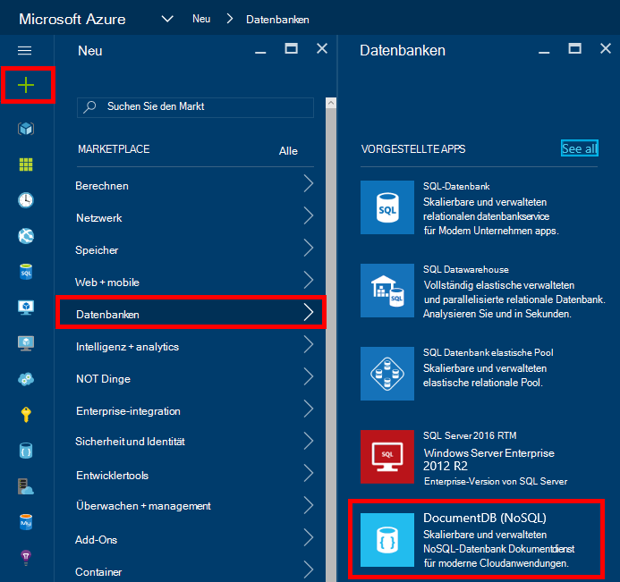
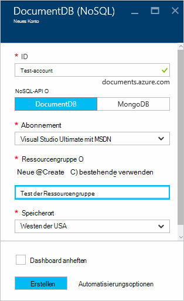
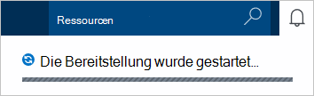
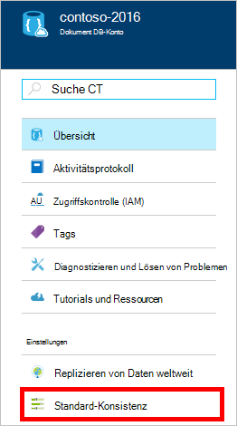
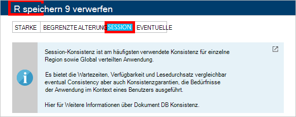

<properties
    pageTitle="Zum Erstellen eines Kontos DocumentDB | Microsoft Azure"
    description="Erstellen einer NoSQL-Datenbank mit Azure DocumentDB. DocumentDB-Konto erstellen und starten die extrem schnelle, globale NoSQL-Datenbank erstellen, gehen Sie wie folgt vor." 
    keywords="Erstellen einer Datenbank"
    services="documentdb"
    documentationCenter=""
    authors="mimig1"
    manager="jhubbard"
    editor="monicar"/>

<tags
    ms.service="documentdb"
    ms.workload="data-services"
    ms.tgt_pltfrm="na"
    ms.devlang="na"
    ms.topic="get-started-article"
    ms.date="10/17/2016"
    ms.author="mimig"/>

# Ein Azure-Portal mit DocumentDB NoSQL-Konto erstellen

> [AZURE.SELECTOR]
- [Azure-portal](documentdb-create-account.md)
- [Azure CLI und Azure Resource Manager](documentdb-automation-resource-manager-cli.md)

Um eine Datenbank mit Microsoft Azure DocumentDB erstellen, müssen Sie:

- Verfügen Sie ein Azure-Konto. Ein [kostenloses Azure-Konto](https://azure.microsoft.com/free) erhalten, wenn Sie nicht bereits eine haben. 
- Erstellen Sie ein Konto DocumentDB.  

Sie können ein DocumentDB-Konto mit einer Azure-Portal, Azure-Ressourcen-Manager Vorlagen oder Azure Befehlszeilenschnittstelle (CLI) erstellen. Dieser Artikel beschreibt, wie ein DocumentDB-Konto über das Azure-Portal erstellen. Zum Erstellen eines Kontos mit Azure Resource Manager oder CLI Azure anzeigen Sie [DocumentDB automatisieren kontoerstellung](documentdb-automation-resource-manager-cli.md)

Möchten Sie neue DocumentDB? Video wird [diese](https://azure.microsoft.com/documentation/videos/create-documentdb-on-azure/) vier Minuten von Scott Hanselman, wie die häufigsten Aufgaben im online-Portal.

1.  Mit der [Azure-Portal](https://portal.azure.com/)anmelden.
2.  Klicken Sie in der Indexleiste auf **neu**, klicken Sie auf **Datenbanken**und klicken Sie **DocumentDB (NoSQL)**. 

      

3. **Neues Konto** Blatt geben Sie die gewünschte Konfiguration für das DocumentDB-Konto an

    

    - Geben Sie im Feld **ID** einen Namen für das Konto DocumentDB.  Wenn die **ID** überprüft wird, wird ein grünes Häkchen im Feld **ID** angezeigt. Der **ID-** Wert wird der Hostname in der URI. Die **ID** enthalten nur Kleinbuchstaben, Zahlen und '-' Zeichen und muss zwischen 3 und 50 Zeichen lang sein. Beachten Sie, dass dieser *documents.azure.com* gewählte Endpunktnamen angefügt wird das Ergebnis der DocumentDB Konto Endpunkt wird.

    - Wählen Sie im **NoSQL-API** Programmiermodells verwenden:
        - **DocumentDB**: die DocumentDB-API steht über .NET, Java, Node.js, Python und JavaScript- [SDKs](documentdb-sdk-dotnet.md)sowie HTTP [REST](https://msdn.microsoft.com/library/azure/dn781481.aspx)und bietet programmgesteuerten Zugriff auf alle DocumentDB-Funktionen. 
       
        - **MongoDB**: DocumentDB auch unterstützt [Protokollebene](documentdb-protocol-mongodb.md) für **MongoDB** APIs. Bei der Option MongoDB-API können vorhandenen MongoDB SDKs und [Tools](documentdb-mongodb-mongochef.md) Sie um mit DocumentDB zu kommunizieren. Können die vorhandenen apps MongoDB Verwendung DocumentDB [keine Änderungen erforderlich](documentdb-connect-mongodb-account.md), [Verschieben](documentdb-import-data.md) und eine vollständig verwaltete Datenbank als Dienst mit unbegrenzten Skalierung, globale Replikation und andere Funktionen nutzen.

    - Wählen Sie für **Abonnements**des Azure-Abonnements, das Sie für das DocumentDB-Konto verwenden möchten. Wenn Ihr Konto nur ein Abonnement verfügt, wird dieses Konto standardmäßig aktiviert.

    - Wählen Sie in **Ressourcengruppe**oder erstellen Sie eine Ressourcengruppe für Ihr Konto DocumentDB.  Standardmäßig wird eine neue Ressourcengruppe erstellt. Weitere Informationen finden Sie unter [Verwenden des Azure-Portals Azure Ressourcen verwalten](../articles/azure-portal/resource-group-portal.md).

    - Verwenden Sie **Speicherort** an den geografischen Standort, Ihr Konto DocumentDB host. 

4.  Sobald die neuen DocumentDB Optionen konfiguriert sind, klicken Sie auf **Erstellen**. Überprüfen Sie den Status der Bereitstellung überprüfen Sie Benachrichtigungen Hub.  

      

    

5.  Nach der Erstellung des DocumentDB-Kontos ist bereit für die Verwendung mit den Standardeinstellungen. **Sitzung**wird standardmäßig Konsistenz des DocumentDB-Kontos festgelegt.  Sie können die Standard-Konsistenz anpassen **Standard Konsistenz** im ressourcenmenü. Erfahren Sie mehr über die angebotenen DocumentDB Konsistenz Sicherheitsstufen Siehe [Konsistenz in DocumentDB](documentdb-consistency-levels.md).

      

      

[How to: Create a DocumentDB account]: #Howto
[Next steps]: #NextSteps
[documentdb-manage]:../articles/documentdb/documentdb-manage.md

## Nächste Schritte

Jetzt haben Sie ein DocumentDB-Konto, besteht der nächste Schritt DocumentDB Auflistung und Datenbank. 

Eine neue Sammlung und Datenbank können mithilfe einer der folgenden:

- Azure-Portal gemäß [eine DocumentDB-Auflistung mithilfe des Azure-Portals erstellen](documentdb-create-collection.md).
- Umfassende Lernprogramme, die Beispieldaten enthalten: [.NET](documentdb-get-started.md) [.NET MVC](documentdb-dotnet-application.md), [Java](documentdb-java-application.md), [Node.js](documentdb-nodejs-application.md)oder [Python](documentdb-python-application.md).
- Der [.NET](documentdb-dotnet-samples.md#database-examples), [Node.js](documentdb-nodejs-samples.md#database-examples)und [Python](documentdb-python-samples.md#database-examples) Beispielcode in GitHub verfügbar.
- Die [.NET](documentdb-sdk-dotnet.md) [Node.js](documentdb-sdk-node.md), [Java](documentdb-sdk-java.md), [Python](documentdb-sdk-python.md)und [REST](https://msdn.microsoft.com/library/azure/mt489072.aspx) SDKs.

Nach dem Erstellen der Datenbank und der Auflistung müssen Sie die Sammlungen [Dokumente hinzufügen](documentdb-view-json-document-explorer.md) .

Wenn Sie Dokumente in einer Auflistung haben, können Sie [DocumentDB SQL](documentdb-sql-query.md) [Abfragen](documentdb-sql-query.md#executing-queries) ausführen für Ihre Dokumente verwenden. Sie können Abfragen mit dem [Abfrage-Explorer](documentdb-query-collections-query-explorer.md) in das Portal, die [REST-API](https://msdn.microsoft.com/library/azure/dn781481.aspx)oder eines [SDKs](documentdb-sdk-dotnet.md)ausführen.

### Weitere Informationen

Erkunden Sie erfahren Sie mehr über DocumentDB:

-   [Lernpfad für DocumentDB](https://azure.microsoft.com/documentation/learning-paths/documentdb/)
-   [Hierarchische Ressourcenmodell DocumentDB und Konzepte](documentdb-resources.md)
