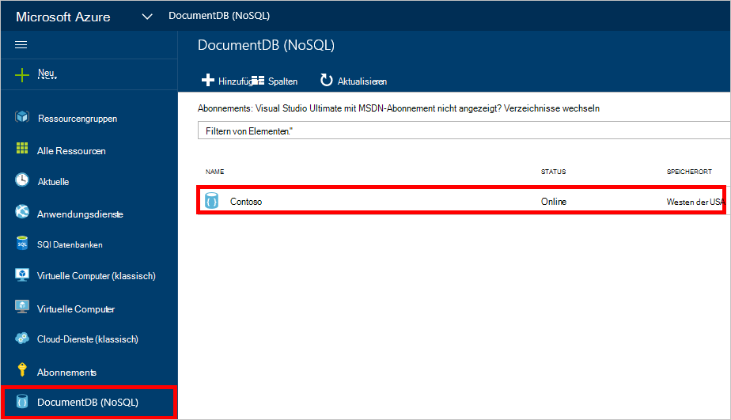
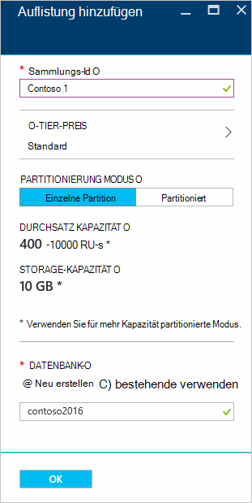
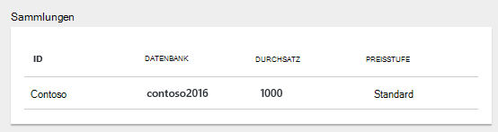
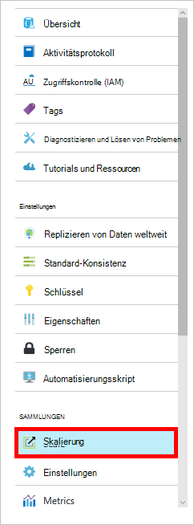

<properties 
    pageTitle="Erstellen einer DocumentDB Datenbank und Auflistung | Microsoft Azure" 
    description="NoSQL-Datenbanken erstellen und JSON Dokumentsammlungen Azure DocumentDB online-Service-Portal über eine cloudbasierte Datenbank. Eine kostenlose Testversion zu erhalten." 
    services="documentdb" 
    authors="mimig1" 
    manager="jhubbard" 
    editor="monicar" 
    documentationCenter=""/>

<tags 
    ms.service="documentdb" 
    ms.workload="data-services" 
    ms.tgt_pltfrm="na" 
    ms.devlang="na" 
    ms.topic="article" 
    ms.date="10/17/2016" 
    ms.author="mimig"/>

# Eine DocumentDB-Sammlung und Azure-Portal-Datenbank erstellen

Um Microsoft Azure DocumentDB verwenden, müssen Sie ein [DocumentDB-Konto](documentdb-create-account.md), eine Datenbank, eine Auflistung und Dokumente. Dieses Thema beschreibt eine DocumentDB Auflistung im Azure-Portal erstellen. 

Ist eine Auflistung? Siehe [Was ist eine Auflistung DocumentDB?](#what-is-a-documentdb-collection)

1.  Im [Azure-Portal](https://portal.azure.com/), in dem Indexleiste auf **DocumentDB (NoSQL)**und **DocumentDB (NoSQL)** Blatt wählen Sie das Konto, eine Sammlung hinzufügen. Haben Sie alle aufgeführten Konten, müssen Sie [ein DocumentDB-Konto](documentdb-create-account.md)erstellen.

    
    
    Wenn **DocumentDB (NoSQL)** nicht in der Indexleiste angezeigt wird, klicken Sie auf **Weitere Dienste** und dann auf **DocumentDB (NoSQL)**. Haben Sie alle aufgeführten Konten, müssen Sie [ein DocumentDB-Konto](documentdb-create-account.md)erstellen.

2. Blatt **DocumentDB-Konto** für das ausgewählte Konto klicken Sie auf **Sammlung hinzufügen**.

    

3. Das Blade **Sammlung hinzufügen** im Feld **ID** Geben Sie die Kennung für die neue Sammlung. Sammlungsnamen muss zwischen 1 und 255 Zeichen lang sein und keine `/ \ # ?` oder ein Leerzeichen. Wenn der Name überprüft wird, wird ein grünes Häkchen im Feld ID angezeigt.

    

4. Standardmäßig ist **Tier Preise** auf **Standard** gesetzt, Durchsatz und Speicher für Ihre Sammlung anpassen können. Weitere Informationen zu den Tarif finden Sie unter [Leistungsmerkmale in DocumentDB](documentdb-performance-levels.md).  

5. Wählen Sie eine **Partitionierung Modus** für die Sammlung **Einzelpartition** oder **Partitioned**. 

    Eine **einzelne Partition** eine reservierte Speicherkapazität von 10 GB und kann haben Durchsatz von 400 10.000 anforderungseinheiten pro Sekunde (RU/s). Ein RU entspricht den Durchsatz für das Lesen eines Dokuments 1KB. Weitere Informationen zu anforderungseinheiten mit anzeigen Sie [anforderungseinheiten](documentdb-request-units.md) 

    Eine **partitionierte Auflistung** können unbegrenzt Speicher über mehrere Partitionen behandeln skalieren und Durchsatz Ebenen 10.100 RU-s haben. In das Portal der größte Speicher behalten können ist 250 GB und die meisten Durchsatz behalten können 250.000 RU-s. Um entweder Kontingent zu erhöhen, einen Antrag gemäß [Anforderung DocumentDB Konto Kontingente erhöht](documentdb-increase-limits.md). Weitere Informationen über partitionierte Sammlungen finden Sie [Einzelpartition und partitioniert](documentdb-partition-data.md#single-partition-and-partitioned-collections).

    Standardmäßig wird der Durchsatz für eine einzelne Partition Kollektion 1000 RU/s mit einer Kapazität von 10 GB festgelegt. Für eine partitionierte Auflistung wird der Durchsatz Auflistung 10100 RU/s mit einer Kapazität von 250 GB festgelegt. Sie können Durchsatz und Speicher für die Auflistung ändern, nachdem die Auflistung erstellt wird. 

6. Wählen Sie beim Erstellen einer partitionierten Auflistung **Partitionsschlüssel** für die Auflistung. Auswählen des richtigen partitionsschlüssels ist eine leistungsfähige Sammlung wichtig. Weitere Informationen zum Auswählen eines partitionsschlüssels finden Sie unter [Entwerfen für die Partitionierung](documentdb-partition-data.md#designing-for-partitioning).

7. Blatt **Datenbank** eine neue Datenbank erstellen oder eine bestehende verwenden. Namen müssen zwischen 1 und 255 Zeichen lang sein und keine `/ \ # ?` oder ein Leerzeichen. Um den Namen zu überprüfen, klicken Sie außerhalb des Textfeldes. Wenn der Name überprüft wird, wird ein grünes Häkchen im Feld angezeigt.

8. Klicken Sie auf **OK** am unteren Bildschirmrand, um die neue Sammlung erstellen. 

9. Jetzt die neue Sammlung wird in der Linse **Sammlungen** Blade- **Übersicht** .
 
    

10. **Optional:** Ändern Sie den Durchsatz der Auflistung im Portal Menü **Skala** der Ressource. 

    

## Was ist eine DocumentDB-Auflistung? 

Eine Auflistung ist ein Container für JSON-Dokumente und zugeordnete JavaScript Anwendungslogik. Eine Auflistung ist eine fakturierbare Entität, die [Kosten](documentdb-performance-levels.md) der bereitgestellten Durchsatz der Auflistung bestimmt. Sammlungen können können ein oder mehrere Partitionen/Server umfassen und um Speicher oder Durchsatz praktisch unbegrenzte Datenmengen verarbeiten.

Sammlungen werden durch DocumentDB automatisch in einem oder mehreren physischen Servern aufgeteilt. Wenn Sie eine Auflistung erstellen, können Sie bereitgestellten Durchsatz Anforderung Einheiten pro Sekunde und eine Schlüsseleigenschaft Partition angeben. Der Wert dieser Eigenschaft wird zum Verteilen von Dokumenten zwischen Partitionen und Anfragen wie Abfragen von DocumentDB verwendet werden. Der Schlüsselwert Partition fungiert auch als Transaktionsgrenze für gespeicherte Prozeduren und Trigger. Jede Auflistung hat eine reservierte Durchsatz für diese Auflistung nicht mit anderen Sammlungen im selben Konto freigegeben wird. Daher können Sie Ihre Anwendung Speicher und Durchsatz geeignet. 

Sammlungen sind nicht dasselbe wie Tabellen in relationalen Datenbanken. Sammlungen Schema nicht erzwungen, tatsächlich DocumentDB erzwingt alle Schemata, Schema frei Datenbank ist. Daher können Sie unterschiedliche Dokumenttypen mit verschiedenen Schemas in derselben Auflistung speichern. Sie können Sammlungen verwenden, um Objekte eines einzelnen Typs wie Tabellen gespeichert. Das geeignetste Modell hängt wie die Daten gleichzeitig in Abfragen und Transaktionen angezeigt.

## Dazu erstellen Sie eine DocumentDB-Auflistung

Sammlungen müssen nicht über das Portal erstellt werden, können Sie auch mit [DocumentDB SDKs](documentdb-sdk-dotnet.md) und die REST-API erstellen. 

- Ein C# -[NULL] Codebeispiel finden Sie unter [Beispiele für C#-Auflistung](documentdb-dotnet-samples.md#collection-examples). 
- Ein Codebeispiel Node.js [Node.js Auflistung Beispiele](documentdb-nodejs-samples.md#collection-examples)anzeigen
- Ein Codebeispiel für Python anzeigen Sie [Python Auflistung Beispiele](documentdb-python-samples.md#collection-examples)
- Ein REST-API finden Sie unter [Erstellen einer Sammlung](https://msdn.microsoft.com/library/azure/mt489078.aspx).

## Problembehandlung

Wenn im Azure-Portal **Sammlung hinzufügen** deaktiviert ist, bedeutet, dass Ihr Konto zurzeit deaktiviert ist die tritt normalerweise alle Vorteile Kredite für den Monat verwendet werden.   

## Nächste Schritte

Jetzt haben Sie eine Sammlung, besteht der nächste Schritt Dokumente hinzufügen oder Importieren von Dokumenten in der Auflistung. Beim Hinzufügen von Dokumenten zu einer Auflistung, haben Sie die Wahl:

- Sie können [Dokumente](documentdb-view-json-document-explorer.md) mithilfe von Document Explorer im Portal.
- Sie können [Dokumente importieren und Daten](documentdb-import-data.md) sowie Daten aus SQL Server, MongoDB Azure Table Storage und sonstige DocumentDB in das DocumentDB Migration-Tool ermöglicht es Ihnen, JSON und CSV-Dateien importieren. 
- Oder Sie können Dokumente mithilfe einer [DocumentDB SDKs](documentdb-sdk-dotnet.md). DocumentDB wurde .NET Java, Python, Node.js und JavaScript API-SDKs. C# Codebeispiele zeigen, wie mit Dokumenten arbeiten, mit dem DocumentDB .NET SDK finden Sie unter [Beispiele für C#-Dokument](documentdb-dotnet-samples.md#document-examples). Node.js Codebeispiele veranschaulichen DocumentDB Node.js SDK mit Dokumenten arbeiten finden Sie unter [Node.js Dokument Beispiele](documentdb-nodejs-samples.md#document-examples).

Wenn Sie Dokumente in einer Auflistung haben, können [DocumentDB SQL](documentdb-sql-query.md) zum [Ausführen von Abfragen](documentdb-sql-query.md#executing-queries) für Dokumente Sie mit dem [Abfrage-Explorer](documentdb-query-collections-query-explorer.md) in das Portal, die [REST-API](https://msdn.microsoft.com/library/azure/dn781481.aspx)oder eines [SDKs](documentdb-sdk-dotnet.md). 
