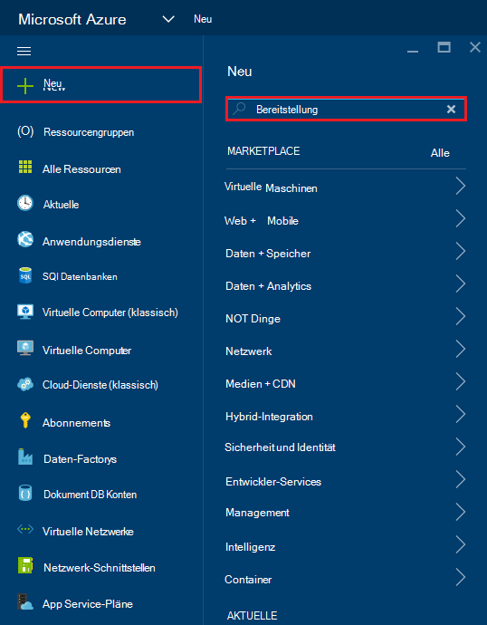
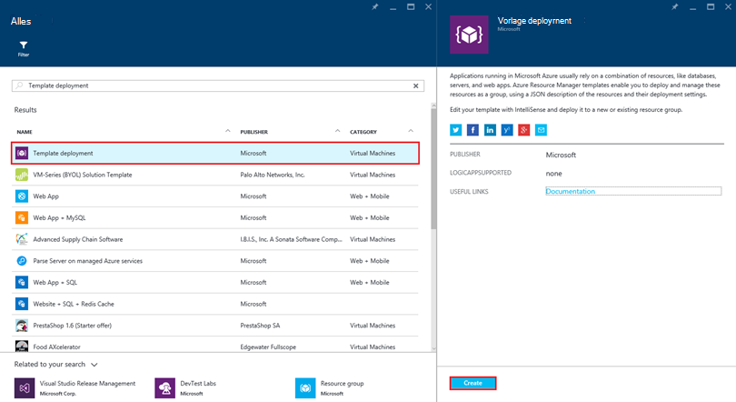
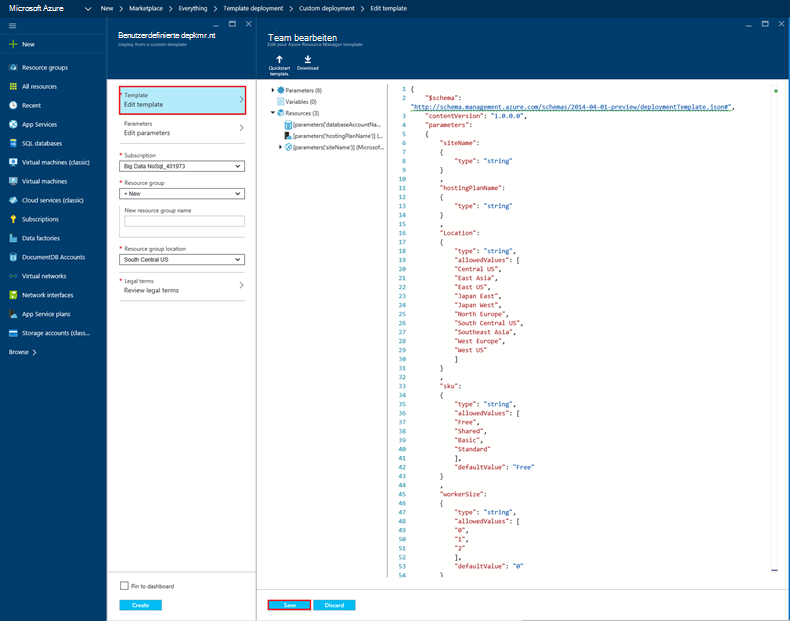
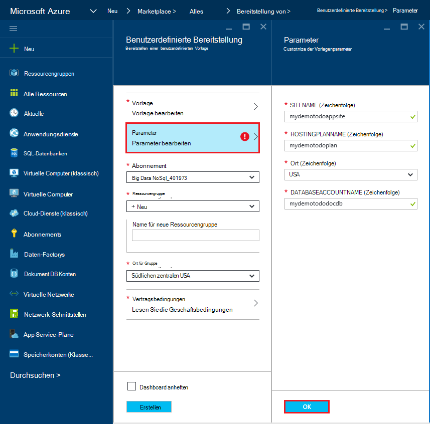
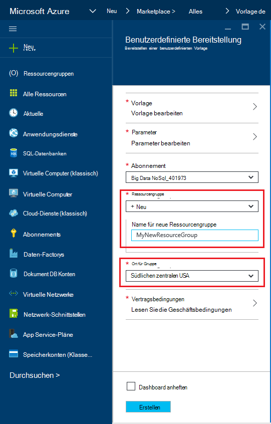
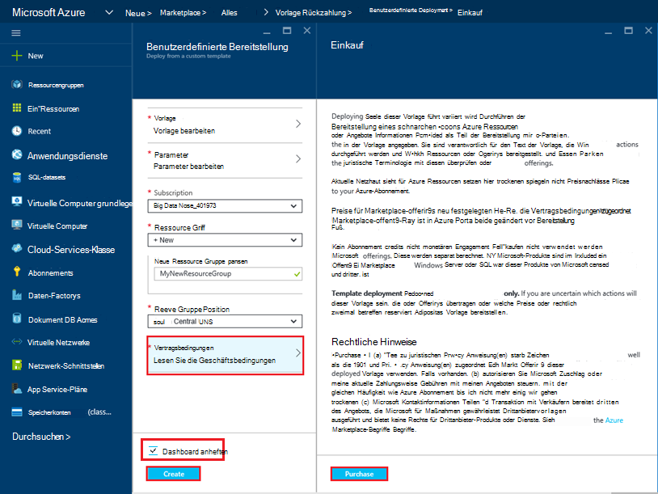
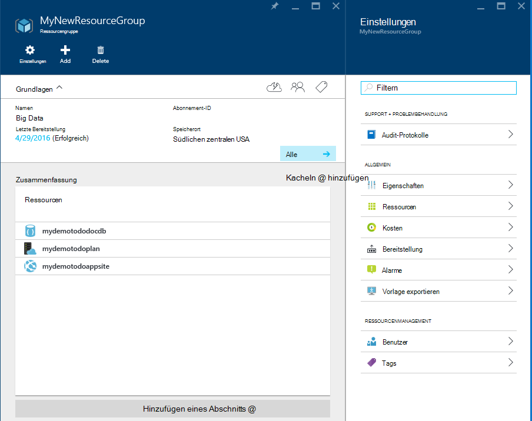
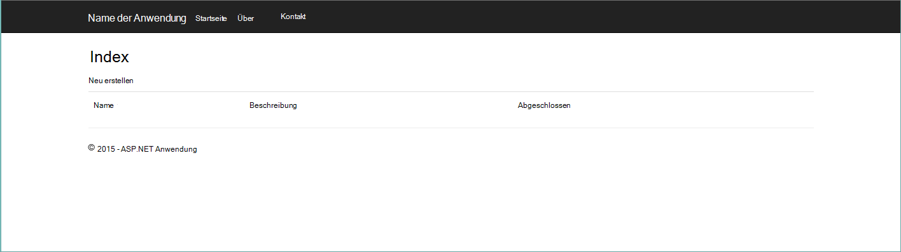
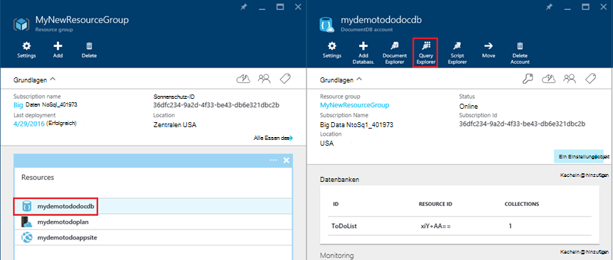
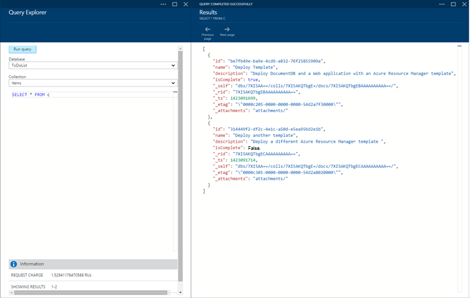

<properties 
    pageTitle="DocumentDB und Azure App Service Web Apps mit einer Azure Ressourcenmanager Vorlage bereitstellen | Microsoft Azure" 
    description="Informationen Sie zum DocumentDB-Konto, Azure App Service Web Apps und ein Beispiel Web-Anwendung mit einer Azure-Ressourcen-Manager-Vorlage bereitstellen." 
    services="documentdb, app-service\web" 
    authors="h0n" 
    manager="jhubbard" 
    editor="monicar" 
    documentationCenter=""/>

<tags 
    ms.service="documentdb" 
    ms.workload="data-services" 
    ms.tgt_pltfrm="na" 
    ms.devlang="na" 
    ms.topic="article" 
    ms.date="08/02/2016" 
    ms.author="hawong"/>

# Bereitstellen Sie DocumentDB und Azure App Service Web Apps mit einer Azure-Ressourcen-Manager-Vorlage

In diesem Lernprogramm wird das Verwenden einer Vorlage Azure Ressourcenmanager Bereitstellung und Integration von [Microsoft Azure DocumentDB](https://azure.microsoft.com/services/documentdb/), eine [Azure App Service](http://go.microsoft.com/fwlink/?LinkId=529714) Web app und eine beispielanwendung veranschaulicht.

Mithilfe von Azure-Ressourcen-Manager-Vorlagen können Sie die Bereitstellung und Konfiguration von Azure Ressourcen problemlos automatisieren.  Dieses Tutorial zeigt eine Anwendung bereitstellen und DocumentDB Information zur Verbindung automatisch zu konfigurieren.

Am Ende dieses Lernprogramms werden Sie die folgenden Fragen beantworten:  

-   Wie kann ich eine Vorlage Azure-Ressourcen-Manager verwenden, Bereitstellung und Integration von DocumentDB-Konto und eine Webanwendung in Azure App Service?
-   Wie kann ich eine Vorlage Azure-Ressourcen-Manager verwenden, Bereitstellung und Integration DocumentDB-Konto, eine app Web App Service Web Apps und Webdeploy-Anwendung?

## Erforderliche Komponenten
> [AZURE.TIP] Während dieses Lernprogramm Erfahrung mit Azure Ressourcenmanager Vorlagen oder JSON nicht angenommen, werden referenzierte Vorlagen oder Bereitstellungsoptionen ändern möchten Kenntnisse in jedem dieser Bereiche erforderlich.

Sicherzustellen Sie vor Instruktionen in dieser praktischen Einführung, dass Sie Folgendes:

- Ein Azure-Abonnement. Azure ist ein Abonnement-basierten Plattform.  Weitere Informationen über den Erwerb eines Abonnements finden Sie unter [Optionen](https://azure.microsoft.com/pricing/purchase-options/) [Bietet Member](https://azure.microsoft.com/pricing/member-offers/)oder [Testversion](https://azure.microsoft.com/pricing/free-trial/).

##Schritt 1: Herunterladen der Vorlagendateien ##
Zunächst die Vorlagendateien verwenden wir in diesem Lernprogramm wird heruntergeladen.

1. Downloaden Sie die Vorlage [DocumentDB Konto Web Apps erstellen und Bereitstellen einer Demo Anwendungsbeispiel](https://portalcontent.blob.core.windows.net/samples/DocDBWebsiteTodo.json) in einen lokalen Ordner (z.B. C:\DocumentDBTemplates). Diese Vorlage wird ein DocumentDB-Konto, eine App Service Web app und einer Web-Anwendung bereitstellen.  Web-Anwendung DocumentDB-Konto verbinden wird automatisch konfigurieren.

2. Downloaden Sie die Vorlage [DocumentDB Konto erstellen und Web Apps Beispiel](https://portalcontent.blob.core.windows.net/samples/DocDBWebSite.json) in einen lokalen Ordner (z.B. C:\DocumentDBTemplates). Dieser Vorlage bereitstellen DocumentDB-Konto, eine App Service Web app und Ändern der Website Anwendungseinstellungen problemlos Informationen DocumentDB Fläche jedoch umfasst eine Anwendung nicht.  

##Schritt 2: Bereitstellen von DocumentDB-Konto, App Web app und Demo Anwendungsbeispiel

Jetzt sehen wir unsere erste Vorlage bereitstellen.

> [AZURE.TIP] Die Vorlage überprüft nicht, dass dem Web app Name und DocumentDB unten eingegebenen gültigen (a) und b) verfügbar sind.  Es empfiehlt sich, die Verfügbarkeit der Namen Sie überprüfen vor der Bereitstellung angeben möchten.

1. Anmeldung bei [Azure-Portal](https://portal.azure.com), klicken Sie auf neu und suchen Sie nach "vorlagenbereitstellung".
    

2. Das Bereitstellungselement Vorlage auswählen und auf **Erstellen**
    

3.  Klicken Sie auf **Vorlage bearbeiten**, fügen Sie den Inhalt der Datei Vorlage DocDBWebsiteTodo.json und klicken Sie auf **Speichern**.
    

4. Klicken Sie auf **Parameter bearbeiten**, geben Sie Werte für die obligatorischen Parameter und klicken Sie auf **OK**.  Die Parameter lauten:

    1. SITENAME: Gibt die App Web app Dienstname und wird verwendet, um die URL zu erstellen, mit denen Sie Zugriff auf die Webanwendung (z. B. Wenn Sie "Mydemodocdbwebapp" angeben, URL, Web app greift, mydemodocdbwebapp.azurewebsites.net).

    2. HOSTINGPLANNAME: Gibt den Namen der App Service-Hosting-Plan erstellen.

    3. Ort: Gibt den Azure Speicherort, DocumentDB und Web app Ressourcen erstellen.

    4. DATABASEACCOUNTNAME: Gibt den Namen des DocumentDB-Kontos zu erstellen.   

    

5. Wählen Sie eine vorhandene Ressourcengruppe oder eine neue Ressourcengruppe zu benennen Sie und wählen Sie einen Speicherort für die Ressourcengruppe.
    
  
6.  Auf **rechtlich überprüfen**, **Kauf**, und klicken Sie auf **Erstellen** , um die Bereitstellung zu starten.  Wählen Sie **Pin Dashboard** die resultierende Bereitstellung einfach auf Azure Portal Startseite angezeigt wird aus.
    

7.  Nach Abschluss die Bereitstellung wird das Ressource Blatt geöffnet.
      

8.  Um die Anwendung zu verwenden, navigieren Sie einfach zu Web app-URL (im obigen Beispiel die URL wäre http://mydemodocdbwebapp.azurewebsites.net).  Sie sehen die folgende Webanwendung:

    

9. Nun erstellen Sie eine Reihe von Aufgaben im Web app und zurück zu der Ressource Blatt im Azure-Portal. Klicken Sie auf die DocumentDB Ressource in der Liste, und klicken Sie auf **Abfrage-Explorer**.
      

10. Standardabfrage, "SELECT *FROM c" ausführen und die Ergebnisse.  Beachten Sie, dass die Abfrage die JSON-Repräsentation von Todo-Elementen in Schritt 7 oben erstellten abgerufen hat.  Mit Abfragen experimentieren können; Beispielsweise führen Sie wählen* aus C WHERE c.isComplete = True, wenn alle Aufgaben zurück, die als erledigt gekennzeichnet wurden.

    

11. Zögern Sie DocumentDB Portalfunktionalität oder Beispiel Todo Anwendung ändern.  Wenn Sie bereit sind, lassen Sie uns eine andere Vorlage bereitstellen.
    
 
## Schritt 3: Bereitstellung Dokument Konto und Web app-Beispiel

Jetzt sehen wir unsere zweite Vorlage bereitstellen.  Diese Vorlage ist nützlich zu zeigen, wie Sie Verbindungsinformationen wie Konto Endpunkt und Hauptschlüssel DocumentDB Web App Einstellungen oder eine benutzerdefinierte Verbindungszeichenfolge einfügen können. Beispielsweise haben Sie vielleicht eine eigene Web-Anwendung soll mit einem DocumentDB-Konto bereitstellen und die Verbindungsinformationen während der Bereitstellung automatisch ausgefüllt.

> [AZURE.TIP] Die Vorlage überprüft nicht, dass dem Web app Name und DocumentDB unten eingegebenen gültigen (a) und b) verfügbar sind.  Es empfiehlt sich, die Verfügbarkeit der Namen Sie überprüfen vor der Bereitstellung angeben möchten.

1. Klicken Sie im [Azure-Portal](https://portal.azure.com)neu und suchen Sie nach "vorlagenbereitstellung".
    

2. Das Bereitstellungselement Vorlage auswählen und auf **Erstellen**
    

3.  Klicken Sie auf **Vorlage bearbeiten**, fügen Sie den Inhalt der Datei Vorlage DocDBWebSite.json und klicken Sie auf **Speichern**.
    

4. Klicken Sie auf **Parameter bearbeiten**, geben Sie Werte für die obligatorischen Parameter und klicken Sie auf **OK**.  Die Parameter lauten:

    1. SITENAME: Gibt die App Web app Dienstname und wird verwendet, um die URL zu erstellen, mit denen Sie Zugriff auf die Webanwendung (z. B. Wenn Sie "Mydemodocdbwebapp" angeben, URL, Web app greift, mydemodocdbwebapp.azurewebsites.net).

    2. HOSTINGPLANNAME: Gibt den Namen der App Service-Hosting-Plan erstellen.

    3. Ort: Gibt den Azure Speicherort, DocumentDB und Web app Ressourcen erstellen.

    4. DATABASEACCOUNTNAME: Gibt den Namen des DocumentDB-Kontos zu erstellen.   

    

5. Wählen Sie eine vorhandene Ressourcengruppe oder eine neue Ressourcengruppe zu benennen Sie und wählen Sie einen Speicherort für die Ressourcengruppe.
    
  
6.  Auf **rechtlich überprüfen**, **Kauf**, und klicken Sie auf **Erstellen** , um die Bereitstellung zu starten.  Wählen Sie **Pin Dashboard** die resultierende Bereitstellung einfach auf Azure Portal Startseite angezeigt wird aus.
    

7.  Nach Abschluss die Bereitstellung wird das Ressource Blatt geöffnet.
      

8. Auf die Ressource Web App in der Liste und klicken Sie auf **Einstellungen**
      

9. Hinweis wie Einstellungen für den Endpunkt DocumentDB und DocumentDB-Hauptschlüssel vorhanden.
      

10. Gerne weiter Azure-Portal oder einen unserer DocumentDB [Proben](http://go.microsoft.com/fwlink/?LinkID=402386) Ihrer DocumentDB-Anwendung erstellen.

    
    

## Nächste Schritte

Herzlichen Glückwunsch! Sie haben DocumentDB App Service WebApp und ein Beispiel Webanwendung Azure Resource Manager Vorlagen bereitgestellt.

- Um weitere Informationen zu DocumentDB klicken Sie [hier](http://azure.com/docdb).
- Erfahren Sie mehr über Azure App Service Web apps klicken Sie [hier](http://go.microsoft.com/fwlink/?LinkId=325362).
- Weitere Vorlagen Azure-Ressourcen-Manager, klicken Sie [hier](https://msdn.microsoft.com/library/azure/dn790549.aspx).

## Was hat sich geändert
* Eine Anleitung zur Änderung von Websites zu App Service finden Sie unter: [Azure App Service und seine Auswirkung auf vorhandene Azure Services](http://go.microsoft.com/fwlink/?LinkId=529714)
* Eine Anleitung zum Ändern der alten Portal neue Portal finden Sie unter: [Verweis zum Navigieren in der Azure-Verwaltungsportal](http://go.microsoft.com/fwlink/?LinkId=529715)

>[AZURE.NOTE] Wenn Sie mit Azure App Service beginnen, bevor Sie sich für ein Azure-Konto, gehen Sie [Versuchen App Service](http://go.microsoft.com/fwlink/?LinkId=523751)sofort eine kurzlebige Starter Web app in App Service können Sie erstellen. Keine Kreditkarten erforderlich; keine Zusagen.
 
