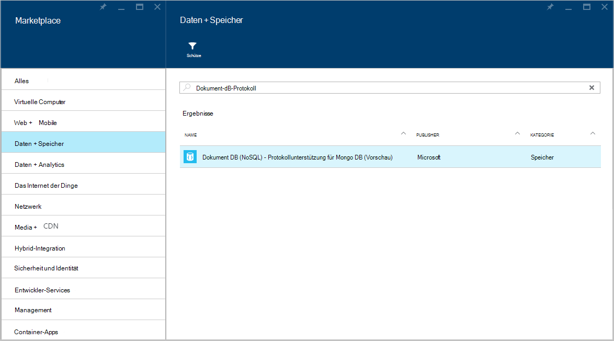
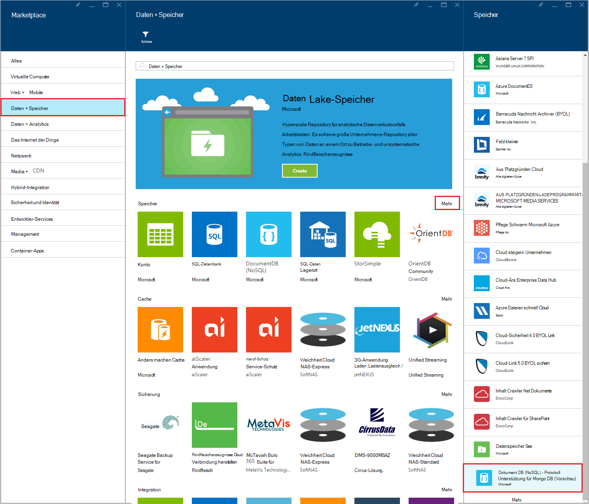
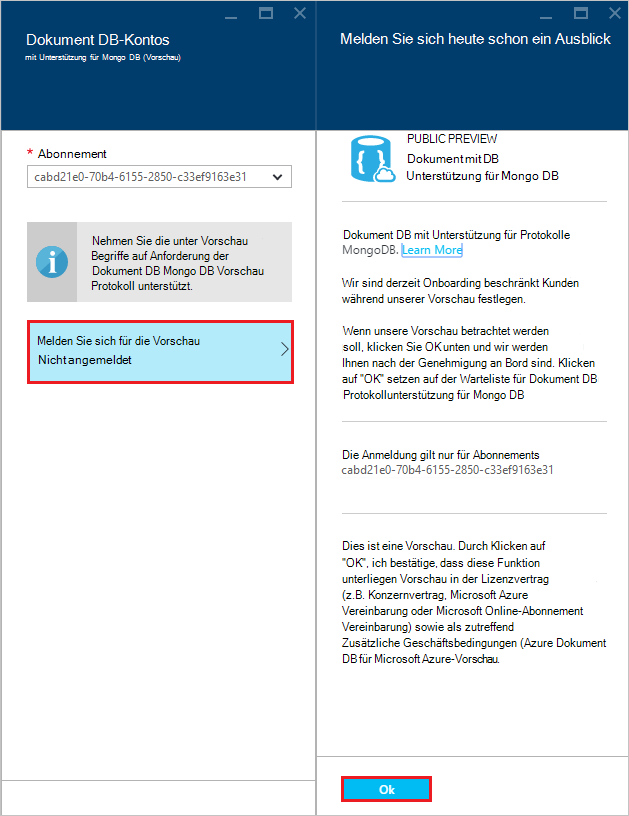
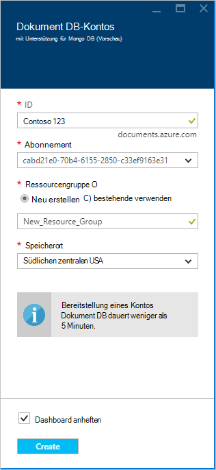
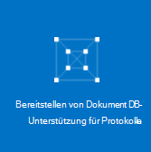
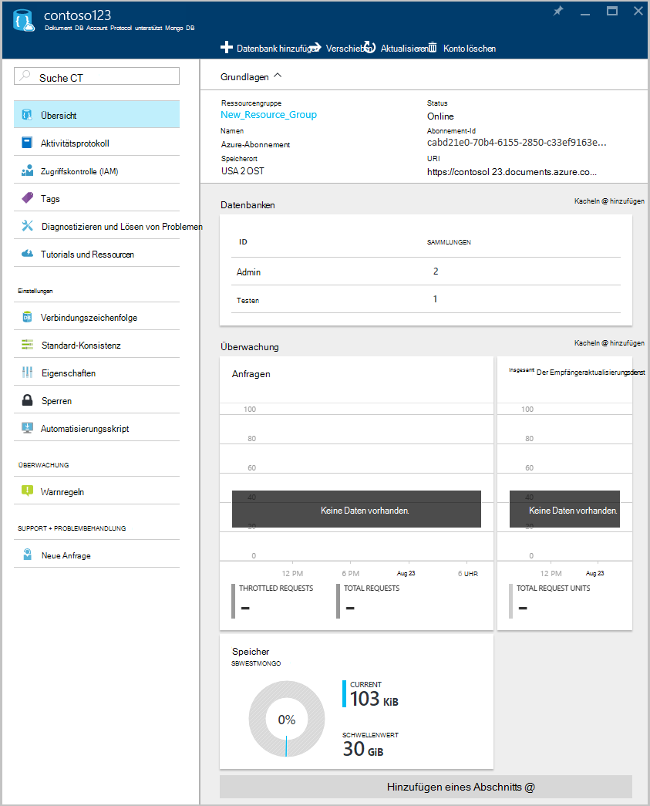

<properties 
    pageTitle="Erstellen Sie ein Konto DocumentDB Protokoll unterstützt MongoDB | Microsoft Azure" 
    description="Erfahren Sie, wie ein DocumentDB Protokoll unterstützt MongoDB, jetzt Vorschau erstellen." 
    services="documentdb" 
    authors="AndrewHoh" 
    manager="jhubbard" 
    editor="" 
    documentationCenter=""/>

<tags 
    ms.service="documentdb" 
    ms.workload="data-services" 
    ms.tgt_pltfrm="na" 
    ms.devlang="na" 
    ms.topic="article" 
    ms.date="10/20/2016" 
    ms.author="anhoh"/>

# Protokoll unterstützt Azure-Portal mit MongoDB DocumentDB-Konto erstellen

Zum Erstellen eines Kontos Azure DocumentDB Protokoll unterstützt MongoDB erforderlich:

- Verfügen Sie ein Azure-Konto. Ein [kostenloses Azure-Konto](https://azure.microsoft.com/free/) erhalten, wenn Sie nicht bereits eine haben.

## Konto erstellen  

Gehen Sie zum Erstellen eines Kontos DocumentDB MongoDB Protokoll unterstützt.

1. Melden Sie sich in einem neuen Fenster der [Azure-Portal](https://portal.azure.com)an.
2. Klicken Sie auf **neu**, klicken Sie auf **Daten + Speicher**klicken Sie auf **Alle**und suchen Sie Kategorie **Daten + Speicher** "DocumentDB Protokoll". Klicken Sie auf **DocumentDB - Protokollunterstützung für MongoDB**.

    

3. Alternativ Kategorie **Daten + Speicher** unter den **Speicher**, klicken Sie auf **Weitere**, und klicken Sie **mehr** mindestens einmal **DocumentDB - Protokollunterstützung für MongoDB**angezeigt. Klicken Sie auf **DocumentDB - Protokollunterstützung für MongoDB**.

    

4. Blatt **DocumentDB - Protokollunterstützung für MongoDB (Vorschau)** klicken Sie auf **Erstellen** , um den Anmeldeprozess Vorschau zu starten.

    

5. Blatt **DocumentDB-Kontos** klicken Sie auf **Vorschau anmelden**. Lesen Sie die Informationen, und klicken Sie dann auf **OK**.

    

6.  Nach Annahme der Vorschau, wird das Blade erstellen zurückgegeben.  Blatt **DocumentDB Konto** Geben Sie die gewünschte Konfiguration für das Konto.

    

    - Geben Sie im Feld **ID** einen Namen für das Konto ein.  Wenn die **ID** überprüft wird, wird ein grünes Häkchen im Feld **ID** angezeigt. Der **ID-** Wert wird der Hostname in der URI. Die **ID** enthalten nur Kleinbuchstaben, Zahlen und '-' Zeichen und muss zwischen 3 und 50 Zeichen lang sein. Beachten Sie, dass, *documents.azure.com* gewählte Endpunktnamen angefügt wird das Ergebnis der Endpunkt Konto werden.

    - Wählen Sie für **Abonnements**des Azure-Abonnements, das Sie für das Konto verwenden möchten. Wenn Ihr Konto nur ein Abonnement verfügt, wird dieses Konto standardmäßig aktiviert.

    - Wählen Sie in **Ressourcengruppe**oder erstellen Sie eine Ressourcengruppe für das Konto.  Standardmäßig wird eine vorhandene Ressourcengruppe Azure Abonnements ausgewählt.  Sie können jedoch eine neue Ressourcengruppe erstellen, Sie das Konto hinzuzufügen möchten. Weitere Informationen finden Sie unter [Verwenden des Azure-Portals Azure Ressourcen verwalten](resource-group-portal.md).

    - Verwenden Sie **Speicherort** an den geografischen Standort, das Konto zu hosten.
    
    - Optional: Kontrollkästchen **Pin Dashboard**. Wenn Dashboard fixiert, führen Sie **Schritt 8** weiter unten zum linken Navigationsbereich das neue Konto anzeigen.

7.  Sobald die neuen Optionen konfiguriert sind, klicken Sie auf **Erstellen**.  Es dauert einige Minuten das Konto erstellen.  Wenn fixiert dem Dashboard können Sie die Bereitstellung bei dem Startmenü überwachen.  
      

    Wenn das Dashboard nicht fixiert, können Sie die vom Hub Benachrichtigung überwachen.  

      

    

8.  Klicken Sie Ihr neue Konto **DocumentDB (NoSQL)** auf der linken Seite. Klicken Sie auf Ihr neues Konto in der Liste der regulären DocumentDB und DocumentDB mit Mongo-Protokoll unterstützt.

9.  Es ist jetzt bereit für die Verwendung mit den Standardeinstellungen. 

    
    

## Nächste Schritte

- Erfahren Sie, wie [herstellen](documentdb-connect-mongodb-account.md) einer DocumentDB-Konto mit Unterstützung für MongoDB.

 
