<properties 
    pageTitle="ASP.NET MVC-Lernprogramm für DocumentDB: Webanwendungsentwicklung | Microsoft Azure" 
    description="ASP.NET MVC-Lernprogramm ein MVC-Webanwendungsprojekt mit DocumentDB erstellen. Sie speichern die JSON und Zugriff auf Daten aus einer Todo app auf Azure Websites - ASP-NET-MVC-Lernprogramm Schritt gehostet." 
    keywords="ASP.NET Mvc Tutorial Webanwendungsentwicklung Mvc Webanwendungsprojekt, Asp-net Mvc-Lernprogramm Schritt für Schritt"
    services="documentdb" 
    documentationCenter=".net" 
    authors="syamkmsft" 
    manager="jhubbard" 
    editor="cgronlun"/>

<tags 
    ms.service="documentdb" 
    ms.workload="data-services" 
    ms.tgt_pltfrm="na" 
    ms.devlang="dotnet" 
    ms.topic="hero-article" 
    ms.date="08/25/2016" 
    ms.author="syamk"/>

# ASP.NET MVC-Lernprogramm: Webanwendungsentwicklung mit DocumentDB

> [AZURE.SELECTOR]
- [.NET](documentdb-dotnet-application.md)
- [Node.js](documentdb-nodejs-application.md)
- [Java](documentdb-java-application.md)
- [Python](documentdb-python-application.md) 

Wie effizient nutzen Azure DocumentDB speichern und Abfrage JSON Dokumente dieser Artikel bietet eine End-to-End-Anleitung zeigt, wie einer Todo App mit Azure DocumentDB hervorzuheben. Die Aufgaben werden als JSON-Dokumente in Azure DocumentDB gespeichert.

Diese exemplarische Vorgehensweise veranschaulicht das Verwenden von Azure bereitgestellten DocumentDB-Dienstes zum Speichern und Abrufen von Daten aus einer ASP.NET MVC-Webanwendungsprojekt auf Azure gehostet. Wenn Sie ein Lernprogramm, die nur auf DocumentDB und nicht die ASP.NET MVC-Komponenten suchen, finden Sie unter [DocumentDB C# Konsolenanwendungsprojekt erstellen](documentdb-get-started.md).

> [AZURE.TIP] In diesem Lernprogramm wird vorausgesetzt, dass Sie Erfahrung mit ASP.NET MVC und Azure Websites. Wenn Sie ASP.NET oder [erforderlichen Tools](#_Toc395637760)vertraut sind, empfehlen wir vollständigen Beispielprojekt herunterladen, von [GitHub][] und wie in diesem Beispiel. Sobald Sie erstellt haben, können Sie diesem Artikel Einblick in den Code im Kontext des Projekts zu überprüfen.

## Voraussetzung für dieses Lernprogramm

Vor der Instruktionen in diesem Artikel sollten Sie sicherstellen, dass Sie über Folgendes verfügen:

- Ein aktives Azure-Konto. Wenn Sie ein Konto haben, können Sie ein kostenloses Testabo in wenigen Minuten erstellen. Weitere Informationen finden Sie unter [Azure-Testversion](https://azure.microsoft.com/pricing/free-trial/).
- [Visual Studio 2015](http://www.visualstudio.com/) oder Visual Studio 2013 Update 4 oder höher. Wenn Visual Studio 2013 verwenden, müssen Sie das [Nuget-Paket Microsoft.Net.Compilers](https://www.nuget.org/packages/Microsoft.Net.Compilers/) Unterstützung für C# 6.0 installieren. 
- Azure SDK für .NET Version 2.5.1 oder höher, erhältlich unter [Microsoft-Webplattform-Installer][].

Die Screenshots in diesem Artikel wurden mit Visual Studio 2013 Update 4 angewendet und Azure SDK für .NET Version 2.5.1. Wenn Ihr System mit verschiedenen Versionen ist es möglich, dass die Bildschirme und Optionen wird nicht vollständig übereinstimmen, aber erfüllt die oben aufgeführten Komponenten dieser Lösung sollten konfiguriert ist.

## Schritt 1: Erstellen einer DocumentDB Konto

Beginnen wir mit der Erstellung eines DocumentDB. Wenn Sie bereits über ein Konto verfügen, können Sie zum [Erstellen einer ASP.NET MVC-Anwendung](#_Toc395637762)überspringen.

[AZURE.INCLUDE [documentdb-create-dbaccount](../../includes/documentdb-create-dbaccount.md)]

[AZURE.INCLUDE [documentdb-keys](../../includes/documentdb-keys.md)]

 
Wir gehen jetzt durch ein neues ASP.NET MVC-Anwendung von Grund auf erstellen. 

## Schritt 2: Erstellen einer ASP.NET MVC-Anwendung

Jetzt haben Sie ein Konto erstellen neue ASP.NET Projekt.

1. In Visual Studio im Menü **Datei** auf **neu**zeigen Sie und dann auf **Projekt**.

    Das Dialogfeld **Neues Projekt** angezeigt wird.
2. Klicken Sie im Bereich **Projekttypen** erweitern Sie **Vorlagen**, **Visual C#**, **Web**und aktivieren Sie **ASP.NET Web Application**.

    

3. Geben Sie im Feld **Name** den Namen des Projekts. Diese praktische Einführung verwendet das Namen "Todo". Möchten Sie etwas darüber, wo Todo-Namespace dieses Lernprogramm spricht müssen Sie angegebene Codebeispiele zu verwenden, was die Anwendung namens anpassen. 

4. Klicken Sie auf **Durchsuchen** , um zu dem Ordner navigieren, wo möchten Sie das Projekt erstellen und dann auf **OK**.

    Das Dialogfeld **Neues Projekt von ASP.NET** .

    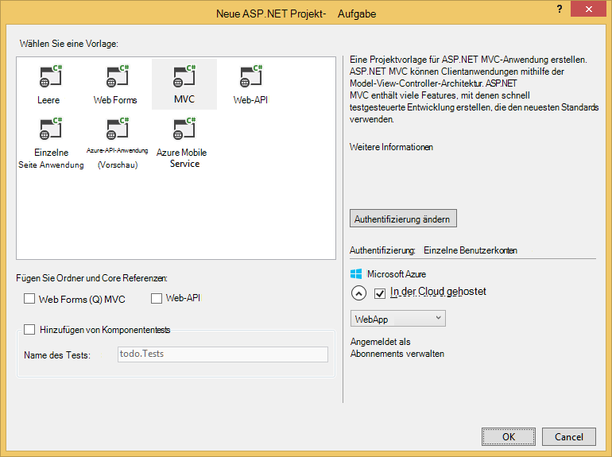

5. Wählen Sie im Bereich Vorlagen **MVC**.

6. Wenn Sie beabsichtigen, Ihre Anwendung in Azure wählen Sie **Host in der Cloud** rechts Azure die Anwendung haben. Wir haben in der Cloud gehostet und führen Sie die Anwendung in Azure-Website ausgewählt. Diese Option wird ein Azure-Website für Sie ausgewählt und machen das Leben leichter bei funktionierende Anwendung bereitstellen. Wenn diese an anderer Stelle hosten möchten oder im Voraus Azure konfigurieren möchten deaktivieren Sie nur **Host in der Cloud**.

7. Klicken Sie auf **OK** , und lassen Sie Visual Studio führe um Gerüstbau leere ASP.NET MVC-Vorlage. 

8. Wenn Sie dies in der Cloud hosten Sie mindestens einen zusätzlichen Bildschirm Azure-Konto anmelden und einige Werte für Ihre neue Website sehen möchten. Alle weiteren Werte eingeben und fortfahren. 

    Ich habe nicht "Datenbankserver" hier gewählt, da wir eine Azure SQL-Datenbankserver nicht hier verwenden, werden wir ein neues Azure DocumentDB Konto später in Azure-Portal erstellen.

    Weitere Informationen zum Auswählen einer **App Service-Plan** und **Ressourcengruppe**anzeigen Sie [Azure App Service-Pläne ausführliche Übersicht](../app-service/azure-web-sites-web-hosting-plans-in-depth-overview.md)

    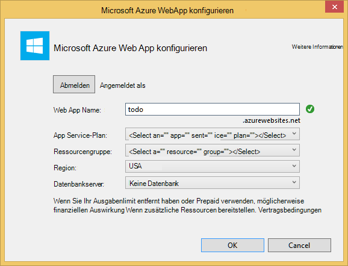

9. Visual Studio erstellt wurde dem Codebaustein MVC-Anwendung haben Sie eine leere ASP.NET Anwendung, die Sie lokal ausführen können.

    Das Projekt ausgeführt wird, lokal, da sicher wir alle kennen ASP.NET "Hello World" übersprungen werden Anwendung. Gehen Sie wir direkt zu diesem Projekt DocumentDB hinzufügen und unsere Anwendung.

## Schritt 3: Das MVC-Webanwendungsprojekt DocumentDB hinzufügen

Jetzt haben wir den ASP.NET MVC überwiegenden Teil, die wir für diese Lösung benötigen, lassen den wahren Zweck dieser praktischen Einführung unserer MVC Webanwendungsprojekt Azure DocumentDB hinzufügen.

1. DocumentDB .NET SDK enthalten und als NuGet-Paket verteilt. Um das NuGet-Paket in Visual Studio abzurufen, verwenden Sie die NuGet-Paket-Manager in Visual Studio mit der rechten Maustaste auf das Projekt im **Projektmappen-Explorer** klicken **NuGet-Pakete verwalten**.

    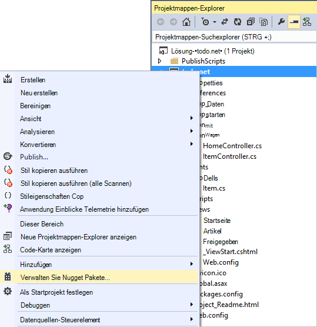

    Das Dialogfeld " **NuGet-Pakete verwalten** " angezeigt wird.

2. Geben Sie im Feld NuGet **Durchsuchen** ***Azure DocumentDB***.
    
    Installieren Sie **Microsoft Azure DocumentDB-Clientbibliothek** Paket aus den Ergebnissen. Dies wird downloaden und Installieren der DocumentDB sowie alle Abhängigkeiten wie Newtonsoft.Json. Klicken Sie auf **OK** im **Vorschaufenster** und **akzeptieren** im Fenster **Akzeptieren einer Lizenz** um die Installation abzuschließen.

    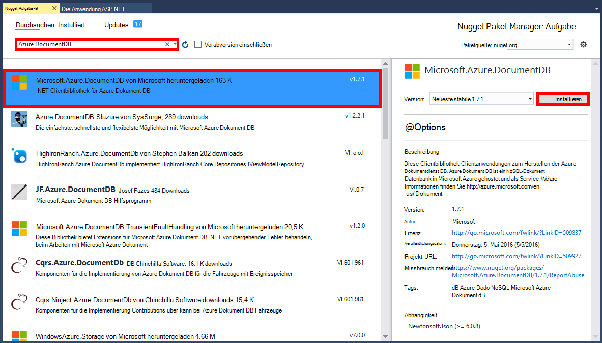

    Paket-Manager-Konsole können Sie auch um das Paket zu installieren. Klicken Sie dazu im Menü **Extras** auf **NuGet Paket-Manager**und klicken Sie dann auf **Paket-Manager-Konsole**. Aufgefordert werden Geben Sie Folgendes ein:

        Install-Package Microsoft.Azure.DocumentDB

3. Nach der Installation des Pakets in etwa die Visual Studio-Projektmappe mit zwei neue Referenzen hinzugefügt, Microsoft.Azure.Documents.Client und Newtonsoft.Json.

    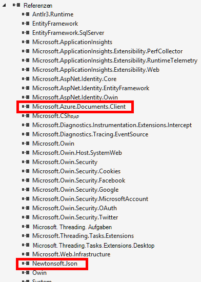

##Schritt 4: Einrichten der ASP.NET MVC-Anwendung
 
Nun fügen Sie Modelle, Ansichten und Controller zu MVC-Anwendung:

- [Hinzufügen eines Modells](#_Toc395637764).
- [Ein Controller hinzufügen](#_Toc395637765).
- [Hinzufügen von Ansichten](#_Toc395637766).

### Ein JSON-Datenmodell hinzufügen

Beginnen wir mit der **M** in MVC-Modell erstellen. 

1. Im **Projektmappen-Explorer**mit der rechten Maustaste des Ordners **Models** , klicken Sie auf **Hinzufügen**und dann auf **Klasse**.

    Das Dialogfeld **Neues Element hinzufügen** wird angezeigt.

2. Nennen Sie die neue Klasse **Item.cs** , und klicken Sie auf **Hinzufügen**. 

3. Fügen Sie diese neue Datei **Item.cs** folgende nach der letzten *Anweisung*.
        
        using Newtonsoft.Json;
    
4. Nun ersetzen Sie diesen code 
        
        public class Item
        {
        }

    durch den folgenden Code.

        public class Item
        {
            [JsonProperty(PropertyName = "id")]
            public string Id { get; set; }
             
            [JsonProperty(PropertyName = "name")]
            public string Name { get; set; }

            [JsonProperty(PropertyName = "description")]
            public string Description { get; set; }

            [JsonProperty(PropertyName = "isComplete")]
            public bool Completed { get; set; }
        }

    Alle Daten in DocumentDB per Kabel übertragen und gespeichert als JSON. Um zu steuern, sind die Objekte von JSON.NET Sie das **JsonProperty** -Attribut verwenden können, wie in der Klasse **Element** gerade erstellte serialisiert/deserialisiert. Sie **müssen** dazu aber sicherstellen, dass meine Eigenschaften JSON CamelCase-Namenskonventionen entsprechen soll. 
    
    Nicht nur können Sie steuern das Format des Eigenschaftennamens geht in JSON, aber Sie können Eigenschaften von .NET vollständig umbenennen, wie mit der **Description** -Eigenschaft. 
    

### Fügen Sie einen controller

Die übernimmt **M**jetzt wir **C** in MVC eine Controller-Klasse erstellen.

1. Im **Projektmappen-Explorer**mit der rechten Maustaste in **des Ordners** , klicken Sie auf **Hinzufügen**und klicken Sie auf **Controller**.

    Das Dialogfenster **Scaffold hinzufügen** .

2. Wählen Sie **MVC 5 Controller - leer** , und klicken Sie auf **Hinzufügen**.

    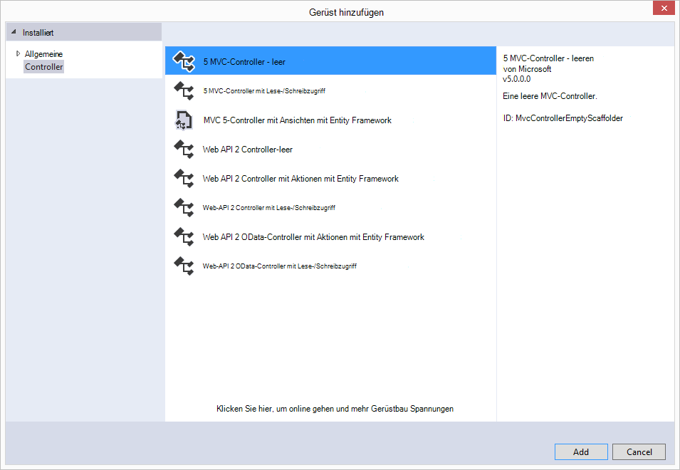

3. Nennen Sie die neue Controller **ItemController.**

    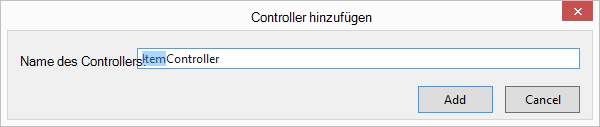

    Nachdem die Datei erstellt wurde, sollte die Visual Studio-Projektmappe mit der neuen ItemController.cs-Datei im **Projektmappen-Explorer**folgendermaßen aussehen. Die zuvor erstellte neue Item.cs Datei wird ebenfalls angezeigt.

    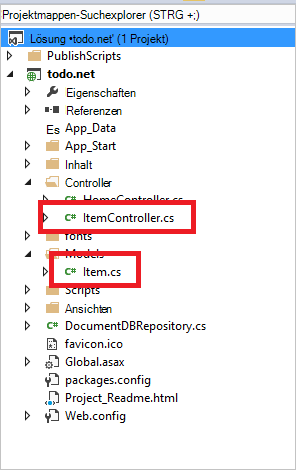

    ItemController.cs schließen, wir werden später darauf. 

### Hinzufügen von Ansichten

Jetzt erstellen wir **V** in MVC-Ansichten:

- [Hinzufügen einer Ansicht Elementindex](#AddItemIndexView).
- [Neues Element-Ansicht hinzufügen](#AddNewIndexView).
- [Hinzufügen einer Ansicht bearbeiten](#_Toc395888515).

#### Eine Elementindex Ansicht hinzufügen

1. Im **Projektmappen-Explorer**den Ordner **Ansichten** , mit der rechten Maustaste in **des leeren Ordners, den Visual Studio für Sie erstellt, wenn zuvor **ItemController hinzugefügte** ** klicken Sie auf **Hinzufügen**und klicken Sie auf **Ansicht**.

    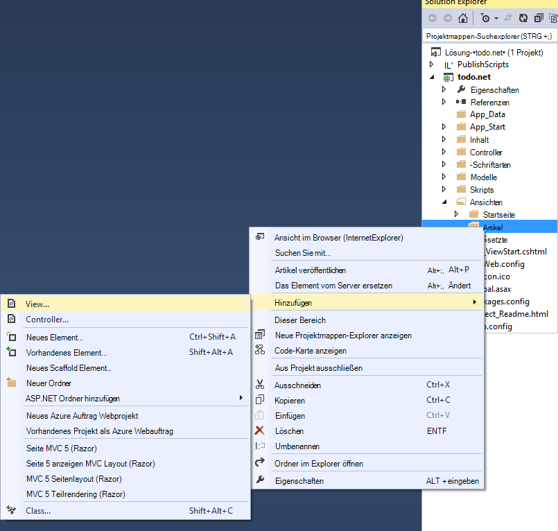

2. Klicken Sie im Dialogfeld **Ansicht hinzufügen** folgendermaßen Sie vor:
    - Geben Sie im Feld **Name der Ansicht** ***Index***.
    - Wählen Sie im Feld **Vorlage** ***aus***.
    - Wählen Sie im Feld **Modellklasse** ***Element (Todo. Modelle)***.
    - Lassen Sie das Feld **Klasse** leer. 
    - Geben Sie im Feld Layout ***~/Views/Shared/_Layout.cshtml***.
    
    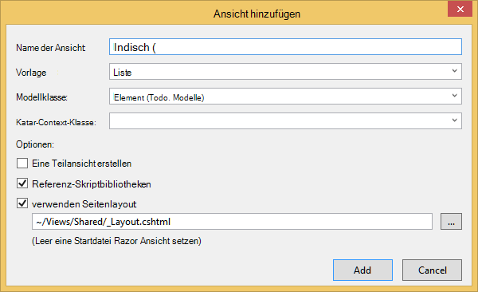

3. Sobald diese Werte festgelegt wurden, klicken Sie auf **Hinzufügen** , und lassen Sie Visual Studio eine neue Vorlagenansicht erstellen. Sobald dies erledigt ist, öffnet es Cshtml-Datei, die erstellt wurde. Wir können diese Datei in Visual Studio schließen, wie wir es später zurückkommen.

#### Fügen Sie ein neues Element anzeigen

Ähnlich wie wir eine **Elementindex** Sicht erstellt, wird jetzt eine neue Ansicht zum Erstellen neuer **Elemente**erstellt.

1. **Klicken**Sie im **Projektmappen-Explorer**mit der rechten Maustaste erneut auf **des Ordners** und klicken Sie auf **Hinzufügen**.

2. Klicken Sie im Dialogfeld **Ansicht hinzufügen** folgendermaßen Sie vor:
    - Geben Sie im Feld **Name der Ansicht** ***Erstellen***.
    - Wählen Sie im Feld **Vorlage** ***Erstellen***.
    - Wählen Sie im Feld **Modellklasse** ***Element (Todo. Modelle)***.
    - Lassen Sie das Feld **Klasse** leer.
    - Geben Sie im Feld Layout ***~/Views/Shared/_Layout.cshtml***.
    - Klicken Sie auf **Hinzufügen**.

#### Hinzufügen einer Ansicht bearbeiten

Und schließlich fügen eine letzte Ansicht zum Bearbeiten eines **Elements** wie vor.

1. **Klicken**Sie im **Projektmappen-Explorer**mit der rechten Maustaste erneut auf **des Ordners** und klicken Sie auf **Hinzufügen**.

2. Klicken Sie im Dialogfeld **Ansicht hinzufügen** folgendermaßen Sie vor:
    - Geben Sie im Feld **Name der Ansicht** ***Bearbeiten***.
    - Wählen Sie im Feld **Vorlage** ***Bearbeiten***.
    - Wählen Sie im Feld **Modellklasse** ***Element (Todo. Modelle)***.
    - Lassen Sie das Feld **Klasse** leer. 
    - Geben Sie im Feld Layout ***~/Views/Shared/_Layout.cshtml***.
    - Klicken Sie auf **Hinzufügen**.

Danach, schließen Sie alle Cshtml-Dokumente in Visual Studio wie wir diese Ansichten später zurück.

## Schritt 5: Verkabelung DocumentDB

Da MVC nichts kümmern, wenden wir den Code für DocumentDB hinzufügen. 

In diesem Abschnitt fügen wir Code Folgendes behandeln:

- [Unvollständige Elemente](#_Toc395637770).
- [Hinzufügen von Elementen](#_Toc395637771).
- [Bearbeiten von Elementen](#_Toc395637772).

### Unvollständige Elemente in MVC-Webanwendungsprojekt

Der erste hier ist eine Klasse hinzufügen, die enthält die Logik zum und DocumentDB. In diesem Lernprogramm werden wir alle diese Logik in einer Repository-Klasse namens DocumentDBRepository kapseln. 

1. Im **Projektmappen-Explorer**mit der rechten Maustaste auf das Projekt, klicken Sie auf **Hinzufügen**und dann auf **Klasse**. Nennen Sie die neue Klasse **DocumentDBRepository** , und klicken Sie auf **Hinzufügen**.
 
2. Neu erstellte **DocumentDBRepository** Klasse und fügen die folgende *using-Anweisung* über *die Namespacedeklaration*
        
        using Microsoft.Azure.Documents; 
        using Microsoft.Azure.Documents.Client; 
        using Microsoft.Azure.Documents.Linq; 
        using System.Configuration;
        using System.Linq.Expressions;
        using System.Threading.Tasks;

    Nun ersetzen Sie diesen code 

        public class DocumentDBRepository
        {
        }

    durch den folgenden Code.

        public static class DocumentDBRepository<T> where T : class
        {
            private static readonly string DatabaseId = ConfigurationManager.AppSettings["database"];
            private static readonly string CollectionId = ConfigurationManager.AppSettings["collection"];
            private static DocumentClient client;
    
            public static void Initialize()
            {
                client = new DocumentClient(new Uri(ConfigurationManager.AppSettings["endpoint"]), ConfigurationManager.AppSettings["authKey"]);
                CreateDatabaseIfNotExistsAsync().Wait();
                CreateCollectionIfNotExistsAsync().Wait();
            }
    
            private static async Task CreateDatabaseIfNotExistsAsync()
            {
                try
                {
                    await client.ReadDatabaseAsync(UriFactory.CreateDatabaseUri(DatabaseId));
                }
                catch (DocumentClientException e)
                {
                    if (e.StatusCode == System.Net.HttpStatusCode.NotFound)
                    {
                        await client.CreateDatabaseAsync(new Database { Id = DatabaseId });
                    }
                    else
                    {
                        throw;
                    }
                }
            }
    
            private static async Task CreateCollectionIfNotExistsAsync()
            {
                try
                {
                    await client.ReadDocumentCollectionAsync(UriFactory.CreateDocumentCollectionUri(DatabaseId, CollectionId));
                }
                catch (DocumentClientException e)
                {
                    if (e.StatusCode == System.Net.HttpStatusCode.NotFound)
                    {
                        await client.CreateDocumentCollectionAsync(
                            UriFactory.CreateDatabaseUri(DatabaseId),
                            new DocumentCollection { Id = CollectionId },
                            new RequestOptions { OfferThroughput = 1000 });
                    }
                    else
                    {
                        throw;
                    }
                }
            }
        }

    > [AZURE.TIP] Beim Erstellen einer neuen DocumentCollection können Sie einen optionalen Parameter RequestOptions des OfferType, angeben soll die Leistungsfähigkeit der neuen Auflistung ermöglicht. Wenn dieser Parameter nicht übergeben werden Angebot Standardtyp verwendet. Weitere DocumentDB finden Angebotstypen [DocumentDB-Leistung](documentdb-performance-levels.md)

3. Wir lesen einige Werte aus der Konfiguration, so öffnen Sie die Datei **Web.config** der Anwendung und fügen Sie folgende Zeilen unter der `<AppSettings>` Abschnitt.
    
        <add key="endpoint" value="enter the URI from the Keys blade of the Azure Portal"/>
        <add key="authKey" value="enter the PRIMARY KEY, or the SECONDARY KEY, from the Keys blade of the Azure  Portal"/>
        <add key="database" value="ToDoList"/>
        <add key="collection" value="Items"/>
    
4. Aktualisieren Sie die Werte für *Endpunkt* und *Authentifizierungsschlüssels* mit den Schlüsseln der Azure-Portal jetzt. Verwenden Sie **URI** aus dem Blade Schlüssel als Wert für die Einstellung Endpunkt, und **PRIMÄRSCHLÜSSEL**oder **SEKUNDÄRSCHLÜSSEL** aus dem Schlüssel-Blade als Wert für die Einstellung Authentifizierungsschlüssels.

    Übernimmt der Verdrahtung DocumentDB Repository jetzt wir unsere Anwendungslogik hinzufügen.

5. Erstes wollen wir eine Todo Liste Anwendung können werden unvollständige Elemente angezeigt.  Kopieren Sie und fügen Sie den folgenden Codeausschnitt an einer beliebigen Stelle in der **DocumentDBRepository** -Klasse.

        public static async Task<IEnumerable<T>> GetItemsAsync(Expression<Func<T, bool>> predicate)
        {
            IDocumentQuery<T> query = client.CreateDocumentQuery<T>(
                UriFactory.CreateDocumentCollectionUri(DatabaseId, CollectionId))
                .Where(predicate)
                .AsDocumentQuery();

            List<T> results = new List<T>();
            while (query.HasMoreResults)
            {
                results.AddRange(await query.ExecuteNextAsync<T>());
            }

            return results;
        }

6. Öffnen Sie **ItemController** wir zuvor hinzugefügt und fügen die folgende *using-Anweisung* über der Namespacedeklaration.

        using System.Net;
        using System.Threading.Tasks;
        using todo.Models;

    Wenn das Projekt nicht "Todo" lautet, müssen Sie das update "Todo. Modelle"; um den Namen des Projekts.

    Nun ersetzen Sie diesen code

        //GET: Item
        public ActionResult Index()
        {
            return View();
        }

    durch den folgenden Code.

        [ActionName("Index")]
        public async Task<ActionResult> IndexAsync()
        {
            var items = await DocumentDBRepository<Item>.GetItemsAsync(d => !d.Completed);
            return View(items);
        }
    
7. Öffnen Sie **Global.asax.cs** und fügen Sie die folgende Zeile zur **Application_Start** -Methode 
 
        DocumentDBRepository<todo.Models.Item>.Initialize();
    
An diesem Punkt sollte Projektmappe fehlerfrei erstellen können.

Wenn Sie die Anwendung jetzt ausgeführt haben, gehen Sie **HomeController** und der **Index** des Controllers. Dies ist das Standardverhalten für MVC-Vorlagenprojekt Anfang wählten wir jedoch wollen wir nicht! Ändern Sie den Arbeitsplan für die MVC Anwendung dieses Verhalten geändert.

Open ***App\_Start\RouteConfig.cs*** und suchen Sie die Zeile mit "Standard:" und ändern Sie es wie folgt aussehen.

        defaults: new { controller = "Item", action = "Index", id = UrlParameter.Optional }

Dies weist ASP.NET MVC, die einen Wert nicht in der URL das Routingverhalten statt der **Startseite**steuern angegeben haben **Element** als der Controller und **Index** als Ansicht verwenden.

Jetzt läuft die Anwendung es in der **ItemController** wird der Repository-Klasse aufgerufen und verwendet die GetItems-Methode **auf**unvollständige Elemente wieder\\**Punkt**\\**Index** anzeigen. 

Erstellen und dieses Projekt jetzt ausführen sollten Sie etwas sehen, das aussieht.    

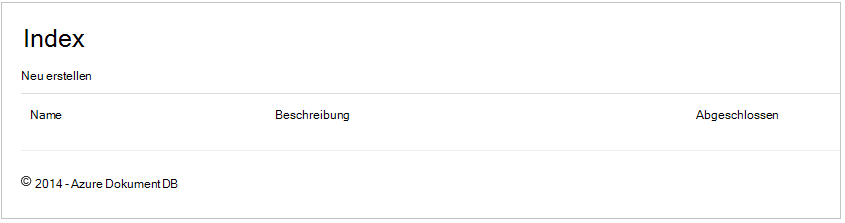

### Hinzufügen von Elementen

Sehen wir uns einige Elemente in unserer Datenbank haben wir etwas mehr als ein leeres Raster betrachten.

Fügen Sie Code zu DocumentDBRepository ItemController in DocumentDB Datensatz beibehalten werden.

1.  Fügen Sie die folgende Methode der **DocumentDBRepository** -Klasse.

        public static async Task<Document> CreateItemAsync(T item)
        {
            return await client.CreateDocumentAsync(UriFactory.CreateDocumentCollectionUri(DatabaseId, CollectionId), item);
        }

    Diese Methode nimmt ein Objekt übergeben einfach und in DocumentDB beibehalten.

2. Öffnen Sie die Datei ItemController.cs, und fügen Sie den folgenden Codeausschnitt innerhalb der Klasse. Dies ist wie ASP.NET MVC weiß, wie die Aktion **Erstellen** . In diesem Fall nur Rendern Sie die zugeordnete Create.cshtml Ansicht zuvor erstellten.

        [ActionName("Create")]
        public async Task<ActionResult> CreateAsync()
        {
            return View();
        }

    Wir benötigen nun Code in diesen Domänencontroller, die die Übermittlung **der Erstellungsansicht** akzeptieren.

2. Die ItemController.cs-Klasse, die ASP.NET MVC mit einem Formular-POST für diesen Controller sagt fügen Sie den nächsten Codeblock hinzu.
    
        [HttpPost]
        [ActionName("Create")]
        [ValidateAntiForgeryToken]
        public async Task<ActionResult> CreateAsync([Bind(Include = "Id,Name,Description,Completed")] Item item)
        {
            if (ModelState.IsValid)
            {
                await DocumentDBRepository<Item>.CreateItemAsync(item);
                return RedirectToAction("Index");
            }

            return View(item);
        }

    Dieser Code ruft in der DocumentDBRepository und mithilfe der CreateItemAsync-Methode neue Todo-Element in der Datenbank beibehalten. 
 
    **Sicherheitshinweis**: **ValidateAntiForgeryToken** -Attribut dient hier zum Schutz gegen siteübergreifende Anforderungsfälschungsangriffe Anwendung. Ist mehr als nur dieses Attribut hinzufügen, Ansichten sowie diese Antifälschungstoken verwenden müssen. Mehr zum Thema und Beispiele für die korrekte Implementierung finden Sie [Verhindern von Cross-Site Request Fälschung][]. [GitHub][] zur Quellcode hat die vollständige Implementierung.

    **Sicherheitshinweis**: wir auch das Attribut **binden** auf der Methodenparameter Schutz gegen Angriffe zu buchen. Weitere Informationen finden Sie unter [Grundlegende CRUD-Operationen in ASP.NET MVC][].

Hinzufügen neuer Einträge in unserer Datenbank erforderlichen Code abgeschlossen.

### Elemente bearbeiten

Es ist eine Sache für uns und die Möglichkeit, **Elemente** in der Datenbank zu bearbeiten und als abgeschlossen markieren soll. Die Ansicht zum Bearbeiten wurde bereits zum Projekt hinzugefügt, müssen wir lediglich Code Controller und der **DocumentDBRepository** -Klasse erneut hinzu.

1. Im folgenden der **DocumentDBRepository** Klasse hinzufügen.

        public static async Task<Document> UpdateItemAsync(string id, T item)
        {
            return await client.ReplaceDocumentAsync(UriFactory.CreateDocumentUri(DatabaseId, CollectionId, id), item);
        }

        public static async Task<T> GetItemAsync(string id)
        {
            try
            {
                Document document = await client.ReadDocumentAsync(UriFactory.CreateDocumentUri(DatabaseId, CollectionId, id));
                return (T)(dynamic)document;
            }
            catch (DocumentClientException e)
            {
                if (e.StatusCode == HttpStatusCode.NotFound)
                {
                    return null;
                }
                else
                {
                    throw;
                }
            }
        }
    
    Die erste der folgenden Methoden ein Element **GetItem** Abrufe vom DocumentDB übergeben wird auf **ItemController** und dann auf die Ansicht **Bearbeiten** .
    
    Die zweite der Methoden haben wir nur ersetzt, die das **Dokument** im DocumentDB mit der Version des **Dokuments** vom **ItemController**übergeben.

2. Im folgenden der **ItemController** Klasse hinzufügen.

        [HttpPost]
        [ActionName("Edit")]
        [ValidateAntiForgeryToken]
        public async Task<ActionResult> EditAsync([Bind(Include = "Id,Name,Description,Completed")] Item item)
        {
            if (ModelState.IsValid)
            {
                await DocumentDBRepository<Item>.UpdateItemAsync(item.Id, item);
                return RedirectToAction("Index");
            }

            return View(item);
        }

        [ActionName("Edit")]
        public async Task<ActionResult> EditAsync(string id)
        {
            if (id == null)
            {
                return new HttpStatusCodeResult(HttpStatusCode.BadRequest);
            }

            Item item = await DocumentDBRepository<Item>.GetItemAsync(id);
            if (item == null)
            {
                return HttpNotFound();
            }

            return View(item);
        }
    
    Die erste Methode verarbeitet Http GET, die zufällig klickt der Benutzer auf den Link **Bearbeiten** aus dem **Index** . Diese Methode ruft ein [**Dokument**](http://msdn.microsoft.com/library/azure/microsoft.azure.documents.document.aspx) von DocumentDB und übergibt sie an die **Bearbeiten** -Ansicht.

    **Bearbeiten** -Ansicht wird Http POST zu **IndexController**führen. 
    
    Die zweite Methode hinzugefügten behandelt das aktualisierte Objekt an DocumentDB in der Datenbank beibehalten werden übergeben.

Das ist es, alles müssen wir unsere Anwendung ausführen, unvollständige **Objekte**, neue **Elemente**hinzufügen und **Elemente**bearbeiten.

## Schritt 6: Die Anwendung lokal ausführen

Zum Testen der Anwendung auf dem lokalen Computer folgendermaßen Sie vor:

1. Drücken Sie F5 in Visual Studio erstellen Sie die Anwendung im Debugmodus. Die Anwendung sollte und starten Sie einen Browser mit leeren Rasterseite, vor:

    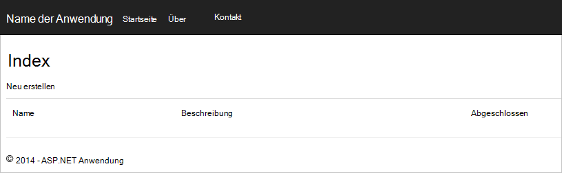

    Wenn Sie Visual Studio 2013 verwenden und die Fehlermeldung "kann nicht im Text einer Catch-Klausel" await "." Sie müssen [Microsoft.Net.Compilers Nuget-Paket](https://www.nuget.org/packages/Microsoft.Net.Compilers/)installieren. Sie können auch Code für das Beispielprojekt auf [GitHub][]vergleichen. 

2. Klicken Sie auf den Link **Neu erstellen** , und fügen Sie Werte in die Felder **Name** und **Beschreibung** . **Abgeschlossen** Kontrollkästchen deaktiviert lassen andernfalls das neue **Element** wird in einem abgeschlossenen Zustand hinzugefügt und erscheint nicht auf der ursprünglichen Liste.

    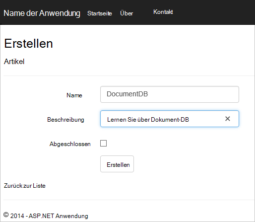

3. Klicken Sie auf **Erstellen** werden umgeleitet, **die Indexansicht** und **Element** in der Liste angezeigt.

    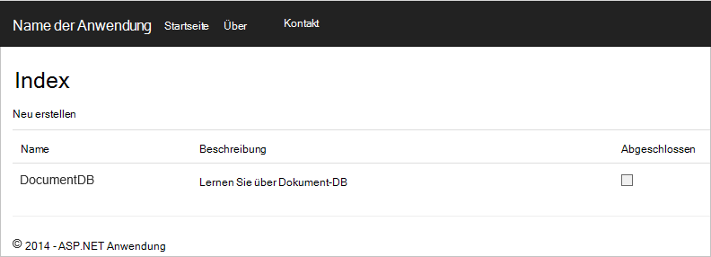

    Die Aufgabenliste einige weitere **Elemente** hinzufügen können.

3. Klicken Sie neben einem **Element** in der Liste **Bearbeiten** und Sie zur Ansicht **Bearbeiten** , können Sie jede Eigenschaft eines Objekts einschließlich Flag **abgeschlossen** aktualisieren. Wenn Sie die Kennzeichnung **abgeschlossen** markieren, klicken Sie auf **Speichern**wird **Element** aus der Liste der unerledigten Aufgaben entfernt.

    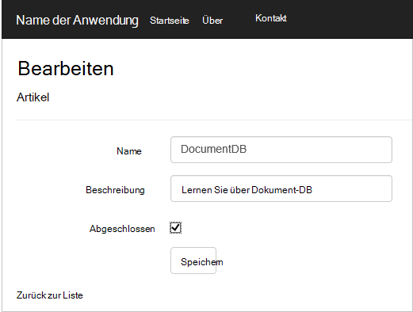

4. Sobald Sie die app getestet STRG + F5 Beenden der Anwendung. Jetzt bereitstellen.

## Schritt 7: In Azure Websites bereitzustellen

Jetzt haben Sie die gesamte Anwendung funktioniert mit DocumentDB werden wir diese Web app Azure Websites bereitstellen. Wenn Sie **Server in der Cloud** bei leere ASP.NET MVC-Projekt erstellt Visual Studio macht dies einfach und erledigt die Arbeit für Sie. 

1. Veröffentlichungsort für diese Anwendung müssen Sie lediglich mit der rechten Maustaste auf das Projekt im **Projektmappen-Explorer** , und klicken Sie auf **Veröffentlichen**.

    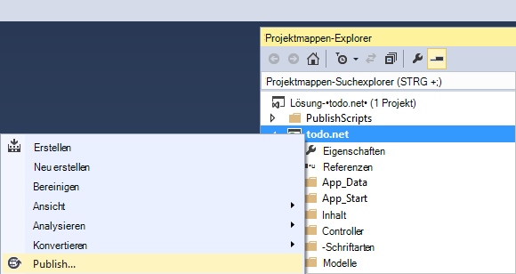

2. Alles sollte bereits nach Ihren Anmeldeinformationen konfiguriert werden. tatsächlich wurde die Website bereits erstellt in Azure für Sie am **Ziel-URL** angezeigt, müssen Sie lediglich auf **Veröffentlichen**klicken.

    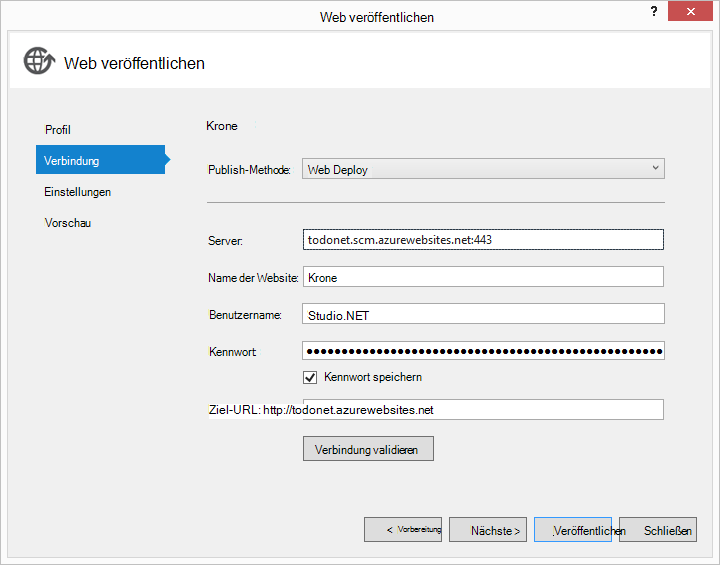

In wenigen Sekunden Visual Studio Veröffentlichen der Webanwendung beenden und starten Sie einen Browser finden Ihre Arbeit in Azure ausgeführt.

## Nächste Schritte

Herzlichen Glückwunsch! Sie erstellt die erste ASP.NET MVC Webanwendungsprojekt mit Azure DocumentDB und Azure Websites veröffentlicht. Der Quellcode für die vollständige Anwendung, einschließlich der Details und löschen, die nicht in diesem Lernprogramm wurden heruntergeladen oder von [GitHub][]geklont. Wenn Sie Ihrer Anwendung hinzufügen, die interessiert sind, nehmen Sie den Code und dieser Anwendung hinzufügen.

Um zusätzliche Funktionen der Anwendung hinzufügen, Überprüfen der [DocumentDB.NET Library](https://msdn.microsoft.com/library/azure/dn948556.aspx) APIs und gerne DocumentDB .NET Bibliothek auf [GitHub][]beitragen. 

[\*]: https://microsoft.sharepoint.com/teams/DocDB/Shared%20Documents/Documentation/Docs.LatestVersions/PicExportError
[Visual Studio Express]: http://www.visualstudio.com/products/visual-studio-express-vs.aspx
[Microsoft-Webplattform-Installer]: http://www.microsoft.com/web/downloads/platform.aspx
[Verhindern von Cross-Site Request Fälschung]: http://go.microsoft.com/fwlink/?LinkID=517254
[Grundlegende Vorgänge in ASP.NET MVC]: http://go.microsoft.com/fwlink/?LinkId=317598
[GitHub]: https://github.com/Azure-Samples/documentdb-net-todo-app
