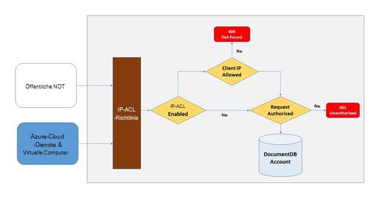
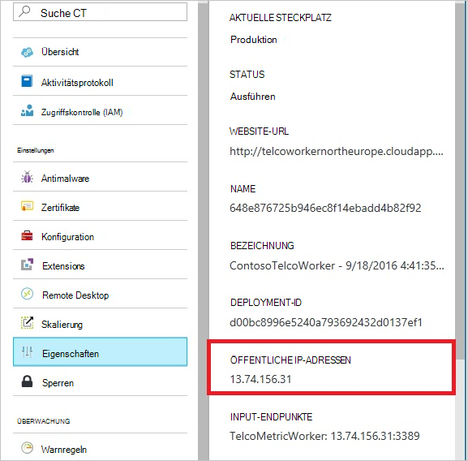
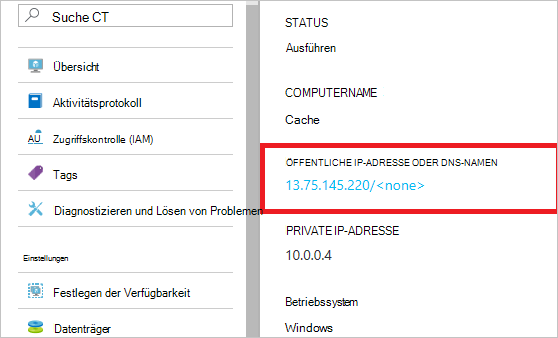
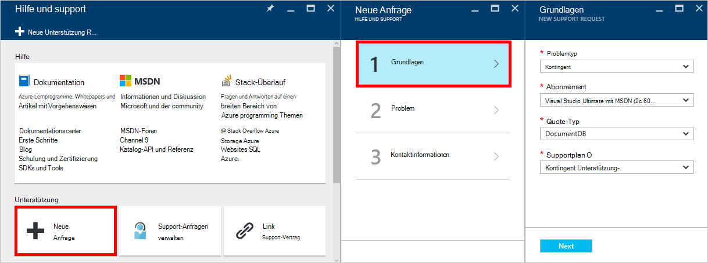
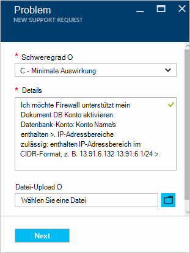

<properties
    pageTitle="DocumentDB Firewall Support | Microsoft Azure"
    description="Informationen Sie zum IP-Richtlinien für Firewall-Unterstützung auf Azure DocumentDB Datenbank verwenden."
    keywords="IP-Zugriffskontrolle, Firewall-Unterstützung"
    services="documentdb"
    authors="shahankur11"
    manager="jhubbard"
    editor=""
    tags="azure-resource-manager"
    documentationCenter=""/>

<tags 
    ms.service="documentdb" 
    ms.workload="data-services" 
    ms.tgt_pltfrm="na" 
    ms.devlang="na" 
    ms.topic="article" 
    ms.date="10/17/2016" 
    ms.author="ankshah; kraman"/>

# DocumentDB Firewall-Unterstützung

Sichern Sie Daten in ein Datenbankkonto Azure DocumentDB hat DocumentDB eine geheime [Autorisierungsmodell](https://msdn.microsoft.com/library/azure/dn783368.aspx) unterstützt, die einen starke Hash-Nachrichtenauthentifizierungscode (HMAC) verwendet. Nun unterstützt neben geheime Basis Autorisierungsmodell DocumentDB richtliniengesteuerte IP-basierte Zugriffskontrolle für eingehenden Firewall-Unterstützung. Dieses Modell ähnelt die Firewallregeln traditionellen Datenbanksystem und bietet zusätzliche Sicherheit für das Konto DocumentDB. Mit diesem Modell können Sie jetzt ein DocumentDB Datenbankkonto möglich nur aus zugelassene Computer oder cloud-Dienste konfigurieren. Zugriff auf DocumentDB Ressourcen aus dieser zugelassenen Computer und Dienste noch muss der Aufrufer eine gültige Autorisierungstoken vorhanden.

## Übersicht über IP-Zugriff

Wird standardmäßig ein DocumentDB Konto über Internetzugang als gültige Autorisierungstoken dem Antrag beigefügt. Konfigurieren Sie IP-Policy-basierte Zugriffskontrolle muss der Benutzer den Satz von IP-Adressen oder IP-Adressbereiche in CIDR-Formular als die Liste der zulässigen Clients IP-Adressen für ein Datenbank-Konto bereitstellen. Nachdem diese Konfiguration angewendet wird, werden alle Anfragen außerhalb dieser Liste zulässiger Computer vom Server blockiert.  Verarbeitungsfluss für IP-basierte Zugriffskontrolle Verbindung wird im folgenden Diagramm beschrieben.

## Verbindung von Cloud-Diensten

In Azure werden Clouddienste häufig Zwischenebene Logik mit DocumentDB hosten. Zum Aktivieren des Zugriffs auf ein DocumentDB Konto von einem Clouddienst muss die Liste der zulässigen IP-Adressen DocumentDB-Datenbankkonto von [Azure unterstützt](#configure-ip-policy)öffentliche IP-Adresse des Cloud-Dienst hinzugefügt werden.  Dadurch wird sichergestellt, dass alle Instanzen von Clouddiensten Kontozugriff Datenbank DocumentDB. Sie können IP-Adressen für Ihre Clouddienste in Azure-Portal abrufen, wie im folgenden Screenshot gezeigt. 

Wenn Sie Instanzen der Rolle hinzufügen, die Cloud-Dienst skalieren, haben die neuen Instanzen automatisch Zugang zum Konto DocumentDB sind Teil der gleichen Cloud-Dienst.

## Verbindung von virtuellen Computern

[Virtuelle Maschinen](https://azure.microsoft.com/services/virtual-machines/) oder [virtuellen Maßstab legt](../virtual-machine-scale-sets/virtual-machine-scale-sets-overview.md) kann auch zur Zwischenebene Dienste mit DocumentDB.  Konfigurieren der DocumentDB muss Konto Zugriff von virtuellen Maschinen, öffentliche IP-Adressen der virtuellen Computer bzw. virtuellen Skalierungsgruppe als zugelassenen IP-Adressen für Ihr Konto DocumentDB Datenbank von [Azure-Unterstützung](#configure-ip-policy)konfiguriert. Sie können IP-Adressen für virtuelle Computer in Azure-Portal abrufen, wie im folgenden Screenshot gezeigt.

Beim Hinzufügen zusätzlicher virtueller Computerinstanzen der Gruppe erhalten sie automatisch Zugriff auf Ihr Konto DocumentDB Datenbank.

## Clientverbindungen aus dem internet

Wenn Sie ein Konto DocumentDB von einem Computer im Internet zugreifen, muss die IP-Adresse oder IP-Adressbereich des Computers zur Liste zugelassenen IP-Adresse für das Konto DocumentDB hinzugefügt. 

## Konfigurieren der IP-Richtlinie

Mithilfe von Azure Portal einen Antrag [Azure-Unterstützung](https://portal.azure.com/?#blade/Microsoft_Azure_Support/HelpAndSupportBlade) der IP-Richtlinien auf Ihr Konto zu aktivieren.

1. Wählen Sie Blatt [Hilfe und Support](https://portal.azure.com/?#blade/Microsoft_Azure_Support/HelpAndSupportBlade) **neue support-Anfragen**.
2. Wählen Sie Blatt **neu Kundendienstanfrage** **Grundlagen**.
3. **Grundlagen** -Blatt wählen Sie Folgendes aus:
    - **Problemtyp**: Kontingent
    - **Abonnement**: das Abonnement mit dem Konto, das IP-Richtlinien hinzufügen.
    - **Kontingenttyp**: DocumentDB
    - **Support-Plan**: Unterstützung von Datenträgerkontingenten - enthalten.
4. Das Blade **Problem** folgendermaßen Sie vor:
    - **Schweregrad**: C - minimalen auswählen
    - **Details**: Kopieren Sie den folgenden Text in das Feld, und Ihren Account Name/s und IP-Adresse/es: "Ich möchte Support für mein Konto DocumentDB Firewall aktivieren. Datenbank-Konto: *Include Konto Name/s*. IP-Adressbereiche zulässig: *enthalten IP-Adressbereich im CIDR-Format, z. B. 13.91.6.132, 13.91.6.1/24*. "
    - Klicken Sie auf **Weiter**. 
5. Blatt **Kontaktinformationen** Kontaktinformationen füllen Sie aus, und klicken Sie auf **Erstellen**. 

Sobald Ihre Anfrage eingeht, sollte IP-Zugriffskontrolle innerhalb von 24 Stunden aktiviert. Sie werden benachrichtigt, wenn die Anforderung abgeschlossen ist.

## Problembehandlung bei der IP-Richtlinie

### Portal Vorgänge

Aktivieren Sie eine IP-Richtlinien für Ihr Konto DocumentDB Datenbank, erlaubt alle Zugriff auf Ihr Konto DocumentDB Datenbank von Computern außerhalb der Liste IP-Adressbereiche werden blockiert. Aufgrund dieses Modells wird die Datenoperation Ebene über das Portal durchsuchen auch um die Integrität der Zugriffskontrolle blockiert werden. 

### SDK und Rest-API

Für aus Sicherheitsgründen Zugriff über SDK oder REST-API nicht auf der Liste der zugelassenen Computer eine generische 404 nicht gefunden Antwort ohne zusätzliche Details zurück. Überprüfen Sie die IP-Adresse für Ihr DocumentDB-Datenbankkonto konfigurierten Liste zulässiger um sicherzustellen, dass die richtige Konfiguration auf Ihr Konto DocumentDB Datenbank angewendet wird.

## Nächste Schritte

Informationen zum Netzwerk verwandte Tipps, finden Sie unter [Tipps](documentdb-performance-tips.md).