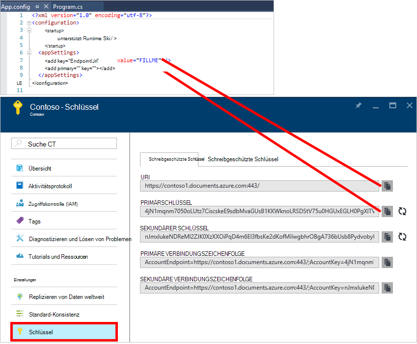
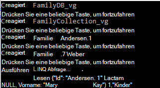
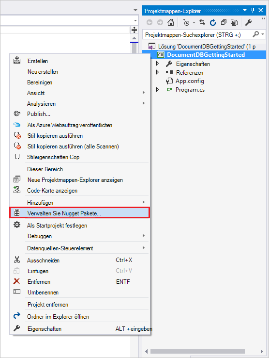
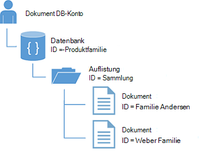

<properties
    pageTitle="NoSQL Tutorial: DocumentDB .NET SDK | Microsoft Azure"
    description="Ein NoSQL-Lernprogramm, das eine Datenbank und C# Konsolenanwendungsprojekt mit dem DocumentDB .NET SDK erstellt. DocumentDB ist eine NoSQL-Datenbank JSON."
    keywords="NoSQL-Lernprogramm, Online-Datenbank c# Konsolenanwendungsprojekt"
    services="documentdb"
    documentationCenter=".net"
    authors="AndrewHoh"
    manager="jhubbard"
    editor="monicar"/>

<tags
    ms.service="documentdb"
    ms.workload="data-services"
    ms.tgt_pltfrm="na"
    ms.devlang="dotnet"
    ms.topic="hero-article"
    ms.date="09/01/2016"
    ms.author="anhoh"/>

# NoSQL Tutorial: Build DocumentDB C# Konsolenanwendungsprojekt

> [AZURE.SELECTOR]
- [.NET](documentdb-get-started.md)
- [Node.js](documentdb-nodejs-get-started.md)

Willkommen Sie NoSQL-Lernprogramm für Azure DocumentDB .NET SDK Das QuickStart Projekt oder das Abschließen des Lernprogramms müssen Sie ein Konsolenanwendungsprojekt erstellt und Abfragen DocumentDB Ressourcen.

- **[Schnellstart](#quickstart)**: das Beispielprojekt herunterladen, die Verbindungsinformationen und eine DocumentDB App weniger als 10 Minuten.
- **[Lernprogramm](#tutorial)**: erstellen die Schnellstart Anwendung völlig in 30 Minuten.

## Erforderliche Komponenten

- Ein aktives Azure-Konto. Wenn Sie eine haben, können Sie ein [kostenloses Konto](https://azure.microsoft.com/free/)anmelden.
- [Visual Studio 2013 oder Visual Studio 2015](http://www.visualstudio.com/).
- .NET Framework 4.6

## Schnellstart

1. Beispiel Projekt ZIP aus [GitHub](https://github.com/Azure-Samples/documentdb-dotnet-getting-started-quickstart/archive/master.zip) oder Klonen Sie [Documentdb-Dotnet-erste-Schritte-Schnellstart](https://github.com/Azure-Samples/documentdb-dotnet-getting-started-quickstart) Repo.
2. Verwenden des Azure-Portals [DocumentDB-Konto](documentdb-create-account.md)erstellen.
3. Ersetzen Sie in der Datei App.config EndpointUri und PrimaryKey Werte durch Werte aus dem [Azure-Portal](https://portal.azure.com/)zu **DocumentDB (NoSQL)** Blade dann auf den **Kontonamen**und **Schlüssel** Menü Ressource klicken.
    
4. Erstellen Sie das Projekt. Das Konsolenfenster zeigt neuen Ressourcen erstellt, abgefragt und anschließend bereinigt.
    
    

## Lernprogramm

Dieses Lernprogramm führt Sie durch die Erstellung einer DocumentDB eine DocumentDB Auflistung und JSON-Dokumente. Sie werden dann Abfragen die Auflistung bereinigen und löschen Sie die Datenbank. Dieses Lernprogramm baut Projekts Schnellstart-Projekt jedoch werden inkrementell erstellen und Erläuterung der Code, den Sie dem Projekt hinzufügen wird angezeigt.

## Schritt 1: Erstellen eines Kontos DocumentDB

Erstellen Sie ein Konto DocumentDB. Haben Sie bereits ein Konto, das Sie verwenden möchten, können Sie zum [Einrichten der Visual Studio-Projektmappe](#SetupVS)überspringen.

[AZURE.INCLUDE [documentdb-create-dbaccount](../../includes/documentdb-create-dbaccount.md)]

## Schritt 2: Einrichten der Visual Studio-Projektmappe

1. Öffnen Sie auf Ihrem Computer **Visual Studio 2015** .
2. Im Menü **Datei** wählen Sie **neu**und wählen Sie dann **Projekt**.
3. Wählen Sie im Dialogfeld **Neues Projekt** **Vorlagen** / **Visual C#** / **Konsolenanwendungsprojekt**benennen Sie Ihr Projekt, und klicken Sie auf **OK**.

4. Klicken Sie im **Projektmappen-Explorer**auf die neue Konsolenanwendung unter der Visual Studio-Projektmappe.
5. Ohne das Menü klicken Sie **NuGet-Pakete verwalten an...** 
 
6. Klicken Sie auf der Registerkarte **Nuget** auf **Durchsuchen**und geben Sie **Azure Documentdb** in das Suchfeld ein.
7. Innerhalb der Ergebnisse **Microsoft.Azure.DocumentDB** und klicken Sie auf **Installieren**.
Die Paket-ID für DocumentDB-Clientbibliothek ist [Microsoft.Azure.DocumentDB](https://www.nuget.org/packages/Microsoft.Azure.DocumentDB)

Sehr gut. Da wir die Einrichtung abgeschlossen haben, beginnen wir Code schreiben. Ein Projekt abgeschlossen Code dieser praktischen Einführung finden Sie unter [GitHub](https://github.com/Azure-Samples/documentdb-dotnet-getting-started/blob/master/src/Program.cs).

## Schritt 3: Verbinden Sie mit einer DocumentDB-Konto

Fügen Sie zunächst diese Verweise an die C#-Anwendung in der Datei Program.cs hinzu:

    using System;
    using System.Linq;
    using System.Threading.Tasks;

    // ADD THIS PART TO YOUR CODE
    using System.Net;
    using Microsoft.Azure.Documents;
    using Microsoft.Azure.Documents.Client;
    using Newtonsoft.Json;

> [AZURE.IMPORTANT] Um diese NoSQL-Lernprogramm unbedingt Abhängigkeiten oben hinzufügen.

Fügen Sie nun die zwei Konstanten und die *Client* -Variable unter der öffentlichen Klasse *Anwendung*.

    public class Program
    {
        // ADD THIS PART TO YOUR CODE
        private const string EndpointUri = "<your endpoint URI>";
        private const string PrimaryKey = "<your key>";
        private DocumentClient client;

Weiter Head [Azure-Portal](https://portal.azure.com) zum Abrufen der URI und Primärschlüssel. DocumentDB URI und Primärschlüssel sind erforderlich für die Anwendung zu verstehen, wo herstellen und DocumentDB Verbindung der Anwendung vertrauen.

Im Portal Azure DocumentDB-Konto navigieren Sie, und klicken Sie dann auf **Schlüssel**.

Den URI vom Portal aus kopieren und Einfügen in `<your endpoint URI>` in der Datei program.cs. PRIMÄRSCHLÜSSEL aus dem Portal kopieren und fügen Sie ihn in `<your key>`.

![Screenshot der Azure-Portal zur NoSQL-Lernprogramm erstellen Sie ein C#-Konsolenanwendungsprojekt. Zeigt ein DocumentDB-Konto mit aktiver Hub hervorgehoben, Schlüssel Schaltfläche hervorgehoben DocumentDB Konto Blade und die URI, primären und SEKUNDÄRSCHLÜSSEL Werte auf die Tasten hervorgehoben][keys]

Wir beginnen immer gestartete Anwendung durch Erstellen einer neuen Instanz von **"documentclient"**.

Fügen Sie unterhalb der **Main** -Methode diese neue asynchrone Aufgabe namens **GetStartedDemo**, die unsere neuen **"documentclient"**instanziiert.

    static void Main(string[] args)
    {
    }

    // ADD THIS PART TO YOUR CODE
    private async Task GetStartedDemo()
    {
        this.client = new DocumentClient(new Uri(EndpointUri), PrimaryKey);
    }

Fügen Sie den folgenden Code in der **Main** -Methode die asynchrone Aufgabe ausführen. Die **Main** -Methode Ausnahmen abfangen und in die Konsole geschrieben.

    static void Main(string[] args)
    {
            // ADD THIS PART TO YOUR CODE
            try
            {
                    Program p = new Program();
                    p.GetStartedDemo().Wait();
            }
            catch (DocumentClientException de)
            {
                    Exception baseException = de.GetBaseException();
                    Console.WriteLine("{0} error occurred: {1}, Message: {2}", de.StatusCode, de.Message, baseException.Message);
            }
            catch (Exception e)
            {
                    Exception baseException = e.GetBaseException();
                    Console.WriteLine("Error: {0}, Message: {1}", e.Message, baseException.Message);
            }
            finally
            {
                    Console.WriteLine("End of demo, press any key to exit.");
                    Console.ReadKey();
            }

Drücken Sie **F5** , um die Anwendung auszuführen.

Herzlichen Glückwunsch! Sie DocumentDB Konto hergestellt haben, wir sehen nun mit DocumentDB Ressourcen.  

## Schritt 4: Erstellen einer Datenbank
Bevor Sie Code zum Erstellen einer Datenbank hinzufügen, fügen Sie eine Hilfsmethode zum Schreiben in die Konsole.

Kopieren Sie und fügen Sie der **WriteToConsoleAndPromptToContinue** unter der **GetStartedDemo** -Methode ein.

    // ADD THIS PART TO YOUR CODE
    private void WriteToConsoleAndPromptToContinue(string format, params object[] args)
    {
            Console.WriteLine(format, args);
            Console.WriteLine("Press any key to continue ...");
            Console.ReadKey();
    }

Die DocumentDB [Datenbank](documentdb-resources.md#databases) kann mithilfe der [CreateDatabaseAsync](https://msdn.microsoft.com/library/microsoft.azure.documents.client.documentclient.createdatabaseasync.aspx) -Methode der Klasse **"documentclient"** erstellt werden. Eine Datenbank ist der logische Container JSON Speicherung über Sammlungen partitioniert.

Kopieren Sie und fügen Sie der **CreateDatabaseIfNotExists** unter der **WriteToConsoleAndPromptToContinue** -Methode ein.

    // ADD THIS PART TO YOUR CODE
    private async Task CreateDatabaseIfNotExists(string databaseName)
    {
            // Check to verify a database with the id=FamilyDB does not exist
            try
            {
                    await this.client.ReadDatabaseAsync(UriFactory.CreateDatabaseUri(databaseName));
                    this.WriteToConsoleAndPromptToContinue("Found {0}", databaseName);
            }
            catch (DocumentClientException de)
            {
                    // If the database does not exist, create a new database
                    if (de.StatusCode == HttpStatusCode.NotFound)
                    {
                            await this.client.CreateDatabaseAsync(new Database { Id = databaseName });
                            this.WriteToConsoleAndPromptToContinue("Created {0}", databaseName);
                    }
                    else
                    {
                            throw;
                    }
            }
    }

Kopieren Sie und fügen Sie den folgenden Code in der Methode **GetStartedDemo** unter Client erstellen. Dadurch wird eine Datenbank namens *FamilyDB*erstellt.

    private async Task GetStartedDemo()
    {
        this.client = new DocumentClient(new Uri(EndpointUri), PrimaryKey);

        // ADD THIS PART TO YOUR CODE
        await this.CreateDatabaseIfNotExists("FamilyDB_va");

Drücken Sie **F5** , um die Anwendung auszuführen.

Herzlichen Glückwunsch! Erstellt eine DocumentDB-Datenbank  

## Schritt 5: Erstellen einer Auflistung  

> [AZURE.WARNING] **CreateDocumentCollectionAsync** erstellt eine neue Auflistung mit reservierten Durchsatz Preise Auswirkungen hat. Weitere Informationen finden Sie auf unserer [Preisseite](https://azure.microsoft.com/pricing/details/documentdb/).

Eine [Auflistung](documentdb-resources.md#collections) kann mithilfe der [CreateDocumentCollectionAsync](https://msdn.microsoft.com/library/microsoft.azure.documents.client.documentclient.createdocumentcollectionasync.aspx) -Methode der Klasse **"documentclient"** erstellt werden. Eine Auflistung ist ein Container für JSON-Dokumente und zugeordnete JavaScript Anwendungslogik.

Kopieren Sie und fügen Sie der **CreateDocumentCollectionIfNotExists** unter der **CreateDatabaseIfNotExists** -Methode ein.

    // ADD THIS PART TO YOUR CODE
    private async Task CreateDocumentCollectionIfNotExists(string databaseName, string collectionName)
    {
        try
        {
            await this.client.ReadDocumentCollectionAsync(UriFactory.CreateDocumentCollectionUri(databaseName, collectionName));
            this.WriteToConsoleAndPromptToContinue("Found {0}", collectionName);
        }
        catch (DocumentClientException de)
        {
            // If the document collection does not exist, create a new collection
            if (de.StatusCode == HttpStatusCode.NotFound)
            {
                DocumentCollection collectionInfo = new DocumentCollection();
                collectionInfo.Id = collectionName;

                // Configure collections for maximum query flexibility including string range queries.
                collectionInfo.IndexingPolicy = new IndexingPolicy(new RangeIndex(DataType.String) { Precision = -1 });

                // Here we create a collection with 400 RU/s.
                await this.client.CreateDocumentCollectionAsync(
                    UriFactory.CreateDatabaseUri(databaseName),
                    collectionInfo,
                    new RequestOptions { OfferThroughput = 400 });

                this.WriteToConsoleAndPromptToContinue("Created {0}", collectionName);
            }
            else
            {
                throw;
            }
        }
    }

Kopieren Sie und fügen Sie den folgenden Code in der Methode **GetStartedDemo** unter Datenbank erstellen. Dadurch wird eine Dokumentgruppe namens *FamilyCollection_va*erstellt.

        this.client = new DocumentClient(new Uri(EndpointUri), PrimaryKey);

        await this.CreateDatabaseIfNotExists("FamilyDB_oa");

        // ADD THIS PART TO YOUR CODE
        await this.CreateDocumentCollectionIfNotExists("FamilyDB_va", "FamilyCollection_va");

Drücken Sie **F5** , um die Anwendung auszuführen.

Herzlichen Glückwunsch! Erstellt eine DocumentDB-Dokumentgruppe  

## Schritt 6: JSON-Dokumente erstellen
Ein [Dokument](documentdb-resources.md#documents) kann mithilfe der [CreateDocumentAsync](https://msdn.microsoft.com/library/microsoft.azure.documents.client.documentclient.createdocumentasync.aspx) -Methode der Klasse **"documentclient"** erstellt werden. Dokumente sind benutzerdefinierte (beliebigen) JSON-Inhalt. Jetzt können wir ein oder mehrere Dokumente einfügen. Haben Sie bereits Daten in Ihrer Datenbank speichern möchten, können Sie DocumentDBs [Data Migration Tools](documentdb-import-data.md).

Zunächst müssen wir eine **Familie** Klasse erstellen, die in diesem Beispiel in DocumentDB gespeicherten Objekte darstellen. Wir erstellen auch **übergeordnete**, **untergeordnete** **Pet**, **Adresse** Unterklassen, die **Familie**verwendet werden. Beachten Sie, dass Dokumente eine **ID-** Eigenschaft als **Id** in JSON serialisiert müssen. Erstellen Sie diese Klassen durch Hinzufügen der folgenden internen Unterklassen nach der **GetStartedDemo** -Methode.

Kopieren Sie und fügen Sie der **Familie**, **übergeordnete**, **untergeordnete**, **Pet**und **Adressklassen unter der **WriteToConsoleAndPromptToContinue** -Methode ein** .

    private void WriteToConsoleAndPromptToContinue(string format, params object[] args)
    {
        Console.WriteLine(format, args);
        Console.WriteLine("Press any key to continue ...");
        Console.ReadKey();
    }

    // ADD THIS PART TO YOUR CODE
    public class Family
    {
        [JsonProperty(PropertyName = "id")]
        public string Id { get; set; }
        public string LastName { get; set; }
        public Parent[] Parents { get; set; }
        public Child[] Children { get; set; }
        public Address Address { get; set; }
        public bool IsRegistered { get; set; }
        public override string ToString()
        {
                return JsonConvert.SerializeObject(this);
        }
    }

    public class Parent
    {
        public string FamilyName { get; set; }
        public string FirstName { get; set; }
    }

    public class Child
    {
        public string FamilyName { get; set; }
        public string FirstName { get; set; }
        public string Gender { get; set; }
        public int Grade { get; set; }
        public Pet[] Pets { get; set; }
    }

    public class Pet
    {
        public string GivenName { get; set; }
    }

    public class Address
    {
        public string State { get; set; }
        public string County { get; set; }
        public string City { get; set; }
    }

Kopieren Sie und fügen Sie der **CreateFamilyDocumentIfNotExists** unter der **CreateDocumentCollectionIfNotExists** -Methode ein.

    // ADD THIS PART TO YOUR CODE
    private async Task CreateFamilyDocumentIfNotExists(string databaseName, string collectionName, Family family)
    {
        try
        {
            await this.client.ReadDocumentAsync(UriFactory.CreateDocumentUri(databaseName, collectionName, family.Id));
            this.WriteToConsoleAndPromptToContinue("Found {0}", family.Id);
        }
        catch (DocumentClientException de)
        {
            if (de.StatusCode == HttpStatusCode.NotFound)
            {
                await this.client.CreateDocumentAsync(UriFactory.CreateDocumentCollectionUri(databaseName, collectionName), family);
                this.WriteToConsoleAndPromptToContinue("Created Family {0}", family.Id);
            }
            else
            {
                throw;
            }
        }
    }

Und zwei Dokumente für Familie Andersen und Familie Weber.

Kopieren Sie und fügen Sie den folgenden Code in der Methode **GetStartedDemo** unter Erstellung der Auflistung.

    await this.CreateDatabaseIfNotExists("FamilyDB_va");

    await this.CreateDocumentCollectionIfNotExists("FamilyDB_va", "FamilyCollection_va");

    // ADD THIS PART TO YOUR CODE
    Family andersenFamily = new Family
    {
            Id = "Andersen.1",
            LastName = "Andersen",
            Parents = new Parent[]
            {
                    new Parent { FirstName = "Thomas" },
                    new Parent { FirstName = "Mary Kay" }
            },
            Children = new Child[]
            {
                    new Child
                    {
                            FirstName = "Henriette Thaulow",
                            Gender = "female",
                            Grade = 5,
                            Pets = new Pet[]
                            {
                                    new Pet { GivenName = "Fluffy" }
                            }
                    }
            },
            Address = new Address { State = "WA", County = "King", City = "Seattle" },
            IsRegistered = true
    };

    await this.CreateFamilyDocumentIfNotExists("FamilyDB_va", "FamilyCollection_va", andersenFamily);

    Family wakefieldFamily = new Family
    {
            Id = "Wakefield.7",
            LastName = "Wakefield",
            Parents = new Parent[]
            {
                    new Parent { FamilyName = "Wakefield", FirstName = "Robin" },
                    new Parent { FamilyName = "Miller", FirstName = "Ben" }
            },
            Children = new Child[]
            {
                    new Child
                    {
                            FamilyName = "Merriam",
                            FirstName = "Jesse",
                            Gender = "female",
                            Grade = 8,
                            Pets = new Pet[]
                            {
                                    new Pet { GivenName = "Goofy" },
                                    new Pet { GivenName = "Shadow" }
                            }
                    },
                    new Child
                    {
                            FamilyName = "Miller",
                            FirstName = "Lisa",
                            Gender = "female",
                            Grade = 1
                    }
            },
            Address = new Address { State = "NY", County = "Manhattan", City = "NY" },
            IsRegistered = false
    };

    await this.CreateFamilyDocumentIfNotExists("FamilyDB_va", "FamilyCollection_va", wakefieldFamily);

Drücken Sie **F5** , um die Anwendung auszuführen.

Herzlichen Glückwunsch! Erstellt zwei DocumentDB Dokumente  

##Schritt 7: Abfrage DocumentDB Ressourcen

DocumentDB unterstützt umfangreiche [Abfragen](documentdb-sql-query.md) für JSON-Dokumente in jeder Auflistung.  Der folgende Code zeigt verschiedene Abfragen - mit beiden DocumentDB SQL-Syntax sowie LINQ -, wir können ausführen Dokumente wir eingefügt im vorherigen Schritt.

Kopieren Sie und fügen Sie der **ExecuteSimpleQuery** unter der **CreateFamilyDocumentIfNotExists** -Methode ein.

    // ADD THIS PART TO YOUR CODE
    private void ExecuteSimpleQuery(string databaseName, string collectionName)
    {
        // Set some common query options
        FeedOptions queryOptions = new FeedOptions { MaxItemCount = -1 };

            // Here we find the Andersen family via its LastName
            IQueryable<Family> familyQuery = this.client.CreateDocumentQuery<Family>(
                    UriFactory.CreateDocumentCollectionUri(databaseName, collectionName), queryOptions)
                    .Where(f => f.LastName == "Andersen");

            // The query is executed synchronously here, but can also be executed asynchronously via the IDocumentQuery<T> interface
            Console.WriteLine("Running LINQ query...");
            foreach (Family family in familyQuery)
            {
                    Console.WriteLine("\tRead {0}", family);
            }

            // Now execute the same query via direct SQL
            IQueryable<Family> familyQueryInSql = this.client.CreateDocumentQuery<Family>(
                    UriFactory.CreateDocumentCollectionUri(databaseName, collectionName),
                    "SELECT * FROM Family WHERE Family.LastName = 'Andersen'",
                    queryOptions);

            Console.WriteLine("Running direct SQL query...");
            foreach (Family family in familyQueryInSql)
            {
                    Console.WriteLine("\tRead {0}", family);
            }

            Console.WriteLine("Press any key to continue ...");
            Console.ReadKey();
    }

Kopieren Sie und fügen Sie den folgenden Code in die Methode **GetStartedDemo** unter das zweite Dokument erstellen.

    await this.CreateFamilyDocumentIfNotExists("FamilyDB_va", "FamilyCollection_va", wakefieldFamily);

    // ADD THIS PART TO YOUR CODE
    this.ExecuteSimpleQuery("FamilyDB_va", "FamilyCollection_va");

Drücken Sie **F5** , um die Anwendung auszuführen.

Herzlichen Glückwunsch! Sie haben erfolgreich eine DocumentDB Auflistung abgefragt.

Das folgende Diagramm veranschaulicht, wie die Abfragesyntax erstellten Sammlung namens DocumentDB SQL Dasselbe gilt für die LINQ-Abfrage.

Das [FROM](documentdb-sql-query.md#from-clause) -Schlüsselwort ist in der Abfrage optional, da DocumentDB Abfragen bereits auf eine Sammlung begrenzt werden. Daher "Von Familien f" austauschbar mit"vom Stamm" oder andere Variable benennen Sie auswählen. DocumentDB ableiten, Familien, Stamm oder der Name, den Sie ausgewählt haben, standardmäßig die aktuelle Auflistung verweisen.

##Schritt 8: Ersetzen JSON-Dokument

DocumentDB unterstützt ersetzen JSON-Dokumente.  

Kopieren Sie und fügen Sie der **ReplaceFamilyDocument** unter der **ExecuteSimpleQuery** -Methode ein.

    // ADD THIS PART TO YOUR CODE
    private async Task ReplaceFamilyDocument(string databaseName, string collectionName, string familyName, Family updatedFamily)
    {
        try
        {
            await this.client.ReplaceDocumentAsync(UriFactory.CreateDocumentUri(databaseName, collectionName, familyName), updatedFamily);
            this.WriteToConsoleAndPromptToContinue("Replaced Family {0}", familyName);
        }
        catch (DocumentClientException de)
        {
            throw;
        }
    }

Kopieren Sie und fügen Sie den folgenden Code in der Methode **GetStartedDemo** unterhalb des Abfragevorgangs. Ersetzen Sie das Dokument, führt dies dieselbe Abfrage erneut aus, um das geänderte Dokument anzeigen.

    await this.CreateFamilyDocumentIfNotExists("FamilyDB_va", "FamilyCollection_va", wakefieldFamily);

    this.ExecuteSimpleQuery("FamilyDB_va", "FamilyCollection_va");

    // ADD THIS PART TO YOUR CODE
    // Update the Grade of the Andersen Family child
    andersenFamily.Children[0].Grade = 6;

    await this.ReplaceFamilyDocument("FamilyDB_va", "FamilyCollection_va", "Andersen.1", andersenFamily);

    this.ExecuteSimpleQuery("FamilyDB_va", "FamilyCollection_va");

Drücken Sie **F5** , um die Anwendung auszuführen.

Herzlichen Glückwunsch! Sie haben erfolgreich ein DocumentDB Dokument ersetzt.

##Schritt 9: JSON-Dokument löschen

DocumentDB unterstützt Löschen von JSON-Dokumente.  

Kopieren Sie und fügen Sie der **DeleteFamilyDocument** unter der **ReplaceFamilyDocument** -Methode ein.

    // ADD THIS PART TO YOUR CODE
    private async Task DeleteFamilyDocument(string databaseName, string collectionName, string documentName)
    {
        try
        {
            await this.client.DeleteDocumentAsync(UriFactory.CreateDocumentUri(databaseName, collectionName, documentName));
            Console.WriteLine("Deleted Family {0}", documentName);
        }
        catch (DocumentClientException de)
        {
            throw;
        }
    }

Kopieren Sie und fügen Sie den folgenden Code in der Methode **GetStartedDemo** unter die zweite Ausführung der Abfrage.

    await this.ReplaceFamilyDocument("FamilyDB_va", "FamilyCollection_va", "Andersen.1", andersenFamily);

    this.ExecuteSimpleQuery("FamilyDB_va", "FamilyCollection_va");

    // ADD THIS PART TO CODE
    await this.DeleteFamilyDocument("FamilyDB_va", "FamilyCollection_va", "Andersen.1");

Drücken Sie **F5** , um die Anwendung auszuführen.

Herzlichen Glückwunsch! Ein DocumentDB Dokument gelöscht.

##Schritt 10: Löschen der Datenbank

Die erstellte Datenbank wird die Datenbank und alle untergeordneten Ressourcen (Sammlungen, Dokumente usw.) löschen.

Kopieren Sie und fügen Sie dem folgenden Code in der Methode **GetStartedDemo** unter dem Dokument zu löschen, die gesamte Datenbank und alle untergeordneten Ressourcen.

    this.ExecuteSimpleQuery("FamilyDB_va", "FamilyCollection_va");

    await this.DeleteFamilyDocument("FamilyDB_va", "FamilyCollection_va", "Andersen.1");

    // ADD THIS PART TO CODE
    // Clean up/delete the database
    await this.client.DeleteDatabaseAsync(UriFactory.CreateDatabaseUri("FamilyDB_va"));

Drücken Sie **F5** , um die Anwendung auszuführen.

Herzlichen Glückwunsch! DocumentDB-Datenbank gelöscht.

##Schritt 11: Ausführen der C# Konsolenanwendungsprojekt zusammen!

Drücken Sie F5 in Visual Studio erstellen Sie die Anwendung im Debugmodus.

Die Ausgabe der Get gestartete Anwendung sollte angezeigt werden. Die Ausgabe zeigt die Ergebnisse der Abfragen hinzugefügt, und die folgenden Beispieltext übereinstimmen.

    Created FamilyDB_va
    Press any key to continue ...
    Created FamilyCollection_va
    Press any key to continue ...
    Created Family Andersen.1
    Press any key to continue ...
    Created Family Wakefield.7
    Press any key to continue ...
    Running LINQ query...
        Read {"id":"Andersen.1","LastName":"Andersen","District":"WA5","Parents":[{"FamilyName":null,"FirstName":"Thomas"},{"FamilyName":null,"FirstName":"Mary Kay"}],"Children":[{"FamilyName":null,"FirstName":"Henriette Thaulow","Gender":"female","Grade":5,"Pets":[{"GivenName":"Fluffy"}]}],"Address":{"State":"WA","County":"King","City":"Seattle"},"IsRegistered":true}
    Running direct SQL query...
        Read {"id":"Andersen.1","LastName":"Andersen","District":"WA5","Parents":[{"FamilyName":null,"FirstName":"Thomas"},{"FamilyName":null,"FirstName":"Mary Kay"}],"Children":[{"FamilyName":null,"FirstName":"Henriette Thaulow","Gender":"female","Grade":5,"Pets":[{"GivenName":"Fluffy"}]}],"Address":{"State":"WA","County":"King","City":"Seattle"},"IsRegistered":true}
    Replaced Family Andersen.1
    Press any key to continue ...
    Running LINQ query...
        Read {"id":"Andersen.1","LastName":"Andersen","District":"WA5","Parents":[{"FamilyName":null,"FirstName":"Thomas"},{"FamilyName":null,"FirstName":"Mary Kay"}],"Children":[{"FamilyName":null,"FirstName":"Henriette Thaulow","Gender":"female","Grade":6,"Pets":[{"GivenName":"Fluffy"}]}],"Address":{"State":"WA","County":"King","City":"Seattle"},"IsRegistered":true}
    Running direct SQL query...
        Read {"id":"Andersen.1","LastName":"Andersen","District":"WA5","Parents":[{"FamilyName":null,"FirstName":"Thomas"},{"FamilyName":null,"FirstName":"Mary Kay"}],"Children":[{"FamilyName":null,"FirstName":"Henriette Thaulow","Gender":"female","Grade":6,"Pets":[{"GivenName":"Fluffy"}]}],"Address":{"State":"WA","County":"King","City":"Seattle"},"IsRegistered":true}
    Deleted Family Andersen.1
    End of demo, press any key to exit.

Herzlichen Glückwunsch! Sie haben dieses Lernprogramm NoSQL abgeschlossen und eine funktionierende C# Konsolenanwendungsprojekt.

## Nächste Schritte

- Möchten Sie eine komplexere ASP.NET MVC NoSQL-Lernprogramm? [Erstellen eine Web-Anwendung mit ASP.NET MVC mit DocumentDB](documentdb-dotnet-application.md)anzeigen
- Skalierung und Performance-Tests mit DocumentDB durchführen möchten? Finden Sie unter [Performance und Skalierung mit Azure DocumentDB](documentdb-performance-testing.md)
-   Erfahren Sie, wie [Monitor DocumentDB-Konto](documentdb-monitor-accounts.md).
-   Unser Beispiel Dataset auf dem [Spielplatz Abfrage](https://www.documentdb.com/sql/demo)Abfragen ausführen.
-   Erfahren Sie mehr über das Programmiermodell in Abschnitt Entwicklung [DocumentDB-Dokumentationsseite](https://azure.microsoft.com/documentation/services/documentdb/).

[documentdb-create-account]: documentdb-create-account.md
[documentdb-manage]: documentdb-manage.md
[keys]: media/documentdb-get-started-quickstart/nosql-tutorial-keys.png

