<properties
    pageTitle="Datenbank-Migrationstool für DocumentDB | Microsoft Azure"
    description="Erfahren Sie mehr über das open-Source DocumentDB Data Migrationstools verwenden, um Daten aus verschiedenen Quellen einschließlich MongoDB, SQL Server-Tabelle speichern, Amazon DynamoDB, CSV und JSON in DocumentDB importieren. CSV in JSON-Konvertierung."
    keywords="CSV JSON, Datenbank-Migrationstools Json Csv konvertieren"
    services="documentdb"
    authors="andrewhoh"
    manager="jhubbard"
    editor="monicar"
    documentationCenter=""/>

<tags
    ms.service="documentdb"
    ms.workload="data-services"
    ms.tgt_pltfrm="na"
    ms.devlang="na"
    ms.topic="article"
    ms.date="10/06/2016"
    ms.author="anhoh"/>

# Importieren von Daten in DocumentDB mit dem Datenbank-Migrationstool

Dieser Artikel beschreibt wie Sie die offizielle Quelle öffnen DocumentDB Datenmigrations-Tools Daten aus verschiedenen Quellen, einschließlich JSON-Dateien, CSV-Dateien, SQL, MongoDB, Azure-Tabellenspeicher, Amazon DynamoDB und DocumentDB-Sammlungen in [Microsoft Azure DocumentDB](https://azure.microsoft.com/services/documentdb/) importieren.

Nach dem Lesen dieses Artikels werden Sie folgenden Fragen beantworten:  

-   Wie kann ich JSON-Datei, CSV-Datei, SQL Server-Daten oder Daten MongoDB DocumentDB importieren?
-   Wie kann ich Daten von Azure Table Storage Amazon DynamoDB und HBase auf DocumentDB importieren?
-   Wie können Daten zwischen DocumentDB migrieren?

##Erforderliche Komponenten

Sicherstellen Sie bevor die Anweisungen in diesem Artikel, dass Folgendes installiert sein:

- [Microsoft.NET Framework 4.51](https://www.microsoft.com/download/developer-tools.aspx) oder höher.

##Überblick über das Migrationsprogramm für DocumentDB

DocumentDB Data Migration Tool ist eine open-Source-Lösung, die Daten in DocumentDB aus einer Vielzahl von Quellen importiert:

- JSON-Dateien
- MongoDB
- SQL Server
- CSV-Dateien
- Azure Table storage
- Amazon DynamoDB
- HBase
- DocumentDB Sammlungen

Während das Importtool graphical User Interface (dtui.exe) enthält, können sie auch über die Befehlszeile (dt.exe) gesteuert. Tatsächlich ist eine Option, um den zugeordneten Befehl Ausgabe nach dem Einrichten eines Imports über die Benutzeroberfläche. Tabellarische Daten (z. B. SQL Server oder CSV-Dateien) können umgewandelt werden, hierarchische Beziehungen (Filialdokumente) während des Imports erstellt werden können. Weitere Informationen zu Optionen, Beispiele für Befehlszeilen Ergebnisse aus jeder Quelle Ziel-Optionen und anzeigen importieren Importieren lesen Sie weiter.

##DocumentDB Data Migration Tools installieren

Migration Tool Quellcode steht auf GitHub in [diesem Repository](https://github.com/azure/azure-documentdb-datamigrationtool) und eine kompilierte Version ist im [Microsoft Download Center](http://www.microsoft.com/downloads/details.aspx?FamilyID=cda7703a-2774-4c07-adcc-ad02ddc1a44d)verfügbar. Sie können entweder kompilieren Sie die Projektmappe oder einfach herunter und extrahieren die kompilierte Version in ein Verzeichnis Ihrer Wahl. Führen Sie entweder:

- **Dtui.exe**: GUI-Version des Tools
- **Dt.exe**: Befehlszeilenversion des Tools

##JSON-Dateien importieren

JSON Quelle Einführer der Dateioption können Sie Importieren eines einzelnen Dokuments JSON Dateien oder JSON-Dateien jedes Array JSON-Dokumente enthalten. Wenn Sie Ordner hinzufügen, die JSON-Dateien importieren, können Sie nach Dateien in Unterordnern rekursiv.

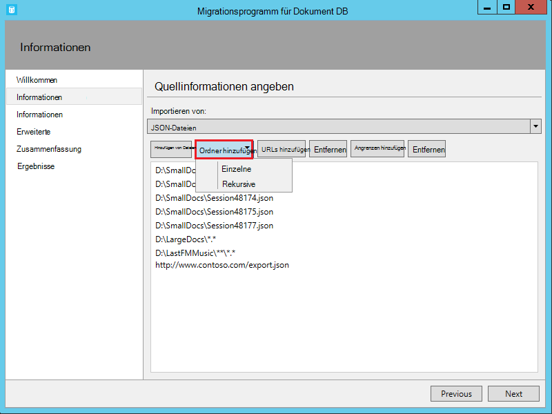

Hier sind einige Beispiele für Befehlszeilen JSON-Dateien importieren:

    #Import a single JSON file
    dt.exe /s:JsonFile /s.Files:.\Sessions.json /t:DocumentDBBulk /t.ConnectionString:"AccountEndpoint=<DocumentDB Endpoint>;AccountKey=<DocumentDB Key>;Database=<DocumentDB Database>;" /t.Collection:Sessions /t.CollectionThroughput:2500

    #Import a directory of JSON files
    dt.exe /s:JsonFile /s.Files:C:\TESessions\*.json /t:DocumentDBBulk /t.ConnectionString:" AccountEndpoint=<DocumentDB Endpoint>;AccountKey=<DocumentDB Key>;Database=<DocumentDB Database>;" /t.Collection:Sessions /t.CollectionThroughput:2500

    #Import a directory (including sub-directories) of JSON files
    dt.exe /s:JsonFile /s.Files:C:\LastFMMusic\**\*.json /t:DocumentDBBulk /t.ConnectionString:" AccountEndpoint=<DocumentDB Endpoint>;AccountKey=<DocumentDB Key>;Database=<DocumentDB Database>;" /t.Collection:Music /t.CollectionThroughput:2500

    #Import a directory (single), directory (recursive), and individual JSON files
    dt.exe /s:JsonFile /s.Files:C:\Tweets\*.*;C:\LargeDocs\**\*.*;C:\TESessions\Session48172.json;C:\TESessions\Session48173.json;C:\TESessions\Session48174.json;C:\TESessions\Session48175.json;C:\TESessions\Session48177.json /t:DocumentDBBulk /t.ConnectionString:"AccountEndpoint=<DocumentDB Endpoint>;AccountKey=<DocumentDB Key>;Database=<DocumentDB Database>;" /t.Collection:subs /t.CollectionThroughput:2500

    #Import a single JSON file and partition the data across 4 collections
    dt.exe /s:JsonFile /s.Files:D:\\CompanyData\\Companies.json /t:DocumentDBBulk /t.ConnectionString:"AccountEndpoint=<DocumentDB Endpoint>;AccountKey=<DocumentDB Key>;Database=<DocumentDB Database>;" /t.Collection:comp[1-4] /t.PartitionKey:name /t.CollectionThroughput:2500

##Importieren von MongoDB

Option MongoDB Quelle Importer können Sie importieren aus einer einzelnen MongoDB optional Dokumente mithilfe einer Abfrage filtern und die Dokumentstruktur mithilfe der Projektion ändern.  

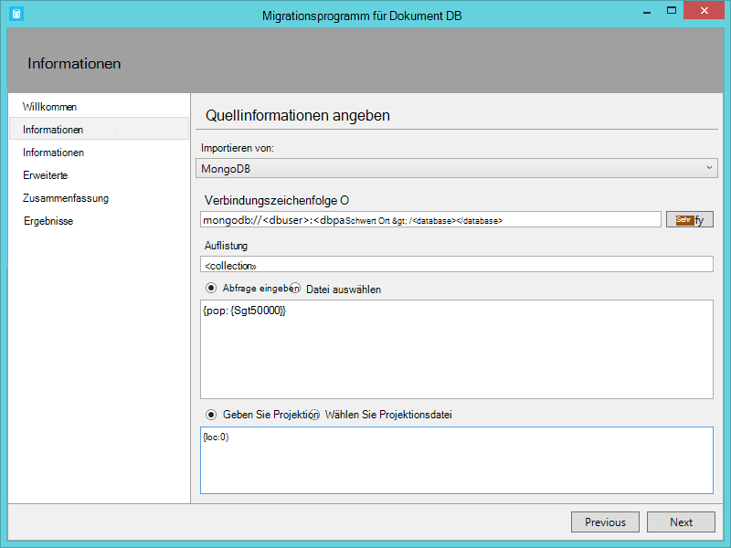

Die Verbindungszeichenfolge ist MongoDB-Standardformat:

    mongodb://<dbuser>:<dbpassword>@<host>:<port>/<database>

> [AZURE.NOTE] Verwenden Sie den Befehl überprüfen, um sicherzustellen, dass im Feld Verbindungszeichenfolge angegebenen MongoDB-Instanz zugegriffen werden kann.

Geben Sie den Namen der Auflistung, aus der Daten importiert werden. Sie können optional angeben oder eine Datei für eine Abfrage (z. B. {pop: {$gt: 5000}}) oder Projektion (z. B. {Loc:0}) filtern und shape-Daten importiert werden sollen.

Hier sind einige Beispiele für Befehlszeilen aus MongoDB importieren:

    #Import all documents from a MongoDB collection
    dt.exe /s:MongoDB /s.ConnectionString:mongodb://<dbuser>:<dbpassword>@<host>:<port>/<database> /s.Collection:zips /t:DocumentDBBulk /t.ConnectionString:"AccountEndpoint=<DocumentDB Endpoint>;AccountKey=<DocumentDB Key>;Database=<DocumentDB Database>;" /t.Collection:BulkZips /t.IdField:_id /t.CollectionThroughput:2500

    #Import documents from a MongoDB collection which match the query and exclude the loc field
    dt.exe /s:MongoDB /s.ConnectionString:mongodb://<dbuser>:<dbpassword>@<host>:<port>/<database> /s.Collection:zips /s.Query:{pop:{$gt:50000}} /s.Projection:{loc:0} /t:DocumentDBBulk /t.ConnectionString:"AccountEndpoint=<DocumentDB Endpoint>;AccountKey=<DocumentDB Key>;Database=<DocumentDB Database>;" /t.Collection:BulkZipsTransform /t.IdField:_id/t.CollectionThroughput:2500

##MongoDB Exportdateien importieren

MongoDB Export JSON Datei Quelle Importer Option können Sie mindestens eine JSON Dateien vom Dienstprogramm Mongoexport importieren.  

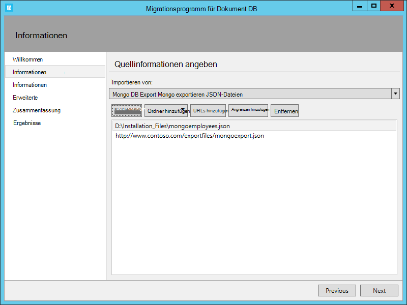

Wenn Ordner hinzufügen, die MongoDB Export JSON-Dateien für den Import enthalten, können Sie nach Dateien in Unterordnern rekursiv.

Es folgt ein Beispiel Befehlszeile MongoDB Export JSON-Dateien importieren:

    dt.exe /s:MongoDBExport /s.Files:D:\mongoemployees.json /t:DocumentDBBulk /t.ConnectionString:"AccountEndpoint=<DocumentDB Endpoint>;AccountKey=<DocumentDB Key>;Database=<DocumentDB Database>;" /t.Collection:employees /t.IdField:_id /t.Dates:Epoch /t.CollectionThroughput:2500

##Importieren von SQL Server

SQL Quelle Importer-Option können Sie aus einer einzelnen SQL Server-Datenbank importieren und optional Filtern von Datensätzen mithilfe einer Abfrage importiert werden. Darüber hinaus können Sie die Dokumentstruktur durch Angabe Schachtelungstrennzeichen (mehr dazu in Kürze) ändern.  

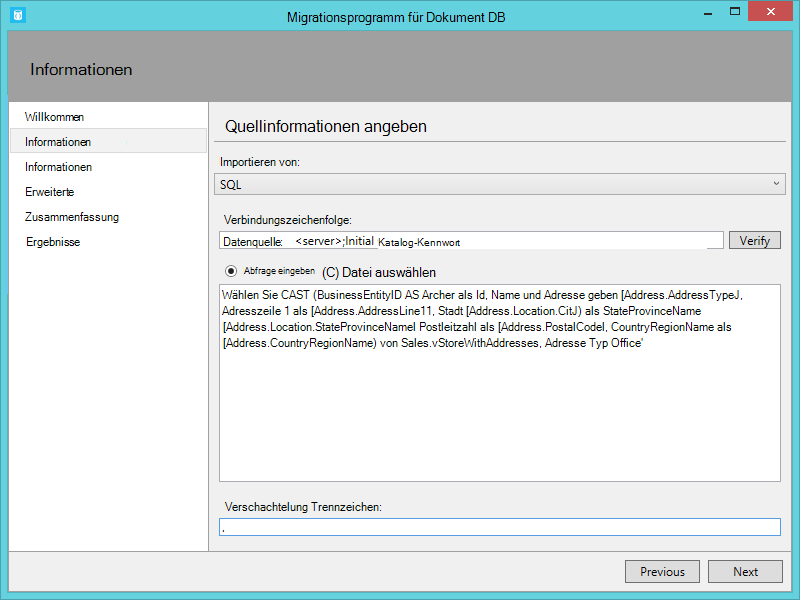

Das Format der Verbindungszeichenfolge ist standard SQL Verbindungszeichenfolgenformat.

> [AZURE.NOTE] Verwenden Sie den Befehl überprüfen, um sicherzustellen, dass im Feld Verbindungszeichenfolge angegebene SQL Server-Instanz zugegriffen werden kann.

Schachteln Separator-Eigenschaft zum Erstellen von hierarchischen Beziehung (untergeordnete Dokumente) während des Imports. Betrachten Sie die folgende SQL-Abfrage:

*Wählen Sie Umwandlung (BusinessEntityID AS Varchar) als Id Name Adresstyp als [Address.AddressType] Adresszeile 1 als [Address.AddressLine1] Stadt [Address.Location.City] StateProvinceName wie [Address.Location.StateProvinceName] Postleitzahl als [Address.PostalCode], CountryRegionName aus Sales.vStoreWithAddresses, Adresstyp als [Address.CountryRegionName] = "Main Office*

Die folgenden (partiell) Ergebnisse zurückgibt:

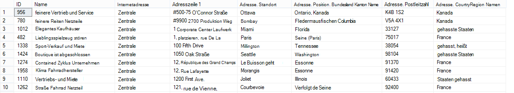

Beachten Sie die Aliasnamen wie Address.AddressType und Address.Location.StateProvinceName. Durch Angabe des Schachtelungstrennzeichen '.', das Importtool Filialdokumente Adresse und Address.Location während des Imports erstellt. Hier ist ein Beispiel für eine resultierende Dokument in DocumentDB:

*{"Id": "956", "Name": "Genauer Sales und Service", "Address": {"Adresstyp": "Main Office", "Adresszeile 1": "#500 75 O'Connor Street", "Location": {"Stadt": "Ottawa", "StateProvinceName": "Ontario"}, "Postleitzahl": "K4B 1S2", "CountryRegionName": "Kanada"}}*

Hier sind einige Beispiele für Befehlszeilen aus SQL Server importieren:

    #Import records from SQL which match a query
    dt.exe /s:SQL /s.ConnectionString:"Data Source=<server>;Initial Catalog=AdventureWorks;User Id=advworks;Password=<password>;" /s.Query:"select CAST(BusinessEntityID AS varchar) as Id, * from Sales.vStoreWithAddresses WHERE AddressType='Main Office'" /t:DocumentDBBulk /t.ConnectionString:" AccountEndpoint=<DocumentDB Endpoint>;AccountKey=<DocumentDB Key>;Database=<DocumentDB Database>;" /t.Collection:Stores /t.IdField:Id /t.CollectionThroughput:2500

    #Import records from sql which match a query and create hierarchical relationships
    dt.exe /s:SQL /s.ConnectionString:"Data Source=<server>;Initial Catalog=AdventureWorks;User Id=advworks;Password=<password>;" /s.Query:"select CAST(BusinessEntityID AS varchar) as Id, Name, AddressType as [Address.AddressType], AddressLine1 as [Address.AddressLine1], City as [Address.Location.City], StateProvinceName as [Address.Location.StateProvinceName], PostalCode as [Address.PostalCode], CountryRegionName as [Address.CountryRegionName] from Sales.vStoreWithAddresses WHERE AddressType='Main Office'" /s.NestingSeparator:. /t:DocumentDBBulk /t.ConnectionString:" AccountEndpoint=<DocumentDB Endpoint>;AccountKey=<DocumentDB Key>;Database=<DocumentDB Database>;" /t.Collection:StoresSub /t.IdField:Id /t.CollectionThroughput:2500

##Importieren von CSV-Dateien - CSV JSON konvertieren

Die Option CSV-Datei Quelle Importer können Sie mindestens eine CSV-Datei importieren. Wenn Sie Ordner hinzufügen, die CSV-für den Import Dateien, können Sie nach Dateien in Unterordnern rekursiv.

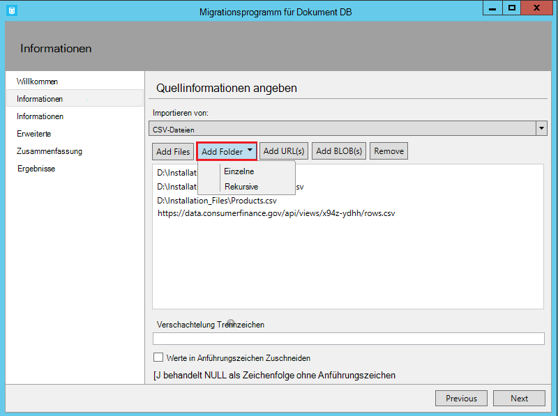

Wie die SQL-Quelle schachteln Separator-Eigenschaft verwendet werden hierarchische Beziehung (untergeordnete Dokumente) während des Imports erstellt. Berücksichtigen Sie den folgenden CSV-Header Zeile und Datenzeilen:

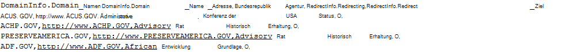

Beachten Sie die Aliasnamen wie DomainInfo.Domain_Name und RedirectInfo.Redirecting. Durch Angabe des Schachtelungstrennzeichen '.', das Importtool erstellen Filialdokumente DomainInfo und RedirectInfo während des Imports. Hier ist ein Beispiel für eine resultierende Dokument in DocumentDB:

*{"DomainInfo": {"Domänenname": "ACUS.GOV", "Domain_Name_Address": "http://www.ACUS.GOV"}, "Bundesbehörde": "Administrative Konferenz der Vereinigten Staaten", "RedirectInfo": {"Umleiten": "0", "Redirect_Destination": ""}, "Id": "9cc565c5-ebcd-1c03-ebd3-cc3e2ecd814d"}*

Import-Tool versucht, Informationen für bei Werten in CSV-Dateien (Werte in Anführungszeichen immer als Zeichenfolgen behandelt) ableiten.  In der folgenden Reihenfolge identifiziert werden: Anzahl, Datetime, Boolean.  

Es gibt zwei Dinge zu CSV-Dateien importieren:

1.  Standardmäßig bei Werten werden immer abgeschnitten für Tabstopps und Leerzeichen, wenn Werte in Anführungszeichen als bleiben-ist. Dieses Verhalten kann das Kontrollkästchen Zuschneiden Werte in Anführungszeichen oder die Option /s.TrimQuoted überschrieben werden.

2.  Bei Null werden standardmäßig als null-Wert. Dies kann überschrieben werden (d. h. bei Null als "null" Zeichenfolge behandelt) ohne Anführungszeichen NULL mit der Zeichenfolge das Kontrollkästchen oder die Option /s.NoUnquotedNulls.

Es folgt ein Beispiel Befehlszeile für CSV-Dateien exportieren:

    dt.exe /s:CsvFile /s.Files:.\Employees.csv /t:DocumentDBBulk /t.ConnectionString:"AccountEndpoint=<DocumentDB Endpoint>;AccountKey=<DocumentDB Key>;Database=<DocumentDB Database>;" /t.Collection:Employees /t.IdField:EntityID /t.CollectionThroughput:2500

##Importieren von Azure Table storage

Option Azure Table Storage Quelle Importer können Sie aus einer einzelnen Azure Storage Tabelle importieren und optional Filtern Tabellenentitäten importiert werden.  

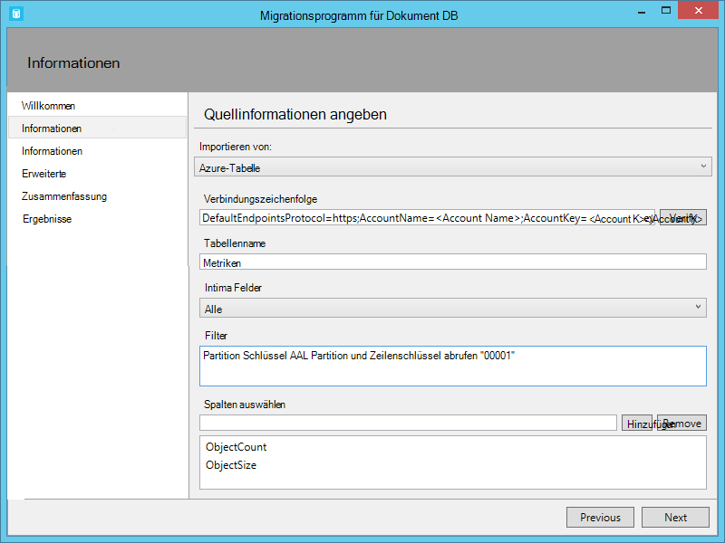

Das Format der Verbindungszeichenfolge Azure Table Storage ist:

    DefaultEndpointsProtocol=<protocol>;AccountName=<Account Name>;AccountKey=<Account Key>;

> [AZURE.NOTE] Befehl überprüfen um sicherzustellen, dass im Feld Verbindungszeichenfolge angegebene Azure Table Storage Instanz zugegriffen werden kann.

Geben Sie den Namen der Azure-Tabelle aus der Daten importiert werden. Sie können wahlweise einen [Filter](https://msdn.microsoft.com/library/azure/ff683669.aspx)angeben.

Azure Table Storage Quelle Importer Option hat die folgenden zusätzlichen Optionen:

1. Interne Felder
    2. -Fügen Sie alle internen Felder (PartitionKey, RowKey und Zeitstempel)
    3. Keine - ausschließen alle internen Felder
    4. RowKey - nur der RowKey einfügen
3. Spalten auswählen
    1. Projektionen unterstützt Azure Storage Tabellenfilter nicht. Wenn Sie nur bestimmte Azure Tabelle Entitätseigenschaften importieren möchten, fügen sie Spalten auswählen. Alle anderen Entitätseigenschaften werden ignoriert.

Es folgt ein Beispiel Befehlszeile von Azure Table Storage importieren:

    dt.exe /s:AzureTable /s.ConnectionString:"DefaultEndpointsProtocol=https;AccountName=<Account Name>;AccountKey=<Account Key>" /s.Table:metrics /s.InternalFields:All /s.Filter:"PartitionKey eq 'Partition1' and RowKey gt '00001'" /s.Projection:ObjectCount;ObjectSize  /t:DocumentDBBulk /t.ConnectionString:" AccountEndpoint=<DocumentDB Endpoint>;AccountKey=<DocumentDB Key>;Database=<DocumentDB Database>;" /t.Collection:metrics /t.CollectionThroughput:2500

##Importieren von Amazon DynamoDB

Amazon DynamoDB Quelle Importer-Option können Sie aus einer einzelnen Tabelle Amazon DynamoDB importieren und optional Filtern Entitäten importiert werden. Mehrere Vorlagen enthalten, sodass ein Import so einfach wie möglich ist.

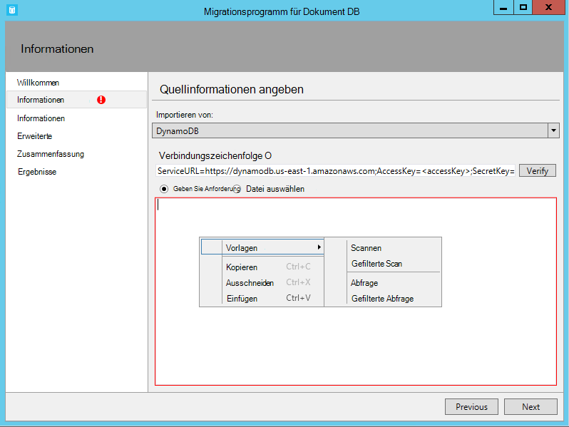

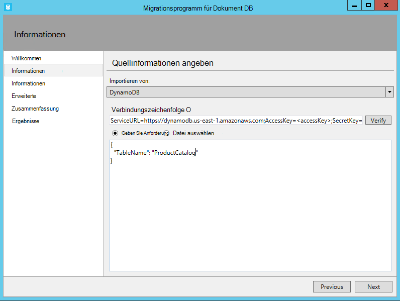

Das Format der Verbindungszeichenfolge Amazon DynamoDB ist:

    ServiceURL=<Service Address>;AccessKey=<Access Key>;SecretKey=<Secret Key>;

> [AZURE.NOTE] Verwenden Sie den Befehl überprüfen, um sicherzustellen, dass im Feld Verbindungszeichenfolge angegebenen Amazon DynamoDB-Instanz zugegriffen werden kann.

Es folgt ein Beispiel Befehlszeile von Amazon DynamoDB importieren:

    dt.exe /s:DynamoDB /s.ConnectionString:ServiceURL=https://dynamodb.us-east-1.amazonaws.com;AccessKey=<accessKey>;SecretKey=<secretKey> /s.Request:"{   """TableName""": """ProductCatalog""" }" /t:DocumentDBBulk /t.ConnectionString:"AccountEndpoint=<DocumentDB Endpoint>;AccountKey=<DocumentDB Key>;Database=<DocumentDB Database>;" /t.Collection:catalogCollection /t.CollectionThroughput:2500

##Importieren von Dateien aus dem Azure BLOB-Speicher

JSON-Datei, MongoDB Exportdatei und CSV-Datei Importer Optionen können Sie eine oder mehrere Dateien aus dem Azure BLOB-Speicher importieren. Geben Sie nach Angabe eines BLOB-Container URL und Kontoschlüssel einen regulären Ausdruck zum Wählen Sie Dateien importieren.

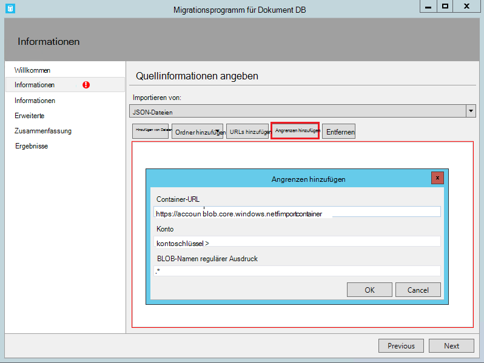

Hier ist Befehlszeile Beispiel JSON-Dateien von Azure BLOB-Speicher zu importieren:

    dt.exe /s:JsonFile /s.Files:"blobs://<account key>@account.blob.core.windows.net:443/importcontainer/.*" /t:DocumentDBBulk /t.ConnectionString:"AccountEndpoint=<DocumentDB Endpoint>;AccountKey=<DocumentDB Key>;Database=<DocumentDB Database>;" /t.Collection:doctest

##Importieren von DocumentDB

Die Option DocumentDB Quelle Importer können Sie Daten aus mindestens DocumentDB und optional Filtern Dokumente mithilfe einer Abfrage.  

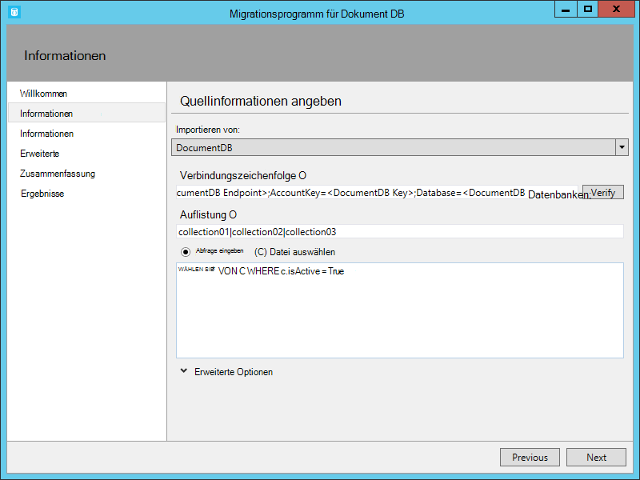

Das Format der Verbindungszeichenfolge DocumentDB ist:

    AccountEndpoint=<DocumentDB Endpoint>;AccountKey=<DocumentDB Key>;Database=<DocumentDB Database>;

DocumentDB, Konto-Verbindungszeichenfolge aus dem Schlüssel Blade Azure-Portal abgerufen werden kann, muss wie im [DocumentDB-Konto verwalten](documentdb-manage-account.md), der Namen der Datenbank die Verbindungszeichenfolge im folgenden Format hinzugefügt werden:

    Database=<DocumentDB Database>;

> [AZURE.NOTE] Verwenden Sie den Befehl überprüfen, um sicherzustellen, dass im Feld Verbindungszeichenfolge angegebene DocumentDB-Instanz zugegriffen werden kann.

Importieren aus einzelnen DocumentDB Geben Sie den Namen der Auflistung, aus der Daten importiert werden. Importieren aus mehreren DocumentDB bieten einen regulären Ausdruck mindestens eine Auflistung übereinstimmen (z. B. collection01 | collection02 | collection03). Optional können Sie angeben oder eine Datei für eine Abfrage zum Filtern und Form der Daten importiert werden sollen.

> [AZURE.NOTE] Da Feld Sammlung reguläre Ausdrücke akzeptiert, wenn Sie aus einer Auflistung importieren, deren Name regulären Ausdruck Zeichen enthält, müssen diese Zeichen entsprechend geschützt.

Die Option DocumentDB Quelle Einführer hat die folgenden erweiterten Optionen:

1. Interne Felder enthalten: Gibt an, ob DocumentDB Dokumenteigenschaften System exportieren (_rid, _ts) enthalten.
2. Anzahl der Wiederholungsversuche bei: Gibt die Anzahl der Wiederholungsversuche bei vorübergehenden Fehlern (z.B. Unterbrechung der Netzwerkkonnektivität) der Verbindungs mit DocumentDB.
3. Wiederholungsintervall: Gibt an, wie lange zwischen Wiederholung bei Ausfällen (z. B. Unterbrechung der Netzwerkkonnektivität) die Verbindung mit DocumentDB.
4. Verbindungsmodus: Gibt den Verbindungsmodus mit DocumentDB. Die Auswahlmöglichkeiten sind DirectTcp, DirectHttps und Gateway. Die direkte Verbindung sind schneller, Gateway-Modus ist mehr Firewall angezeigten nur Port 443 verwendet.

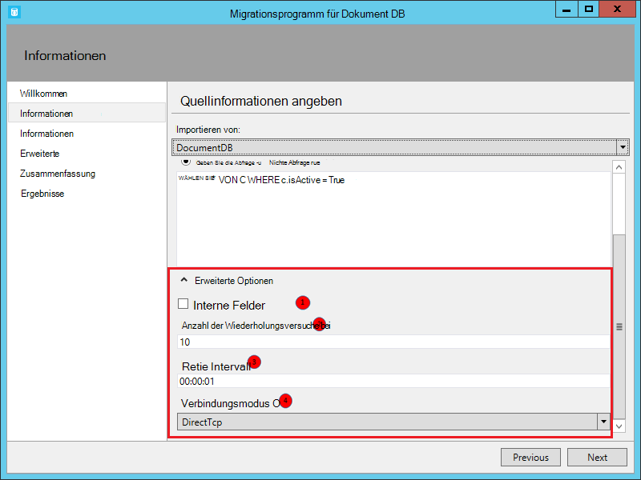

> [AZURE.TIP] Das Importtool standardmäßig Verbindungsmodus DirectTcp. Wechseln Sie Firewall Probleme zum Verbindungsmodus Gateway, Bedarf es nur Port 443.

Hier sind einige Beispiele für Befehlszeilen von DocumentDB importieren:

    #Migrate data from one DocumentDB collection to another DocumentDB collections
    dt.exe /s:DocumentDB /s.ConnectionString:"AccountEndpoint=<DocumentDB Endpoint>;AccountKey=<DocumentDB Key>;Database=<DocumentDB Database>;" /s.Collection:TEColl /t:DocumentDBBulk /t.ConnectionString:" AccountEndpoint=<DocumentDB Endpoint>;AccountKey=<DocumentDB Key>;Database=<DocumentDB Database>;" /t.Collection:TESessions /t.CollectionThroughput:2500

    #Migrate data from multiple DocumentDB collections to a single DocumentDB collection
    dt.exe /s:DocumentDB /s.ConnectionString:"AccountEndpoint=<DocumentDB Endpoint>;AccountKey=<DocumentDB Key>;Database=<DocumentDB Database>;" /s.Collection:comp1|comp2|comp3|comp4 /t:DocumentDBBulk /t.ConnectionString:"AccountEndpoint=<DocumentDB Endpoint>;AccountKey=<DocumentDB Key>;Database=<DocumentDB Database>;" /t.Collection:singleCollection /t.CollectionThroughput:2500

    #Export a DocumentDB collection to a JSON file
    dt.exe /s:DocumentDB /s.ConnectionString:"AccountEndpoint=<DocumentDB Endpoint>;AccountKey=<DocumentDB Key>;Database=<DocumentDB Database>;" /s.Collection:StoresSub /t:JsonFile /t.File:StoresExport.json /t.Overwrite /t.CollectionThroughput:2500

##Importieren von HBase

Die Option HBase Quelle Importer können Sie Daten aus einer Tabelle HBase und optional die Daten filtern. Mehrere Vorlagen enthalten, sodass ein Import so einfach wie möglich ist.

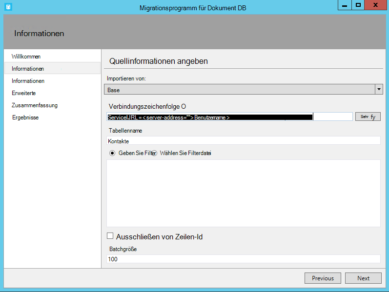

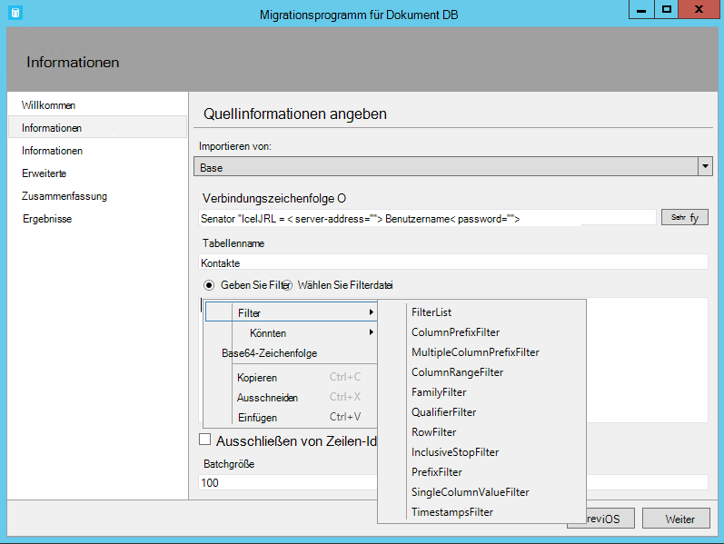

Das Format der Verbindungszeichenfolge HBase Stargate ist:

    ServiceURL=<server-address>;Username=<username>;Password=<password>

> [AZURE.NOTE] Verwenden Sie den Befehl überprüfen, um sicherzustellen, dass im Feld Verbindungszeichenfolge angegebene HBase-Instanz zugegriffen werden kann.

Es folgt ein Beispiel Befehlszeile aus HBase importieren:

    dt.exe /s:HBase /s.ConnectionString:ServiceURL=<server-address>;Username=<username>;Password=<password> /s.Table:Contacts /t:DocumentDBBulk /t.ConnectionString:"AccountEndpoint=<DocumentDB Endpoint>;AccountKey=<DocumentDB Key>;Database=<DocumentDB Database>;" /t.Collection:hbaseimport

##Importieren in DocumentDB (Bulk Import)

DocumentDB Bulk-Importprogramm können Sie aus verfügbaren Optionen mit einer Effizienz DocumentDB gespeichert. Das Tool unterstützt in einer einzigen partitioniert DocumentDB Sammlung importieren und Sharding importieren, wobei Daten über mehrere einzelne partitioniert DocumentDB Sammlungen partitioniert werden. Weitere Informationen zum Partitionieren von Daten finden Sie unter [Partitioning und Skalierung in Azure DocumentDB](documentdb-partition-data.md). Das Tool erstellen, ausführen und löschen Sie die gespeicherte Prozedur Sammlung(en) Ziel.  

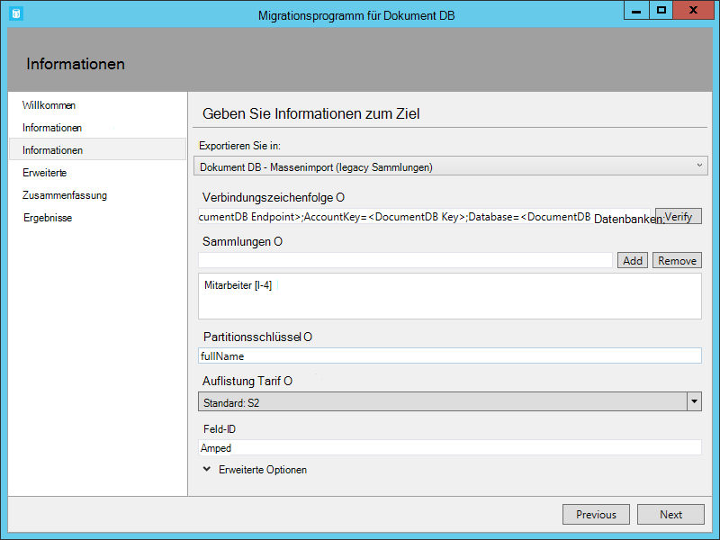

Das Format der Verbindungszeichenfolge DocumentDB ist:

    AccountEndpoint=<DocumentDB Endpoint>;AccountKey=<DocumentDB Key>;Database=<DocumentDB Database>;

DocumentDB, Konto-Verbindungszeichenfolge aus dem Schlüssel Blade Azure-Portal abgerufen werden kann, muss wie im [DocumentDB-Konto verwalten](documentdb-manage-account.md), der Namen der Datenbank die Verbindungszeichenfolge im folgenden Format hinzugefügt werden:

    Database=<DocumentDB Database>;

> [AZURE.NOTE] Verwenden Sie den Befehl überprüfen, um sicherzustellen, dass im Feld Verbindungszeichenfolge angegebene DocumentDB-Instanz zugegriffen werden kann.

Um eine Sammlung zu importieren, geben Sie den Namen, Daten importiert werden, und klicken Sie auf die Schaltfläche hinzufügen. Um mehrere Sammlungen zu importieren, geben Sie jede Auflistung einzeln oder mithilfe die folgende Syntax an mehrere Sammlungen: *Collection_prefix*[startIndex - endIndex]. Beachten Sie bei der Angabe mehrerer Sammlungen über die Syntax der vorgenannten Folgendes:

1. Nur ganzzahligen Bereich Namensmuster werden unterstützt. Beispielsweise angegeben Auflistung [0-3] erzeugt die folgenden Sammlungen: collection0 collection1, collection2, collection3.
2. Eine abgekürzte Syntax verwenden: [3] Auflistung ausgeben dieselben Sammlungen in Schritt 1 erwähnten.
3. Mehr als eine Ersetzung kann bereitgestellt werden. Beispielsweise generiert Auflistung [0-1] [0-9] 20 Sammlungsnamen mit führenden Nullen (collection01,... 02... 03).

Nachdem die Auflistung Namen angegeben haben, wählen Sie den gewünschten Durchsatz von Sammlung(en) (400 RUs 10.000 RUs). Aus Leistungsgründen importieren Wählen Sie einen höheren Durchsatz. Weitere Informationen zur Leistung finden Sie unter [Leistungsmerkmale in DocumentDB](documentdb-performance-levels.md).

> [AZURE.NOTE] Die Durchsatz Einstellung gilt nur für erstellen. Wenn die angegebene Auflistung bereits vorhanden ist, wird der Durchsatz nicht geändert werden.

Beim Importieren mehrerer Sammlungen basierend Import-Tool unterstützt Hash Sharding. Geben Sie in diesem Szenario als Partitionsschlüssel soll Dokumenteigenschaft (wenn Partitionsschlüssel leer ist, Dokumente werden Sharding zufällig über die Zielsammlungen).

Optional können Sie angeben, welches Feld der Importquelle sollte während des Imports (Beachten Sie, dass Dokumente nicht diese Eigenschaft enthalten, dann das Importtool GUID als Wert der Id-Eigenschaft generiert) als DocumentDB Dokument-Id-Eigenschaft verwendet werden.

Während des Imports sind eine Reihe von erweiterten Optionen verfügbar. Während das Tool enthält standardmäßig einen Massenimport gespeicherte Prozedur (BulkInsert.js): können Ihre eigenen gespeicherten Importvorgang angeben

 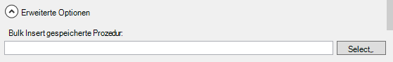

Darüber hinaus beim Importieren von Datentypen (z. B. aus SQL Server oder MongoDB) können zwischen drei Importoptionen Sie:

 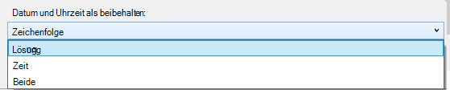

-   Zeichenfolge: Als Zeichenfolgenwert beibehalten
-   Zeit: Als eine Epoche Wert beibehalten
-   Beide: Bestehen Zeichenfolge und Zahlenwerte Epoche. Diese Option erstellt ein Filialdokument zum Beispiel: "Date_joined": {"Wert": "2013-10-21T21:17:25.2410000Z", "Zeit": 1382390245}

DocumentDB Bulk Einführer hat die folgenden zusätzlichen Optionen:

1. Stapelgröße: Das Tool standardmäßig eine Batchgröße von 50.  Sollten Sie die zu importierenden Dokumente groß sind, verringern die Stapelgröße. Umgekehrt sollten Sie zu importierenden Dokumente klein sind, die Batchgröße auslösen.
2. Max. Skriptgröße (Bytes): das Tool standardmäßig maximal Skriptgröße 512 KB
3. Deaktiviert automatische Id Generation: Jedes Dokument importiert werden ein ID-Feld enthält, kann diese Option Leistungssteigerung. Fehlt ein Feld eindeutige Id Dokumente werden nicht importiert.
4. Update vorhandene Dokumente: Das Tool standardmäßig keine Id-Konflikte ersetzen vorhandene Dokumente. Diese Option können Dokumente mit übereinstimmenden Ids überschreiben. Diese Funktion eignet sich für geplante Datenmigrationen, die Dokumente zu aktualisieren.
5. Anzahl der Wiederholungsversuche bei: Gibt die Anzahl der Wiederholungsversuche bei vorübergehenden Fehlern (z.B. Unterbrechung der Netzwerkkonnektivität) der Verbindungs mit DocumentDB.
6. Wiederholungsintervall: Gibt an, wie lange zwischen Wiederholung bei Ausfällen (z. B. Unterbrechung der Netzwerkkonnektivität) die Verbindung mit DocumentDB.
7. Verbindungsmodus: Gibt den Verbindungsmodus mit DocumentDB. Die Auswahlmöglichkeiten sind DirectTcp, DirectHttps und Gateway. Die direkte Verbindung sind schneller, Gateway-Modus ist mehr Firewall angezeigten nur Port 443 verwendet.

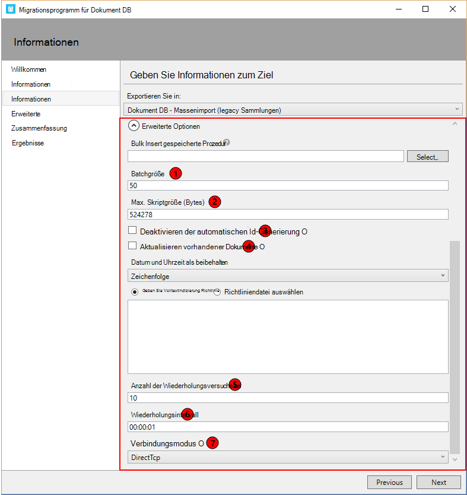

> [AZURE.TIP] Das Importtool standardmäßig Verbindungsmodus DirectTcp. Wechseln Sie Firewall Probleme zum Verbindungsmodus Gateway, Bedarf es nur Port 443.

##In DocumentDB (sequenziellen Datensatz importieren) importieren

Importer sequenziellen Datensatz DocumentDB kann aus verfügbaren Optionen pro Datensatz durch Importieren. Sie können diese Option, wenn Sie einer vorhandenen Sammlung importieren, die ihre Quote von gespeicherten Prozeduren erreicht hat. Das Tool unterstützt Import in einem (einer Partition und mehreren Partitionen) sowie Sharding-Auflistung DocumentDB importieren, wobei Daten über mehrere DocumentDB-Sammlungen auf einer Partition und mehreren Partitionen aufgeteilt ist. Weitere Informationen zum Partitionieren von Daten finden Sie unter [Partitioning und Skalierung in Azure DocumentDB](documentdb-partition-data.md).

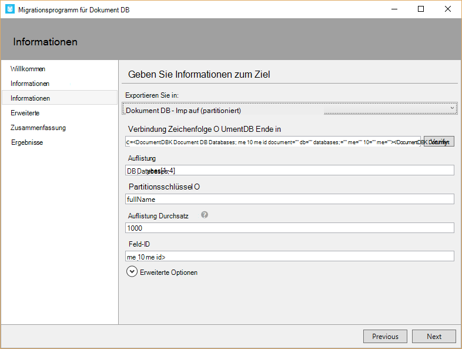

Das Format der Verbindungszeichenfolge DocumentDB ist:

    AccountEndpoint=<DocumentDB Endpoint>;AccountKey=<DocumentDB Key>;Database=<DocumentDB Database>;

DocumentDB, Konto-Verbindungszeichenfolge aus dem Schlüssel Blade Azure-Portal abgerufen werden kann, muss wie im [DocumentDB-Konto verwalten](documentdb-manage-account.md), der Namen der Datenbank die Verbindungszeichenfolge im folgenden Format hinzugefügt werden:

    Database=<DocumentDB Database>;

> [AZURE.NOTE] Verwenden Sie den Befehl überprüfen, um sicherzustellen, dass im Feld Verbindungszeichenfolge angegebene DocumentDB-Instanz zugegriffen werden kann.

Um eine Sammlung zu importieren, geben Sie den Namen, Daten importiert werden, und klicken Sie auf die Schaltfläche hinzufügen. Um mehrere Sammlungen zu importieren, geben Sie jede Auflistung einzeln oder mithilfe die folgende Syntax an mehrere Sammlungen: *Collection_prefix*[startIndex - endIndex]. Beachten Sie bei der Angabe mehrerer Sammlungen über die Syntax der vorgenannten Folgendes:

1. Nur ganzzahligen Bereich Namensmuster werden unterstützt. Beispielsweise angegeben Auflistung [0-3] erzeugt die folgenden Sammlungen: collection0 collection1, collection2, collection3.
2. Eine abgekürzte Syntax verwenden: [3] Auflistung ausgeben dieselben Sammlungen in Schritt 1 erwähnten.
3. Mehr als eine Ersetzung kann bereitgestellt werden. Beispielsweise generiert Auflistung [0-1] [0-9] 20 Sammlungsnamen mit führenden Nullen (collection01,... 02... 03).

Nachdem die Auflistung Namen angegeben haben, wählen Sie den gewünschten Durchsatz von Sammlung(en) (400 RUs 250.000 RUs). Aus Leistungsgründen importieren Wählen Sie einen höheren Durchsatz. Weitere Informationen zur Leistung finden Sie unter [Leistungsmerkmale in DocumentDB](documentdb-performance-levels.md). Jeder Import Sammlungen mit > 10.000 RUs Partitionsschlüssel benötigen. Wenn Sie mehr als 250.000 RUs lassen, sehen Sie [DocumentDB Konto erhöht](documentdb-increase-limits.md).

> [AZURE.NOTE] Die Durchsatz-Einstellung gilt nur für erstellen. Wenn die angegebene Auflistung bereits vorhanden ist, wird der Durchsatz nicht geändert werden.

Beim Importieren mehrerer Sammlungen basierend Import-Tool unterstützt Hash Sharding. Geben Sie in diesem Szenario als Partitionsschlüssel soll Dokumenteigenschaft (wenn Partitionsschlüssel leer ist, Dokumente werden Sharding zufällig über die Zielsammlungen).

Optional können Sie angeben, welches Feld der Importquelle sollte während des Imports (Beachten Sie, dass Dokumente nicht diese Eigenschaft enthalten, dann das Importtool GUID als Wert der Id-Eigenschaft generiert) als DocumentDB Dokument-Id-Eigenschaft verwendet werden.

Während des Imports sind eine Reihe von erweiterten Optionen verfügbar. Zunächst beim Importieren von Datentypen (z. B. aus SQL Server oder MongoDB) können zwischen drei Importoptionen Sie:

 

-   Zeichenfolge: Als Zeichenfolgenwert beibehalten
-   Zeit: Als eine Epoche Wert beibehalten
-   Beide: Bestehen Zeichenfolge und Zahlenwerte Epoche. Diese Option erstellt ein Filialdokument zum Beispiel: "Date_joined": {"Wert": "2013-10-21T21:17:25.2410000Z", "Zeit": 1382390245}

DocumentDB - sequenziellen Datensatz Einführer hat folgenden zusätzlichen erweiterten Optionen:

1. Anzahl von parallelen Anfragen: das Tool standardmäßig 2 parallele Anfragen. Sollten Sie die zu importierenden Dokumente klein sind, die Anzahl parallel auslösen. Beachten Sie, dass wenn diese Anzahl viel ausgelöst wird, der Import Drosselung auftreten kann.
2. Deaktiviert automatische Id Generation: Jedes Dokument importiert werden ein ID-Feld enthält, kann diese Option Leistungssteigerung. Fehlt ein Feld eindeutige Id Dokumente werden nicht importiert.
3. Update vorhandene Dokumente: Das Tool standardmäßig keine Id-Konflikte ersetzen vorhandene Dokumente. Diese Option können Dokumente mit übereinstimmenden Ids überschreiben. Diese Funktion eignet sich für geplante Datenmigrationen, die Dokumente zu aktualisieren.
4. Anzahl der Wiederholungsversuche bei: Gibt die Anzahl der Wiederholungsversuche bei vorübergehenden Fehlern (z.B. Unterbrechung der Netzwerkkonnektivität) der Verbindungs mit DocumentDB.
5. Wiederholungsintervall: Gibt an, wie lange zwischen Wiederholung bei Ausfällen (z. B. Unterbrechung der Netzwerkkonnektivität) die Verbindung mit DocumentDB.
6. Verbindungsmodus: Gibt den Verbindungsmodus mit DocumentDB. Die Auswahlmöglichkeiten sind DirectTcp, DirectHttps und Gateway. Die direkte Verbindung sind schneller, Gateway-Modus ist mehr Firewall angezeigten nur Port 443 verwendet.

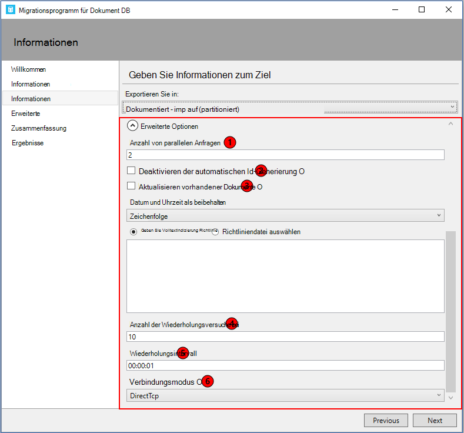

> [AZURE.TIP] Das Importtool standardmäßig Verbindungsmodus DirectTcp. Wechseln Sie Firewall Probleme zum Verbindungsmodus Gateway, Bedarf es nur Port 443.

##Geben Sie eine Indizierung Richtlinie an, wenn DocumentDB Sammlungen erstellen

Wenn ermöglichen das Migrationsprogramm Kollektionen beim Importieren können Sie die Indizierung Richtlinie Sammlungen angeben. In den erweiterten Optionen DocumentDB Bulk importieren und DocumentDB sequenzielle Aufnahmeoptionen Indizierung Richtlinienabschnitt navigieren.

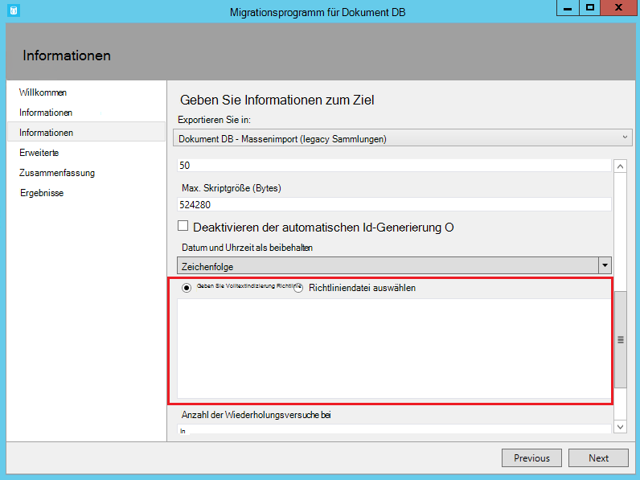

Die Indizierung Richtlinie erweiterte Option verwenden, können Sie eine Indizierung Richtliniendatei auswählen, manuell eingeben eine Indizierung Richtlinie oder wählen aus einer Reihe von Vorlagen (durch Rechtsklick auf die Indizierung Richtlinie Textbox).

Das Tool bietet Richtlinienvorlagen sind:

- Standardmäßig. Diese Richtlinie empfiehlt sich beim Durchführen von gleichheitsabfragen Zeichenfolgen auf und ORDER BY, Range und gleichheitsabfragen für Zahlen verwenden. Diese Richtlinie wirkt Index Speicher als Bereich.
- Bereich. Diese Richtlinie ist am besten, ORDER BY, Range und Gleichheit Abfragen auf Zahlen und Zeichenfolgen verwenden. Diese Richtlinie enthält eine höhere Speicher Indizierungsaufwand als Standard oder Hash.

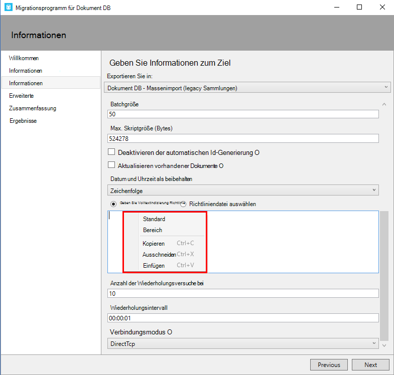

> [AZURE.NOTE] Wenn Sie eine Indexierung Richtlinie nicht angeben, wird die Standardrichtlinie angewendet. Weitere Informationen über Indexierungsrichtlinien anzeigen Sie [Indexierungsrichtlinien DocumentDB](documentdb-indexing-policies.md)

## In JSON-Datei exportieren

DocumentDB JSON Ausführer können Sie die verfügbaren Optionen in eine JSON-Datei exportieren, die ein Array von JSON-Dokumente enthält. Das Tool exportieren Sie behandelt und können zu den Migrationsbefehl führen Sie den Befehl selbst. Die resultierende JSON-Datei kann lokal oder in Azure BLOB-Speicher gespeichert.

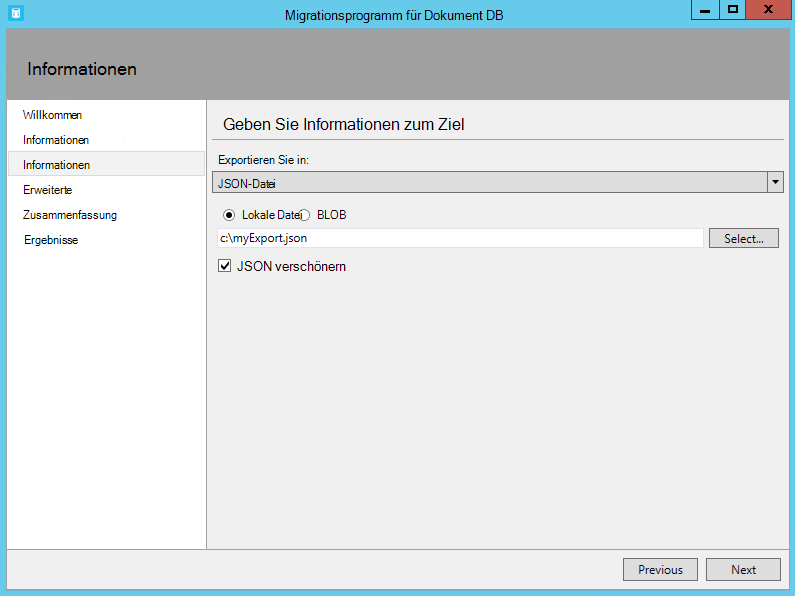

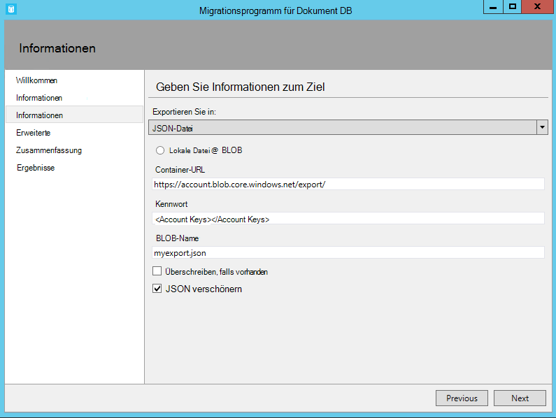

Sie können optional die resultierende JSON verschönern das resultierende Dokument vergrößern wird und der Inhalt mehr lesbar.

    Standard JSON export
    [{"id":"Sample","Title":"About Paris","Language":{"Name":"English"},"Author":{"Name":"Don","Location":{"City":"Paris","Country":"France"}},"Content":"Don's document in DocumentDB is a valid JSON document as defined by the JSON spec.","PageViews":10000,"Topics":[{"Title":"History of Paris"},{"Title":"Places to see in Paris"}]}]

    Prettified JSON export
    [
    {
    "id": "Sample",
    "Title": "About Paris",
    "Language": {
      "Name": "English"
    },
    "Author": {
      "Name": "Don",
      "Location": {
        "City": "Paris",
        "Country": "France"
      }
    },
    "Content": "Don's document in DocumentDB is a valid JSON document as defined by the JSON spec.",
    "PageViews": 10000,
    "Topics": [
      {
        "Title": "History of Paris"
      },
      {
        "Title": "Places to see in Paris"
      }
    ]
    }]

## Erweiterte Konfiguration

Geben Sie im Bildschirm Erweiterte Konfiguration den Speicherort der Protokolldatei auf die Fehler geschrieben werden soll. Auf dieser Seite gelten folgenden Regeln:

1.  Wenn ein Dateiname nicht angegeben, werden alle Fehler auf der Seite Ergebnisse zurückgegeben.
2.  Wenn ein Dateiname ohne ein Verzeichnis angegeben wird, wird dann die Datei erstellt (überschrieben im aktuellen Verzeichnis der Umgebung oder).
3.  Bei Auswahl einer vorhandenen Datei wird die Datei überschrieben werden, gibt es keine Option Append.

Wählen Sie, ob alle, kritisch oder keine Fehlermeldungen angezeigt. Legen Sie wie häufig auf Bildschirm übertragen Nachricht mit seinen Status aktualisiert werden.

    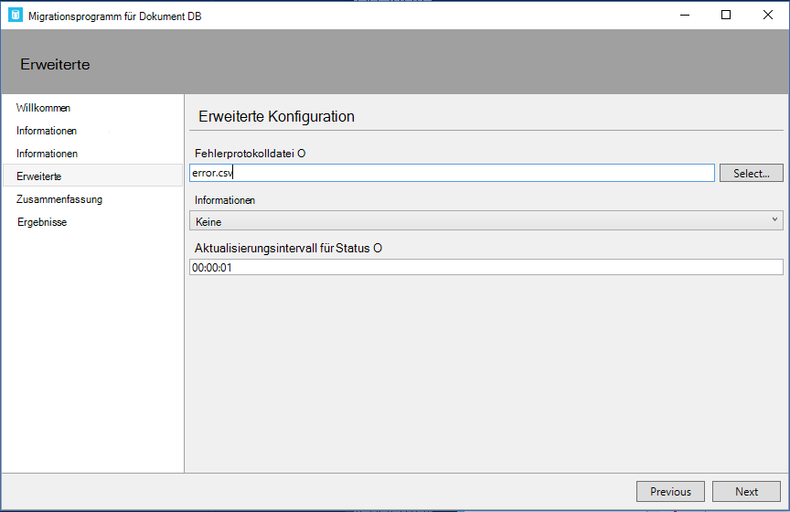

## Bestätigen Sie Einstellungen importieren und Befehlszeile anzeigen

1. Nach Informationen, Informationen und erweiterte Konfiguration angeben, überprüfen Sie die Zusammenfassung Migration und optional anzeigen/kopieren den Migrationsbefehl (den Befehl Kopieren für Importvorgänge automatisieren ist):

    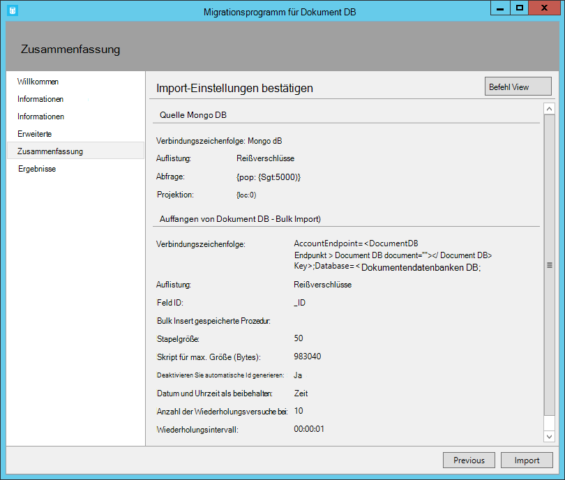

    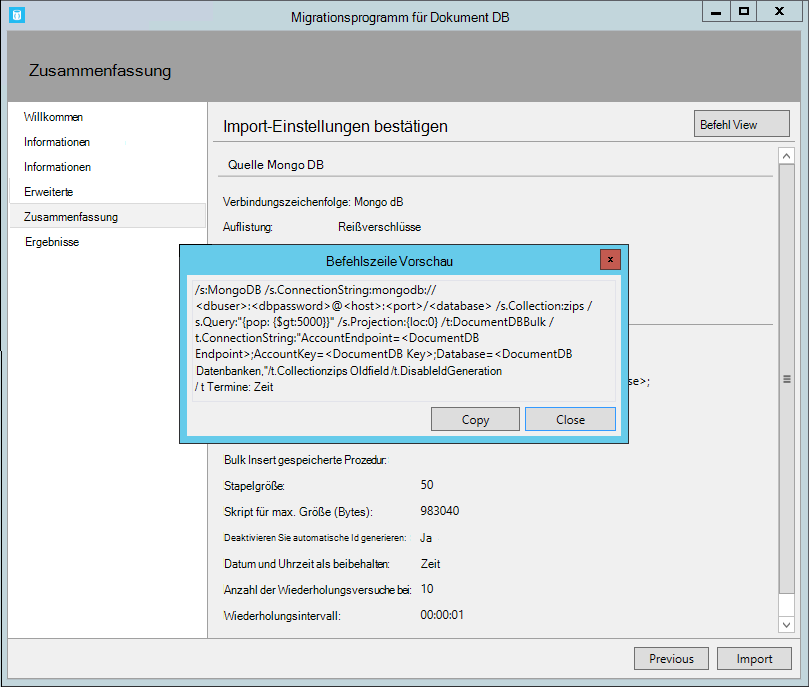

2. Wenn Sie die Optionen für Quelle und Ziel sind, klicken Sie auf **Importieren**. Dauer, Anzahl der übertragenen und Informationen (Wenn Sie einen Dateinamen in der erweiterten Konfiguration angegeben haben) aktualisiert wie der Import ausgeführt wird. Danach können Sie die Ergebnisse exportieren (z. B. mit Importfehler).

    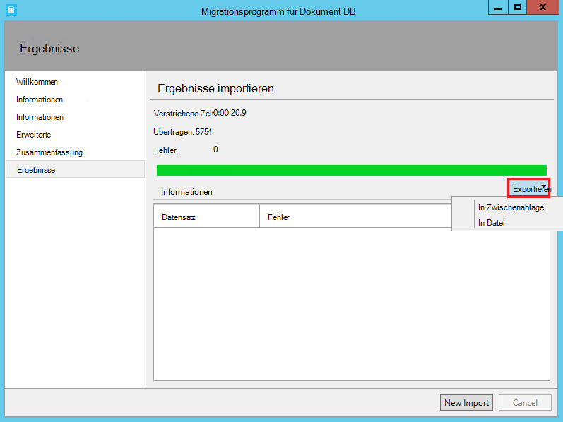

3. Auch kann einen neuen Import starten die vorhandenen Einstellungen (z. B. Zeichenfolge Informationen, Quelle und Ziel Verbindungsoption usw.) beibehalten oder alle Werte zurücksetzen.

    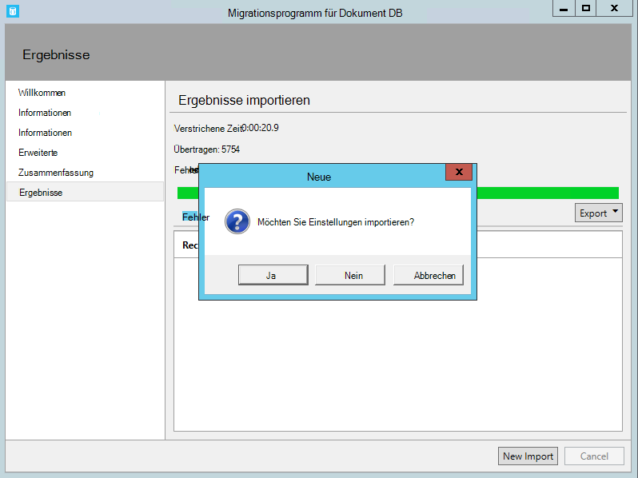

## Nächste Schritte

- Weitere Informationen zu DocumentDB finden Sie unter [Learning Path](https://azure.microsoft.com/documentation/learning-paths/documentdb/).
