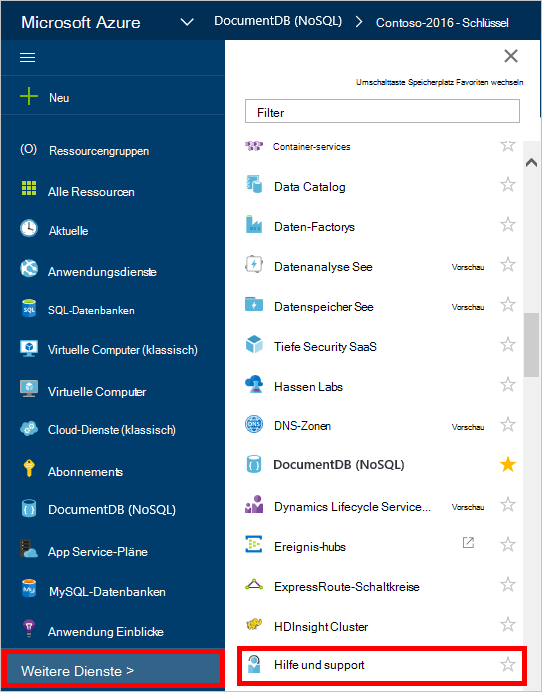
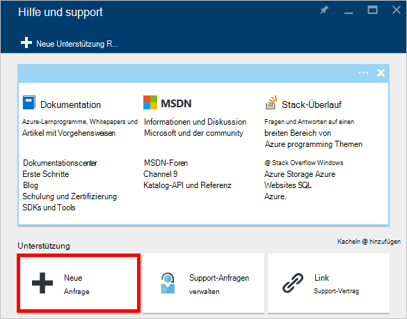
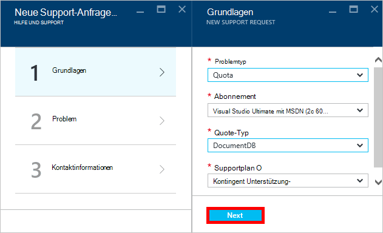
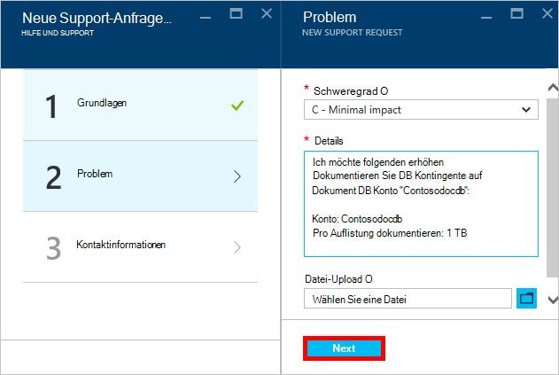
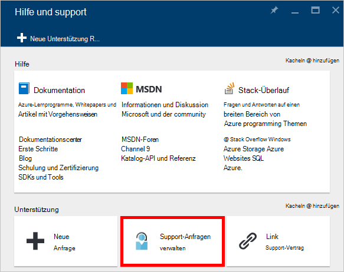

<properties
    pageTitle="Anforderung erhöht DocumentDB Konto Kontingente | Microsoft Azure"
    description="Erfahren Sie, wie eine Anpassung DocumentDB Datenbank Kontingente Speicherung und Durchsatz pro Sammlung anfordern."
    services="documentdb"
    authors="AndrewHoh"
    manager="jhubbard"
    editor="monicar"
    documentationCenter=""/>

<tags
    ms.service="documentdb"
    ms.workload="data-services"
    ms.tgt_pltfrm="na"
    ms.devlang="na"
    ms.topic="article"
    ms.date="08/25/2016"
    ms.author="anhoh"/>

# Erhöhte DocumentDB Kontolimits anfordern

[Microsoft Azure DocumentDB](https://azure.microsoft.com/services/documentdb/) hat Standardkontingente Azure Kundendienst angepasst werden kann.  Dieser Artikel beschreibt, wie ein Kontingent erhöhen.

Nach dem Lesen dieses Artikels werden Sie folgenden Fragen beantworten:  

-   Das DocumentDB Datenbank Kontingente von Azure Kundendienst angepasst werden können?
-   Wie kann eine Anpassung DocumentDB Konto Kontingent anfordern?

##DocumentDB Konto Kontingente

Die folgende Tabelle beschreibt die Kontingente DocumentDB. Kontingente, die ein Sternchen (*) können durch Azure Kundendienst angepasst werden:

[AZURE.INCLUDE [azure-documentdb-limits](../../includes/azure-documentdb-limits.md)]

##Eine Anpassung Kontingent anfordern
Die folgenden Schritte zeigen eine Anpassung Kontingent anfordern.

1. In [Azure-Portal](https://portal.azure.com)auf **Weitere Dienste**und klicken Sie dann auf **Hilfe und Support**.

    

2. Blade **-Hilfe und Support** klicken Sie auf **neue support-Anfragen**.

    

3. Klicken Sie auf dem Blatt **neu support-Anfragen** **Grundlagen**. Weiter, legen **Problemtyp** **Kontingent** **Abonnement** für Ihr Abonnement, der die DocumentDB hostet Konto **kontingenttyp** , **DocumentDB**und **Support-Plan** **Kontingent**Support - enthalten. Klicken Sie dann auf **Weiter**.

    

4. Wählen Sie einen Schweregrad Blatt **Problem** und enthalten Sie Informationen über Ihre Quote erhöhen **Details**. Klicken Sie auf **Weiter**.

    

5. Schließlich geben Sie Ihre Kontaktinformationen in das Blade **Kontaktinformationen** und klicken Sie auf **Erstellen**.

Nach Support-Ticket erstellt wurde, sollte die Supportnummer per e-Mail erhalten.  Support-Anfrage sehen durch Klicken auf **Hilfe und Support** Blatt **Management Support anfordert** .

##Nächste Schritte
- Um weitere Informationen zu DocumentDB klicken Sie [hier](http://azure.com/docdb).
