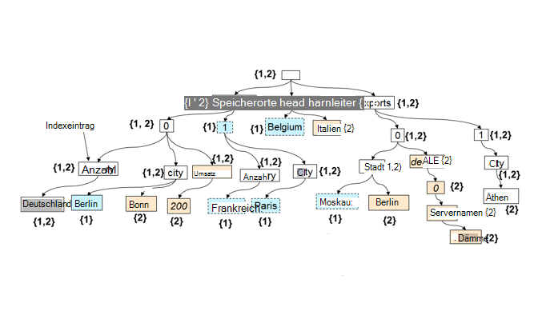

<properties 
    pageTitle="Automatische Indizierung in DocumentDB | Microsoft Azure" 
    description="Wie die automatische Indizierung funktioniert in Azure DocumentDB lernen." 
    services="documentdb" 
    authors="arramac" 
    manager="jhubbard" 
    editor="mimig" 
    documentationCenter=""/>

<tags 
    ms.service="documentdb" 
    ms.workload="data-services" 
    ms.tgt_pltfrm="na" 
    ms.devlang="na" 
    ms.topic="article" 
    ms.date="10/27/2016" 
    ms.author="arramac"/>
    
# Automatische Indizierung in Azure DocumentDB

Dieser Artikel ist ein Auszug aus Papier ["Schema-unabhängige Indizierung mit Azure DocumentDB"](http://www.vldb.org/pvldb/vol8/p1668-shukla.pdf) auf die [41. interne Konferenz bei sehr großen Datenbanken](http://www.vldb.org/2015/) 31. August - 4. September 2015 und indiziert eine Einführung in das Arbeiten in Azure DocumentDB. 

Nach dem Lesen, werden Sie beantwortet die folgenden Fragen:

- Abzuleiten DocumentDB wie das Schema aus einem JSON-Dokument?
- Wie wird DocumentDB Index in unterschiedlichen Dokumenten erstellt?
- Wie führt DocumentDB durch automatische Indizierung skalieren?

##Wie funktioniert die Indizierung DocumentDB

[Microsoft Azure DocumentDB](https://azure.microsoft.com/services/documentdb/) ist ein Schema frei Datenbank true JSON. Nicht erwarten oder Schema oder sekundären Indexdefinitionen Indexdaten benötigt. So können Sie schnell definieren und Anwendung Datenmodelle mit DocumentDB durchlaufen. Hinzufügen von Dokumenten zu einer Auflistung indiziert DocumentDB automatisch alle Dokumenteigenschaften Abfrage verfügbar sind. Automatische Indizierung können Sie Dokumente willkürlich Schemas ohne Schemas oder sekundären Indizes speichern.

Mit dem Ziel zu Impedance Mismatch zwischen der Datenbank und den Programmiermodellen Anwendung nutzt DocumentDB der Einfachheit von JSON und seine mangelnde Schemaspezifikation. Es stellt keine Annahmen über die Dokumente und Dokumente innerhalb einer Auflistung DocumentDB Schema sowie bestimmte Instanzwerte variieren kann. Im Gegensatz zu anderen Dokumentendatenbanken funktioniert DocumentDBs-Datenbank-Engine direkt auf der Ebene der JSON-Grammatik verbleibenden agnostischen Konzept ein Belegschema und verwischen die Grenze zwischen der Struktur und Instanz von Dokumenten. Dies wiederum, ermöglicht es automatisch Index Dokumente ohne Schema oder sekundäre Indizes.

Die Indizierung in DocumentDB nutzt die Tatsache, dass JSON Grammatik **als Strukturen dargestellt**werden kann. Für ein Dokument JSON dargestellt als Struktur soll dummy Stammknoten erstellt werden die restlichen tatsächlichen Knoten im Dokument unter Eltern. Jede Bezeichnung einschließlich der Arrayindizes in JSON-Dokument wird ein Knoten der Struktur. Die Abbildung unten zeigt ein Beispiel JSON-Dokument und die entsprechende strukturdarstellung.

>[AZURE.NOTE] Da JSON selbstbeschreibend ist also jedes Dokument enthält Schema (Metadaten) und Daten, z. B. `{"locationId": 5, "city": "Moscow"}` zeigt, dass zwei Eigenschaften `locationId` und `city`, und eine numerische und Eigenschaftswerte. DocumentDB kann das Schema der Dokumente und deren eingefügt oder ersetzt, ohne jemals Schemas oder sekundären Indizes definieren.

**JSON-Dokumente als Strukturen:**

In dem obigen Beispiel:

- Die JSON-Eigenschaft `{"headquarters": "Belgium"}` Eigenschaft im obigen Beispiel entspricht der Pfad/zentrale/Belgien.
- Das JSON-Array `{"exports": [{"city": “Moscow"}`, `{"city": Athens"}]}` Pfade entspricht `/exports/[]/city/Moscow` und `/exports/[]/city/Athens`.

Mit Index (1) jeder Pfad eine Dokumentstruktur indiziert (sofern der Entwickler explizit Indizierung Richtlinie ausschließen bestimmter Muster Pfad konfiguriert wurde). (2) jede Aktualisierung eines Dokuments, das eine Auflistung der DocumentDB führt die Struktur des Index (d. h. Ursachen hinzufügen oder Entfernen von Knoten) aktualisieren. Eine der Hauptpflichten der automatische Indizierung von Dokumenten ist die Kosten zum Indizieren und ein Dokument mit tief geschachtelten Abfrage z.B. 10 Ebenen ist flach JSON-Dokument besteht aus Schlüssel-Wert-Paare nur einer Ebene identisch. Daher ist eine normalisierte Pfad Darstellung der Fundament sowohl automatische Indizierung und Abfrage-Subsysteme sind.

Ein wichtiger Aspekt behandelt sowohl das Schema und die Instanz Werte gleichmäßig Pfade ist, die die einzelnen Dokumenten Index dargestellt hält, die eine Zuordnung zwischen zwei Dokumente logisch, wie und Dokument-Ids mit diesem Pfad können auch als eine Struktur. DocumentDB wird aus der Union aller der Strukturen für einzelne Dokumente in der Auflistung erstellt eine Indexstruktur erstellen. Indexstruktur DocumentDB Sammlungen wächst mit der Zeit neue Dokumente hinzugefügt oder die Auflistung aktualisiert.

**DocumentDB Index als Struktur:**

Obwohl Schema frei, SQL und JavaScript DocumentDB Abfrage Sprachen bieten relationalen Projektionen und Filter, hierarchische Navigation in Dokumenten, räumliche Operationen und Aufrufen von UDFs in JavaScript geschrieben. Die DocumentDB Abfrage Runtime kann diese Abfragen unterstützen, da es direkt mit diesem Index strukturierte Darstellung der Daten arbeiten kann.

Die Indizierung Standardrichtlinie indiziert alle Eigenschaften aller Dokumente automatisch und ermöglicht konsistente Abfragen (d.h. synchron mit dem Dokument aktualisiert wird). Wie unterstützt DocumentDB konsistent Updates Indexstruktur Ebene? DocumentDB wird optimiert schreiben, Sperre frei und Protokolldateien strukturierten Index Wartung Techniken. Dies bedeutet, dass DocumentDB eine anhaltende schnell schreibt und weiterhin konsistente Abfragen unterstützen kann. 

DocumentDB Indizierung Speichereffizienz und mehrere Mandanten behandeln soll. Für die Kosten ist auf Festplattenspeicher-Overhead des Indexes niedrig und vorhersehbar. Aktualisierung von Indizes werden Kostenrahmen Systemressourcen pro DocumentDB Auflistung durchgeführt.

##Nächste Schritte
- Download ["Schema-unabhängige Indizierung mit Azure DocumentDB"](http://www.vldb.org/pvldb/vol8/p1668-shukla.pdf)auf der 41. interne sehr große Datenbanken, 31. August - 4. September 2015 vorzulegen.
- [Abfrage DocumentDB SQL](documentdb-sql-query.md)
- Enthält Informationen zum Anpassen des DocumentDB-Indexes [hier](documentdb-indexing-policies.md)
 
