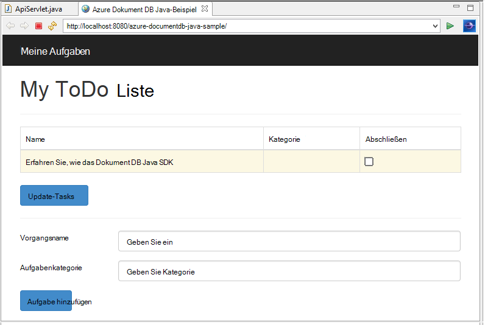
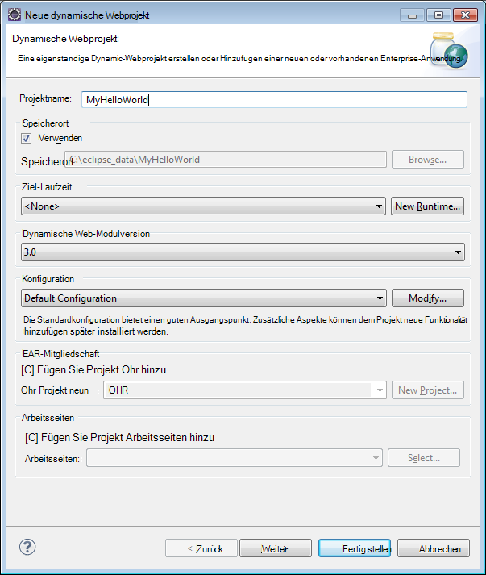
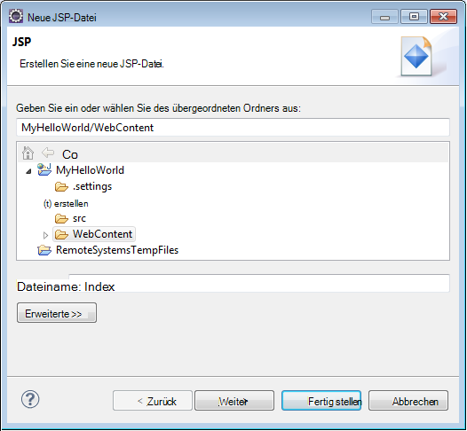
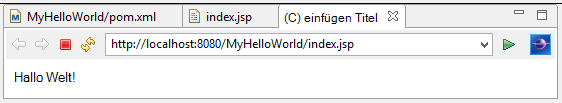
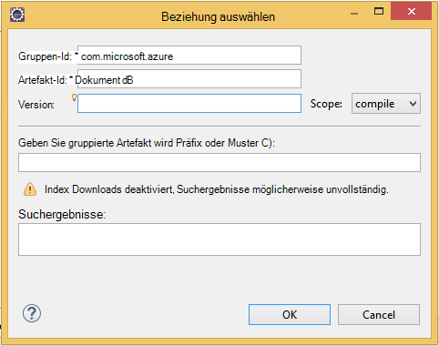

<properties
    pageTitle="Praktische Anwendung Java mit DocumentDB | Microsoft Azure"
    description="Dieses Lernprogramm Java Web Application zeigt Verwendung Azure DocumentDB Dienst zum Speichern und Access-Daten aus einer Java-Anwendung in Azure Websites gehostet."
    keywords="Anwendungsentwicklung, Lernprogramm für die Java-Anwendung, Java Web Application Tutorial, Documentdb, Azure, Microsoft azure"
    services="documentdb"
    documentationCenter="java"
    authors="dennyglee"
    manager="jhubbard"
    editor="mimig"/>

<tags
    ms.service="documentdb"
    ms.devlang="java"
    ms.topic="hero-article"
    ms.tgt_pltfrm="NA"
    ms.workload="data-services"
    ms.date="08/24/2016"
    ms.author="denlee"/>

# Erstellen Sie eine Java Web-Anwendung mit DocumentDB

> [AZURE.SELECTOR]
- [.NET](documentdb-dotnet-application.md)
- [Node.js](documentdb-nodejs-application.md)
- [Java](documentdb-java-application.md)
- [Python](documentdb-python-application.md)

Lernprogramms Anwendung Java Web zeigt, wie Sie den Dienst [Microsoft Azure DocumentDB](https://portal.azure.com/#gallery/Microsoft.DocumentDB) speichern und Access-Daten aus einer Java-Anwendung in Azure Websites gehostet. In diesem Thema erfahren Sie:

- Zum Erstellen einer grundlegenden JSP-Anwendung in Eclipse.
- Verwendung von Azure DocumentDB Service mit [DocumentDB Java SDK](https://github.com/Azure/azure-documentdb-java).

Dieses Lernprogramm Java-Anwendung veranschaulicht, wie eine webbasierte Task-Management-Anwendung erstellen, die können Sie erstellen, abrufen und Aufgaben als abgeschlossen markieren, wie im folgenden Bild gezeigt. Die Aufgaben in der Aufgabenliste als JSON-Dokumente in Azure DocumentDB gespeichert werden.

> [AZURE.TIP] Dieses Lernprogramm Application Development werden Erfahrung mit Java vorausgesetzt. Sie Java oder [erforderlichen Tools](#Prerequisites)vertraut sind, sollten das vollständige [Todo](https://github.com/Azure-Samples/documentdb-java-todo-app) -Projekt von GitHub herunterladen und diese mit [der am Ende dieses Artikels](#GetProject). Sobald Sie erstellt haben, können Sie Artikel Einblick in den Code im Kontext des Projekts zu überprüfen.  

##Voraussetzung für dieses Lernprogramm Java Web-Anwendung
Vor dieser Anwendung Entwicklung Lernprogramm benötigen Sie Folgendes:

- Ein aktives Azure-Konto. Wenn Sie ein Konto haben, können Sie ein kostenloses Testabo in wenigen Minuten erstellen. Weitere Informationen finden Sie unter [Azure-Testversion](https://azure.microsoft.com/pricing/free-trial/).
- [Java Development Kit (JDK) 7](http://www.oracle.com/technetwork/java/javase/downloads/index.html).
- [Eclipse IDE für Java EE-Entwickler.](http://www.eclipse.org/downloads/packages/eclipse-ide-java-ee-developers/lunasr1)
- [Ein Azure-Website mit einem Java Runtime-Umgebung (Tomcat oder Steg) aktiviert.](../app-service-web/web-sites-java-get-started.md)

Wenn Sie diese Tools zum ersten Mal installieren, bietet coreservlets.com eine Anleitung im Abschnitt Quick Start der Installation ihrer [Tutorial: TomCat7 installieren und mit Eclipse](http://www.coreservlets.com/Apache-Tomcat-Tutorial/tomcat-7-with-eclipse.html) Artikel.

##Schritt 1: Erstellen einer DocumentDB Konto

Beginnen wir mit der Erstellung eines DocumentDB. Wenn Sie bereits über ein Konto verfügen, überspringen [Schritt2: Erstellen der Java JSP-Anwendung](#CreateJSP).

[AZURE.INCLUDE [documentdb-create-dbaccount](../../includes/documentdb-create-dbaccount.md)]

[AZURE.INCLUDE [documentdb-keys](../../includes/documentdb-keys.md)]

##Schritt 2: Erstellen der Java JSP-Anwendungdes

JSP-Anwendung zu erstellen:

1. Zunächst beginnen wir ein Java-Projekt erstellen. Starten Sie Eclipse und dann auf **Datei**, klicken Sie auf **neu**und klicken Sie auf **Dynamische Web-Projekt**. Wenn **Dynamische Webprojekt** als verfügbaren Projekt nicht angezeigt wird, gehen Sie folgendermaßen vor: Klicken Sie auf **Datei**, klicken Sie auf **neu**, klicken Sie auf **Projekt**... **Web**erweitern, klicken Sie auf **Dynamische Webprojekt**, und klicken Sie auf **Weiter**.

    

2. Geben Sie einen Projektnamen im **Projektnamen** und im **Ziel Runtime** Dropdown-Menü Wählen Sie optional einen Wert (z. B. Apache Tomcat 7.0) und klicken Sie dann auf **Fertig stellen**. Eine Laufzeitversion Ziel auswählen können Sie das Projekt über Eclipse lokal ausgeführt.
3. Erweitern Sie in Eclipse in der Projekt-Explorer-Ansicht Projekt. Maustaste **Inhaltsordner**, klicken Sie auf **neu**und klicken Sie dann auf **JSP-Datei**
4. Das Dialogfeld **Neue JSP-Datei** den Namen der Datei **index.jsp**. Behalten Sie übergeordneten Ordner als **Inhaltsordner bei**, wie in der folgenden Abbildung gezeigt, und klicken Sie auf **Weiter**.

    

5. Klicken Sie im Dialogfeld **JSP-Vorlage auswählen** im Rahmen dieses Lernprogramms wählen Sie **Neue JSP-Datei (html)**, und klicken Sie dann auf **Fertig stellen**.

6. Beim Öffnen der Datei index.jsp in Eclipse hinzufügen anzuzeigenden Text **Hello World!** innerhalb der <body> Element. Die aktualisierte <body> Inhalt sollte folgendermaßen aussehen:

        <body>
            <% out.println("Hello World!"); %>
        </body>

8. Speichern Sie die Datei index.jsp.
9. Wenn Sie in Schritt 2 eine Ziel-Laufzeit festlegen, können Sie ** **Projekt** und anschließend die JSP-Anwendung lokal ausführen** klicken:

    

##Schritt 3: Installieren von DocumentDB Java SDK ##

DocumentDB Java SDK und abhängigen Ziehen am einfachsten durch [Apache Maven](http://maven.apache.org/).

Dazu müssen Sie die folgenden Schritte ein Maven Projekt Projekt konvertieren:

1. Maustaste im Projekt-Explorer, klicken Sie auf **Konfigurieren**, klicken Sie auf **Maven-Projekt konvertieren**.
2. Übernehmen Sie im Fenster **neue POM erstellen** die Standardeinstellungen, und klicken Sie auf **Fertig stellen**.
3. Öffnen Sie im **Projekt-Explorer**die Datei pom.xml.
4. Klicken Sie auf der Registerkarte **Abhängigkeiten** im Bereich **Abhängigkeiten** **Hinzufügen**.
4. Folgendermaßen Sie im Fenster **Wählen Sie Abhängigkeit** vor:
 - Geben Sie im Feld **GroupId** com.microsoft.azure.
 - Geben Sie im Feld **Artefakt-Id** Azure Documentdb.
 - Geben Sie im Feld **Version** 1.5.1.

    

    Oder dem Abhängigkeits-XML für GroupId und ArtifactId direkt hinzufügen pom.xml über einen Text-Editor:

        <dependency>
            <groupId>com.microsoft.azure</groupId>
            <artifactId>azure-documentdb</artifactId>
            <version>1.5.1</version>
        </dependency>

5. Klicken Sie auf **Ok** und Maven DocumentDB Java SDK installiert.
6. Speichern Sie die Datei pom.xml.

##Schritt 4: Verwenden des DocumentDB-Dienstes in einer Java-Anwendung

1. Zunächst definieren wir das TodoItem-Objekt:

        @Data
        @Builder
        public class TodoItem {
            private String category;
            private boolean complete;
            private String id;
            private String name;
        }

    [Projekt Lombok](http://projectlombok.org/) verwenden wir in diesem Projekt Konstruktor, Getter und Setter, Editor erstellen. Alternativ kann dieser Code manuell schreiben oder die IDE sie generieren.

2. Zum Aufrufen des DocumentDB-Dienstes müssen Sie einen neuen **"documentclient"**instanziieren. Im Allgemeinen empfiehlt es sich, **"documentclient"** - Wiederverwendung als einen neuen Client für jede nachfolgende Anforderung erstellen. Wir können den Client wiederverwenden, indem **DocumentClientFactory**Client umschließen. Dies ist auch dabei den URI und PRIMÄRSCHLÜSSEL Wert einfügen, den Sie in die Zwischenablage in [Schritt 1](#CreateDB)gespeichert. Ersetzen Sie [Ihre\_ENDPUNKT\_hier] mit URI und Ersetzen [Ihre\_Schlüssel\_hier] mit PRIMÄRSCHLÜSSEL.

        private static final String HOST = "[YOUR_ENDPOINT_HERE]";
        private static final String MASTER_KEY = "[YOUR_KEY_HERE]";

        private static DocumentClient documentClient;

        public static DocumentClient getDocumentClient() {
            if (documentClient == null) {
                documentClient = new DocumentClient(HOST, MASTER_KEY,
                        ConnectionPolicy.GetDefault(), ConsistencyLevel.Session);
            }

            return documentClient;
        }

3. Jetzt erstellen wir eine (Datenzugriffsobjekt) um abstrakte unsere Aufgaben zu DocumentDB beibehalten.

    Um Aufgaben in einer Auflistung speichern, muss der Client die Datenbank und die Sammlung weiterhin zu kennen (wie von selbst links). Im Allgemeinen empfiehlt es sich, der Datenbank und der Auflistung, wenn zusätzliche Roundtrips zur Datenbank vermeiden zwischengespeichert.

    Der folgende Code veranschaulicht die unserer Datenbank und unserer Auflistung abrufen, falls vorhanden, oder eine neue zu erstellen, falls er vorhanden ist:

        public class DocDbDao implements TodoDao {
            // The name of our database.
            private static final String DATABASE_ID = "TodoDB";

            // The name of our collection.
            private static final String COLLECTION_ID = "TodoCollection";

            // The DocumentDB Client
            private static DocumentClient documentClient = DocumentClientFactory
                    .getDocumentClient();

            // Cache for the database object, so we don't have to query for it to
            // retrieve self links.
            private static Database databaseCache;

            // Cache for the collection object, so we don't have to query for it to
            // retrieve self links.
            private static DocumentCollection collectionCache;

            private Database getTodoDatabase() {
                if (databaseCache == null) {
                    // Get the database if it exists
                    List<Database> databaseList = documentClient
                            .queryDatabases(
                                    "SELECT * FROM root r WHERE r.id='" + DATABASE_ID
                                            + "'", null).getQueryIterable().toList();

                    if (databaseList.size() > 0) {
                        // Cache the database object so we won't have to query for it
                        // later to retrieve the selfLink.
                        databaseCache = databaseList.get(0);
                    } else {
                        // Create the database if it doesn't exist.
                        try {
                            Database databaseDefinition = new Database();
                            databaseDefinition.setId(DATABASE_ID);

                            databaseCache = documentClient.createDatabase(
                                    databaseDefinition, null).getResource();
                        } catch (DocumentClientException e) {
                            // TODO: Something has gone terribly wrong - the app wasn't
                            // able to query or create the collection.
                            // Verify your connection, endpoint, and key.
                            e.printStackTrace();
                        }
                    }
                }

                return databaseCache;
            }

            private DocumentCollection getTodoCollection() {
                if (collectionCache == null) {
                    // Get the collection if it exists.
                    List<DocumentCollection> collectionList = documentClient
                            .queryCollections(
                                    getTodoDatabase().getSelfLink(),
                                    "SELECT * FROM root r WHERE r.id='" + COLLECTION_ID
                                            + "'", null).getQueryIterable().toList();

                    if (collectionList.size() > 0) {
                        // Cache the collection object so we won't have to query for it
                        // later to retrieve the selfLink.
                        collectionCache = collectionList.get(0);
                    } else {
                        // Create the collection if it doesn't exist.
                        try {
                            DocumentCollection collectionDefinition = new DocumentCollection();
                            collectionDefinition.setId(COLLECTION_ID);

                            collectionCache = documentClient.createCollection(
                                    getTodoDatabase().getSelfLink(),
                                    collectionDefinition, null).getResource();
                        } catch (DocumentClientException e) {
                            // TODO: Something has gone terribly wrong - the app wasn't
                            // able to query or create the collection.
                            // Verify your connection, endpoint, and key.
                            e.printStackTrace();
                        }
                    }
                }

                return collectionCache;
            }
        }

4. Im nächste Schritt werden schreiben Sie Code für die TodoItems in der Auflistung beibehalten. In diesem Beispiel verwenden wir [Gson](https://code.google.com/p/google-gson/) , serialisiert und deserialisiert TodoItem einfache alte Java-Objekten (POJOs) in JSON-Dokumente. [Jackson](http://jackson.codehaus.org/) oder benutzerdefinierten Serialisierungsprogramms sind gute Alternativen für die Serialisierung POJOs.

        // We'll use Gson for POJO <=> JSON serialization for this example.
        private static Gson gson = new Gson();

        @Override
        public TodoItem createTodoItem(TodoItem todoItem) {
            // Serialize the TodoItem as a JSON Document.
            Document todoItemDocument = new Document(gson.toJson(todoItem));

            // Annotate the document as a TodoItem for retrieval (so that we can
            // store multiple entity types in the collection).
            todoItemDocument.set("entityType", "todoItem");

            try {
                // Persist the document using the DocumentClient.
                todoItemDocument = documentClient.createDocument(
                        getTodoCollection().getSelfLink(), todoItemDocument, null,
                        false).getResource();
            } catch (DocumentClientException e) {
                e.printStackTrace();
                return null;
            }

            return gson.fromJson(todoItemDocument.toString(), TodoItem.class);
        }

5. DocumentDB Datenbanken und Sammlungen auch Dokumente verwiesen werden selbst durch links. Die folgende Hilfsfunktion ermöglicht Abrufen von Dokumenten von einem anderen Attribut (z.B. "Id"), anstatt sich selbst zu verknüpfen:

        private Document getDocumentById(String id) {
            // Retrieve the document using the DocumentClient.
            List<Document> documentList = documentClient
                    .queryDocuments(getTodoCollection().getSelfLink(),
                            "SELECT * FROM root r WHERE r.id='" + id + "'", null)
                    .getQueryIterable().toList();

            if (documentList.size() > 0) {
                return documentList.get(0);
            } else {
                return null;
            }
        }

6. Wir können die Hilfsmethode in Schritt 5 TodoItem JSON-Dokument nach Id abrufen und ein POJO deserialisieren:

        @Override
        public TodoItem readTodoItem(String id) {
            // Retrieve the document by id using our helper method.
            Document todoItemDocument = getDocumentById(id);

            if (todoItemDocument != null) {
                // De-serialize the document in to a TodoItem.
                return gson.fromJson(todoItemDocument.toString(), TodoItem.class);
            } else {
                return null;
            }
        }

7. Die "documentclient" können wir eine Auflistung oder Liste mit DocumentDB SQL TodoItems:

        @Override
        public List<TodoItem> readTodoItems() {
            List<TodoItem> todoItems = new ArrayList<TodoItem>();

            // Retrieve the TodoItem documents
            List<Document> documentList = documentClient
                    .queryDocuments(getTodoCollection().getSelfLink(),
                            "SELECT * FROM root r WHERE r.entityType = 'todoItem'",
                            null).getQueryIterable().toList();

            // De-serialize the documents in to TodoItems.
            for (Document todoItemDocument : documentList) {
                todoItems.add(gson.fromJson(todoItemDocument.toString(),
                        TodoItem.class));
            }

            return todoItems;
        }

8. Es gibt viele Methoden, um ein Dokument mit der "documentclient" aktualisieren. In unserer Anwendung Todo Liste möchten wir umschalten, ob ein TodoItem abgeschlossen ist. Dies kann erreicht werden, "abgeschlossen"-Attribut im Dokument aktualisieren:

        @Override
        public TodoItem updateTodoItem(String id, boolean isComplete) {
            // Retrieve the document from the database
            Document todoItemDocument = getDocumentById(id);

            // You can update the document as a JSON document directly.
            // For more complex operations - you could de-serialize the document in
            // to a POJO, update the POJO, and then re-serialize the POJO back in to
            // a document.
            todoItemDocument.set("complete", isComplete);

            try {
                // Persist/replace the updated document.
                todoItemDocument = documentClient.replaceDocument(todoItemDocument,
                        null).getResource();
            } catch (DocumentClientException e) {
                e.printStackTrace();
                return null;
            }

            return gson.fromJson(todoItemDocument.toString(), TodoItem.class);
        }

9. Abschließend soll ein TodoItem aus der Liste löschen. Hierzu können wir die Hilfsmethode vorhin geschriebenen abrufen selbst verknüpfen und weisen Sie den Client zu löschen:

        @Override
        public boolean deleteTodoItem(String id) {
            // DocumentDB refers to documents by self link rather than id.

            // Query for the document to retrieve the self link.
            Document todoItemDocument = getDocumentById(id);

            try {
                // Delete the document by self link.
                documentClient.deleteDocument(todoItemDocument.getSelfLink(), null);
            } catch (DocumentClientException e) {
                e.printStackTrace();
                return false;
            }

            return true;
        }

##Schritt 5: Die restlichen Kabel der Java Development-Anwendungsprojekts zusammen

Da wir Spaß haben - die Links schnellen Benutzer erstellen Schnittstelle und bis zu unserem DAO verbinden.

1. Zunächst beginnen mit Regler unsere DAO aufrufen:

        public class TodoItemController {
            public static TodoItemController getInstance() {
                if (todoItemController == null) {
                    todoItemController = new TodoItemController(TodoDaoFactory.getDao());
                }
                return todoItemController;
            }

            private static TodoItemController todoItemController;

            private final TodoDao todoDao;

            TodoItemController(TodoDao todoDao) {
                this.todoDao = todoDao;
            }

            public TodoItem createTodoItem(@NonNull String name,
                    @NonNull String category, boolean isComplete) {
                TodoItem todoItem = TodoItem.builder().name(name).category(category)
                        .complete(isComplete).build();
                return todoDao.createTodoItem(todoItem);
            }

            public boolean deleteTodoItem(@NonNull String id) {
                return todoDao.deleteTodoItem(id);
            }

            public TodoItem getTodoItemById(@NonNull String id) {
                return todoDao.readTodoItem(id);
            }

            public List<TodoItem> getTodoItems() {
                return todoDao.readTodoItems();
            }

            public TodoItem updateTodoItem(@NonNull String id, boolean isComplete) {
                return todoDao.updateTodoItem(id, isComplete);
            }
        }

    In einer komplexeren Anwendung kann der Controller komplexe Geschäftslogik auf die DAO-Haus.

2. Erstellen Sie dann ein Servlet auf HTTP-Anfragen an den Controller:

        public class TodoServlet extends HttpServlet {
            // API Keys
            public static final String API_METHOD = "method";

            // API Methods
            public static final String CREATE_TODO_ITEM = "createTodoItem";
            public static final String GET_TODO_ITEMS = "getTodoItems";
            public static final String UPDATE_TODO_ITEM = "updateTodoItem";

            // API Parameters
            public static final String TODO_ITEM_ID = "todoItemId";
            public static final String TODO_ITEM_NAME = "todoItemName";
            public static final String TODO_ITEM_CATEGORY = "todoItemCategory";
            public static final String TODO_ITEM_COMPLETE = "todoItemComplete";

            public static final String MESSAGE_ERROR_INVALID_METHOD = "{'error': 'Invalid method'}";

            private static final long serialVersionUID = 1L;
            private static final Gson gson = new Gson();

            @Override
            protected void doGet(HttpServletRequest request,
                    HttpServletResponse response) throws ServletException, IOException {

                String apiResponse = MESSAGE_ERROR_INVALID_METHOD;

                TodoItemController todoItemController = TodoItemController
                        .getInstance();

                String id = request.getParameter(TODO_ITEM_ID);
                String name = request.getParameter(TODO_ITEM_NAME);
                String category = request.getParameter(TODO_ITEM_CATEGORY);
                boolean isComplete = StringUtils.equalsIgnoreCase("true",
                        request.getParameter(TODO_ITEM_COMPLETE)) ? true : false;

                switch (request.getParameter(API_METHOD)) {
                case CREATE_TODO_ITEM:
                    apiResponse = gson.toJson(todoItemController.createTodoItem(name,
                            category, isComplete));
                    break;
                case GET_TODO_ITEMS:
                    apiResponse = gson.toJson(todoItemController.getTodoItems());
                    break;
                case UPDATE_TODO_ITEM:
                    apiResponse = gson.toJson(todoItemController.updateTodoItem(id,
                            isComplete));
                    break;
                default:
                    break;
                }

                response.getWriter().println(apiResponse);
            }

            @Override
            protected void doPost(HttpServletRequest request,
                    HttpServletResponse response) throws ServletException, IOException {
                doGet(request, response);
            }
        }

3. Wir benötigen eine Web-Benutzeroberfläche für den Benutzer angezeigt. Neu schreiben wir die index.jsp, die wir zuvor erstellt haben:

        <html>
        <head>
          <meta http-equiv="Content-Type" content="text/html; charset=ISO-8859-1">
          <meta http-equiv="X-UA-Compatible" content="IE=edge;" />
          <title>Azure DocumentDB Java Sample</title>

          <!-- Bootstrap -->
          <link href="//ajax.aspnetcdn.com/ajax/bootstrap/3.2.0/css/bootstrap.min.css" rel="stylesheet">

          
        </head>
        <body>
          <!-- Nav Bar -->
          

            

              

                <a class="navbar-brand" href="#">My Tasks</a>
              

            

          

          <!-- Body -->
          

            <h1>My ToDo List</h1>

            

            <!-- The ToDo List -->
            

              <table class="table table-bordered table-striped" id="todoItems">
                <thead>
                  <tr>
                    <th>Name</th>
                    <th>Category</th>
                    <th>Complete</th>
                  </tr>
                </thead>
                <tbody>
                </tbody>
              </table>

              <!-- Update Button -->
              

                <form class="form-horizontal" role="form">
                  <button type="button" class="btn btn-primary">Update Tasks</button>
                </form>
              

            

            

            <!-- Item Input Form -->
            

              <form class="form-horizontal" role="form">
                

                  <label for="inputItemName" class="col-sm-2">Task Name</label>
                  

                    <input type="text" class="form-control" id="inputItemName" placeholder="Enter name">
                  

                

                

                  <label for="inputItemCategory" class="col-sm-2">Task Category</label>
                  

                    <input type="text" class="form-control" id="inputItemCategory" placeholder="Enter category">
                  

                

                <button type="button" class="btn btn-primary">Add Task</button>
              </form>
            

          

          <!-- Placed at the end of the document so the pages load faster -->
          
          
          
        </body>
        </html>

4. Und schließlich clientseitige Javascript um die Web-Benutzeroberfläche und das Servlet zusammenzufassen:

        var todoApp = {
          /*
           * API methods to call Java backend.
           */
          apiEndpoint: "api",

          createTodoItem: function(name, category, isComplete) {
            $.post(todoApp.apiEndpoint, {
                "method": "createTodoItem",
                "todoItemName": name,
                "todoItemCategory": category,
                "todoItemComplete": isComplete
              },
              function(data) {
                var todoItem = data;
                todoApp.addTodoItemToTable(todoItem.id, todoItem.name, todoItem.category, todoItem.complete);
              },
              "json");
          },

          getTodoItems: function() {
            $.post(todoApp.apiEndpoint, {
                "method": "getTodoItems"
              },
              function(data) {
                var todoItemArr = data;
                $.each(todoItemArr, function(index, value) {
                  todoApp.addTodoItemToTable(value.id, value.name, value.category, value.complete);
                });
              },
              "json");
          },

          updateTodoItem: function(id, isComplete) {
            $.post(todoApp.apiEndpoint, {
                "method": "updateTodoItem",
                "todoItemId": id,
                "todoItemComplete": isComplete
              },
              function(data) {},
              "json");
          },

          /*
           * UI Methods
           */
          addTodoItemToTable: function(id, name, category, isComplete) {
            var rowColor = isComplete ? "active" : "warning";

            todoApp.ui_table().append($("<tr>")
              .append($("<td>").text(name))
              .append($("<td>").text(category))
              .append($("<td>")
                .append($("<input>")
                  .attr("type", "checkbox")
                  .attr("id", id)
                  .attr("checked", isComplete)
                  .attr("class", "isComplete")
                ))
              .addClass(rowColor)
            );
          },

          /*
           * UI Bindings
           */
          bindCreateButton: function() {
            todoApp.ui_createButton().click(function() {
              todoApp.createTodoItem(todoApp.ui_createNameInput().val(), todoApp.ui_createCategoryInput().val(), false);
              todoApp.ui_createNameInput().val("");
              todoApp.ui_createCategoryInput().val("");
            });
          },

          bindUpdateButton: function() {
            todoApp.ui_updateButton().click(function() {
              // Disable button temporarily.
              var myButton = $(this);
              var originalText = myButton.text();
              $(this).text("Updating...");
              $(this).prop("disabled", true);

              // Call api to update todo items.
              $.each(todoApp.ui_updateId(), function(index, value) {
                todoApp.updateTodoItem(value.name, value.value);
                $(value).remove();
              });

              // Re-enable button.
              setTimeout(function() {
                myButton.prop("disabled", false);
                myButton.text(originalText);
              }, 500);
            });
          },

          bindUpdateCheckboxes: function() {
            todoApp.ui_table().on("click", ".isComplete", function(event) {
              var checkboxElement = $(event.currentTarget);
              var rowElement = $(event.currentTarget).parents('tr');
              var id = checkboxElement.attr('id');
              var isComplete = checkboxElement.is(':checked');

              // Toggle table row color
              if (isComplete) {
                rowElement.addClass("active");
                rowElement.removeClass("warning");
              } else {
                rowElement.removeClass("active");
                rowElement.addClass("warning");
              }

              // Update hidden inputs for update panel.
              todoApp.ui_updateForm().children("input[name='" + id + "']").remove();

              todoApp.ui_updateForm().append($("<input>")
                .attr("type", "hidden")
                .attr("class", "updateComplete")
                .attr("name", id)
                .attr("value", isComplete));

            });
          },

          /*
           * UI Elements
           */
          ui_createNameInput: function() {
            return $(".todoForm #inputItemName");
          },

          ui_createCategoryInput: function() {
            return $(".todoForm #inputItemCategory");
          },

          ui_createButton: function() {
            return $(".todoForm button");
          },

          ui_table: function() {
            return $(".todoList table tbody");
          },

          ui_updateButton: function() {
            return $(".todoUpdatePanel button");
          },

          ui_updateForm: function() {
            return $(".todoUpdatePanel form");
          },

          ui_updateId: function() {
            return $(".todoUpdatePanel .updateComplete");
          },

          /*
           * Install the TodoApp
           */
          install: function() {
            todoApp.bindCreateButton();
            todoApp.bindUpdateButton();
            todoApp.bindUpdateCheckboxes();

            todoApp.getTodoItems();
          }
        };

        $(document).ready(function() {
          todoApp.install();
        });

5. Prima! Nun ist die Anwendung zu testen ist. Führen Sie die Anwendung lokal, und fügen Sie einige Aufgaben der Artikelname und die Kategorie und klicken auf **Aufgabe hinzufügen**.

6. Wenn das Element angezeigt wird, können Sie aktualisieren, ob es abgeschlossen ist, indem Sie das Kontrollkästchen umschalten und auf **Vorgänge aktualisieren**.

##Schritt 6: Bereitstellen Sie die Java-Anwendung in Azure Websites

Azure Websites wird einfach die Anwendung als WAR-Datei exportieren und entweder über Datenquellen-Steuerelement (z. B. GIT) hochladen Java-Anwendung bereitstellen oder FTP.

1. Zum Exportieren der Anwendung eine mit der rechten Maustaste auf das Projekt im **Projekt-Explorer**klicken Sie auf **Exportieren**, und klicken Sie die **WAR-Datei**.
2. Das Fenster **Exportieren WAR** folgendermaßen Sie vor:
 - Geben Sie im Feld Projekt Web Azure Documentdb Java Stichproben.
 - Wählen Sie im Ziel ein Ziel für die WAR-Datei speichern.
 - Klicken Sie auf **Fertig stellen**.

3. Jetzt haben Sie eine WAR-Datei vor, können Sie einfach Ihre Azure-Website **Webapps** Verzeichnis hochladen. Informationen zum Hochladen der Datei finden Sie unter [Hinzufügen einer Anwendung zu Ihrer Website Java Azure](../app-service-web/web-sites-java-add-app.md).

    Sobald die WAR-Datei in das Verzeichnis Webapps geladen wird, erkennt die Runtime-Umgebung wurde hinzugefügt und wird automatisch geladen.
4. Um Ihr Endprodukt anzuzeigen, navigieren Sie zu http://YOUR\_Website\_NAME.azurewebsites.net/azure-documentdb-java-sample/ und Aufgaben hinzufügen.

##GitHub des Projekts erhalten

In den Beispielen in diesem Lernprogramm umfasst das [Todo](https://github.com/Azure-Samples/documentdb-java-todo-app) -Projekt auf GitHub. Todo-Projekt in Eclipse importieren, sicherzustellen Sie, dass Sie die Software und Ressourcen im Abschnitt [erforderliche Komponenten](#Prerequisites) und gehen Sie folgendermaßen vor:

1. Installieren Sie [Project Lombok](http://projectlombok.org/). Lombok wird verwendet, um Konstruktoren, Getter und Setter im Projekt generiert. Nachdem Sie die Datei lombok.jar heruntergeladen haben, doppelklicken Sie darauf installieren oder über die Befehlszeile installieren.
2. Wenn Eclipse geöffnet ist, schließen Sie und neu starten Sie, um Lombok zu laden.
3. Klicken Sie in Eclipse im Menü **Datei** auf **Importieren**.
4. Klicken Sie im Fenster **Importieren** **Git**, klicken Sie auf **Projekte Git**und klicken Sie auf **Weiter**.
5. Klicken Sie auf dem Bildschirm **Repository-Quelle auswählen** auf **Clone-URI**.
6. Der Bildschirm **Git Quellsite** im **URI** Geben Sie https://github.com/Azure-Samples/documentdb-java-todo-app.git und klicken Sie auf **Weiter**.
7. **Zweig** -Auswahlbildschirm sicherzustellen Sie,- **master** ausgewählt ist, und klicken Sie dann auf **Weiter**.
8. **Lokalen** Bildschirm klicken Sie auf **Durchsuchen** , wählen Sie einen Ordner, in dem Repository kopiert werden können, klicken Sie auf **Weiter**.
9. Sicherstellen Sie auf dem Bildschirm **Wählen Sie einen Assistenten zum Importieren von Projekten** , dass **Projekte importieren** ausgewählt ist, und klicken Sie dann auf **Weiter**.
10. Deaktivieren Sie auf dem Bildschirm **Importieren Projekte** **DocumentDB** Projekt und dann auf **Fertig stellen**. Das DocumentDB-Projekt enthält das DocumentDB Java SDK wir stattdessen als Abhängigkeit hinzugefügt werden.
11. Navigieren Sie im **Projekt-Explorer**zu azure-documentdb-java-sample\src\com.microsoft.azure.documentdb.sample.dao\DocumentClientFactory.java URI und PRIMÄRSCHLÜSSEL für Ihr Konto DocumentDB ersetzen Sie der Host- und MASTER_KEY Werte und speichern Sie die Datei. Weitere Informationen finden Sie unter Schritt 1 [. Erstellen Sie ein Konto DocumentDB](#CreateDB).
12. Klicken Sie im **Projekt-Explorer**mit der rechten Maustaste im **Azure Documentdb Java Stichproben**, klicken Sie auf **Pfad erstellen**und dann auf **Erstellen Pfad konfigurieren**.
13. Im rechten Fenster **Java erstellen Pfad** **Bibliotheken** Registerkarte und dann auf **Externe JARs hinzufügen**. **Navigieren Sie zum Speicherort der Datei lombok.jar und klicken Sie auf **Öffnen**.**
14. Verwenden Sie Schritt 12, um **das Eigenschaftenfenster** erneut öffnen und dann im linken Bereich auf **Laufzeiten ausgerichtet**.
15. Auf dem Bildschirm **Ausgerichtet Laufzeiten** auf **neu**, wählen Sie **Apache Tomcat 7.0**und klicken Sie auf **OK**.
16. Verwenden Sie Schritt 12 **Eigenschaftenfenster** erneut öffnen und dann im linken Bereich auf **Projekt Facets**.
17. Wählen Sie im Fenster **Projekt Facets** **Dynamische Webmodul** und **Java**und klicken Sie dann auf **OK**.
18. Auf **der Registerkarte am unteren Bildschirmrand** Maustaste auf **Tomcat 7.0 Server "localhost"** und klicken Sie auf **Hinzufügen und entfernen**.
19. Fenster **Hinzufügen und Entfernen von** verschieben Sie **Azure Documentdb Java Stichproben** **konfiguriert** und dann auf **Fertig stellen**.
20. Registerkarte **Server** **7.0 Tomcat Server Localhost**Maustaste und dann auf **neu starten**.
21. Navigieren Sie in einem Browser zu http://localhost: 8080/Azure-Documentdb-Java-Sample / und der Aufgabenliste hinzufügen. Beachten Sie, dass ändert die Standardwerte für Port 8080 Wert gewählten.
22. Um das Projekt mit einer Azure-Website bereitstellen, finden Sie unter Schritt 6 [. Bereitstellen der Anwendung in Azure Websites](#Deploy).

[1]: media/documentdb-java-application/keys.png
