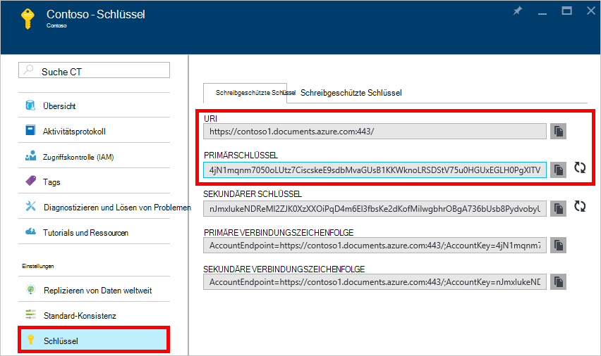
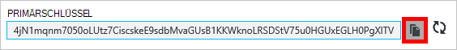
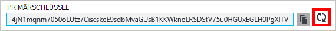
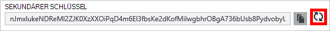
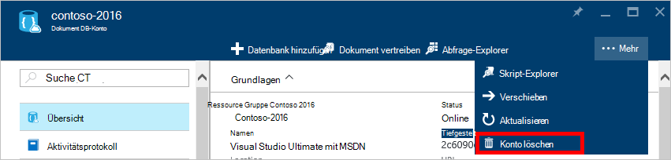
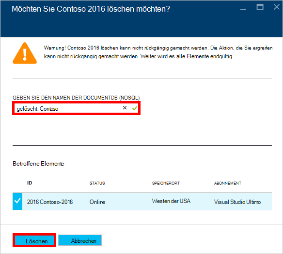

<properties
    pageTitle="Ein DocumentDB-Konto Portal Azure | Microsoft Azure"
    description="Informationen Sie zur Verwaltung Ihres Kontos DocumentDB Portal Azure. Finden Sie eine Anleitung zur Verwendung von Azure-Portal anzeigen, kopieren, löschen und Konten."
    keywords="Azure-Portal Documentdb, Azure, Microsoft azure"
    services="documentdb"
    documentationCenter=""
    authors="kirillg"
    manager="jhubbard"
    editor="cgronlun"/>

<tags
    ms.service="documentdb"
    ms.workload="data-services"
    ms.tgt_pltfrm="na"
    ms.devlang="na"
    ms.topic="article"
    ms.date="10/14/2016"
    ms.author="kirillg"/>

# DocumentDB-Konto verwalten

Erfahren Sie, wie globale Konsistenz festlegen, arbeiten mit Schlüsseln und Löschen eines Kontos DocumentDB in Azure-Portal.

## DocumentDB Konsistenz verwalten

Die richtige Auswahl hängt von der Semantik der Anwendung. Sie sollten sich vertraut machen mit den verfügbaren Konsistenz in DocumentDB lesen [mit konsistenzebenen zu Verfügbarkeit und Leistung in DocumentDB] [consistency]. DocumentDB bietet Konsistenz, Verfügbarkeit und leistungsgarantien auf jeder konsistenzebene für Ihr Konto verfügbar. Konfigurieren Ihr Konto mit starken Konsistenz erfordert, dass Ihre Daten nur eine Azure Region und global verfügbar. Andererseits, entspannt Konsistenz Level – begrenzte Veraltung, Session oder eventuelle aktivieren Sie eine beliebige Anzahl von Azure-Regionen mit Ihrem Konto zuordnen. Die folgenden einfachen Schritte zeigen die Konsistenz Standardstufe für Ihr Konto auswählen. 

### Standard-Konsistenz für DocumentDB-Konto an

1. In [Azure-Portal](https://portal.azure.com/)Zugriff auf Ihr Konto DocumentDB.
2. Blatt Konto klicken Sie auf **Konsistenz**.
3. Blatt **Standardkonsistenz** wählen Sie die neue Konsistenz und klicken Sie auf **Speichern**.
    ![Standardsession Konsistenz][5]

## Anzeigen, kopieren und Regenerieren von Zugriffstasten
Beim Erstellen eines DocumentDB-Kontos erstellt der Dienst zwei master Zugriffstasten, die beim Zugriff auf das DocumentDB-Konto für die Authentifizierung verwendet werden. Mit beiden Zugriffstasten können mit DocumentDB Schlüssel ohne Unterbrechung der DocumentDB-Konto neu generieren. 

Zugreifen Sie in [Azure-Portal](https://portal.azure.com/) **Schlüssel** Blade aus Ressourcen auf das **DocumentDB-Konto** anzeigen, kopieren und regeneriert die Zugriffstasten, die Zugang zu Ihrem Konto DocumentDB verwendet werden.

> [AZURE.NOTE] **Schlüssel** -Blade auch primäre und sekundäre Verbindungszeichenfolgen, die Verbindung zu Ihrem Konto [Migrationsprogramm](documentdb-import-data.md)verwendet werden können.

Schreibgeschützte Schlüssel stehen auf diesem Blatt. Liest und Abfragen sind schreibgeschützte Vorgänge While erstellt, gelöscht, und ersetzt.

### Kopieren Sie eine Zugriffstaste in Azure-Portal

Klicken Sie auf den **Schlüssel** **Kopieren** rechts des Schlüssels, den Sie kopieren möchten.

### Regenerieren Sie Zugriffstasten

Sie sollten Ihr Konto DocumentDB regelmäßig zu helfen, Ihre Verbindung sicherer Zugriffstasten ändern. Zwei Zugriffstasten zugewiesen Verbindungen eine Zugriffstaste verwenden, während die andere Taste Regenerieren DocumentDB-Konto verwalten können.

> [AZURE.WARNING] Regenerieren die Zugriffstasten wirkt sich auf jede Anwendung, die den aktuellen Schlüssel abhängig sind. Alle Clients, die Zugriffstaste verwenden, um Zugriff auf DocumentDB-Konto müssen aktualisiert werden, um den neuen Schlüssel.

Haben Sie Applikationen oder Cloud-Dienste mit dem DocumentDB-Konto verlieren Verbindung Sie Schlüssel generiert neu, wenn Sie Ihre Schlüssel wiederherstellen. Den folgenden Schritten wird der Vorgehensweise bei der Schlüssel.

1. Aktualisieren Sie Zugriffsschlüssel im Anwendungscode auf die sekundäre Taste des DocumentDB-Kontos.
2. Wiederherstellen Sie den primäre Schlüssel für Ihr DocumentDB-Konto. In [Azure-Portal](https://portal.azure.com/)Zugriff auf Ihr Konto DocumentDB.
3. Blatt **DocumentDB-Kontos** klicken Sie auf **Schlüssel**.
4. Klicken Sie auf den **Schlüssel** auf Regenerieren, dann klicken Sie auf **Ok,** um sicherzustellen, dass Sie einen neuen Schlüssel generieren möchten.
    

5. Sobald Sie überprüft haben, dass der neue Schlüssel (ca. 5 Minuten nach der Regenerierung) zur Verfügung steht, aktualisieren Sie Zugriffsschlüssel im Anwendungscode auf die neue primäre Taste.
6. Regenerieren Sie die sekundäre Taste.

    

> [AZURE.NOTE] Es dauert einige Minuten, bis ein neu generierte Schlüssel verwendet werden kann, Zugang zu Ihrem Konto DocumentDB.

## Abrufen der Verbindungszeichenfolge

Gehen Sie wie folgt vor, um die Verbindungszeichenfolge abzurufen: 

1. In [Azure-Portal](https://portal.azure.com)Zugriff auf Ihr Konto DocumentDB.
2. Klicken Sie im ressourcenmenü auf **Schlüssel**.
3. Klicken Sie auf **Kopieren** , neben dem **Primären Verbindungszeichenfolge** oder **Sekundäre Verbindungszeichenfolge** . 

Bei Verwendung die Verbindungszeichenfolge in der [DocumentDB Datenbank-Migrationsprogramm](documentdb-import-data.md)fügen der Datenbankname am Ende der Verbindungszeichenfolge. `AccountEndpoint=< >;AccountKey=< >;Database=< >`.

## DocumentDB-Konto löschen
Ein DocumentDB aus der Azure-Verwaltungsportal entfernen, die Sie nicht mehr verwenden, dem Befehl **Konto löschen** -Blade **DocumentDB Konto** .

1. Greifen Sie in [Azure-Portal](https://portal.azure.com/)DocumentDB-Konto zu, das Sie löschen möchten.
2. Klicken Sie auf der **DocumentDB-Konto** auf **Weitere**und dann auf **Konto löschen**. Namen Sie den der Datenbank, oder klicken Sie auf **Konto löschen**.
3. Geben Sie auf das resultierende Bestätigung Blade DocumentDB Kontonamen zu bestätigen, dass Sie das Konto löschen möchten.
4. Klicken Sie auf die Schaltfläche **Löschen** .

## Nächste Schritte

Erfahren Sie, wie Sie [Erste Schritte mit Ihrem Konto DocumentDB](http://go.microsoft.com/fwlink/p/?LinkId=402364).

Um weitere Informationen zu DocumentDB finden Sie Azure DocumentDB auf [azure.com](http://go.microsoft.com/fwlink/?LinkID=402319&clcid=0x409).

<!--Image references-->
[1]: ./media/documentdb-manage-account/documentdb_add_region-1.png
[2]: ./media/documentdb-manage-account/documentdb_add_region-2.png
[3]: ./media/documentdb-manage-account/documentdb_change_write_region-1.png
[4]: ./media/documentdb-manage-account/documentdb_change_write_region-2.png
[5]: ./media/documentdb-manage-account/documentdb_change_consistency-1.png
[6]: ./media/documentdb-manage-account/chooseandsaveconsistency.png

<!--Reference style links - using these makes the source content way more readable than using inline links-->
[bcdr]: https://azure.microsoft.com/documentation/articles/best-practices-availability-paired-regions/
[consistency]: https://azure.microsoft.com/documentation/articles/documentdb-consistency-levels/
[azureregions]: https://azure.microsoft.com/en-us/regions/#services
[offers]: https://azure.microsoft.com/en-us/pricing/details/documentdb/
