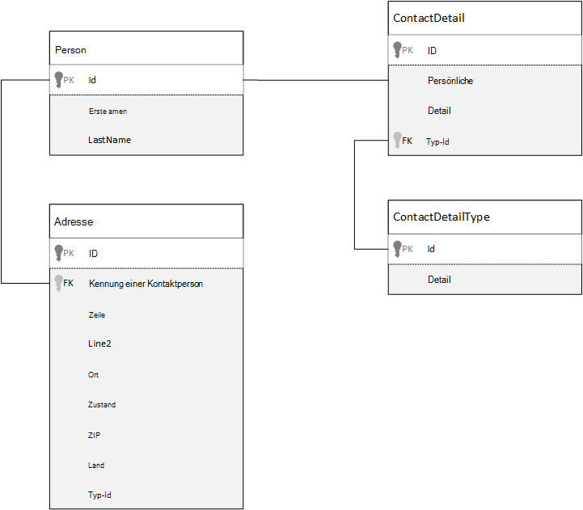
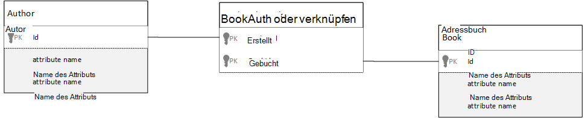

<properties 
    pageTitle="Modelldaten in Azure DocumentDB | Microsoft Azure" 
    description="Enthält Informationen Sie zum Modellieren von Daten für eine Datenbank NoSQL DocumentDB." 
    keywords="Modellieren von Daten"
    services="documentdb" 
    authors="kiratp" 
    manager="jhubbard" 
    editor="mimig1" 
    documentationCenter=""/>

<tags 
    ms.service="documentdb" 
    ms.workload="data-services" 
    ms.tgt_pltfrm="na" 
    ms.devlang="na" 
    ms.topic="article" 
    ms.date="08/05/2016" 
    ms.author="kipandya"/>

#Modellieren von Daten in DocumentDB#
Schema frei Datenbanken wie Azure DocumentDB machen sollte auf Änderungen auf das Datenmodell nutzen Sie noch einige Gedanken über Ihre Daten verbringen. 

Wie wird Daten gespeichert werden? Wie wird Ihre Anwendung abrufen und Abfragen von Daten? Ist Ihre Anwendung schwer zu lesen oder Schreiben schwer? 

Nach dem Lesen dieses Artikels werden Sie folgenden Fragen beantworten:

- Wie sollte ich ein Dokument in einer Datenbank?
- Was ist Datenmodelle und warum sollte ich umsteigen? 
- Wie unterscheidet sich Modelldaten in einer relationalen Datenbank?
- Gewusst wie: express Beziehungen in einer nicht-relationalen Datenbank
- Wenn betten Daten, und wenn ich Verknüpfen von Daten?

##Einbetten von Daten##
Beginn der Modelldaten in einem Dokument abgelegt, wie DocumentDB versuchen Sie, die Entitäten als **eigenständige Dokumente** dargestellt in JSON behandeln.

Bevor wir beginnen zu viel weiter wir einige Schritte zurück und betrachten Sie wie in einer relationalen Datenbank ein Thema modellieren können uns bereits mit vertraut sind. Das folgende Beispiel zeigt, wie eine Person in einer relationalen Datenbank gespeichert werden kann. 

Beim Arbeiten mit relationalen Datenbanken haben wir jahrelang normalisieren, normalisieren, normalisieren gelernt.

Normalisieren von Daten in der Regel umfasst eine Entität wie eine Person aufnehmen und unterteilen auf diskrete Daten. Im obigen Beispiel kann eine Person mehrere Kontaktdetail sowie mehrere Adressdatensätze haben. Wir noch einen Schritt weiter gehen und brechen Kontaktdetails durch weitere extrahieren gemeinsamen Feldern wie ein. Dieselbe Adresse besitzt jeder Datensatz einen Typ wie *Privat* oder *Geschäft* 

Die Prämisse wird Normalisieren von Daten für jeden Datensatz **redundante Daten speichern** und stattdessen auf Daten verweisen. In diesem Beispiel müssen eine Person ihre Kontaktinformationen und Adressen, lesen Sie mit JOINS effektiv Aggregieren von Daten zur Laufzeit.

    SELECT p.FirstName, p.LastName, a.City, cd.Detail
    FROM Person p
    JOIN ContactDetail cd ON cd.PersonId = p.Id
    JOIN ContactDetailType on cdt ON cdt.Id = cd.TypeId
    JOIN Address a ON a.PersonId = p.Id

Aktualisieren einer Person ihre Kontaktinformationen und Adressen erfordert Schreibvorgänge über viele einzelne Tabellen. 

Jetzt sehen wir uns an, wie die gleichen Daten wie eine selbstständige Einheit in einer modellieren möchten.
        
    {
        "id": "1",
        "firstName": "Thomas",
        "lastName": "Andersen",
        "addresses": [
            {            
                "line1": "100 Some Street",
                "line2": "Unit 1",
                "city": "Seattle",
                "state": "WA",
                "zip": 98012
            }
        ],
        "contactDetails": [
            {"email: "thomas@andersen.com"},
            {"phone": "+1 555 555-5555", "extension": 5555}
        ] 
    }

Der Ansatz oben haben wir **denormalisierte** Person erfassen wo wir **embedded** alle Informationen an diese Person ihre Kontaktinformationen und Adressen einem einzelnen JSON-Dokument.
Da wir nicht zu einem festen Schema sind haben wir außerdem die Flexibilität wie vollständig mit Kontaktdaten verschiedener Formen. 

Vollständige Personendatensatz aus der Datenbank abrufen ist jetzt ein Lesevorgang für ein Dokument und eine Auflistung. Aktualisieren eines Datensatzes Person ihre Kontaktinformationen und Adressen ist auch einem einzelnen Schreibvorgang für ein einzelnes Dokument.

Durch das Denormalisieren von Daten, müssen die Anwendung weniger Abfragen und Updates häufige Operationen durchgeführt. 

###Beim Einbetten

Im Allgemeinen verwenden Sie eingebettete Daten Wenn Modelle:

- Es gibt **enthält** Beziehungen zwischen Entitäten.
- Es gibt **ein paar** Beziehungen zwischen Entitäten.
- Gibt eingebettete Daten, **selten geändert wird**.
- Es ist eingebettet Daten nicht **grenzenlos**wachsen.
- Eingebettete Daten, **ganzzahligen** Daten in einem Dokument ist vorhanden.

> [AZURE.NOTE] In der Regel leistungsfähiger Modelle denormalisierte Daten **Lesen** .

###Wenn nicht einbetten

Zwar Allgemein in einer Denormalisieren alles und alle Daten in einem einzelnen Dokument, kann dies zu Situationen führen, die vermieden werden sollte.

Nehmen Sie diesen Ausschnitt JSON.

    {
        "id": "1",
        "name": "What's new in the coolest Cloud",
        "summary": "A blog post by someone real famous",
        "comments": [
            {"id": 1, "author": "anon", "comment": "something useful, I'm sure"},
            {"id": 2, "author": "bob", "comment": "wisdom from the interwebs"},
            …
            {"id": 100001, "author": "jane", "comment": "and on we go ..."},
            …
            {"id": 1000000001, "author": "angry", "comment": "blah angry blah angry"},
            …
            {"id": ∞ + 1, "author": "bored", "comment": "oh man, will this ever end?"},
        ]
    }

Möglicherweise ist was Post-Entität mit eingebetteten Kommentaren aussehen würde, wenn wir einen normalen Blog oder CMS Systems modellieren. Das Problem dabei ist Array Kommentare **unbounded**, sodass unbegrenzt (praktisch) die Anzahl der Kommentare einzelnen buchen können. Dies wird ein Problem als die Größe des Dokuments erheblich vergrößert wurde.

> [AZURE.TIP] DocumentDB Dokumente haben eine maximale Größe. Weitere Informationen finden Sie in [DocumentDB Grenzen](documentdb-limits.md).

Zunehmender Größe des Dokuments übertragen Daten über Kabel sowie Lesen und Aktualisieren von Dokumenten bei der Skalierung wird beeinträchtigt.

In diesem Fall wäre es besser, das folgende Modell.
        
    Post document:
    {
        "id": "1",
        "name": "What's new in the coolest Cloud",
        "summary": "A blog post by someone real famous",
        "recentComments": [
            {"id": 1, "author": "anon", "comment": "something useful, I'm sure"},
            {"id": 2, "author": "bob", "comment": "wisdom from the interwebs"},
            {"id": 3, "author": "jane", "comment": "....."}
        ]
    }

    Comment documents:
    {
        "postId": "1"
        "comments": [
            {"id": 4, "author": "anon", "comment": "more goodness"},
            {"id": 5, "author": "bob", "comment": "tails from the field"},
            ...
            {"id": 99, "author": "angry", "comment": "blah angry blah angry"}
        ]
    },
    {
        "postId": "1"
        "comments": [
            {"id": 100, "author": "anon", "comment": "yet more"},
            ...
            {"id": 199, "author": "bored", "comment": "will this ever end?"}
        ]
    }

Dieses Modell hat die letzten drei POST, die ein Array mit einem eingebettete Kommentaren diesmal gebunden. Die Kommentare werden in Stapeln von 100 Kommentare gruppiert und in separaten Dateien gespeichert. Die Größe des Stapels 100 gewählt, weil unsere fiktive Anwendung dem Benutzer 100 Kommentare werden kann.  

Einbetten von Daten nicht empfehlenswert ist ist als die eingebetteten Daten in Dokumenten häufig häufig ändert. 

Nehmen Sie diesen Ausschnitt JSON.

    {
        "id": "1",
        "firstName": "Thomas",
        "lastName": "Andersen",
        "holdings": [
            {
                "numberHeld": 100,
                "stock": { "symbol": "zaza", "open": 1, "high": 2, "low": 0.5 }
            },
            {
                "numberHeld": 50,
                "stock": { "symbol": "xcxc", "open": 89, "high": 93.24, "low": 88.87 }
            }
        ]
    }

Eine Person Aktienportfolio darstellen. Wir haben die Börsendaten in jedem Portfolio-Dokument einbetten. In einer Umgebung, in denen häufig Daten geänderte, wird wie eine Aktie Anwendung und Daten, die häufig geändert bedeutet, dass Sie jedes portfoliodokument ständig werden jedes Mal, wenn eine Aktie gehandelt wird.

Vordefinierte *Zaza* kann mehrere hundert Mal an einem Tag gehandelt und Tausende von Benutzern können *Zaza* auf ihr Portfolio. Mit einem Datenmodell aussehen hätten wir viele Tausende von Portfolio Dokumente oft aktualisieren wird nicht täglich zu einem System, das sehr gut skalieren. 

##Verweise auf Daten##

Also Daten funktioniert gut für viele Fälle, aber es ist klar, dass es Szenarien beim Denormalisieren von Daten mehr Probleme wird als sie Wert ist. So was tun wir jetzt? 

Relationale Datenbanken sind nicht die einzige Stelle in dem Beziehungen zwischen Elementen erstellen können. In einer Datenbank haben Sie Informationen in einem Dokument, die tatsächlich auf Daten in anderen Dokumenten. Jetzt bin ich nicht für eine Minute dafür, wir erstellen Systeme, die eine relationale Datenbank in DocumentDB oder jede andere Datenbank besser geeignet wäre, dass einfache gut und kann sehr nützlich sein. 

In JSON unten wir das Beispiel Aktienportfolio aus verwenden möchten, aber diesmal verweisen wir auf Lagerartikel Portfolio statt einbetten. So wechselt der Lagerartikel mehrmals täglich nur, die aktualisiert werden muss ist das Dokument auf. 

    Person document:
    {
        "id": "1",
        "firstName": "Thomas",
        "lastName": "Andersen",
        "holdings": [
            { "numberHeld":  100, "stockId": 1},
            { "numberHeld":  50, "stockId": 2}
        ]
    }
    
    Stock documents:
    {
        "id": "1",
        "symbol": "zaza",
        "open": 1,
        "high": 2,
        "low": 0.5,
        "vol": 11970000,
        "mkt-cap": 42000000,
        "pe": 5.89
    },
    {
        "id": "2",
        "symbol": "xcxc",
        "open": 89,
        "high": 93.24,
        "low": 88.87,
        "vol": 2970200,
        "mkt-cap": 1005000,
        "pe": 75.82
    }
    

Eine sofortige Nachteil dieses Ansatzes ist jedoch die Anwendung zeigen Informationen zu jeder Aktie, die gehalten wird, wenn eine Person Portfolio anzeigen; In diesem Fall müssten Sie die Datenbank, die Informationen für jedes Dokument auf mehrere Schleifen zu. Hier haben wir beschlossen, steigert die Effizienz der Schreibvorgänge, mehrmals täglich auftreten, aber wiederum auf die Lesevorgänge, die möglicherweise weniger auf die Leistung dieses System gefährdet.

> [AZURE.NOTE] Normalisiert die Daten an den Server Modelle **können mehrere Roundtrips erforderlich** .

### Was Fremdschlüssel?
Da es derzeit kein Konzept einer Einschränkung, Fremdschlüssel oder sonstige Beziehungen zwischen Dokument, die Sie in Dokumenten sind "Schwachstellen" und nicht die Datenbank selbst überprüft. Ggf. Daten sicherzustellen, dass ein Dokument existiert auf müssen Sie dazu in der Anwendung oder durch serverseitige Trigger oder gespeicherte Prozeduren für DocumentDB.

###Wenn verweisen
Im Allgemeinen verwenden Sie standardisierte Daten Wenn Modelle:

- **1: n -** Beziehung darstellt.
- **M: n -** Beziehung darstellt.
- Bezogene **häufig ändern**.
- Referenzierte Daten **unbegrenzt**.

> [AZURE.NOTE] In der Regel normalisieren bietet ein besseres Leistungsverhalten **zu schreiben** .

###Stelle die Beziehung
Wachstum der Beziehung wird festzustellen, in welchem Dokument den Verweis gespeichert.

Betrachten wir die folgenden JSON, der Herausgeber und Bücher modelliert.

    Publisher document:
    {
        "id": "mspress",
        "name": "Microsoft Press",
        "books": [ 1, 2, 3, ..., 100, ..., 1000]
    }

    Book documents:
    {"id": "1", "name": "DocumentDB 101" }
    {"id": "2", "name": "DocumentDB for RDBMS Users" }
    {"id": "3", "name": "Taking over the world one JSON doc at a time" }
    ...
    {"id": "100", "name": "Learn about Azure DocumentDB" }
    ...
    {"id": "1000", "name": "Deep Dive in to DocumentDB" }

Die Anzahl der Bücher pro Verleger mit begrenzten klein ist, kann Literaturhinweis in Publisher-Dokument speichern hilfreich sein. Wenn die Anzahl der Bücher pro Verleger unbegrenzt ist, dann dieses Datenmodell änderbare wachsenden Arrays, wie im obigen Beispiel Publisher Dokument führt zu. 

Switching Dinge ein wenig ergibt ein Modell, die jetzt vermeidet diese großen veränderbare Sammlungen aber weiterhin die gleichen Daten darstellt.

    Publisher document: 
    {
        "id": "mspress",
        "name": "Microsoft Press"
    }
    
    Book documents: 
    {"id": "1","name": "DocumentDB 101", "pub-id": "mspress"}
    {"id": "2","name": "DocumentDB for RDBMS Users", "pub-id": "mspress"}
    {"id": "3","name": "Taking over the world one JSON doc at a time"}
    ...
    {"id": "100","name": "Learn about Azure DocumentDB", "pub-id": "mspress"}
    ...
    {"id": "1000","name": "Deep Dive in to DocumentDB", "pub-id": "mspress"}

Im obigen Beispiel haben wir unbegrenzte Auflistung im Publisher-Dokument gelöscht. Stattdessen wir haben eine auf dem Verleger in jedem Buchdokument.

###Wie wird modellieren n: n-Beziehung?
In einer relationalen Datenbank werden *n: n* -Beziehungen häufig mit Join-Tabellen modelliert die nur Datensätze aus anderen Tabellen zusammen. 

Möglicherweise versucht, dasselbe Dokumente replizieren und erstellen ein Datenmodell, das dem folgenden ähnelt.

    Author documents: 
    {"id": "a1", "name": "Thomas Andersen" }
    {"id": "a2", "name": "William Wakefield" }
    
    Book documents:
    {"id": "b1", "name": "DocumentDB 101" }
    {"id": "b2", "name": "DocumentDB for RDBMS Users" }
    {"id": "b3", "name": "Taking over the world one JSON doc at a time" }
    {"id": "b4", "name": "Learn about Azure DocumentDB" }
    {"id": "b5", "name": "Deep Dive in to DocumentDB" }
    
    Joining documents: 
    {"authorId": "a1", "bookId": "b1" }
    {"authorId": "a2", "bookId": "b1" }
    {"authorId": "a1", "bookId": "b2" }
    {"authorId": "a1", "bookId": "b3" }

Dies funktioniert. Jedoch müssten Laden einen Autor mit ihren Büchern oder Laden ein Buch mit seinem Autor immer mindestens zwei zusätzliche Abfragen der Datenbank. Eine Abfrage verknüpfen Dokument und dann eine weitere Abfrage verknüpfte Dokument abgerufen. 

Wenn alle diese Jointabelle tun ist verkleben zwei, Dropdown und warum nicht es vollständig?
Folgendes zu berücksichtigen:

    Author documents:
    {"id": "a1", "name": "Thomas Andersen", "books": ["b1, "b2", "b3"]}
    {"id": "a2", "name": "William Wakefield", "books": ["b1", "b4"]}
    
    Book documents: 
    {"id": "b1", "name": "DocumentDB 101", "authors": ["a1", "a2"]}
    {"id": "b2", "name": "DocumentDB for RDBMS Users", "authors": ["a1"]}
    {"id": "b3", "name": "Learn about Azure DocumentDB", "authors": ["a1"]}
    {"id": "b4", "name": "Deep Dive in to DocumentDB", "authors": ["a2"]}

Jetzt hätte ich einen Autor, ich sofort wissen, welche Bücher geschrieben haben, und umgekehrt hätte ich einem Buchdokument geladen würde weiß die Ids der Autoren. Dies spart, zwischengeschaltete Abfrage Join Tabelle reduziert die Anzahl der Server den Schleifen hat Ihre Anwendung zu. 

##Hybride Datenmodelle##
Wir haben jetzt sah einbetten (oder Denormalisieren) und verweisende (normalisierende) Daten, die ihre Vorzüge und verfügen Kompromisse, wie wir gesehen haben. 

Es muss immer entweder oder nicht Angst Dinge ein wenig durcheinander. 

Basierend auf der Anwendung bestimmte Verwendungsmuster und Arbeitslasten, die möglicherweise dem Mischen eingebettet und referenzierte Daten sinnvoll und könnte zu einfacher Logik mit weniger Server Netzwerkroundtrips gleichzeitig eine gute Leistung.

Berücksichtigen Sie die folgende JSON. 

    Author documents: 
    {
        "id": "a1",
        "firstName": "Thomas",
        "lastName": "Andersen",     
        "countOfBooks": 3,
        "books": ["b1", "b2", "b3"],
        "images": [
            {"thumbnail": "http://....png"}
            {"profile": "http://....png"}
            {"large": "http://....png"}
        ]
    },
    {
        "id": "a2",
        "firstName": "William",
        "lastName": "Wakefield",
        "countOfBooks": 1,
        "books": ["b1"],
        "images": [
            {"thumbnail": "http://....png"}
        ]
    }
    
    Book documents:
    {
        "id": "b1",
        "name": "DocumentDB 101",
        "authors": [
            {"id": "a1", "name": "Thomas Andersen", "thumbnailUrl": "http://....png"},
            {"id": "a2", "name": "William Wakefield", "thumbnailUrl": "http://....png"}
        ]
    },
    {
        "id": "b2",
        "name": "DocumentDB for RDBMS Users",
        "authors": [
            {"id": "a1", "name": "Thomas Andersen", "thumbnailUrl": "http://....png"},
        ]
    }

Hier haben wir (meistens) gefolgt eingebettete Modell, in dem Daten von anderen Entitäten im Dokument der obersten Ebene eingebetteten jedoch andere Daten verwiesen. 

Wenn Sie das Buchdokument betrachten, sehen wir ein paar interessante Felder Array von Autoren betrachtet. Es ist ein *ID-* Feld ist das Feld wieder auf ein Autorendokument üblicherweise in einem normalisierten Modell verwenden dann haben auch *Name* und *ThumbnailUrl*. Wir nur mit *Id* fest und links von der Anwendung benötigten zusätzliche Informationen vom Autorendokument mit "Link" haben, aber da unsere Anwendung zeigt den Namen des Autors und ein Miniaturbild jedes Buch angezeigt können wir einen Roundtrip zum Server pro Buch in einer Liste von Denormalisieren von **Daten vom Autor** speichern.

Wenn der Name des Autors oder Foto hätten wir eine Aktualisierung aktualisieren wollten alle sie jemals Buch aber für unsere Anwendung basieren auf der Annahme, dass Autoren ihre Namen sehr häufig ändern Dies ist eine akzeptable.  

Im Beispiel Werte **berechnet Aggregate** zu teuer Verarbeitung eines Lesevorgangs. Im Beispiel in Autorendokument eingebettete Daten sind Daten, die zur Laufzeit berechnet werden. Jedes Mal ein neues Buch ist ein Buchdokument **und** erstellt CountOfBooks Feld soll einen berechneten Wert basierend auf der Anzahl von Buchdokumenten für einen bestimmten Autor vorhanden. Diese Optimierung wäre gut lesen schwere Systeme, können wir uns leisten Berechnungen Schreiboperationen Optimierung liest.

Die Möglichkeit, ein Modell mit vorab berechnete Felder ist möglich, weil DocumentDB **Multifunktions-Transaktionen**unterstützt. Viele NoSQL-Speicher können nicht Transaktionen in Dokumenten und daher Vertreter Designentscheidungen wie "Einbetten immer alles", aufgrund dieser Einschränkung. Mit DocumentDB können Sie serverseitige Trigger oder gespeicherte Prozeduren, die Einfügen von Büchern und Autoren in eine ACID-Transaktion zu aktualisieren. Jetzt nicht **haben** einbetten alles in einem Dokument nur um sicherzustellen, dass die Daten konsistent bleibt.

##Nächste Schritte

Die größten Vorteile aus diesem Artikel ist zu verstehen, dass in einem Schema Welt Modellierung ebenso wichtig wie nie. 

Ebenso wie die einzelnen können Daten auf einem Bildschirm darstellen, ist einzelne können Ihr Datenmodell. Verstehen der Anwendung und wie es erzeugt, verbrauchen, und die Daten. Dann anhand der hier vorgestellten Richtlinien setzen Sie zum Erstellen eines Modells, das die unmittelbaren der Anwendung Bedürfnisse. Wenn Ihre Anwendung ändern müssen, können Sie die Flexibilität, ein Schema frei Datenbank anzunehmen, ändern und das Datenmodell problemlos weiterentwickelt, nutzen. 

Erfahren Sie mehr über Azure DocumentDB finden Sie in [der Service-Dokumentationsseite](https://azure.microsoft.com/documentation/services/documentdb/) . 

Zur Feinabstimmung Indizes in Azure DocumentDB finden Sie im Artikel zur [Indizierung Richtlinien](documentdb-indexing-policies.md).

Verstehen, wie Splitter Daten über mehrere Partitionen beziehen [Partitionierung](documentdb-partition-data.md)von Daten in DocumentDB. 

Und schließlich Anleitung Modellierung und Sharding für Multi-Tenant-Applikationen zur [Skalierung einer mehrinstanzenfähigen Anwendung mit Azure DocumentDB](http://blogs.msdn.com/b/documentdb/archive/2014/12/03/scaling-a-multi-tenant-application-with-azure-documentdb.aspx).
 
