<properties 
    pageTitle="Verwenden Sie MongoChef mit einem DocumentDB-Konto Protokoll unterstützt MongoDB | Microsoft Azure" 
    description="Erfahren Sie, wie MongoChef mit einem DocumentDB-Konto Protokoll unterstützt jetzt verfügbar für Vorschau MongoDB verwendet." 
    keywords="mongochef"
    services="documentdb" 
    authors="AndrewHoh" 
    manager="jhubbard" 
    editor="" 
    documentationCenter=""/>

<tags 
    ms.service="documentdb" 
    ms.workload="data-services" 
    ms.tgt_pltfrm="na" 
    ms.devlang="na" 
    ms.topic="article" 
    ms.date="08/25/2016" 
    ms.author="anhoh"/>

# Verwenden Sie MongoChef mit DocumentDB-Kontos mit protokollunterstützung für MongoDB

Verbindung mit einer Azure DocumentDB eingerichtet Protokoll unterstützt MongoChef mit MongoDB erforderlich:

- Herunterladen und Installieren von [MongoChef](http://3t.io/mongochef)
- Müssen Sie DocumentDB Protokoll unterstützt MongoDB [Verbindungszeichenfolge](documentdb-connect-mongodb-account.md) -Informationen

## Erstellen Sie die Verbindung in MongoChef  

Um Ihr Konto DocumentDB Protokoll unterstützt MongoDB MongoChef Verbindungs-Manager hinzuzufügen, führen Sie die folgenden Schritte.

1. Abrufen der DocumentDB Protokoll unterstützt MongoDB Verbindungsinformationen mit der [hier](documentdb-connect-mongodb-account.md).

    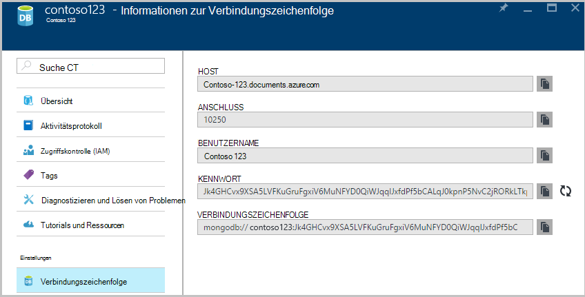

2. Klicken Sie auf **Verbinden** , um den Verbindungs-Manager öffnen **Neu**

    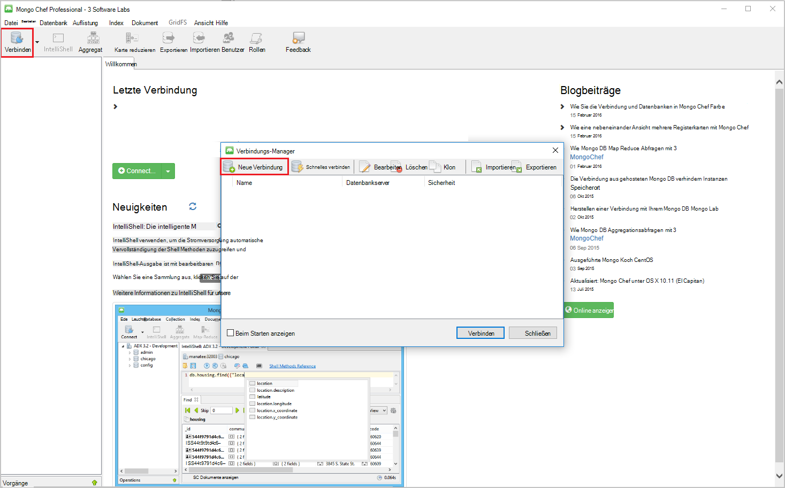
    
2. Geben Sie in das Fenster **Neue Verbindung** auf der Registerkarte **Server** HOST (FQDN) des Kontos DocumentDB Protokoll unterstützt MongoDB und den PORT ein.
    
    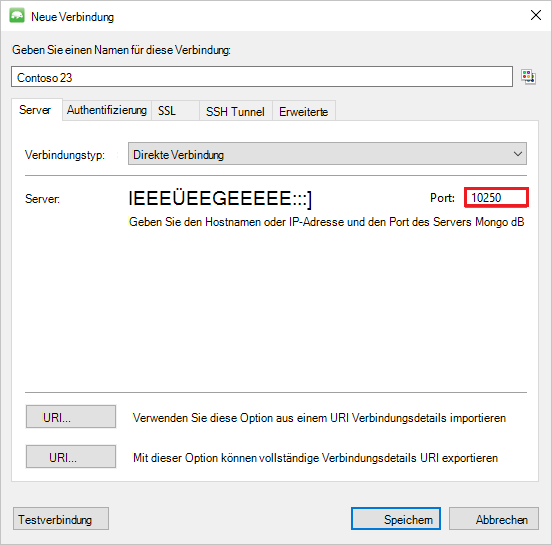

3. Das Fenster **Neue Verbindung** auf der Registerkarte **Authentifizierung** wählen Sie Authentifizierungsmodus **Standard (MONGODB CR oder SCARM-SHA-1)** , und geben Sie Benutzername und Kennwort.  Übernehmen Sie die Standard-Authentifizierung Db (Admin), oder geben Sie Ihren eigenen Wert.

    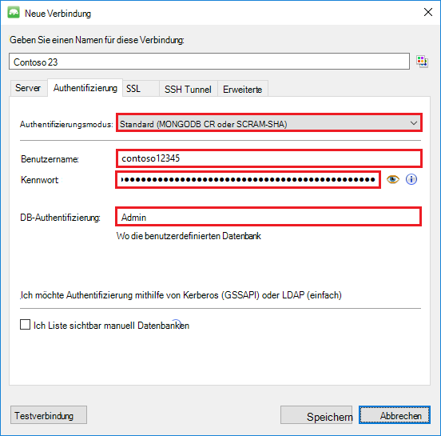

4. Das Fenster **Neue Verbindung** auf der Registerkarte **SSL** checken Sie das Kontrollkästchen **Use SSL-Protokoll herstellen** und das Optionsfeld **selbstsignierte Zertifikate akzeptieren ein** .

    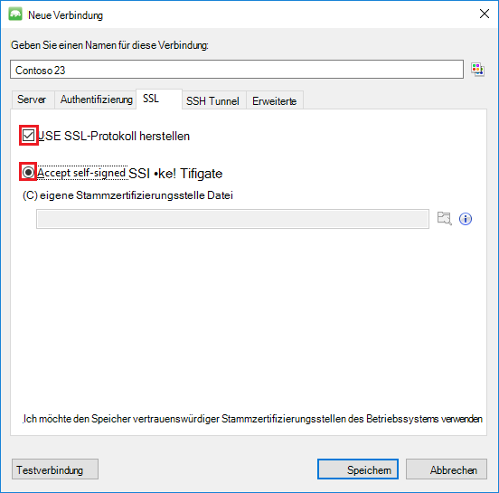

5. Klicken Sie auf **Verbindung testen** , um die Verbindungsinformationen zu überprüfen, klicken Sie auf **OK** , um das Fenster Neue Verbindung zurückzukehren und **Klicken**.

    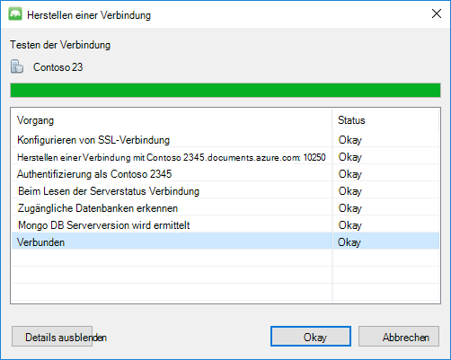

## Verwenden Sie MongoChef zum Erstellen einer Auflistung und Dokumente  

Erstellen einer Auflistung und Dokumente mit MongoChef Schritte.

1. Im **Verbindungs-Manager**die Verbindung, und klicken Sie auf **Verbinden**.

    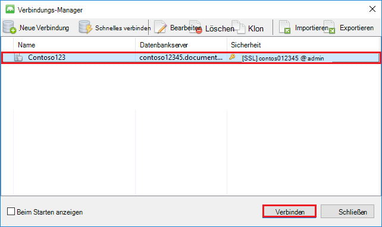

2. Klicken Sie mit der rechten Maustaste den Host, und wählen Sie **Datenbank hinzufügen**.  Geben Sie einen Datenbanknamen, und klicken Sie auf **OK**.
    
    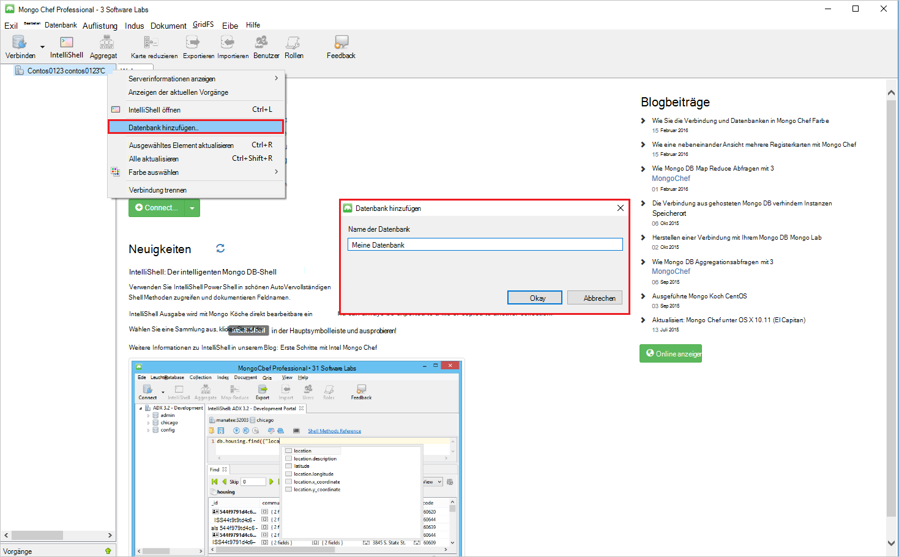

3. Klicken Sie mit der rechten Maustaste die Datenbank und wählen Sie **Sammlung hinzufügen**.  Geben Sie einen Sammlungsnamen, und klicken Sie auf **Erstellen**.

    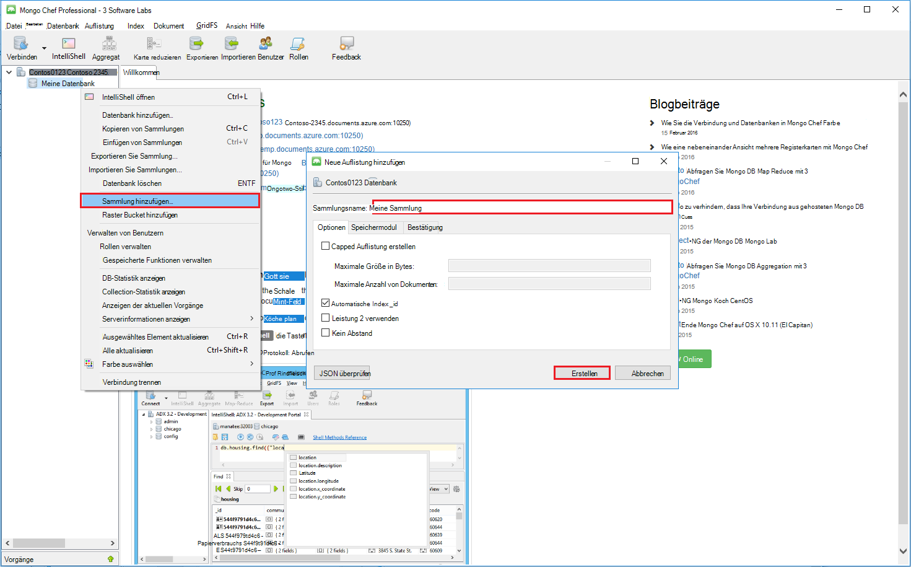

4. Das Menüelement **Auflistung** , klicken Sie auf **Dokument hinzufügen**.

    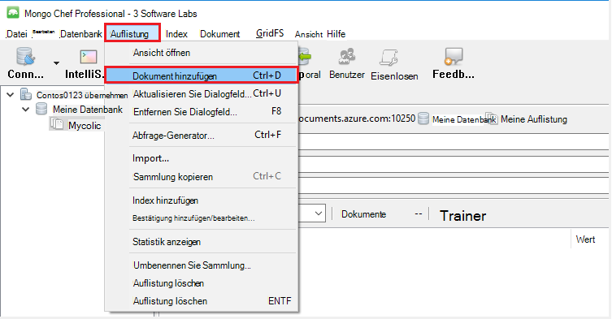

5. Fügen Sie im Dialogfeld Dokument hinzufügen die folgenden, und klicken Sie auf **Dokument hinzufügen**.

        {
        "_id": "AndersenFamily",
        "lastName": "Andersen",
        "parents": [
            { "firstName": "Thomas" },
            { "firstName": "Mary Kay"}
        ],
        "children": [
        {
            "firstName": "Henriette Thaulow", "gender": "female", "grade": 5,
            "pets": [{ "givenName": "Fluffy" }]
        }
        ],
        "address": { "state": "WA", "county": "King", "city": "seattle" },
        "isRegistered": true
        }

    
6. Fügen Sie ein anderes Dokument mit folgendem Inhalt hinzu.

        {
        "_id": "WakefieldFamily",
        "parents": [
            { "familyName": "Wakefield", "givenName": "Robin" },
            { "familyName": "Miller", "givenName": "Ben" }
        ],
        "children": [
            {
                "familyName": "Merriam", 
                "givenName": "Jesse", 
                "gender": "female", "grade": 1,
                "pets": [
                    { "givenName": "Goofy" },
                    { "givenName": "Shadow" }
                ]
            },
            { 
                "familyName": "Miller", 
                "givenName": "Lisa", 
                "gender": "female", 
                "grade": 8 }
        ],
        "address": { "state": "NY", "county": "Manhattan", "city": "NY" },
        "isRegistered": false
        }

7. Eine Beispielabfrage ausführen. Beispielsweise Familien mit dem Nachnamen "Andersen" Suchen und die Eltern und Statusfelder zurück.

    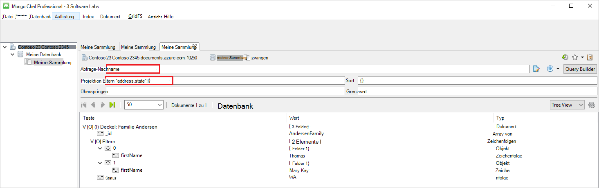
    

## Nächste Schritte

- Untersuchen Sie DocumentDB Protokoll unterstützt MongoDB [Beispiele](documentdb-mongodb-samples.md).

 
