<properties
    pageTitle="DocumentDB Anfragen und Speicher überwachen | Microsoft Azure"
    description="Erfahren Sie, wie Ihr Konto DocumentDB Leistungsindikatoren wie Anfragen und Serverfehler und Nutzung, wie Speicher überwachen."
    services="documentdb"
    documentationCenter=""
    authors="mimig1"
    manager="jhubbard"
    editor="cgronlun"/>

<tags
    ms.service="documentdb"
    ms.workload="data-services"
    ms.tgt_pltfrm="na"
    ms.devlang="na"
    ms.topic="article"
    ms.date="10/17/2016"
    ms.author="mimig"/>

# Überwachen von DocumentDB Anfragen, Verwendung und Speicherung

Sie können Ihre Azure DocumentDB Konten in [Azure-Portal](https://portal.azure.com/)überwachen. Für jedes Konto DocumentDB sind beide Leistungsindikatoren wie Anfragen, Serverfehler und Verwendung Metriken wie Speicher, verfügbar.

Metriken können auf das Konto oder auf die neuen Kriterien überprüft werden.

## Leistungsindikatoren auf die Metriken anzeigen

1. In einem neuen Fenster [Azure-Portal](https://portal.azure.com/)zu öffnen Sie, klicken Sie auf **Weitere Dienste**klicken Sie auf **DocumentDB (NoSQL)**und klicken Sie dann auf den Namen des DocumentDB-Kontos für die Leistungsindikatoren anzeigen möchten.
2. Klicken Sie im ressourcenmenü **Metriken**.

Metriken Blade öffnet, und wählen Sie die Sammlung überprüfen. Sie überprüfen Verfügbarkeit, Anfragen, Durchsatz und Speicher Metriken und SLAs DocumentDB vergleichbar.

## Leistungsindikatoren auf dem Konto anzeigen
1.  In einem neuen Fenster [Azure-Portal](https://portal.azure.com/)zu öffnen Sie, klicken Sie auf **Weitere Dienste**klicken Sie auf **DocumentDB (NoSQL)**und klicken Sie dann auf den Namen des DocumentDB-Kontos für die Leistungsindikatoren anzeigen möchten.

2.  **Überwachung** objektiv standardmäßig folgenden Kacheln angezeigt:
    *   Gesamtanzahl für den aktuellen Tag.
    *   Verwendeter Speicher

    Wenn Ihre Tabelle **keine Daten enthält** und Sie glauben, dass Daten in der Datenbank finden Sie im Abschnitt [Problembehandlung](#troubleshooting) .

    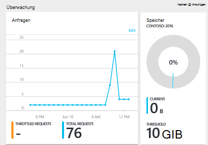

3.  Auf **Anfragen** oder **Speicher** öffnet Kachel detaillierte **Metrik** Blade.
4.  Blade **Metrik** zeigt Details über die Metriken, die Sie ausgewählt haben.  Oben das Blade ist ein Diagramm mit Anfragen stündlich dargestellt, und darunter ist Tabelle Aggregatwerte für Drosselung und insgesamt.  Blatt metrische zeigt die Liste der Warnungen definierten Kriterien, die auf dem aktuellen Blatt Metrik gefiltert, (auf diese Weise haben Sie eine Anzahl von Warnungen, Sie sehen nur die relevanten hier).   

    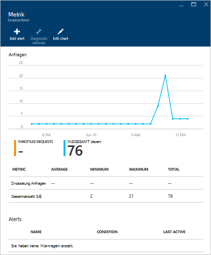

## Metrische Leistungsansichten im Portal anpassen

1.  Anpassen die Metriken, die in einem bestimmten Diagramm anzeigen klicken Sie auf das Diagramm **Metrik** Blatt öffnen und dann auf **Diagramm bearbeiten**.  
    

2.  Auf dem **Diagramm bearbeiten** sind Optionen, die Metriken Ändern des Diagramms sowie die Zeitspanne.  
    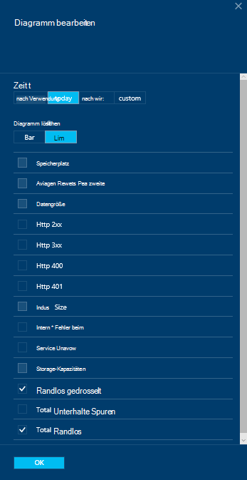

3.  Ändern Sie im Webpart angezeigten Metriken wählen oder verfügbaren Leistungsdaten deaktivieren, und klicken Sie auf **OK** unten das Blade.  
4.  Um den Zeitraum zu ändern, wählen Sie einen anderen Bereich (z. B. **benutzerdefinierte**) und klicken Sie auf **OK** unten das Blade.  

    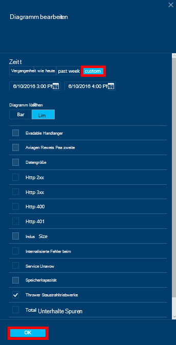

## Erstellen Sie Side-by-Side-Diagramme im portal
Azure-Portal können Sie metrische Side-by-Side-Diagramme erstellen.  

1.  Zunächst mit der rechten Maustaste auf das Diagramm, das Sie kopieren möchten und wählen Sie **Anpassen**.

    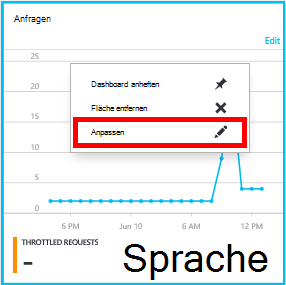

2.  Klicken Sie im Bereich und dann **geschehen anpassen**auf **Clone** .

      

Sie können jetzt dazu den im Webpart angezeigten Metriken und Zeitbereich anpassen als andere metrische Teil behandeln.  Dadurch sehen Sie gleichzeitig zwei unterschiedliche Maße Diagramm-nebeneinander.  
    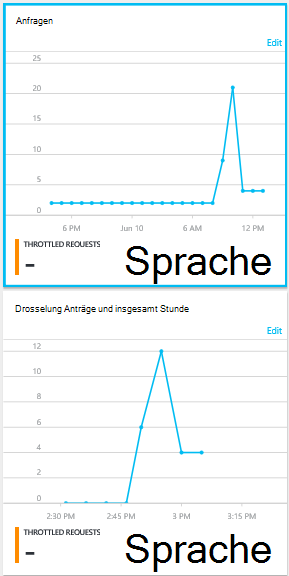  

## Einrichten von Alerts im portal
1.  Klicken Sie in [Azure-Portal](https://portal.azure.com/)auf **Weitere Dienste**, klicken Sie auf **DocumentDB (NoSQL)**und klicken Sie dann auf den Namen des DocumentDB-Kontos für die Leistung Metrik Alarme einrichten möchten.

2.  Klicken Sie im ressourcenmenü **Warnungsregeln** Warnungsregeln Blatt geöffnet.  
    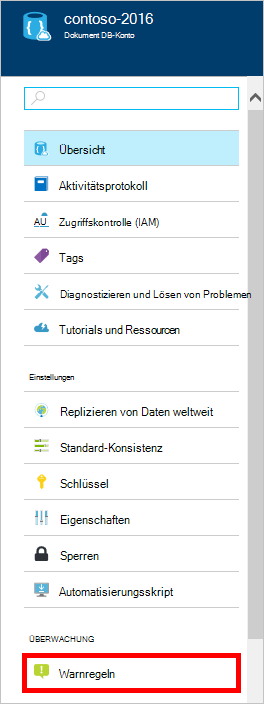

3.  Klicken Sie auf **quot**Blatt **Warnregeln** .  
    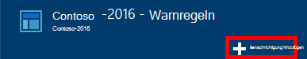

4.  **Hinzufügen eine Warnregel** Blatt angeben:
    *   Der Name der Regel, die Sie einrichten.
    *   Eine Beschreibung der neuen Regel.
    *   Die Metrik für die Regel.
    *   Die Bedingung, Schwellenwert und Zeitraum, die bestimmen, wann die Warnung aktiviert. Angenommen, ein Server Fehleranzahl größer als 5 in den letzten 15 Minuten.
    *   Ob die Dienstadministratoren und coadministratoren per e-Mail Wenn die Warnung ausgelöst wird.
    *   Zusätzliche e-Mail-Adressen-Benachrichtigung.  
    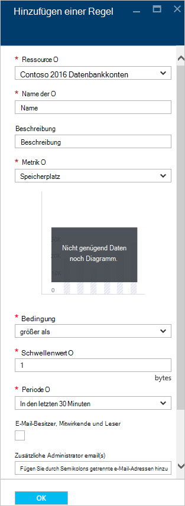

## DocumentDB programmgesteuert überwachen
Die Konto Metriken auf Anwendungsebene im Portal wie Konto Speicher Verwendung und Summe, sind nicht über die DocumentDB-APIs. Allerdings können Sie Daten auf der Ebene der mithilfe der DocumentDB-APIs abrufen. Um Auflistungsdaten abzurufen, führen Sie folgende Schritte aus:

- Die REST-API [Abrufen der Auflistung](https://msdn.microsoft.com/library/mt489073.aspx)verwenden. Die Kontingent und Informationen zum Einsatz der Auflistung wird in der X-ms-Resource-Quota und X-ms-Ressourcenverwendung Header in der Antwort zurückgegeben.
- Um .NET SDK verwenden, verwenden Sie die [DocumentClient.ReadDocumentCollectionAsync](https://msdn.microsoft.com/library/microsoft.azure.documents.client.documentclient.readdocumentcollectionasync.aspx) -Methode, die ein [ResourceResponse](https://msdn.microsoft.com/library/dn799209.aspx) zurückgibt, eine Anzahl von Eigenschaften wie **CollectionSizeUsage**, **DatabaseUsage**, **DocumentUsage**und Verwendung enthält.

Für den Zugriff auf zusätzliche Statistiken [Azure Monitor SDK](https://www.nuget.org/packages/Microsoft.Azure.Insights)verwenden. Verfügbare metrische Definitionen können telefonisch abgerufen werden:

    https://management.azure.com/subscriptions/{SubscriptionId}/resourceGroups/{ResourceGroup}/providers/Microsoft.DocumentDb/databaseAccounts/{DocumentDBAccountName}/metricDefinitions?api-version=2015-04-08

Abfragen abrufen einzelne Schriftarteigenschaften verwenden das folgende Format:

    https://management.azure.com/subscriptions/{SubecriptionId}/resourceGroups/{ResourceGroup}/providers/Microsoft.DocumentDb/databaseAccounts/{DocumentDBAccountName}/metrics?api-version=2015-04-08&$filter=%28name.value%20eq%20%27Total%20Requests%27%29%20and%20timeGrain%20eq%20duration%27PT5M%27%20and%20startTime%20eq%202016-06-03T03%3A26%3A00.0000000Z%20and%20endTime%20eq%202016-06-10T03%3A26%3A00.0000000Z

Weitere Informationen finden Sie unter [Abrufen von Ressourcenmetriken überwachen REST API Azure](https://blogs.msdn.microsoft.com/cloud_solution_architect/2016/02/23/retrieving-resource-metrics-via-the-azure-insights-api/). Beachten Sie, dass "Azure Inights" umbenannt "Azure-Monitor".  Diesen Blog-Eintrag verweist auf den alten Namen.

## Problembehandlung
Wenn Spielsteine Überwachung **keine Daten Meldung** und kürzlich Anträge gestellt oder Daten zur Datenbank hinzugefügt, können Sie die Kachel entsprechend die letzte Verwendung bearbeiten.

### Bearbeiten einer Kachel um aktuelle Daten zu aktualisieren
1.  Anpassen die Metriken, die in einem bestimmten Teil anzeigen, klicken Sie auf Diagramm öffnen **Metrik** Blade und dann auf **Diagramm bearbeiten**.  
    

2.  Das Blade **Diagramm bearbeiten** im Abschnitt **Zeitraum** **nach der vollen Stunde**auf und klicken Sie dann auf **OK**.  
    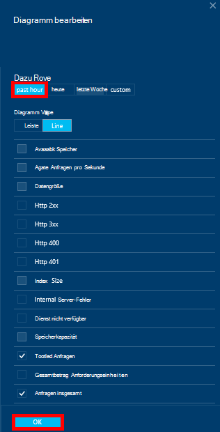

3.  Die Kachel sollten jetzt aktualisieren zeigt die aktuellen Daten und Verwendung.  
    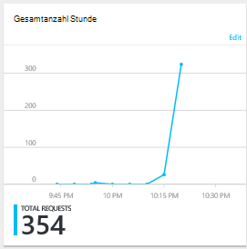

## Nächste Schritte
Weitere Informationen zu DocumentDB Kapazität finden Sie unter [Verwalten DocumentDB Kapazität](documentdb-manage.md).
