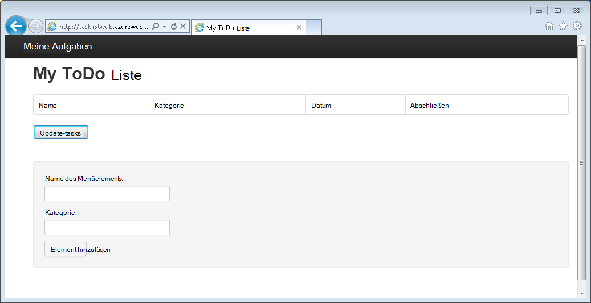
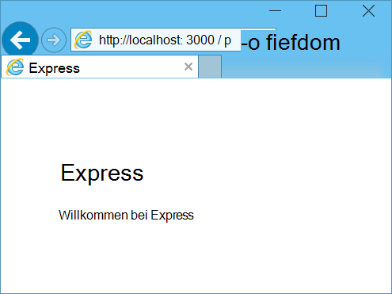
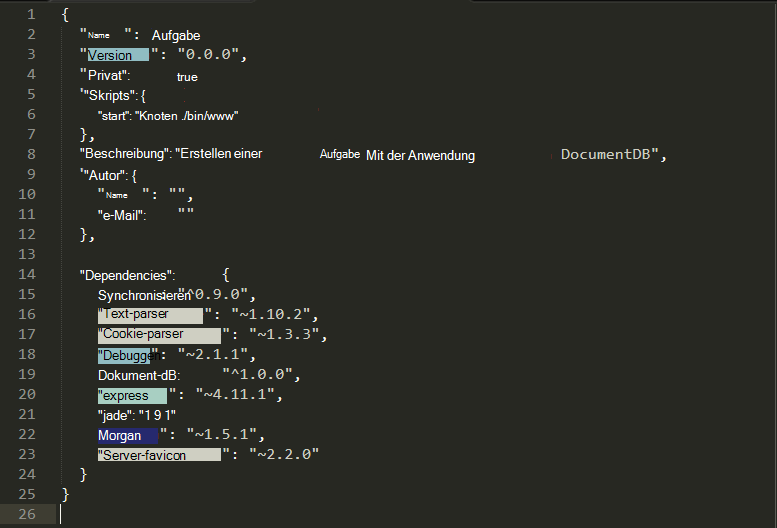
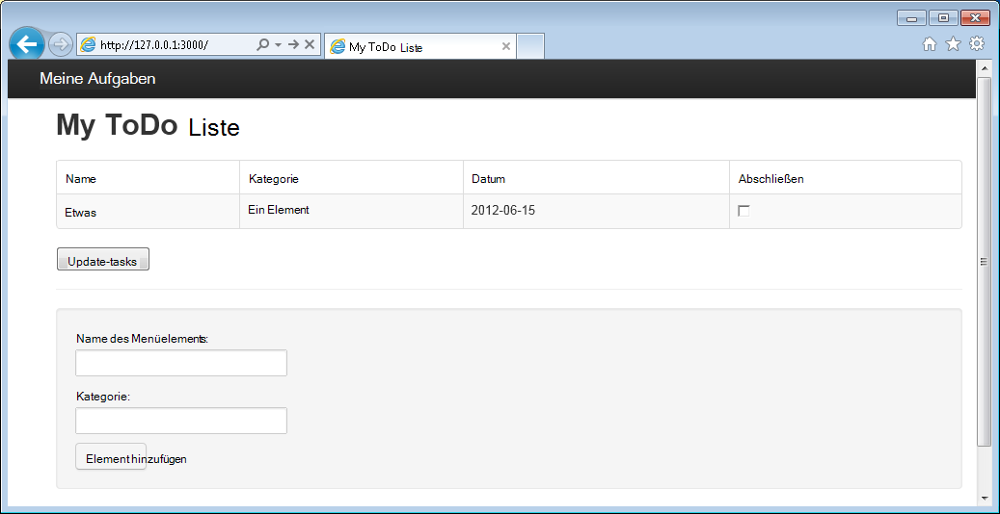

<properties 
    pageTitle="Node.js - DocumentDB Node.js Lernprogramm lernen | Microsoft Azure" 
    description="Erfahren Sie Node.js Lernprogramm wird wie mit Microsoft Azure DocumentDB speichern und Daten aus eine Node.js Express Anwendung in Azure Websites gehostet." 
    keywords="Anwendungsentwicklung Lernprogramm lernen node.js node.js-Lernprogramm Documentdb, Azure, Microsoft azure"
    services="documentdb" 
    documentationCenter="nodejs" 
    authors="syamkmsft" 
    manager="jhubbard" 
    editor="cgronlun"/>

<tags 
    ms.service="documentdb" 
    ms.workload="data-services" 
    ms.tgt_pltfrm="na" 
    ms.devlang="nodejs" 
    ms.topic="hero-article" 
    ms.date="08/25/2016" 
    ms.author="syamk"/>

# Erstellen einer Node.js Webanwendung DocumentDB

> [AZURE.SELECTOR]
- [.NET](documentdb-dotnet-application.md)
- [Node.js](documentdb-nodejs-application.md)
- [Java](documentdb-java-application.md)
- [Python](documentdb-python-application.md)

Diese Node.js Lernprogramm erfahren Sie, wie Sie den Dienst Azure DocumentDB speichern und Access-Daten aus einer Anwendung Node.js Express Azure Websites.

Erste Schritte im folgenden Video, wo Sie lernen, wie ein Datenbankkonto Azure DocumentDB bereitstellen und JSON-Dokumente im Node.js-Anwendung wird empfohlen. 

> [AZURE.VIDEO azure-demo-getting-started-with-azure-documentdb-on-nodejs-in-linux]

Dann zurück zu diesem Lernprogramm Node.js, lernen Sie, die Antworten auf die folgenden Fragen:

- Wie arbeite ich mit DocumentDB mit Documentdb Npm Module?
- Wie wird bereit der Webapplikation Azure Websites?

Anhand dieses Lernprogramm erstellen Sie eine einfache webbasierte Task-Management-Anwendung, die erstellen, abrufen und Aufgaben ausführen können. Die Aufgaben werden als JSON-Dokumente in Azure DocumentDB gespeichert.

Keine Zeit für dieses Lernprogramm erforderlich und möchte die vollständige Lösung? Kein Problem, können Sie die vollständigen Lösung von [GitHub][]abrufen.

## Erforderliche Komponenten

> [AZURE.TIP] Dieses Lernprogramm Node.js vorausgesetzt Sie einige Erfahrung mit Node.js und Azure Websites.

Vor der Instruktionen in diesem Artikel sollten Sie sicherstellen, dass Sie über Folgendes verfügen:

- Ein aktives Azure-Konto. Wenn Sie ein Konto haben, können Sie ein kostenloses Testabo in wenigen Minuten erstellen. Weitere Informationen finden Sie unter [Azure-Testversion](https://azure.microsoft.com/pricing/free-trial/).
- [Node.js][] Version v0.10.29 oder höher.
- [Express-generator](http://www.expressjs.com/starter/generator.html) (Sie können dies über `npm install express-generator -g`)
- [Git][].

## Schritt 1: Erstellen einer DocumentDB Konto

Beginnen wir mit der Erstellung eines DocumentDB. Wenn Sie bereits ein Konto haben, überspringen Sie zu [Schritt2: Erstellen einer neuen Node.js-Anwendung](#_Toc395783178).

[AZURE.INCLUDE [documentdb-create-dbaccount](../../includes/documentdb-create-dbaccount.md)]

[AZURE.INCLUDE [documentdb-keys](../../includes/documentdb-keys.md)]

## Schritt 2: Erstellen einer neuen Anwendung Node.js lernen

Nun betrachten Sie ein einfaches Hello World Node.js-Projekt mit dem [Express](http://expressjs.com/) -Framework erstellt.

1. Öffnen Sie Ihre bevorzugten Terminalserver.

2. Mithilfe des express-Generators eine neue Anwendung namens **Todo**generieren.

        express todo

3. Das neue **Todo** -Verzeichnis öffnen und Abhängigkeiten installieren.

        cd todo
        npm install

4. Die neue Anwendung auszuführen.

        npm start

5. Sie können die neue Anwendung navigieren Browser [http://localhost: 3000](http://localhost:3000)anzeigen.

    

## Schritt 3: Installieren von Zusatzmodulen

Die Datei **package.json** ist eine der Dateien im Stammverzeichnis des Projekts. Diese Datei enthält eine Liste zusätzliche Module für die Anwendung Node.js erforderlich sind. Bei der Bereitstellung dieser Anwendung auf Azure Websites wird später diese Datei verwendet, bestimmen, welche Module in Azure zur Unterstützung der Anwendung installiert werden müssen. Wir müssen für diese praktische Einführung zwei weitere Pakete installieren.

1. Installieren Sie im Terminal **Async** -Modul über Npm.

        npm install async --save

1. Installieren Sie das Modul **Documentdb** über Npm. Dies ist das Modul, in dem die DocumentDB magische geschieht.

        npm install documentdb --save

3. Eine schnelle Überprüfung der Datei **package.json** der Anwendung sollten zusätzliche Module anzeigen. Diese Datei erfahren Azure welche Pakete zum Herunterladen und installieren, wenn die Anwendung ausgeführt. Es sollte das folgenden Beispiel entsprechen.

    

    Veranlaßt Knoten (und später Azure), dass die Anwendung diese Zusatzmodule abhängt.

## Schritt 4: Verwenden des DocumentDB-Dienstes in einer Knoten-Anwendung

Die übernimmt die anfängliche Einrichtung und Konfiguration jetzt wir erhalten Sie, warum wir, und zwar mit Azure DocumentDB Code schreiben.

### Modell erstellen

1. Erstellen Sie ein neues Verzeichnis **Modelle**in das Projektverzeichnis.
2. Erstellen Sie eine neue Datei namens **taskDao.js**im Verzeichnis **Modelle** . Diese Datei enthält das Modell für die Anwendung erstellten Aufgaben.
3. Erstellen Sie eine weitere neue Datei mit dem Namen **docdbUtils.js**im gleichen Verzeichnis **Modelle** . Diese Datei enthält Code nützlichen, wiederverwendet, den wir in unserer Anwendung verwenden. 
4. Kopieren Sie den folgenden Code in in **docdbUtils.js**

        var DocumentDBClient = require('documentdb').DocumentClient;
            
        var DocDBUtils = {
            getOrCreateDatabase: function (client, databaseId, callback) {
                var querySpec = {
                    query: 'SELECT * FROM root r WHERE r.id= @id',
                    parameters: [{
                        name: '@id',
                        value: databaseId
                    }]
                };
        
                client.queryDatabases(querySpec).toArray(function (err, results) {
                    if (err) {
                        callback(err);
        
                    } else {
                        if (results.length === 0) {
                            var databaseSpec = {
                                id: databaseId
                            };
        
                            client.createDatabase(databaseSpec, function (err, created) {
                                callback(null, created);
                            });
        
                        } else {
                            callback(null, results[0]);
                        }
                    }
                });
            },
        
            getOrCreateCollection: function (client, databaseLink, collectionId, callback) {
                var querySpec = {
                    query: 'SELECT * FROM root r WHERE r.id=@id',
                    parameters: [{
                        name: '@id',
                        value: collectionId
                    }]
                };             
                
                client.queryCollections(databaseLink, querySpec).toArray(function (err, results) {
                    if (err) {
                        callback(err);
        
                    } else {        
                        if (results.length === 0) {
                            var collectionSpec = {
                                id: collectionId
                            };
                            
                            client.createCollection(databaseLink, collectionSpec, function (err, created) {
                                callback(null, created);
                            });
        
                        } else {
                            callback(null, results[0]);
                        }
                    }
                });
            }
        };
                
        module.exports = DocDBUtils;

    > [AZURE.TIP] CreateCollection hat einen optionales RequestOptions-Parameter, der an den bieten für die Auflistung verwendet werden kann. Wenn kein requestOptions.offerType-Wert angegeben wird die Auflistung mit den Standardtyp bieten erstellt.
    >
    > Weitere Informationen zu DocumentDB bieten finden Sie auf [Leistungsniveau in DocumentDB](documentdb-performance-levels.md) 
        
3. Speichern Sie und schließen Sie die Datei **docdbUtils.js** .

4. Fügen Sie am Anfang der Datei **taskDao.js** den folgenden Code auf **DocumentDBClient** und **docdbUtils.js** weiter oben erstellten:

        var DocumentDBClient = require('documentdb').DocumentClient;
        var docdbUtils = require('./docdbUtils');

4. Als Nächstes fügen Sie Code zur Definition und Task-Objekt exportieren. Dies ist das Task-Objekt initialisiert und die Datenbank und die Dokumentgruppe verwenden wir verantwortlich.

        function TaskDao(documentDBClient, databaseId, collectionId) {
          this.client = documentDBClient;
          this.databaseId = databaseId;
          this.collectionId = collectionId;
        
          this.database = null;
          this.collection = null;
        }
        
        module.exports = TaskDao;

5. Fügen Sie den folgenden Code zusätzliche Methoden für das Task-Objekt definieren die Interaktionen mit Daten in DocumentDB.

        TaskDao.prototype = {
            init: function (callback) {
                var self = this;
        
                docdbUtils.getOrCreateDatabase(self.client, self.databaseId, function (err, db) {
                    if (err) {
                        callback(err);
                    } else {
                        self.database = db;
                        docdbUtils.getOrCreateCollection(self.client, self.database._self, self.collectionId, function (err, coll) {
                            if (err) {
                                callback(err);
        
                            } else {
                                self.collection = coll;
                            }
                        });
                    }
                });
            },
        
            find: function (querySpec, callback) {
                var self = this;
        
                self.client.queryDocuments(self.collection._self, querySpec).toArray(function (err, results) {
                    if (err) {
                        callback(err);
        
                    } else {
                        callback(null, results);
                    }
                });
            },
        
            addItem: function (item, callback) {
                var self = this;
        
                item.date = Date.now();
                item.completed = false;
        
                self.client.createDocument(self.collection._self, item, function (err, doc) {
                    if (err) {
                        callback(err);
        
                    } else {
                        callback(null, doc);
                    }
                });
            },
        
            updateItem: function (itemId, callback) {
                var self = this;
        
                self.getItem(itemId, function (err, doc) {
                    if (err) {
                        callback(err);
        
                    } else {
                        doc.completed = true;
        
                        self.client.replaceDocument(doc._self, doc, function (err, replaced) {
                            if (err) {
                                callback(err);
        
                            } else {
                                callback(null, replaced);
                            }
                        });
                    }
                });
            },
        
            getItem: function (itemId, callback) {
                var self = this;
        
                var querySpec = {
                    query: 'SELECT * FROM root r WHERE r.id = @id',
                    parameters: [{
                        name: '@id',
                        value: itemId
                    }]
                };
        
                self.client.queryDocuments(self.collection._self, querySpec).toArray(function (err, results) {
                    if (err) {
                        callback(err);
        
                    } else {
                        callback(null, results[0]);
                    }
                });
            }
        };

6. Speichern Sie und schließen Sie die Datei **taskDao.js** . 

### Erstellen des Controllers

1. Erstellen Sie eine neue Datei namens **tasklist.js**im Verzeichnis **Routen** des Projekts. 
2. Fügen Sie folgenden Code zum **tasklist.js**. Dadurch lädt die DocumentDBClient und asynchrone Module von **tasklist.js**verwendet werden. Dies definiert auch die **TaskList** -Funktion, die eine Instanz des **Task** -Objekts übergeben, die zuvor von uns definiert:

        var DocumentDBClient = require('documentdb').DocumentClient;
        var async = require('async');
        
        function TaskList(taskDao) {
          this.taskDao = taskDao;
        }
        
        module.exports = TaskList;

3. Weitere Datei **tasklist.js** durch Hinzufügen der Methoden **ShowTasks, AddTask**und **CompleteTasks**:
        
        TaskList.prototype = {
            showTasks: function (req, res) {
                var self = this;
        
                var querySpec = {
                    query: 'SELECT * FROM root r WHERE r.completed=@completed',
                    parameters: [{
                        name: '@completed',
                        value: false
                    }]
                };
        
                self.taskDao.find(querySpec, function (err, items) {
                    if (err) {
                        throw (err);
                    }
        
                    res.render('index', {
                        title: 'My ToDo List ',
                        tasks: items
                    });
                });
            },
        
            addTask: function (req, res) {
                var self = this;
                var item = req.body;
        
                self.taskDao.addItem(item, function (err) {
                    if (err) {
                        throw (err);
                    }
        
                    res.redirect('/');
                });
            },
        
            completeTask: function (req, res) {
                var self = this;
                var completedTasks = Object.keys(req.body);
        
                async.forEach(completedTasks, function taskIterator(completedTask, callback) {
                    self.taskDao.updateItem(completedTask, function (err) {
                        if (err) {
                            callback(err);
                        } else {
                            callback(null);
                        }
                    });
                }, function goHome(err) {
                    if (err) {
                        throw err;
                    } else {
                        res.redirect('/');
                    }
                });
            }
        };

4. Speichern Sie und schließen Sie die Datei **tasklist.js** .
 
### Config.js hinzufügen

1. Erstellen Sie eine neue Datei namens **config.js**im Projektverzeichnis.
2. Fügen Sie Folgendes zu **config.js**. Konfiguration und Anwendung benötigten Werte definiert.

        var config = {}
        
        config.host = process.env.HOST || "[the URI value from the DocumentDB Keys blade on http://portal.azure.com]";
        config.authKey = process.env.AUTH_KEY || "[the PRIMARY KEY value from the DocumentDB Keys blade on http://portal.azure.com]";
        config.databaseId = "ToDoList";
        config.collectionId = "Items";
        
        module.exports = config;

3. In der Datei **config.js** aktualisiert die Werte der Host- und AUTH_KEY mithilfe der Werte im Schlüssel Blade Ihres DocumentDB-Kontos auf [Microsoft Azure-Portal](https://portal.azure.com)gefunden:

4. Speichern Sie und schließen Sie die Datei **config.js** .
 
### App.js ändern

1. Das Projektverzeichnis öffnen Sie die Datei **app.js** . Diese Datei wurde bereits bei Express Anwendung erstellt wurde.
2. Fügen Sie folgenden Code am Anfang der **app.js**
    
        var DocumentDBClient = require('documentdb').DocumentClient;
        var config = require('./config');
        var TaskList = require('./routes/tasklist');
        var TaskDao = require('./models/taskDao');

3. Dieser Code definiert die Konfigurationsdatei verwendet wird, und zum Lesen von Werten aus dieser Datei einige Variablen bald werden.
4. Ersetzen Sie die folgenden beiden Zeilen in **app.js** Datei:

        app.use('/', routes);
        app.use('/users', users); 

      mit den folgenden Codeausschnitt:

        var docDbClient = new DocumentDBClient(config.host, {
            masterKey: config.authKey
        });
        var taskDao = new TaskDao(docDbClient, config.databaseId, config.collectionId);
        var taskList = new TaskList(taskDao);
        taskDao.init();
        
        app.get('/', taskList.showTasks.bind(taskList));
        app.post('/addtask', taskList.addTask.bind(taskList));
        app.post('/completetask', taskList.completeTask.bind(taskList));
        app.set('view engine', 'jade');

6. Diese Zeilen definieren eine neue Instanz des Objekts **TaskDao** , eine neue Verbindung mit DocumentDB (unter Verwendung der Werte von **config.js**), initialisieren das Task-Objekt und Formularaktionen an Methoden **TaskList** Controller binden. 

7. Speichern und schließen Sie die Datei **app.js** fast fertig.
 
## Schritt 5: Erstellen einer Benutzeroberfläche

Nun werfen wir zum Erstellen der Benutzeroberfläche ein Benutzer tatsächlich mit der Anwendung interagieren. Die Express erstellte Anwendung **Jade** als das Ansichtsmodul. Weitere Informationen über Jade finden Sie unter [http://jade-lang.com/](http://jade-lang.com/).

1. Die Datei **layout.jade** im Verzeichnis **Ansichten** dient als globale Vorlage für andere **.jade** -Dateien. In diesem Schritt ändern Sie zur Verwendung [Twitter Bootstrap](https://github.com/twbs/bootstrap)ist ein Toolkit, die gut aussehende Website entwerfen vereinfacht. 
2. Öffnen Sie die Datei **layout.jade** im Ordner " **Ansichten** " und Ersetzen Sie den Inhalt durch Folgendes;
    
        doctype html
        html
          head
            title= title
            link(rel='stylesheet', href='//ajax.aspnetcdn.com/ajax/bootstrap/3.3.2/css/bootstrap.min.css')
            link(rel='stylesheet', href='/stylesheets/style.css')
          body
            nav.navbar.navbar-inverse.navbar-fixed-top
              div.navbar-header
                a.navbar-brand(href='#') My Tasks
            block content
            script(src='//ajax.aspnetcdn.com/ajax/jQuery/jquery-1.11.2.min.js')
            script(src='//ajax.aspnetcdn.com/ajax/bootstrap/3.3.2/bootstrap.min.js')

    Dies weist **Jade** Engine zum Rendern von HTML-Code für unsere Anwendung effektiv und erstellt einen **Block** namens **Inhalt** , das Layout für unsere Inhaltsseiten liefern wir.
    Speichern Sie und schließen Sie diese Datei **layout.jade** .

4. Jetzt die Datei **index.jade** , die Ansicht, die von der Anwendung verwendet wird und ersetzen den Inhalt der Datei durch Folgendes:

        extends layout
        
        block content
          h1 #{title}
          br
        
          form(action="/completetask", method="post")
            table.table.table-striped.table-bordered
              tr
                td Name
                td Category
                td Date
                td Complete
              if (typeof tasks === "undefined")
                tr
                  td
              else
                each task in tasks
                  tr
                    td #{task.name}
                    td #{task.category}
                    - var date  = new Date(task.date);
                    - var day   = date.getDate();
                    - var month = date.getMonth() + 1;
                    - var year  = date.getFullYear();
                    td #{month + "/" + day + "/" + year}
                    td
                      input(type="checkbox", name="#{task.id}", value="#{!task.completed}", checked=task.completed)
            button.btn(type="submit") Update tasks
          hr
          form.well(action="/addtask", method="post")
            label Item Name:
            input(name="name", type="textbox")
            label Item Category:
            input(name="category", type="textbox")
            br
            button.btn(type="submit") Add item

    Dies erweitert Layout und den **Inhalt** in der Datei **layout.jade** bereits zuvor gesehen Platzhalter Inhalte bereit.
    
    In diesem Layout haben wir zwei HTML-Formulare. 
    Das erste Formular enthält eine Tabelle Daten und eine Schaltfläche, die zum Aktualisieren der Elemente auf der **/completetask** -Methode des Controller ermöglicht.
    Das zweite Formular enthält zwei Eingabefelder und eine Schaltfläche, die zum Erstellen eines neuen Elements auf **/addtask** -Methode des Controller ermöglicht.
    
    Dies sollte alle sein, die wir für unsere Anwendung.

5. Die **style.css** -Datei im Verzeichnis **Public\stylesheets** , und Ersetzen Sie den Code durch Folgendes:

        body {
          padding: 50px;
          font: 14px "Lucida Grande", Helvetica, Arial, sans-serif;
        }
        a {
          color: #00B7FF;
        }
        .well label {
          display: block;
        }
        .well input {
          margin-bottom: 5px;
        }
        .btn {
          margin-top: 5px;
          border: outset 1px #C8C8C8;
        }

    Speichern Sie und schließen Sie diese **style.css** -Datei.

## Schritt 6: Die Anwendung lokal ausführen

1. Zum Testen der Anwendung auf dem lokalen Computer ausgeführt `npm start` Terminaldienste Anwendung und einen Browser mit einer Seite, die das Bild aussieht:

    

2. Mithilfe des bereitgestellten Elements, Elementnamen und Kategorie eingeben und dann auf **Hinzufügen**.

3. Die Seite sollte aktualisiert das neu erstellte Element in der Aufgabenliste.

    

4. Eine Aufgabe einfach das Kontrollkästchen in der Spalte vollständig und klicken Sie anschließend auf **Vorgänge aktualisieren**.

## Schritt 7: Bereitstellen Sie Anwendungsprojekt für Azure Websites

1. Aktivieren Sie ggf. Git Repository für Ihre Azure-Website. Anleitung ist dazu in der [Lokalen Git Bereitstellung Azure App Service](../app-service-web/app-service-deploy-local-git.md) Thema finden.

2. Azure-Website als eine Git remote hinzufügen.

        git remote add azure https://username@your-azure-website.scm.azurewebsites.net:443/your-azure-website.git

3. Auf der Fernbedienung bereitstellen.

        git push azure master

4. In wenigen Sekunden Git Veröffentlichen der Webanwendung beenden und starten Sie einen Browser finden Ihre Arbeit in Azure ausgeführt.

## Nächste Schritte

Herzlichen Glückwunsch! Nur die ersten Node.js Express Webanwendung Azure DocumentDB erstellt und Azure Websites veröffentlicht.

Der Quellcode für die vollständige Anwendung kann von [GitHub][]heruntergeladen werden.

Weitere Informationen finden Sie unter [Node.js Developer Center](https://azure.microsoft.com/develop/nodejs/).

[Node.js]: http://nodejs.org/
[Git]: http://git-scm.com/
[Github]: https://github.com/Azure-Samples/documentdb-node-todo-app
 
