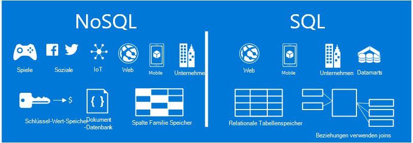
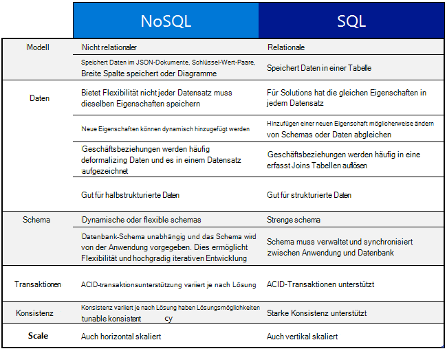
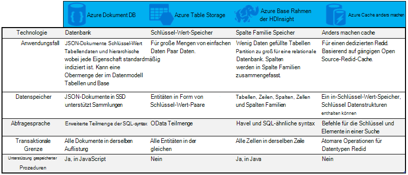

<properties
    pageTitle="Verwendung von NoSQL Vs SQL | Microsoft Azure"
    description="Vergleichen Sie die Vorteile von NoSQL nicht relationalen Lösungen im Vergleich zu SQL Solutions. Erfahren Sie, ob Microsoft Azure NoSQL-Services oder SQL Server best das Szenario passt."
    keywords="NoSQL Vs Sql NoSQL Sql Vs Nosql verwenden"
    services="documentdb"
    documentationCenter=""
    authors="mimig1"
    manager="jhubbard"
    editor=""/>

<tags
    ms.service="documentdb"
    ms.workload="data-services"
    ms.tgt_pltfrm="na"
    ms.devlang="dotnet"
    ms.topic="article" 
    ms.date="06/24/2016"
    ms.author="mimig"/>

# NoSQL Vs SQL

SQL Server und relationalen Datenbanken (RDBMS) wurden Datenbanken gehen zu 20 Jahren. Jedoch verändert gestiegener Bedarf Mengen- und Sorten von Daten schnell zu die Art der Daten Speicherbedarf für Anwendungsentwickler. Um dieses Szenario zu aktivieren, haben NoSQL-Datenbanken, mit denen unstrukturierte und heterogene Daten speichern an Beliebtheit gewonnen. 

NoSQL ist eine Kategorie von SQL-Datenbanken unterschiedliche Datenbanken. NoSQL wird häufig auf Daten-Management-Systeme beziehen, sind "Nicht SQL" oder ein Ansatz für das Datenmanagement, die "nicht nur SQL" enthält. Gibt es eine Anzahl in der NoSQL-Kategorie, einschließlich Dokumentendatenbanken, Wert speichert, Spalte Familie speichert und Graph-Datenbanken mit sozialen Spiele und IoT apps.

Dieser Artikel soll Sie erfahren Sie mehr über die Unterschiede zwischen NoSQL und SQL und Ihnen eine Einführung in die NoSQL und SQL-Angebote von Microsoft.  

## Wenn NoSQL verwenden?

Angenommen, erstellen eine neuen Website Engagements. Benutzer können Beiträge erstellen und Bilder, Videos und Musik hinzufügen. Andere Benutzer können Beiträge Kommentieren und Punkte (mag) die Beiträge bewerten. Die Zielseite haben einen Feed Beiträge, die Benutzer freigeben und interagieren können. 

So speichern Sie diese Daten? Wenn Sie mit SQL vertraut sind, beginnen Sie etwas Zeichnen:

Denken Sie so weit so gut, aber jetzt Struktur und einer Post an. Wenn Sie den Beitrag und zugeordneten Bilder, Audio, Video, Kommentare, Punkte und Benutzerinformationen auf einer Website oder Anwendung anzeigen möchten, müssten Sie eine Abfrage mit acht Tabelle nur zum Abrufen des Inhalts. Nehmen wir einen Stream von Beiträgen, die dynamisch geladen und auf dem Bildschirm angezeigt und Sie können leicht von Abfragen und viele Joins Aufgabe erforderlich werden wird.

Jetzt können Sie eine relationale Lösung wie SQL Server zum Speichern der Daten -, aber es gibt eine andere Option, eine NoSQL-Option, die den Ansatz vereinfacht. Transformiert Post in JSON-Dokument wie folgt und in DocumentDB ein Datenbankdienst Azure NoSQL Dokument speichern können Sie Leistung und den ganzen Beitrag keine Joins mit einer Abfrage abrufen. Es ist einfacher, mehr einfach, und leistungsfähiger.

    {
        "id":"ew12-res2-234e-544f",
        "title":"post title",
        "date":"2016-01-01",
        "body":"this is an awesome post stored on NoSQL",
        "createdBy":User,
        "images":["http://myfirstimage.png","http://mysecondimage.png"],
        "videos":[
            {"url":"http://myfirstvideo.mp4", "title":"The first video"},
            {"url":"http://mysecondvideo.mp4", "title":"The second video"}
        ],
        "audios":[
            {"url":"http://myfirstaudio.mp3", "title":"The first audio"},
            {"url":"http://mysecondaudio.mp3", "title":"The second audio"}
        ]
    }

Darüber hinaus können diese Daten durch Beitrags-Id die Daten natürlich skalieren und NoSQL Skalierung Merkmale partitioniert werden. NoSQL-Systeme ermöglichen auch Entwicklern zu lösen Konsistenz hochverfügbare apps.  Schließlich erfordert diese Lösung keine Entwickler definieren, verwalten und Warten von Schemas in der Datenebene für schnelle Iteration.

Anschließend können Sie diese Lösung mit anderen Azure Services erstellen:

- Ermöglichen Benutzern die Suche nach Beiträgen kann [Azure Search](https://azure.microsoft.com/services/search/) Web App verwendet werden.
- [Azure App Dienste](https://azure.microsoft.com/services/app-service/) können Clientanwendungen und Hintergrundprozesse verwendet werden.
- [Azure BLOB-Speicher](https://azure.microsoft.com/services/storage/) kann zum vollständigen Profile mit Bildern speichern.
- [Azure SQL-Datenbank](https://azure.microsoft.com/services/sql-database/) kann verwendet werden, um große Mengen von Daten wie Anmeldeinformationen und Daten für die Verwendungsanalyse zu speichern.
- [Azure Machine Learning](https://azure.microsoft.com/services/machine-learning/) kann verwendet werden, wissen und Intelligenz, Feedback zu den Prozess und die richtige Inhalte an die richtigen Benutzer beitragen.

Diese Site Engagements gehört NoSQL-Datenbank ist in der richtigen Datenmodell für den Auftrag. Wenn Sie mehr über dieses Szenario und Ihr Datenmodell für DocumentDB in sozialer Mediaprogramme, sehen Sie [mit DocumentDB](documentdb-social-media-apps.md). 

## NoSQL Vs SQL Vergleich

Die folgende Tabelle vergleicht die Hauptunterschiede zwischen NoSQL und SQL. 

Wenn eine NoSQL-Datenbank am besten Ihren Bedürfnissen weiter zum nächsten Abschnitt, um weitere Informationen zu verfügbaren Azure NoSQL-Services. Wenn eine SQL-Datenbank am besten Ihren Bedürfnissen entspricht, fahren Sie andernfalls mit [wie Microsoft SQL angeboten?](#what-are-the-microsoft-sql-offerings)

## Was sind Microsoft Azure NoSQL angeboten?

Azure hat vier vollständig verwaltet NoSQL-Dienste: 

- [Azure DocumentDB](https://azure.microsoft.com/services/documentdb/)
- [Azure Table Storage](https://azure.microsoft.com/services/storage/)
- [Azure HBase als Teil des HDInsight](https://azure.microsoft.com/services/hdinsight/)
- [Azure Redis Cache](https://azure.microsoft.com/services/cache/)

Die folgenden Vergleichstabelle bildet die Alleinstellungsmerkmale für jeden Dienst. Welche beschreibt am ehesten benötigt Ihre Anwendung? 

Erfüllt eine oder mehrere dieser Dienste muss die Anwendung möglicherweise, erfahren Sie in den folgenden Ressourcen: 

- [Lernpfad für DocumentDB](https://azure.microsoft.com/documentation/learning-paths/documentdb/) und [DocumentDB von Anwendungsfällen](documentdb-use-cases.md)
- [Erste Schritte mit Azure-Tabellenspeicher](../storage/storage-dotnet-how-to-use-tables.md)
- [Was ist HBase in HDInsight](../hdinsight/hdinsight-hbase-overview.md)
- [Redis Cache Lernpfad](https://azure.microsoft.com/documentation/learning-paths/redis-cache/)

Dann werden Sie [Weiter](#next-steps) kostenlose Testversion Informationen.

## Was sind Microsoft SQL angeboten?

Microsoft hat fünf SQL-Angebote: 

- [SQL Azure-Datenbank](https://azure.microsoft.com/services/sql-database/)
- [SQL Server auf Azure Virtual Machines](https://azure.microsoft.com/services/virtual-machines/sql-server/)
- [SQL Server](https://www.microsoft.com/server-cloud/products/sql-server-2016/)
- [Azure SQL Datawarehouse (Vorschau)](https://azure.microsoft.com/services/sql-data-warehouse/)
- [Analytics Plattformsystem (lokale Einheit)](https://www.microsoft.com/en-us/server-cloud/products/analytics-platform-system/)

Wenn Sie SQL Server auf einem virtuellen Computer oder SQL-Datenbank interessiert sind, dann lesen Sie [Wählen Sie eine Wolke SQL Server Option: Azure SQL (PaaS) Datenbank oder SQL Server auf Azure VMs (IaaS)](../sql-database/sql-database-paas-vs-sql-server-iaas.md) mehr über die Unterschiede zwischen den beiden.

Wenn SQL klingt am besten, fahren Sie mit [SQL Server](https://www.microsoft.com/server-cloud/products/) erfahren Sie, was unsere Microsoft SQL Produkte und Services bieten.

Fahren Sie mit [Nächste Schritte](#next-steps) kostenlos evaluieren und Bewertung Links.

## Nächste Schritte

Wir laden Sie erfahren mehr über unsere Produkte SQL und NoSQL kostenlos ausprobieren. 

- Für alle Azure Services können Sie melden Sie sich für eine [Testversion für einen Monat](https://azure.microsoft.com/pricing/free-trial/) und $200 auf der Azure-Dienste zu erhalten.
    - [Azure DocumentDB](https://azure.microsoft.com/services/documentdb/)
    - [Azure HBase als Teil des HDInsight](https://azure.microsoft.com/services/hdinsight/)
    - [Azure Redis Cache](https://azure.microsoft.com/services/cache/)
    - [Azure SQL Datawarehouse (Vorschau)](https://azure.microsoft.com/services/sql-data-warehouse/)
    - [SQL Azure-Datenbank](https://azure.microsoft.com/services/sql-database/)
    - [Azure Table Storage](https://azure.microsoft.com/services/storage/)

- Sie können eine [Evaluierungsversion von SQL Server 2016 auf einem virtuellen Computer](https://azure.microsoft.com/marketplace/partners/microsoft/sqlserver2016ctp33evaluationwindowsserver2012r2/) Hochfahren oder eine [Evaluierungsversion von SQL Server](https://www.microsoft.com/en-us/evalcenter/evaluate-sql-server-2016)downloaden.
    - [SQL Server](https://www.microsoft.com/server-cloud/products/sql-server-2016/)
    - [SQL Server auf Azure Virtual Machines](https://azure.microsoft.com/services/virtual-machines/sql-server/)

