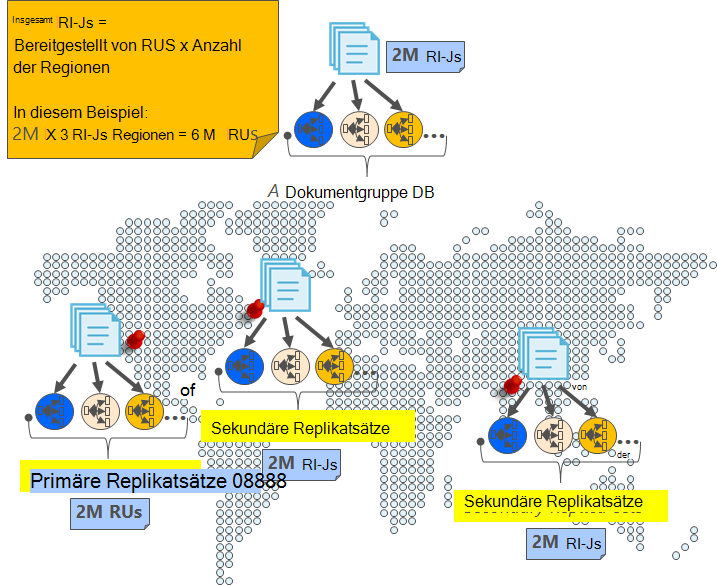
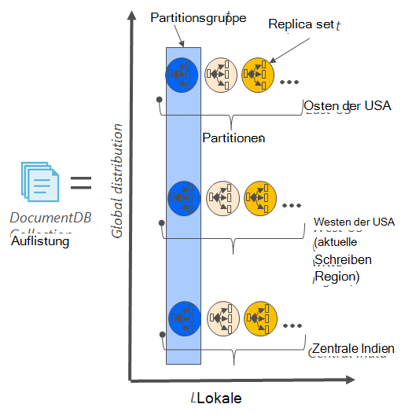
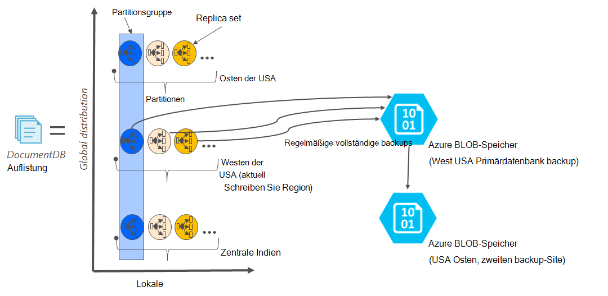

<properties
    pageTitle="Online-Backup und Wiederherstellung mit DocumentDB | Microsoft Azure"
    description="Automatische Sicherung und Wiederherstellung von NoSQL-Datenbanken mit Azure DocumentDB erfahren."
    keywords="Sicherung und Wiederherstellung, online-Sicherung"
    services="documentdb"
    documentationCenter=""
    authors="RahulPrasad16"
    manager="jhubbard"
    editor="monicar"/>

<tags
    ms.service="documentdb"
    ms.workload="data-services"
    ms.tgt_pltfrm="na"
    ms.devlang="multiple"
    ms.topic="article"
    ms.date="09/23/2016"
    ms.author="raprasa"/>

# Automatische online-Sicherung und Wiederherstellung mit DocumentDB 

Azure DocumentDB wird in regelmäßigen Abständen automatisch Sicherungskopien Ihrer Daten. Die automatische Sicherung ohne Beeinträchtigung der Performance oder Verfügbarkeit NoSQL-Datenbank Operationen. Alle Backups werden separat in anderen Speicherdienst und diese Backups Global Robustheit vor örtlich begrenzten Katastrophen repliziert. Automatische Backups dienen für Szenarien DocumentDB Auflistung versehentlich gelöscht und später Daten-Recovery und Disaster Recovery-Lösung benötigen.  

Dieser Artikel beginnt mit eine kurze Zusammenfassung der Datenredundanz und Verfügbarkeit in DocumentDB und behandelt Backups. 

## Hohe Verfügbarkeit mit DocumentDB - eine Zusammenfassung

DocumentDB [Global verteilt](documentdb-distribute-data-globally.md) werden soll – können Durchsatz mehrere Azure Regionen mit richtliniengesteuerte Failover und transparente Multi-homing APIs skalieren. Als Datenbanksystem mit [Verfügbarkeit von 99,99 % SLAs](https://azure.microsoft.com/support/legal/sla/documentdb/v1_0/)wollen alle Schreibvorgänge in DocumentDB als lokale Festplatten durch ein Quorum von Replikaten in einem lokalen vor der Bestätigung an den Client. Beachten Sie, dass die hohe Verfügbarkeit des DocumentDB auf lokalem Speicher beruht und nicht auf alle externen. Wenn Ihr Konto mehrere Azure-Region zugeordnet ist, werden außerdem die Schreibvorgänge in anderen Regionen repliziert. Zum Skalieren der Durchsatz und Daten auf niedrige Wartezeiten haben Sie wie viele Bereiche wie Ihr Konto zugeordnet. In jeder Region gelesen werden (replizierten) Daten dauerhaft in einer Replikatgruppe beibehalten.  

Wie im folgenden Diagramm ist eine DocumentDB Auflistung [horizontal partitioniert](documentdb-partition-data.md). "Partition" ist gekennzeichnet durch einen Kreis in der folgenden Abbildung und jede Partition erfolgt sehr über eine Replikatgruppe verfügbar. Dies ist die lokale Verteilung in einem einzigen Azure Bereich (gekennzeichnet durch die x-Achse). Darüber hinaus wird jeder Partition (mit der entsprechenden Replikatgruppe) dann Global mehrere Regionen mit Ihrem Konto (z. B. in dieser Abbildung drei Regionen USA Osten und Westen der USA Central Indien) verteilt. "Partitionsgruppe" ist ein Global verteilten Entität aus mehreren Kopien der Daten in jeder Region (gekennzeichnet durch die y-Achse). Die Regionen mit Ihrem Konto Priorität zuweisen und DocumentDB wird transparent Failover auf den nächsten Bereich Notfall. Sie können auch manuell Failover zum Testen der End-to-End-Verfügbarkeit der Anwendung simulieren.  

Die folgende Abbildung zeigt die hohe Redundanz mit DocumentDB.

## Vollständige, automatisch, online-backups

UPS, ich meine Auflistung oder gelöscht Datenbank! Mit DocumentDB nicht nur Daten, sondern die Sicherungskopien Ihrer Daten auch hochgradig redundante und stabilen regionale Katastrophen werden. Diese automatisierte Backups werden derzeit alle vier Stunden. 

Die Sicherung ohne Performance oder Verfügbarkeit der Datenbankvorgänge. DocumentDB nimmt die Sicherung im Hintergrund ohne Nutzung der bereitgestellten RUs die Leistung beeinträchtigen und ohne die Verfügbarkeit der NoSQL-Datenbank. 

Im Gegensatz zu der in DocumentDB gespeicherten Daten werden automatische Backups im Dienst Azure BLOB-Speicher gespeichert. Garantieren Sie niedrige Latenz und effiziente Upload wird der Snapshot für die Sicherung zu einer Instanz von Azure BLOB-Speicher im Bereich der aktuellen schreiben Bereich Ihres Kontos DocumentDB Datenbank hochgeladen. Robustheit gegen regionale Ausfälle wird jede Momentaufnahme der Sicherungsdaten in Azure BLOB-Speicher wieder über Geo-redundanten Speicher (GRS) in eine andere Region repliziert. Das folgende Diagramm zeigt die gesamte Auflistung DocumentDB (mit allen drei primäre Partitionen im Westen der USA in diesem Beispiel) in einem Remotekonto Azure BLOB-Speicher im Westen der USA gesichert, dann g ostasiatischen US repliziert. 

Die folgende Abbildung zeigt die regelmäßige vollständige Backups aller DocumentDB Entitäten im GRS Azure-Speicher.

## Aufbewahrungsdauer für einen bestimmten snapshot

Wie oben beschrieben, wir regelmäßig Snapshots Ihrer Daten und unsere Vorschriften, wir behalten den aktuellsten Snapshot bis auf 90 Tage bevor sie schließlich gelöscht wird. Wenn eine Auflistung oder ein Konto gelöscht wird, speichert DocumentDB die letzte Sicherung für 90 Tage.

## Datenbank aus einer Online-Sicherung wiederherstellen

Falls Sie versehentlich Daten löschen, können Sie [Datei supportticket](https://portal.azure.com/?#blade/Microsoft_Azure_Support/HelpAndSupportBlade) oder Wiederherstellen der letzten automatischen Sicherung [Azure wenden](https://azure.microsoft.com/support/options/) . Für eine bestimmte Momentaufnahme der Sicherung wiederhergestellt werden muss DocumentDB die Daten für die Dauer der Sicherungszyklus für diese Momentaufnahme mindestens mit uns verfügbar waren.

## Nächste Schritte

Zum Replizieren der NoSQL-Datenbank in mehreren Rechenzentren finden Sie [Ihre Daten mit DocumentDB](documentdb-distribute-data-globally.md). 

Datei-Kontakt Azure-Unterstützung, [Datei ein Ticket aus dem Azure-Portal](https://portal.azure.com/?#blade/Microsoft_Azure_Support/HelpAndSupportBlade).