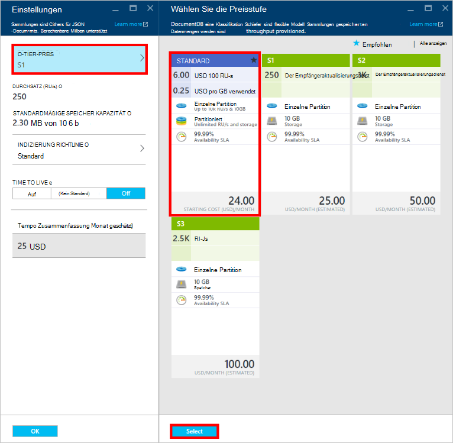
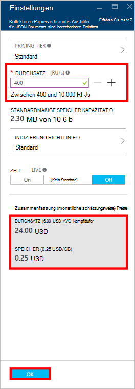

<properties
    pageTitle="Leistungsniveau in DocumentDB | Microsoft Azure"
    description="Erfahren Sie, wie Leistungsmerkmale in DocumentDB Durchsatz pro pro Auflistung reservieren können."
    services="documentdb"
    authors="mimig1"
    manager="jhubbard"
    editor="monicar"
    documentationCenter=""/>

<tags
    ms.service="documentdb"
    ms.workload="data-services"
    ms.tgt_pltfrm="na"
    ms.devlang="na"
    ms.topic="article"
    ms.date="08/26/2016"
    ms.author="mimig"/>

# Leistungsniveau in DocumentDB

Dieser Artikel bietet eine Übersicht über Leistungsmerkmale in [Microsoft Azure DocumentDB](https://azure.microsoft.com/services/documentdb/).

Nach dem Lesen dieses Artikels werden Sie folgenden Fragen beantworten:  

-   Was ist eine Leistung?
-   Wie ist der Durchsatz für ein Konto reserviert?
-   Wie arbeite ich mit Leistung?
-   Wie arbeite Leistung in Rechnung?

## Einführung in Leistung

Jedes DocumentDB Kollektion unter einem Standardkonto wird mit zugeordneten Leistung bereitgestellt. Jede Auflistung in einer Datenbank können eine unterschiedliche Leistungsniveau ermöglicht mehr Durchsatz genutzten Sammlungen und Durchsatz selten Sammlungen festlegen. DocumentDB unterstützt sowohl benutzerdefinierte Leistungsmerkmale und vordefinierte Leistung.  

Leistungsfähigen hat ein Ratenlimit zugeordnete [Anforderung Einheit (RU)](documentdb-request-units.md) . Dies ist der Durchsatz einer Sammlung basierend auf der Leistung reserviert werden und ausschließlich für diese Auflistung verfügbar ist.

<table border="0" cellspacing="0" cellpadding="0">
    <tbody>
        <tr>
            <td valign="top">

</td>
            <td valign="top">
Details
</td>
            <td valign="top">
Durchsatz Grenzwerte
</td>
            <td valign="top">
Speichergrenzwerte
</td>
            <td valign="top">
Version
</td>
            <td valign="top">
APIs
</td>            
        </tr>
        <tr>
            <td valign="top">
Benutzerdefinierter performance
</td>
            <td valign="top">
Speicher gemessen auf Verwendung in GB.

Durchsatz in Einheiten von 100 RU-s
</td>
            <td valign="top">
Unbegrenzt. 400 - 250.000 anfordern Einheiten/s (Anforderung höher) standardmäßig
</td>
            <td valign="top">
Unbegrenzt. 250 GB standardmäßig (höher auf Anfrage) 
</td>
            <td valign="top">
V2
</td>
            <td valign="top">
API 2015-12-16 und höher
</td>  
        </tr>
        <tr>
            <td valign="top">
Vordefinierte Leistung
</td>
            <td valign="top">
10 GB reservierten Speicher.

S1 = 250 RU von s, S2 = 1000 RU/s, S3 = RU 2500/s
</td>
            <td valign="top">
RU 2500/s
</td>
            <td valign="top">
10 GB
</td>
            <td valign="top">
V1
</td>
            <td valign="top">
Alle
</td>  
        </tr>        
    </tbody>
</table>                

DocumentDB kann einen umfangreichen Satz von Datenbankoperationen, einschließlich Abfragen, Abfragen mit benutzerdefinierten Funktionen (UDFs) gespeicherte Prozeduren und Trigger. Die Kosten dieser Operationen zugeordnet variiert je CPU, i/o und Arbeitsspeicher zum Abschließen des Vorgangs erforderlich. Stattdessen und Verwalten von Hardware-Ressourcen, Sie können eine Anforderung Einheit als ein Maß für die Ressourcen vorstellen zu verschiedenen Datenbankoperationen eine Anwendung Anforderung erforderlich.

Sammlungen können über [Microsoft Azure-Portal](https://portal.azure.com), die [REST-API](https://msdn.microsoft.com/library/azure/mt489078.aspx) oder den [DocumentDB-SDKs](https://msdn.microsoft.com/library/azure/dn781482.aspx)erstellt werden. Die DocumentDB-APIs können Sie die Leistung einer Auflistung anzugeben.

> [AZURE.NOTE] Die Leistungsfähigkeit einer Auflistung kann über die APIs oder die [Microsoft Azure-Portal](https://portal.azure.com/)angepasst werden. Leistung ändert voraussichtlich innerhalb von drei Minuten abgeschlossen.

## Leistung für Sammlungen festlegen
Nachdem die Auflistung erstellt wird, vollständige Zuweisung von RUs festgelegten Leistung anhand der Auflistung reserviert.

Beachten Sie, dass sowohl benutzerdefinierte und vordefinierte Leistung DocumentDB auf Reservierung Durchsatz. Erstellen Sie eine Auflistung, eine Anwendung hat und reservierte Durchsatz unabhängig davon wie viel dieser Durchsatz aktiv abgerechnet wird. Benutzerdefinierte Leistung Speicher auf Grundlage gemessen, aber vordefinierte Leistung 10 GB Speicher reserviert, zum Zeitpunkt der Erstellung.  

Die Erstellung von Sammlungen können Sie die Leistungsfähigkeit durch DocumentDB-SDKs oder der Azure-Verwaltungsportal ändern.

> [AZURE.IMPORTANT] DocumentDB Standard Sammlungen auf Stundenbasis abgerechnet, und jede Auflistung erstellte für mindestens eine Stunde Nutzung abgerechnet.

Wenn Sie Leistung eine Auflistung innerhalb einer Stunde einstellen, werden Sie für höchste Leistung während der Stunde in Rechnung. Z. B. Wenn Sie die Leistung für eine Auflistung 53 Uhr erhöhen Sie für die neue Ebene ab 8:00 Uhr berechnet. Auch wenn verringern die Leistungsstufe 53 Uhr neue Satz um 9:00 Uhr angewendet.

Anforderung sind für jede Auflistung basierend auf der Leistung eingestellt. Anforderung Einheitenverbrauch bewertet ein pro Sekunde. Programme, die für eine Auflistung bereitgestellte Anforderungsrate Einheit (oder Leistung) überschreiten werden gedrosselt werden, bis die reservierten Ebene für diese Auflistung die Rate unterschreitet. Wenn Ihre Anwendung eine höhere Durchsatz erfordert, können Sie die Leistungsstufe für jede Auflistung erhöhen.

> [AZURE.NOTE] Überschreitet die Anwendung Leistung einer oder mehrerer Sammlungen, werden Anfragen pro pro Auflistung eingeschränkt. Dies bedeutet, dass einige Anträge möglicherweise fehlschlagen, während andere möglicherweise eingeschränkt. Es wird empfohlen, eine kleine Anzahl von Wiederholungsversuchen beim gedrosselt, um Spitzen im Datenverkehr verarbeiten hinzufügen.

## Arbeiten mit Leistung
DocumentDB-Sammlungen können Sie Ihre Daten anhand der Abfragemuster und Leistung muss der Anwendung. DocumentDBs automatische Indizierung und Unterstützung ist es üblich, heterogener Dokumente innerhalb derselben Auflistung weiterzuleiten. Sind die wichtigsten Faktoren bei der Entscheidung, ob getrennte Auflistungen verwendet werden soll:

- Abfragen – eine Auflistung ist die Ausführung der Abfrage. Möchten Sie Abfragen für eine Gruppe von Dokumenten, stammen die effizientesten Lesen Muster Zusammenstellung Dokumente in einer einzelnen Auflistung.
- Transaktionen – alle sind innerhalb einer einzelnen Auflistung beschränkt. Wenn Sie Dokumente, die in eine einzelne gespeicherte Prozedur oder ein Trigger aktualisiert werden muss haben, müssen sie innerhalb der gleichen Auflistung gespeichert werden. Genauer gesagt ist Partitionsschlüssel innerhalb einer Auflistung der Transaktionsgrenze. Weitere Informationen finden Sie unter [Partitioning in DocumentDB](documentdb-partition-data.md) .
- Performance-Isolierung – verfügt über eine Auflistung einer zugeordnet. Dadurch hat jede Auflistung eine vorhersagbare Leistung über reservierte RUs. Daten können anderen Sammlungen mit unterschiedlichem Leistungsbild basiert Zugang Frequenz zugeordnet werden.

> [AZURE.IMPORTANT] Es ist wichtig zu verstehen, dass Sie vollständige Standardsätze basierend auf der Anzahl von Sammlungen von der Anwendung berechnet werden.

Es wird empfohlen, die Anwendung einer kleinen Anzahl Sammlungen verwenden, wenn Sie große Speicher oder Durchsatz benötigen. Sicherstellen Sie, dass die Anwendungsmuster für das Erstellen von neuen Sammlungen gut verstanden haben. Sie können erstellen als Management-Aktionen außerhalb der Anwendung behandelt zu reservieren. Ebenso ändert Leistungsstufe für eine Auflistung anpassen den Stundensatz sich mit die Auflistung abgerechnet wird. Stellt die Anwendung diese dynamisch sollten Sie Auflistung Leistung überwachen.

## Ändern von S1, S2, S3 benutzerdefinierter performance

Gehen von vordefinierten Durchsatz Tonwerte zu benutzerdefinierten Durchsatz im Azure-Portal. Mithilfe von benutzerdefinierten Durchsatz Ebenen können Sie den Durchsatz an Ihre Bedürfnisse anpassen. Und wenn Sie ein S1-Konto weiterhin verwenden, können Sie den Standard-Durchsatz von 250 RU-s 400 RU/s mit nur wenigen Mausklicks erhöhen.

Weitere Informationen zu Preisen ändert Durchsatz mit benutzerdefinierten und vordefinierten finden Sie im Blogbeitrag [DocumentDB: mit den neuen Preisen Optionen erfahren alles](https://azure.microsoft.com/blog/documentdb-use-the-new-pricing-options-on-your-existing-collections/).

> [AZURE.VIDEO changedocumentdbcollectionperformance]

1. Navigieren Sie in Ihrem Browser zum [**Azure-Portal**](https://portal.azure.com).
2. Klicken Sie auf **Durchsuchen,** -> **DocumentDB-Konten**, und wählen Sie dann das DocumentDB-Konto ändern.   
3. In der Linse **Datenbanken** wählen Sie Datenbank ändern und dann Blatt **Datenbank** der Auflistung ändern. Konten mit vordefinierten Durchsatz haben einen Tarif S1, S2 oder S3.

      

4. Klicken Sie auf **Weitere**und anschließend **Einstellungen** in der oberen Leiste Blatt **Sammlungen** .   
5. Blatt **Einstellungen** auf **Tier-Preisen** und monatliche Vorkalkulation für jeden Plan **Auswählen der Tarif** Blatt angezeigt. Um benutzerdefinierte Durchsatz zu ändern, klicken Sie auf **Standard**und dann auf **auswählen** , um die Änderung zu speichern.

      

6. Im Blatt **Einstellungen** **Tier Preise** **Standard** geändert und das **Durchsatz (RU/s)** mit einem Standardwert von 400 angezeigt. Legen Sie den Durchsatz zwischen 400 und 10.000 [Einheiten anfordern](documentdb-request-units.md)MHzProzessoren (RU/s). Die **Preise Zusammenfassung** unten auf der Seitenupdates automatisch eine Schätzung der monatlichen Kosten. Klicken Sie auf **OK** , um die Änderungen zu speichern.

    

7. Auf das Blatt **Datenbank** können Sie neuen Durchsatz der Auflistung überprüfen.

    

Wenn Sie feststellen, dass Sie einen höheren Durchsatz (größer als 10.000 RU-s) oder mehr Speicher (größer als 10 GB) können Sie eine partitionierte Auflistung erstellen. Zum Erstellen einer partitionierten Auflistung finden Sie unter [Erstellen einer Sammlung](documentdb-create-collection.md).

>[AZURE.NOTE] Ändern der Leistungsmerkmale einer Auflistung kann bis zu 2 Minuten dauern.

## Ändern der Leistung mit .NET SDK

Eine weitere Option zum Ändern der Leistungsmerkmale der Sammlungen wird durch unsere SDKs. Dieses Abschnitts nur mit unserer [.NET SDK](https://msdn.microsoft.com/library/azure/dn948556.aspx)Leistungsebene der Sammlung ändern, aber das ist für unsere anderen [SDKs](https://msdn.microsoft.com/library/azure/dn781482.aspx). Wenn Sie zu unserer .NET SDK sind, besuchen Sie unsere [Einführung](documentdb-get-started.md).

Hier ist ein Codeausschnitt zum Ändern des Durchsatzes Angebot auf 50.000 Anforderung pro Sekunde:

    //Fetch the resource to be updated
    Offer offer = client.CreateOfferQuery()
                      .Where(r => r.ResourceLink == collection.SelfLink)    
                      .AsEnumerable()
                      .SingleOrDefault();

    // Set the throughput to 5000 request units per second
    offer = new OfferV2(offer, 5000);

    //Now persist these changes to the database by replacing the original resource
    await client.ReplaceOfferAsync(offer);

    // Set the throughput to S2
    offer = new Offer(offer);
    offer.OfferType = "S2";

    //Now persist these changes to the database by replacing the original resource
    await client.ReplaceOfferAsync(offer);

> [AZURE.NOTE] Sammlungen mit 10.000 Anforderung pro Bereitstellung können zweite zwischen Angebote mit benutzerdefinierten und vordefinierten Durchsatz (S1, S2, S3) jederzeit migriert werden. Sammlungen mit über 10.000 anforderungseinheiten pro bereitgestellt werden können auf vordefinierte Durchsatz zweite konvertiert werden.

Besuchen Sie [MSDN](https://msdn.microsoft.com/library/azure/microsoft.azure.documents.client.documentclient.aspx) zusätzliche Beispiele und erfahren mehr über unser Angebot:

- [**ReadOfferAsync**](https://msdn.microsoft.com/library/azure/microsoft.azure.documents.client.documentclient.readofferasync.aspx)
- [**ReadOffersFeedAsync**](https://msdn.microsoft.com/library/azure/microsoft.azure.documents.client.documentclient.readoffersfeedasync.aspx)
- [**ReplaceOfferAsync**](https://msdn.microsoft.com/library/azure/microsoft.azure.documents.client.documentclient.replaceofferasync.aspx)
- [**CreateOfferQuery**](https://msdn.microsoft.com/library/azure/microsoft.azure.documents.linq.documentqueryable.createofferquery.aspx)

## Ändern den Durchsatz einer Auflistung

Wenn Sie bereits benutzerdefinierte Leistung verwenden, können Sie den Durchsatz der Auflistung wie folgt ändern. Benötigen Sie eine S1, S2 oder S3 Leistung (vordefinierte Leistung) benutzerdefinierte Leistung ändern, finden Sie unter [Ändern von S1, S2, S3 benutzerdefinierter Performance](#changing-performance-levels-using-the-azure-portal).

1. Navigieren Sie in Ihrem Browser zum [**Azure-Portal**](https://portal.azure.com).
2. Klicken Sie auf **Durchsuchen,** -> **DocumentDB-Konten**, und wählen Sie dann das DocumentDB-Konto ändern.   
3. Blade **DocumentDB Konto** in die Linse **Datenbanken** wählen Sie die Datenbank ändern und wählen Sie dann in der **Datenbank** Blade-Sammlung ändern.
4. **Blatt **Sammlungen** klicken Sie in der oberen Leiste.**   
5. Blatt **Einstellungen** erhöhen Sie den Wert im Feld **Durchsatz (RU/s)** , und klicken Sie dann auf **OK** , um die Änderung zu speichern. **Preise Zusammenfassung** unten das Blade aktualisiert und die neue monatliche Kosten dieser Sammlung in einem Bereich an.

    

Wenn Sie nicht sicher wie viel um den Durchsatz zu erhöhen, finden Sie unter [Schätzung Durchsatz benötigt](documentdb-request-units.md#estimating-throughput-needs) und [einheitenumrechner anfordern](https://www.documentdb.com/capacityplanner).

## Nächste Schritte

Erkunden Sie erfahren Sie mehr über Preise und Verwalten von Daten mit Azure DocumentDB:

- [DocumentDB Preise](https://azure.microsoft.com/pricing/details/documentdb/)
- [DocumentDB Kapazität](documentdb-manage.md)
- [Modellieren von Daten in DocumentDB](documentdb-modeling-data.md)
- [Partitionierung von Daten in DocumentDB](documentdb-partition-data.md)
- [Anforderungseinheiten](http://go.microsoft.com/fwlink/?LinkId=735027)

Weitere Informationen zu DocumentDB finden Sie unter Azure DocumentDB [Dokumentation](https://azure.microsoft.com/documentation/services/documentdb/).

Finden Sie zunächst mit Skalierung und Performance-Tests mit DocumentDB [Performance und Skalierung mit Azure DocumentDB testen](documentdb-performance-testing.md).

[1]: ./media/documentdb-performance-levels/documentdb-change-collection-performance7-9.png
[2]: ./media/documentdb-performance-levels/documentdb-change-collection-performance10-11.png
