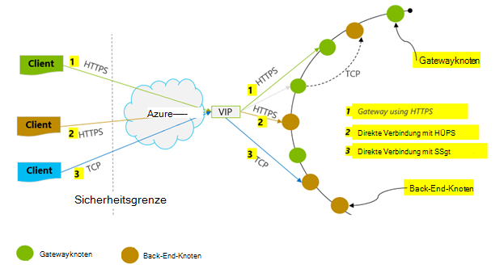

<properties 
    pageTitle="Tipps zum DocumentDB | Microsoft Azure" 
    description="Erfahren Sie Konfigurationsoptionen beim Client Azure DocumentDB Datenbank Leistung"
    keywords="Datenbank-Performance verbessern"
    services="documentdb" 
    authors="mimig1" 
    manager="jhubbard" 
    editor="" 
    documentationCenter=""/>

<tags 
    ms.service="documentdb" 
    ms.workload="data-services" 
    ms.tgt_pltfrm="na" 
    ms.devlang="na" 
    ms.topic="article" 
    ms.date="10/17/2016" 
    ms.author="mimig"/>

# Tipps für DocumentDB

Azure DocumentDB ist eine schnelle und flexible verteilte Datenbank, die nahtlos mit garantierter Latenz und der Durchsatz skaliert. Sie müssen keinen größeren Architektur oder komplexen Code zur Skalierung Ihrer Datenbank mit DocumentDB. Skalierung nach oben und unten wird einfach wie eine einzelne API-Aufruf oder [SDK-Methode aufrufen](documentdb-performance-levels.md#changing-performance-levels-using-the-net-sdk). Allerdings DocumentDB über Netzwerkaufrufe zugegriffen werden clientseitige Optimierungen können Sie zu Höchstleistungen

Wenn Sie Fragen "wie kann ich meine Datenbank-Performance verbessern können?" Berücksichtigen Sie die folgenden Optionen:

## Netzwerk

1. **Verbindungsrichtlinie: direkte Verbindung-Modus verwenden**
    
    Wie einer Clientverbindung zu Azure DocumentDB hat wichtige Implikationen Leistung insbesondere beobachteten clientseitige Latenz. Gibt zwei wichtige Konfigurationen für Client Verbindungsrichtlinie – Verbindung *Modus* und [ *Protokoll*](#connection-protocol)konfigurieren.  Die zwei verfügbaren Modi sind:

    1. Gateway-Modus (Standard)
    2. Direkten Modus

    DocumentDB einem dezentralen System DocumentDB Ressourcen wie auf zahlreichen Computern partitioniert und für hohe Verfügbarkeit wird jede Partition repliziert. Die logische Adresse Übersetzung wird in einer Routingtabelle gespeichert, die auch intern als eine Ressource verfügbar ist.

    Im Gateway ausführen DocumentDB Gateway-Rechner Arbeitsplans, wodurch Clientcode einfach und kompakt. Eine Clientanwendung sendet Anfragen DocumentDB Gateway Maschinen, logischen URI in der Anforderung an die physikalische Adresse des Back-End-Knoten zu übersetzen und Weiterleiten die Anforderung entsprechend.  Dagegen im Direktmodus müssen Clients Wartung regelmäßig aktualisieren eine diese Routingtabelle und direkt auf den Back-End-DocumentDB Knoten verbinden.

    Gateway-Modus wird auf allen Plattformen SDK und konfigurierte Standard ist.  Ausführen der Anwendung in einem Firmennetzwerk mit strengen Firewall ist Gateway Modus am besten verwendet den standard-HTTPS-Port und einen Endpunkt. Kompromiss zwischen Leistung ist jedoch, dass Gateway Modus zusätzliche Netzwerkhop betrifft, jedes Mal, wenn Daten gelesen oder in DocumentDB geschrieben.   Aus diesem Grund bietet Direktmodus bessere Leistung durch weniger Netzwerkhops.

2. **Verbindungsrichtlinie: das TCP-Protokoll**

    Beim Direktmodus nutzen, sind zwei Protokolloptionen zur Verfügung:

    - TCP
    - HTTPS

    DocumentDB bietet eine einfache und Rest Programmiermodell über HTTPS zu öffnen. Darüber hinaus bietet ein effizientes TCP-Protokoll auch RESTful in seiner Kommunikationsmodell und .NET Client SDK erhältlich. Direkte TCP und HTTPS verwenden Sie SSL für die erste Authentifizierung und Verschlüsselung Datenverkehr. Verwenden Sie für optimale Leistung das TCP-Protokoll, wenn möglich. 

    Bei TCP-Gateways im TCP-Port 443 ist Port DocumentDB und 10250 ist die MongoDB-API. Bei TCP in Direktmodus zusätzlich Gateway Ports müssen Sie den Port sicherstellen zwischen 10000 und 20000 ist offen, weil DocumentDB dynamische TCP-Ports verwendet. Wenn diese Ports nicht geöffnet und TCP verwenden, erhalten Sie einen Fehler 503 Dienst nicht verfügbar. 

    Konnektivität-Modus wird beim Erstellen der Instanz "documentclient" mit dem Parameter ConnectionPolicy konfiguriert. Bei Direktmodus kann das Protokoll auch im ConnectionPolicy-Parameter festgelegt werden.

        var serviceEndpoint = new Uri("https://contoso.documents.net");
        var authKey = new "your authKey from Azure Mngt Portal";
        DocumentClient client = new DocumentClient(serviceEndpoint, authKey, 
        new ConnectionPolicy
        {
            ConnectionMode = ConnectionMode.Direct,
            ConnectionProtocol = Protocol.Tcp
        });

    Da TCP Gateway Modus wird nur im Direktmodus unterstützt wird, wird immer das HTTPS-Protokoll mit dem Gateway kommunizieren verwendet und Protokoll-Wert in der ConnectionPolicy wird ignoriert.

    

3. **Rufen Sie OpenAsync zur Vermeidung von Wartezeiten bei der ersten Anforderung starten**

    Standardmäßig haben die erste Anforderung eine höhere Latenz, weil die Routingtabelle abrufen muss. Um diese Wartezeit beim Starten der ersten Anforderung zu vermeiden, sollten Sie OpenAsync() einmal während der Initialisierung wie folgt aufrufen.

        await client.OpenAsync();

4. **Zusammengestellte Clients in derselben Azure-Region Leistung**

    Wenn möglich, sollten Sie jede Anwendung DocumentDB im Bereich der DocumentDB Datenbank aufrufen. Ungefähre Vergleichszwecken Aufrufe von DocumentDB innerhalb derselben Region innerhalb von 1-2 ms abgeschlossen, aber die Wartezeit zwischen dem Westen und der Ostküste der USA > 50 ms. Diese Wartezeit kann wahrscheinlich von Anforderung zu Anforderung je Weg die Anforderung vom Client der Azure-Rechenzentrum Grenze bewegt. Die niedrigste Latenz erzielten sicherstellen, dass die aufrufende Anwendung in Azure derselben Region als bereitgestellte DocumentDB Endpunkt befindet. Eine Liste der verfügbaren Regionen finden Sie unter [Azure-Regionen](https://azure.microsoft.com/regions/#services).

    

5. **Erhöhen der Anzahl von Threads/Aufgaben**

    Da DocumentDB über das Netzwerk aufgerufen werden, müssen Sie den Grad der Parallelität Ihre Anfragen variieren, so dass die Clientanwendung wenig Wartezeit zwischen Anfragen aufwendet. Angenommen, Sie verwenden. NET [Task Parallel Library](https://msdn.microsoft.com//library/dd460717.aspx)in 100 s Aufgaben lesen und Schreiben in DocumentDB erstellen.

## SDK-Verwendung

1. **Installieren Sie das neueste SDK**

    DocumentDB-SDKs werden ständig weiterentwickelt, um die beste Leistung. Siehe die [DocumentDB SDK](documentdb-sdk-dotnet.md) zum Ermitteln des letzten SDK und verbessert. 

2. **Verwenden Sie einen Singleton DocumentDB Client für die Lebensdauer der Anwendung**
  
    Beachten Sie, dass jeweils "documentclient" threadsicher ist und effiziente verbindungsmanagement und Adresse Zwischenspeichern im Direktmodus durchführt. Zur effizienten verbindungsmanagement und bessere Leistung durch "documentclient" wird empfohlen, eine Instanz von "documentclient" pro Anwendungsdomäne während der Lebensdauer der Anwendung verwenden.

3. **Erhöhen von System.Net MaxConnections pro host**

    DocumentDB Anfragen über HTTPS-REST standardmäßig erfolgen und unterliegen der Standard-Verbindungslimit pro Hostname oder IP-Adresse. Sie müssen die MaxConnections höher (100-1000) festlegen, damit die Clientbibliothek mehrere Verbindungen zu DocumentDB nutzen kann. .NET SDK 1.8.0 und höher der Standardwert für [ServicePointManager.DefaultConnectionLimit](https://msdn.microsoft.com/library/system.net.servicepointmanager.defaultconnectionlimit.aspx) ist 50, und Sie können [Documents.Client.ConnectionPolicy.MaxConnectionLimit](https://msdn.microsoft.com/en-us/library/azure/microsoft.azure.documents.client.connectionpolicy.maxconnectionlimit.aspx) auf einen höheren Wert festlegen, ändern Sie den Wert.  

4. **Parallele Abfragen für partitionierte Sammlungen optimieren**

     DocumentDB .NET SDK, Version 1.9.0 und höher unterstützt parallele Abfragen, partitionierte Auflistung parallele Abfragen ermöglichen (siehe [Arbeiten mit SDKs](documentdb-partition-data.md#working-with-the-sdks) und die zugehörigen [Codebeispiele](https://github.com/Azure/azure-documentdb-dotnet/blob/master/samples/code-samples/Queries/Program.cs) mehr). Parallele Abfragen sollen über serielle gegenüber Abfragewartezeit und Durchsatz verbessern. Parallele Abfragen bieten zwei Parameter Benutzer optimieren können, um maßgeschneiderte Bedürfnisse a MaxDegreeOfParallelism: die maximale Anzahl von Partitionen steuern als Parallel und (b) MaxBufferedItemCount abgefragt werden kann: die Anzahl der vorab abgerufenen Ergebnisse steuern. 
    
    a ***Tuning MaxDegreeOfParallelism\: *** 
    parallele Abfrage funktioniert durch mehrere Partitionen gleichzeitig Abfragen. Daten aus einer einzelnen partitionierten sammeln werden jedoch seriell bei der Abfrage abgerufen. Hat der MaxDegreeOfParallelism auf die Anzahl der Partitionen festlegen die maximale Wahrscheinlichkeit einer die meisten leistungsfähigen Abfrage alle System-Bedingung gleich bleiben. Wenn Sie die Anzahl der Partitionen nicht kennen, legen die MaxDegreeOfParallelism einen hohen Wert und wählen das System mindestens (Anzahl der Partitionen bereitgestellten Benutzereingaben) als die MaxDegreeOfParallelism. 
    
    Es ist wichtig zu beachten, dass parallele Abfragen optimale Vorteile führen, wenn die Daten gleichmäßig auf alle Partitionen in Bezug auf die Abfrage verteilt werden. Partitionierte Auflistung so, dass alle oder die meisten der von einer Abfrage zurückgegebenen Daten sich auf einige Partitionen (eine Partition im schlimmsten Fall konzentriert) die Leistung der Abfrage würde diese Partitionen Engpässe partitionierten. 
    
    b ***Tuning MaxBufferedItemCount\: *** 
    parallele Abfrage sollen Ergebnisse pre-fetch-während der Verarbeitung der aktuellen Batch der Ergebnisse durch den Client. Das Vorauslesen hilft Wartezeit Verbesserung der Abfrage. MaxBufferedItemCount ist der Parameter der vorab abgerufenen Ergebnisse beschränken. Festlegen MaxBufferedItemCount an die erwartete Ergebnisse (oder mehr) ermöglicht die Abfrage von Vorauslesen maximale profitieren. 
    
    Beachten Sie, dass Vorauslesen funktioniert unabhängig von der MaxDegreeOfParallelism ist ein Puffer für die Daten aus allen Partitionen.  

5. **Schalten Sie Server-Side GC**
    
    In einigen Fällen kann die Häufigkeit der Garbagecollection helfen. In .NET [GcServer](https://msdn.microsoft.com/library/ms229357.aspx) auf True festgelegt.

6. **Backoff Intervallen RetryAfter implementieren**
 
    Beim Testen der Leistung sollten Sie laden erhöhen, bis eine kleine Rate der Anfragen erhalten gedrosselt. Gedrosselt, sollte die Clientanwendung Backoff Drosselklappe für den Server festgelegten Wiederholungsintervall. Einhaltung der Backoff stellt sicher, dass Sie minimale Wartezeiten zwischen Wiederholungsversuchen verbringen. Wiederholen-Unterstützung in Version 1.8.0 und höher ist der DocumentDB [.NET](documentdb-sdk-dotnet.md) und [Java](documentdb-sdk-java.md)und Version 1.9.0 und höher [Node.js](documentdb-sdk-node.md) und [Python](documentdb-sdk-python.md). Weitere Informationen finden Sie unter [reservierte Durchsatz über begrenzt](documentdb-request-units.md#exceeding-reserved-throughput-limits) und [RetryAfter](https://msdn.microsoft.com/library/microsoft.azure.documents.documentclientexception.retryafter.aspx).

7. **Client-Workload skalieren**

    Wenn Sie auf einen hohen Durchsatz testen (> 50.000 RU-s), die Client-Anwendung kann der Engpass durch Computer Cappings auf CPU- oder Nutzung. Dieser Punkt erreicht ist, können Sie weiterhin das DocumentDB-Konto übertragen von Clientanwendungen auf mehrere Server skalieren.

8. **Cache Dokument URIs niedriger Latenz beim Lesen**

    Cache-Dokument URIs möglichst optimale Leistung zu lesen.

9. **Optimieren Sie die Seitengröße für Abfragen/lesen-Feeds für eine bessere Leistung**

    Beim Ausführen einer lesen Dokumente mit feed Funktionen (z.B. ReadDocumentFeedAsync) oder bei einer DocumentDB SQL-Abfrage werden die Ergebnisse segmentierten Weise zurückgegeben, wenn das Ergebnis zu groß ist. Standardmäßig Ergebnisse in Blöcken von 100 Artikeln oder 1 MB, abhängig von dem Limit wird zuerst erreicht. 

    Reduzierung der können Netzwerkroundtrips erforderlich, alle entsprechenden Ergebnisse abzurufen, Sie mit bis zu 1000 X-ms-Max--Elementanzahl Anforderungsheader Seitengröße. Nur wenige Ergebnisse anzeigen müssen z. B. kehrt die-API-Schnittstelle oder Anwendung nur 10 führt nacheinander, können auch die Größe 10 Durchsatz belegten Lese- und Abfragen zu verringern.

    Sie können auch mit verfügbaren DocumentDB SDKs Seitengröße festlegen.  Zum Beispiel:
    
        IQueryable<dynamic> authorResults = client.CreateDocumentQuery(documentCollection.SelfLink, "SELECT p.Author FROM Pages p WHERE p.Title = 'About Seattle'", new FeedOptions { MaxItemCount = 1000 });

10. **Erhöhen der Anzahl von Threads/Aufgaben**

    [Erhöhen der Anzahl von Threads/Aufgaben](#increase-threads) im Netzwerkabschnitt sehen.

## Indizierung von Richtlinien

1. **Verwenden Sie verzögerte Indizierung für maximale Zeit Einnahme schneller**

    DocumentDB kann an – auf der Ebene der – eine Indizierung Richtlinie wählen Sie die Dokumente in einer Auflistung automatisch indiziert werden können.  Darüber hinaus können Sie auch zwischen (konsistent) synchrone und asynchrone (Lazy) Index Updates. Standardmäßig ist der Index synchron auf jede einfügen, ersetzen oder Löschen eines Dokuments, das die Auflistung aktualisiert. Modus können synchron Abfragen der [konsistenzebene](documentdb-consistency-levels.md) des Dokuments lautet unverzüglich für den Index um "" berücksichtigt.
    
    Verzögerte Indizierung gelten für Szenarios, in denen Daten in Bursts geschrieben werden, und Sie den Arbeitsaufwand zum Indizieren von Inhalten über einen längeren Zeitraum tilgen möchten. Verzögerte Indizierung kann bereitgestellten Durchsatz nutzen und Schreibanfragen Spitzenzeiten mit minimaler Latenz. Es ist wichtig, jedoch verzögerte Indizierung aktiviert, Abfrageergebnisse schließlich konsistent, unabhängig von der Konsistenz des DocumentDB-Kontos konfiguriert werden.

    Konsistente Indizierung-Modus (IndexingPolicy.IndexingMode ist konsistent) verursacht daher die höchste Anforderung Einheit Gebühr schreiben beim Lazy-Modus (IndexingPolicy.IndexingMode wird Lazy) und keine Indizierung Indizieren (IndexingPolicy.Automatic auf False festgelegt ist) keine Indizierung Kosten bei Schreibzugriff haben.

2. **Schließen Sie nicht verwendeter Pfade für schnellere Schreibvorgänge Indizierung aus**

    Indizierung des DocumentDB-Richtlinie können Sie angeben, welche Dokumentenpfade ein- oder Ausschließen von Indizierung durch Nutzung der Indizierung Pfade (IndexingPolicy.IncludedPaths und IndexingPolicy.ExcludedPaths). Indizierung Pfade können bietet bessere Schreib-Performance und niedrigeren Index Speicher für Szenarien mit dem Abfragemuster vorher bekannt sind wie Indizierung Kosten direkt an die eindeutige Pfade indiziert korreliert werden.  Beispielsweise veranschaulicht der folgende Code einen ganzen Abschnitt der Dokumente (auch bekannt als ausschließen eine Teilstruktur) Indizierung mit dem "*" Platzhalter.

        var collection = new DocumentCollection { Id = "excludedPathCollection" };
        collection.IndexingPolicy.IncludedPaths.Add(new IncludedPath { Path = "/*" });
        collection.IndexingPolicy.ExcludedPaths.Add(new ExcludedPath { Path = "/nonIndexedContent/*");
        collection = await client.CreateDocumentCollectionAsync(UriFactory.CreateDatabaseUri("db"), excluded);

    Weitere Informationen finden Sie unter [DocumentDB Indexierungsrichtlinien](documentdb-indexing-policies.md).

## Durchsatz

1. **Messen und optimieren für niedrigere Anforderung Einheiten pro Sekunde Verwendung**

    DocumentDB bietet einen umfangreichen Satz von Datenbankoperationen, einschließlich relationale und die hierarchische Abfragen mit UDFs, gespeicherten Prozeduren und Triggern – alle Betriebssystem auf der Datenbank-Auflistung. Die Kosten dieser Operationen je CPU, e/a und Speicher für diesen Vorgang erforderlich. Anstatt denken und Verwalten von Hardware-Ressourcen können Sie einer Anforderung Einheit (RU) als ein Maß für die verschiedenen Datenbankoperationen und eine Anwendung Anforderung erforderlichen Ressourcen vorstellen.

    [Anfordern von Einheiten](documentdb-request-units.md) werden für jedes Konto basierend auf der Anzahl von Leistungseinheiten Kauf bereitgestellt. Anforderung Einheitenverbrauch wird als ein Wert pro Sekunde ausgewertet. Clientanwendungen, die für ihr Konto beschränkt ist, bis die Rate reservierte unterhalb des Kontos fällt die bereitgestellte Einheit Anforderungsrate überschreiten. Wenn die Anwendung eine höhere Durchsatz erfordert, können Sie zusätzliche Kapazitätseinheiten erwerben.

    Die Komplexität der Abfrage beeinträchtigt, wie viele Einheiten mit Anforderung für einen Arbeitsgang verbraucht werden. Der Anzahl von Prädikaten, Art der Prädikate, Anzahl der UDF und die Größe der Quelle Daten alle beeinflussen Kosten Abfrage.

    Aufwand einer messen (erstellen, aktualisieren oder löschen) X ms Anforderung kostenlose Header überprüfen (oder die entsprechende RequestCharge in ResourceResponse<T> oder FeedResponse<T> im .NET SDK) messen die Anzahl der anforderungseinheiten von diesen Operationen verbraucht.

        // Measure the performance (request units) of writes
        ResourceResponse<Document> response = await client.CreateDocumentAsync(collectionSelfLink, myDocument);
        Console.WriteLine("Insert of document consumed {0} request units", response.RequestCharge);
        // Measure the performance (request units) of queries
        IDocumentQuery<dynamic> queryable = client.CreateDocumentQuery(collectionSelfLink, queryString).AsDocumentQuery();
        while (queryable.HasMoreResults)
             {
                  FeedResponse<dynamic> queryResponse = await queryable.ExecuteNextAsync<dynamic>();
                  Console.WriteLine("Query batch consumed {0} request units", queryResponse.RequestCharge);
             }
        
    Die Anforderung dieser Header zurückgegeben ist Teil der bereitgestellten Durchsatz (d. h. 2000 RUs / Sekunde). Z. B. wenn die obige Abfrage 1000 1 KB Dokumente zurückgibt, sein die Kosten des Vorgangs 1000. So berücksichtigt der Server nur zwei Anfragen innerhalb einer Sekunde vor Beginn der Drosselung nachfolgende Anforderungen. Weitere Informationen finden Sie unter [Anfrage Einheiten](documentdb-request-units.md) und [Anforderung einheitenumrechner](https://www.documentdb.com/capacityplanner).

2. **Handle Rate eingeschränkt/Anforderungsrate Groß**

    Wenn ein Client versucht, reservierten Durchsatz für ein Konto überschreiten, gibt es keine Leistungseinbußen auf dem Server und keine Verwendung der Durchsatz über die reservierten Ebene. Der Server die Anforderung mit RequestRateTooLarge (HTTP-Statuscode 429) präventiv und zeigt die Zeitspanne in Millisekunden, die der Benutzer warten muss, bevor die Anforderung Problem X-ms-Retry-nach-ms-Header zurückgegeben.
 
        HTTP Status 429,
        Status Line: RequestRateTooLarge
        x-ms-retry-after-ms :100

    SDKs implizit alle Abfangen dieser Antwort berücksichtigen den Server angegeben Retry-after-Header, und wiederholen Sie die Anforderung. Sofern Ihr Konto von mehreren Clients gleichzeitig zugegriffen wird, wird der nächste Versuch erfolgreich ausgeführt.

    Haben mehrere Clients kumulativ konsistent über die Anforderungsrate kann die standardmäßige Wiederholungsanzahl derzeit 9 intern festgelegt vom Client nicht ausreichend. In diesem Fall löst der Client eine DocumentClientException mit dem Statuscode 429 Anwendung. Die Wiederholungsanzahl Standard kann durch Festlegen der RetryOptions für die ConnectionPolicy-Instanz geändert werden. Standardmäßig ist der DocumentClientException mit dem Statuscode 429 nach kumulierte Wartezeit von 30 Sekunden zurückgegeben, wenn die Anforderung weiterhin über die Anforderungsrate. In diesem Fall auch die aktuelle Wiederholungsanzahl kleiner als die maximale Wiederholungsanzahl wird, werden standardmäßige 9 oder einen benutzerdefinierten Wert.

    Während das automatisierten Wiederholverhalten Verbesserung der Stabilität und Nutzbarkeit für die meisten hilft, könnte Quote stammen, wenn Performance-Benchmarks, besonders wenn Latenz messen.  Wartezeit für Client beobachtet wird Spitze, wenn Experiments Drosselklappe die Server und der Client SDK automatisch wiederholen. Zur Vermeidung von Wartezeiten Spitzen bei Leistung, messen Sie jede Operation zurückgegebene kostenlos und sicherzustellen Sie, dass Anfragen unterhalb des reservierten Anforderung ausgeführt werden. Weitere Informationen finden Sie unter [Einheiten anfordern](documentdb-request-units.md).
   
3. **Design für kleinere Dokumente für höheren Durchsatz**

    Die Anforderung Ihres (d. h. Verarbeitungskosten) einer bestimmten Operation korreliert direkt auf die Größe des Dokuments. Operationen mit großen Dokumenten teurer als Operations bei kleinen Dokumenten.

## Konsistenzebenen

1. **Schwächere Konsistenzebenen besser lesen Latenzen verwenden**

    Ein weiterer wichtiger Faktor zu berücksichtigen, und optimieren die Leistung der Anwendung DocumentDB Konsistenz ist. Die Wahl der konsistenzebene hat Leistungseinbußen für Lese- und Schreibvorgänge. Konfigurieren die Standardstufe Konsistenz auf das Konto und ausgewählte konsistenzebene dann für alle Sammlungen (aller Datenbanken) innerhalb des DocumentDB-Kontos. Bei schreiben wird die Auswirkung der Konsistenz ändern als Anforderung Wartezeit beobachtet. Stärkere Kohärenz Ebenen verwendet werden, steigt die Wartezeiten. Auf der anderen Seite wird der Einfluss des Konsistenz auf Lesevorgänge in Durchsatz beobachtet. Schwächere höhere erlauben Konsistenz lesen Durchsatz vom Client realisiert werden.

    Standardmäßig verwendet alle Lese- und Abfragen in benutzerdefinierte Ressourcen die Konsistenz Standardstufe für das Konto angegeben. Sie können jedoch die Konsistenz einer Anforderung bestimmte lesen-Abfrage senken durch x ms Konsistenz-auf-Anfrage-Header angeben. Weitere Informationen finden Sie unter [konsistenzebenen in DocumentDB](documentdb-consistency-levels.md).

## Nächste Schritte

Ein Beispiel-Anwendung DocumentDB hoher Performance-Szenarien auf einigen Clientcomputern ausgewertet finden Sie unter [Performance und Skalierung mit Azure DocumentDB](documentdb-performance-testing.md).

Siehe auch weitere Informationen zum Entwerfen der Anwendung für hohe Performance und [Partitionierung und Skalierung in Azure DocumentDB](documentdb-partition-data.md).
