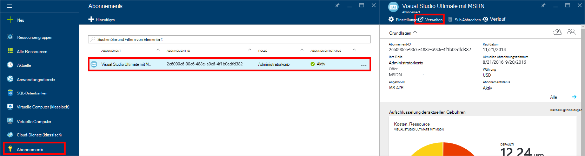
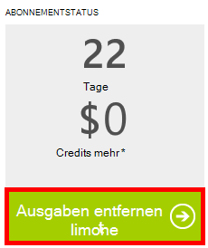

<properties
    pageTitle="Problembehandlung bei der DocumentDB Portal | Microsoft Azure"
    description="Finden Sie heraus, Probleme im DocumentDB Azure-Portal." 
    services="documentdb"
    documentationCenter=""
    authors="mimig1"
    manager="jhubbard"
    editor="monicar"/>

<tags
    ms.service="documentdb"
    ms.workload="data-services"
    ms.tgt_pltfrm="na"
    ms.devlang="na"
    ms.topic="article"
    ms.date="08/29/2016"
    ms.author="mimig"/>

# Azure DocumentDB Portal Tipps zur Problembehandlung

Dieser Artikel beschreibt die DocumentDB Problemen im Azure-Portal. 

## Ressourcen fehlen

**Symptom**: Datenbanken oder Sammlungen fehlen Portal Blades.

**Lösung**: geringere Anwendungsverwendung maximalen Durchsatz Kontingent für die Auflistung ausgeführt werden. 

**Erklärung**: das Portal ist eine Anwendung wie mit jeder anderen Aufrufe an die DocumentDB-Datenbank und die Auflistung. Ihre Anfrage derzeit durch Aufrufe in einer separaten Anwendung gedrosselt werden kann das Portal auch eingeschränkt verursacht Ressourcen nicht im Portal angezeigt. Zur Behebung des Problems beheben Sie die Ursache der hohen Durchsatz-Nutzung und aktualisieren Sie das Portal Blade. Informationen zu messen und niedrigere Durchsatz Verwendung finden im Abschnitt [Durchsatz](documentdb-performance-tips.md#throughput) Artikel [Tipps](documentdb-performance-tips.md) .
 
## Seiten oder Blades wird nicht geladen

**Symptom**: Seiten und Blades im Portal nicht angezeigt.

**Lösung**: geringere Anwendungsverwendung maximalen Durchsatz Kontingent für die Auflistung ausgeführt werden. 

**Erklärung**: das Portal ist eine Anwendung wie mit jeder anderen Aufrufe an die DocumentDB-Datenbank und die Auflistung. Ihre Anfrage derzeit durch Aufrufe in einer separaten Anwendung gedrosselt werden kann das Portal auch eingeschränkt verursacht Ressourcen nicht im Portal angezeigt. Zur Behebung des Problems beheben Sie die Ursache der hohen Durchsatz-Nutzung und aktualisieren Sie das Portal Blade. Informationen zu messen und niedrigere Durchsatz Verwendung finden im Abschnitt [Durchsatz](documentdb-performance-tips.md#throughput) Artikel [Tipps](documentdb-performance-tips.md) .

## Hinzufügen der Auflistung aktiviert

**Symptom**: auf die Datenbank, die **Sammlung hinzufügen** -Schaltfläche deaktiviert.

**Erläuterung**: ist der Azure-Abonnement nutzen Credits zugeordnet wie freie Kredite von MSDN-Abonnement angeboten und alle Ihre Punkte für den Monat verwendet haben Sie können jede Auflistung in DocumentDB erstellen.

**Lösung**: das Ausgabenlimit von Ihrem Konto entfernt.

1. In Azure-Portal in der Indexleiste auf **Abonnements**, klicken Sie auf das Abonnement der Datenbank DocumentDB und dann Blatt **Abonnement** auf **Verwalten**. 
    

2. Im neuen Browserfenster sehen keine Credits mehr vorhanden sind. Klicken Sie **Ausgabenlimit entfernen** entfernt die Ausgaben für den aktuellen Abrechnungszeitraum oder unendlich. Beenden Sie den Assistenten zum Hinzufügen oder Kreditkarteninformationen zu bestätigen. 
    

 
## Abfrage-Explorer mit Fehlern abgeschlossen

[Problembehandlung bei Abfrage-Explorer](documentdb-query-collections-query-explorer.md#troubleshoot)anzeigen

## Keine Daten überwachen Kacheln

Siehe [Fehlerbehebung monitoring Kacheln](documentdb-monitor-accounts.md#troubleshooting).

## Keine Dokumente im Document Explorer zurückgegeben

[Problembehandlung bei Document Explorer](documentdb-view-json-document-explorer.md#troubleshoot)anzeigen

## Nächste Schritte

Wenn weiterhin Probleme im Portal e-Mail- [askdocdb@microsoft.com](mailto:askdocdb@microsoft.com) für Hilfe oder Datei eine Kundendienstanfrage im Portal durch **Durchsuchen**, **Hilfe und Support**klicken und **Supportanfrage erstellen**.
