<properties
    pageTitle="Power BI-Lernprogramm DocumentDB Connectors | Microsoft Azure"
    description="Verwenden Sie dieses Lernprogramm Power BI JSON importieren, aufschlussreiche Berichte erstellen und Daten mithilfe der DocumentDB und Power BI-Anschluss."
    keywords="Daten, Bi Netzanschluss, Strom Bi-Lernprogramm"
    services="documentdb"
    authors="h0n"
    manager="jhubbard"
    editor="mimig"
    documentationCenter=""/>

<tags
    ms.service="documentdb"
    ms.workload="data-services"
    ms.tgt_pltfrm="na"
    ms.devlang="na"
    ms.topic="article"
    ms.date="09/22/2016"
    ms.author="hawong"/>

# Power BI-Lernprogramm für DocumentDB: Daten mithilfe des Power BI-Connectors

[PowerBI.com](https://powerbi.microsoft.com/) ist ein Onlinedienst, wo Sie erstellen und Freigeben von Dashboards und Berichte mit Daten, die wichtig für Sie und Ihr Unternehmen.  Power BI Desktop ist ein dediziertes Bericht authoring-Tool, mit dem Abrufen von Daten aus verschiedenen Datenquellen zusammenführen und die Daten transformieren, Erstellen leistungsfähiger Berichte und Visualisierung und Power BI Berichte veröffentlicht.  Mit der neuesten Version von Power BI Desktop können Sie nun Ihr Konto DocumentDB über den DocumentDB-Anschluss für Power BI verbinden.   

In diesem Lernprogramm Power BI wir schrittweise eine DocumentDB Konto in Power BI Desktop, navigieren zu einer Sammlung, die Daten mithilfe des Navigators extrahiert werden soll, Transformieren JSON-Daten in Tabellenform mit Power BI Desktop Abfrage-Editor erstellen und Veröffentlichen eines Berichts zum PowerBI.com.

Nach diesem Power BI Lernprogramm werden Sie folgenden Fragen beantworten:  

-   Wie kann ich Berichte mit Daten aus DocumentDB erstellen mit Power BI Desktop?
-   Wie kann ich ein Konto DocumentDB Power BI Desktop verbinden?
-   Wie können Daten aus einer Sammlung in Power BI Desktop werden abgerufen?
-   Wie können geschachtelte JSON-Daten in Power BI Desktop verwandeln?
-   Wie kann ich freigeben Meine Berichte in PowerBI.com und veröffentlichen?

## Erforderliche Komponenten

Sicherzustellen Sie bevor Sie Anweisungen in diesem Lernprogramm Power BI, dass Sie Folgendes:

- [Die neueste Version von Power BI Desktop](https://powerbi.microsoft.com/desktop).
- Zugriff auf unsere Demokonto oder Daten in Ihrem Konto Azure DocumentDB.
    - Demokonto wird mit Vulkan Daten in diesem Lernprogramm aufgefüllt. Diese Demo keine SLAs gebunden und dient nur zur Veranschaulichung.  Wir behalten sich das Recht zum Ändern dieser Demo Konto einschließlich aber nicht beschränkt auf das Konto beenden, ändern den Schlüssel, Zugriff, ändern und Löschen von Daten, jederzeit ohne Vorankündigung oder Grund
        - URL: https://analytics.documents.azure.com
        - Schreibgeschützte Schlüssel: MSr6kt7Gn0YRQbjd6RbTnTt7VHc5ohaAFu7osF0HdyQmfR + YhwCH2D2jcczVIR1LNK3nMPNBD31losN7lQ/FKW-==
    - Oder erstellen Sie Ihr eigenes Konto [DocumentDB Datenbankkonto mit Azure-Portal erstellen](https://azure.microsoft.com/documentation/articles/documentdb-create-account/). Zum Beispiel Vulkan abrufen Daten ähnlich wie in diesem Lernprogramm verwendeten (aber kein GeoJSON Blöcke) [NOAA Website](https://www.ngdc.noaa.gov/nndc/struts/form?t=102557&s=5&d=5) sehen Sie und importieren Sie die Daten mithilfe des [Datenmigrations-Tools DocumentDB](https://azure.microsoft.com/documentation/articles/documentdb-import-data/).

Zum Freigeben von Berichten in PowerBI.com müssen Sie ein Konto in PowerBI.com.  Erfahren Sie mehr über Power BI frei und Power BI Pro finden Sie auf [https://powerbi.microsoft.com/pricing](https://powerbi.microsoft.com/pricing).

## Fangen wir an
Stellen Sie in diesem Lernprogramm sind Geologe Studium Vulkane weltweit.  Vulkan-Daten in DocumentDB-Konto gespeichert und JSON-Dokumente wie folgt aussehen.

    {
        "Volcano Name": "Rainier",
        "Country": "United States",
        "Region": "US-Washington",
        "Location": {
            "type": "Point",
            "coordinates": [
            -121.758,
            46.87
            ]
        },
        "Elevation": 4392,
        "Type": "Stratovolcano",
        "Status": "Dendrochronology",
        "Last Known Eruption": "Last known eruption from 1800-1899, inclusive"
    }

Volcano Daten vom DocumentDB-Konto abzurufen und Daten in einem interaktiven Power BI-Bericht wie werden soll.

Möchten Sie es versuchen? Fangen wir an.

1. Power BI Desktop auf Ihrer Arbeitsstation ausführen.
2. Wenn Power BI Desktop gestartet wird, wird *eine Willkommensseite* angezeigt.

    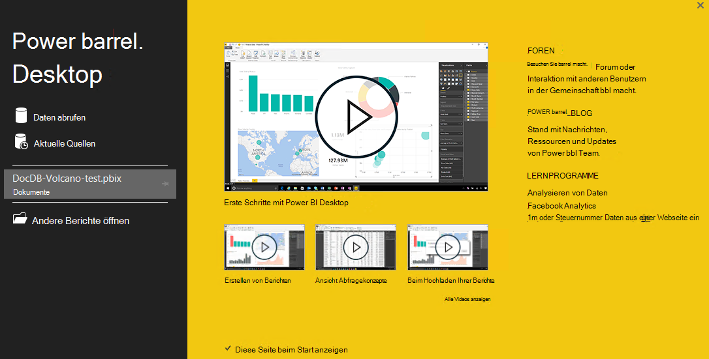

3. Sie können **Daten**, siehe **Letzte Quellen**oder **Andere Berichte öffnen** *direkt aus* .  Klicken Sie auf das X oben rechts um das Dialogfeld zu schließen. **Die Berichtsansicht Power BI Desktop** wird angezeigt.

    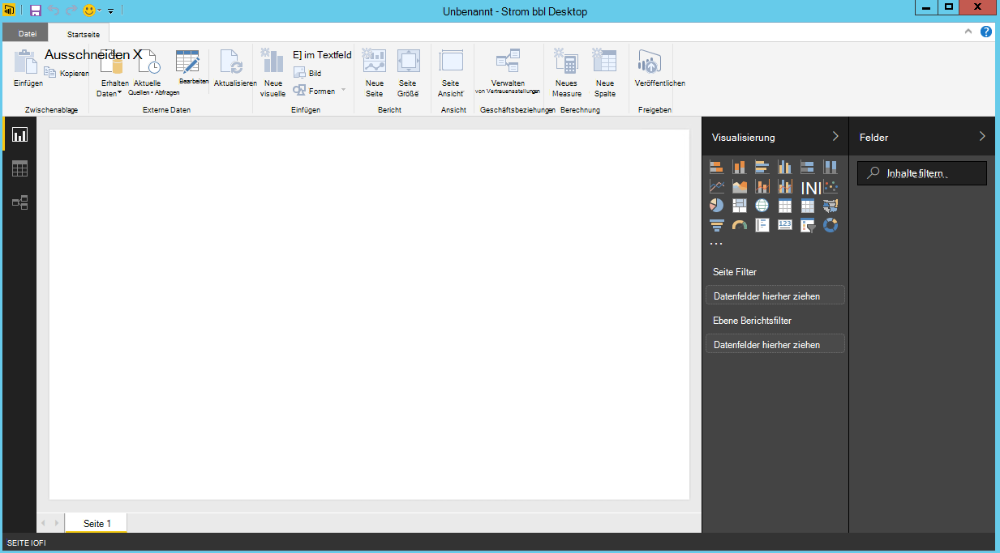

4. Wählen Sie des Menübands **Home aus** und dann auf **Daten importieren**.  **Daten importieren** wird angezeigt.

5. Klicken Sie auf **Azure**wählen Sie **Microsoft Azure DocumentDB (Beta)**und klicken Sie auf **Verbinden**.  **Microsoft Azure DocumentDB verbinden** wird angezeigt.

    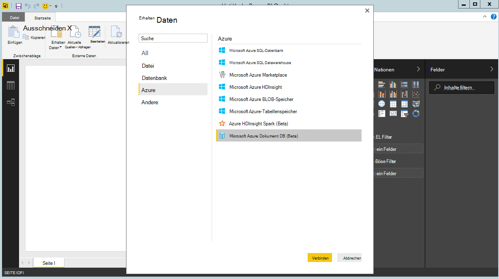

6. Geben **Sie die Daten wie folgt abrufen möchten**DocumentDB Konto Endpunkt-URL. Abrufen der URL im Feld URI Blade- **[Schlüssel](documentdb-manage-account.md#keys)** Azure-Portal oder Demokonto verwenden, in dem die URL ist `https://analytics.documents.azure.com`. 

    Freilassen Sie Datenbankname, Sammlungsname und SQL-Anweisung wie diese Felder optional sind.  Stattdessen verwenden wir den Navigator der Datenbank sowie Auflistung zu ermitteln, woher die Daten stammen.

    

7. Wenn Sie an diesen Endpunkt zum ersten Mal verbinden, werden Sie für den kontoschlüssel aufgefordert.  Rufen Sie den Schlüssel aus der **Primärschlüssel** in der **[Schreibgeschützte Schlüssel](documentdb-manage-account.md#keys)** Blade-Azure-Portal oder können Demokonto der Schlüssel ist `RcEBrRI2xVnlWheejXncHId6QRcKdCGQSW6uSUEgroYBWVnujW3YWvgiG2ePZ0P0TppsrMgscoxsO7cf6mOpcA==`. Geben Sie die Konto-Taste und klicken Sie auf **Verbinden**.

    Wir empfehlen die Verwendung schreibgeschützter Schlüssel beim Erstellen von Berichten.  Dies verhindert unnötige Belastung des Hauptschlüssels potenziellen Sicherheitsrisiken. Schreibgeschützte Schlüssel steht aus dem [Schlüssel](documentdb-manage-account.md#keys) Blade Azure-Portal oder über Demo-Kontoinformationen verwenden.

    

8. Wenn das Konto erfolgreich verbunden ist, wird der **Navigator** angezeigt.  Der **Navigator** zeigt eine Liste der Datenbanken unter dem Konto.
9. Klicken Sie auf und Erweitern der Datenbank kommen die Daten für den Bericht aus, wenn Demokonto select **Volcanodb**verwenden.   

10. Wählen Sie jetzt eine Auflistung, der die Daten abruft. Wenn Sie das Demokonto verwenden, wählen Sie **volcano1**.

    Das Vorschaufenster zeigt eine Artikelliste **Datensatz** .  Ein Dokument wird als **einen Datensatztyp in Power BI** dargestellt. Ebenso ist ein geschachtelter JSON-Block innerhalb eines Dokuments einen **Datensatz**.

    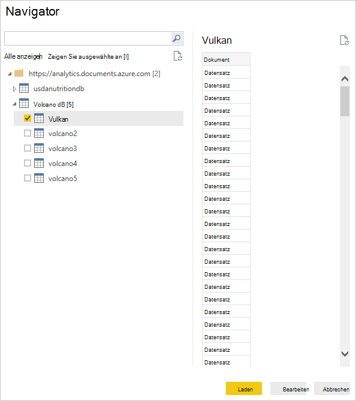

11. Klicken Sie auf **Bearbeiten** , um den Abfrage-Editor zu starten, so dass wir die Daten transformieren können.

## Reduzieren und Transformieren von JSON-Dokumente
1. Im Abfrage-Editor von Power BI sollte eine Spalte **Dokument** im mittleren Bereich angezeigt werden.
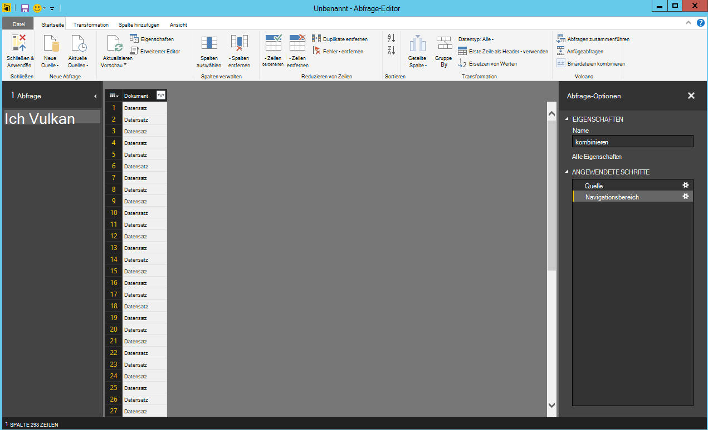

2. Klicken Sie auf den Expander auf der rechten Seite der Spaltenüberschrift **Dokument** .  Kontextmenü mit einer Liste von Feldern wird angezeigt.  Wählen Sie die Felder für den Bericht beispielsweise Volcano Name, Land, Region, Ort, Höhe, Typ, Status und letzte wissen Ausbruch und klicken Sie dann auf **OK**.

    

3. Ausgewählte wird mittleren Bereich eine Vorschau des Ergebnisses angezeigt.

    

4. In unserem Beispiel ist die Eigenschaft einen GeoJSON-Block in einem Dokument.  Wie Sie sehen, wird Standort als **einen Datensatztyp in Power BI Desktop** dargestellt.  
5. Klicken Sie auf Expander auf der rechten Seite der Spaltenüberschrift Ort.  Typ und Koordinaten im Kontextmenü wird angezeigt.  Wir wählen das Feld Koordinaten und klicken Sie auf **OK**.

    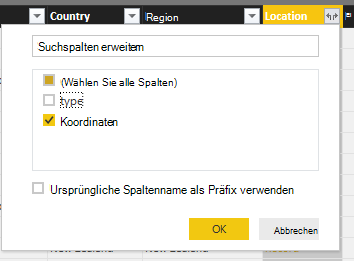

6. Mittleren Bereich zeigt nun eine Spalte Koordinaten **Listentyp** .  Siehe am Anfang des Lernprogramms werden die GeoJSON in diesem Lernprogramm der Punkt mit breiten- und Längengrad Werte im Array Koordinaten.

    Koordinaten [0]-Element repräsentiert Längengrad Koordinaten [1] Latitude.
    

7. Zum Reduzieren des Koordinaten Arrays erstellen wir eine **Benutzerdefinierte Spalte** LatLong.  Wählen Sie des Menübands **Spalte hinzufügen aus** , und klicken Sie auf **Benutzerdefinierte Spalte hinzufügen**.  **Benutzerdefinierte Spalte hinzufügen** wird angezeigt.

8. Geben Sie einen Namen für die neue Spalte z.B. LatLong.

9. Geben Sie dann die benutzerdefinierte Formel für die neue Spalte.  In unserem Beispiel verketten wir die Breiten- und Längenkoordinaten Werte durch ein Komma getrennt werden, wie unter Verwendung der folgenden Formel dargestellt: `Text.From([Document.Location.coordinates]{1})&","&Text.From([Document.Location.coordinates]{0})`. Klicken Sie auf **OK**.

    Weitere Informationen auf Daten Analyse Ausdrücke DAX DAX Funktionen finden Sie [Grundlegende DAX in Power BI Desktop](https://support.powerbi.com/knowledgebase/articles/554619-dax-basics-in-power-bi-desktop).

    

10. Mittleren Bereich wird nun die neue LatLong-Spalte mit durch ein Komma getrennte Werte für Breiten- und Längengrad gefüllt angezeigt.

    

    Wenn Sie eine in der neuen Spalte Fehlermeldung stellen Sie sicher, dass die angewendete Schritte unter Abfrageeinstellungen in der folgenden Abbildung entsprechen:

    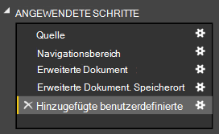

    Wenn Ihr sind löschen Sie zusätzliche Schritte und fügen Sie die benutzerdefinierte Spalte erneut. 

11. Wir haben jetzt abgeschlossen, Zusammenfassen von Daten in Tabellenform.  Sie nutzen alle Funktionen im Abfrage-Editor Form und Transformation von Daten in DocumentDB.  Wenn Sie das Beispiel verwenden, ändern Sie den Datentyp Erhöhung auf **ganze Zahl** Ändern des **Datentyps** auf dem Menüband **Home** .

    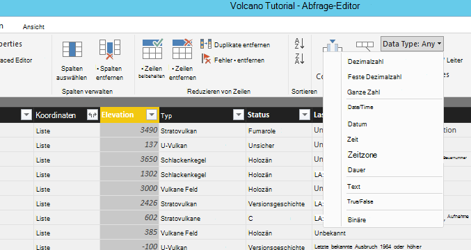

12. Klicken Sie auf **Schließen und übernehmen** das Datenmodell zu speichern.

    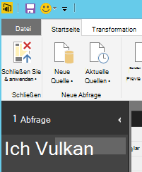

## Berichte erstellen
Power BI Desktop Ansicht ist Sie können Berichte zu Daten erstellen.  Berichte können durch Ziehen und Ablegen von Feldern in **den Berichtsbereich** .

Sie sollten in der Berichtsansicht finden:

 1. Im Bereich **Felder** Dies ist eine Liste von Datenmodellen mit Feldern finden Sie Sie für Berichte können.

 2. Bereich **Visualisierung** . Ein Bericht kann eine einzelne oder mehrere Visualisierung enthalten.  Wählen Sie Ihre Bedürfnisse im Bereich **Visualisierung** visual Typen aus

 3. **Der Berichtsbereich** Dies ist, wo Sie die visuelle Struktur für den Bericht erstellen.

 4. Die Seite **Bericht** . Sie können mehrere Berichtsseiten in Power BI Desktop hinzufügen.

Im folgenden wird die grundlegenden Schritte zum Erstellen eines einfachen interaktiven Karte Berichts anzeigen.

1. Für unser Beispiel erstellen wir mit Position der einzelnen Vulkan Kartenansicht.  Klicken Sie im Bereich **Visualisierung** auf die Karte visual wie in der Abbildung oben hervorgehoben.  Den **Bericht** Leinwand gemalten visual Zuordnungstyp sollte angezeigt werden.  **Visualisierungsbereich** sollte auch eine Reihe von Eigenschaften für den visuellen Zuordnungstyp anzeigen.

2. Jetzt Drag & drop Feld LatLong im Bereich **Felder** auf **die Eigenschaft im Bereich **Visualisierung** ** .
3. Als Nächstes Drag & drop Vulkan Namensfeld **Legend** -Eigenschaft.  

4. Dann ziehen Sie und legen Sie das Feld Höhe die **Size** -Eigenschaft ab.  

5. Sollte die Zuordnung angezeigt visual zeigt eine Reihe von Blasen Angabe jeder Vulkan mit Blasengröße Höhe den Vulkan korrelieren.

6. Sie haben jetzt einen einfachen Bericht erstellt.  Sie können den Bericht weiter anpassen, weitere Visualisierung hinzufügen.  In unserem Fall haben wir einen Datenschnitt Volcano Typ zum Bericht interaktiv zu machen.  

    

## Veröffentlichen und Freigeben des Berichts
Um Ihren Bericht freigeben, müssen Sie ein Konto in PowerBI.com.

1. Power BI Desktop klicken Sie auf der Multifunktionsleiste **Home** .
2. Klicken Sie auf **Veröffentlichen**.  Sie werden aufgefordert, den Benutzernamen und das Kennwort für das Konto PowerBI.com eingeben.
3. Wenn die Anmeldeinformationen authentifiziert wurden, erscheint Bericht an Ihr Ziel ausgewählten.
4. Klicken Sie auf **Öffnen 'PowerBITutorial.pbix' in Power BI** und Freigeben des Berichts auf PowerBI.com.

    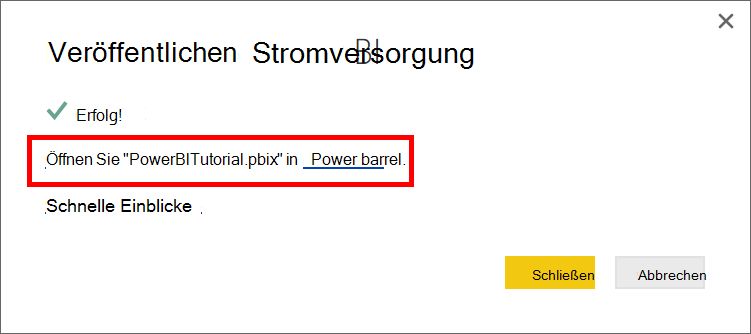

## Erstellen Sie ein Dashboard in PowerBI.com

Jetzt haben Sie einen Bericht, können auf PowerBI.com frei

Beim Veröffentlichen des Berichts von Power BI Desktop PowerBI.com generiert einen **Bericht** und ein **Dataset** in Ihrem Mandanten PowerBI.com angezeigt. Nachdem Sie einen Bericht namens **PowerBITutorial** auf PowerBI.com veröffentlicht, werden Sie PowerBITutorial in die **Berichte** und **Datasets** auf PowerBI.com angezeigt.

   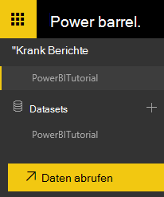

Erstellen Sie ein Dashboard freigegeben klicken Sie **Pin Live Seite** Bericht PowerBI.com.

   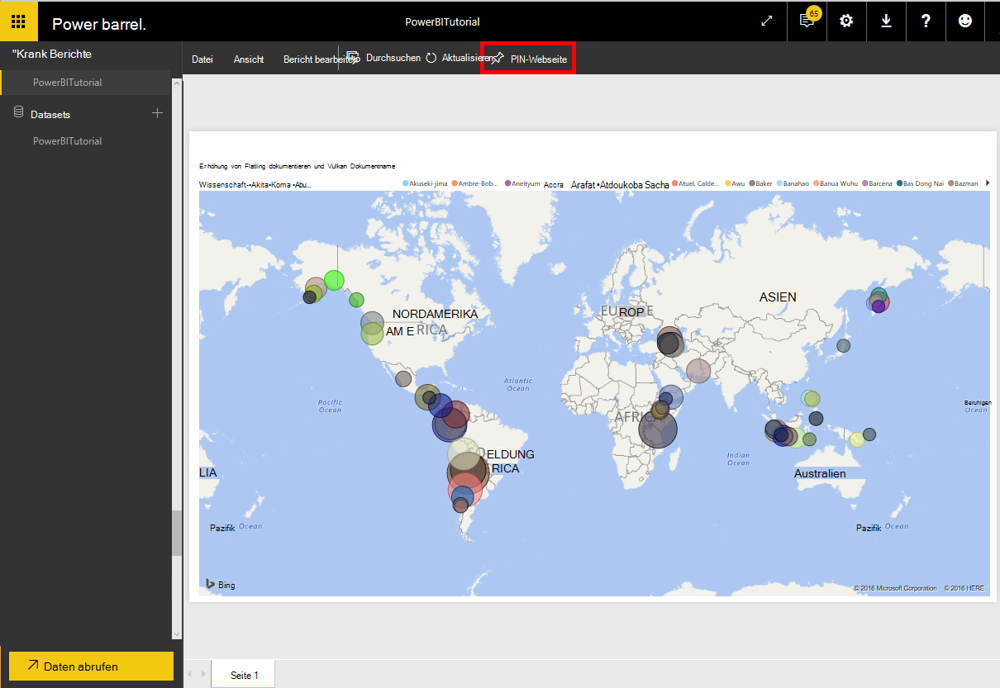

Folgen Sie den in [einer Kachel aus einem Bericht](https://powerbi.microsoft.com/documentation/powerbi-service-pin-a-tile-to-a-dashboard-from-a-report/#pin-a-tile-from-a-report) ein neues Dashboard erstellen. 

Ad-hoc-Änderungen Bericht kann vor dem Erstellen eines Dashboards. Jedoch wird empfohlen, die Änderungen und veröffentlichen den Bericht PowerBI.com Power BI Desktop verwenden.

## Aktualisieren von Daten in PowerBI.com

Gibt es zwei Methoden, um ad-hoc- und geplante Daten aktualisieren.

Ein ad-hoc-Aktualisierung klicken Sie auf finsternisse (...), die im **Dataset**, z.B. PowerBITutorial. Finden Sie eine Übersicht einschließlich **Aktualisieren**. Klicken Sie auf **Jetzt aktualisieren** , um die Daten zu aktualisieren.

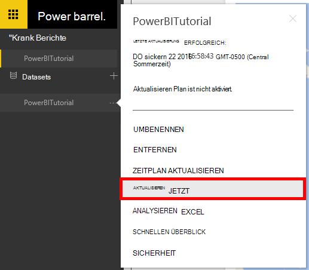

Eine geplante Aktualisierung folgendermaßen Sie vor.

1. Klicken Sie in der Aktionsliste auf **Zeitplan aktualisieren** . 
    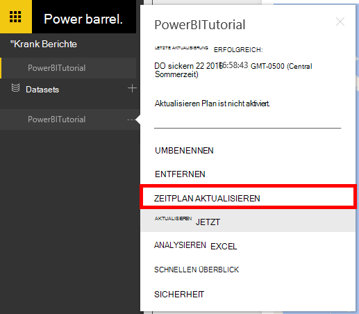

2. Erweitern Sie auf **der Einstellungsseite** **Datenquellen-Anmeldeinformationen**. 

3. Klicken Sie auf **Anmeldeinformationen bearbeiten**. 

    Das Popup konfigurieren wird angezeigt. 

4. Geben Sie den Schlüssel DocumentDB-Konto für das DataSet verbinden und dann auf **Anmelden**. 

5. Erweitern Sie **Zeitplan aktualisieren** und den Zeitplan Dataset aktualisieren möchten. 
  
6. Klicken Sie auf **Übernehmen** und Sie geplante Aktualisierung einrichten.

## Nächste Schritte
- Über Power BI finden Sie unter [Erste Schritte mit Power BI](https://powerbi.microsoft.com/documentation/powerbi-service-get-started/).
- Weitere Informationen zu DocumentDB finden Sie unter [DocumentDB Dokumentation Zielseite](https://azure.microsoft.com/documentation/services/documentdb/).
