<properties
    pageTitle="Python Kolben Webanwendungsentwicklung mit DocumentDB | Microsoft Azure"
    description="Überprüfen Sie ein Lernprogramm zur Verwendung von DocumentDB zum Speichern und Abrufen von Daten aus einer Python Kolben Web-Anwendung in Azure gehostet. Lösungen Sie Application Development." 
    keywords="Anwendungsentwicklung Lernprogramm Python Kolben Python Anwendung Python Web Development Documentdb Azure, Microsoft azure"
    services="documentdb"
    documentationCenter="python"
    authors="syamkmsft"
    manager="jhubbard"
    editor="cgronlun"/>

<tags
    ms.service="documentdb"
    ms.workload="data-management"
    ms.tgt_pltfrm="na"
    ms.devlang="python"
    ms.topic="hero-article"
    ms.date="08/25/2016"
    ms.author="syamk"/>

# <a name="python-flask-web-application-development-with-documentdb"></a>Python Kolben Webanwendungsentwicklung mit DocumentDB

> [AZURE.SELECTOR]
- [.NET](documentdb-dotnet-application.md)
- [Node.js](documentdb-nodejs-application.md)
- [Java](documentdb-java-application.md)
- [Python](documentdb-python-application.md)

In diesem Lernprogramm wird gezeigt, wie mit Azure DocumentDB gespeichert und Datenzugriff über eine web-Anwendung in Azure und setzt voraus, dass einige Erfahrung mit Python und Azure Websites haben.

Dieses Lernprogramm umfasst:

1. Erstellung und Bereitstellung von DocumentDB-Konto.
2. Erstellen einer Python MVC-Anwendung.
3. Verbunden sind und Azure DocumentDB aus der Webanwendung.
4. Bereitstellen der Webanwendung für Azure Websites.

Anhand dieses Lernprogramms erstellen Sie eine einfache Anwendung mit Abstimmungsschaltflächen, die Sie wählen eine Umfrage ermöglicht.


## <a name="database-tutorial-prerequisites"></a>Datenbank-Tutorial-Komponenten

Vor der Instruktionen in diesem Artikel sollten Sie sicherstellen, dass Folgendes installiert sein:

- Ein aktives Azure-Konto. Wenn Sie ein Konto haben, können Sie ein kostenloses Testabo in wenigen Minuten erstellen. Weitere Informationen finden Sie unter [Azure-Testversion](https://azure.microsoft.com/pricing/free-trial/).
- [Visual Studio 2013](http://www.visualstudio.com/) oder höher, oder [Visual Studio Express]()ist die kostenlose Version. Die Anleitung in diesem Lernprogramm wurden speziell für Visual Studio 2015. 
- Python-Tools für Visual Studio von [GitHub](http://microsoft.github.io/PTVS/). In diesem Lernprogramm verwendet Python-Tools für VS 2015. 
- Azure Python SDK für Visual Studio, Version 2.4 oder höher [azure.com](https://azure.microsoft.com/downloads/)ab. Microsoft Azure SDK verwendet Python 2.7.
- Python 2.7 von [python.org][2]. Python 2.7.11 verwendet. 

> [AZURE.IMPORTANT] Bei der Installation von Python 2.7 zum ersten Mal sicherstellen Sie, dass im Bildschirm anpassen Python 2.7.11 **Hinzufügen python.exe Pfad**auswählen.
> 
>    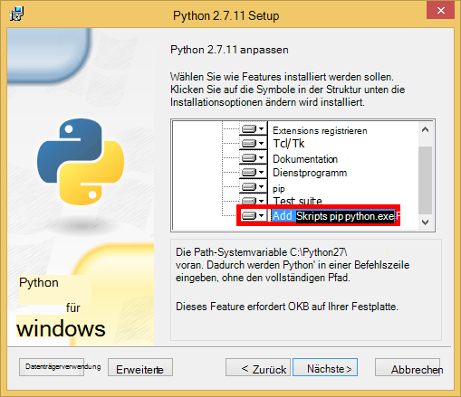

- Microsoft Visual C++-Compiler für Python 2.7 aus dem [Microsoft Download Center][3].

## <a name="step-1-create-a-documentdb-database-account"></a>Schritt 1: Erstellen einer DocumentDB Konto

Beginnen wir mit der Erstellung eines DocumentDB. Wenn Sie bereits ein Konto haben, überspringen Sie zu [Schritt2: Erstellen Sie eine neue Python Kolben](#step-2:-create-a-new-python-flask-web-application).

[AZURE.INCLUDE [documentdb-create-dbaccount](../../includes/documentdb-create-dbaccount.md)]

<br/>
Wir gehen jetzt über eine neue Python Kolben Web-Anwendung von Grund auf erstellen.

## <a name="step-2-create-a-new-python-flask-web-application"></a>Schritt 2: Erstellen Sie eine neue Python-Kolben

1. In Visual Studio im Menü **Datei** auf **neu**zeigen Sie und dann auf **Projekt**.

    Das Dialogfeld **Neues Projekt** angezeigt wird.

2. Im linken Bereich erweitern Sie, **Vorlagen** und **Python**und klicken Sie dann auf **Web**. 

3. Wählen Sie im mittleren Bereich in den **Namen** im Feld Typ **Lernprogramm** **Kolben Webprojekt** und klicken Sie auf **OK**. Denken Sie daran, Python Paketnamen Kleinbuchstaben, sollten wie im [Style Guide für Python-Code](https://www.python.org/dev/peps/pep-0008/#package-and-module-names).

    Die neue Python Kolben ist es ein Webentwicklungsframework-Anwendung, mit der Sie in Python schneller aufgebaut.

    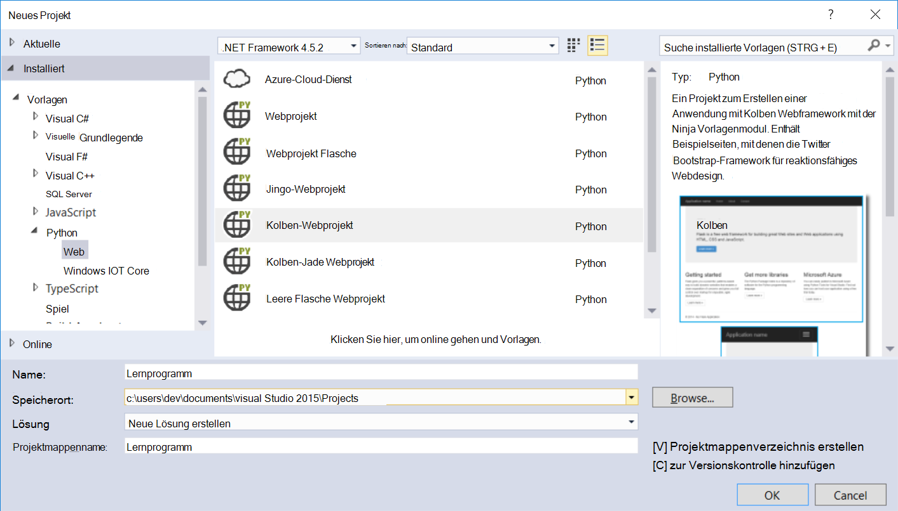

4. Klicken Sie im Fenster **Python-Tools für Visual Studio** **in einer virtuellen Umgebung installieren**. 

    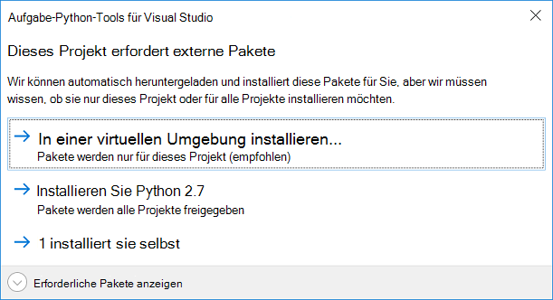

5. Im **Virtuellen Umgebung hinzufügen** können Sie übernehmen Sie die Standardeinstellungen und PyDocumentDB derzeit Python unterstützt Python 2.7 als Basis-Umgebung verwenden 3.x, und klicken Sie dann auf **Erstellen**. Erforderliche Python virtuellen Umgebung für das Projekt eingerichtet.

    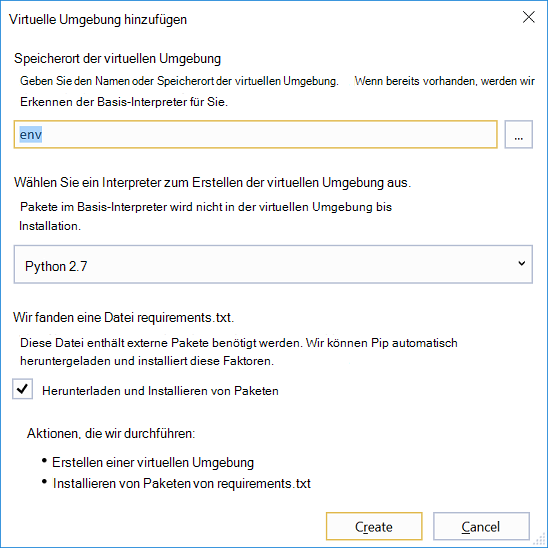

    Das Ausgabefenster zeigt `Successfully installed Flask-0.10.1 Jinja2-2.8 MarkupSafe-0.23 Werkzeug-0.11.5 itsdangerous-0.24 'requirements.txt' was installed successfully.` Wenn die Umgebung erfolgreich installiert.

## <a name="step-3-modify-the-python-flask-web-application"></a>Schritt 3: Ändern Sie Python Kolben der Anwendung

### <a name="add-the-python-flask-packages-to-your-project"></a>Python-Kolben Pakete zum Projekt hinzufügen

Nachdem das Projekt eingerichtet haben, müssen Sie Projekt, einschließlich Pydocumentdb, Python-Paket für DocumentDB erforderlichen Kolben Pakete hinzufügen.

1. Öffnen Sie im Projektmappen-Explorer die Datei **requirements.txt** , und Ersetzen Sie den Inhalt durch Folgendes:

        flask==0.9
        flask-mail==0.7.6
        sqlalchemy==0.7.9
        flask-sqlalchemy==0.16
        sqlalchemy-migrate==0.7.2
        flask-whooshalchemy==0.55a
        flask-wtf==0.8.4
        pytz==2013b
        flask-babel==0.8
        flup
        pydocumentdb>=1.0.0

2. Speichern Sie die Datei **requirements.txt** . 
3. Im Projektmappen-Explorer mit der rechten Maustaste **Env** und auf **aus requirements.txt installieren**.

    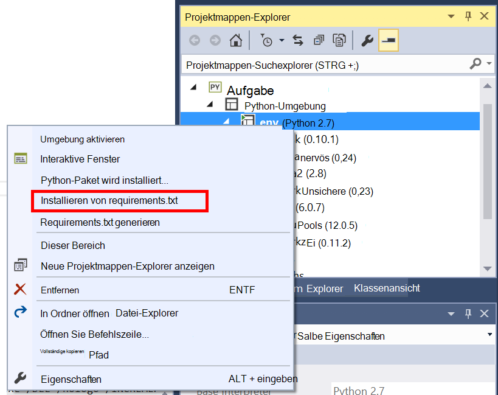

    Nach erfolgreicher Installation wird das Ausgabefenster Folgendes angezeigt:

        Successfully installed Babel-2.3.2 Tempita-0.5.2 WTForms-2.1 Whoosh-2.7.4 blinker-1.4 decorator-4.0.9 flask-0.9 flask-babel-0.8 flask-mail-0.7.6 flask-sqlalchemy-0.16 flask-whooshalchemy-0.55a0 flask-wtf-0.8.4 flup-1.0.2 pydocumentdb-1.6.1 pytz-2013b0 speaklater-1.3 sqlalchemy-0.7.9 sqlalchemy-migrate-0.7.2

    > [AZURE.NOTE] In seltenen Fällen kann einen Fehler im Ausgabefenster angezeigt. In diesem Fall überprüfen Sie, ob der Fehler im Zusammenhang mit Bereinigung. Manchmal die Bereinigung, aber die Installation werden erfolgreich (Scrollen Sie im Ausgabefenster überprüfen). Sie können die Installation durch [Überprüfen der virtuellen Umgebung](#verify-the-virtual-environment)überprüfen. Fehler bei der Installation, jedoch die Überprüfung erfolgreich ist, ist es OK, um fortzufahren.

### <a name="verify-the-virtual-environment"></a>Überprüfen Sie die virtuelle Umgebung

Wir stellen sicher, dass alles korrekt installiert ist.

1. Erstellen Sie die Projektmappe **STRG**+**UMSCHALT**+**B**.
2. Wenn der Buildvorgang erfolgreich war, Starten der Website durch Drücken von **F5**. Dies startet den Kolben Development Server und startet Ihren Webbrowser. Sie sollten die folgende Seite angezeigt.

    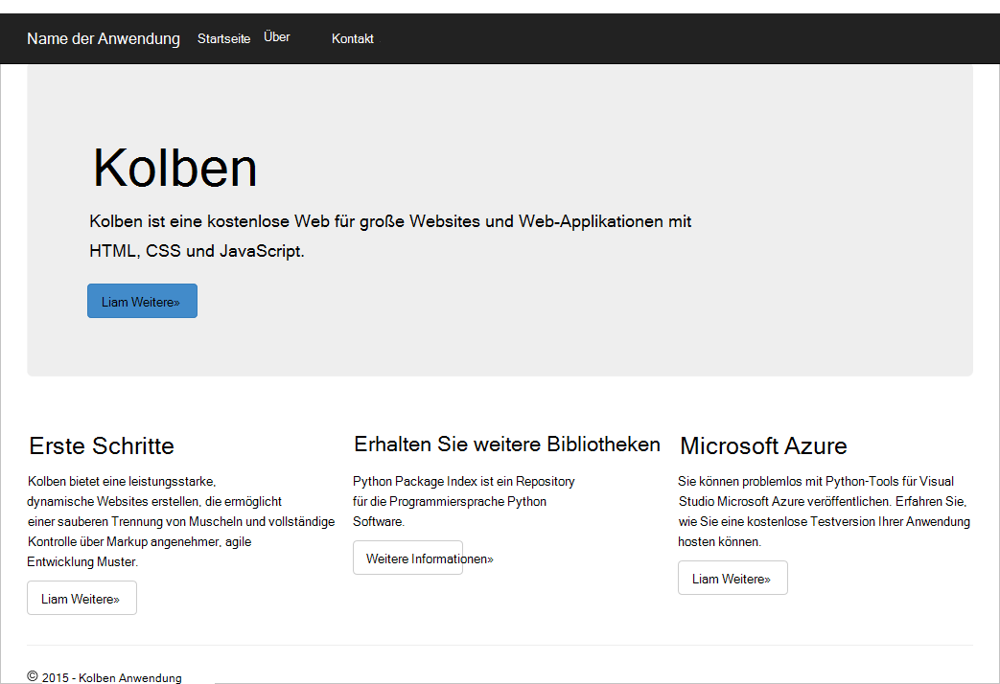

3. Beenden Sie das Debuggen der Website durch Drücken der **UMSCHALTTASTE**+in Visual Studio**F5** .

### <a name="create-database-collection-and-document-definitions"></a>Datenbank, Sammlung und Dokumentdefinitionen erstellen

Nun erstellen Sie die Stimmabgabe Anwendung durch Hinzufügen neue Dateien und andere aktualisieren.

1. Im Projektmappen-Explorer mit der rechten Maustaste des Projekts **Tutorial** , klicken Sie auf **Hinzufügen**und **Klicken**. Wählen Sie **Leere Python-Datei** , und benennen Sie die Datei **forms.py**.  
2. Fügen Sie folgenden Code in die Datei forms.py, und speichern Sie die Datei.

```python
from flask.ext.wtf import Form
from wtforms import RadioField

class VoteForm(Form):
    deploy_preference  = RadioField('Deployment Preference', choices=[
        ('Web Site', 'Web Site'),
        ('Cloud Service', 'Cloud Service'),
        ('Virtual Machine', 'Virtual Machine')], default='Web Site')
```


### <a name="add-the-required-imports-to-viewspy"></a>Views.py erforderlichen Importe hinzufügen

1. Im Projektmappen-Explorer den Ordner **Tutorial** , und öffnen Sie die Datei **views.py** . 
2. Fügen Sie die folgende Anweisung am Anfang der Datei **views.py** importieren und speichern. Diese DocumentDBs PythonSDK und der Kolben Pakete importieren.

    ```python
    from forms import VoteForm
    import config
    import pydocumentdb.document_client as document_client
    ```


### <a name="create-database-collection-and-document"></a>Datenbank, Sammlung und Dokument erstellen

- Fügen Sie in **views.py**den folgenden Code am Ende der Datei. Dies übernimmt vom Formular verwendeten Datenbank erstellen. Löschen Sie den vorhandenen Code in **views.py**. Fügen Sie das Ende.

```python
@app.route('/create')
def create():
    """Renders the contact page."""
    client = document_client.DocumentClient(config.DOCUMENTDB_HOST, {'masterKey': config.DOCUMENTDB_KEY})

    # Attempt to delete the database.  This allows this to be used to recreate as well as create
    try:
        db = next((data for data in client.ReadDatabases() if data['id'] == config.DOCUMENTDB_DATABASE))
        client.DeleteDatabase(db['_self'])
    except:
        pass

    # Create database
    db = client.CreateDatabase({ 'id': config.DOCUMENTDB_DATABASE })

    # Create collection
    collection = client.CreateCollection(db['_self'],{ 'id': config.DOCUMENTDB_COLLECTION })

    # Create document
    document = client.CreateDocument(collection['_self'],
        { 'id': config.DOCUMENTDB_DOCUMENT,
          'Web Site': 0,
          'Cloud Service': 0,
          'Virtual Machine': 0,
          'name': config.DOCUMENTDB_DOCUMENT 
        })

    return render_template(
       'create.html',
        title='Create Page',
        year=datetime.now().year,
        message='You just created a new database, collection, and document.  Your old votes have been deleted')
```

> [AZURE.TIP] **CreateCollection** -Methode akzeptiert ein optionales **RequestOptions** als dritten Parameter. Hiermit können Sie bieten für die Auflistung geben. Wenn kein OfferType-Wert angegeben ist, wird die Auflistung mit den Standardtyp bieten erstellt. Finden Sie weitere Informationen auf DocumentDB bieten [Leistungsmerkmale in DocumentDB](documentdb-performance-levels.md).


### <a name="read-database-collection-document-and-submit-form"></a>Datenbank, Sammlung, Dokument lesen und Formular

- Fügen Sie in **views.py**den folgenden Code am Ende der Datei. Dies übernimmt das Formular lesen, Datenbank, Sammlung und Dokument einrichten. Löschen Sie den vorhandenen Code in **views.py**. Fügen Sie das Ende.

```python
@app.route('/vote', methods=['GET', 'POST'])
def vote(): 
    form = VoteForm()
    replaced_document ={}
    if form.validate_on_submit(): # is user submitted vote  
        client = document_client.DocumentClient(config.DOCUMENTDB_HOST, {'masterKey': config.DOCUMENTDB_KEY})

        # Read databases and take first since id should not be duplicated.
        db = next((data for data in client.ReadDatabases() if data['id'] == config.DOCUMENTDB_DATABASE))

        # Read collections and take first since id should not be duplicated.
        coll = next((coll for coll in client.ReadCollections(db['_self']) if coll['id'] == config.DOCUMENTDB_COLLECTION))

        # Read documents and take first since id should not be duplicated.
        doc = next((doc for doc in client.ReadDocuments(coll['_self']) if doc['id'] == config.DOCUMENTDB_DOCUMENT))

        # Take the data from the deploy_preference and increment our database
        doc[form.deploy_preference.data] = doc[form.deploy_preference.data] + 1
        replaced_document = client.ReplaceDocument(doc['_self'], doc)

        # Create a model to pass to results.html
        class VoteObject:
            choices = dict()
            total_votes = 0

        vote_object = VoteObject()
        vote_object.choices = {
            "Web Site" : doc['Web Site'],
            "Cloud Service" : doc['Cloud Service'],
            "Virtual Machine" : doc['Virtual Machine']
        }
        vote_object.total_votes = sum(vote_object.choices.values())

        return render_template(
            'results.html', 
            year=datetime.now().year, 
            vote_object = vote_object)

    else :
        return render_template(
            'vote.html', 
            title = 'Vote',
            year=datetime.now().year,
            form = form)
```


### <a name="create-the-html-files"></a>HTML-Dateien erstellen

1. **Klicken**Sie im Projektmappen-Explorer im Ordner **Tutorial** Rechtsklick **Vorlagenordner** und klicken Sie auf **Hinzufügen**. 
2. Wählen Sie **HTML-Seite**, und geben Sie im Namenfeld **create.html**. 
3. Wiederholen Sie die Schritte 1 und 2 zwei zusätzliche HTML-Dateien erstellen: results.html und vote.html.
4. Fügen Sie folgenden Code zum **create.html** in der `<body>` Element. Es meldet, dass eine neue Datenbank, Sammlung und Dokument erstellt.

    ```html
    
    
    <h2>{{ title }}.</h2>
    <h3>{{ message }}</h3>
    <p><a href="{{ url_for('vote') }}" class="btn btn-primary btn-large">Vote &raquo;</a></p>
    
    ```

5. Fügen Sie folgenden Code zum **results.html** in der `<body`> Element. Die Ergebnisse der Umfrage angezeigt.

    ```html
    
    
    <h2>Results of the vote</h2>
        <br />
        
    
    <div class="row">
        <div class="col-sm-5">{{choice}}</div>
            <div class="col-sm-5">
                <div class="progress">
                    <div class="progress-bar" role="progressbar" aria-valuenow="{{vote_object.choices[choice]}}" aria-valuemin="0" aria-valuemax="{{vote_object.total_votes}}" style="width: {{(vote_object.choices[choice]/vote_object.total_votes)*100}}%;">
                                {{vote_object.choices[choice]}}
                </div>
            </div>
            </div>
    </div>
    
    
    <br />
    <a class="btn btn-primary" href="{{ url_for('vote') }}">Vote again?</a>
    
    ```

6. Fügen Sie folgenden Code zum **vote.html** in der `<body`> Element. Zeigt die Abstimmung und akzeptiert die stimmen. Registrierung stimmen ist das Steuerelement views.py übergeben wo wir Abstimmung Typumwandlung erkannt und entsprechend das Dokument anfügen.

    ```html
    
    
    <h2>What is your favorite way to host an application on Azure?</h2>
    <form action="" method="post" name="vote">
        {{form.hidden_tag()}}
            {{form.deploy_preference}}
            <button class="btn btn-primary" type="submit">Vote</button>
    </form>
    
    ```

7. Ersetzen Sie den Inhalt von **index.html** mit folgenden, im Ordner **Vorlagen** . Dies ist die Zielseite für die Anwendung.
    
    ```html
    
    
    <h2>Python + DocumentDB Voting Application.</h2>
    <h3>This is a sample DocumentDB voting application using PyDocumentDB</h3>
    <p><a href="{{ url_for('create') }}" class="btn btn-primary btn-large">Create/Clear the Voting Database &raquo;</a></p>
    <p><a href="{{ url_for('vote') }}" class="btn btn-primary btn-large">Vote &raquo;</a></p>
    
    ```

### <a name="add-a-configuration-file-and-change-the-initpy"></a>Eine Konfigurationsdatei, und ändern Sie die \_ \_Init\_\_.py

1. Im Projektmappen-Explorer mit der rechten Maustaste des Projekts **Tutorial** , klicken Sie auf **Hinzufügen**klicken Sie auf **Neues Element**, wählen Sie **Leere Python-Datei**und benennen Sie die Datei **config.py**. Formulare im Kolben ist diese Konfigurationsdatei erforderlich. Sie können auch einen geheimen Schlüssel bereitstellen. Dieser Schlüssel ist jedoch nicht für dieses Lernprogramm erforderlich.

2. Config.py den folgenden Code hinzufügen, müssen Sie die Werte ändern **DOCUMENTDB\_HOST** und **DOCUMENTDB\_Schlüssel** im nächsten Schritt.

    ```python
    CSRF_ENABLED = True
    SECRET_KEY = 'you-will-never-guess'
    
    DOCUMENTDB_HOST = 'https://YOUR_DOCUMENTDB_NAME.documents.azure.com:443/'
    DOCUMENTDB_KEY = 'YOUR_SECRET_KEY_ENDING_IN_=='
    
    DOCUMENTDB_DATABASE = 'voting database'
    DOCUMENTDB_COLLECTION = 'voting collection'
    DOCUMENTDB_DOCUMENT = 'voting document'
    ```

3. [Azure-Portal](https://portal.azure.com/)Navigieren zu Blade **Schlüssel** **Durchsuchen**, **DocumentDB-Konten**, doppelklicken Sie auf den Namen des Kontos verwenden und klicken Sie dann im Bereich **Essentials** **Schlüssel** . Blatt **Schlüssel** kopieren den **URI** -Wert, und fügen Sie ihn in die Datei **config.py** als Wert für die **DOCUMENTDB\_HOST** Eigenschaft. 
4. Zurück in Azure-Portal Blatt **Schlüssel** den Wert des **Primärschlüssels** oder **Sekundärschlüssel**kopieren und fügen Sie ihn in die Datei **config.py** als Wert für die **DOCUMENTDB\_KEY** Eigenschaft.
5. In der ** \_ \_Init\_\_.py** Datei, fügen Sie die folgende Zeile hinzu. 

        app.config.from_object('config')

    So, dass der Inhalt der Datei:

    ```python
    from flask import Flask
    app = Flask(__name__)
    app.config.from_object('config')
    import tutorial.views
    ```

6. Projektmappen-Explorer sollte nach dem Hinzufügen aller Dateien, wie folgt aussehen:

    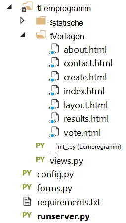


## <a name="step-4-run-your-web-application-locally"></a>Schritt 4: Web-Anwendung lokal ausführen

1. Erstellen Sie die Projektmappe **STRG**+**UMSCHALT**+**B**.
2. Wenn der Buildvorgang erfolgreich war, Starten der Website durch Drücken von **F5**. Folgendes sollte auf dem Bildschirm angezeigt werden.

    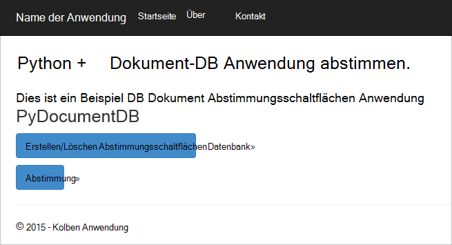

3. Klicken Sie auf **Erstellen/Löschen der Datenbank wählen** , um die Datenbank zu erstellen.

    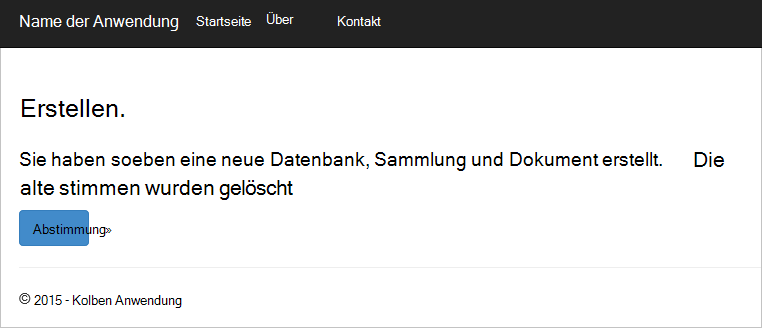

4. **Abstimmung** und klicken Sie wählen Sie die Option.

    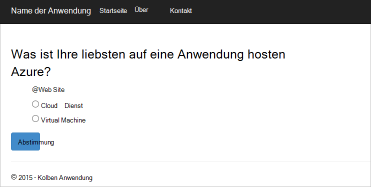

5. Für jede Stimme, die Sie umwandeln, wird der entsprechenden Zähler erhöht.

    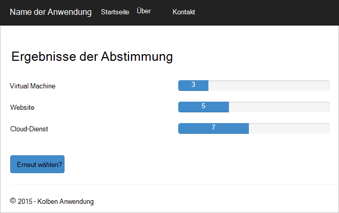

6. Beenden Sie das Debuggen des Projekts durch Drücken von UMSCHALT + F5.

## <a name="step-5-deploy-the-web-application-to-azure-websites"></a>Schritt 5: Bereitstellen Sie Webanwendung in Azure Websites

Jetzt haben Sie die vollständige Anwendung mit DocumentDB ordnungsgemäß funktioniert, werden wir diese Azure Websites bereitstellen.

1. Mit der rechten Maustaste im Projektmappen-Explorer des Projekts (sollten Sie nicht weiterhin lokal ausgeführt), und wählen Sie **Veröffentlichen**.  

    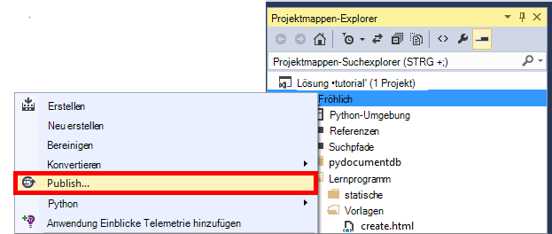

2. Klicken Sie im **Web veröffentlichen** wählen Sie **Microsoft Azure Web Apps aus**und dann auf **Weiter**.

    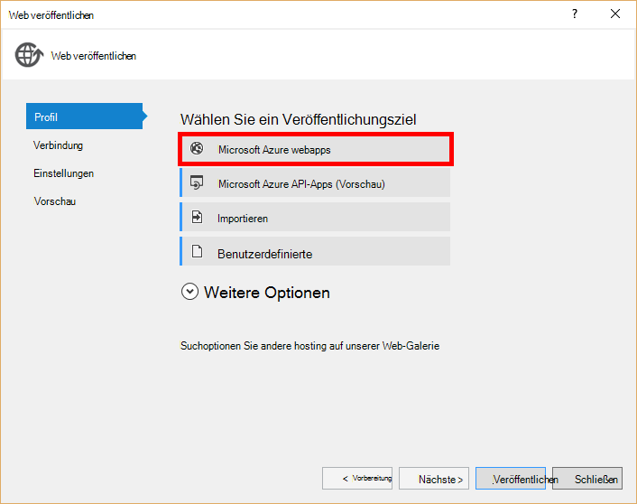

3. Klicken Sie im Fenster **Microsoft Azure Web Apps Fenster** auf **neu**.

    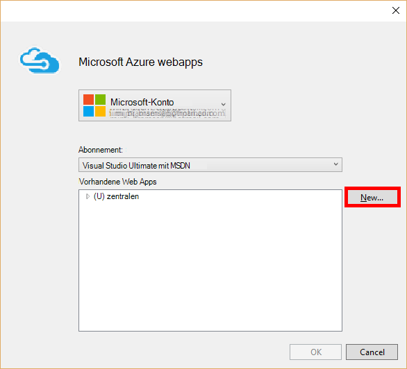

4. Im Fenster **Create Site auf Microsoft Azure** geben ein **Anwendungsname Web** **App Service-Plan**, **Ressourcengruppe**und **Region**, und klicken Sie auf **Erstellen**.

    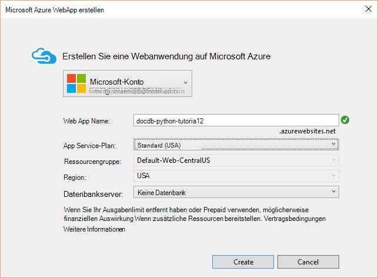

5. Klicken Sie im Fenster **Veröffentlichen** **Veröffentlichen**.

    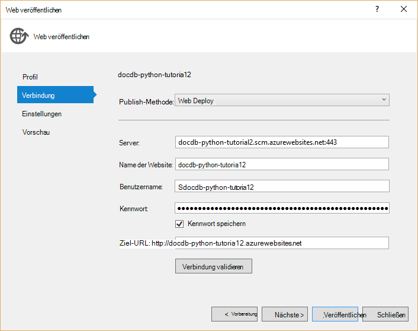

3. In wenigen Sekunden Visual Studio Veröffentlichen der Webanwendung beenden und starten Sie einen Browser finden Ihre Arbeit in Azure ausgeführt.

## <a name="troubleshooting"></a>Problembehandlung

Ist dies der erste Python-Anwendung auf Ihrem Computer ausführen, sicherstellen Sie, dass die folgenden Ordner (oder der entsprechende Installationspfade) in der PATH-Variablen enthalten sind:

    C:\Python27\site-packages;C:\Python27\;C:\Python27\Scripts;

Wenn eine auf Ihre Stimme Fehlermeldung und Sie mit dem Namen Projekt als **Lernprogramm**stellen sicher, dass ** \_ \_Init\_\_.py** verweist auf den richtigen Namen in der Zeile: `import tutorial.view`.

## <a name="next-steps"></a>Nächste Schritte

Herzlichen Glückwunsch! Sie haben nur die erste Python Webanwendung Azure DocumentDB abgeschlossen und Azure Websites veröffentlicht.

Wir verbessern und diesem Thema häufig basierend auf Ihrem Feedback.  Sie haben das Lernprogramm abgeschlossen bitte mit Abstimmungsschaltflächen oben und unten und geben Sie Ihr Feedback für was Sie die gewünschten Verbesserungen. Möchten Sie uns direkt kontaktieren, können Sie Ihre e-Mail-Adresse in Ihre Kommentare enthalten.

Um die Webanwendung zusätzliche Funktionen hinzuzufügen, überprüfen Sie die APIs im [DocumentDB Python SDK](documentdb-sdk-python.md).

Weitere Informationen zu Azure, Visual Studio und Python finden Sie unter [Python Developer Center](https://azure.microsoft.com/develop/python/). 

Weitere Python Kolben Lernprogramme finden Sie unter [der Kolben Mega-Lernprogramm, Teil I: Hello, World!](http://blog.miguelgrinberg.com/post/the-flask-mega-tutorial-part-i-hello-world). 

  [Visual Studio Express]: http://www.visualstudio.com/products/visual-studio-express-vs.aspx
  [2]: https://www.python.org/downloads/windows/
  [3]: https://www.microsoft.com/download/details.aspx?id=44266
  [Microsoft Web Platform Installer]: http://www.microsoft.com/web/downloads/platform.aspx
  [Azure portal]: http://portal.azure.com
