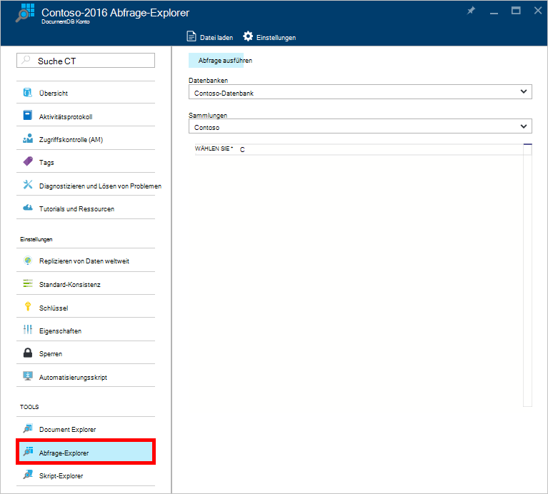
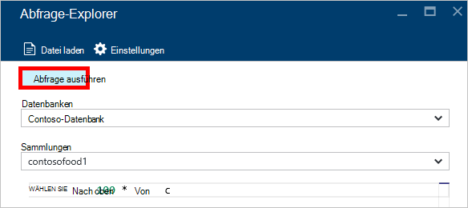
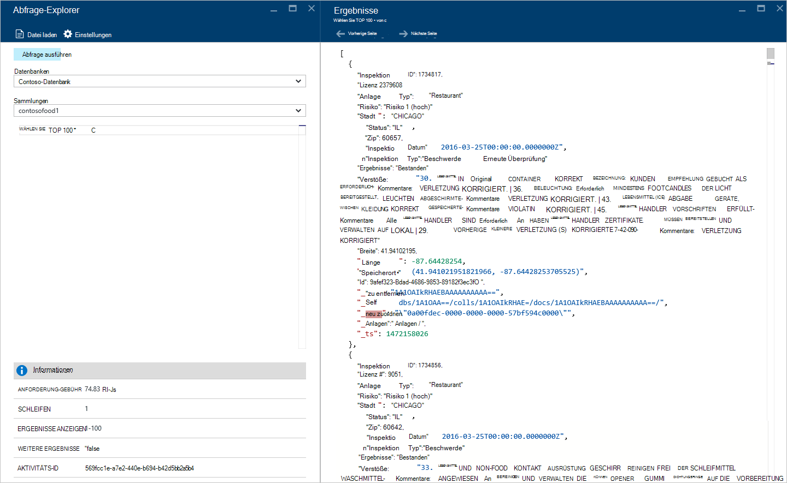
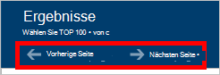
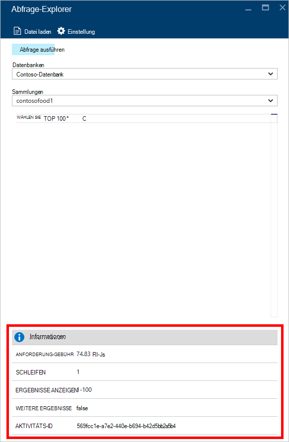
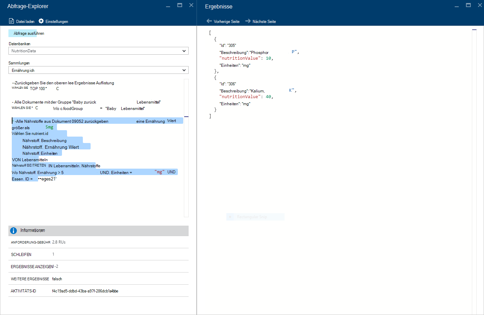
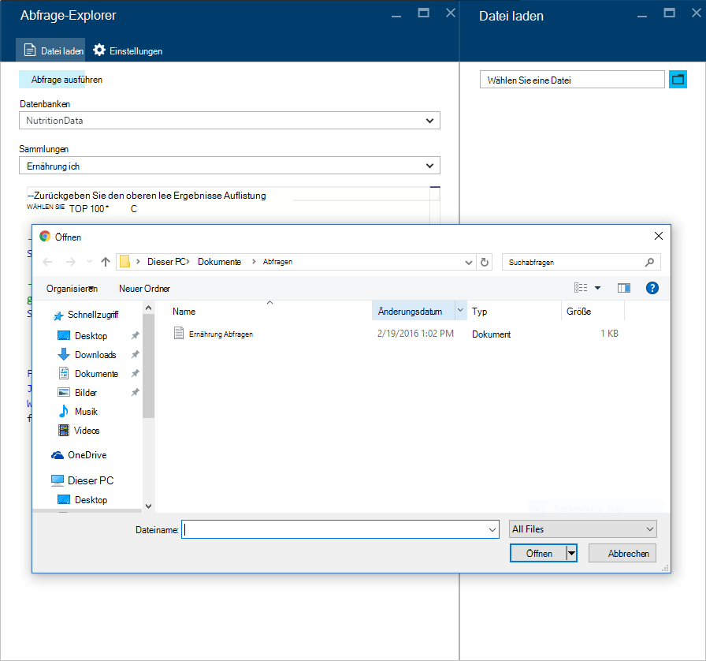
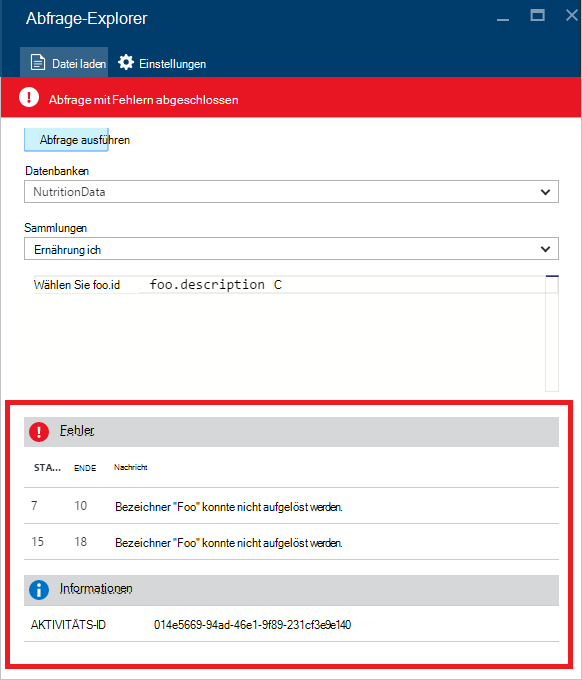

<properties
    pageTitle="DocumentDB Abfrage-Explorer: Eine SQL-Abfrage-Editor | Microsoft Azure"
    description="Erfahren Sie mehr über DocumentDB Abfrage Explorer eine SQL-Abfrage-Editor in Azure-Portal zum Schreiben von SQL-Abfragen und eine Sammlung NoSQL DocumentDB ausführen."
    keywords="Schreiben von Sql-Abfragen, Sql-Abfrage-editor"
    services="documentdb"
    authors="kirillg"
    manager="jhubbard"
    editor="monicar"
    documentationCenter=""/>

<tags
    ms.service="documentdb"
    ms.workload="data-services"
    ms.tgt_pltfrm="na"
    ms.devlang="na"
    ms.topic="article"
    ms.date="08/30/2016"
    ms.author="kirillg"/>

# Schreiben, bearbeiten und Ausführen von SQL-Abfragen für DocumentDB mit dem Abfrage-Explorer 

Dieser Artikel bietet eine Übersicht über [Microsoft Azure DocumentDB](https://azure.microsoft.com/services/documentdb/) Abfrage-Explorer Azure Portal Instrument, mit der Sie schreiben, bearbeiten und eine [DocumentDB Auflistung](documentdb-create-collection.md)SQL-Abfragen ausführen.

1. Klicken Sie im Portal Azure in der Indexleiste auf **DocumentDB (NoSQL)**. Wenn **DocumentDB (NoSQL)** nicht sichtbar ist, klicken Sie auf **Weitere Dienste** und dann auf **DocumentDB (NoSQL)**.

2. Klicken Sie im Menü Resource **Explorer Abfrage**. 

    

3. **Abfrage-Explorer** Blatt wählen Sie **Datenbanken** und **Sammlungen** Abfrage aus der Dropdown-Liste, und geben Sie die Abfrage ausführen. 

    **Datenbanken** und **Sammlungen** Dropdownlisten sind voreingestellt je nach Kontext, in dem Abfrage-Explorer starten. 

    Standardabfrage des `SELECT TOP 100 * FROM c` werden.  Können Sie die Standardabfrage übernehmen oder erstellen eigene Abfragen mithilfe der SQL-Abfragesprache in der [SQL-Abfrage Spickzettel](documentdb-sql-query-cheat-sheet.md) oder Artikel [SQL-Abfrage und SQL-Syntax](documentdb-sql-query.md) beschrieben.

    Klicken Sie auf **Abfrage ausführen** , um die Ergebnisse anzuzeigen.

    

4. Das Blade **Ergebnisse** zeigt die Ausgabe der Abfrage. 

    

## Arbeiten mit den Ergebnissen

Standardmäßig gibt die Abfrage-Explorer Ergebnisse in Gruppen von 100.  Wenn die Abfrage mehr als 100 Ergebnissen, einfach Befehlen Sie **Nächste Seite** und **Vorherige Seite** durch die Ergebnismenge navigieren.

Erfolgreiche Abfragen **Informationsbereich** enthält wie Anforderung kostenlos, die Anzahl der Roundtrips die Abfrage aus der Gruppe von Ergebnissen, die gerade angezeigt wird und bereits erwähnt gibt mehr Ergebnisse als dann über den Befehl **Seite** zugegriffen werden können.

## Mehrere Abfragen

Wenn Sie mehrere Abfragen und schnell zwischen ihnen wechseln möchten, können Sie geben die Abfragen im Textfeld Abfrage des Blades **Abfrage Explorer** markieren Sie das Konto, das Sie ausführen möchten und klicken Sie auf **Abfrage ausführen** , um die Ergebnisse anzuzeigen.

## Hinzufügen von Abfragen aus einer Datei in der SQL-Abfrage-editor

Sie können den Inhalt einer vorhandenen Datei mit dem Befehl **Datei laden** laden.

## Problembehandlung bei

Wenn eine Abfrage mit Fehlern abgeschlossen ist, zeigt Abfrage Explorer eine Liste mit Fehlern, die bei der Problembehandlung helfen können.

## DocumentDB SQL-Abfragen außerhalb des Portals ausführen

Abfrage-Explorer im Azure-Portal ist nur eine Möglichkeit, SQL-Abfragen für DocumentDB ausführen. Sie können auch die [REST-API](https://msdn.microsoft.com/library/azure/dn781481.aspx) oder der [Client SDKs](documentdb-sdk-dotnet.md)SQL-Abfragen ausführen. Weitere Informationen über diese Methoden finden Sie unter [Ausführen von SQL-Abfragen](documentdb-sql-query.md#executing-sql-queries)

## Nächste Schritte

Erfahren Sie mehr über die DocumentDB SQL-Grammatik im Abfrage-Explorer unterstützt Siehe [SQL-Abfrage und SQL-Syntax](documentdb-sql-query.md) oder [SQL Query Spickzettel](documentdb-sql-query-cheat-sheet.md)ausdrucken.
Sie können auch mit dem Testen Abfragen online verwenden ein Stichprobendataset [Abfrage Spielplatz](https://www.documentdb.com/sql/demo) genießen.
