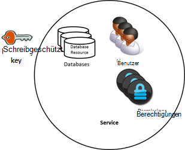
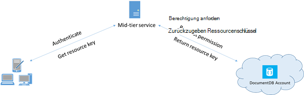

<properties 
    pageTitle="Informationen zum sicheren Zugriff auf Daten in DocumentDB | Microsoft Azure" 
    description="Enthält Informationen Sie zum Steuerelement Konzepte in DocumentDB einschließlich Hauptschlüssel, schreibgeschützte Schlüssel, Benutzern und Berechtigungen." 
    services="documentdb" 
    authors="kiratp" 
    manager="jhubbard" 
    editor="monicar" 
    documentationCenter=""/>

<tags 
    ms.service="documentdb" 
    ms.workload="data-services" 
    ms.tgt_pltfrm="na" 
    ms.devlang="na" 
    ms.topic="article" 
    ms.date="09/19/2016" 
    ms.author="kipandya"/>

# Sichern des Zugriffs auf DocumentDB Daten

Dieser Artikel enthält eine Übersicht über das Sichern des Zugriffs auf Daten in [Microsoft Azure DocumentDB](https://azure.microsoft.com/services/documentdb/).

Nach dem Lesen dieser Übersicht werden Sie die folgenden Fragen beantworten:  

-   Was sind DocumentDB-Hauptschlüssel?
-   Was sind schreibgeschützte Schlüssel DocumentDB?
-   Was sind DocumentDB Ressourcentoken?
-   Wie kann ich DocumentDB Benutzer und Berechtigungen Zugang zu DocumentDB Daten verwenden?

## DocumentDB-Konzepte

DocumentDB bietet erstklassige Konzepte zur Steuerung des Zugriffs auf Ressourcen DocumentDB.  DocumentDB Ressourcen sind zu diesem Thema in zwei Kategorien unterteilt:

- Verwaltungsressourcen
    - Konto
    - Datenbank
    - Benutzer
    - Berechtigung
- Anwendungsressourcen
    - Auflistung
    - Angebot
    - Dokument
    - Anlage
    - Gespeicherte Prozedur
    - Trigger
    - Benutzerdefinierte Funktion

Innerhalb dieser beiden Kategorien DocumentDB unterstützt drei Arten von Access Control Rollen: Administrator, Administrator schreibgeschützt, und der Datenbank.  Rechte für jede Rolle Access Control sind:
 
- Konto-Administrator: Vollzugriff auf alle Ressourcen (administrative und Anwendung) in ein DocumentDB Konto.
- Nur-Lese-Administrator: schreibgeschützten Zugriff auf alle Ressourcen (administrative und Anwendung in ein DocumentDB Konto. 
- Datenbankbenutzer: der DocumentDB benutzerressource einen bestimmten Satz von DocumentDB Ressourcen (z. B. Sammlungen, Dokumente, Skripts) zugeordnet.  Es kann eine oder mehr Benutzerressourcen für eine bestimmte Datenbank und jede benutzerressource möglicherweise eine oder mehrere Berechtigungen zugeordnet.

Die genannten Kategorien und Ressourcen dabei definiert das DocumentDB-Modell drei Arten von Access erstellt:

- Hauptschlüssel: bei der Erstellung eines Kontos DocumentDB zwei Hauptschlüssel (Primär und sekundär) erstellt werden.  Diese Tasten ermöglichen vollen administrativen Zugriff auf alle Ressourcen innerhalb des DocumentDB-Kontos.

- Schreibgeschützte Schlüssel: bei der Erstellung eines Kontos DocumentDB zwei schreibgeschützte Schlüssel (Primär und sekundär) erstellt werden.  Diese Tasten ermöglichen schreibgeschützten Zugriff auf alle Ressourcen innerhalb des DocumentDB-Kontos.

- Ressourcentoken: ein Ressourcentoken einer DocumentDB Ressource zugeordnet ist, und zeichnet die Beziehung zwischen dem Benutzer einer Datenbank und die Berechtigungen dieser Benutzer hat für eine bestimmte DocumentDB Anwendungsressource (Auflistung, Dokument).

## Arbeiten mit Master- und schreibgeschützte Schlüssel DocumentDB

Wie bereits erwähnt, stellen DocumentDB Hauptschlüssel vollen administrativen Zugriff auf alle Ressourcen in einer DocumentDB-Konto während schreibgeschützte Schlüssel auf alle Ressourcen in das Konto aktivieren.  Der folgende Codeausschnitt veranschaulicht, wie ein DocumentDB Konto Endpunkt und Hauptschlüssel instanziiert ein "documentclient" und eine neue Datenbank erstellen. 

    //Read the DocumentDB endpointUrl and authorization keys from config.
    //These values are available from the Azure Classic Portal on the DocumentDB Account Blade under "Keys".
    //NB > Keep these values in a safe and secure location. Together they provide Administrative access to your DocDB account.
    
    private static readonly string endpointUrl = ConfigurationManager.AppSettings["EndPointUrl"];
    private static readonly SecureString authorizationKey = ToSecureString(ConfigurationManager.AppSettings["AuthorizationKey"]);
        
    client = new DocumentClient(new Uri(endpointUrl), authorizationKey);
    
    // Create Database
    Database database = await client.CreateDatabaseAsync(
        new Database
        {
            Id = databaseName
        });

## Übersicht der DocumentDB Ressource-Token

Können Sie einen Ressourcentoken (indem DocumentDB Benutzer und Berechtigungen) werden mit dem Hauptschlüssel kann ein Client Zugriff auf Ressourcen in Ihrem Konto DocumentDB erteilen möchten. Der Hauptschlüssel DocumentDB umfassen sowohl eine primäre und sekundäre Schlüssel jeweils administrativen Zugriff auf Ihr Konto und die Ressourcen gewährt. Verfügbarmachen einer der Hauptschlüssel wird Ihrem Konto die Möglichkeit bösartiger oder fahrlässigen geöffnet. 

Ebenso DocumentDB schreibgeschützte Schlüssel geben Lesezugriff auf alle Ressourcen - Berechtigung Ressourcen außer natürlich - DocumentDB-Konto und können nicht verwendet werden, um genauere Zugriff auf DocumentDB Ressourcen.

DocumentDB Ressourcentoken bieten eine sichere Alternative, durch die Clients zum Lesen, schreiben und Löschen von Ressourcen in Ihrem DocumentDB-Konto Berechtigungen gewährt haben und ohne Master oder nur die wichtigsten lesen.

Hier ist ein Standard Entwurfsmuster bei Ressourcentoken möglicherweise angefordert, generiert und an Clients übermittelt:

1. Mid-Tier-Dienst soll eine mobile Anwendung Benutzer Fotos.
2. Mid-Tier-Dienst besitzt den Hauptschlüssel des DocumentDB-Kontos.
3. Die app wird auf mobilen Endgeräten installiert. 
4. Die app wird bei Anmeldung die Identität des Benutzers mit dem Mid-Tier-Dienst. Diese Identität Betrieb ist nur bis zur Anwendung.
5. Nachdem die Identität eingerichtet wurde, fordert der Mid-Tier-Dienst Berechtigungen auf Grundlage der Identität.
6. Mid-Tier-Dienst sendet einen Ressourcentoken Telefon App.
7. Telefon app kann weiterhin die Ressourcentoken direkt DocumentDB Zugriff auf Ressourcen mit definierten Ressourcentoken und erlaubt die Ressourcentoken Intervall Berechtigungen verwenden. 
8. Ressourcentoken abgelaufen ist, werden nachfolgende Anforderungen 401 unbefugte Ausnahme empfangen.  An dieser Stelle Telefon app stellt die Identität und ein neue Ressourcentoken angefordert.

## Arbeiten mit DocumentDB Benutzer und Berechtigungen
DocumentDB User Ressource ist einer DocumentDB zugeordnet.  Jede Datenbank kann NULL oder mehr DocumentDB Benutzer enthalten.  Im folgenden Codeausschnitt veranschaulicht, wie eine Ressource DocumentDB Benutzer erstellen.

    //Create a user.
    User docUser = new User
    {
        Id = "mobileuser"
    };

    docUser = await client.CreateUserAsync(UriFactory.CreateDatabaseUri("db"), docUser);

> [AZURE.NOTE] Jeder DocumentDB Benutzer hat eine PermissionsLink-Eigenschaft, die zum Abrufen der Liste der Berechtigungen des Benutzers verwendet werden kann.

Eine Ressource DocumentDB ist DocumentDB Benutzer zugeordnet.  Jeder Benutzer kann NULL oder mehr DocumentDB Berechtigungen enthalten.  Eine Ressource kann auf ein Sicherheitstoken, die der Benutzer beim Zugriff auf eine bestimmte Anwendungsressource.
Es gibt zwei verfügbare Zugriffsebenen, die von einer Ressource bereitgestellt werden können:

- Alle: Der Benutzer hat Vollzugriff auf die Ressource
- Lesen: Der Benutzer nur Leseberechtigung für den Inhalt der Ressource jedoch Schreibzugriff, Update- oder Delete-Operationen für die Ressource nicht möglich.

> [AZURE.NOTE] DocumentDB Ausführen gespeicherter Prozeduren, die der Benutzer alle Berechtigungen für die Auflistung muss in der gespeicherte Prozedur ausgeführt werden.

Der folgende Codeausschnitt zeigt, wie eine Ressource erstellen, Ressourcentoken Berechtigung Ressource lesen und den oben erstellten Benutzer Berechtigungen zuordnen.

    // Create a permission.
    Permission docPermission = new Permission
    {
        PermissionMode = PermissionMode.Read,
        ResourceLink = documentCollection.SelfLink,
        Id = "readperm"
    };
            
  DocPermission = Client erwarten. CreatePermissionAsync (UriFactory.CreateUserUri ("Db", "Benutzer"), DocPermission) Console.WriteLine (docPermission.Id + "Zeichen enthält:" + docPermission.Token);
  
Bei Angabe einen Partitionsschlüssel für die Sammlung und die Berechtigung für die Auflistung müssen Ressourcen Dokument und Anlage ResourcePartitionKey neben der ResourceLink auch.

Um einen bestimmten Benutzer zugeordneten Berechtigungen Ressourcen einfach zu erhalten, feed DocumentDB stellt eine Berechtigung für jedes Benutzerobjekt.  Im folgenden Codeausschnitt veranschaulicht, wie die Berechtigung des Benutzers oben erstellte abrufen, Erstellen einer Berechtigungsliste und Instanziieren einer neuen "documentclient" für den Benutzer.

    //Read a permission feed.
    FeedResponse<Permission> permFeed = await client.ReadPermissionFeedAsync(
      UriFactory.CreateUserUri("db", "myUser"));

    List<Permission> permList = new List<Permission>();
      
    foreach (Permission perm in permFeed)
    {
        permList.Add(perm);
    }
            
    DocumentClient userClient = new DocumentClient(new Uri(endpointUrl), permList);

> [AZURE.TIP] Ressourcentoken haben Standard gültige Zeitspanne von einer Stunde.  Token Lebensdauer kann jedoch explizit, maximal 5 Stunden angegeben werden.

## Nächste Schritte

- Um weitere Informationen zu DocumentDB klicken Sie [hier](http://azure.com/docdb).
- Informationen zum Verwalten von Master- und schreibgeschützte Schlüssel, klicken Sie [hier](documentdb-manage-account.md).
- Informationen zum Erstellen DocumentDB Autorisierungstoken klicken Sie [hier](https://msdn.microsoft.com/library/azure/dn783368.aspx)
 
