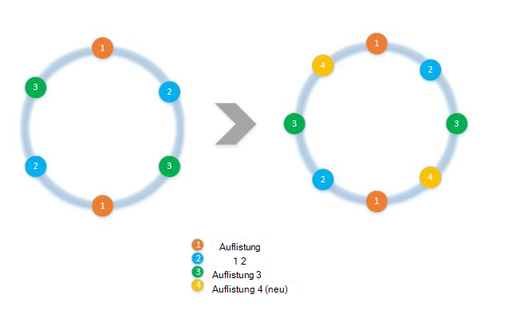
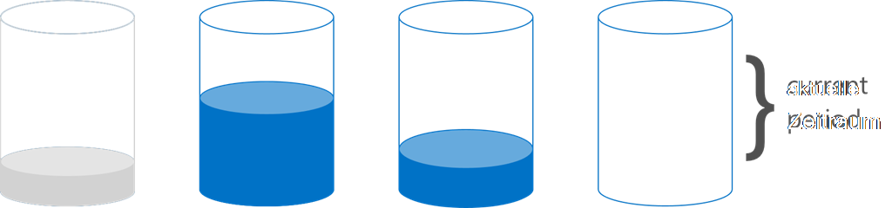

<properties 
    pageTitle="Zum Implementieren der Client-Seite mit SDKs Partitionierung | Microsoft Azure" 
    description="Informationen Sie zum Verwenden von Azure DocumentDB SDKs auf Partition (Splitter) Daten und Route über mehrere Sammlungen" 
    services="documentdb" 
    authors="arramac" 
    manager="jhubbard" 
    editor="cgronlun" 
    documentationCenter=""/>

<tags 
    ms.service="documentdb" 
    ms.workload="data-services" 
    ms.tgt_pltfrm="na" 
    ms.devlang="na" 
    ms.topic="article" 
    ms.date="10/27/2016" 
    ms.author="arramac"/>

# <a name="how-to-partition-data-using-client-side-support-in-documentdb"></a>Partitionieren von Daten mithilfe von Client-seitige Unterstützung in DocumentDB

Azure DocumentDB unterstützt [automatische Partitionierung von Sammlungen](documentdb-partition-data.md). Allerdings sind mit Fällen vorteilhaft, detaillierte Kontrolle Partitionierung Verhalten. Für die Partitionierung Aufgaben erforderlichen Codebausteinen Code zu reduzieren, haben wir Funktionalität hinzugefügt, .NET, Node.js und Java-SDKs, die Clientanwendungen erstellen, die über mehrere Sammlungen skaliert werden vereinfacht.

In diesem Artikel nehmen wir einen Blick auf die Klassen und Schnittstellen in .NET SDK und deren Verwendung partitionierter Anwendungsentwicklung. Andere SDKs Java und Node.js Python unterstützen ähnliche Methoden und Schnittstellen für die clientseitige Partitionierung.

## <a name="client-side-partitioning-with-the-documentdb-sdk"></a>Clientseitige DocumentDB SDK Partitionierung

Bevor wir tiefer in die Partitionierung, lassen Sie uns einige grundlegende DocumentDB Konzepte, die sich auf die Partitionierung rekapitulieren. Jede Azure DocumentDB Konto besteht aus einer Reihe von Datenbanken, jeweils mehrere Sammlungen, die jeweils gespeicherte Prozeduren, Trigger, UDFs, Dokumente und zugehörigen Anlagen enthalten kann. Sammlungen können einer Partition oder partitionierte selbst und haben die folgenden Eigenschaften:

- Sammlungen bieten Performance-Isolierung. Deshalb ein Leistungsvorteil in ähnlichen Dokumenten innerhalb derselben Auflistung sortieren. Beispielsweise Time Series Daten empfiehlt, Daten im letzten Monat, der häufig, in einer Auflistung mit höherem Durchsatz bereitgestellte abgefragt wird während ältere Daten in Sammlungen mit niedrigen bereitgestellte platziert werden.
- ACID-Transaktionen z. B. gespeicherte Prozeduren und Trigger können keine Auflistung umfassen. Transaktionen werden in eine einzelne Partition Schlüsselwert in eine Sammlung begrenzt.
- Sammlungen erzwingen kein Schema für JSON-Dokumente der gleichen Typ oder verschiedene verwendet werden können.

Ab Version [1.5.x Azure DocumentDB SDKs](documentdb-sdk-dotnet.md)können Sie Dokument Operationen direkt mit einer Datenbank durchführen. Intern verwendet ["documentclient"](https://msdn.microsoft.com/library/azure/microsoft.azure.documents.client.documentclient.aspx) das angegebene PartitionResolver für die Datenbank die Weiterleitung von Anfragen zu der entsprechenden Auflistung.

>[AZURE.NOTE] [Serverseitige Partitionierung](documentdb-partition-data.md) eingeführt REST API 2015-12-16 und SDKs 1.6.0+ missbilligt clientseitige Partition Resolver Ansatz für einfache Anwendungsfälle. Clientseitige Partitionierung ist jedoch flexibler und können Sie Performance-Isolierung in Partitionsschlüssel steuern, steuern Grad an Parallelität beim Lesen der Ergebnisse aus mehreren Partitionen und Bereich/räumliche Ansätze und Hash-Partitionierung verwenden.

Beispielsweise ist jede PartitionResolver-Klasse in .NET eine konkrete Implementierung einer [IPartitionResolver](https://msdn.microsoft.com/library/azure/microsoft.azure.documents.client.ipartitionresolver.aspx) -Schnittstelle, die drei – [GetPartitionKey](https://msdn.microsoft.com/library/azure/microsoft.azure.documents.client.ipartitionresolver.getpartitionkey.aspx), [ResolveForCreate](https://msdn.microsoft.com/library/azure/microsoft.azure.documents.client.ipartitionresolver.resolveforcreate.aspx) und [ResolveForRead Methoden](https://msdn.microsoft.com/library/azure/microsoft.azure.documents.client.ipartitionresolver.resolveforread.aspx). LINQ-Abfragen und ReadFeed Iteratoren mithilfe der ResolveForRead-Methode intern durchlaufen alle Sammlungen, die Partitionsschlüssel für die Anforderung entsprechen. Ebenso erstellen Sie Operationen verwenden die ResolveForCreate-Methode zum Weiterleiten an die richtige Partition erstellt. Änderungen Sie keine erforderlich, ersetzen, löschen Sie und Lesen Sie, da sie Dokumenten verwenden, die bereits auf der entsprechenden Auflistung enthalten.

Die SDKs auch zwei Klassen, die unterstützen zwei kanonische Partitionierung Techniken, hashing und Bereich Suchen über [HashPartitionResolver](https://msdn.microsoft.com/library/azure/microsoft.azure.documents.partitioning.hashpartitionresolver.aspx) und [RangePartitionResolver](https://msdn.microsoft.com/library/azure/mt126047.aspx). Diese Klassen können Partitionierungslogik in Ihre Anwendung integrieren.  

## <a name="add-partitioning-logic-and-register-the-partitionresolver"></a>Fügen Sie Partitionierungslogik hinzu und registrieren Sie der PartitionResolver 

Hier ist ein Ausschnitt zeigt, wie [HashPartitionResolver](https://msdn.microsoft.com/library/azure/microsoft.azure.documents.partitioning.hashpartitionresolver.aspx) erstellt und mit "documentclient" für eine Datenbank registriert.

```cs
// Create some collections to partition data.
DocumentCollection collection1 = await client.CreateDocumentCollectionAsync(...);
DocumentCollection collection2 = await client.CreateDocumentCollectionAsync(...);

// Initialize a HashPartitionResolver using the "UserId" property and the two collection self-links.
HashPartitionResolver hashResolver = new HashPartitionResolver(
    u => ((UserProfile)u).UserId, 
    new string[] { collection1.SelfLink, collection2.SelfLink });

// Register the PartitionResolver with the database.
this.client.PartitionResolvers[database.SelfLink] = hashResolver;

```

## <a name="create-documents-in-a-partition"></a>Erstellen von Dokumenten in einer partition  

Sobald die PartitionResolver registriert ist, können erstellt und direkt gegen die Datenbank Abfragen, wie unten dargestellt. In diesem Beispiel verwendet das SDK der PartitionResolver extrahieren UserId hash versehen und verwenden diesen Wert den Vorgang zum Erstellen der richtigen Auflistung weiterleiten.

```cs
Document johnDocument = await this.client.CreateDocumentAsync(
    database.SelfLink, new UserProfile("J1", "@John", Region.UnitedStatesEast));
Document ryanDocument = await this.client.CreateDocumentAsync(
    database.SelfLink, new UserProfile("U4", "@Ryan", Region.AsiaPacific, UserStatus.AppearAway));
```

## <a name="create-queries-against-partitions"></a>Erstellen von Abfragen für Partitionen  

Sie können Abfragen mithilfe der [CreateDocumentQuery](https://msdn.microsoft.com/library/azure/microsoft.azure.documents.linq.documentqueryable.createdocumentquery.aspx) -Methode Partitionsschlüssel an die Datenbank übergeben. Die Abfrage gibt ein einzelnes Resultset über alle Sammlungen in der Datenbank, die die Partitionsschlüssel zuordnen.  

```cs
// Query for John's document by ID - uses PartitionResolver to restrict the query to the partitions 
// containing @John. Again the query uses the database self link, and relies on the hash resolver 
// to route the appropriate collection.
var query = this.client.CreateDocumentQuery<UserProfile>(
    database.SelfLink, null, partitionResolver.GetPartitionKey(johnProfile))
    .Where(u => u.UserName == "@John");
johnProfile = query.AsEnumerable().FirstOrDefault();
```

## <a name="create-queries-against-all-collections-in-the-database"></a>Erstellen von Abfragen für alle Sammlungen in der Datenbank 

Sie können auch alle Sammlungen in der Datenbank Abfragen und Auflisten der Ergebnisse wie unten überspringen Arguments Partition.

```cs
// Query for all "Available" users. Here since there is no partition key, the query is serially executed 
// across each partition/collection and returns a single result-set. 
query = this.client.CreateDocumentQuery<UserProfile>(database.SelfLink)
    .Where(u => u.Status == UserStatus.Available);
foreach (UserProfile activeUser in query)
{
    Console.WriteLine(activeUser);
}
```

## <a name="hash-partition-resolver"></a>Hash-Partitionsresolver
Mit Hashpartitionierung werden Partitionen basierend auf dem Wert einer Hashfunktion können Sie Anfragen und Daten über mehrere Partitionen verteilen. Dieser Ansatz wird meist Partition Daten erstellt oder aus einer Vielzahl von unterschiedlichen Clients verwendet und eignet sich zum Speichern von Benutzerprofilen, Katalogelemente und Telemetriedaten IoT ("Internet der Dinge"). Hashpartitionierung ist auch von DocumentDBs serverseitigen Partitionierungsunterstützung innerhalb einer Auflistung verwendet.

**Hash-Partitionierung:**


Eine einfache Hashpartitionierung Schema über *N* Sammlungen wäre, jedem Dokument berechnen *hash(d) mod N* um festzustellen welche Auflistung versehen wurde. Ein Problem mit diesem einfachen Verfahren ist jedoch, dass es nicht funktioniert, wenn Sie neue Sammlungen hinzufügen oder Sammlungen entfernen, wie fast alle Daten erhalten gemischt werden müsste. [Konsistente hashing] (http://citeseerx.ist.psu.edu/viewdoc/summary?doi=10.1.1.23.3738) ist ein Algorithmus, der zu diesem Zweck ein Hashingschema, das den Betrag des Datentransfers während hinzufügen oder Entfernen von Sammlungen minimiert implementieren.

[HashPartitionResolver](https://msdn.microsoft.com/library/azure/microsoft.azure.documents.partitioning.hashpartitionresolver.aspx) -Klasse implementiert die Logik zu konsistenten Hash Ring die Hash-Funktion in der [IHashGenerator](https://msdn.microsoft.com/library/azure/microsoft.azure.documents.partitioning.ihashgenerator.aspx) -Schnittstelle angegeben. Standardmäßig der HashPartitionResolver eine MD5-Hash-Funktion verwendet, aber Sie können dies mit hashing Implementierung austauschen. Der HashPartitionResolver erstellt intern 16 Hashes oder "virtuellen Knoten" innerhalb der Hash für jede Auflistung um eine gleichmäßigere Verteilung der Dokumente über die Sammlungen zu erreichen, aber diese Zahl einzutauschen Schiefe Daten mit dem Client Side Berechnung variieren.

**Konsistente hashing mit HashPartitionResolver:**


## <a name="range-partition-resolver"></a>Partitionsresolver Bereich

Im Bereichspartitionierung werden Partitionen basiert, ob der Partitionsschlüssel innerhalb eines bestimmten Bereichs. Dies wird häufig für die Partitionierung mit Zeitstempel (z.B. EventTime zwischen dem 1. April 2015 und 14. Apr 2015) verwendet. Die [RangePartitionResolver](https://msdn.microsoft.com/library/azure/mt126047.aspx) -Klasse hilft Ihnen eine Zuordnung zwischen\<T\> und sich selbst zu verknüpfen. 

[Bereich\<T\> ](https://msdn.microsoft.com/library/azure/mt126048.aspx) ist eine einfache Klasse, die alle Bereiche verwaltet, die IComparable implementieren\<T\> und IEquatable\<T\> wie Zeichenfolgen oder Zahlen. Für liest und erstellt, können Sie einen beliebigen Bereich übergeben und die Auflösung identifiziert alle Kandidaten Sammlungen von identifiziert die Bereiche überschneiden Partitionen im angeforderten Bereich. Dies kann hilfreich sein beim Serie Daten Bereichsabfragen.

**Bereich der Partitionierung:**  

  

Sonderfall der Bereichspartitionierung ist der Bereich nur einen einzelnen Wert, "Lookup Partitionierung" bezeichnet wird. Dies wird häufig verwendet für die Partitionierung nach Region (z.B. die Partition für Skandinavien enthält Norwegen, Dänemark und Schwedens) oder Mieter in einer mehrinstanzenfähigen Anwendung partitionieren.

## <a name="samples"></a>Beispiele 

Betrachten Sie [DocumentDB Partitionierung Beispiele Github Projekt](https://github.com/Azure/azure-documentdb-dotnet/tree/287acafef76ad223577759b0170c8f08adb45755/samples/code-samples/Partitioning) mit Codeausschnitten wie diese PartitionResolvers und erweitern sie Implementieren eigener Resolver bestimmten Fällen wie folgt anpassen: 

* Wie ein beliebiger Lambda-Ausdruck für GetPartitionKey und Partitionierung Verbundschlüssel implementieren bzw. verschiedene Objekte unterschiedlich partitioniert.
* Eine einfache [LookupPartitionResolver](https://github.com/Azure/azure-documentdb-dotnet/blob/287acafef76ad223577759b0170c8f08adb45755/samples/code-samples/Partitioning/Partitioners/LookupPartitionResolver.cs) zu erstellen, mit denen eine Nachschlagetabelle Manuelle Partitionierung durchführen Dieses Muster wird häufig zur Partitionierung basierend auf diskrete Werte wie Region, Mandanten-ID oder Anwendung Namen.
* Erstellen einer [ManagedPartitionResolver](https://github.com/Azure/azure-documentdb-dotnet/blob/287acafef76ad223577759b0170c8f08adb45755/samples/code-samples/Partitioning/Partitioners/ManagedHashPartitionResolver.cs) , der Sammlungen basierend auf einer Vorlage, die definiert ein Benennungsschema, IndexingPolicy und gespeicherte Prozeduren, die für neue Registrierung, automatisch erstellt.
* Schema weniger [SpilloverPartitionResolver](https://github.com/Azure/azure-documentdb-dotnet/blob/287acafef76ad223577759b0170c8f08adb45755/samples/code-samples/Partitioning/Partitioners/SpilloverPartitionResolver.cs) erstellen, die die Sammlungen füllen einfach neue Sammlungen erstellt
* Zum Serialisieren und Deserialisieren der PartitionResolver Zustand als JSON, sodass zwischen Prozessen und Herunterfahren verwenden können. Sie können in Dateien oder sogar in eine DocumentDB Auflistung beibehalten.
* [DocumentClientHashPartitioningManager](https://github.com/Azure/azure-documentdb-dotnet/blob/287acafef76ad223577759b0170c8f08adb45755/samples/code-samples/Partitioning/Util/DocumentClientHashPartitioningManager.cs) -Klasse dynamisch hinzufügen und Entfernen von Partitionen in eine partitionierte Datenbank basierend auf konsistente hashing. Intern verwendet eine [TransitionHashPartitionResolver](https://github.com/Azure/azure-documentdb-dotnet/blob/287acafef76ad223577759b0170c8f08adb45755/samples/code-samples/Partitioning/Partitioners/TransitionHashPartitionResolver.cs) , Route liest und schreibt während der Migration mit einem der vier Modi - Lesen aus der alten Partitionierungsschema (ReadCurrent), die (ReadNext) zusammenführen Ergebnisse (ReadBoth) oder während der Migration (keine) nicht verfügbar sein.

Beispiele sind open Source und wir empfehlen Ihnen, ziehen mit einzureichen, die andere Entwickler DocumentDB profitieren. Finden Sie den [Beitrag Richtlinien](https://github.com/Azure/azure-documentdb-net/blob/master/Contributing.md) wie beitragen.  

>[AZURE.NOTE] Sammlung sind begrenzt durch DocumentDB, damit einige der hier gezeigten Beispielmethoden einige Minuten dauern.

##<a name="faq"></a>Häufig gestellte Fragen
**Unterstützt DocumentDB serverseitige Partitionierung?**

Ja, unterstützt DocumentDB [serverseitige Partitionierung](documentdb-partition-data.md). DocumentDB unterstützt auch clientseitige Partitionierung über clientseitigen Partition Resolver für erweiterte Anwendungsfälle.

**Wann sollte serverseitige und clientseitige Partitionierung verwenden?**
Für die meisten Anwendungsfälle empfehlen wir die Verwendung von serverseitigen Partitionierung, da die administrativen Aufgaben der Partitionierung von Daten und Weiterleitung von Anfragen behandelt. Aber wenn Bereich Partitionierung oder einen spezialisierten Anwendungsfall Performance voneinander verschieden Partitionsschlüssel haben, clientseitige Partitionierung empfiehlt es sich möglicherweise.

**Wie hinzufügen oder entfernen eine Auflistung zu meinem Partitionierungsschema?**

Betrachten Sie die Implementierung des DocumentClientHashPartitioningManager in das Beispielprojekt beispielsweise zum Neupartitionieren implementieren.

**Wie beibehalten oder freigeben Meine Partitionskonfiguration für andere Clients?**

Den Partitionierer Zustand als JSON serialisiert können und in Konfigurationsdateien oder sogar in DocumentDB Sammlungen gespeichert. Betrachten Sie die RunSerializeDeserializeSample-Methode im Beispielprojekt beispielsweise.

**Wie wird Kette Partitionierung Techniken?**

Implementieren eine eigene IPartitionResolver, die intern eine oder mehrere vorhandene Konfliktlöser verwendet, um PartitionResolvers zu verketten. Betrachten Sie TransitionHashPartitionResolver in das Beispielprojekt beispielsweise.

##<a name="references"></a>Referenzen
* [Serverseitige Partitionierung in DocumentDB](documentdb-partition-data.md)
* [DocumentDB Sammlungen und Leistung](documentdb-performance-levels.md)
* [Codebeispiele für Github-Partitionierung](https://github.com/Azure/azure-documentdb-dotnet/tree/287acafef76ad223577759b0170c8f08adb45755/samples/code-samples/Partitioning)
* [DocumentDB .NET SDK-Dokumentation in der MSDN Library](https://msdn.microsoft.com/library/azure/dn948556.aspx)
* [DocumentDB .NET-Beispiele](https://github.com/Azure/azure-documentdb-net)
* [DocumentDB-Grenzwerte](documentdb-limits.md)
* [DocumentDB Blog Tipps](https://azure.microsoft.com/blog/2015/01/20/performance-tips-for-azure-documentdb-part-1-2/)
 
