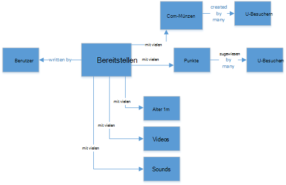
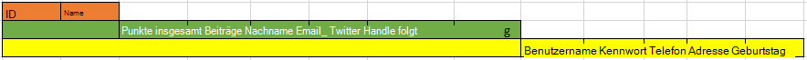
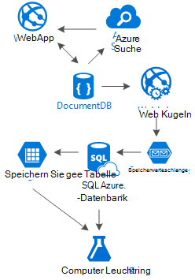

<properties 
    pageTitle="DocumentDB-Entwurfsmuster: soziale Medien-apps | Microsoft Azure" 
    description="Erfahren Sie mehr über ein Entwurfsmuster für soziale Netzwerke durch flexible DocumentDB und andere Azure-Dienste nutzen." 
    keywords="soziale Medien-apps"
    services="documentdb" 
    authors="ealsur" 
    manager="jhubbard" 
    editor="" 
    documentationCenter=""/>

<tags 
    ms.service="documentdb" 
    ms.workload="data-services" 
    ms.tgt_pltfrm="na" 
    ms.devlang="na" 
    ms.topic="article" 
    ms.date="09/27/2016" 
    ms.author="mimig"/>

# Wird mit DocumentDB

In einer massiv miteinander Gesellschaft bedeutet, dass irgendwann im Leben in einem **sozialen Netzwerk**werden. Wir verwenden soziale Netzwerken Kontakt mit Freunden, Kollegen, Familie, oder unsere Leidenschaft für Personen mit gemeinsamen Interessen.

Ingenieure oder Entwickler wir möglicherweise haben gefragt, wie diese Netzwerke speichern und unsere Daten verbinden oder möglicherweise haben auch erstellen oder ein neues soziales Netzwerk für einen bestimmten Nischenmarkt Architekt sich beauftragt wurde. Da die große Frage: wie diese Daten gespeichert?

Nehmen wir an, wir ein neues und glänzendes sozialen Netzwerk erstellen, in denen Benutzer mit verwandten Medien wie Bilder, Videos oder Musik Artikel können. Benutzer können Beiträge Kommentieren und geben für die Bewertung. Feed Beiträge, die Benutzern angezeigt werden und auf die Hauptseite Zielseite interagieren. Dies klingt nicht wirklich komplex (zunächst), aber der Einfachheit halber wir stehen (können wir uns mit benutzerdefinierten Feeds Beziehungen betroffen, aber übersteigt das Ziel dieses Artikels).

So, wie wir diese speichern und wo?

Viele von Ihnen möglicherweise verfügen über Erfahrung in SQL-Datenbanken oder zumindest Konzept der [relationalen Daten modellieren](https://en.wikipedia.org/wiki/Relational_model) und möglicherweise versucht zeichnen etwas:

 

Perfekt normalisiert und ziemlich Datenstruktur... die nicht skaliert werden. 

Nicht falsch, ich arbeite mit SQL-Datenbanken mein Leben Sie jedoch jedes Muster, Verfahren und Software-Plattform eignet sich nicht für jedes Szenario.

Warum nicht SQL in diesem Szenario am besten? Sehen wir uns die Struktur einer Post wollte, Post in eine Website oder Anwendung anzeigen müsste ich eine Abfrage mit... 8 gezählt (!) nur einen einzigen Post, Bild anzeigen Stream Beiträge, die dynamisch geladen und erscheinen auf dem Bildschirm sehen, werde.

Wir, natürlich können humongous SQL-Instanz mit ausreichend Strom zu Tausenden von Abfragen mit diesen viele Joins zu Inhalt, aber, warum wir beim eine einfachere Lösung?

## NoSQL-Straße

Spezielle Diagramm Datenbanken, die [in Azure ausgeführt](http://neo4j.com/developer/guide-cloud-deployment/#_windows_azure) aber nicht kostengünstig und erfordert IaaS (Infrastruktur als Dienst, virtuelle Computer hauptsächlich) und Wartung. Ich werde Ziel dieser Artikel auf eine kostengünstigere Lösung, die funktioniert in den meisten Fällen auf Azure NoSQL-Datenbank [DocumentDB](https://azure.microsoft.com/services/documentdb/). Mit einem Ansatz [NoSQL](https://en.wikipedia.org/wiki/NoSQL) Daten im JSON-Format speichern und Anwenden von [denormalisierung](https://en.wikipedia.org/wiki/Denormalization)kann unsere zuvor komplizierte Post in einem einzigen [Dokument](https://en.wikipedia.org/wiki/Document-oriented_database)umgewandelt werden:

    {
        "id":"ew12-res2-234e-544f",
        "title":"post title",
        "date":"2016-01-01",
        "body":"this is an awesome post stored on NoSQL",
        "createdBy":User,
        "images":["http://myfirstimage.png","http://mysecondimage.png"],
        "videos":[
            {"url":"http://myfirstvideo.mp4", "title":"The first video"},
            {"url":"http://mysecondvideo.mp4", "title":"The second video"}
        ],
        "audios":[
            {"url":"http://myfirstaudio.mp3", "title":"The first audio"},
            {"url":"http://mysecondaudio.mp3", "title":"The second audio"}
        ]
    }

Und mit einer einzigen Abfrage und keine Joins abgerufen werden kann. Ist viel einfacher und Budget, erfordert weniger Ressourcen, die ein besseres Ergebnis zu erzielen.

Azure DocumentDB stellt sicher, dass alle Eigenschaften durch die [automatische Indizierung](documentdb-indexing.md)indiziert werden kann [angepasst](documentdb-indexing-policies.md)werden. Schema frei Ansatz ermöglicht speichern Dokumente mit verschiedenen und dynamische, vielleicht morgen stellen eine Liste von Kategorien oder Hashtags zugeordnet werden soll, DocumentDB behandelt neue Dokumente mit hinzugefügten Attribute mit ohne zusätzlichen Aufwand von uns.

Kommentare zu einem Beitrag können andere Beiträge mit einer übergeordneten Eigenschaft gleichgestellt (vereinfacht Objekt-Zuordnung). 

    {
        "id":"1234-asd3-54ts-199a",
        "title":"Awesome post!",
        "date":"2016-01-02",
        "createdBy":User2,
        "parent":"ew12-res2-234e-544f"
    }

    {
        "id":"asd2-fee4-23gc-jh67",
        "title":"Ditto!",
        "date":"2016-01-03",
        "createdBy":User3,
        "parent":"ew12-res2-234e-544f"
    }

Und alle Interaktionen können auf einem anderen Objekt als Zähler gespeichert werden:

    {
        "id":"dfe3-thf5-232s-dse4",
        "post":"ew12-res2-234e-544f",
        "comments":2,
        "likes":10,
        "points":200
    }

Erstellen von Feeds ist nur eine Frage Erstellen von Dokumenten, die eine Liste der Beitrag-Ids mit einer bestimmten Bedeutung enthalten kann:

    [
        {"relevance":9, "post":"ew12-res2-234e-544f"},
        {"relevance":8, "post":"fer7-mnb6-fgh9-2344"},
        {"relevance":7, "post":"w34r-qeg6-ref6-8565"}
    ]

Wir konnten "neuesten" Stream mit nach dem Erstellungsdatum sortiert, "heißesten" Stream mit diesen Stellen mit mehr mag in den letzten 24 Stunden können wir auch Streamklassen für jeden Benutzer auf der Grundlage Logik wie Anhänger und Interessen implementieren und es wäre eine Liste der Beiträge. Es geht wie diese Listen lesen Leistung bleibt jedoch ungehindert. Sobald wir diese Listen erwerben, erteilen wir eine einzelne Abfrage DocumentDB mit dem [Operator](documentdb-sql-query.md#where-clause) zu Seiten stellen gleichzeitig.

Feed Streams mit Hintergrundprozessen [Azure App Services](https://azure.microsoft.com/services/app-service/) erstellt werden konnte: [Webaufträge](../app-service-web/web-sites-create-web-jobs.md). Erstellte ein kann im Hintergrund mithilfe von [Azure Storage](https://azure.microsoft.com/services/storage/) [Warteschlangen](../storage/storage-dotnet-how-to-use-queues.md) und Webaufträge ausgelöst, mit dem [Azure Webaufträge SDK](../app-service-web/websites-dotnet-webjobs-sdk.md), Weitergabe Post in Datenströme Grundlage eigener benutzerdefinierter Logik implementieren ausgelöst werden. 

Punkte und wie über einen Beitrag können mit dieser Technik eine schließlich konsistente Umgebung erstellen verzögert verarbeitet werden.

Anhänger sind schwieriger. DocumentDB haben ein Dokument Limit von 512Kb speichern Anhänger als Dokument mit dieser Struktur kann man:

    {
        "id":"234d-sd23-rrf2-552d",
        "followersOf": "dse4-qwe2-ert4-aad2",
        "followers":[
            "ewr5-232d-tyrg-iuo2",
            "qejh-2345-sdf1-ytg5",
            //...
            "uie0-4tyg-3456-rwjh"
        ]
    }

Dies funktioniert für Benutzer mit ein paar tausend Anhänger aber, wenn einige Prominenten die Reihen dieses Ansatzes wird schließlich verknüpft Cap Größe Dokument erreicht.

Zur Lösung dieses Problems können wir einen gemischten Ansatz. Benutzerstatistik Dokument können wir die Anzahl der Anhänger speichern:

    {
        "id":"234d-sd23-rrf2-552d",
        "user": "dse4-qwe2-ert4-aad2",
        "followers":55230,
        "totalPosts":452,
        "totalPoints":11342
    }

Und das aktuelle Diagramm Anhänger auf Azure mit einer [Erweiterung](https://github.com/richorama/AzureStorageExtensions#azuregraphstore) , einfache "A folgt B" Speichern und Abrufen von ermöglicht, Tabellen gespeichert werden. Auf diese Weise können wir den Prozess des Abrufens der genauen Anhänger Liste (Wenn sie benötigt) Azure Tabellen jedoch für eine Direktwahlnummern delegieren halten wir DocumentDB verwenden.

## Die "Leiter" Muster und Daten Duplizierung

Wie Sie im JSON-Dokument, die einen Beitrag verweist bemerkt haben, sind mehrere Vorkommen eines Benutzers. Und Sie würden ahnen richtig, dies bedeutet, dass die Informationen Benutzers, diese denormalisierung mehr als einmal vorhanden.

Um schnellere Abfragen ermöglichen, verursachen wir an. Dieser Nebeneffekt problematisch ist, wenn durch eine Aktion des Benutzers Daten ändert, wir müssen alle Aktivitäten er jemals haben und alle aktualisieren. Klingt sehr praktisch, oder?

Diagrammdatenbanken auf ihre Weise lösen, werden wir Lösen von Key Attribute eines Benutzers, die wir in unserer Anwendung für jede Aktivität angezeigt. Wenn wir visuell ein Beitrags in unserer Anwendung anzeigen und nur des Erstellers Name und Bild, speichern alle Benutzerdaten Warum im Attribut "CreatedBy"? Wenn für jeden Kommentar wir nur das Bild anzuzeigen, brauchen wir nicht wirklich den Rest der Daten. Kommt, was ich nenne "Leiter Muster" ins Spiel.

Werfen Sie Benutzerinformationen als Beispiel:

    {
        "id":"dse4-qwe2-ert4-aad2",
        "name":"John",
        "surname":"Doe",
        "address":"742 Evergreen Terrace",
        "birthday":"1983-05-07",
        "email":"john@doe.com",
        "twitterHandle":"@john",
        "username":"johndoe",
        "password":"some_encrypted_phrase",
        "totalPoints":100,
        "totalPosts":24
    }
    
Anhand dieser Informationen erkennen wir schnell die Informationen und die nicht, wodurch "Leiter":

Der kleinste Schritt heißt UserChunk, minimale Informationseinheit, die einen Benutzer identifiziert und dient zur Bereinigung. Durch die Reduzierung der duplizierten Daten nur die Informationen, die wir "zeigen", vermeiden wir umfassende Updates.

Mittlere Stufe den Benutzer aufgerufen wird, wird die Daten, die für die meisten Abfragen leistungsabhängige DocumentDB zugänglich und wichtige verwendet werden. Es enthält Informationen, die durch ein UserChunk dargestellt.

Der größte ist der Benutzer erweitert. Es enthält alle kritischen Informationen und andere Daten, die sehr schnell gelesen werden müssen oder die Verwendung (wie der Anmeldevorgang) hin. Diese Daten können außerhalb DocumentDB in Azure SQL-Datenbank oder Azure Tabellen gespeichert werden.

Warum würden wir sogar an verschiedenen Orten speichern diese Informationen und teilen Sie den Benutzer? Da in DocumentDB [nicht unendlich](documentdb-limits.md) ist und von einem Punkt anzeigen, desto Dokumente, die teurer Abfragen. Bewahren Sie Dokumente mit den richtigen Informationen an alle Ihre leistungsabhängige Abfragen für Ihr soziales Netzwerk und speichern die zusätzliche Informationen für mögliche Szenarios wie vollständiges Profil bearbeiten, Benutzernamen, Datamining für Verwendungsanalysen und Big Data Initiativen slim. Wir nicht wirklich Wenn Datenerfassung für Datamining langsamer ist, da auf Azure SQL-Datenbank ausgeführt wird, wir haben betreffen jedoch, dass unsere Benutzer schnellen und schlank. Ein Benutzer, auf DocumentDB gespeichert würde wie folgt aussehen:

    {
        "id":"dse4-qwe2-ert4-aad2",
        "name":"John",
        "surname":"Doe",
        "username":"johndoe"
        "email":"john@doe.com",
        "twitterHandle":"@john"
    }

Und ein würde wie folgt aussehen:

    {
        "id":"1234-asd3-54ts-199a",
        "title":"Awesome post!",
        "date":"2016-01-02",
        "createdBy":{
            "id":"dse4-qwe2-ert4-aad2",
            "username":"johndoe"
        }
    }

Bearbeitung auftritt, eines der Attribute des Abschnitts betroffen ist, ist einfach zu der betroffenen Dokumente mithilfe von Abfragen, die auf die indizierte Attribute (Wählen Sie * Beiträge von p WHERE p.createdBy.id == "Edited_user_id") und dann die Blöcke.

## Das Suchfeld

Benutzer werden Glücklicherweise viel Inhalt generiert. Wir sollen ermöglichen das Suchen und finden von Inhalten, die nicht direkt in die Seiteninhalte vielleicht weil wir nicht die Ersteller folgen und vielleicht wir nur Suchen nach alten Post vor sechs Monaten haben.

Glücklicherweise und da wir Azure DocumentDB verwenden, können wir einfach eine Suchmaschine mit [Azure suchen](https://azure.microsoft.com/services/search/) in ein paar Minuten und ohne Eingabe einer Codezeile (außer natürlich, Suche und Benutzeroberfläche) implementieren.

Warum ist dies so einfach?

Azure Suche implementiert [Indexer](https://msdn.microsoft.com/library/azure/dn946891.aspx)Hintergrundprozesse nennen sie, die Daten-Repositories verknüpfen und automatisch hinzufügen, aktualisieren oder Entfernen Ihrer Objekte indiziert. Sie unterstützen eine [Azure SQL-Datenbank Indexer](https://blogs.msdn.microsoft.com/kaevans/2015/03/06/indexing-azure-sql-database-with-azure-search/) [Azure-Blobs Indexer](../search/search-howto-indexing-azure-blob-storage.md) und Glücklicherweise [Azure DocumentDB Indexer](../documentdb/documentdb-search-indexer.md). Der Übergang von DocumentDB Azure Suche ist einfach, als beide Speicherinformationen im JSON-Format, wir müssen [unser Index erstellen](../search/search-create-index-portal.md) Karte die Attribute Dokumente empfiehlt indiziert und, in wenigen Minuten (je nach der Größe der Daten), unsere Inhalte werden in Cloud-Infrastruktur für die beste Lösung suchen als Dienst, durchsucht werden. 

Weitere Informationen zu Azure Search finden Sie auf [Anhalter suchen](https://blogs.msdn.microsoft.com/mvpawardprogram/2016/02/02/a-hitchhikers-guide-to-search/).

## Das zugrunde liegende wissen

Nach dem Speichern dieser Inhalte, die täglich wächst, finden wir uns denken: wie kann ich mit diesem Stream von Informationen vom Benutzer?

Die Antwort ist einfach: es zu arbeiten und lernen.

Aber was können wir lernen? Einfache Beispiele [stimmungsanalyse](https://en.wikipedia.org/wiki/Sentiment_analysis)Content eingeführter auf die Benutzervoreinstellungen oder sogar ein automatisierter Content Moderator, der sicherstellt, dass alle sozialen Netzwerk veröffentlicht für die Familie.

Jetzt, dass ich Dich, werden Sie wahrscheinlich denken, Sie benötigen einige PhD in Mathematik Wissenschaft diese Muster und Informationen aus einfachen Datenbanken und Dateien, aber Sie wäre.

[Azure Machine Learning](https://azure.microsoft.com/services/machine-learning/)Teil [Cortana Intelligence Suite](https://www.microsoft.com/en/server-cloud/cortana-analytics-suite/overview.aspx)ist die ein vollständig verwaltete Cloud-Dienst, das Erstellen von Workflows mit Algorithmen in eine einfache Drag & Drop-Schnittstelle code eigenen Algorithmen [r](https://en.wikipedia.org/wiki/R_(programming_language)) oder einige bereits erstellt und APIs wie verwenden: [Textanalyse](https://gallery.cortanaanalytics.com/MachineLearningAPI/Text-Analytics-2), [Content Moderator](https://www.microsoft.com/moderator) oder [Recommendations](https://gallery.cortanaanalytics.com/MachineLearningAPI/Recommendations-2).

Erreichung eines dieser Szenarien maschinelles lernen wir [Azure Data Lake](https://azure.microsoft.com/services/data-lake-store/) verwenden, um Informationen aus unterschiedlichen Quellen aufnehmen und verwenden [U-SQL](https://azure.microsoft.com/documentation/videos/data-lake-u-sql-query-execution/) zu Informationen generieren, die von Azure Machine Learning verarbeitet werden können.

Eine weitere verfügbare Option ist die [Kognitive von Microsoft](https://www.microsoft.com/cognitive-services) Benutzer Inhalt analysieren. nicht nur können wir verstehen (durch Analysieren, was sie mit [Text Analytics API](https://www.microsoft.com/cognitive-services/en-us/text-analytics-api)schreiben), sondern wir auch unerwünschte oder ältere Inhalte erkennen und entsprechend handeln [Computer Vision](https://www.microsoft.com/cognitive-services/en-us/computer-vision-api)API. Kognitive Leistungen Out-of-the-Box-Lösungen, die beliebige Computerlernen wissen müssen.

## Abschluss

In diesem Artikel versucht beleuchten alternativen von sozialen Netzwerken vollständig in Azure mit kostengünstigen und hervorragende Ergebnisse durch Förderung einer mehrstufigen Speicher Lösung und Daten Verteilung "Leiter" bezeichnet.

Die Wahrheit ist, dass es kein Allheilmittel für diese Art von Szenarien ist die Synergie aus hervorragende Dienstleistungen, die Erlebnisse zu ermöglichen: die Geschwindigkeit und Azure DocumentDB ermöglicht eine große soziale Anwendung der Logik hinter einer erstklassigen suchen wie Azure, auch die Flexibilität der Azure-Anwendungsdienste Host sprachunabhängig Applikationen aber leistungsstarken Hintergrundprozesse und erweiterbare Azure Storage und Azure SQL-Datenbank für nicht Speichern riesige Mengen an Daten und analytische Leistungsfähigkeit von Azure Machine Learning wissen und Intelligenz, mit der Prozesse und helfen uns die richtigen Benutzer die richtige Inhalte liefern Feedback geben kann.

## Nächste Schritte

Weitere Informationen über die Modellierung von [Modelldaten in DocumentDB](documentdb-modeling-data.md) lesen. Wenn Sie in anderen Fällen für DocumentDB interessiert sind, finden Sie unter [Allgemeine DocumentDB Anwendungsfälle](documentdb-use-cases.md).

Oder erfahren Sie mehr über DocumentDB des [DocumentDB Learning Path](https://azure.microsoft.com/documentation/learning-paths/documentdb/).
