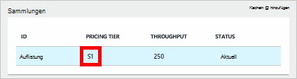
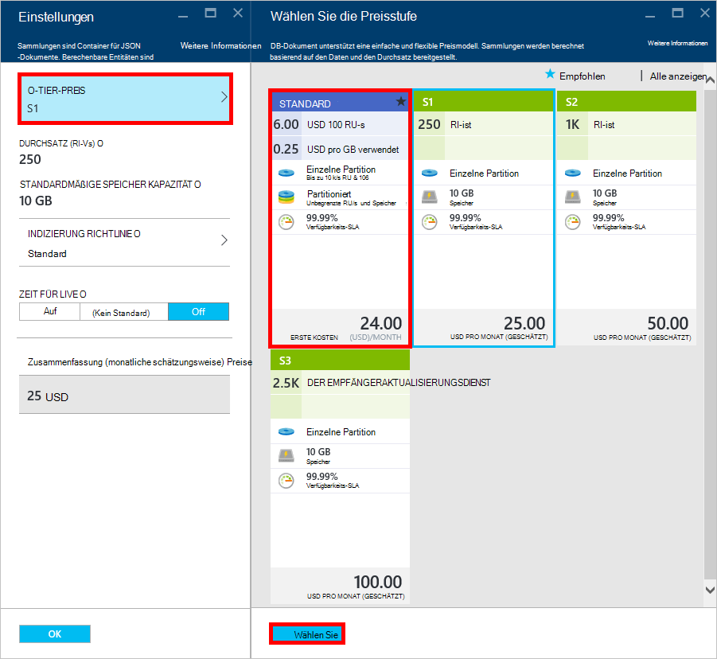
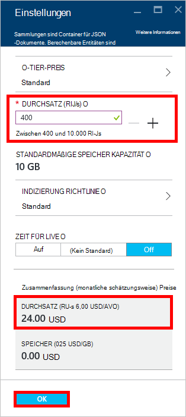
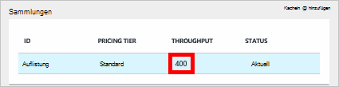

<properties 
    pageTitle="Enorme Leistungssteigerung für Ihr Konto DocumentDB S1 | Microsoft Azure" 
    description="Nutzen Sie Durchsatz in Ihrem DocumentDB S1-Konto durch ein paar einfache Änderungen in Azure-Portal." 
    services="documentdb" 
    authors="mimig1" 
    manager="jhubbard" 
    editor="monicar" 
    documentationCenter=""/>

<tags 
    ms.service="documentdb" 
    ms.workload="data-services" 
    ms.tgt_pltfrm="na" 
    ms.devlang="na" 
    ms.topic="article" 
    ms.date="08/25/2016" 
    ms.author="mimig"/>

# Enorme Leistungssteigerung für Ihr DocumentDB-Konto

Gehen Sie Durchsatz für Ihr Azure DocumentDB S1-Konto nutzen. Mit geringer oder ganz ohne zusätzliche Kosten können Sie Ihr vorhandenes Konto S1 von 250 [RU-s](documentdb-request-units.md) 400 RU-s oder mehr Durchsatz erhöhen.  

> [AZURE.VIDEO changedocumentdbcollectionperformance]

## Benutzerdefinierter Performance im Azure-Portal ändern

1. Navigieren Sie in Ihrem Browser zum [**Azure-Portal**](https://portal.azure.com). 
2. Klicken Sie auf **Durchsuchen,** -> **DocumentDB (NoSQL)**, und wählen Sie dann das DocumentDB-Konto ändern.   
3. Wählen Sie in der Linse **Datenbanken** die Datenbank ändern und wählen Sie die Auflistung mit S1 Tarif Blatt **Datenbank** .

      

4. Blatt **Auflistung** klicken Sie auf **Weitere**und dann auf **Settings**.   
5. Blatt **Einstellungen** auf **Tier-Preisen** und monatliche Vorkalkulation für jeden Plan angezeigt. Blatt **Auswählen der Tarif** auf **Standard**und dann auf **auswählen** , um die Änderung zu speichern.

      

6. Im Blatt **Einstellungen** **Tier Preise** **Standard** geändert und das **Durchsatz (RU/s)** mit einem Standardwert von 400 angezeigt. Klicken Sie auf **OK** , um die Änderungen zu speichern. 

    > [AZURE.NOTE] Den Durchsatz zwischen 400 und 10.000 [Anforderung Einheiten](../articles/documentdb/documentdb-request-units.md)festgelegt MHzProzessoren (RU/s). Die **Preise Zusammenfassung** unten auf der Seitenupdates automatisch eine Schätzung der monatlichen Kosten.
    
    

8. Auf Blatt **Datenbank** können Sie den Kompressor Durchsatz der Auflistung überprüfen. 

    

Weitere Informationen über die Änderungen benutzerdefinierte und vordefinierte Durchsatz finden Sie im Blogbeitrag [DocumentDB: mit den neuen Preisen Optionen erfahren alles](https://azure.microsoft.com/blog/documentdb-use-the-new-pricing-options-on-your-existing-collections/).

## Nächste Schritte

Wenn Sie feststellen, dass Sie einen höheren Durchsatz (größer als 10.000 RU-s) oder mehr Speicher (größer als 10 GB) können Sie eine partitionierte Auflistung erstellen. Zum Erstellen einer partitionierten Auflistung finden Sie unter [Erstellen einer Sammlung](documentdb-create-collection.md).