<properties
    pageTitle="DocumentDB Document Explorer JSON anzeigen | Microsoft Azure"
    description="Erfahren Sie mehr über DocumentDB Document Explorer ein Azure-Portal Tool JSON anzeigen, bearbeiten, erstellen und JSON-Dokumente mit DocumentDB eine Datenbank NoSQL hochladen."
        keywords="Json anzeigen"
    services="documentdb"
    authors="kirillg"
    manager="jhubbard"
    editor="monicar"
    documentationCenter=""/>

<tags
    ms.service="documentdb"
    ms.workload="data-services"
    ms.tgt_pltfrm="na"
    ms.devlang="na"
    ms.topic="article"
    ms.date="08/30/2016"
    ms.author="kirillg"/>

# Anzeigen, bearbeiten, erstellen und JSON-Dokumente mit DocumentDB Document Explorer hochladen

Dieser Artikel bietet eine Übersicht über [Microsoft Azure DocumentDB](https://azure.microsoft.com/services/documentdb/) Document Explorer Azure Portal Instrument, mit dem Sie anzeigen, bearbeiten, erstellen, laden und JSON-Dokumente mit DocumentDB filtern. 

Beachten Sie, dass Document Explorer auf protokollunterstützung für MongoDB DocumentDB nicht aktiviert ist. Diese Seite wird aktualisiert, wenn diese Funktion aktiviert ist.

## Dokumentexplorer starten

1. Klicken Sie im Portal Azure in der Indexleiste auf **DocumentDB (NoSQL)**. Wenn **DocumentDB (NoSQL)** nicht sichtbar ist, klicken Sie auf **Weitere Dienste** und dann auf **DocumentDB (NoSQL)**.

2. Wählen Sie das Konto. 

3. Klicken Sie im ressourcenmenü **Document Explorer**. 
 
    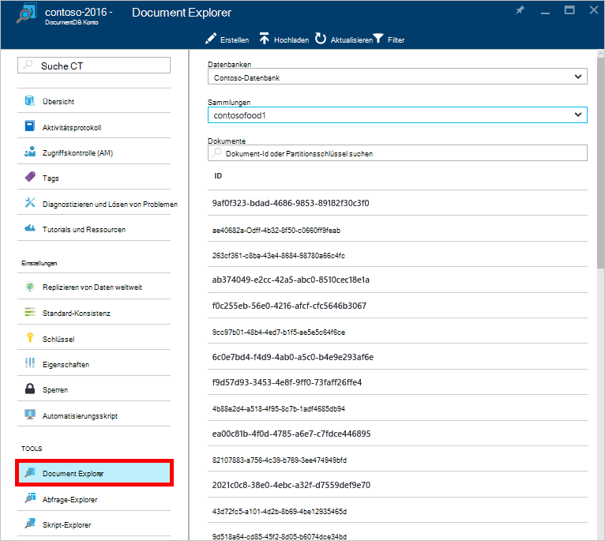

    Blatt **Document Explorer** werden **Datenbanken** und **Sammlungen** Dropdown-Listen je nach Kontext vorab aufgefüllt mit Document Explorer gestartet. 

## Erstellen eines Dokuments

1. [Dokumentexplorer starten](#launch-document-explorer).

2. Blatt **Document Explorer** klicken Sie auf **Dokument erstellen**. 

    Minimaler JSON-Ausschnitt wird im **Dokument** Blade bereitgestellt.

    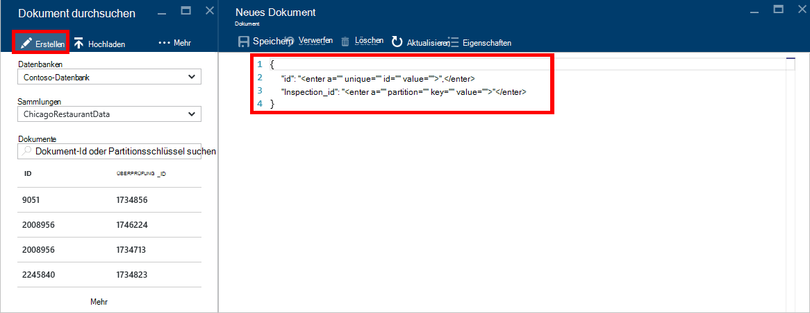

2. Blatt **Dokument** Geben Sie oder fügen Sie den Inhalt des JSON-Dokument erstellen möchten, und klicken Sie auf **Speichern** , um das Dokument an die Datenbank und den angegebenen Blatt **Document Explorer** .

    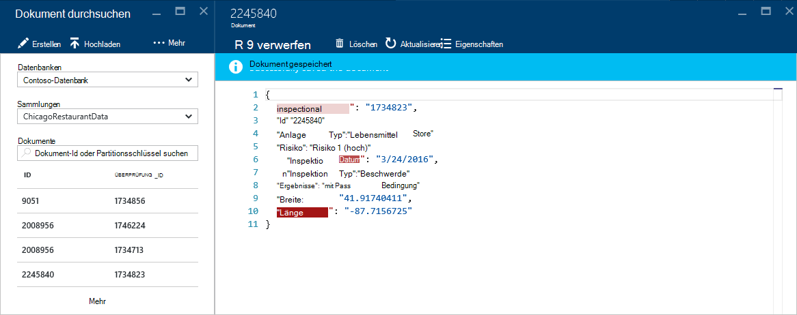

    > [AZURE.NOTE] Wenn Sie eine Eigenschaft "Id" nicht bereitstellen, Document Explorer automatisch eine Id-Eigenschaft hinzugefügt und generiert eine GUID als den ID-Wert.

    Haben Sie bereits Daten aus JSON-Dateien, MongoDB SQL Server CSV-Dateien, Azure-Tabellenspeicher, Amazon DynamoDB, HBase, oder von anderen Auflistungen DocumentDB können DocumentDB [Migrationsprogramm](documentdb-import-data.md) schnell Daten importiert werden.

## Bearbeiten eines Dokuments

1. [Dokumentexplorer starten](#launch-document-explorer).

2. Zum Bearbeiten eines vorhandenen Dokuments **Document Explorer** Blatt wählen Sie aus, bearbeiten Sie das Dokument in das **Dokument** -Blade und klicken Sie auf **Speichern**.

    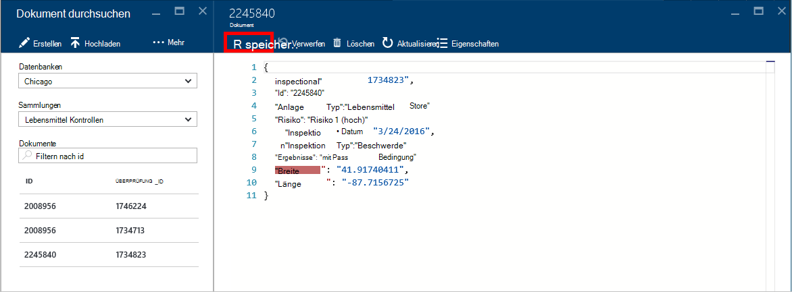

    Wenn Sie ein Dokument bearbeiten und den aktuellen Satz von Änderungen verwerfen, klicken Blatt **Dokument** **verwerfen** , Löschen bestätigen möchten und der vorherige Zustand des Dokuments geladen.

    

## Löschen eines Dokuments

1. [Dokumentexplorer starten](#launch-document-explorer).

2. Wählen Sie das Dokument von **Document Explorer**, klicken Sie auf **Löschen**und bestätigen Sie den Löschvorgang. Nach der Bestätigung, wird das Dokument sofort aus Document Explorer entfernt.

    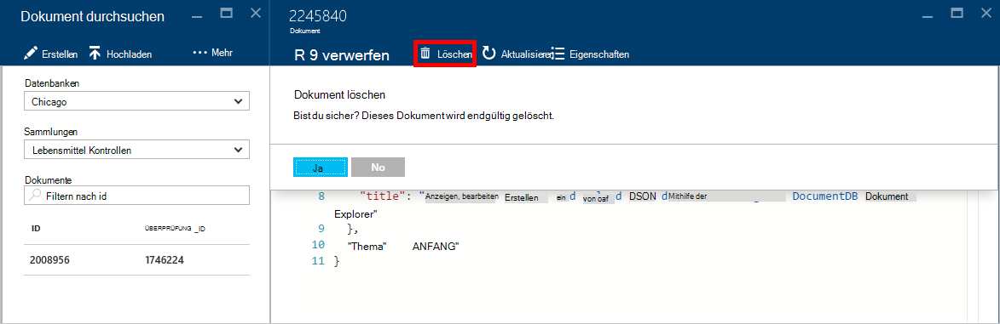

## Arbeiten mit JSON-Dokumente

Document Explorer überprüft, ob ein neues oder bearbeitetes Dokument gültigen JSON enthält.  Sie können auch JSON Fehler anzeigen Mauszeiger im falschen Abschnitt Details über den Validierungsfehler.

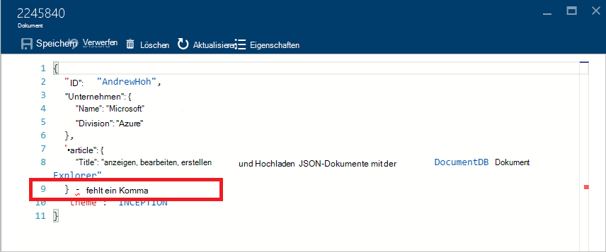

Darüber hinaus verhindert Document Explorer Speichern eines Dokuments mit ungültiger JSON.

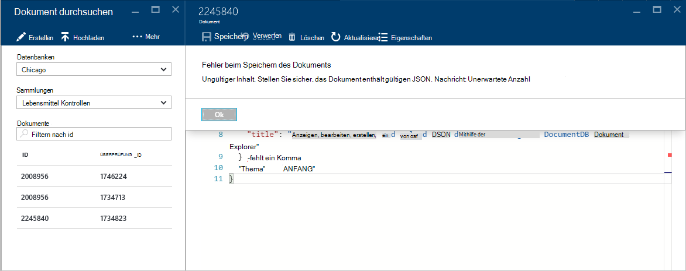

Schließlich können Document Explorer Sie die Systemeigenschaften des derzeit geladenen Dokument durch Klicken auf den Befehl **Eigenschaften** anzuzeigen.

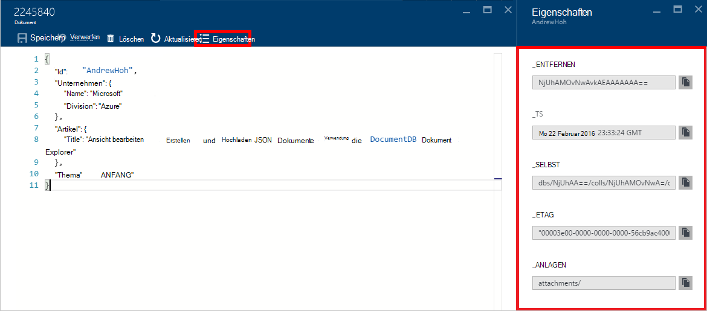

> [AZURE.NOTE] Timestamp (_ts)-Eigenschaft wird intern als Epoche Zeit jedoch Document Explorer zeigt den Wert in ein visuell lesbares Format GMT.

## Filtern von Dokumenten
Document Explorer unterstützt eine Reihe von Optionen und erweiterte Einstellungen.

Standardmäßig lädt Document Explorer auf die ersten 100 Dokumente in die ausgewählte Sammlung nach deren Erstellungsdatum vom frühesten zum spätesten.  Zusätzliche Dokumente (in Chargen von 100) Laden der Option **mehr** am unteren Rand der Document Explorer-Blade. Sie können die Dokumente über den Befehl **Filter** geladen.

1. [Dokumentexplorer starten](#launch-document-explorer).

2. Klicken Sie auf **Filter**oben Blade **Document Explorer** .  

    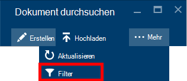
  
3.  Die Einstellungen unter der Befehlsleiste angezeigt. Bieten Sie in den filtereinstellungen eine WHERE- oder ORDER BY-Klausel und dann auf **Filter**.

    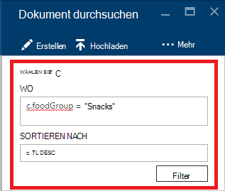

    Document Explorer aktualisiert automatisch die Ergebnisse Dokumente Filterabfrage. Lesen Sie DocumentDB SQL-Grammatik in [SQL-Abfrage und SQL-Syntax](documentdb-sql-query.md) Artikel oder Drucken der [SQL-Abfrage Spickzettel](documentdb-sql-query-cheat-sheet.md).

    Die **Datenbank** und **Sammlung** Dropdown-Listenfelder können auf einfache Weise die Auflistung ändern aus der Dokumente belegt werden ohne Schließen und erneut starten Document Explorer verwendet werden.  

    Document Explorer auch unterstützt Filterung derzeit geladenen Satz von Dokumenten durch die ID-Eigenschaft.  Geben Sie einfach Dokumente Filtern nach Id ein.

    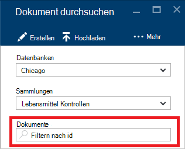

    Document Explorer Liste gefilterte Ergebnisse basierend auf den angegebenen Kriterien.

    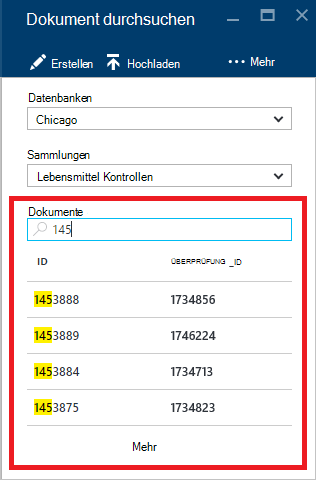

    > [AZURE.IMPORTANT] Document Explorer Filter Funktionalität nur Filter aus den ***derzeit*** geladenen Dokumente und führt eine Abfrage für die aktuell ausgewählte Sammlung.

4. Klicken Sie zum Aktualisieren der Liste von Dokumenten von Document Explorer geladen oben das Blade **Aktualisieren** .

    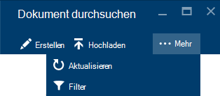

## BULK Dokumente hinzufügen

Document Explorer unterstützt Bulk Aufnahme mindestens vorhandenen JSON Dokumenten bis zu 100 JSON-Dateien pro Uploadvorgang.  

1. [Dokumentexplorer starten](#launch-document-explorer).

2. Um den Upload zu starten, klicken Sie auf **Dokument uploaden**.

    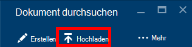

    **Dokument hochladen** Blatt wird geöffnet. 

2. Klicken Sie auf Durchsuchen, um ein Datei-Explorer-Fenster öffnen und wählen Sie upload JSON-Dokumente klicken Sie auf **Öffnen**.

    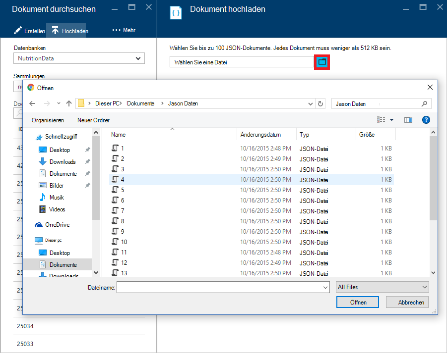

    > [AZURE.NOTE] Document Explorer unterstützt derzeit bis zu 100 JSON-Dokumente pro einzelne Uploads.

3. Wenn Sie mit Ihrer Auswahl zufrieden sind, klicken Sie **Hochladen** .  Dokumente werden automatisch am Raster Document Explorer hinzugefügt und die Ergebnisse hochladen Betrieb Verlauf angezeigt. Fehler werden für einzelne Dateien gemeldet.

    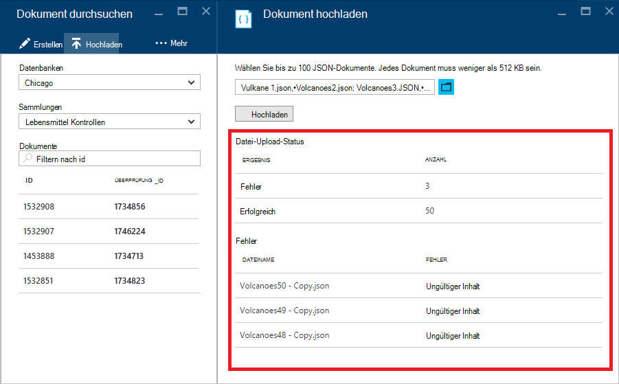

4. Nach Abschluss des Vorgangs können Sie bis zu einem anderen 100 Dokumente auswählen, hochladen.

## Arbeiten Sie mit JSON-Dokumente außerhalb des Portals

Document Explorer im Azure-Portal ist nur eine Möglichkeit, Dokumente in DocumentDB. Sie können Dokumente mithilfe von [REST-API](https://msdn.microsoft.com/library/azure/mt489082.aspx) oder den [Client SDKs](documentdb-sdk-dotnet.md)arbeiten. Beispielsweise code, [.NET SDK Dokument Beispiele](documentdb-dotnet-samples.md#document-examples) und [Node.js SDK Dokument Beispiele](documentdb-nodejs-samples.md#document-examples).

Möchten Sie importieren oder Migrieren von Dateien von einer anderen Quelle (JSON Dateien, MongoDB, SQL Server, CSV-Dateien, Azure Table Storage, Amazon DynamoDB oder HBase), können DocumentDB- [Migrationsprogramm](documentdb-import-data.md) Sie schnell die Daten in DocumentDB importieren.

## Problembehandlung bei

**Symptom**: Document Explorer gibt **keine Dokumente gefunden**.

**Lösung**: sicherstellen, dass das richtige Abonnement, Datenbank und Auflistung in die Dokumente eingefügt wurden ausgewählt haben. Außerdem sicherstellen Sie, dass in die Kontingente Durchsatz betrieben werden. Wenn Sie bei der maximalen Durchsatz auf und erhält gedrosselt betreiben, niedrigere Anwendungsverwendung maximalen Durchsatz Kontingent für die Auflistung ausgeführt werden.

**Erklärung**: das Portal ist eine Anwendung wie mit jeder anderen Aufrufe an die DocumentDB-Datenbank und die Auflistung. Ihre Anfrage derzeit durch Aufrufe in einer separaten Anwendung gedrosselt werden kann das Portal auch eingeschränkt verursacht Ressourcen nicht im Portal angezeigt. Zur Behebung des Problems beheben Sie die Ursache der hohen Durchsatz-Nutzung und aktualisieren Sie das Portal Blade. Informationen zu messen und niedrigere Durchsatz Verwendung finden im Abschnitt [Durchsatz](documentdb-performance-tips.md#throughput) Artikel [Tipps](documentdb-performance-tips.md) .

## Nächste Schritte

Erfahren Sie mehr über die DocumentDB SQL-Grammatik in Document Explorer unterstützt Siehe [SQL-Abfrage und SQL-Syntax](documentdb-sql-query.md) oder [SQL Query Spickzettel](documentdb-sql-query-cheat-sheet.md)ausdrucken.

Der [Learning Path](https://azure.microsoft.com/documentation/learning-paths/documentdb/) ist auch eine nützliche Ressource steuern, während Sie mehr über DocumentDB erfahren. 
