<properties
    pageTitle="DocumentDB-Skript-Explorer, einem JavaScript-Editor | Microsoft Azure"
    description="DocumentDB Skript-Explorer, ein Azure-Portal Tool DocumentDB serverseitige Programmierung Artefakte einschließlich gespeicherte Prozeduren, Trigger und benutzerdefinierte Funktionen zu erfahren."
    keywords="JavaScript-editor"
    services="documentdb"
    authors="kirillg"
    manager="jhubbard"
    editor="monicar"
    documentationCenter=""/>

<tags
    ms.service="documentdb"
    ms.workload="data-services"
    ms.tgt_pltfrm="na"
    ms.devlang="na"
    ms.topic="article"
    ms.date="08/30/2016"
    ms.author="kirillg"/>

# Erstellen und Ausführen von gespeicherten Prozeduren, Trigger und benutzerdefinierten Funktionen DocumentDB-Skript-Explorer verwenden

Dieser Artikel bietet eine Übersicht über [Microsoft Azure DocumentDB](https://azure.microsoft.com/services/documentdb/) -Skript-Explorer, die in Azure-Portal einen JavaScript-Editor ermöglicht das Anzeigen und Ausführen von DocumentDB serverseitige Programmierung Artefakte einschließlich gespeicherte Prozeduren, Trigger und benutzerdefinierten Funktionen. Mehr über DocumentDB serverseitige Programmierung in [gespeicherte Prozeduren und Datenbanktrigger UDFs](documentdb-programming.md) Artikel.

## Skript-Explorer starten

1. Klicken Sie im Portal Azure in der Indexleiste auf **DocumentDB (NoSQL)**. Wenn **DocumentDB-Konten** nicht angezeigt wird, klicken Sie auf **Weitere Dienste** und dann auf **DocumentDB (NoSQL)**.

2. Klicken Sie im Menü Ressourcen auf **Skript-Explorer**.

    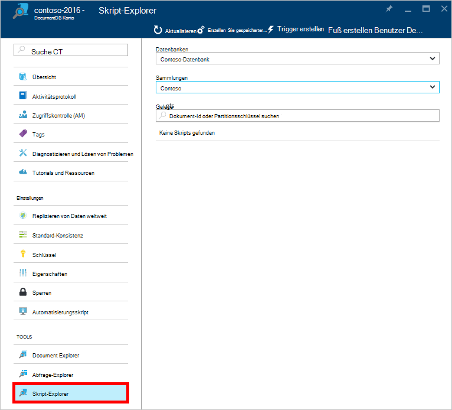
 
    Die **Datenbank** und **Sammlung** Dropdown-Listenfelder werden je nach Kontext vorformulierte in denen Skript-Explorer starten.  Z. B. ist aus einer Datenbank Blade starten, die aktuelle Datenbank voreingestellt.  Wenn Sie eine Auflistung Blade starten, sind die aktuelle Auflistung voreingestellt.

4.  Verwenden Sie die **Datenbank** und **Sammlung** Dropdown-Listenfelder einfach die Auflistung ändern aus der Skripts belegt werden ohne Schließen und erneut starten Skript-Explorer.  

5. Skript-Explorer auch unterstützt Filterung derzeit geladenen Satz von Skripts durch die ID-Eigenschaft.  Geben im Filterfeld, und die Ergebnisse in der Skript-Explorer-Liste werden anhand der angegebenen Kriterien gefiltert.

    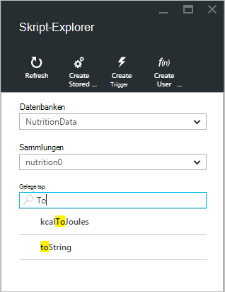

    > [AZURE.IMPORTANT] Skript-Explorer Funktionalität nur Filter aus den ***derzeit*** geladenen Skripts filtern und die aktuell ausgewählte Sammlung nicht automatisch aktualisiert.

5. Klicken Sie zum Aktualisieren der Liste von Skript-Explorer geladen am Anfang des Blades den Befehl **Aktualisieren** .

    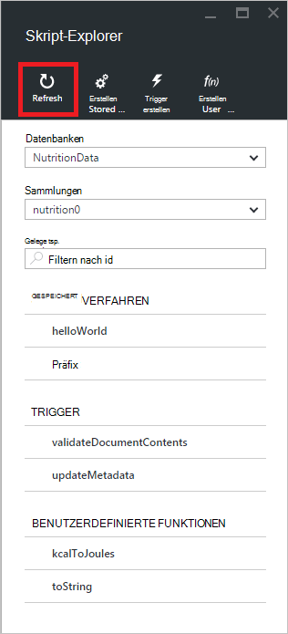

## Erstellen, anzeigen und Bearbeiten von gespeicherten Prozeduren, Triggern und benutzerdefinierten Funktionen

Skript-Explorer können Sie leicht DocumentDB serverseitige Programmierung Artefakte CRUD-Operationen durchführen.  

- Um ein Skript zu erstellen, klicken Sie auf die erstellen Befehl in Skript-Explorer, bieten eine Id Geben Sie den Inhalt des Skripts und klicken Sie auf **Speichern**.

    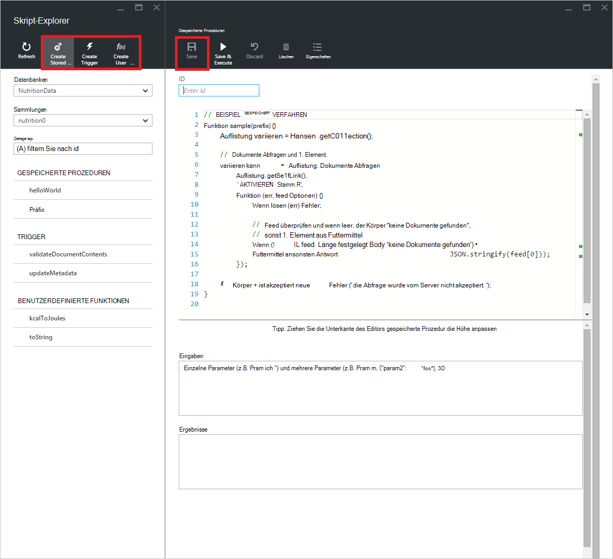

- Wenn Sie einen Trigger erstellen, müssen Sie auch Auslösevorgang Typ und Trigger angeben

    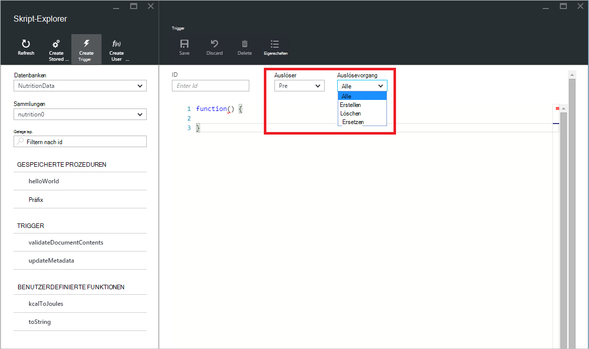

- Um ein Skript anzuzeigen, klicken Sie einfach das Skript, in dem Sie interessiert sind.

    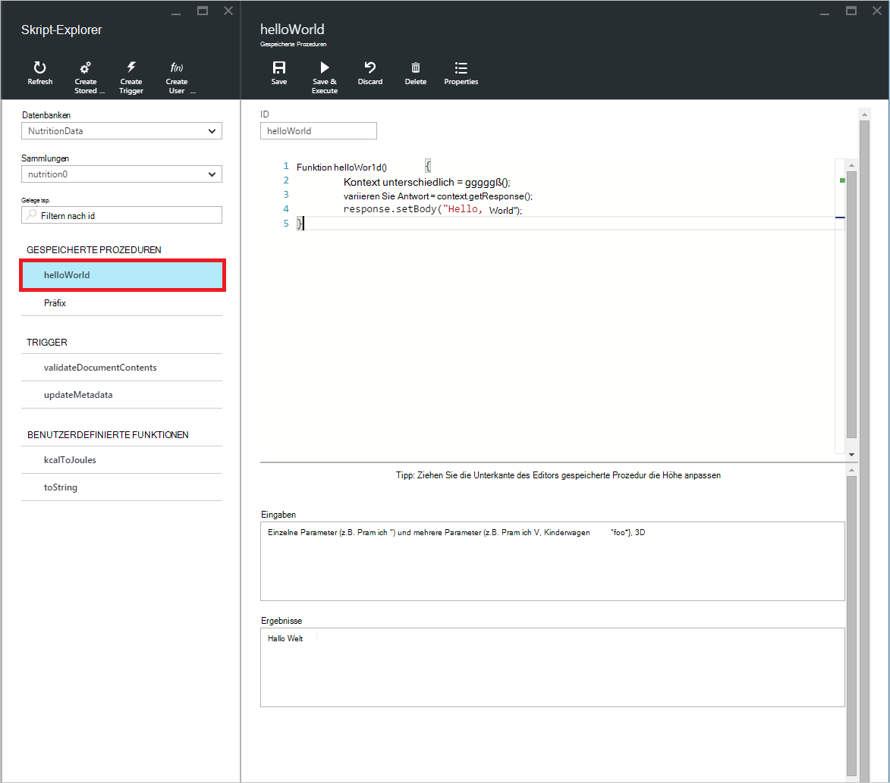

- Um ein Skript zu bearbeiten, ändern Sie die gewünschten in JavaScript Editor und klicken Sie auf **Speichern**.

    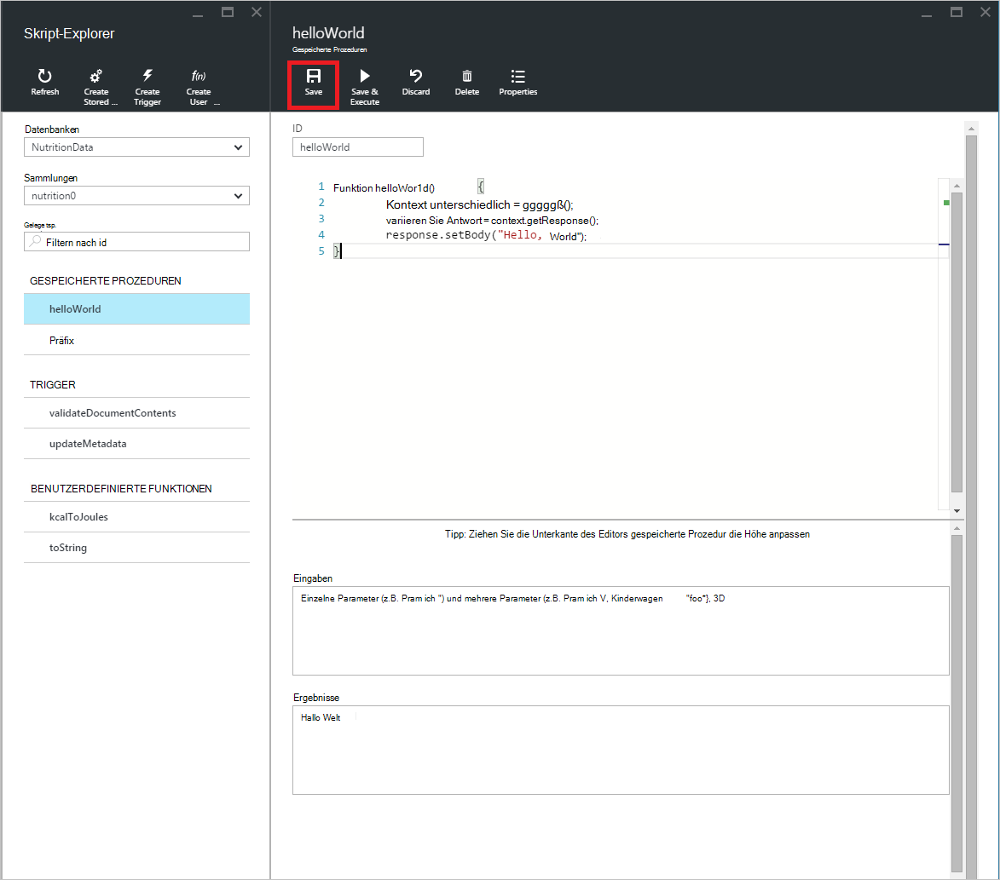

- Um ausstehenden Änderungen an ein Skript zu löschen, klicken Sie einfach auf Befehl **verwerfen** .

    

- Skript-Explorer können Sie die Systemeigenschaften des derzeit geladenen Skript auf **Eigenschaften** anzuzeigen.

    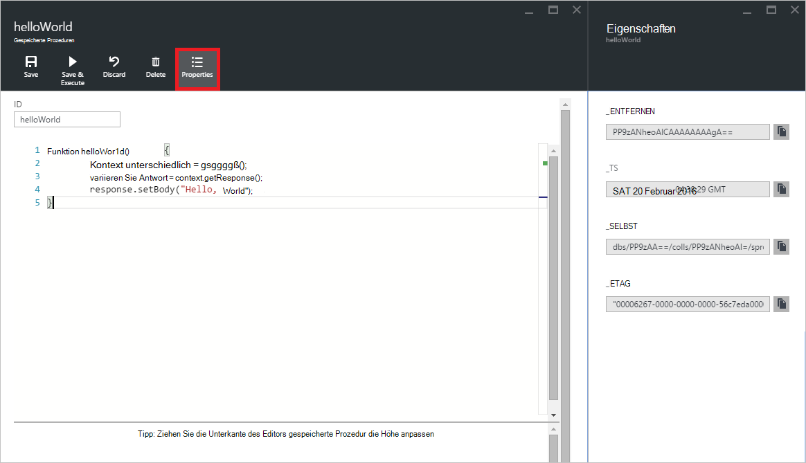

    > [AZURE.NOTE] Timestamp (_ts)-Eigenschaft wird intern als Epoche Zeit jedoch Skript-Explorer zeigt den Wert in ein visuell lesbares Format GMT.

- Um ein Skript zu löschen, wählen sie in Skript-Explorer, und klicken Sie auf den Befehl **Löschen** .

    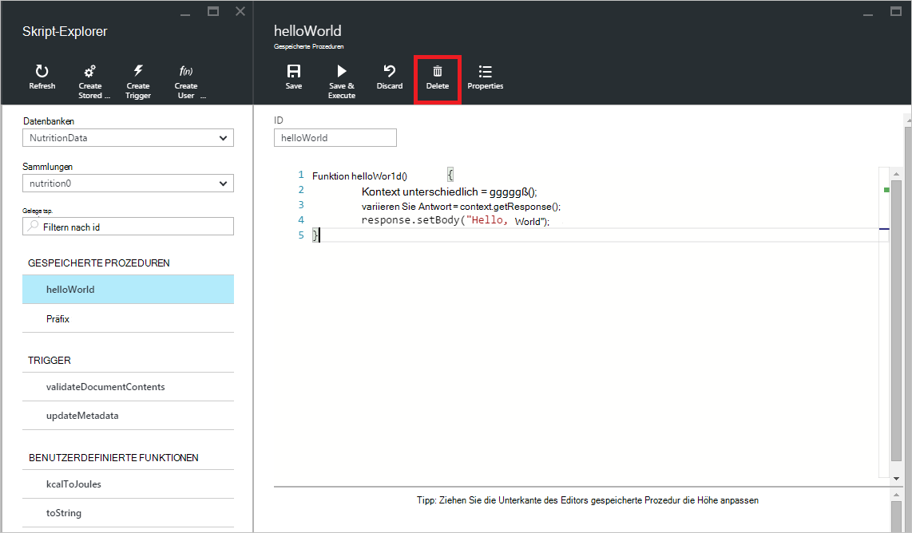

- Bestätigen Sie den Löschvorgang mit **Ja** oder Abbrechen Sie löschen auf **Nein**.

    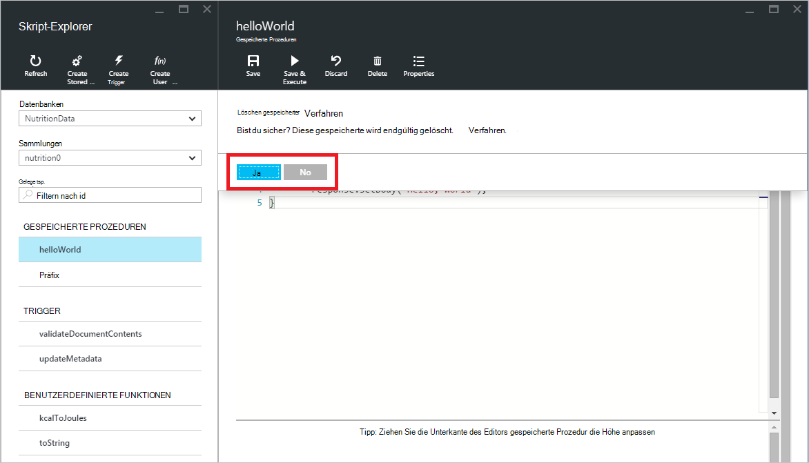

## Ausführen einer gespeicherten Prozedur

> [AZURE.WARNING] Ausführen von gespeicherten Prozeduren in Skript-Explorer wird noch Server partitioniert Seite Sammlungen nicht unterstützt. Weitere Informationen finden Sie in der [Partitionierung und Skalierung in DocumentDB](documentdb-partition-data.md).

Skript-Explorer können Sie serverseitige gespeicherte Prozeduren von Azure-Portal ausführen.

- Beim Öffnen eines neues erstellen, die gespeicherte Prozedur Blatt ein Standardskript (*Präfix*) bereits erfolgt. Um das *Präfix* Skript oder Skript ausführen, fügen Sie eine *Id* und *Eingaben*. Für gespeicherte Prozeduren, die mehrere Parameter akzeptieren, muss alle Eingaben in einem Array ( *["Foo", "Bar"]*).

    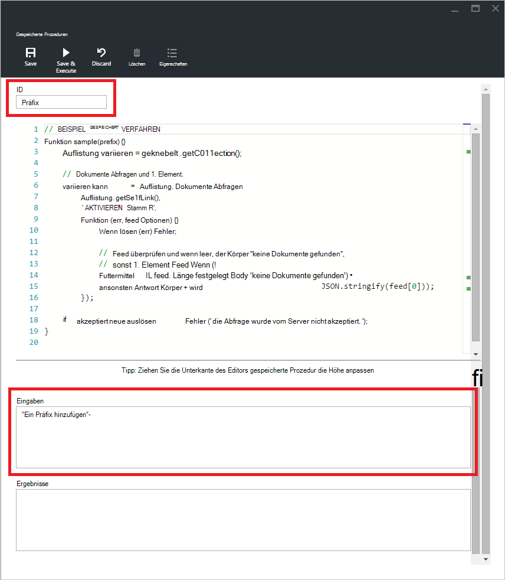

- Zum Ausführen einer gespeicherten Prozedur klicken Sie einfach auf den Befehl **Speichern und Ausführen** im Skript-Editor-Fenster.

    > [AZURE.NOTE] Der Befehl **Speichern und Ausführen** speichert gespeicherte Prozedur vor der Ausführung, was bedeutet, dass die zuvor gespeicherte Version der gespeicherten Prozedur überschrieben werden.

- Erfolgreich gespeicherten Prozedur wie haben den Status *erfolgreich gespeichert und die gespeicherte Prozedur* zurückgegebenen Ergebnisse im *Ergebnisbereich* aufgefüllt.

    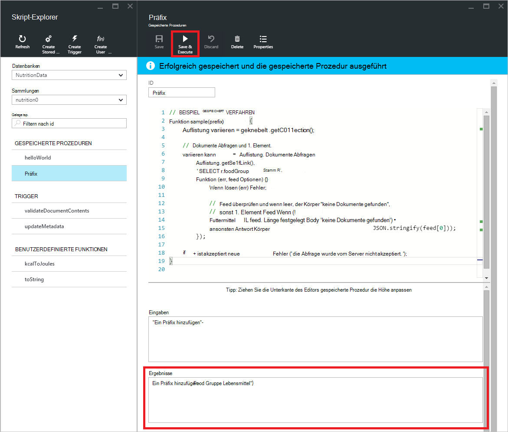

- Wenn die Ausführung ein Fehler auftritt, wird der Fehler im *Ergebnisbereich* aufgefüllt.

    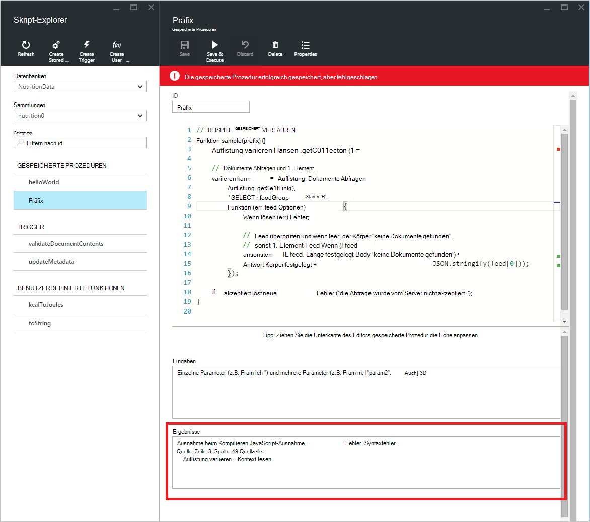

## Arbeiten Sie mit Skripts außerhalb des Portals

Skript-Explorer im Azure-Portal ist nur eine Möglichkeit, gespeicherte Prozeduren, Trigger und benutzerdefinierte Funktionen in DocumentDB arbeiten. Sie kann auch für Skripts verwenden die REST-API und die [Client-SDKs](documentdb-sdk-dotnet.md). Die REST API-Dokumentation enthält Beispiele für die Verwendung von [REST mit Prozeduren](https://msdn.microsoft.com/library/azure/mt489092.aspx), [benutzerdefinierte Funktionen REST](https://msdn.microsoft.com/library/azure/dn781481.aspx)und [Trigger REST](https://msdn.microsoft.com/library/azure/mt489116.aspx). Beispiele sind ebenfalls verfügbar angezeigt wie [Skripts mit C#](documentdb-dotnet-samples.md#server-side-programming-examples) und [Node.js mit Skripts arbeiten](documentdb-nodejs-samples.md#server-side-programming-examples).

## Nächste Schritte

Erfahren Sie mehr über DocumentDB serverseitige Programmierung in [gespeicherte Prozeduren und Datenbanktrigger UDFs](documentdb-programming.md) Artikel.

Der [Learning Path](https://azure.microsoft.com/documentation/learning-paths/documentdb/) ist auch eine nützliche Ressource steuern, während Sie mehr über DocumentDB erfahren.  
