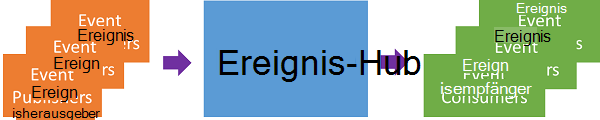
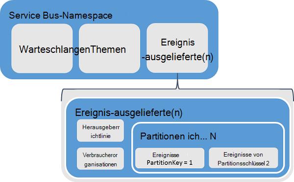
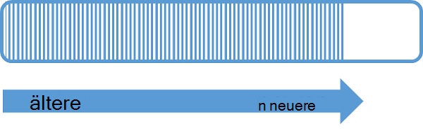
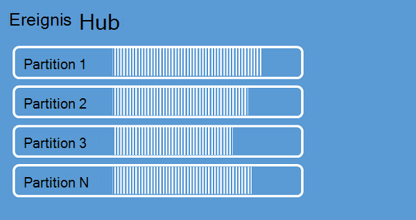
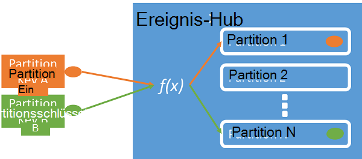
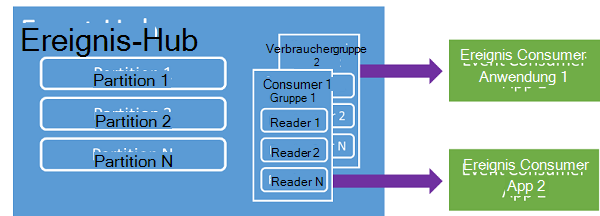
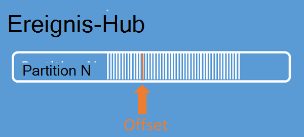
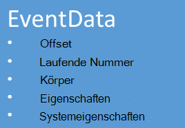

<properties 
    pageTitle="Übersicht über Azure Ereignis Hubs | Microsoft Azure"
    description="Einführung und Überblick Azure Ereignis Hubs."
    services="event-hubs"
    documentationCenter="na"
    authors="sethmanheim"
    manager="timlt"
    editor="" />
<tags 
    ms.service="event-hubs"
    ms.devlang="na"
    ms.topic="get-started-article"
    ms.tgt_pltfrm="na"
    ms.workload="na"
    ms.date="08/16/2016"
    ms.author="sethm" />

# Übersicht über Azure Ereignis Hubs

Viele moderne Lösungen möchten adaptive Kunden oder Produkte durch kontinuierliches Feedback und automatisierte Telemetrie zu verbessern. Lösung stehen die Herausforderung, sicher und zuverlässig viele gleichzeitige Herausgeber sehr große Datenmengen verarbeiten. Microsoft Azure Ereignis Hubs ist ein Dienst verwalteten Plattform, der eine für umfangreiche Datenmengen Aufnahme in eine Vielzahl von Szenarien Grundlage. Beispiele für solche Szenarien sind Verhalten bei mobiler apps, Verkehrsinformationen von Webfarmen Ereignis im Spiel Aufnahme Konsolenspiele oder Daten von Maschinen oder Fahrzeuge verbunden. Die allgemeine Rolle Ereignis Hubs in Lösungsarchitekturen ist fungiert als "Vordertür" für eine Ereignispipeline ein *Ereignis Ingestor*bezeichnet. Ein Ereignis Ingestor wird eine Komponente oder ein Dienst, der zwischen Ereignisherausgeber und Ereignisempfänger entkoppeln die Produktion eines Streams von Ereignissen aus der Ereignisse.

Azure Event Hubs ist eine Ereignisverarbeitungsregel Service, Ereignis und Telemetrie Eindringen in die Cloud in großem Maßstab geringe Latenz und hohe Zuverlässigkeit bietet. Dieser Dienst verwendet andere nachgeschaltete Dienste ist besonders Anwendungsinstrumentation Benutzer Erfahrung oder Workflow-Verarbeitung und Internet der Dinge (IoT) Szenarien. Ereignis Hubs stellt eine Behandlung Funktion Strom und Event Hub eine Entität Warteschlangen und Themen ähnlich ist, hat Merkmale, die von herkömmlichen Enterprise messaging. Enterprise Messaging-Szenarien erfordern häufig anspruchsvolle Funktionen wie Abfolge, Dead Beschriftung, Transaktionen und sichere Übermittlung Garantien während der wichtigste Faktor für Ereignis Aufnahme hoher Durchsatz und Verarbeiten von Ereignisstreams Flexibilität. Daher unterscheiden sich Ereignis Hubs Funktionen von Service Bus Topics stark hohen Durchsatz und Verarbeitung Szenarien gewichtet werden. Als solche implementiert Ereignis Hubs messaging Funktionen nicht die verfügbaren Themen. Wenn Sie diese Funktionen benötigen, bleiben Themen die optimale Wahl.

Event-Hub wird auf ähnliche Servicebuswarteschlangen und Themen Namespaceebene Ereignis Hubs erstellt. Ereignis-Hubs verwendet AMQP und HTTP als ihre primären API-Schnittstellen. Das folgende Diagramm zeigt die Beziehung zwischen Ereignis Hubs und Service Bus.

## Konzeptionelle Übersicht

Ereignis-Hubs meldet durch eine partitionierte Consumer-Musters. Warteschlangen und Themen verwenden ein [Consumer Wettbewerb](https://msdn.microsoft.com/library/dn568101.aspx) Modell in der einzelnen Verbraucher aus derselben Warteschlange oder Ressource lesen möchte. Dieser Wettbewerb um Ressourcen führt letztendlich Komplexität und Skalierung Grenzwerte für Bearbeitung Stream. Ereignis-Hubs verwendet eine partitionierte Consumer-Musters in der jeder Consumer nur eine bestimmte Teilmenge oder Partition Nachrichtenstrom liest. Dieses Muster ermöglicht horizontale Skalierung für Verarbeitung sowie andere Stream-orientierten Features in Warteschlangen und Themen nicht verfügbar.

### Partitionen

Eine Partition ist eine geordnete Abfolge von Ereignissen, die in einem Event Hub stattfindet. Beim Eintreffen neuer Ereignisse werden sie am Ende dieser Sequenz hinzugefügt. Eine Partition kann als ein "Commit-Protokoll" vorstellen

Partitionen speichern Daten zeitlich konfigurierten Aufbewahrung Ebene Event Hub festgelegt ist. Diese Einstellung gilt für alle Partitionen im Hub. Ereignisse ablaufen pro Zeit; Sie können nicht explizit löschen. Event-Hub enthält mehrere Partitionen. Jede Partition unabhängig und eigene Sequenz Daten enthält. Partitionen daher wachsen oft unterschiedlich.

Die Anzahl der Partitionen wird zur Erstellungszeit Event Hub und muss zwischen 2 und 32 (der Standardwert ist 4). Partitionen sind eine Organisation Daten und mehr beziehen sich auf den Grad der nachgeschalteten Parallelität verwenden Programme als Ereignis Hubs Durchsatz erforderlich. Dies macht die Anzahl der Partitionen in einem Event Hub unmittelbar auf die Anzahl der gleichzeitigen Leser zu erwarten. Nach dem Event Hub erstellen ist die Anzahl der Partitionen nicht veränderbar. Sie sollten diese Nummer in langfristige erwartete Skalierung. Service Bus kontaktieren, um 32 Partitionsgröße zu erhöhen.

Partitionen sind und können direkt an gesendet werden, empfiehlt es sich zu senden von Daten an Partitionen. Stattdessen können Sie höhere Ebene Konstrukte, die in den Abschnitten [Ereignisherausgeber](#event-publisher) und [Herausgeberrichtlinie](#capacity-and-security) eingeführt.

Im Rahmen der Veranstaltung werden Nachrichten *Ereignisdaten*genannt. Ereignisdaten enthält den Text des Ereignisses, ein benutzerdefinierter Eigenschaftensammlung und verschiedene Metadaten wie der Offset der Partition und die Zahl in der Folge Stream. Partitionen werden mit Daten gefüllt.

## Ereignisherausgeber

Eine Entität, die Ereignisse oder einem Ereignis-Hub sendet, ist ein *Ereignisherausgeber*. Ereignisherausgeber können Ereignisse mit HTTPS oder AMQP 1.0 veröffentlichen. Ereignisherausgeber verwenden Shared Access Signatur (SAS)-Token identifizieren sich mit einem Ereignis-Hub und eine eindeutige Identität, oder verwenden eine gemeinsame SAS-Token je nach Szenario.

Weitere Informationen zum Arbeiten mit SAS finden Sie unter [Freigegebene Signatur Authentifizierung mit Service Bus](../service-bus-messaging/service-bus-shared-access-signature-authentication.md).

### Publisher-Aufgaben

Dieser Abschnitt beschreibt Aufgaben für Ereignisherausgeber.

#### Ein SAS-Token abrufen

Freigegebene-Signatur (SAS) ist der Authentifizierungsmechanismus für Event Hubs. Service Bus bietet SAS-Richtlinien auf Namespace und Ereignis-Hub. Ein SAS-Token aus SAS generiert und ein Hash SHA eines URLs in einem bestimmten Format codiert ist. Verwenden den Namen des Schlüssels (Richtlinie) und das Token, Service Bus Regenerieren den Hash und damit Authentifizierung des Absenders. SAS-Token für Ereignisherausgeber werden normalerweise nur **Senden** von Berechtigungen auf einem bestimmten Ereignis Hub erstellt. Dieser Mechanismus SAS-token URL ist die Grundlage für Publisher-ID die Herausgeberrichtlinie eingeführt. Weitere Informationen zum Arbeiten mit SAS finden Sie unter [Freigegebene Signatur Authentifizierung mit Service Bus](../service-bus-messaging/service-bus-shared-access-signature-authentication.md).

#### Veröffentlichen eines Ereignisses

Sie können ein Ereignis AMQP 1.0 per HTTPS veröffentlichen. Service Bus bietet eine [EventHubClient](https://msdn.microsoft.com/library/microsoft.servicebus.messaging.eventhubclient.aspx) -Klasse zum Veröffentlichen von Ereignissen mit einem Ereignis-Hub von .NET Clients. Für andere Laufzeiten und Plattformen können Sie alle AMQP 1.0-Client, wie [Apache Qpid](http://qpid.apache.org/). Sie können Veröffentlichungsereignisse einzeln oder zusammengefasst. Eine Publikation (Ereignisdateninstanz) hat ein Limit von 256KB, unabhängig davon, ob sie ein einzelnes Ereignis oder einen Stapel. Veröffentlichen von Ereignissen größer als dies zu einem Fehler führt. Es empfiehlt sich für Herausgeber von Partitionen in der Ereignis-Hub erkennt und nur eine *partition Schlüssel* (im nächsten Abschnitt vorgestellt) oder ihre Identität über SAS-Tokens angeben.

Die Wahl AMQP oder HTTPS ist spezifisch für das Verwendungsszenario. AMQP erfordert die Einrichtung eines permanenten bidirektionalen Sockets zusätzlich Level Security (TLS) oder SSL/TLS. Kann kostspielig hinsichtlich des Netzwerkverkehrs dies nur zu Beginn einer Sitzung AMQP auftritt. HTTPS hat einen niedrigeren anfänglichen Aufwand, erfordert jedoch weitere SSL Aufwand für jede Anforderung. Die Ereignisse häufig veröffentlichen Herausgeber bietet AMQP Performance, Latenz und Durchsatz sparen.

### Partitionsschlüssel

Partitionsschlüssel ist ein Wert, der zum Zuordnen eingehender Daten in Partitionen für die Zwecke der Organisation. Der Partitionsschlüssel ist ein Absender angegeben Wert in ein Ereignis übergeben. Es wird durch eine statische Hashfunktion verarbeitet das Ergebnis die Zuordnung Partition erstellt. Wenn Sie beim Veröffentlichen eines Ereignisses Partitionsschlüssel angeben, wird eine Round-Robin-Zuordnung verwendet. Bei Partitionsschlüssel kennt der Ereignisherausgeber nur die Partitionsschlüssel nicht die Partition, die Ereignisse veröffentlicht werden. Diese Entkopplung und Partition isoliert den Absender zu weiß zu viel über die Weiterverarbeitung und Speicherung von Ereignissen. Partitionsschlüssel sind wichtig zur Organisation von Daten für die Weiterverarbeitung, jedoch grundsätzlich unabhängige Partitionen selbst. Eine pro Gerät oder Benutzer eindeutige Identität macht guten Partitionsschlüssel, sondern andere Attribute wie Geografie auch werden Ereignisse in einer einzelnen Partition Gruppieren verwendet. Die folgende Abbildung zeigt Ereignissender mithilfe Partition Partitionen fixieren.

Ereignis-Hubs wird sichergestellt, dass alle Ereignisse derselbe Schlüsselwert Partition freigeben und auf dieselbe Partition übermittelt werden. Wichtiger wird Partitionsschlüssel mit Publisher-Richtlinien im nächsten Abschnitt beschriebenen müssen die Identität des Herausgebers und der Wert der Partitionsschlüssel übereinstimmen. Andernfalls tritt ein Fehler auf.

### Ereignis-Konsument

Ein Ereignis ist eine Entität, die Daten aus einem Ereignis-Hub liest. Alle Ereignisconsumer lesen Ereignisstream über Partitionen in eine. Jede Partition sollte jeweils nur eine aktive Reader verfügen. Alle Ereignis-Hubs Verbraucher verbinden über AMQP 1.0-Sitzung, in der Ereignisse übermittelt werden, sobald sie verfügbar sind. Der Client muss nicht Daten abrufen.

#### Verbraucherorganisationen

Veröffentlichen/Abonnieren-Mechanismus der Veranstaltung ist durch Verbrauchergruppen aktiviert. Eine ist eine Ansicht der gesamten Event Hub (Status, Position oder Offset). Consumer Gruppen aktivieren haben mehrere Anwendungem jeweils eine separate Ansicht den Ereignisstream und Lesen des Streams unabhängig in ihrem eigenen Tempo und mit ihren eigenen. Eine in einem Stream Architektur entspricht jede downstream-Anwendung. Wenn Sie Daten im Langzeitspeicher schreiben möchten, ist dieser Writer Anwendung eine. Komplexe Verarbeitung wird von einer anderen Verbrauchergruppe ausgeführt. Sie können nur eine Partitionen zugreifen. In einem Event Hub ist immer eine Standardgruppe Consumer und bis zu 20 Verbrauchergruppen Standard Tier Event Hub erstellen.

Es folgen Beispiele für die Verbraucher Gruppe URI-Konvention:

    //<my namespace>.servicebus.windows.net/<event hub name>/<Consumer Group #1>
    //<my namespace>.servicebus.windows.net/<event hub name>/<Consumer Group #2>

Die folgende Abbildung zeigt Ereignisconsumer, Consumer Gruppen.

#### Stream-offsets

Offset ist die Position eines Ereignisses innerhalb einer Partition. Sie können einen Offset als clientseitige Cursor vorstellen. Der Offset ist ein Byte Nummerierung des Ereignisses. Dies ermöglicht ein Ereignisconsumer (Reader), an ein Punkt im stream von Ereignissen, aus dem sie Lesen von Ereignissen beginnen möchten. Sie können den Offset als Zeitstempel oder als einen Wert angeben. Verbraucher sind eigene Offsetwerte außerhalb des Dienstes Ereignis Hubs gespeichert.

Innerhalb einer Partition enthält jedes Ereignis einen Offset. Dieser Offset wird durch die Verbraucher zum nacheinander Ereignis einer Partition angezeigt. Offsets können übergeben werden an den Hub Ereignis entweder eine Zahl oder einen Timestamp-Wert Wenn ein Leser eine Verbindung herstellt.

#### Prüfpunkte

*Checkpoints* ist ein Prozess, mit dem Leser markieren oder ihre Position innerhalb einer Partition Ereignis commit. Prüfpunkte liegt in der Verantwortung des Verbrauchers und erfolgt pro Partition in eine. Dies bedeutet, dass für jede consumergruppe jede Partition Reader seiner aktuelle Position mitverfolgen muss im stream und kann den Dienst informieren, wenn sie den Datenstrom als abgeschlossen betrachtet. Wenn ein Leser eine Partition getrennt, wenn sie eine Verbindung herstellen beginnt an der Prüfpunkt, das zuvor durch den letzten Leser dieser Partition consumergruppe übermittelt wurde. Der Reader herstellt, übergibt es dabei Ereignis Hub an die Position zu lesen. Auf diese Weise können Sie Prüfpunkte auf beide Ereignisse markieren als "vollständig" Verwendungen und Stabilität im Fall eines Failovers zwischen Lesern, die auf anderen Computern verwenden. Da Daten für angegebenen Zeitpunkt erstellte Ereignis Hub Archivierungszeitraums beibehalten werden, kann durch Angabe der untere Offset von diesem Prüfpunktvorgang älteren Daten zurück. Mit diesem Mechanismus kann Prüfpunkte Failover-Flexibilität und kontrollierten Ereigniswiedergabe Stream.

#### Consumer-Aufgaben

Dieser Abschnitt beschreibt Aufgaben für Ereignisempfänger Ereignis Hubs oder Leser. Alle Ereignis-Hubs Verbraucher mit AMQP 1.0 hergestellt werden. AMQP 1.0 ist eine Sitzung-Unterstützung bidirektionaler Kommunikationskanal. Jede Partition hat eine AMQP 1.0 Link-Sitzung, die Beförderung von Ereignissen getrennt von Partition erleichtert.

##### Verbinden mit einer partition

Um Ereignisse aus einem Ereignis-Hub zu nutzen, muss Consumer einer Partition verbinden. Wie bereits erwähnt, können Sie immer Partitionen über eine. Als Teil des Modells partitionierte Verbraucher sollte nur ein Leser jederzeit in eine auf einer Partition aktiv sein. Es ist üblich, Partitionen einen leasing-Mechanismus verwenden, um Leser Verbindung zu bestimmten Partitionen koordinieren Verbindung. Auf diese Weise kann jede Partition in einem consumergruppe nur eine aktive Reader. Verwalten der Position in der Sequenz für einen Leser ist eine wichtige Aufgabe, die durch geänderte erreicht. Diese Funktion wird mithilfe der [EventProcessorHost](https://msdn.microsoft.com/library/microsoft.servicebus.messaging.eventprocessorhost.aspx) -Klasse für .NET Clients vereinfacht. [EventProcessorHost](https://msdn.microsoft.com/library/microsoft.servicebus.messaging.eventprocessorhost.aspx) ist eine intelligente Verbraucher und im nächsten Abschnitt beschrieben.

##### Gelesene Ereignisse

Nach AMQP 1.0-Sitzung als Link für eine bestimmte Partition geöffnet ist, werden Ereignisse von Service Event Hubs AMQP 1.0-Client übertragen. Dieser Mechanismus ermöglicht höhere Durchsatzraten und kürzere Latenzzeit als Pull-Mechanismen wie HTTP GET. Ereignisse an den Client gesendet werden, enthält jedes Ereignisdateninstanz wichtige Metadaten wie dem Offset und Sequenz, die mit Prüfpunkten auf die Ereignisreihenfolge zu erleichtern.

Es liegt in Ihrer Verantwortung zu diesen Offset so am besten verwalten Fortschritt Stream verarbeiten können.

## Kapazität und Sicherheit

Ereignis-Hubs ist eine hochgradig skalierbare parallele Architektur für Stream eindringen. Daher sind einige wichtige Aspekte zu berücksichtigen bei der Skalierung einer Lösung Ereignis Hubs. Die erste dieser Steuerelemente Kapazität heißt *durchsatzeinheiten*im folgenden Abschnitt beschrieben.

### Durchsatzeinheiten

Durchsatzeinheiten die Durchsatzkapazität des Event Hubs gesteuert. Durchsatzeinheiten sind Einheiten Kapazität bereits erworben. Eine einzelne durchsatzeinheit umfasst Folgendes:

- Eindringen: Bis zu 1 MB pro zweite oder 1000 Ereignisse pro Sekunde.

- Ausgang: Bis zu 2 MB pro Sekunde.

Eindringen ist die Anzahl der gekauften durchsatzeinheiten Kapazität eingeschränkt. Senden von Daten über Betrag ergibt eine Ausnahme "Kontingent überschritten". Dieser Betrag ist entweder 1 MB pro zweite oder 1000 Ereignisse pro Sekunde kommt. Ausgang erzeugt keine Drosselung Ausnahmen jedoch beschränkt auf die Datenübertragung gemäß der erworbenen durchsatzeinheiten: 2 MB pro Sekunde pro Durchsatz. Wenn Sie veröffentlichen Rate Ausnahmen erhalten oder werden erwartet höher Ausgang achten, wie viele durchsatzeinheiten für den Namespace Kauf in denen Hub-Ereignis erstellt wurde. Mehr durchsatzeinheiten erhalten, passen Sie die Einstellung auf der Registerkarte **Skalierung** in [Azure-Verwaltungsportal][]auf **Namespaces** . Sie können diese Einstellung mit der Azure-APIs auch ändern.

Partitionen sind Konzept Organisation Daten durchsatzeinheiten rein Kapazität-Konzept. Durchsatz pro Stunde berechnet und erworbenen sind. Gekaufte, werden durchsatzeinheiten für mindestens eine Stunde berechnet. Einheiten können bis zu 20 Durchsatz für ein Ereignis Hubs Namespace erworben werden und ist ein Azure-Konto maximal 20 durchsatzeinheiten. Diese durchsatzeinheiten werden alle Ereignis-Hubs in einem bestimmten Namespace geteilt.

Durchsatz auf bestem bereitgestellt und möglicherweise nicht immer sofort erhältlich. Sie benötigen eine bestimmte Kapazität empfohlen durchsatzeinheiten voraus kaufen. Benötigen Sie mehr als 20 durchsatzeinheiten können Sie Azure mehr durchsatzeinheiten pro Engagement in Blöcken von 20 bis zu den ersten 100 durchsatzeinheiten kaufen Support. Darüber hinaus können Sie auch Blöcke von 100 durchsatzeinheiten kaufen.

Es wird empfohlen, durchsatzeinheiten und Partitionen optimale Skalierung mit Ereignis sorgfältig abzuwägen. Eine Partition ist eine maximale Skalierung der einer durchsatzeinheit. Die Anzahl der durchsatzeinheiten sollte kleiner oder gleich der Anzahl der Partitionen in einem Event Hub.

Preisinformationen finden Sie [Ereignis Hubs Preise](https://azure.microsoft.com/pricing/details/event-hubs/).

### Herausgeberrichtlinie

Ereignis-Hubs können Ereignisherausgeber durch *Herausgeberrichtlinien*präzise steuern. Publisher Richtlinien sind eine Reihe von Funktionen zur Laufzeit zu viele unabhängige Ereignisherausgeber. Mit Publisher verwendet jedes Verlegers eindeutige Bezeichner beim Veröffentlichen von Ereignissen mit einem Ereignis-Hub mit den folgenden Verfahren:

    //<my namespace>.servicebus.windows.net/<event hub name>/publishers/<my publisher name>

Müssen Namen Publisher erstellen, aber sie SAS-Token verwendet, wenn ein Ereignis veröffentlicht unabhängige Publisher Identitäten Gewährleistung übereinstimmen. Weitere Informationen zu SAS finden Sie unter [Freigegebene Signatur Authentifizierung mit Service Bus](../service-bus-messaging/service-bus-shared-access-signature-authentication.md). Bei Verwendung von Publisher Richtlinien den Verlegernamen **PartitionKey** -Wert fest. Ordnungsgemäß funktioniert, müssen diese Werte übereinstimmen.

## Zusammenfassung

Azure Ereignis Hubs bietet eine Hyperscale-Ereignis und Telemetrie Verarbeitung, die für allgemeine Anwendung und Workflow überwachen jede Ebene verwendet werden können. Die Möglichkeit zu veröffentlichen-Abonnieren von Funktionen mit geringer Latenz und in großem Maßstab Ereignis Hubs "auf Rampe" für Big Data. Diese Funktionen sind mit Publisher-basierten Identitäts- und Sperrlisten in Internet der Dinge Szenarien erweitert. Weitere Informationen zu Ereignis-Hubs Anwendungsentwicklung finden Sie unter [Event Hubs programming Guide](event-hubs-programming-guide.md).

## Nächste Schritte

Ereignis-Hubs Konzepte bearbeitet haben, können Sie auf folgenden Szenarien verschieben:

- Erste Schritte mit einem [Ereignis Hubs Tutorial].
- Eine vollständige [Anwendung mit Event Hubs].

[Azure-Verwaltungsportal]: http://manage.windowsazure.com
[Ereignis-Hubs Lernprogramm]: event-hubs-csharp-ephcs-getstarted.md
[beispielanwendung, Ereignis Hubs verwendet]: https://code.msdn.microsoft.com/windowsazure/Service-Bus-Event-Hub-286fd097
