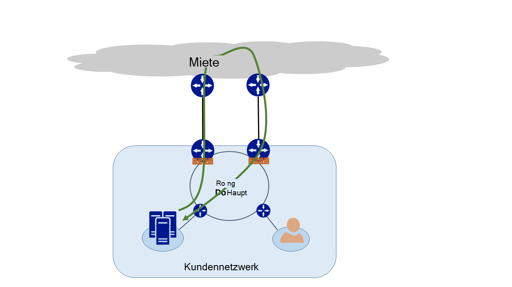
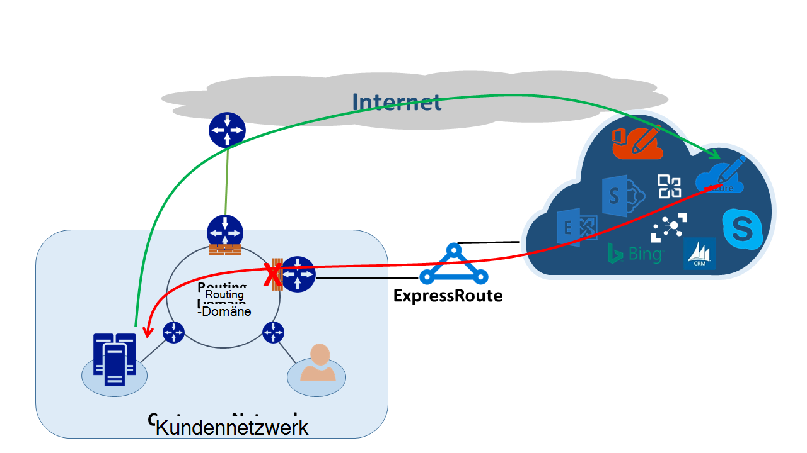
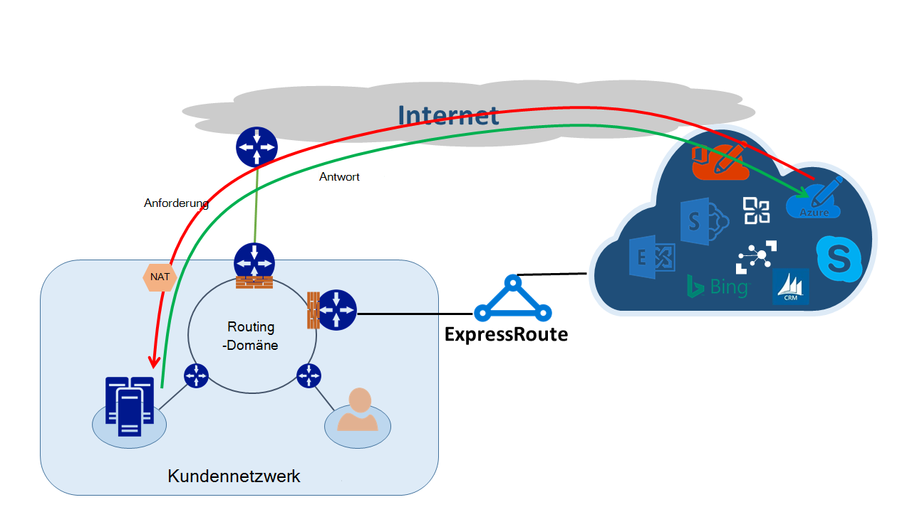

<properties
   pageTitle="Asymmetrischem routing | Microsoft Azure"
   description="Dieser Artikel führt Sie durch die Probleme ein Kunde möglicherweise mit asymmetrischem routing in einem Netzwerk mehrere Links zu einem Ziel."
   documentationCenter="na"
   services="expressroute"
   authors="osamazia"
   manager="carmonm"
   editor=""/>
<tags
   ms.service="expressroute"
   ms.devlang="na"
   ms.topic="get-started-article"
   ms.tgt_pltfrm="na"
   ms.workload="infrastructure-services"
   ms.date="10/10/2016"
   ms.author="osamazia"/>

# Asymmetrische mit mehrerer Netzwerkpfade

Dieser Artikel beschreibt wie vorwärts und zurück Netzwerkverkehr Routen dauern, wenn mehrere Pfade zwischen Quelle und Ziel sind.

Es ist wichtig, zwei Konzepte verstehen asymmetrischem routing zu verstehen. Der Effekt mehrerer Netzwerkpfade gehört. Die andere ist wie Geräte, wie eine Firewall Zustand. Diese Gerätetypen werden statusbehaftete Geräte bezeichnet. Eine Kombination dieser beiden Faktoren erstellt Szenarien, in denen statusbehaftete Gerät Datenverkehr wird da statusbehaftete Gerät erkennt nicht, dass das Gerät stammt.

## Mehrere Netzwerkpfade

Wenn eine einzige Verbindung zum Internet über ihren Internetdienstanbieter hat, wird der gesamte Datenverkehr aus dem Internet denselben Pfad übermittelt. Unternehmen erwerben oft mehrere Stromkreise als redundante Pfade zum netzwerkverfügbarkeit zu verbessern. In diesem Fall kann eine andere Verknüpfung Datenverkehr geht außerhalb des Netzwerks mit dem Internet über einen Link und der gegenläufige Datenverkehr durchläuft. Dies wird auch als asymmetrischem routing bezeichnet. Asymmetrische Routing wird reverse Netzwerkverkehr einen anderen Pfad aus dem ursprünglichen.

Obwohl es hauptsächlich im Internet auftritt, gilt asymmetrischem routing auch für andere Kombinationen mehrerer Pfade. Es gilt beispielsweise ein internetpfad und einen privaten Pfad gehen zum gleichen Ziel und mehrere private Pfade zu demselben Ziel.

Jeder Router auf dem Weg von der Quelle zum Ziel berechnet die beste Route zu einem Ziel. Der Router Bestimmung der besten Weg beruht auf zwei Faktoren:

-   Routing zwischen externen Netzwerke ein Routingprotokoll Border Gateway Protocol (BGP) basiert. BGP Anzeigen von Nachbarn hat und durchläuft eine Reihe von Schritten, um die beste Route zum gewünschten Ziel zu bestimmen. Die beste Route in der Routingtabelle gespeichert.
-   Die Länge der Route zugeordnete Subnetzmaske beeinflusst Pfade. Erhält ein Router mehrere anzeigen für die IP-Adresse jedoch unterschiedliche Subnetzmasken, bevorzugt der Router die Anzeige eine längere Subnet-Maske da spezifischere Route angesehen wird.

## Statusbehaftete Geräte

Router Suchen der IP-Header eines Pakets Routingzwecke. Einige Geräte suchen Sie noch tiefer in das Paket. Diese Geräte sehen im Allgemeinen am Layer4 (Transmission Control Protocol oder TCP; oder User Datagram Protocol oder UDP) oder Layer7 (Application Layer)-Header. Diese Geräte sind Sicherheitsgeräte oder Optimierung der Netzwerkbandbreite Geräte. 

Eine Firewall ist ein allgemeines Beispiel für statusbehaftete Gerät. Eine Firewall oder verweigert ein Paket über die Schnittstellen, basierend auf den Bereichen Protocol, TCP/UDP-Port und URL-Header übergeben. Diese Ebene der Paketinspektion stellt eine starke Belastung auf dem Gerät. Zur Verbesserung der Leistung prüft die Firewall das erste Paket eines Flusses. Wenn dadurch das Paket gehen bleibt die Informationen in der Statustabelle. Alle weiteren Pakete in Zusammenhang mit diesem Datenstrom werden basierend auf der ursprünglichen Bestimmung zulässig. Die Firewall kann ein Paket, die Teil einer vorhandenen ankommen. Hat die Firewall keine früheren Informationen, verwirft die Firewall das Paket.

## Asymmetrische mit ExpressRoute

Beim Herstellen von Microsoft über Azure ExpressRoute wie Ihr Netzwerk ä nderungen:

-   Sie haben mehrere Links zu Microsoft. Eine Verknüpfung ist Ihre Internet-Verbindung und anderen ExpressRoute erfolgt. Datenverkehr an Microsoft über das Internet gehen jedoch zurückkehren über ExpressRoute oder umgekehrt.
-   Erhalten Sie weitere IP-Adressen über ExpressRoute. Damit für Datenverkehr aus dem Netzwerk an Microsoft angeboten über ExpressRoute Router ExpressRoute bevorzugen.

Um die Auswirkung zu verstehen, die diese beiden Änderungen in einem Netzwerk betrachten einige Szenarien. Beispielsweise haben nur eine Verbindung mit dem Internet und Sie alle Microsoft-Dienste über das Internet. Der Datenverkehr aus dem Netzwerk und Microsoft durchläuft denselben Internetlinks und wird durch die Firewall. Die Firewall zeichnet den Datenfluss sieht das erste Paket und return Pakete sind zulässig, da der Fluss in der Tabelle vorhanden ist.

Sie schalten Sie ExpressRoute und Dienste von Microsoft angeboten über ExpressRoute. Andere Dienste von Microsoft sind über das Internet verwendet. Bereitstellen eine separate Firewall an der Kante, die mit ExpressRoute verbunden ist. Microsoft kündigt spezifischere Präfixe mit Ihrem Netzwerk über ExpressRoute für bestimmte Dienste. Die Routinginfrastruktur wählt ExpressRoute als bevorzugten Pfad für diese Präfixe. Wenn Sie nicht die öffentlichen IP-Adressen an Microsoft über ExpressRoute Werbung, kommuniziert Microsoft mit der öffentlichen IP-Adressen über das Internet. Weiterleitung von Datenverkehr aus dem Netzwerk an Microsoft verwendet ExpressRoute und reverse Datenverkehr von Microsoft im Internet. Wenn die Firewall am Rand ein Antwortpaket für einen, die nicht in der Tabelle gefunden wird erhält, löscht den gegenläufige Datenverkehr.

Möchten Sie dieselbe Adresspool der Network Address Translation (NAT) für ExpressRoute und das Internet verwenden, sehen Sie ähnliche Probleme mit den Clients in Ihrem Netzwerk auf private IP-Adressen. Anfragen für Dienste wie Windows Update wechseln über das Internet, da IP-Adressen für diese Dienste nicht über ExpressRoute bekannt gegeben werden. Der gegenläufige Datenverkehr kommt wieder über ExpressRoute. Microsoft erhält eine IP-Adresse mit der Maske von Internet- und ExpressRoute, bevorzugt ExpressRoute gegenüber dem Internet. Wenn eine Firewall oder ein anderes statusbehaftete Gerät Ihrem Netzwerk und mit ExpressRoute ohne vorherige Informationen zum Datenfluss hat löscht, fließen angehören Pakete.

## Asymmetrische Routinglösungen

Sie haben zwei Hauptoptionen zur Lösung des Problems des asymmetrischen Routings. Eine Weiterleitung ist und der andere mit Quelle NAT (SNAT) ist.

### Routing

Sicherstellen Sie, dass die öffentlichen IP-Adressen zum entsprechenden wide Area Network (WAN) Links bekannt gegeben werden. Beispielsweise ggf. mit Internet Authentication und ExpressRoute der e-Mail-Verkehr sollten Sie nicht die Active Directory-Verbunddienste (AD FS) öffentlichen IP-Adressen über ExpressRoute ankündigen. Ebenso müssen Sie nicht vor Ort verfügbar machen AD FS-Server IP-Adressen, die der Router über ExpressRoute empfängt. Routen über ExpressRoute empfangen werden spezifischere ExpressRoute bevorzugten Pfad für Authentifizierungsverkehr an Microsoft zu. Dadurch asymmetrischem routing.

Wenn Sie ExpressRoute für die Authentifizierung verwenden möchten, stellen Sie sicher, dass AD FS öffentliche IP-Adressen über ExpressRoute ohne NAT Werbung Auf diese Weise Datenverkehr, der von Microsoft stammt und wechselt zu einem lokalen AD FS-Server geht über ExpressRoute. Rückgabedaten Kunden an Microsoft verwendet ExpressRoute ist die bevorzugte Route über das Internet.

### Quelle NAT

Eine andere Art asymmetrischen routing Probleme ist mit SNAT. Beispielsweise haben Sie öffentliche IP-Adresse eines lokalen (SMTP = Simple Mail Transfer Protocol)-Servers über ExpressRoute angekündigt, da Sie für diese Art der Kommunikation im Internet verwenden möchten. Eine Anforderung, die von Microsoft stammt und wechselt dann zu Ihrem lokalen SMTP-Server durchläuft das Internet. Sie SNAT die eingehende Anforderung an eine interne IP-Adresse. Reverse Datenverkehr vom SMTP-Server geht der Edgefirewall (mit denen für NAT) nicht über ExpressRoute. Der gegenläufige Datenverkehr geht über das Internet.

## Asymmetrische routing-Erkennung

Traceroute ist am besten zu Ihren Netzwerkverkehr erwarteten Pfad durchlaufen. Sie Datenverkehr vom lokalen SMTP-Server auf Microsoft Internet-Pfad zu erwarten, ist erwartete Traceroute der SMTP-Server zu Office 365. Das Ergebnis überprüft, dass Datenverkehr Ihr Netzwerk auf das Internet und nicht ExpressRoute tatsächlich verlässt.
