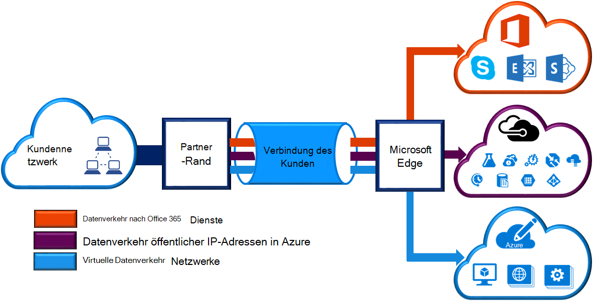
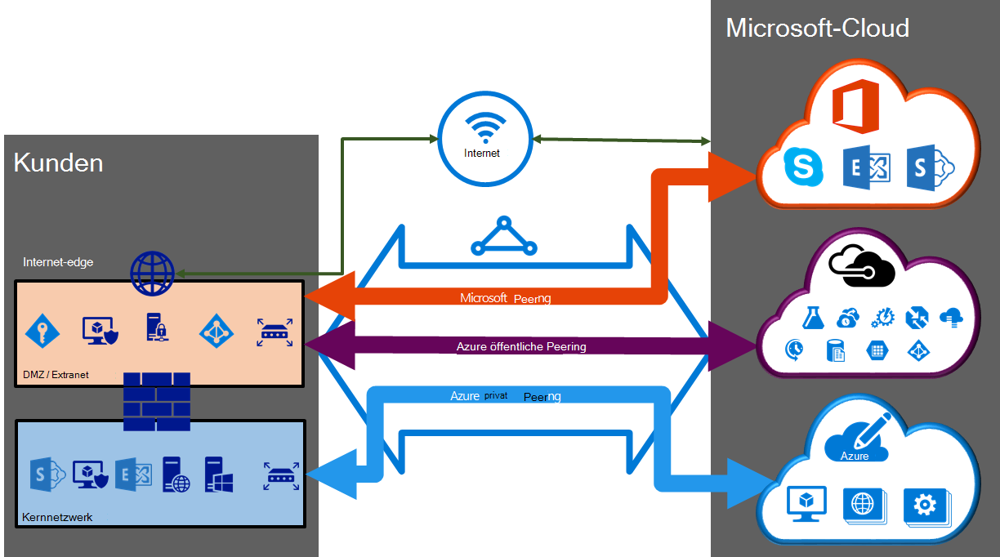

<properties 
   pageTitle="ExpressRoute Schaltkreise und Routingdomänen | Microsoft Azure"
   description="Diese Seite Überblick ExpressRoute-Schaltkreise und routing-Domänen."
   documentationCenter="na"
   services="expressroute"
   authors="cherylmc"
   manager="carmonm"
   editor=""/>
<tags 
   ms.service="expressroute"
   ms.devlang="na"
   ms.topic="article" 
   ms.tgt_pltfrm="na"
   ms.workload="infrastructure-services" 
   ms.date="10/10/2016"
   ms.author="cherylmc"/>

# ExpressRoute-Schaltkreise und routing-Domänen

 Sie müssen ein *ExpressRoute-Verbindung* Verbindung Ihrer lokalen Infrastruktur zu Microsoft Konnektivität gleichermaßen bestellen. Die folgende Abbildung bietet eine logische Darstellung der Konnektivität zwischen WAN und Microsoft.

## ExpressRoute-Schaltkreise

Eine *ExpressRoute-Verbindung* stellt eine logische Verbindung zwischen dem lokalen Infrastruktur und Microsoft-Clouddienste von einem Konnektivität. Sie können mehrere ExpressRoute Stromkreise bestellen. Jede Verbindung kann im gleichen oder in verschiedenen Regionen und zu ihren anderen Konnektivität Anbieter verbunden sein. 

ExpressRoute Stromkreise werden keine physischen Entitäten zugeordnet. Eine Verbindung von einer eindeutig GUID als Schlüssel Service (s-Schlüssel) aufgerufen. Der Schlüssel ist der einzige Informationsaustausch zwischen Microsoft und konnektivitätsanbieter. Die s-Taste ist kein Geheimnis aus Sicherheitsgründen. Gibt es eine 1:1-Zuordnung zwischen einer ExpressRoute-Verbindung und die s-Taste.

ExpressRoute-Verbindung können bis zu drei unabhängigen Peerings: Azure public, Azure Private und Microsoft. Jede peering ist eine unabhängige BGP Sessions jedes davon redundant für hohe Verfügbarkeit konfiguriert. Gibt es eine 1: n (1 < = N < = 3) Zuordnung zwischen einem ExpressRoute und Domänen weiterleiten. ExpressRoute-Verbindung können eine, zwei oder alle drei Peerings pro ExpressRoute-Verbindung aktiviert.
 
Jede Verbindung verfügt über eine feste Bandbreite (50 Mbit/s, 100 Mbit/s, 200 Mbit/s, 500 Mbit/s, 1 Gbit/s, 10 Gbit/s) und eines Konnektivität und peering Position zugeordnet ist. Sie wählen Bandbreite ist über alle Peerings für die Verbindung freigegeben werden. 

### Kontingente, Grenzen und Grenzen

Standardkontingente und Grenzwerte gelten für alle ExpressRoute-Verbindung. Verweisen Sie auf die [Azure-Abonnement und Service Grenzen, Kontingente und Nebenbedingungen](../azure-subscription-service-limits.md) für aktuelle Informationen zu Kontingenten.

## ExpressRoute-routing-Domänen

ExpressRoute-Verbindung hat mehrere routing-Domänen zugeordnet: Azure public, Azure Private und Microsoft. Jeder routing-Domänen zwei Router identisch konfiguriert ist (aktive oder Load sharing Configuration) für hohe Verfügbarkeit. Azure Services werden als *Azure öffentliche* und *private Azure* für IP-Adressierungsschemas kategorisiert.

### Private peering

Azure compute-Dienste, nämlich virtuellen Maschinen (IaaS) und Cloud-Dienste (PaaS), die in einem virtuellen Netzwerk bereitgestellt werden können über private peering Domäne verbunden sein. Private peering Domäne gilt eine vertrauenswürdige Erweiterung des Netzwerkes Kern in Microsoft Azure. Sie können bidirektionale Konnektivität zwischen dem Kernnetzwerk und Azure virtuelle Netzwerke (VNets) einrichten. Diese peering kann virtuelle Maschinen und cloud-Services direkt auf ihre privaten IP-Adressen.  

Sie können mehrere virtuelle Netzwerke mit privaten peering Domäne verbinden. Überprüfen Sie die [FAQ-Seite](expressroute-faqs.md) Informationen über Grenzen und Grenzen. Die [Azure-Abonnement und Service Grenzen, Kontingente und Einschränkungen](../azure-subscription-service-limits.md) Seite aktuelle Informationen finden Sie auf Grenzen.  Siehe Seite [Routing](expressroute-routing.md) Informationen über routing-Konfiguration.

### Öffentliche peering

Azure-Speicher, SQL-Datenbanken und Websites Diensten angeboten öffentliche IP-Adressen. Sie können Dienste von öffentlichen IP-Adressen VIPs Cloud-Dienste über öffentliche peering Routingdomäne privat anschließen. Sie können Ihrer DMZ öffentliche peeringdomäne mit und ohne mit dem Internet verbinden alle Azure Dienste auf die öffentlichen IP-Adressen aus Ihrem WAN verbunden. 

Verbindung wird immer in Ihrem WAN Microsoft Azure Services initiiert. Microsoft Azure Services können nicht in Ihr Netzwerk durch diese Routingdomäne Verbindungen herstellen. Sobald öffentliche peering aktiviert ist, werden Sie alle Azure Services herstellen. Wir sind nicht ausreichend selektiv Dienste auswählen, für denen wir Routen ankündigen. Sie können die Liste der Präfixe überprüfen wir Ihnen werben durch peering auf [Microsoft Azure Datacenter IP-Bereiche](http://www.microsoft.com/download/details.aspx?id=41653) . Die Seite wird wöchentlich aktualisiert.

Definieren benutzerdefinierter Routefilter in Ihrem Netzwerk müssen Sie die Routen verwenden. Siehe Seite [Routing](expressroute-routing.md) Informationen über routing-Konfiguration. Definieren benutzerdefinierter Routefilter in Ihrem Netzwerk müssen Sie die Routen verwenden. 

Finden Sie [FAQ-Seite](expressroute-faqs.md) für Weitere Informationen über die öffentliche peering Routingdomäne unterstützten Dienste. 
 
### Microsoft peering

[AZURE.INCLUDE [expressroute-office365-include](../../includes/expressroute-office365-include.md)]

Verbindung mit allen anderen Microsoft-Onlinediensten (wie Office 365) werden durch Microsoft peering. Wir ermöglichen bidirektionale Konnektivität zwischen Ihrem WAN und Microsoft Cloud-Dienste durch Microsoft peering routing-Domäne. Sie müssen an Microsoft Cloud-Dienste über öffentliche IP-Adressen, die Sie oder Ihr konnektivitätsanbieter besitzt und den definierten Regeln einzuhalten. Siehe Seite [ExpressRoute erforderliche](expressroute-prerequisites.md) Informationen.

Siehe [FAQ-Seite](expressroute-faqs.md) für Weitere Informationen zu unterstützten Dienste, Kosten und Konfiguration. Die Liste der konnektivitätsanbieter Microsoft peering Unterstützung entnehmen Sie die Seite [ExpressRoute](expressroute-locations.md) Informationen.

## Routing-Domäne-Vergleich

In der folgenden Tabelle werden drei Routingdomänen verglichen.

||**Private Peering**|**Öffentliche Peering**|**Microsoft Peering**|
|---|---|---|---|
|**Max. # Präfixe unterstützt pro peering**|4000 standardmäßig 10.000 mit ExpressRoute|200|200|
|**IP-Adressbereiche unterstützt**|Eine beliebige gültige IPv4-Adresse in Ihrem WAN.|Öffentliche IPv4-Adressen von Ihnen oder Ihrem konnektivitätsanbieter.|Öffentliche IPv4-Adressen von Ihnen oder Ihrem konnektivitätsanbieter.|
|**ALS Zahl Vorschriften**|Private und öffentliche als Zahlen. Sie müssen die Öffentlichkeit verfügen als Zahl verwenden möchten. | Private und öffentliche als Zahlen. Allerdings müssen Sie öffentliche IP-Adressen an nachweisen.| Private und öffentliche als Zahlen. Allerdings müssen Sie öffentliche IP-Adressen an nachweisen.|
|**Routing-Schnittstelle IP-Adressen**|RFC1918 und öffentlichen IP-Adressen|Öffentliche IP-Adressen in routing-Registrierung registriert.| Öffentliche IP-Adressen in routing-Registrierung registriert.|
|**MD5-Hash-Unterstützung**| Ja|Ja|Ja|

Sie können eine oder mehrere routing-Domänen ExpressRoute-Verbindung aktivieren. Sie können alle Routingdomänen setzen auf dem gleichen VPN in routing-Domäne kombiniert werden soll. Sie können auch auf verschiedene routing-Domänen, wie im Diagramm platziert. Empfohlen werden private peering direkt mit dem Kernnetzwerk verbunden ist und die Öffentlichkeit und Microsoft Peeringverbindungen mit Ihrer DMZ verbunden sind.
 
Möchten Sie alle drei peering Sitzungen, müssen Sie drei BGP-Sitzungen (ein Paar für jede peering). BGP-Sitzung Paare bringen hohe Verfügbarkeit. Wenn Sie Layer 2-Konnektivität Anbieter verbunden, sein zum Konfigurieren und Verwalten von routing verantwortlich. Sie erfahren mehr mithilfe von [Workflows](expressroute-workflows.md) für ExpressRoute einrichten.

## Nächste Schritte

- Suchen Sie einen Dienstanbieter. Siehe [ExpressRoute-Dienstanbieter und Speicherorte](expressroute-locations.md).
- Stellen Sie sicher, dass alle erforderlichen Komponenten vorhanden sind. [ExpressRoute Komponenten](expressroute-prerequisites.md)anzeigen
- Konfigurieren Sie die ExpressRoute-Verbindung.
    - [Erstellen Sie eine ExpressRoute-Verbindung](expressroute-howto-circuit-classic.md)
    - [Konfigurieren von routing (Circuit Peerings)](expressroute-howto-routing-classic.md)
    - [Verknüpfen Sie ein VNet mit ExpressRoute-Verbindung](expressroute-howto-linkvnet-classic.md)
