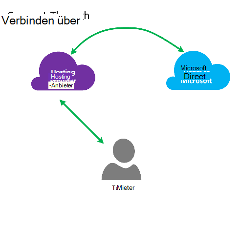
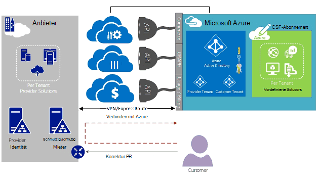
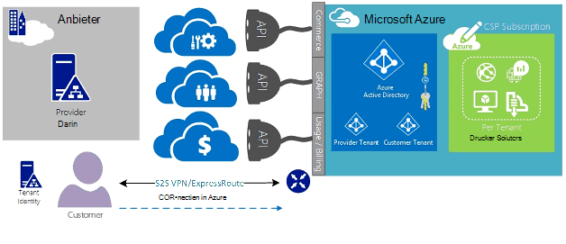
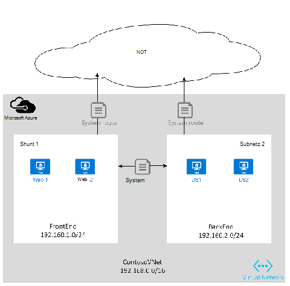
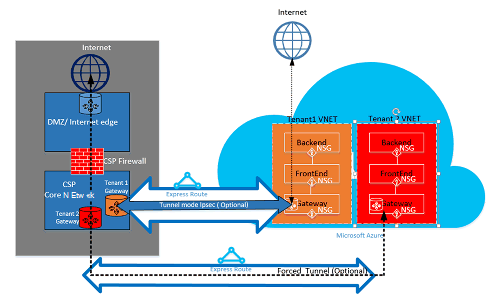

<properties
   pageTitle="Azure ExpressRoute für Lösungsanbieter Cloud | Microsoft Azure"
   description="Dieser Artikel enthält Informationen zum Cloud-Dienstanbieter, die Azure Services integrieren und ExpressRoute in ihr Angebot."
   documentationCenter="na"
   services="expressroute"
   authors="richcar"
   manager="carmonm"
   editor=""/>
<tags
   ms.service="expressroute"
   ms.devlang="na"
   ms.topic="get-started-article"
   ms.tgt_pltfrm="na"
   ms.workload="infrastructure-services"
   ms.date="10/10/2016"
   ms.author="richcar"/>

# ExpressRoute für Cloud Solution Provider (CSP)

Microsoft bietet Hyper-Skalierung für herkömmliche Wiederverkäufern und Distributoren (CSP) zu schnell Bereitstellen neuer Dienste und Lösungen für Ihre Kunden ohne Investitionen in die Entwicklung dieser neuen Dienste. Um die Cloud Solution Provider (CSP) direkt neue verwalten können, stellt Microsoft Programme und APIs, mit denen der Kryptografiedienstanbieter Microsoft Azure-Ressourcen für Ihre Kunden verwalten. Eine dieser Ressourcen ist ExpressRoute. ExpressRoute kann CSP zu vorhandenen Ressourcen den Azure Services herstellen. ExpressRoute ist eine Verknüpfung Hochgeschwindigkeits private Communications Services in Azure. 

ExpresRoute besteht aus zwei Stromkreise für hohe Verfügbarkeit, die Kunden Abonnements zugeordnet sind und nicht von mehreren Kunden gemeinsam genutzt werden. Jede Verbindung sollte einen anderen Router zu hoher Verfügbarkeit eingestellt werden.

>[AZURE.NOTE] ExpressRoute Groß/komplexe Implementierung für einen einzelnen Debitor mehrere ExpressRoute Stromkreise müssen also gibt Bandbreite und Großbuchstaben.

Microsoft Azure bietet zahlreiche Services für Ihre Kunden anbieten können.  Bewährte Maßnahmen müssen diese Dienste verwenden ExpressRoute Verbindung mit hoher Geschwindigkeit niedriger Latenz auf Microsoft Azure-Umgebung.

## Microsoft Azure management
Microsoft bietet CSPs APIs Azure Kundenabonnements verwalten, indem programmgesteuerte Integration mit eigenen Service-Management-Systeme. Unterstützte Verwaltungsfunktionen finden Sie [hier](https://msdn.microsoft.com/library/partnercenter/dn974944.aspx).

## Microsoft Azure-Ressourcenmanagement
Je nach Vertrag mit Ihrem Kunden bestimmt die Verwaltung des Abonnements. CSP kann direkt verwaltet die Erstellung und Wartung von Ressourcen oder der Kunde kann Kontrolle des Microsoft Azure-Abonnements und Azure Ressourcen benötigen. Wenn der Kunde die Erstellung von Ressourcen in Microsoft Azure Abonnement verwaltet verwendet sie eines der beiden Modelle: Modell "Verbinden über" oder "Direct-To"-Modell. Diese Modelle werden in den folgenden Abschnitten ausführlich beschrieben.  

### Verbinden über Modell

  

Der CSP erstellt im Modell verbinden über eine direkte Verbindung zwischen Rechenzentrum und Azure Abonnement des Kunden. Direkte Verbindung erfolgt über ExpressRoute Azure mit Ihrem Netzwerk. Dann wird der Kunde mit dem Netzwerk. Dieses Szenario erfordert, dass der Kunde über das Netzwerk CSP auf Azure Services übergibt. 

Hat Ihr Kunde andere Azure-Abonnements von der nicht verwalteten würde das öffentliche Internet oder eigene private Verbindung Verwendung Verbindung mit diesen Diensten nicht CSP Abonnements bereitgestellt. 

CSP Azure Services verwalten wird davon ausgegangen, dass CSP einen Identitätsspeicher bereits bestehende Kunden hat dann in Azure Active Directory für die Verwaltung des CSP Abonnements durch Administrate-On-Behalf-Of (AOBO) repliziert. Für dieses Szenario-Dongle-Treiber enthalten, einem bestimmten Partner oder Dienstanbieter eine bestehende Beziehung zum Kunden, Kunden Dienste derzeit verbraucht oder Partner möchte eine Kombination von Anbieter gehostet und Azure gehostet, Flexibilität und Adresse Probleme bereitzustellen, die allein CSP erfüllt werden kann. Dieses Modell ist in der **Abbildung**unten dargestellt.

### Verbinden mit Modell

Im Modell Verbindung zum Dienstanbieter erstellt eine direkte Verbindung zwischen den Kunden Datacenter und CSP bereitgestellt Azure-Abonnement des Kunden (Customer) ExpressRoute über Netzwerk.

>[AZURE.NOTE] Für ExpressRoute müsste der Kunde erstellt und verwaltet die ExpressRoute-Verbindung.  

Konnektivität, müssen der Kunde verbindet direkt über ein Kundennetzwerk auf CSP verwalteten Azure-Abonnement über einen direkten Netzwerkanschluss, der erstellt, Besitzer und ganz oder teilweise vom Kunden verwaltet. Für diese Kunden wird, die davon ausgegangen, dass der Anbieter nicht gerade, ein Kundenidentitätsspeicher eingerichtet und Anbieter würde unterstützen Sie den Kunden in ihrer aktuellen identifizieren Speicher für die Verwaltung ihres Abonnements durch AOBO in Azure Active Directory repliziert. Schlüsselfaktoren für dieses Szenario enthalten, einem bestimmten Partner oder Dienstanbieter eine bestehende Beziehung zum Kunden, Kunden Dienste derzeit verbraucht oder Partner Wunsch Dienste bereitstellen, die ausschließlich auf Projektmappen ohne einen vorhandenen Anbieter Rechenzentrum oder Infrastruktur Azure gehostet.

Die Wahl zwischen diesen beiden Optionen basieren auf Ihre Kunden und Ihre aktuellen Notwendigkeit Azure Services. Diese Modelle und zugehörige rollenbasierten Zugriff steuern, Netzwerk, und Entwurfsmuster Identität Details in den folgenden Links:
-   **Rolle basiert Zugang Steuerelement (RBAC)** – RBAC basiert auf Azure Active Directory.  Weitere Informationen zu Azure RBAC finden Sie [hier](../active-directory/role-based-access-control-configure.md).
-   **Netzwerk** – umfasst Themen Netzwerke in Microsoft Azure.
-   **Azure Active Directory (AAD)** – AAD bietet das Identitätsmanagement für Microsoft Azure und 3rd Party SaaS. Weitere Informationen zu Azure AD Siehe [hier](https://azure.microsoft.com/documentation/services/active-directory/).  

## Netzwerkgeschwindigkeit
ExpressRoute unterstützt netzwerkgeschwindigkeit von 50 Mb/s, 10Gb/s. Dadurch können Kunden Netzwerk-Bandbreite für ihre Umgebung erforderlich.

>[AZURE.NOTE] Netzwerkbandbreite Bedarf ohne Unterbrechung der Kommunikation erhöht werden kann, um das Netzwerk zu reduzieren Geschwindigkeit erfordert jedoch die Verbindung zu beenden und mit der geringeren netzwerkgeschwindigkeit neu.  

ExpressRoute unterstützt die Verbindung mehrerer vnets auf eine ExpressRoute-Verbindung für eine bessere Nutzung der High-Speed-Verbindung. Eine ExpressRoute-Verbindung kann mehrere Azure-Abonnements im Besitz von Kunden verteilt werden.

## Konfigurieren von ExpressRoute
ExpressRoute kann drei Arten von Datenverkehr ([routing-Domänen](#ExpressRoute-routing-domains)) über eine ExpressRoute-Verbindung unterstützen konfiguriert werden. Dieser Datenverkehr wird in Microsoft peering peering in Azure öffentliche und private peering getrennt. Sie können eine oder alle Arten von Datenverkehr über einen Stromkreis ExpressRoute oder mehrere ExpressRoute Stromkreise je ExpressRoute und Isolierung, die Ihre Kunden verwenden. Die Sicherheitslage Ihrer Kunden können nicht öffentlichen und privaten Datenverkehr über dieselbe Strecke durchlaufen.

### Verbinden über Modell
Verbinden über Konfiguration werden Sie für alle Netzwerke Grundlagen Verbindung Ihre Kunden Rechenzentrumsressourcen Abonnements in Azure gehostet. Jeder Ihrer Kunden die gewünschten Azure Funktionen benötigen eigene Verbindung ExpressRoute von Sie verwaltet werden. Sie verwendet dieselben Methoden, mit denen der Kunde ExpressRoute-Verbindung bereitstellen würden. Sie folgen derselben Schritte in Artikel [ExpressRoute Workflows](./expressroute-workflows.md) Circuit provisioning und Circuit Staaten. Anschließend konfigurieren Sie Routen Border Gateway Protocol (BGP) Datenverkehr zwischen dem lokalen Netzwerk und Azure vNet steuern.

### Verbinden mit Modell
In einer Konfiguration mit Verbindung zu Ihren Kunden bereits hat eine Verbindung mit Azure oder initiiert eine Verbindung zum Internetdienstanbieter ExpressRoute Rechenzentrum des Kunden direkt in Azure statt Rechenzentrum verknüpfen. Um den Bereitstellungsprozess zu beginnen, wird der Kunde die Schritte im Modell verbinden durch die oben beschriebenen. Sobald die Verbindung eingerichtet wurde müssen Ihren Kunden die lokalen Router Zugriff auf Ihr Netzwerk und Azure vNets zu konfigurieren.

Unterstützung bei der Verbindung einrichten und Konfigurieren von Routen zu den Ressourcen in Ihrem Datacenter(s) Kommunikation mit Clientressourcen im Rechenzentrum oder der Ressourcen in Azure.

## ExpressRoute-routing-Domänen
ExpressRoute bietet drei Routingdomänen: öffentliche und Private sowie Microsoft peering. Jede Routinggruppen Domänen sind mit identischen Router aktiv / aktiv-Konfiguration für hohe Verfügbarkeit konfiguriert. Weitere Einzelheiten zu ExpressRoute routing-Domänen suchen [hier](./expressroute-circuit-peerings.md).

Sie können Routen Filter, um nur die Routen ermöglichen zu können oder müssen. Weitere Informationen oder Informationen zu dieser Änderung finden Sie: [Erstellen und Ändern von routing für eine ExpressRoute-Verbindung mit PowerShell](./expressroute-howto-routing-classic.md) Weitere Informationen zu routing-Filter.

>[AZURE.NOTE] Microsoft und öffentliche Peering muss Konnektivität jedoch eine öffentliche IP-Adresse eines Kunden oder CSP und alle Regeln einzuhalten. Weitere Informationen finden Sie auf der Seite [Erforderliche Komponenten ExpressRoute](expressroute-prerequisites.md) .  

## Routing
ExpressRoute verbindet Azure Netzwerke über Azure virtuelle Netzwerk-Gateway. Netzwerkgateways bereitstellen routing für Azure virtuelle Netzwerke.

Azure virtuelle Netzwerke erstellt auch eine Routingtabelle Standard für vNet Netzwerkverkehr in den Subnetzen die vNet leiten. Ist die Standard-Route-Tabelle für benutzerdefinierte Lösung können Routen um ausgehende benutzerdefinierte Einheiten oder Block Routen zu bestimmten Teilnetzen oder externen Netzwerken Datenverkehr erstellt.

### Standard-routing
Die Route-Tabelle enthält die folgenden Routen:

- Innerhalb eines Subnetzes
- Subnetz Subnetz, innerhalb des virtuellen Netzwerks
- Mit dem Internet
- Virtuelle Netzwerk-virtuelles Netzwerk mit VPN-gateway
- Virtuelle Netzwerk-zu-lokalen Netzwerk über ein VPN oder ExpressRoute gateway

  

### Benutzerdefinierte routing (UDR)
Benutzerdefinierte Routen zulassen Steuerung des Datenverkehrs vom zugewiesenen Subnetz auf anderen Subnetzen in das virtuelle Netzwerk oder über eine andere vordefinierte Gateways (ExpressRoute; Internet oder VPN) ausgehende. Standard-System-Routingtabelle kann durch eine benutzerdefinierte routing-Tabelle ersetzt werden, die Routen die Routingtabelle Standard ersetzt. Mit benutzerdefinierten routing Kunden bestimmte Routen zu Einheiten wie Firewalls oder Appliances für Intrusion Detection oder Zugriff auf bestimmte Subnetze aus dem Subnetz hostet benutzerdefinierte Route. Überblick über Benutzer definierten Routen suchen [hier](../virtual-network/virtual-networks-udr-overview.md). 

## Sicherheit
Je nachdem, welches Modell verwendet, verbinden, oder Verbinden über, Ihren Kunden definiert die Sicherheitsrichtlinien in ihrem vNet oder bietet die Sicherheit erfordern beim Anbieter ihre vNets definiert. Die folgenden Sicherheitskriterien können definiert werden:

1.  **Kunden Isolation** – der Azure-Plattform bietet Kunden Isolierung von Kunden- und vNet Informationen in einer sicheren Datenbank zum Verkapseln von Datenverkehr in einen GRE-Tunnel des Kunden speichern.
2.  **Network Security Group (NSG)** Regeln sind definieren in und aus der Subnetze vNets in Azure Datenverkehr zulässig. Standardmäßig enthalten die NSG Blockierungsregeln Datenverkehr aus dem Internet auf das vNet und Regeln für Datenverkehr innerhalb einer vNet. Weitere Informationen zu Netzwerk-Sicherheitsgruppen [hier](https://azure.microsoft.com/blog/network-security-groups/).
3.  **Force-tunneling** – Dies ist eine Option umleiten gebunden Internetverkehr mit Ursprung in Azure über ExpressRoute-Verbindung mit auf lokalen Datencenter weitergeleitet. Weitere Informationen zum erzwungenen Tunneln [hier](./expressroute-routing.md#advertising-default-routes).  

4.  **Verschlüsselung** – Obwohl ExpressRoute Stromkreise für einen bestimmten Debitor vorgesehen sind, ist die Möglichkeit, dass der Netzwerkanbieter überwunden werden kann, über die ein Eindringling zu Paketverkehr. Zur Behebung dieses Potenzials Debitor oder CSP kann Verschlüsselung des Datenverkehrs über die Verbindung durch Definieren von IPSec-Tunnelmodus Richtlinien für den gesamten Datenverkehr zwischen der lokalen Ressourcen und Azure Ressourcen (Weitere optionale Tunnelmodus IPSec-Kunde 1 in Abbildung 5: ExpressRoute Sicherheit oben). Die zweite Option wäre ein Firewallgerät an jedem Endpunkt des ExpressRoute-Verbindung verwenden. Dies erfordert zusätzlichen 3rd Party firewall VMs/Einheiten an beiden Enden zur Verschlüsselung des Datenverkehrs über ExpressRoute-Verbindung installiert werden.

  

## Nächste Schritte
Cloud Solution Provider Service bietet Ihren Kunden ohne teure Infrastruktur und Funktion Käufe gleichzeitig Ihre Position als primäre Outsourcing-Anbieter den Wert zu erhöhen. Nahtlose Integration mit Microsoft Azure erfolgt über die CSP-API ermöglicht das Management von Microsoft Azure in Ihre vorhandene Management-Frameworks integriert.  

Weitere Informationen finden unter den folgenden Links:

[Microsoft Programm](https://partner.microsoft.com/en-US/Solutions/cloud-reseller-overview).  
[Bereiten Sie als Cloud-Lösungsanbieter tätigen](https://partner.microsoft.com/en-us/solutions/cloud-reseller-pre-launch).  
[Microsoft Cloud Solution Provider-Ressourcen](https://partner.microsoft.com/en-us/solutions/cloud-reseller-resources).
