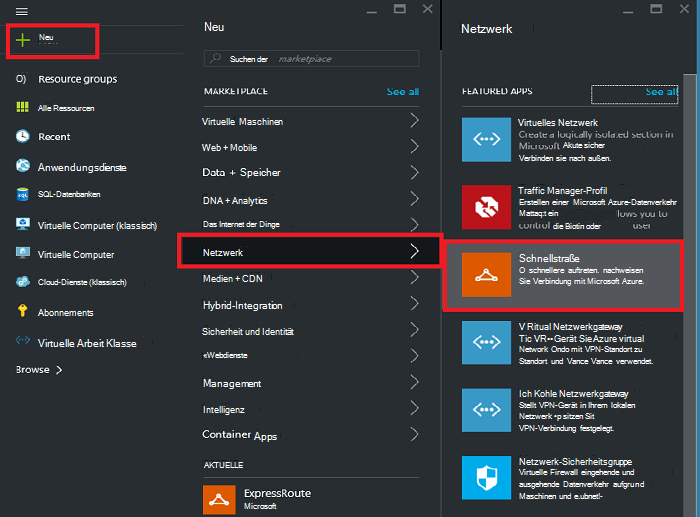
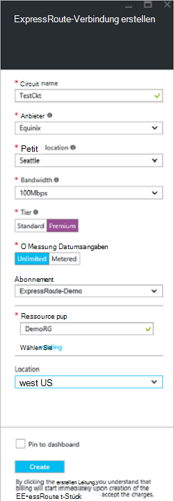
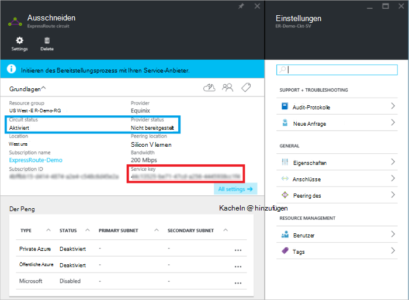
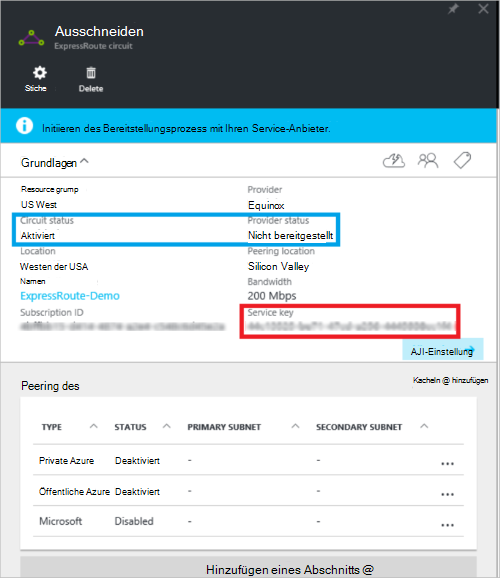
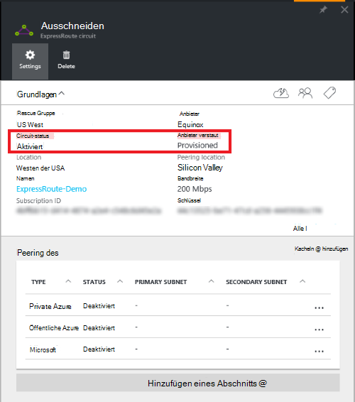

<properties
   pageTitle="Erstellen und Ändern einer ExpressRoute-Verbindung mit Ressourcen-Manager und Azure-Portal | Microsoft Azure"
   description="Dieser Artikel beschreibt das Erstellen, bereitstellen, überprüfen, aktualisieren, löschen und Entziehen von ExpressRoute-Verbindung."
   documentationCenter="na"
   services="expressroute"
   authors="cherylmc"
   manager="carmonm"
   editor=""
   tags="azure-resource-manager"/>
<tags
   ms.service="expressroute"
   ms.devlang="na"
   ms.topic="article"
   ms.tgt_pltfrm="na"
   ms.workload="infrastructure-services"
   ms.date="10/10/2016"
   ms.author="cherylmc"/>

# Erstellen und Ändern von ExpressRoute-Verbindung

> [AZURE.SELECTOR]
[Azure-Portal - Ressourcen-Manager](expressroute-howto-circuit-portal-resource-manager.md)
[PowerShell - Ressourcen-Manager](expressroute-howto-circuit-arm.md)
[PowerShell - Klassisch](expressroute-howto-circuit-classic.md)

Dieser Artikel beschreibt, wie ein Azure ExpressRoute-Verbindung mithilfe der Azure-Portal und Azure-Ressourcen-Manager-Bereitstellungsmodell. Die folgenden Schritte zeigen auch wie den Status der Verbindung überprüfen, aktualisieren oder löschen und entziehen sie.

**Azure-Bereitstellung Modelle**

[AZURE.INCLUDE [vpn-gateway-clasic-rm](../../includes/vpn-gateway-classic-rm-include.md)] 

## Bevor Sie beginnen

- Überprüfen Sie vor der Konfiguration [erforderlichen Komponenten](expressroute-prerequisites.md) und [Workflows](expressroute-workflows.md) .
- Achten Sie auf [Azure-Portal](https://portal.azure.com).
- Sicherstellen Sie, dass Sie Berechtigungen zum Erstellen von neuer Netzwerkressourcen. Nicht die richtigen Berechtigungen verfügen, oder wenden Sie sich an den Kontoadministrator.

## Erstellen und Bereitstellen einer ExpressRoute-Verbindung

### 1. Melden Sie sich bei Azure-portal

In einem Browser zu [Azure-Portal](http://portal.azure.com) und Azure-Konto anmelden.

### 2. erstellen Sie eine neue ExpressRoute-Verbindung

>[AZURE.IMPORTANT] ExpressRoute-Verbindung wird von dem Moment berechnet ein Dienstschlüssel ausgestellt. Stellen Sie sicher, dass Sie diesen Vorgang ausführen, wenn Connectivity-Anbieter die Verbindung bereitstellen kann.

1. ExpressRoute-Verbindung können durch Auswählen der Option zum Erstellen einer neuen Ressource. Klicken Sie auf **neu** > **Netzwerk** > **ExpressRoute**, wie in der folgenden Abbildung dargestellt:

    

2. Wenn Sie **ExpressRoute**klicken, sehen Sie Blade **Erstellen ExpressRoute-Verbindung** . Beim Ausfüllen der Werte auf dieser Stellen Sie sicher, dass die richtige SKU-Ebene und Messung von Daten angeben.

    - **Ebene** bestimmt, ob ein ExpressRoute Standard oder ExpressRoute Premium Add-on aktiviert ist. Sie können **standardmäßige** standard SKU oder **Premium** für die zusätzliche Prämie erhalten.

    - **Daten Messung** bestimmt die Rechnungsadresse. Sie können für einen Datentarif **kostenpflichtig** Messwerte Plan und **unbegrenzt** angeben. Beachten Sie, dass Ändern des Rechnungsadressen Typs von **kostenpflichtig** **unbegrenzt**, aber Sie können den Typ von **unbegrenzt** in **kostenpflichtig**ändern.

    

>[AZURE.IMPORTANT] Beachten Sie Peering Speicherort den [Speicherort](expressroute-locations.md) angibt, in dem Sie Microsoft peering. Dies **hängt "Location"-Eigenschaft, die auf der Geografie der Azure-Netzwerkanbieter Ressource befindet** . Während sie nicht verbunden sind, wird empfohlen, wählen Sie eine Ressource Netzwerkanbieter geografisch der Nähe Peering des Stromkreises. 

### 3. die Stromkreise und Eigenschaften anzeigen

**Alle Schaltkreise anzeigen**

Sie können alle Stromkreise anzeigen, die auswählen **alle Ressourcen** im linken Menü erstellt.
    

**Anzeigen der Eigenschaften**

    You can view the properties of the circuit by selecting it. On this blade, note the service key for the circuit. You must copy the circuit key for your circuit and pass it down to the service provider to complete the provisioning process. The circuit key is specific to your circuit.

### 4. Senden des Schlüssels an Ihren konnektivitätsanbieter für für die Bereitstellung

Auf dieses Blatt enthält **Anbieter** Informationen über den aktuellen Status der Bereitstellung auf Service-Anbieter. **Circuit-Status** stellt den Status auf Microsoft. Weitere Informationen zu Bereitstellung Staaten Circuit finden Sie [Workflows](expressroute-workflows.md#expressroute-circuit-provisioning-states) .

Beim Erstellen einer neuen ExpressRoute-Verbindung werden die Leitung in folgenden Status:

Anbieter: nicht bereitgestellt. 
Schaltkreis-Status: aktiviert

Die Leitung wird folgende Status ändern, wenn konnektivitätsanbieter aktivieren Sie derzeit:

Anbieter: Bereitstellung 
Schaltkreis-Status: aktiviert

Zur ExpressRoute-Verbindung verwenden muss es folgende Status:

Anbieter: bereitgestellt 
Schaltkreis-Status: aktiviert

### 5. regelmäßig den Status und den Zustand der Taste circuit

Sie können die Eigenschaften des Stromkreises anzeigen, die Sie interessiert sind, indem Sie es auswählen. Überprüfen Sie den **Status für Anbieter** und sicherzustellen Sie, dass es **bereitgestellt** verschoben hat, bevor Sie fortfahren.

### 6. die Routingkonfiguration erstellen

Eine schrittweise Anleitung finden Sie im Artikel [ExpressRoute Circuit Routingkonfiguration](expressroute-howto-routing-portal-resource-manager.md) Circuit Peerings zu erstellen.

>[AZURE.IMPORTANT] Diese Schritte gelten nur für Stromkreise mit erstellt werden, die Ebene 2 Connectivity Services anbieten. Verwenden Sie einen Dienstanbieter, der verwaltete bietet Schicht 3 Dienste (normalerweise eine IP VPN, wie MPLS), Dienstanbieter Verbindung konfigurieren und Verwalten von routing für Sie.

### 7. Link eines virtuellen Netzwerks auf ExpressRoute-Verbindung

Anschließend verknüpfen Sie ein virtuelles Netzwerk mit ExpressRoute-Verbindung. Verwenden Sie beim Arbeiten mit dem Ressourcen-Manager-Bereitstellungsmodell Artikel [Verknüpfen virtuelle Netzwerke an ExpressRoute](expressroute-howto-linkvnet-arm.md) .

## Ermitteln des Status der ExpressRoute-Verbindung

Sie können den Status eines auswählen und anzeigen. 

## ExpressRoute-Verbindung ändern

Sie können bestimmte Eigenschaften des ExpressRoute-Verbindung ohne Beeinträchtigung der Konnektivität. Zu diesem Zeitpunkt nicht möglich Sie Azure-Portal mit ExpressRoute Circuit Eigenschaften ändern. Allerdings können Sie PowerShell Circuit-Eigenschaften ändern. Weitere Informationen finden Sie im Abschnitt [ExpressRoute-Verbindung mithilfe von PowerShell ändern](expressroute-howto-circuit-arm.md#modify).

Sie können Folgendes ohne Ausfallzeiten:

- Aktivieren Sie oder deaktivieren Sie die ExpressRoute Premium Add-on für ExpressRoute-Verbindung.

- Erhöhen der Bandbreite von ExpressRoute-Verbindung. Beachten Sie, dass Bandbreite eines Herabstufung nicht unterstützt wird. 

- Ändern des Dosierung Plans aus gemessen in Daten. Beachten Sie, dass das Ändern der Messung von Daten gemessen Daten planen wird nicht unterstützt.

-  Aktivieren und deaktivieren Sie **Klassische Vorgänge zulassen**.

Weitere Informationen über Grenzwerte und Einschränkungen finden Sie [FAQ ExpressRoute](expressroute-faqs.md).

## Deaktivieren und Löschen von ExpressRoute-Verbindung

Sie können ExpressRoute-Verbindung löschen, **Löschen Sie** das Symbol. Beachten Sie Folgendes:

- Sie müssen alle virtuellen Netzwerke von ExpressRoute-Verbindung aufheben. Wenn dieser Vorgang fehlschlägt, überprüfen Sie, ob alle virtuellen Netzwerke mit der Verbindung verknüpft sind.

- Die ExpressRoute Circuit Service Provider Bereitstellung **Bereitstellung** oder **bereitgestellt** ist müssen Sie beim Dienstanbieter zu entziehen Circuit auf ihrer Seite arbeiten. Wir werden weiterhin Ressourcen reservieren und Abrechnung bis Dienstanbieter Aufhebung der Verbindung abgeschlossen ist und uns benachrichtigt.

- Wenn der Dienstanbieter die Verbindung hat hat (Service Provider-Bereitstellungsstatus soll **nicht**bereitgestellt) können Sie die Verbindung löschen. Dies beendet die Abrechnung für die Leitung

## Nächste Schritte

Nach dem Erstellen der Verbindung sicher, dass Sie Folgendes tun:

- [Erstellen und Ändern von routing für ExpressRoute-Verbindung](expressroute-howto-routing-portal-resource-manager.md)
- [Verknüpfen von virtuellen Netzwerk mit ExpressRoute-Verbindung](expressroute-howto-linkvnet-arm.md)
