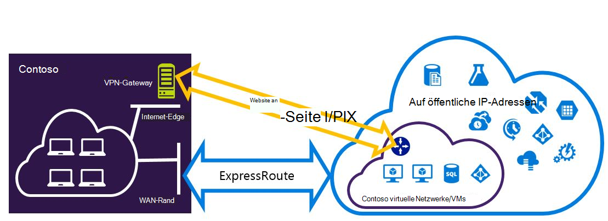
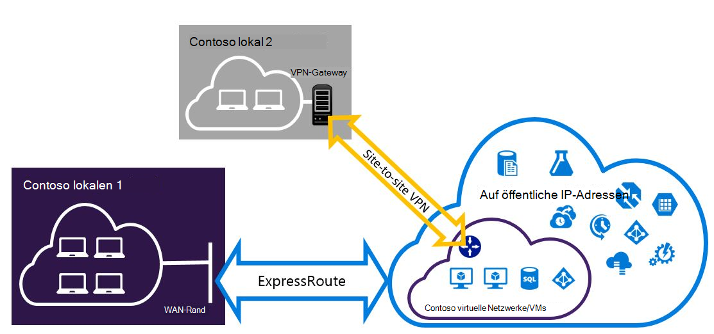

<properties
   pageTitle="Expressroute und Standort-zu-Standort-VPN-Verbindungen, die koexistieren konfigurieren | Microsoft Azure"
   description="Dieser Artikel führt Sie durch die Konfiguration von ExpressRoute und eine Standort-zu-Standort-VPN-Verbindung, die das klassische Bereitstellungsmodell gleichzeitig vorhanden sein kann."
   documentationCenter="na"
   services="expressroute"
   authors="charwen"
   manager="carmonm"
   editor=""
   tags="azure-service-management"/>
<tags
   ms.service="expressroute"
   ms.devlang="na"
   ms.topic="get-started-article"
   ms.tgt_pltfrm="na"
   ms.workload="infrastructure-services"
   ms.date="10/10/2016"
   ms.author="charwen"/>

# Konfigurieren Sie ExpressRoute und zwischen Standorten Koexistenz Verbindungen für klassische Bereitstellungsmodell

> [AZURE.SELECTOR]
- [PowerShell - Ressourcen-Manager](expressroute-howto-coexist-resource-manager.md)
- [PowerShell - klassisch](expressroute-howto-coexist-classic.md)

Konfigurieren von Standort zu Standort VPN und ExpressRoute hat mehrere Vorteile. Sie können Standort-zu-Standort-VPN als sicheres Failover Pfad für ExressRoute, oder Standort-zu-Standort-VPNs Verbindung zu Websites, die nicht durch ExpressRoute verwenden. Die Schritte zum Konfigurieren von beiden Szenarien in diesem Artikel behandelt wird. Dieser Artikel bezieht sich auf das klassische Bereitstellungsmodell. Diese Konfiguration ist nicht im Portal verfügbar.

**Azure-Bereitstellung Modelle**

[AZURE.INCLUDE [vpn-gateway-clasic-rm](../../includes/vpn-gateway-classic-rm-include.md)] 

>[AZURE.IMPORTANT] ExpressRoute Stromkreise müssen vorab konfiguriert werden, bevor die folgenden Anweisungen. Stellen Sie sicher, dass Sie Hilfslinien [ExpressRoute-Verbindung erstellen](expressroute-howto-circuit-classic.md) und [Konfigurieren von routing](expressroute-howto-routing-classic.md) befolgt haben, bevor Sie die folgenden Schritte.

## Grenzwerte und Grenzen

- **Übertragung routing wird nicht unterstützt.** Sie können nicht zwischen dem lokalen Netzwerk Standort-zu-Standort-VPN-Verbindung und das lokale Netzwerk angeschlossen ExpressRoute (über Azure) weiterleiten.
- **Punkt-zu-Standort wird nicht unterstützt.** Sie können nicht Punkt-zu-Standort-VPN-Verbindungen, die dieselbe VNet aktivieren, die mit ExpressRoute verbunden. Punkt-zu-Standort-VPN und ExpressRoute können nicht für denselben VNet ausgeführt werden.
- **Erzwungene Tunnel kann der Standort-zu-Standort-VPN-Gateways aktiviert werden.** Sie können nur "alle Internet gerichtete Datenverkehr an das lokale Netzwerk über ExpressRoute erzwingen".
- **Grundlegende SKU-Gateway wird nicht unterstützt.** Sie müssen nicht grundlegende SKU Gateway [ExpressRoute Gateway](expressroute-about-virtual-network-gateways.md) und das [VPN-Gateway](../vpn-gateway/vpn-gateway-about-vpngateways.md)verwenden.
- **Nur Route-basierte VPN-Gateway unterstützt.** Route-basierte [VPN-Gateway](../vpn-gateway/vpn-gateway-about-vpngateways.md)verwenden.
- **Statische Route sollte für das VPN-Gateway konfiguriert werden.** Wenn das lokale Netzwerk mit ExpressRoute und ein Standort-zu-Standort-VPN verbunden ist, müssen Sie eine statische Route im lokalen Netzwerk die Standort-zu-Standort-VPN-Verbindung mit dem öffentlichen Internet weiterleiten konfiguriert.
- **ExpressRoute-Gateway muss zuerst konfiguriert werden.** Vor dem Hinzufügen von Standort zu Standort VPN-Gateway, müssen Sie zuerst das Gateway ExpressRoute erstellen.

## Konfiguration-designs

### Konfigurieren Sie eine Standort-zu-Standort-VPN als Failover-Pfad für ExpressRoute

Sie können eine Standort-zu-Standort-VPN-Verbindung als Sicherung für ExpressRoute konfigurieren. Dies gilt nur für virtuelle Netzwerke Azure private peering Pfad verknüpft. Gibt keine VPN-basierten Failoverlösung für Microsoft Peerings und Azure public. ExpressRoute-Verbindung ist immer der primäre Link. Daten fließen über den Standort-zu-Standort-VPN-Pfad nur, wenn ExpressRoute-Verbindung fehlschlägt. 

### Konfigurieren eines Standort-zu-Standort-VPN Verbindung zu Websites über ExpressRoute nicht verbunden

Sie können Ihr Netzwerk, einige Websites verbinden direkt in Azure Standort-zu-Standort-VPN und einige Websites über Expressroute, konfigurieren. 

>[AZURE.NOTE] Konfigurieren eines virtuellen Netzwerks als Router während der Übertragung nicht möglich.

## Schritte zur Auswahl

Es gibt zwei unterschiedliche Vorgehensweisen wählen, um Verbindungen zu konfigurieren, die gleichzeitig vorhanden sein können. Die gewählte Konfiguration hängt davon ab, ob Sie haben ein vorhandenes virtuelles Netzwerk, das Sie möchten oder ein neues virtuelles Netzwerk erstellen möchten.

- Ich habe ein VNet und erstellen müssen.
    
    Haben Sie bereits ein virtuelles Netzwerk, führt dieses Verfahren Sie durch Erstellen eines neuen virtuellen Netzwerks klassischen Bereitstellungsmodell und neue ExpressRoute und Standort-zu-Standort-VPN-Verbindungen. Konfigurieren der Schritte im Artikelabschnitt [Erstellen Sie ein neues virtuelles Netzwerk und Koexistenz Verbindungen](#new).

- Ich habe bereits einen klassischen Bereitstellungsmodell VNet.

    Sie haben bereits ein virtuelles Netzwerk mit einem vorhandenen Standort-zu-Standort-VPN-Verbindung oder ExpressRoute-Verbindung. Artikelabschnitt [Coexsiting Anschlüsse für eine bereits vorhandene VNet konfigurieren](#add) gehen Sie das Gateway löschen und erstellen neue ExpressRoute und Standort-zu-Standort-VPN-Verbindungen. Beachten Sie, dass die Schritte beim Erstellen von neuen Verbindungen in einer ganz bestimmten Reihenfolge ausgeführt werden müssen. Verwenden der Anleitung in anderen Artikeln um ein Gateways und Verbindungen zu erstellen.

    In diesem Verfahren wird erstellen koexistieren können Verbindungen müssen Sie Ihr Gateway löschen und neue Gateways konfigurieren. Dies bedeutet, dass Sie Ausfallzeiten für die standortübergreifende Verbindung beim Löschen und neu erstellen die Gateway- und Verbindungen, Sie müssen jedoch Ihre VMs oder Services ein neues virtuelles Netzwerk migrieren. Ihr virtueller Computer und Dienste werden während Ihres Gateways konfigurieren, wenn sie dazu konfiguriert, über den Lastenausgleich kommunizieren.

## Erstellen Sie ein neues virtuelles Netzwerk und Koexistenz Verbindungen

Diese Prozedur erstellt ein VNet durchlaufen und zwischen Standorten und ExpressRoute Verbindungen, die gemeinsam verwendet werden.

1. Sie müssen die neueste Version von Azure PowerShell-Cmdlets installieren. Informationen Sie [zum Installieren und Konfigurieren von Azure PowerShell](../powershell-install-configure.md) Weitere Informationen zum Installieren von PowerShell-Cmdlets. Beachten Sie, dass die Cmdlets, die Sie für diese Konfiguration verwenden als Sie kennen möglicherweise etwas anders. Werden Sie verwenden Sie die Cmdlets in dieser Anleitung angegeben. 

2. Erstellen Sie ein Schema für Ihr virtuelles Netzwerk. Weitere Informationen über das Konfigurationsschema anzeigen Sie [Azure Virtual Network Configuration schema](https://msdn.microsoft.com/library/azure/jj157100.aspx)

    Beim Erstellen eines Schemas stellen Sie sicher, dass Sie die folgenden Werte verwenden:

    - Das gatewaysubnetz für das virtuelle Netzwerk muss /27 oder kürzere Präfix (z. B. /26 oder /25).
    - Gateway-Verbindungstyp "engagiert".

              <VirtualNetworkSite name="MyAzureVNET" Location="Central US">
                <AddressSpace>
                  <AddressPrefix>10.17.159.192/26</AddressPrefix>
                </AddressSpace>
                <Subnets>
                  <Subnet name="Subnet-1">
                    <AddressPrefix>10.17.159.192/27</AddressPrefix>
                  </Subnet>
                  <Subnet name="GatewaySubnet">
                    <AddressPrefix>10.17.159.224/27</AddressPrefix>
                  </Subnet>
                </Subnets>
                <Gateway>
                  <ConnectionsToLocalNetwork>
                    <LocalNetworkSiteRef name="MyLocalNetwork">
                      <Connection type="Dedicated" />
                    </LocalNetworkSiteRef>
                  </ConnectionsToLocalNetwork>
                </Gateway>
              </VirtualNetworkSite>

3. Laden Sie die Datei nach dem Erstellen und Konfigurieren der XML-Schemadatei. Dies wird Ihr virtuelle Netzwerk erstellen.

    Verwenden Sie das folgende Cmdlet die hochladen den Wert durch Ihren eigenen ersetzen.

        Set-AzureVNetConfig -ConfigurationPath 'C:\NetworkConfig.xml'

4. Erstellen Sie einen ExpressRoute-Gateway. Werden Sie die GatewaySKU als *Standard* *leistungsstarker*oder *UltraPerformance* und GatewayType als *DynamicRouting*an.

    Verwenden Sie im folgende Beispiel die Werte für Ihren eigenen.

        New-AzureVNetGateway -VNetName MyAzureVNET -GatewayType DynamicRouting -GatewaySKU HighPerformance

5. Verknüpfen Sie Gateway ExpressRoute auf ExpressRoute-Verbindung. Nachdem dieser Schritt abgeschlossen ist, wird die Verbindung zwischen dem lokalen Netzwerk und Azure über ExpressRoute, hergestellt.

        New-AzureDedicatedCircuitLink -ServiceKey <service-key> -VNetName MyAzureVNET

6. Erstellen Sie anschließend das Standort-zu-Standort-VPN-Gateway. Die GatewaySKU muss *Standard* *leistungsstarker*oder *UltraPerformance* und die GatewayType müssen *DynamicRouting*sein.

        New-AzureVirtualNetworkGateway -VNetName MyAzureVNET -GatewayName S2SVPN -GatewayType DynamicRouting -GatewaySKU  HighPerformance

    Virtuelles Netzwerk-Gateway-Einstellungen Gateway-ID sowie öffentliche IP abrufen verwenden die `Get-AzureVirtualNetworkGateway` Cmdlet.

        Get-AzureVirtualNetworkGateway

        GatewayId            : 348ae011-ffa9-4add-b530-7cb30010565e
        GatewayName          : S2SVPN
        LastEventData        :
        GatewayType          : DynamicRouting
        LastEventTimeStamp   : 5/29/2015 4:41:41 PM
        LastEventMessage     : Successfully created a gateway for the following virtual network: GNSDesMoines
        LastEventID          : 23002
        State                : Provisioned
        VIPAddress           : 104.43.x.y
        DefaultSite          :
        GatewaySKU           : HighPerformance
        Location             :
        VnetId               : 979aabcf-e47f-4136-ab9b-b4780c1e1bd5
        SubnetId             :
        EnableBgp            : False
        OperationDescription : Get-AzureVirtualNetworkGateway
        OperationId          : 42773656-85e1-a6b6-8705-35473f1e6f6a
        OperationStatus      : Succeeded

7. Erstellen einer lokalen Website VPN-Gateway Entität. Dieser Befehl konfigurieren nicht das lokale VPN-Gateway. Stattdessen können Sie das lokale Gateway Einstellungen, wie öffentliche IP-Adresse und der lokalen Adresse Speicherplatz, sodass Azure VPN-Gateway herstellen kann.

    >[AZURE.IMPORTANT] Am lokalen Standort für Standort-zu-Standort-VPN ist nicht in der Netcfg definiert. Dieses Cmdlet verwenden Sie stattdessen die Ort-Parameter angeben. Sie können nicht mit Portal oder die Datei Netcfg definieren.

    Verwenden Sie im folgende Beispiel durch eigene Werte ersetzen.

        New-AzureLocalNetworkGateway -GatewayName MyLocalNetwork -IpAddress <MyLocalGatewayIp> -AddressSpace <MyLocalNetworkAddress>

    > [AZURE.NOTE] Wenn das lokale Netzwerk mehrere Routen verfügt, übergeben Sie Sie alle als Array.  $MyLocalNetworkAddress =@("10.1.2.0/24","10.1.3.0/24","10.2.1.0/24")  

    Virtuelles Netzwerk-Gateway-Einstellungen Gateway-ID sowie öffentliche IP abrufen verwenden die `Get-AzureVirtualNetworkGateway` Cmdlet. Siehe folgendes Beispiel.

        Get-AzureLocalNetworkGateway

        GatewayId            : 532cb428-8c8c-4596-9a4f-7ae3a9fcd01b
        GatewayName          : MyLocalNetwork
        IpAddress            : 23.39.x.y
        AddressSpace         : {10.1.2.0/24}
        OperationDescription : Get-AzureLocalNetworkGateway
        OperationId          : ddc4bfae-502c-adc7-bd7d-1efbc00b3fe5
        OperationStatus      : Succeeded

8. Konfigurieren Sie das lokale VPN-Gerät Verbindung mit neuer Gateway. Verwenden Sie die Informationen, die Sie in Schritt 6 abgerufen, wenn die VPN-Konfiguration. Weitere Informationen zu VPN-Konfiguration finden Sie unter [VPN-Konfiguration](../vpn-gateway/vpn-gateway-about-vpn-devices.md).

9. Verknüpfen Sie Standort-zu-Standort-VPN-Gateway auf Azure mit dem lokalen Gateway.

    In diesem Beispiel ist ConnectedEntityId der lokalen Gateway-ID finden Sie mit `Get-AzureLocalNetworkGateway`. Finden Sie mit VirtualNetworkGatewayId die `Get-AzureVirtualNetworkGateway` Cmdlet. Nach diesem Schritt wird die Verbindung zwischen dem lokalen Netzwerk und Azure über die Standort-zu-Standort-VPN-Verbindung hergestellt.

        New-AzureVirtualNetworkGatewayConnection -connectedEntityId <local-network-gateway-id> -gatewayConnectionName Azure2Local -gatewayConnectionType IPsec -sharedKey abc123 -virtualNetworkGatewayId <azure-s2s-vpn-gateway-id>

## Coexsiting-Anschlüsse für eine bereits vorhandene VNet konfigurieren

Wenn Sie ein vorhandenes virtuelles Netzwerk haben, überprüfen Sie Gateway Subnetz Größe. Ist das gatewaysubnetz /28 oder /29, müssen Sie das virtuelle Netzwerkgateway löschen und vergrößern Sie Gateway Subnetz. Die Schritte in diesem Abschnitt zeigen Ihnen dazu.

Ist das gatewaysubnetz /27 oder das virtuelle Netzwerk angeschlossen ExpressRoute und Schritte überspringen und fahren Sie mit ["Schritt 6 - erstellen eine Standort-zu-Standort-VPN-Gateway"](#vpngw) im vorherigen Abschnitt.

>[AZURE.NOTE] Beim Löschen des vorhandenen Gateways verlieren Ihnen vor Ort die Verbindung mit dem virtuellen Netzwerk, während dieser Konfiguration arbeiten.

1. Sie müssen die neueste Version von Azure Ressourcenmanager PowerShell-Cmdlets installieren. Informationen Sie [zum Installieren und Konfigurieren von Azure PowerShell](../powershell-install-configure.md) Weitere Informationen zum Installieren von PowerShell-Cmdlets. Beachten Sie, dass die Cmdlets, die Sie für diese Konfiguration verwenden als Sie kennen möglicherweise etwas anders. Werden Sie verwenden Sie die Cmdlets in dieser Anleitung angegeben. 

2. Löschen Sie vorhandene ExpressRoute oder Standort-zu-Standort-VPN-Gateway. Verwenden Sie das folgende Cmdlet durch eigene Werte ersetzen.

        Remove-AzureVNetGateway –VnetName MyAzureVNET

3. Exportieren Sie das virtuelle Netzwerk Schema. Verwenden Sie das folgende PowerShell-Cmdlet durch eigene Werte ersetzen.

        Get-AzureVNetConfig –ExportToFile “C:\NetworkConfig.xml”

4. Bearbeiten Sie Netzwerk-Konfigurationsdateischema, sodass gatewaysubnetz /27 oder kürzere Präfix (z. B. /26 oder /25) ist. Siehe folgendes Beispiel. 
>[AZURE.NOTE] Wenn genügend IP-Adressen im virtuellen Netzwerk Gateway Subnetz vergrößert haben, müssen Sie weitere IP-Adressraum hinzufügen. Weitere Informationen über das Konfigurationsschema anzeigen Sie [Azure Virtual Network Configuration schema](https://msdn.microsoft.com/library/azure/jj157100.aspx)

          <Subnet name="GatewaySubnet">
            <AddressPrefix>10.17.159.224/27</AddressPrefix>
          </Subnet>

5. Wurde Ihre vorherige Gateway ein Standort-zu-Standort-VPN müssen Sie **dedizierte**auch den Verbindungstyp ändern.

                 <Gateway>
                  <ConnectionsToLocalNetwork>
                    <LocalNetworkSiteRef name="MyLocalNetwork">
                      <Connection type="Dedicated" />
                    </LocalNetworkSiteRef>
                  </ConnectionsToLocalNetwork>
                </Gateway>

6. Zu diesem Zeitpunkt haben Sie eine VNet mit keine Gateways. Um neue Gateways erstellen und Ihre Verbindung abzuschließen, können Sie mit [Schritt 4: erstellen ein ExpressRoute-Gateways](#gw)finden in den vorhergehenden Schritten fortfahren.

## Nächste Schritte

Weitere Informationen zu ExpressRoute finden Sie im [ExpressRoute häufig gestellte Fragen](expressroute-faqs.md)
