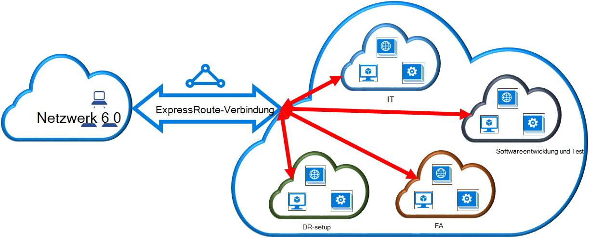

<properties 
   pageTitle="Verknüpfen Sie ein virtuelles Netzwerk mit ExpressRoute-Verbindung mithilfe von PowerShell | Microsoft Azure"
   description="Dieses Dokument Überblick wie virtuelle Netzwerke (VNets) an ExpressRoute mithilfe der Ressourcen-Manager-Bereitstellungsmodell und PowerShell."
   services="expressroute"
   documentationCenter="na"
   authors="ganesr"
   manager="carmonm"
   editor=""
   tags="azure-resource-manager"/>
<tags 
   ms.service="expressroute"
   ms.devlang="na"
   ms.topic="article"
   ms.tgt_pltfrm="na"
   ms.workload="infrastructure-services"
   ms.date="10/10/2016"
   ms.author="ganesr" />

# Verknüpfen Sie ein virtuelles Netzwerk mit ExpressRoute-Verbindung

> [AZURE.SELECTOR]
- [Azure-Portal - Ressourcen-Manager](expressroute-howto-linkvnet-portal-resource-manager.md)
- [PowerShell - Ressourcen-Manager](expressroute-howto-linkvnet-arm.md)
- [PowerShell - klassisch](expressroute-howto-linkvnet-classic.md)

Dieser Artikel hilft Ihnen mit dem Ressourcen-Manager-Bereitstellungsmodell PowerShell Azure ExpressRoute Stromkreise virtuelle Netzwerke (VNets) verknüpfen. Virtuelle Netzwerke können entweder in der gleichen Abonnement oder ein anderes Abonnement sein.

**Azure-Bereitstellung Modelle**

[AZURE.INCLUDE [vpn-gateway-clasic-rm](../../includes/vpn-gateway-classic-rm-include.md)] 

## Erforderliche Konfiguration

- Sie benötigen die neueste Version von Azure PowerShell-Module (mindestens Version 1.0). Informationen Sie [zum Installieren und Konfigurieren von Azure PowerShell](../powershell-install-configure.md) Weitere Informationen zum Installieren von PowerShell-Cmdlets.
- Sie müssen vor der Konfiguration der [Komponenten](expressroute-prerequisites.md) [Routinganforderungen](expressroute-routing.md)und [Workflows](expressroute-workflows.md) überprüfen.
- Sie benötigen eine aktive ExpressRoute-Verbindung. 
    - Gehen Sie zum [Erstellen einer ExpressRoute-Verbindung](expressroute-howto-circuit-arm.md) und haben Sie Verbindung von Ihrem Konnektivität aktiviert. 
    - Sicherstellen Sie, dass Sie Azure private peering für die Verbindung konfiguriert. Finden Sie Artikel [routing konfigurieren](expressroute-howto-routing-arm.md) Routinganweisungen. 
    - Sicherstellen Sie, dass Azure private peering konfiguriert und BGP peering zwischen Ihrem Netzwerk und Microsoft sodass End-to-End-Konnektivität zu aktivieren.
    - Stellen Sie sicher, dass Sie ein virtuelles Netzwerk und ein virtuelles Netzwerk-Gateway erstellt und vollständig bereitgestellt. Gehen Sie ein [VPN-Gateway](../articles/vpn-gateway/vpn-gateway-create-site-to-site-rm-powershell.md)erstellen, aber verwenden `-GatewayType ExpressRoute`.

Sie können bis zu 10 virtuelle Netzwerke an einem standard ExpressRoute verknüpfen. Alle virtuellen Netzwerke muss im gleichen geopolitischen Regionen Verwendung standard ExpressRoute-Verbindung. 

Sie können virtuelle Netzwerke außerhalb der geopolitischen des ExpressRoute Stromkreises verknüpfen, oder eine größere Anzahl von virtuellen Netzwerken ExpressRoute-Verbindung ExpressRoute Premium Add-on aktiviert. [FAQ](expressroute-faqs.md) für weitere Details zu Premium Add-on überprüfen.

## Ein virtuelles Netzwerk in der gleichen Anmeldung einer Verbindung

Sie können ein virtuelles Netzwerk-Gateway zu ExpressRoute-Verbindung mit dem folgenden Cmdlet. Stellen Sie sicher, dass virtuelle Netzwerk-Gateway erstellt und verknüpfen, bevor Sie das Cmdlet ausführen kann:

    $circuit = Get-AzureRmExpressRouteCircuit -Name "MyCircuit" -ResourceGroupName "MyRG"
    $gw = Get-AzureRmVirtualNetworkGateway -Name "ExpressRouteGw" -ResourceGroupName "MyRG"
    $connection = New-AzureRmVirtualNetworkGatewayConnection -Name "ERConnection" -ResourceGroupName "MyRG" -Location "East US" -VirtualNetworkGateway1 $gw -PeerId $circuit.Id -ConnectionType ExpressRoute

## Ein virtuelles Netzwerk in ein anderes Abonnement einer Verbindung

Sie können mehrere Abonnements ExpressRoute-Verbindung freigeben. Die folgende Abbildung zeigt ein einfaches Schema wie Teilen arbeiten für ExpressRoute Stromkreise über mehrere Abonnements.

Jede kleineren Wolken große Cloud dient Abonnements darstellen, die Abteilungen innerhalb einer Organisation angehören. Jede Abteilung innerhalb des Unternehmens können eigene Abonnement für die Bereitstellung ihrer Dienste – aber sie können eine einzelne ExpressRoute-Verbindung Verbindung zum lokalen Netzwerk freigeben. Eine einzelne Abteilung (in diesem Beispiel: IT) können eigene ExpressRoute-Verbindung. Andere Abonnements innerhalb der Organisation können die ExpressRoute-Verbindung.

>[AZURE.NOTE] Konnektivität und Bandbreite Zuschläge für den Stromkreis werden der Verbindungsbesitzer ExpressRoute angewendet. Alle virtuellen Netzwerke teilen die gleiche Bandbreite.

### Verwaltung

Der *Verbindungsbesitzer* ist eine autorisierte Hauptbenutzer ExpressRoute Circuit Ressource. Der Verbindungsbesitzer kann Berechtigungen erstellen, die durch *Verbindungsbenutzer*eingelöst werden können. *Verbindungsbenutzer* haben virtuelles Netzwerk-Gateways (die nicht in dieselbe Abonnement als ExpressRoute-Verbindung). *Verbindungsbenutzer* können Berechtigungen (eine Autorisierung pro virtuelles Netzwerk) einlösen.

Der *Verbindungsbesitzer* versorgt ändern und Berechtigungen jederzeit widerrufen. Widerrufen einer Genehmigung führt alle Verbindung Abonnements, deren Zugriff widerrufen wurde, gelöscht.

### Circuit Besitzer Vorgänge 

#### Erstellen einer Genehmigung
    
Der Verbindungsbesitzer erstellt eine Autorisierung. Dies führt zur Erstellung Autorisierungsschlüssel Circuit-Benutzer ihre virtuellen Netzwerkgateways auf ExpressRoute-Verbindung Verbindung verwendet werden kann. Bewilligung gilt für nur eine Verbindung.

Die folgende Cmdlet Ausschnitt zeigt Bewilligung erstellen:

    $circuit = Get-AzureRmExpressRouteCircuit -Name "MyCircuit" -ResourceGroupName "MyRG"
    Add-AzureRmExpressRouteCircuitAuthorization -ExpressRouteCircuit $circuit -Name "MyAuthorization1"
    Set-AzureRmExpressRouteCircuit -ExpressRouteCircuit $circuit

        $circuit = Get-AzureRmExpressRouteCircuit -Name "MyCircuit" -ResourceGroupName "MyRG"
    $auth1 = Get-AzureRmExpressRouteCircuitAuthorization -ExpressRouteCircuit $circuit -Name "MyAuthorization1"
        

Die Antwort auf diese enthält Autorisierungsschlüssel und Status:

    Name                   : MyAuthorization1
    Id                     : /subscriptions/&&&&&&&&&&&&&&&&&&&&&&&&&&&&&&&&&&&&/resourceGroups/ERCrossSubTestRG/providers/Microsoft.Network/expressRouteCircuits/CrossSubTest/authorizations/MyAuthorization1
    Etag                   : &&&&&&&&&&&&&&&&&&&&&&&&&&&&&&&&&&&& 
    AuthorizationKey       : ####################################
    AuthorizationUseStatus : Available
    ProvisioningState      : Succeeded

        

#### Berechtigungen überprüfen

Der Verbindungsbesitzer kann alle Berechtigungen überprüfen, die auf einer bestimmten Strecke mit dem folgenden Cmdlet ausgegeben werden:

    $circuit = Get-AzureRmExpressRouteCircuit -Name "MyCircuit" -ResourceGroupName "MyRG"
    $authorizations = Get-AzureRmExpressRouteCircuitAuthorization -ExpressRouteCircuit $circuit
    

#### Hinzufügen von Berechtigungen

Der Verbindungsbesitzer kann mit dem folgenden Cmdlet Berechtigungen hinzufügen:

    $circuit = Get-AzureRmExpressRouteCircuit -Name "MyCircuit" -ResourceGroupName "MyRG"
    Add-AzureRmExpressRouteCircuitAuthorization -ExpressRouteCircuit $circuit -Name "MyAuthorization2"
    Set-AzureRmExpressRouteCircuit -ExpressRouteCircuit $circuit
    
    $circuit = Get-AzureRmExpressRouteCircuit -Name "MyCircuit" -ResourceGroupName "MyRG"
    $authorizations = Get-AzureRmExpressRouteCircuitAuthorization -ExpressRouteCircuit $circuit

    
#### Löschen von Berechtigungen

Der Verbindungsbesitzer kann widerrufen/Berechtigungen für den Benutzer löschen durch das folgende Cmdlet ausführen:

    Remove-AzureRmExpressRouteCircuitAuthorization -Name "MyAuthorization2" -ExpressRouteCircuit $circuit
    Set-AzureRmExpressRouteCircuit -ExpressRouteCircuit $circuit    

### Circuit-Benutzeraktionen

Der Verbindungsbenutzer benötigt die Peer-ID und Autorisierungsschlüssel aus der Verbindungsbesitzer. Autorisierung ist eine GUID.

Peer-ID wird aus dem folgenden Befehl überprüft werden.

    Get-AzureRmExpressRouteCircuit -Name "MyCircuit" -ResourceGroupName "MyRG"

#### Verbindung Berechtigungen einlösen

Circuit-Benutzer kann das folgende Cmdlet Link Autorisierung einlösen ausführen:

    $id = "/subscriptions/********************************/resourceGroups/ERCrossSubTestRG/providers/Microsoft.Network/expressRouteCircuits/MyCircuit"  
    $gw = Get-AzureRmVirtualNetworkGateway -Name "ExpressRouteGw" -ResourceGroupName "MyRG"
    $connection = New-AzureRmVirtualNetworkGatewayConnection -Name "ERConnection" -ResourceGroupName "RemoteResourceGroup" -Location "East US" -VirtualNetworkGateway1 $gw -PeerId $id -ConnectionType ExpressRoute -AuthorizationKey "^^^^^^^^^^^^^^^^^^^^^^^^^^^^^^^^^^^^^^^^^^^^^"

#### Freigeben der Verbindung Berechtigungen

Eine Genehmigung kann durch Löschen der Verbindungs verbindet die ExpressRoute-Verbindung mit dem virtuellen Netzwerk freigegeben werden.

## Nächste Schritte

Weitere Informationen zu ExpressRoute finden Sie im [ExpressRoute häufig gestellte Fragen](expressroute-faqs.md).
