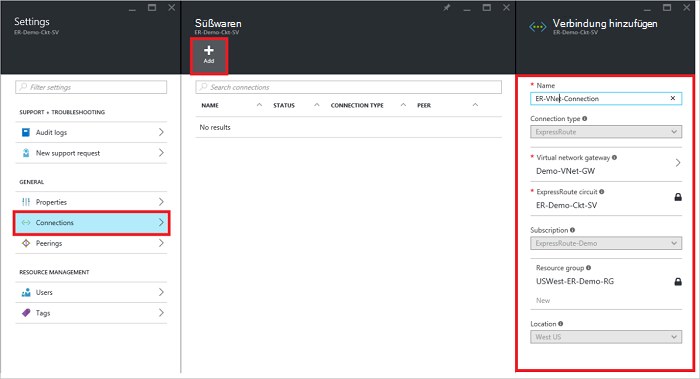
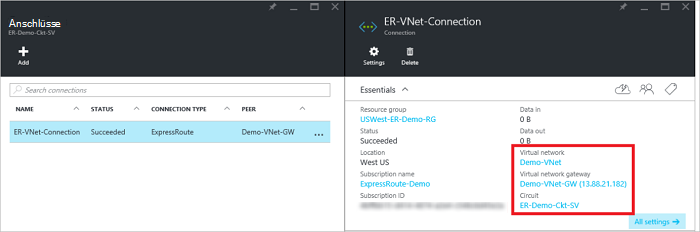

<properties
   pageTitle="Verknüpfen Sie ein virtuelles Netzwerk mit ExpressRoute-Verbindung mit dem Ressourcen-Manager-Bereitstellungsmodell und Azure-Portal | Microsoft Azure"
   description="Dieses Dokument bietet eine Übersicht über virtuelle Netzwerke (VNets) an ExpressRoute verknüpfen."
   services="expressroute"
   documentationCenter="na"
   authors="cherylmc"
   manager="carmonm"
   editor=""
   tags="azure-resource-manager"/>
<tags
   ms.service="expressroute"
   ms.devlang="na"
   ms.topic="article"
   ms.tgt_pltfrm="na"
   ms.workload="infrastructure-services"
   ms.date="10/10/2016"
   ms.author="cherylmc" />

# Verknüpfen Sie ein virtuelles Netzwerk mit ExpressRoute-Verbindung

> [AZURE.SELECTOR]
- [Azure-Portal - Ressourcen-Manager](expressroute-howto-linkvnet-portal-resource-manager.md)
- [PowerShell - Ressourcen-Manager](expressroute-howto-linkvnet-arm.md)
- [PowerShell - klassisch](expressroute-howto-linkvnet-classic.md)

Dieser Artikel hilft Ihnen virtuelle Netzwerke (VNets) Azure ExpressRoute Stromkreise mit dem Ressourcen-Manager-Bereitstellungsmodell und Azure-Portal verknüpfen. Virtuelle Netzwerke kann dieselbe Abonnement oder sie kann Teil einer anderen Abonnements.

**Azure-Bereitstellung Modelle**

[AZURE.INCLUDE [vpn-gateway-clasic-rm](../../includes/vpn-gateway-classic-rm-include.md)]

## Erforderliche Konfiguration

- Stellen Sie sicher, dass Sie [Komponenten](expressroute-prerequisites.md), [Arbeitsplan Vorschriften](expressroute-routing.md)und [Workflows](expressroute-workflows.md) überprüft haben, vor der Konfiguration.
- Sie benötigen eine aktive ExpressRoute-Verbindung.
    - Gehen Sie zum [Erstellen einer ExpressRoute-Verbindung](expressroute-howto-circuit-arm.md) und haben Sie Verbindung von Ihrem Konnektivität aktiviert.

    - Sicherstellen Sie, dass Sie Azure private peering für die Verbindung konfiguriert. Finden Sie Artikel [routing konfigurieren](expressroute-howto-routing-portal-resource-manager.md) Routinganweisungen.

    - Sicherstellen Sie, dass Azure private peering konfiguriert und BGP peering zwischen Ihrem Netzwerk und Microsoft sodass End-to-End-Konnektivität zu aktivieren.

    - Stellen Sie sicher, dass Sie ein virtuelles Netzwerk und ein virtuelles Netzwerk-Gateway erstellt und vollständig bereitgestellt. Folgen Sie zum Erstellen eines [VPN-Gateway](../articles/vpn-gateway/vpn-gateway-howto-site-to-site-resource-manager-portal.md) (folgen nur Schritte 1 bis 5).

Sie können bis zu 10 virtuelle Netzwerke an einem standard ExpressRoute verknüpfen. Alle virtuellen Netzwerke muss im gleichen geopolitischen Regionen Verwendung standard ExpressRoute-Verbindung. Sie können virtuelle Netzwerke außerhalb der geopolitischen des ExpressRoute Stromkreises verknüpfen, oder eine größere Anzahl von virtuellen Netzwerken ExpressRoute-Verbindung ExpressRoute Premium Add-on aktiviert. [FAQ](expressroute-faqs.md) für weitere Details zu Premium Add-on überprüfen.

## Ein virtuelles Netzwerk in der gleichen Anmeldung einer Verbindung

### Erstellen eine Verbindung

1. Stellen Sie sicher, dass die ExpressRoute-Verbindung und Azure private peering erfolgreich konfiguriert wurde. Führen Sie die Schritte [erstellen eine ExpressRoute-Verbindung](expressroute-howto-circuit-arm.md) und [routing konfigurieren](expressroute-howto-routing-arm.md). ExpressRoute-Verbindung sollte wie im folgenden Bild aussehen.

    

    >[AZURE.NOTE] BGP-Konfigurationsinformationen wird nicht angezeigt, wenn der Layer 3-Anbieter Ihre Peerings konfiguriert. Wenn Ihre Verbindung bereitgestellt ist, sollten Sie Verbindungen erstellen können.

2. Sie können nun eine Verbindung zum Verknüpfen der virtuellen Netzwerk-Gateway zum ExpressRoute-Verbindung bereitstellen. Klicken Sie auf **Verbindung** > **Hinzufügen** , öffnen Sie das Blade **Verbindung hinzufügen** und konfigurieren Sie die Werte. Finden Sie im folgenden Hinweis.

      

3. Nachdem die Verbindung erfolgreich konfiguriert, zeigt das Verbindungsobjekt die Informationen für die Verbindung.

    

### Löschen eine Verbindung

Sie können eine Verbindung löschen, **Löschen Sie** das Symbol für die Verbindung auf der.

## Ein virtuelles Netzwerk in ein anderes Abonnement einer Verbindung

Zu diesem Zeitpunkt können nicht Sie virtuelle Netzwerke über Abonnements mithilfe des Azure-Portals verbinden. Allerdings können Sie PowerShell dazu. Finden Sie weitere Informationen im Artikel [PowerShell](expressroute-howto-linkvnet-arm.md) .

## Nächste Schritte

Weitere Informationen zu ExpressRoute finden Sie im [ExpressRoute häufig gestellte Fragen](expressroute-faqs.md).
