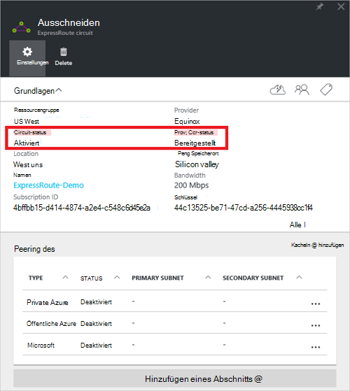
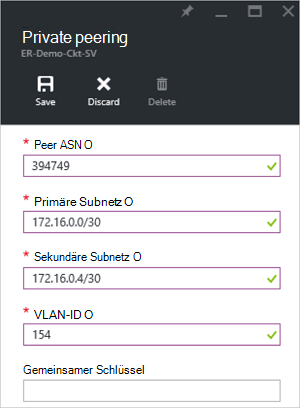
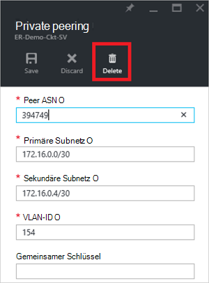
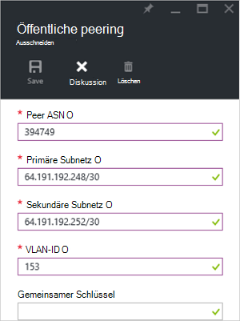
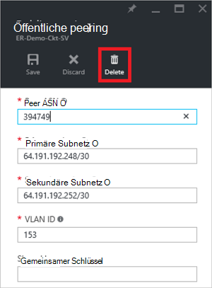
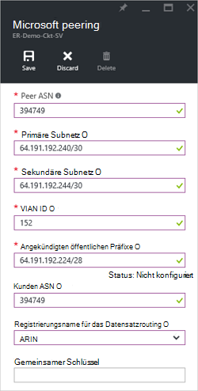
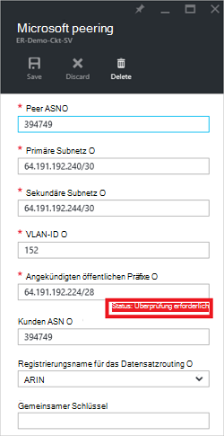
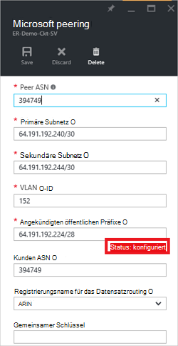

<properties
   pageTitle="Konfigurieren von routing für eine ExpressRoute-Verbindung mithilfe der Azure-Portal | Microsoft Azure"
   description="Dieser Artikel führt Sie durch die Schritte zum Erstellen und Bereitstellen der Private, öffentliche und Microsoft peering von ExpressRoute-Verbindung. In diesem Artikel auch veranschaulicht den Status aktualisieren oder Löschen von Peerings für Ihre Verbindung."
   documentationCenter="na"
   services="expressroute"
   authors="cherylmc"
   manager="carmonm"
   editor=""
   tags="azure-resource-manager"/>
<tags
   ms.service="expressroute"
   ms.devlang="na"
   ms.topic="hero-article" 
   ms.tgt_pltfrm="na"
   ms.workload="infrastructure-services"
   ms.date="10/10/2016"
   ms.author="cherylmc"/>

# Erstellen und Ändern von routing für eine ExpressRoute-Verbindung

> [AZURE.SELECTOR]
[Azure-Portal - Ressourcen-Manager](expressroute-howto-routing-portal-resource-manager.md)
[PowerShell - Ressourcen-Manager](expressroute-howto-routing-arm.md)
[PowerShell - Klassisch](expressroute-howto-routing-classic.md)

Dieser Artikel führt Sie durch die Schritte zum Erstellen und Verwalten von routing-Konfiguration für eine ExpressRoute-Verbindung Azure-Portal mit dem Ressourcen-Manager-Bereitstellungsmodell.

**Azure-Bereitstellung Modelle**

[AZURE.INCLUDE [vpn-gateway-clasic-rm](../../includes/vpn-gateway-classic-rm-include.md)] 

## Erforderliche Konfiguration

- Stellen Sie sicher, dass Sie der Seite [erforderliche Komponenten](expressroute-prerequisites.md) der Seite [routing von Vorschriften](expressroute-routing.md) und [der Seite](expressroute-workflows.md) überprüft haben, vor der Konfiguration.
- Sie benötigen eine aktive ExpressRoute-Verbindung. Gehen Sie zum [Erstellen einer ExpressRoute-Verbindung](expressroute-howto-circuit-arm.md) und haben Sie die Leitung von Ihrem Konnektivität aktiviert werden, bevor Sie fortfahren. ExpressRoute-Verbindung muss einen Zustand bereitgestellt und aktiviert Sie die Cmdlets beschrieben ausführen.

Diese Schritte gelten nur für Stromkreise mit Layer 2-Konnektivität Dienstleistungen erstellt. Wenn Sie ein Dienstleister mit Layer 3-Dienstleistungen (in der Regel ein IPVPN, wie MPLS) verwenden, wird Dienstanbieter Verbindung konfigurieren und verwalten Sie routing. 

>[AZURE.IMPORTANT] Wir anzeigen derzeit nicht von Dienstanbietern über Service Management-Portal konfiguriert Peerings. Wir arbeiten schnell, diese Fähigkeit zu aktivieren. Überprüfen Sie vor dem Konfigurieren von BGP Peerings mit Ihrem Dienstanbieter.

Sie können eine, zwei oder alle drei Peerings (Azure private, Azure Public und Microsoft) für eine ExpressRoute-Verbindung konfigurieren. Sie können Peerings in beliebiger Reihenfolge wählen Sie. Sie müssen jedoch sicherstellen, dass die Konfiguration der einzelnen Peers gleichzeitig. 

## Azure private peering

Dieser Abschnitt enthält Informationen zum Erstellen, abrufen, aktualisieren und Löschen von Azure private peering Konfiguration für ExpressRoute-Verbindung. 

### Azure private peering erstellen

1. Konfigurieren Sie ExpressRoute-Verbindung. Sicherstellen Sie, dass die Verbindung zunächst vollständig vom Anbieter Verbindung bereitgestellt wird.

    

2. Konfigurieren Sie Azure private peering für die Verbindung. Stellen Sie sicher, dass Sie über Folgendes verfügen, bevor Sie mit den nächsten Schritten fortfahren:

    - Keine/30 Subnetz für die primäre Verknüpfung. Dies muss keine Adressraum für virtuelle Netzwerke gehören.
    - Keine/30 Subnetz für den zweiten Link. Dies muss keine Adressraum für virtuelle Netzwerke gehören.
    - Eine gültige VLAN-ID zu peering auf. Sicherstellen Sie, dass keine anderen peering in den Kreislauf die gleiche VLAN-ID verwendet
    - Anzahl Peering. Sie können 2-Byte- und 4-Byte-Zahlen. Sie können Private als Nummer für dieses peering. Stellen Sie sicher, dass Sie nicht 65515.
    - MD5-Hash verwenden möchten. **Dieses Feld ist optional**.

3. Wählen Sie die Private Azure peering Zeile wie folgt.
    
    
    

4. Konfigurieren Sie private peering. Die Abbildung unten zeigt ein Beispiel.

    

    
5. Speichern Sie die Konfiguration, nachdem Sie alle Parameter angegeben haben. Wenn die Konfiguration erfolgreich akzeptiert wurde, sehen Sie ähnlich dem folgenden Beispiel.

    
    

### Azure private peering Details anzeigen

Sie können die Eigenschaften von Azure private peering durch Auswählen der peering anzeigen.

### Azure private peering Konfiguration aktualisieren

Sie können die Zeile für peering und peering Eigenschaften ändern. 

### Azure private peering löschen

Sie können peering Konfiguration löschen das Symbol wie folgt entfernen.

## Azure öffentliche peering

Dieser Abschnitt enthält Informationen zum Erstellen, abrufen, aktualisieren und Löschen von Azure öffentliche peering Konfiguration für ExpressRoute-Verbindung. 

### Azure öffentliche peering erstellen

1. Konfigurieren Sie ExpressRoute-Verbindung. Stellen Sie sicher, dass die Verbindung vollständig vom konnektivitätsanbieter bereitgestellt wird, bevor Sie fortfahren.

    

2. Konfigurieren Sie Azure öffentliche peering für die Verbindung. Stellen Sie sicher, dass Sie über Folgendes verfügen, bevor Sie mit den nächsten Schritten fortfahren:

    - Keine/30 Subnetz für die primäre Verknüpfung. 
    - Keine/30 Subnetz für den zweiten Link. 
    - Alle IP-Adressen zum Einrichten dieses peering muss gültige öffentliche IPv4-Adressen.
    - Eine gültige VLAN-ID zu peering auf. Sicherstellen Sie, dass keine anderen peering in den Kreislauf die gleiche VLAN-ID verwendet
    - Anzahl Peering. Sie können 2-Byte- und 4-Byte-Zahlen.
    - MD5-Hash verwenden möchten. **Dieses Feld ist optional**.

3. Wählen Sie Azure öffentliche peering Zeile, wie unten dargestellt.
    
    
    

4. Konfigurieren Sie öffentliche peering. Die Abbildung unten zeigt ein Beispiel.

    

    
5. Speichern Sie die Konfiguration, nachdem Sie alle Parameter angegeben haben. Wenn die Konfiguration erfolgreich akzeptiert wurde, sehen Sie ähnlich dem folgenden Beispiel.

    
    

### Azure peering Einzelheiten anzeigen

Sie können die Eigenschaften von Azure öffentliche peering durch Auswählen der peering anzeigen.

### Azure öffentliche peering Konfiguration aktualisieren

Sie können die Zeile für peering und peering Eigenschaften ändern. 

### Azure öffentliche peering löschen

Sie können peering Konfiguration löschen das Symbol wie folgt entfernen.

## Microsoft peering

Dieser Abschnitt enthält Informationen zum Erstellen, abrufen, aktualisieren und Löschen von Microsoft peering Konfiguration für ExpressRoute-Verbindung. 

### Microsoft peering erstellen

1. Konfigurieren Sie ExpressRoute-Verbindung. Stellen Sie sicher, dass die Verbindung vollständig vom konnektivitätsanbieter bereitgestellt wird, bevor Sie fortfahren.

    

2. Konfigurieren Sie Microsoft peering für die Verbindung. Stellen Sie sicher, dass die folgenden Informationen verfügen, bevor Sie fortfahren.

    - Keine/30 Subnetz für die primäre Verknüpfung. Muss eine gültige öffentliche IPv4-Adresspräfix Besitz und in einer RIR registriert / IRR.
    - Keine/30 Subnetz für den zweiten Link. Muss eine gültige öffentliche IPv4-Adresspräfix Besitz und in einer RIR registriert / IRR.
    - Eine gültige VLAN-ID zu peering auf. Sicherstellen Sie, dass keine anderen peering in den Kreislauf die gleiche VLAN-ID verwendet
    - Anzahl Peering. Sie können 2-Byte- und 4-Byte-Zahlen.
    - **Präfixe angekündigt:** Sie geben eine Übersicht über alle Präfixe zu werben über BGP-Sitzung. Nur öffentliche IP-Adresspräfixe werden akzeptiert. Wenn Sie Präfixe senden möchten, können Sie eine kommagetrennte Liste senden. Diese Präfixe müssen Sie in einer RIR registriert / IRR.
    - **Kunde ASN:** Sind Sie Werbung Präfixe, die peering Anzahl nicht registriert sind, können Sie die AS-Nummer angeben, sie registriert. **Dieses Feld ist optional**.
    - **Registrierungsname für das Datensatzrouting:** Die RIR angeben / IRR gegen die wie Anzahl und Präfixe registriert sind. **Dies ist optional.**
    - Ein MD5-Hash, verwenden möchten. **Dies ist optional.**
    
3. Sie können auswählen, peering wie folgt konfigurieren möchten. Wählen Sie Microsoft peering Zeile.
    
    
    

4.  Konfigurieren Sie Microsoft peering. Die Abbildung unten zeigt ein Beispiel.

    

    
5. Speichern Sie die Konfiguration, nachdem Sie alle Parameter angegeben haben. 

    Wird die Verbindung eine Validierung erforderlich (wie unten gezeigt), öffnen Sie ein Support-Ticket zum Nachweis der Präfixe an unser Support-Team anzeigen.  
    
    

    Support-Ticket öffnen Sie direkt in das Portal wie folgt   
    
    

6. Wenn die Konfiguration erfolgreich akzeptiert wurde, sehen Sie ähnlich dem folgenden Beispiel.

    
    

### Microsoft peering Details anzeigen

Sie können die Eigenschaften von Azure öffentliche peering durch Auswählen der peering anzeigen.

### Microsoft peering Konfiguration aktualisieren

Sie können die Zeile für peering und peering Eigenschaften ändern. 

### Microsoft peering löschen

Sie können peering Konfiguration löschen das Symbol wie folgt entfernen.

## Nächste Schritte

Nächstes [Link ein VNet ExpressRoute-Verbindung](expressroute-howto-linkvnet-arm.md).

-  Weitere Informationen zu ExpressRoute Workflows anzeigen Sie [ExpressRoute workflows](expressroute-workflows.md)

-  Finden Sie weitere Informationen Verbindung peering [ExpressRoute Stromkreise und routing-Domänen](expressroute-circuit-peerings.md).

-  Weitere Informationen zum Arbeiten mit virtuellen Netzwerke Übersicht [virtuelle Netzwerk](../virtual-network/virtual-networks-overview.md).

