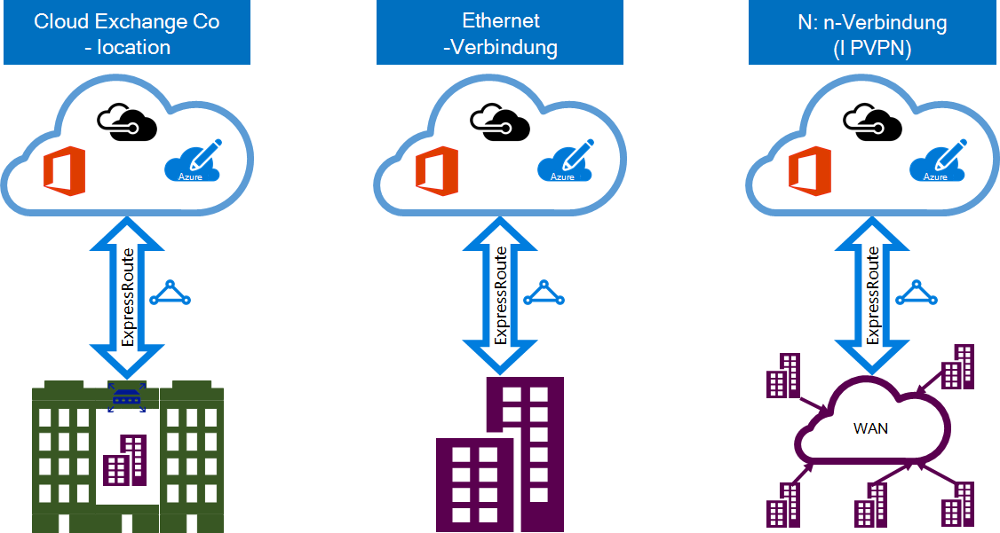

<properties 
   pageTitle="Einführung in ExpressRoute | Microsoft Azure"
   description="Diese Seite enthält einen Überblick der ExpressRoute-Dienst, einschließlich der Funktionsweise einer ExpressRoute-Verbindung."
   documentationCenter="na"
   services="expressroute"
   authors="cherylmc"
   manager="carmonm"
   editor=""/>
<tags 
   ms.service="expressroute"
   ms.devlang="na"
   ms.topic="get-started-article" 
   ms.tgt_pltfrm="na"
   ms.workload="infrastructure-services" 
   ms.date="10/10/2016"
   ms.author="cherylmc"/>

# ExpressRoute – technische Übersicht

Microsoft Azure ExpressRoute ermöglicht die lokalen Netzwerken in der Cloud von Microsoft über eine dedizierte private Verbindung von einem konnektivitätsanbieter erleichtert. Mit ExpressRoute können Sie die Verbindung mit Microsoft-Cloud-Diensten wie Microsoft Azure, Office 365 und CRM Online herstellen. Verbindung kann eine n: n-Netzwerk (IP VPN), einem Punkt Ethernet-Netzwerk oder virtuellen Cross-Verbindung von einem Konnektivität an einem gemeinsam. ExpressRoute-Verbindung gehen nicht über das öffentliche Internet. Dadurch können ExpressRoute Verbindungen mehr Zuverlässigkeit, höhere Geschwindigkeit niedriger Latenz und höhere Sicherheit als normalen Verbindungen über das Internet anbieten.

**Die wichtigsten Vorteile:**

- Ebene 3 Konnektivität zwischen dem lokalen Netzwerk und Cloud von Microsoft über einen konnektivitätsanbieter. Verbindung kann von einem any-to-any (IPVPN) Netzwerk, Ethernet-Verbindung, oder über virtuelle Cross-Verbindung durch einen Ethernet.
- Verbindung mit Microsoft Cloud Services in allen Regionen geopolitischen Region.
- Globale Verbindung mit Microsoft Services in allen Regionen mit ExpressRoute Premium.
- Dynamisches routing zwischen Ihrem Netzwerk und Microsoft über Protokolle nach Industriestandard (BGP).
- Integrierte Redundanz jedes Peers an für höhere Zuverlässigkeit.
- Verbindung Uptime [SLA](https://azure.microsoft.com/support/legal/sla/).
- QoS und Unterstützung für mehrere Serviceklassen für spezielle Programme wie Skype für Unternehmen.

[ExpressRoute FAQ](expressroute-faqs.md) für mehr Details anzeigen

## Wie kann ich Microsoft ExpressRoute mit Netzwerk verbinden?

Sie können eine Verbindung zwischen dem lokalen Netzwerk und Cloud von Microsoft auf drei verschiedene Arten erstellen:

### Cloud Exchange am gemeinsam

Sie gemeinsam in einer Einrichtung mit einer Cloud befinden, können Sie virtuelle Querverbindungen Microsoft Cloud über die Co-Location-Anbieter Ethernet-Exchange bestellen. Co-Location-Anbieter bieten Layer 2 Querverbindungen oder verwaltete Layer 3 Querverbindungen zwischen Ihrer Infrastruktur in der Co-Location und Cloud von Microsoft.

### Punkt-Ethernet-Anschlüsse 

Sie können Ihre lokalen Datencenter stellen Microsoft Cloud über Point-Ethernet-Links verbinden. Point-Ethernet Layer 2-Verbindungen bieten oder verwaltete Layer 3-Verbindungen zwischen Ihrer Website und die Microsoft-Cloud.

### Any-to-any (IPVPN) Netzwerke

Sie können Ihrem WAN mit Cloud von Microsoft integrieren. IPVPN Anbieter (in der Regel MPLS VPN) n: n-Konnektivität zwischen Zweigstellen und Rechenzentren. Microsoft-Cloud kann Ihre WAN zu genau wie andere Zweigstelle verbunden werden. WAN-Anbieter normalerweise verwaltete Layer 3-Konnektivität. ExpressRoute Funktionen sind identisch für alle vorgenannten Modelle Konnektivität. 

Konnektivität können ein oder mehrere konnektivitätsmodelle Anbieter. Sie können mit der konnektivitätsanbieter, Modell auszuwählen, das für Sie am besten arbeiten.

## ExpressRoute Funktionen

ExpressRoute unterstützt die folgenden Features und Funktionen: 

### Layer 3-Konnektivität

Microsoft verwendet dynamische routing Industriestandardprotokoll (BGP) exchange Routen zwischen dem lokalen Netzwerk Ihre Azure-Instanzen und Microsoft öffentliche Adressen.  Wir stellen mehrere BGP-Sessions in Ihr Netzwerk für die verschiedenen Profile. Weitere Informationen finden im Artikel [ExpressRoute-Verbindung und Domänen weiterleiten](expressroute-circuit-peerings.md) .

### Redundanz

ExpressRoute-Verbindung besteht aus zwei Anschlüsse zwei Microsoft Enterprise Edge-Router (MSEEs) vom konnektivitätsanbieter / Netzwerk-Edge. Microsoft erfordert zwei BGP-Verbindung vom konnektivitätsanbieter / Ihrer Seite – zu jeder MSEE. Sie können überflüssige Geräte bereitstellen / Ethernet Ihre auslöst. Konnektivitätsanbieter verwenden jedoch redundante Geräte sicherstellen, dass Ihre Verbindung an Microsoft auf redundante übergeben werden. Eine redundante Konfiguration der Layer 3-Konnektivität ist eine Voraussetzung für unsere [SLA](https://azure.microsoft.com/support/legal/sla/) gültig sein. 

### Verbindung mit Microsoft Cloud-Dienste

[AZURE.INCLUDE [expressroute-office365-include](../../includes/expressroute-office365-include.md)]

ExpressRoute-Verbindung Zugriff auf folgende Dienste:

- Microsoft Azure services
- Microsoft Office 365-Diensten
- Microsoft CRM Online-Dienste 
 
Besuchen Sie [ExpressRoute FAQ](expressroute-faqs.md) -Seite eine ausführliche Liste von Diensten über ExpressRoute unterstützt.

### Verbindung mit allen Regionen in einem geopolitischen Bereich

Verbinden mit Microsoft eines [Peers Positionen](expressroute-locations.md) , und haben Zugriff auf alle Bereiche der geopolitischen Region. 

Z. B. Verbindung Microsoft in Amsterdam über ExpressRoute haben Sie Zugriff auf alle Microsoft-Clouddienste in Nordeuropa und Westeuropa gehostet. Finden Sie im Artikel [ExpressRoute Partner und peering Speicherorte](expressroute-locations.md) Übersicht der geopolitischen Regionen zugeordneten Microsoft Cloud Regionen und entsprechenden ExpressRoute peering Positionen.

### Globale Konnektivität mit ExpressRoute premium

Sie können die Funktion ExpressRoute Premium Add-on Konnektivität geopolitische Grenzen erweitern. Z. B. wenn Microsoft in Amsterdam über ExpressRoute besteht, müssen Zugriff auf alle Microsoft Cloud gehostet in allen Regionen weltweit (nationale Wolken sind ausgeschlossen). Sie können Dienste bereitgestellt in Südamerika oder Australien denselben Zugang Regionen Nordamerika und Westeuropa zugreifen.

### Partner-Ökosystem von Rich-Konnektivität

ExpressRoute hat eine ständig wachsende Ökosystem konnektivitätsanbieter und SI-Partner. Sie können Artikel [ExpressRoute Anbieter und Speicherorte](expressroute-locations.md) Informationen verweisen.

### Verbindung zum nationalen Wolken

Microsoft arbeitet isolierten Cloud-Umgebung für spezielle geopolitischen Regionen und Kunden. Siehe Seite [ExpressRoute Anbieter und](expressroute-locations.md) eine Liste nationaler und Anbieter.

### Unterstützte Bandbreitenoptionen

Sie können ExpressRoute Stromkreise für eine Vielzahl von Bandbreiten erwerben. Die Liste der unterstützten Bandbreiten ist unten aufgeführt. Achten Sie bei Ihrem konnektivitätsanbieter die Liste der unterstützten Bandbreiten bieten sie.

- 50 Mbit/s
- 100 Mbit/s
- 200 Mbit/s
- 500 Mbit/s
- 1 Gbit/s
- 2 Gbit/s
- 5 Gbit/s
- 10 Gbit/s

### Dynamische Skalierung der Bandbreite

Sie können die ExpressRoute Circuit Bandbreite (auf optimale Leistung) ohne Verbindungen abreißen. 

### Flexible Abrechnung Modelle

Sie können eine Abrechnung Modell auswählen, die für Sie am besten. Wählen Sie zwischen der Rechnung unten. Siehe Seite [ExpressRoute FAQ](expressroute-faqs.md) für weitere Details. 

- **Daten**. ExpressRoute-Verbindung auf eine monatliche Gebühr erhoben, und alle eingehenden und ausgehenden Daten ist kostenlos. 
- **Kostenpflichtig Daten**. ExpressRoute-Verbindung wird für eine monatliche Gebühr berechnet. Alle eingehenden Datenübertragung ist kostenlos. Ausgehende Datenübertragung wird pro GB Datenübertragung belastet. Datenübertragungsraten variieren je nach Region.
- **ExpressRoute Premium Add-on**. ExpressRoute Premium ist ein Add-on über ExpressRoute-Verbindung. Das Add-on ExpressRoute Premium bietet die folgenden Funktionen: 
    - Erhöhte Route Grenzwerte für Azure öffentlichen und Azure private peering aus 4.000 10.000 Routen.
    - Globale Konnektivität für Dienste. In jeder Region (ausgenommen nationale Wolken) erstellt eine ExpressRoute-Verbindung haben Zugriff auf Ressourcen in anderen Regionen der Welt. Beispielsweise kann ein virtuelles Netzwerk erstellt in Westeuropa durch eine ExpressRoute-Verbindung im Silicon Valley bereitgestellt zugegriffen werden.
    - Anzahl der VNet Links pro ExpressRoute-Verbindung von 10 auf einen höheren Wert je nach Bandbreite der Verbindung erhöht.

## Nächste Schritte

- Informationen Sie über ExpressRoute-Verbindungen und routing-Domänen. Siehe [ExpressRoute-Schaltkreise und routing-Domänen](expressroute-circuit-peerings.md).
- Suchen Sie einen Dienstanbieter. [ExpressRoute-Partner und peering Positionen](expressroute-locations.md)anzeigen
- Stellen Sie sicher, dass alle erforderlichen Komponenten vorhanden sind. [ExpressRoute Komponenten](expressroute-prerequisites.md)anzeigen
- Finden Sie in den Vorschriften für [Routing](expressroute-routing.md), [NAT](expressroute-nat.md) und [QoS](expressroute-qos.md).
- Konfigurieren Sie die ExpressRoute-Verbindung.
    - [Erstellen Sie eine ExpressRoute-Verbindung](expressroute-howto-circuit-classic.md)
    - [Konfigurieren von routing](expressroute-howto-routing-classic.md)
    - [Verknüpfen Sie ein VNet mit ExpressRoute-Verbindung](expressroute-howto-linkvnet-classic.md)
