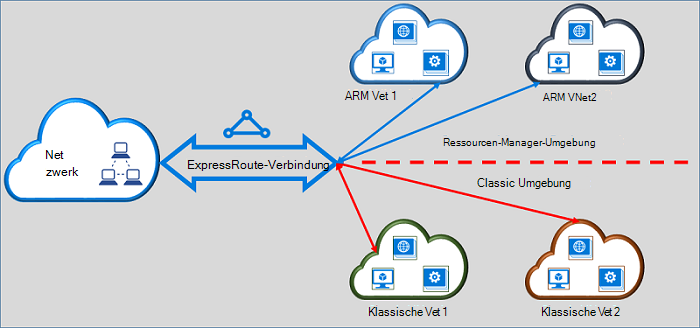

<properties
   pageTitle="Verschieben von ExpressRoute Stromkreise von Classic an Ressourcen-Manager | Microsoft Azure"
   description="Diese Seite Überblick zwischen der klassischen und Ressourcenmanager Bereitstellungsmodelle kennen müssen."
   documentationCenter="na"
   services="expressroute"
   authors="ganesr"
   manager="carmonm"
   editor=""/>
<tags
   ms.service="expressroute"
   ms.devlang="na"
   ms.topic="get-started-article"
   ms.tgt_pltfrm="na"
   ms.workload="infrastructure-services"
   ms.date="10/10/2016"
   ms.author="ganesr"/>

# ExpressRoute Stromkreise in der Standardansicht auf der Ressourcen-Manager-Bereitstellungsmodell verschieben

Dieser Artikel enthält einen Überblick über die Bedeutung einer Azure ExpressRoute-Verbindung in der Standardansicht in Azure-Ressourcen-Manager-Bereitstellungsmodell verschieben.

[AZURE.INCLUDE [vpn-gateway-sm-rm](../../includes/vpn-gateway-classic-rm-include.md)]

Eine ExpressRoute-Verbindung können Sie virtuelle Netzwerke herstellen, die in der Standardansicht und Ressourcenmanager Bereitstellungsmodelle bereitgestellt werden. ExpressRoute-Verbindung, unabhängig davon, wie sie erstellt wird, kann jetzt in beiden virtuellen Netzwerken verknüpfen.

## ExpressRoute-Schaltkreise, die im klassischen Bereitstellungsmodell erstellt werden

ExpressRoute-Schaltkreise, die im klassischen Bereitstellungsmodell erstellt werden müssen in der Ressourcen-Manager-Bereitstellungsmodell zuerst verschoben werden, zum ermöglichen von Konnektivität zu klassischen und Ressourcenmanager Bereitstellungsmodelle. Kein Verlust der Konnektivität oder Störung Verbindung bewegt wird. Alle Circuit-virtuelles Netzwerk Links im klassischen Bereitstellungsmodell (innerhalb derselben Abonnement und Cross-Abonnement) erhalten.

Nachdem das Verschieben erfolgreich abgeschlossen wurde, ExpressRoute-Verbindung sucht führt und fühlt sich genau wie eine ExpressRoute-Verbindung, die der Ressourcen-Manager-Bereitstellungsmodell erstellt wurde. Sie können nun Verbindungen, virtuelle Netzwerke in der Ressourcen-Manager-Bereitstellungsmodell erstellen.

Nach einer ExpressRoute Verbindung wurde zu Bereitstellungsmodell Ressourcenmanager Sie nur mithilfe des Ressourcen-Manager-Bereitstellungsmodells Lebenszyklus ExpressRoute-Verbindung verwalten können. Dies bedeutet, dass Sie Vorgänge wie das Hinzufügen/Aktualisieren/Löschen von Peerings Circuit-Eigenschaften (wie Bandbreite SKU und Abrechnung Typ) aktualisieren und Löschen von Stromkreise in der Ressourcen-Manager-Bereitstellungsmodell ausführen können. Finden Sie in Abschnitt auf, die im Ressourcen-Manager-Bereitstellungsmodell für Weitere Informationen zur Verwaltung auf beiden erstellt.

Sie müssen keinen Dienstanbieter Konnektivität so verschieben umfassen.

## ExpressRoute-Schaltkreise, die in den Ressourcen-Manager-Bereitstellungsmodell erstellt werden

Sie können ExpressRoute Stromkreise, die im Ressourcen-Manager-Bereitstellungsmodell aus beiden zugänglich erstellt werden. Alle ExpressRoute-Verbindung in Ihrem Abonnement ermöglicht sowohl Bereitstellungsmodelle zugegriffen werden.

- ExpressRoute-Schaltkreise, die in den Ressourcen-Manager-Bereitstellungsmodell erstellt haben Zugriff auf die klassische Bereitstellungsmodell nicht standardmäßig.
- In der Ressourcen-Manager-Bereitstellungsmodell von klassischen Bereitstellungsmodell verschoben wurden ExpressRoute-Schaltkreise werden aus beiden Bereitstellungsmodelle standardmäßig zugegriffen.
- ExpressRoute-Verbindung hat immer Zugriff auf die Ressourcen-Manager-Bereitstellungsmodell, unabhängig davon, ob es in der Ressourcen-Manager erstellt wurde oder klassische Bereitstellungsmodell. Dies bedeutet, dass Verbindungen, virtuelle Netzwerke erstellt in der Ressourcen-Manager-Bereitstellungsmodell folgen Informationen [zum virtuelle Netzwerken verknüpfen](expressroute-howto-linkvnet-arm.md)zu erstellen.
- Der Parameter **AllowClassicOperations** in ExpressRoute-Verbindung Zugriff auf die klassische Bereitstellungsmodell gesteuert.

>[AZURE.IMPORTANT] Wenden alle Kontingente, die auf der Seite [Service](../azure-subscription-service-limits.md) dokumentiert sind. Beispielsweise können eine standardmäßige Verbindung höchstens 10 virtuelle Links/Netzwerkanschlüsse klassischen und Ressourcenmanager Bereitstellungsmodelle.

## Steuern des Zugriffs auf das klassische Bereitstellungsmodell

Sie können einen Stromkreis ExpressRoute Verbindung mit virtuellen Netzwerken in beiden **AllowClassicOperations** -Parameter des ExpressRoute-Verbindung festlegen.

**AllowClassicOperations** auf TRUE festlegen, können Sie virtuelle Netzwerke von beiden ExpressRoute-Verbindung verknüpfen. Sie können virtuelle Netzwerke im klassischen Bereitstellungsmodell folgende Anleitung zum [Verknüpfen von virtueller Netzwerken im klassischen Bereitstellungsmodell](expressroute-howto-linkvnet-classic.md)verknüpfen. Sie können virtuelle Netzwerke in der Ressourcen-Manager-Bereitstellungsmodell durch folgende Anleitung [virtueller Netzwerke in der Ressourcen-Manager-Bereitstellungsmodell link](expressroute-howto-linkvnet-arm.md)verknüpfen.

Wenn **AllowClassicOperations** auf FALSE blockiert den Zugriff auf die Verbindung von klassischen Bereitstellungsmodell. Jedoch bleiben alle virtuellen Netzwerk Links im klassischen Bereitstellungsmodell. ExpressRoute-Verbindung ist in diesem Fall nicht im klassischen Bereitstellungsmodell.

## Unterstützte Vorgänge im klassischen Bereitstellungsmodell

Klassischen folgenden werden auf ExpressRoute-Verbindung unterstützt, wenn **AllowClassicOperations** auf TRUE festgelegt ist:

 - ExpressRoute Schaltung Informationen
 - Virtuelles Netzwerk erstellen, aktualisieren und Abrufen/löschen Links zu klassischen virtuelle Netzwerke
 - Virtuelles Netzwerk erstellen, aktualisieren und Abrufen/löschen Link Berechtigungen für Cross-Abonnement-Konnektivität

Klassische folgende Vorgänge nicht möglich, wenn **AllowClassicOperations** auf TRUE festgelegt ist:

 - Erstellen, aktualisieren und Abrufen/löschen Border Gateway Protocol (BGP) Peerings für Azure private, Azure öffentliche und Microsoft peerings
 - ExpressRoute-Schaltkreise löschen

## Kommunikation zwischen der klassischen und Ressourcenmanager Bereitstellungsmodelle

ExpressRoute-Verbindung fungiert als Brücke zwischen der klassischen und Ressourcenmanager Bereitstellungsmodelle. Datenverkehr zwischen virtuellen Computern in virtuelle Netzwerke im klassischen Bereitstellungsmodell und virtueller Netzwerke in der Ressourcen-Manager Bereitstellung Modell fließt ExpressRoute beide virtuelle Netzwerke ExpressRoute Stromkreis angeschlossen.

Aggregierte Durchsatz wird durch die Durchsatzkapazität des virtuellen Netzwerk-Gateway begrenzt. In solchen Fällen geben Datenverkehr nicht Konnektivität Providern oder Ihre Netzwerke. Datenfluss zwischen virtuellen Netzwerken ist vollständig in Microsoft Network enthalten.

## Azure Public und peering Microsoft-Ressourcen

Sie können weiterhin Zugriff auf Ressourcen, die normalerweise über Azure öffentliche peering und Microsoft peering ohne jegliche Unterbrechung.  

## Was wird unterstützt

Dieser Abschnitt beschreibt, was ExpressRoute Stromkreise unterstützt wird:

 - Eine ExpressRoute-Verbindung können Sie virtuelle Netzwerke zugreifen, die in der Standardansicht und Ressourcenmanager Bereitstellungsmodelle bereitgestellt werden.
 - Sie können eine ExpressRoute-Verbindung in der Standardansicht zum Ressourcen-Manager-Bereitstellungsmodell verschieben. Nach dem verschieben, ExpressRoute-Verbindung sieht fühlt und verhält sich wie alle anderen ExpressRoute-Verbindung, die in den Ressourcen-Manager-Bereitstellungsmodell erstellt.
 - Verschieben Sie die ExpressRoute-Verbindung. Verbindung Verbindungen, virtuelle Netzwerke und VPN-Gateways können über diesen Vorgang verschoben werden.
 - Nach einer ExpressRoute Verbindung wurde zu Bereitstellungsmodell Ressourcenmanager Sie nur mithilfe des Ressourcen-Manager-Bereitstellungsmodells Lebenszyklus ExpressRoute-Verbindung verwalten können. Dies bedeutet, dass Sie Vorgänge wie das Hinzufügen/Aktualisieren/Löschen von Peerings Circuit-Eigenschaften (wie Bandbreite SKU und Abrechnung Typ) aktualisieren und Löschen von Stromkreise in der Ressourcen-Manager-Bereitstellungsmodell ausführen können.
 - ExpressRoute-Verbindung fungiert als Brücke zwischen der klassischen und Ressourcenmanager Bereitstellungsmodelle. Datenverkehr zwischen virtuellen Computern in virtuelle Netzwerke im klassischen Bereitstellungsmodell und virtueller Netzwerke in der Ressourcen-Manager Bereitstellung Modell fließt ExpressRoute beide virtuelle Netzwerke ExpressRoute Stromkreis angeschlossen.
 - Cross-Abonnement-Konnektivität wird in der Standardansicht und Ressourcenmanager Bereitstellungsmodelle unterstützt.

## Was wird nicht unterstützt

Dieser Abschnitt beschreibt, was für ExpressRoute Stromkreise nicht unterstützt wird:

 - Verschieben Circuit Links, Gateways und virtuelle Netzwerke in der Standardansicht auf der Ressourcen-Manager-Bereitstellungsmodell.
 - Verwalten des Lebenszyklus von einem ExpressRoute-Verbindung aus dem klassischen Bereitstellungsmodell.
 - Role-Based Access Control (RBAC) Unterstützung für klassische Bereitstellungsmodell RBAC-Steuerelemente einer nicht in der klassischen Bereitstellungsmodell möglich. Jeder Administrator/Coadministrator des Abonnements können verknüpfen oder virtuelle Netzwerke an der Verknüpfung.

## Konfiguration

Anweisungen Sie in [eine ExpressRoute-Verbindung in der Standardansicht auf der Ressourcen-Manager-Bereitstellungsmodell verschieben](expressroute-howto-move-arm.md)beschrieben werden.

## Nächste Schritte

- Workflow-Informationen finden Sie unter [ExpressRoute-Verbindung bereitstellen, Workflows und Status der Verbindung](expressroute-workflows.md).
- So konfigurieren Sie die ExpressRoute-Verbindung

    - [Erstellen Sie eine ExpressRoute-Verbindung](expressroute-howto-circuit-arm.md)
    - [Konfigurieren von routing](expressroute-howto-routing-arm.md)
    - [Verknüpfen Sie ein virtuelles Netzwerk mit ExpressRoute-Verbindung](expressroute-howto-linkvnet-arm.md)
