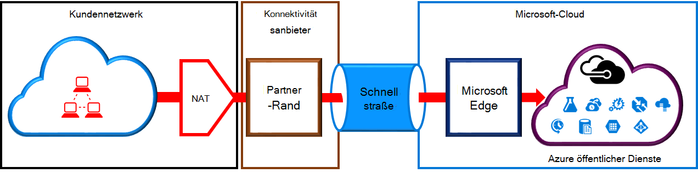
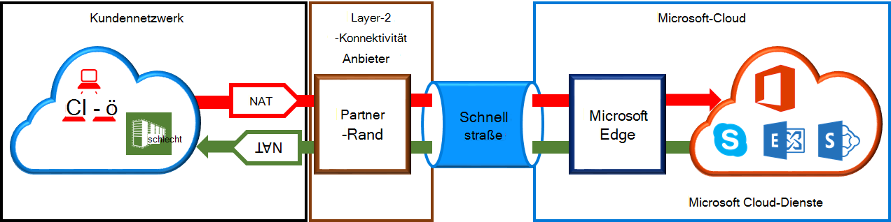

<properties
   pageTitle="NAT an ExpressRoute Stromkreise | Microsoft Azure"
   description="Diese Seite enthält detaillierte Vorschriften für das Konfigurieren und Verwalten von NAT für ExpressRoute-Schaltkreise."
   documentationCenter="na"
   services="expressroute"
   authors="cherylmc"
   manager="carmonm"
   editor=""/>
<tags
   ms.service="expressroute"
   ms.devlang="na"
   ms.topic="get-started-article"
   ms.tgt_pltfrm="na"
   ms.workload="infrastructure-services"
   ms.date="10/10/2016"
   ms.author="cherylmc"/>

# ExpressRoute NAT Vorschriften

Verbindung mit Microsoft-Cloud-Diensten mit ExpressRoute müssen Sie einrichten und Verwalten von NATs. Einige Konnektivität Anbieter einrichten und Verwalten von NAT als verwalteter Dienst. Überprüfen Sie mit der Konnektivität Dienstanbieter, ob einen Dienst bieten. Wenn dies nicht der Fall ist, zu den unten beschriebenen Vorschriften einzuhalten. 

Überprüfen Sie die Seite [ExpressRoute Schaltkreise und routing-Domänen](expressroute-circuit-peerings.md) eine Übersicht der verschiedenen routing-Domänen. Um die öffentliche IP-Adresse öffentliche Azure und Microsoft peering erfüllen, wird empfohlen, zwischen Ihrem Netzwerk und Microsoft NAT einrichten. Dieser Abschnitt enthält eine ausführliche Beschreibung der NAT-Infrastruktur einrichten müssen.

## NAT an Azure öffentliche peering

Azure öffentliche peering Pfad können Sie alle über die öffentlichen IP-Adressen in Azure gehostete Dienste herstellen. Dazu gehören [ExpessRoute häufig gestellte Fragen zu](expressroute-faqs.md) Dienstleistungen und von ISVs auf Microsoft Azure gehosteten Dienste. Verbindung mit Microsoft Azure Services für Öffentliche peering wird immer in das Microsoft-Netzwerk aus Ihrem Netzwerk initiiert. Microsoft Azure auf Öffentliche peering Datenverkehr muss SNATed gültige öffentliche IPv4-Adressen bevor sie das Microsoft-Netzwerk eingeben. Abbildung bietet einen allgemeinen Überblick wie NAT eingerichtet werden konnte den obigen Vorschrift erfüllen.

 

### NAT IP-Pool und Route anzeigen

Sie müssen sicherstellen, dass Datenverkehr Azure öffentlichen peeringpfad mit gültigen öffentlichen IPv4-Adresse eingeben. Microsoft muss an IPv4-NAT-Adresspool für einen regionalen routing Internet Registry (RIR) oder ein routing Internet Registry (IRR) überprüfen können. Eine Prüfung auf die AS-Nummer mit dies und IP-Adressen für das NAT-Gerät erfolgt Siehe Seite [ExpressRoute Routinganforderungen](expressroute-routing.md) Informationen zum routing Register.
 
Es gibt keine Einschränkung für die Länge des durch diese peering angekündigte NAT IP-Präfix. Überwachen den NAT-Pool, und sicherzustellen, dass keine NAT-Sitzungen acht gelassen werden.

>[AZURE.IMPORTANT] Microsoft angekündigte NAT IP-Adresspool muss mit dem Internet nicht bekannt gegeben. Dies unterbricht die Verbindung mit anderen Microsoft-Diensten.

## NAT an Microsoft peering

Microsoft peering Pfad können Sie die Microsoft-Cloud-Diensten herstellen, die nicht über den Azure öffentliche peering Pfad unterstützt werden. Die Liste der Services umfasst Office 365-Diensten wie Exchange Online, SharePoint Online, Skype für Unternehmen und CRM Online. Microsoft erwartet bidirektionale Konnektivität auf Microsoft peering unterstützen. Datenverkehr auf Microsoft-Clouddienste muss SNATed gültige öffentliche IPv4-Adressen bevor sie das Microsoft-Netzwerk eingeben. Datenverkehr Ihr Netzwerk von Microsoft Cloud-Dienste muß SNATed, bevor sie in Ihr Netzwerk eindringen. Die folgende Abbildung bietet einen allgemeinen Überblick wie NAT Setup für Microsoft peering sein sollte.
 
 

#### Datenverkehr aus dem Netzwerk bestimmt Microsoft

- Sie müssen sicherstellen, dass Datenverkehr Microsoft peering Pfad mit einer gültigen öffentlichen IPv4-Adresse eingeben. Microsoft muss den Besitzer des IPv4-NAT-Adresspool der regionalen routing Internet Registry (RIR) oder eine Internet-routing Registrierung (IRR) überprüfen können. Eine Prüfung auf die AS-Nummer mit dies und IP-Adressen für das NAT-Gerät erfolgt Siehe Seite [ExpressRoute Routinganforderungen](expressroute-routing.md) Informationen zum routing Register.

- IP-Adressen für Azure öffentliche peering Setup und andere ExpressRoute Stromkreise müssen Microsoft über BGP-Sitzung angekündigt. Es besteht keine Einschränkung für die Länge des durch diese peering angekündigt NAT IP-Präfix.

    >[AZURE.IMPORTANT] Microsoft angekündigte NAT IP-Adresspool muss mit dem Internet nicht bekannt gegeben. Dies unterbricht die Verbindung mit anderen Microsoft-Diensten.

#### Datenverkehr von Microsoft bestimmt, Netzwerk

- Bestimmte Szenarios erfordern Microsoft zum Initiieren der Verbindung mit Endpunkten in Ihrem Netzwerk gehostet. Z. B. das Szenario wäre Verbindung mit ADFS-Servern im Netzwerk von Office 365. In solchen Fällen müssen Sie entsprechende Präfixe aus dem Netzwerk in Microsoft peering auslaufen. 

- Sie müssen SNAT Datenverkehr in Ihrem Netzwerk IP-Adressen von Microsoft. 

## Nächste Schritte

- Finden Sie in den Vorschriften für [Routing](expressroute-routing.md) und [QoS](expressroute-qos.md).
- Workflow-Informationen finden Sie unter [ExpressRoute-Verbindung bereitstellen, Workflows und Status der Verbindung](expressroute-workflows.md).
- Konfigurieren Sie die ExpressRoute-Verbindung.

    - [Erstellen Sie eine ExpressRoute-Verbindung](expressroute-howto-circuit-classic.md)
    - [Konfigurieren von routing](expressroute-howto-routing-classic.md)
    - [Verknüpfen Sie ein VNet mit ExpressRoute-Verbindung](expressroute-howto-linkvnet-classic.md)

