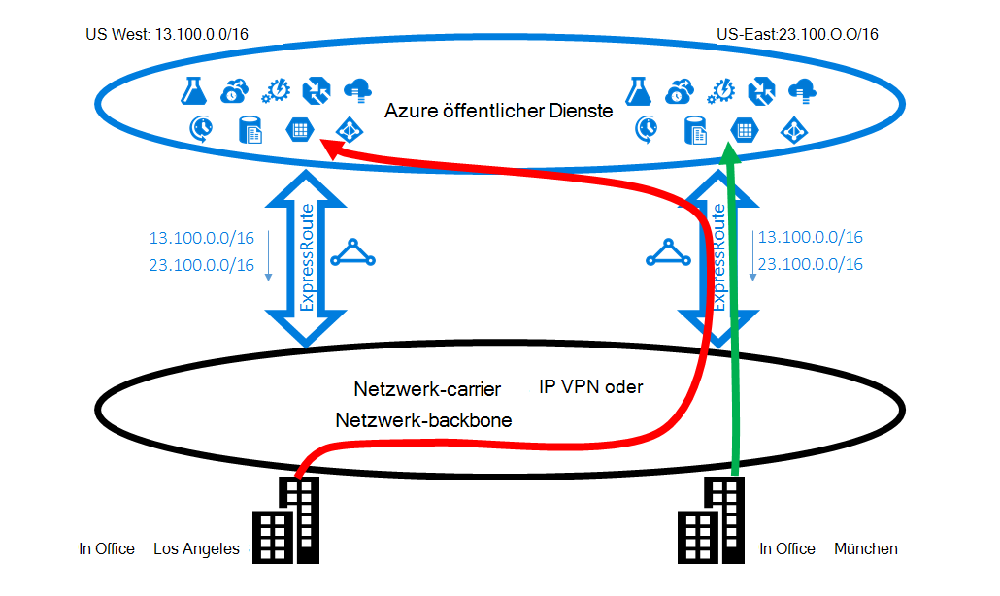
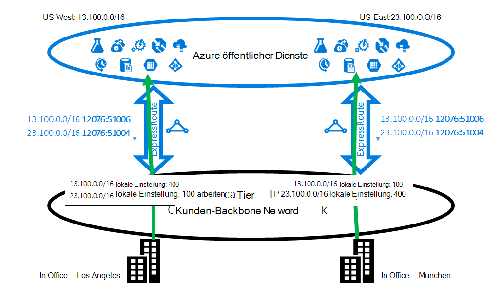
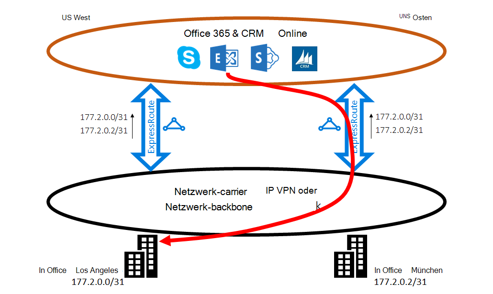
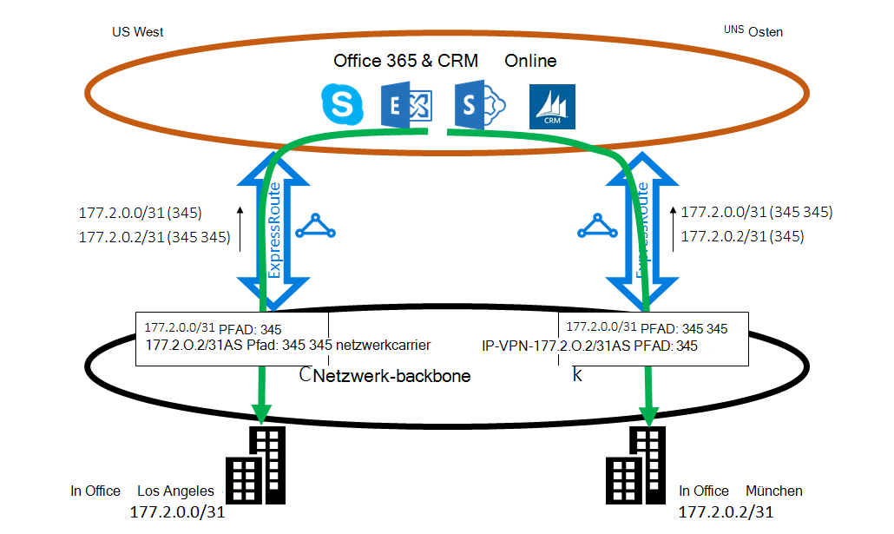

<properties
   pageTitle="Optimierung ExpressRoute routing | Microsoft Azure"
   description="Diese Seite enthält Details zum routing, wenn ein Kunde mehrere ExpressRoute-Schaltkreise, die zwischen Microsoft und Kundennetzwerk corp optimieren."
   documentationCenter="na"
   services="expressroute"
   authors="charwen"
   manager="carmonm"
   editor=""/>
<tags
   ms.service="expressroute"
   ms.devlang="na"
   ms.topic="get-started-article"
   ms.tgt_pltfrm="na"
   ms.workload="infrastructure-services"
   ms.date="10/10/2016"
   ms.author="charwen"/>

# Optimierung ExpressRoute Routing
Bei mehreren ExpressRoute-Schaltkreise, haben Sie mehrere Microsoft herstellen. Daher suboptimale routing Vorkommen - also der Datenverkehr mehr Pfad zu Microsoft und Microsoft auf Ihr Netzwerk dauert. Je länger der Netzwerkpfad, je höher die Latenz. Latenz hat direkten Einfluss auf Leistung und Komfort. Dieser Artikel veranschaulicht dieses Problem und erklären, wie routing verwenden das routing Technologie optimieren.

## Suboptimale routing Fall 1
Werfen Sie einen Blick auf das Routingproblem Beispiel. Genommen Sie an, Sie haben zwei Büros in den USA in Los Angeles und einen in München. Ihre Büros sind auf Wide Area Network (WAN) verbunden Backbonenetzwerk oder des Dienstanbieters IP VPN erfolgen kann. Sie haben zwei ExpressRoute-Schaltkreise, in US West und uns Osten, die auch im WAN verbunden sind. Natürlich haben Sie zwei Pfade zum Microsoft-Netzwerk herstellen. Nun stellen Sie sich vor Azure-Bereitstellung (z. B. Azure App Service) in US West und OST uns. Ihr soll Benutzer in Los Angeles Azure US West und Ihre Benutzer in New York Azure uns Osten fehlgeschlagen, da die Dienstadministratoren kündigt die Benutzer in jeder Niederlassung benachbarten Azure Services für optimale Erfahrungen zugreifen. Leider funktioniert der Plan für die Ostküste Benutzer jedoch nicht für Benutzer Westküste. Die Ursache des Problems ist folgende. Auf jeder ExpressRoute kündigen wir Ihnen das Präfix in Azure uns Ost (23.100.0.0/16) und das Präfix in Azure US West (13.100.0.0/16). Wenn Sie nicht wissen, welches Präfix aus der Region ist, können Sie nicht anders behandelt werden. WAN-Netzwerk wahrscheinlich beide Präfixe näher uns Osten als US West und dadurch beide Office-Benutzer auf ExpressRoute-Verbindung im Osten uns weiterleiten. Schließlich haben Sie viele Modellentwurf in das Büro in Los Angeles.

### Lösung: BGP Communities verwenden
Optimierung für beide Benutzer Office routing müssen Sie wissen, welches Präfix Azure US West und von Azure uns Osten. Codieren wir diese Informationen mithilfe von [BGP der Community](expressroute-routing.md). Wir haben jede Azure Region, z. B. "12076:51004" für uns Osten, "12076:51006" für uns einen eindeutigen BGP Gemeinschaft Wert zugewiesen. Jetzt Sie wissen, welches Präfix von Azure Region ist können Sie konfigurieren, welche ExpressRoute-Verbindung der Vorzug gegeben werden soll. Einsatz der BGP Routinginformationen austauschen können BGPs lokale Präferenz Sie routing beeinflussen. In unserem Beispiel können Sie einen höheren Wert lokale Präferenz, 13.100.0.0/16 im Westen der USA als bei uns Ost und auch lokale Einstellung größer 23.100.0.0/16 in uns Osten als US West zuweisen. Diese Konfiguration stellt sicher, daß verfügbaren beide Pfade an Microsoft Benutzer in Los Angeles ExpressRoute-Verbindung im Westen der USA Verbindung zu Azure US West, die Benutzer in New York die ExpressRoute im Osten uns Azure uns Osten ergreifen. Routing auf beiden Seiten optimiert. 

## Suboptimale routing Fall 2
Hier ist ein weiteres Beispiel wo Verbindungen von Microsoft einen längeren Weg auf Ihr Netzwerk erreichen. In diesem Fall verwenden Sie lokalen Exchange-Servern und Exchange Online in einer [hybridumgebung](https://technet.microsoft.com/library/jj200581%28v=exchg.150%29.aspx). Ihre Büros sind WAN verbunden. Sie ankündigen die Präfixe für lokale Server sowohl Ihren Büros an Microsoft über zwei ExpressRoute-Schaltkreise. Exchange Online-wird Verbindung zum lokalen Server in Fällen wie Postfachmigration gestartet. Leider ist die Verbindung zu Ihrem Büro in Los Angeles an die ExpressRoute im Osten uns vor dem Durchlaufen der gesamten Kontinent zurück an die Westküste weitergeleitet. Die Ursache des Problems ist ähnlich der ersten. Ohne kann Microsoft Network nicht sagen, welche Kunden Präfix nahe Osten uns und US West welche liegt. Dies geschieht zu Ihrem Büro in Los Angeles falschen Pfad auswählen.

### Lösung: Verwenden Sie als Pfad vorangestellt wird.
Es gibt zwei Lösungen. Die erste ist einfach Ihre lokalen Präfix für Ihr Büro in Los Angeles, 177.2.0.0/31 auf der ExpressRoute US West werben und Ihre lokale Präfix für Ihr Büro in New York, 177.2.0.2/31 auf der ExpressRoute uns Osten. Daher wird nur ein Pfad für Microsoft Ihre Büros herstellen. Besteht keine Mehrdeutigkeit und routing optimiert. Mit diesem Entwurf müssen Sie über Ihre Failoverstrategie. Wenn der Pfad über ExpressRoute an Microsoft unterbrochen ist, müssen Sie sicherstellen, dass Exchange Online noch Ihre lokalen Server herstellen können. 

Die zweite Lösung ist, weiterhin beide Präfixe auf beide ExpressRoute ankündigen, geben Sie, zusätzlich liegt ein Hinweis, welches Präfix von Ihren Büros. Da wir BGP AS Pfad vorangestellt wird unterstützen, können Sie den Pfad als Präfix des routing beeinflussen. In diesem Beispiel können Sie den Pfad als 172.2.0.0/31 im Osten von uns, dass wir die ExpressRoute-Verbindung in US West für Datenverkehr für dieses Präfix (wie unser ist der Pfad dieses Präfix im Westen kürzer denken) bevorzugen verlängern. Ebenso können Sie als Pfad für 172.2.0.2/31 in US West verlängern, damit wir in uns OST ExpressRoute-Verbindung bevorzugen werden. Routing für beide Büros optimiert. Mit diesem Entwurf wird eine ExpressRoute-Verbindung unterbrochen, Exchange Online noch erreichen Sie über einen anderen ExpressRoute-Verbindung und die WAN. 

>[AZURE.IMPORTANT] Wir entfernen privates als Zahlen als Pfad für die Präfixe auf Microsoft Peering empfangen. Sie müssen anfügen als Zahlen als Pfad zum routing für Microsoft Peering beeinflussen.

>[AZURE.IMPORTANT] Sind die Beispiele für Microsoft und öffentlichen Peerings unterstützen wir dieselben Funktionen für Private peering. Funktioniert als Pfad voranstellen innerhalb einer einzigen ExpressRoute-Verbindung beeinflussen die Auswahl der primären und sekundären Pfade.
