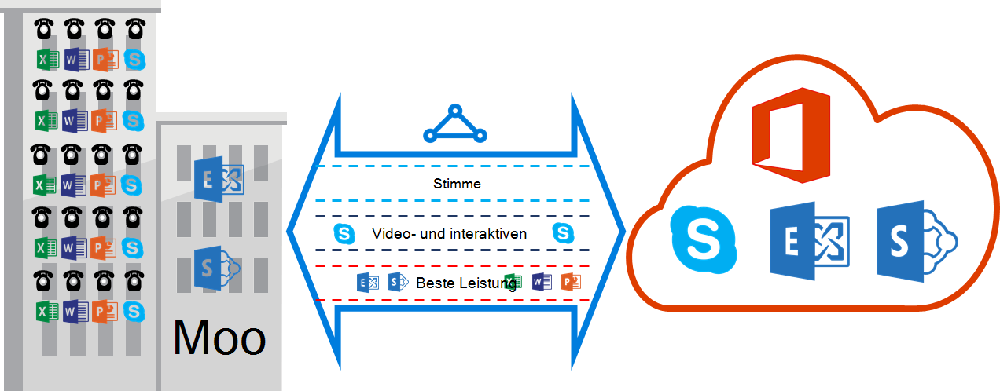

<properties
   pageTitle="QoS-Anforderungen für ExpressRoute | Microsoft Azure"
   description="Diese Seite enthält detaillierte Vorschriften für das Konfigurieren und Verwalten von QoS für ExpressRoute-Schaltkreise."
   documentationCenter="na"
   services="expressroute"
   authors="cherylmc"
   manager="carmonm"
   editor=""/>
<tags
   ms.service="expressroute"
   ms.devlang="na"
   ms.topic="get-started-article"
   ms.tgt_pltfrm="na"
   ms.workload="infrastructure-services"
   ms.date="10/10/2016"
   ms.author="cherylmc"/>

# ExpressRoute QoS-Vorschriften

Skype für Unternehmen hat verschiedene Arbeitslasten, die differenzierte QoS-Behandlung. Wenn Sie Voice Services über ExpressRoute nutzen möchten, sollten Sie beschriebenen Vorschriften entsprechen.

>[AZURE.NOTE] QoS gelten für Microsoft nur peering. DSCP-Werte in der Azure öffentliche peering und Azure private peering eingehenden Netzwerkverkehr auf 0 zurückgesetzt. 

Die folgende Tabelle enthält eine Liste der DSCP-Markierung von Skype für Unternehmen verwendet. Weitere Informationen finden Sie in [Verwaltung QoS für Skype für Unternehmen](https://technet.microsoft.com/library/gg405409.aspx) .

| **Verkehrsklasse** | **Behandlung (DSCP-Markierung)** | **Skype für Business-Arbeitslasten** |
|---|---|---|
| **Stimme** | EF (46) | Skype / Lync Voice |
| **Interaktive** | AF41 (34) | Video |
|   | AF21 (18) | Gemeinsame Nutzung der Anwendung | 
| **Standard** | AF11 STELLT (10) | Datenübertragung|
|   | CS0 (0) | Irgendetwas anderes| 

- Klassifizieren die Arbeitslasten, und markiert die richtigen DSCP-Werte. Befolgen Sie die Anleitung [hier](https://technet.microsoft.com/library/gg405409.aspx) wie DSCP-Markierung im Netzwerk.

- Konfigurieren und unterstützen mehrere QoS-Warteschlangen im Netzwerk. Voice muss eine eigenständige Klasse und der EF Behandlung gemäß RFC 3246. 

- Sie können Warteschlangenmechanismus, Überlastung Erkennung Richtlinie und bandbreitenzuordnung pro Verkehrsklasse. Aber der DSCP-Markierung für Skype für Business-Arbeitslasten beibehalten werden muss. Bei Verwendung der DSCP-Markierung nicht aufgeführten z.B. AF31 (26), müssen Sie vor dem Senden des Pakets an Microsoft diese DSCP-Wert 0 umschreiben. Microsoft sendet nur Pakete mit den DSCP-Wert in der obigen Tabelle gezeigten gekennzeichnet. 

## Nächste Schritte

- Die Vorschriften für die [Routing-](expressroute-routing.md) und [NAT](expressroute-nat.md)finden Sie unter.
- Finden Sie unter folgenden Links, um die ExpressRoute-Verbindung konfigurieren.

    - [Erstellen Sie eine ExpressRoute-Verbindung](expressroute-howto-circuit-classic.md)
    - [Konfigurieren von routing](expressroute-howto-routing-classic.md)
    - [Verknüpfen Sie ein VNet mit ExpressRoute-Verbindung](expressroute-howto-linkvnet-classic.md)
