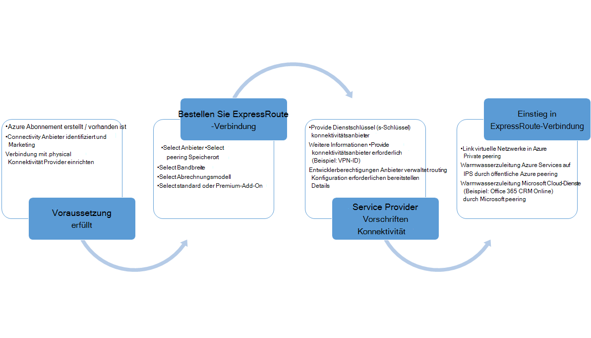
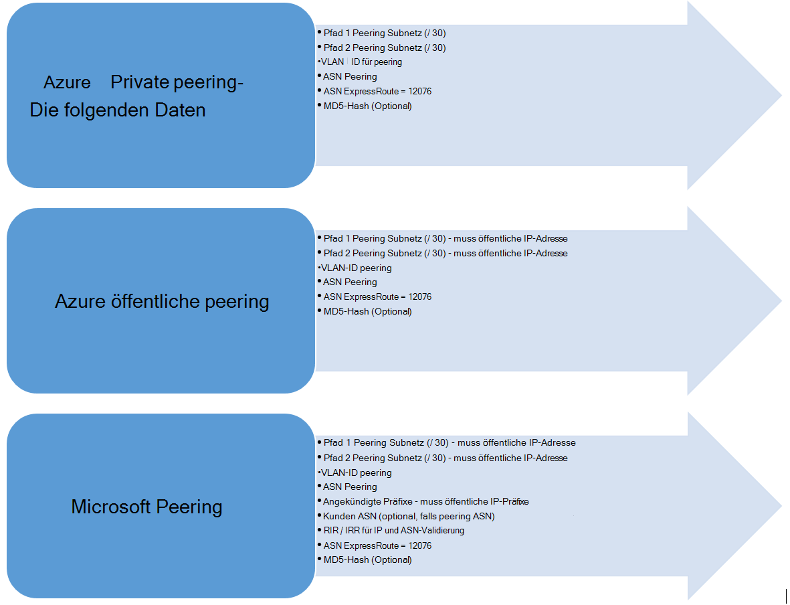

<properties
   pageTitle="Workflows für ExpressRoute-Verbindung konfigurieren | Microsoft Azure"
   description="Diese Seite führt Sie durch die Workflows zum Konfigurieren von ExpressRoute-Verbindung und peerings"
   documentationCenter="na"
   services="expressroute"
   authors="cherylmc"
   manager="carmonm"
   editor="" />
<tags
   ms.service="expressroute"
   ms.devlang="na"
   ms.topic="article" 
   ms.tgt_pltfrm="na"
   ms.workload="infrastructure-services"
   ms.date="10/10/2016"
   ms.author="cherylmc"/>

# ExpressRoute Workflows für Circuit Bereitstellung und Circuit-Zustände

Diese Seite führt Sie durch Service, Bereitstellung und Konfiguration Workflows auf einer hohen Ebene routing.

Folgenden Abbildung und den entsprechenden Schritten anzeigen die Aufgaben, die Sie ausführen müssen, um eine ExpressRoute-Verbindung bereitgestellt-Ende 

1. Mithilfe von PowerShell ExpressRoute-Verbindung konfigurieren. Führen Sie die Schritte [Erstellen ExpressRoute Stromkreise](expressroute-howto-circuit-classic.md) Artikel Weitere Informationen.

2. Bestellen Sie Konnektivität vom Dienstanbieter. Dieser Vorgang variiert. Weitere Informationen zum Bestellen Konnektivität erhalten Sie Dienstanbieter Konnektivität.

3. Stellen Sie sicher, dass die Verbindung erfolgreich bereitgestellt wurde, Bereitstellung Zustand über PowerShell ExpressRoute-Verbindung überprüfen. 

4. Konfigurieren Sie routing-Domänen. Dienstanbieter Konnektivität Layer 3 für Sie verwaltet, werden sie routing für die Verbindung konfigurieren. Wenn Dienstanbieter Konnektivität nur Layer 2-Dienste bietet müssen Sie Richtlinien beschrieben in den [Arbeitsplan Vorschriften](expressroute-routing.md) und [Routingkonfiguration](expressroute-howto-routing-classic.md) routing konfigurieren.

    -  Azure private peering - Sie müssen aktivieren peering Verbinden mit VMs und cloud-Services in virtuelle Netzwerke bereitgestellt.
    -  Azure öffentliche peering - Sie müssen aktivieren Azure öffentliche peering Azure Dienste auf öffentliche IP-Adressen herstellen möchten. Dies ist notwendig, Azure zugreifen, wenn Sie standardmäßige Azure private Peering routing aktivieren.
    -  Aktivieren Sie Microsoft peering - Sie müssen Office 365 und CRM online-Dienste aktivieren. 
    
    >[AZURE.IMPORTANT] Sie müssen sicherstellen, dass Sie eines separaten verwenden / Edge Verbindung zu Microsoft als Sie für das Internet. Mit der gleichen Kante für ExpressRoute und Internet verursachen asymmetrischem routing und Ausfälle Konnektivität für das Netzwerk führen.

    

5. Verknüpfen von virtuellen Netzwerken an ExpressRoute - verknüpfen Sie virtuelle Netzwerke mit ExpressRoute-Verbindung. Führen Sie die Anleitung [VNets verknüpfen](expressroute-howto-linkvnet-arm.md) an Ihre. Diese VNets kann in der gleichen Azure-Abonnement als ExpressRoute-Verbindung oder in ein anderes Abonnement kann.

## Bereitstellung von Mitgliedstaaten ExpressRoute-Verbindung

ExpressRoute-Verbindung verfügt über zwei Zustände:

- Bereitstellungsstatus für Service provider
- Status

Microsoft Bereitstellung Zustand darstellt. Diese Eigenschaft wird beim Erstellen einer Expressroute-Verbindung aktiviert festgelegt

Konnektivität Anbieter Bereitstellung Zustand stellt den Status der konnektivitätsanbieter auf dar. Es kann *NotProvisioned*, *Bereitstellung*oder *bereitgestellt*sein. ExpressRoute-Verbindung muss bereitgestellt zu verwenden sein.

### Zustände einer ExpressRoute-Verbindung

Dieser Abschnitt listet die möglichen Zustände für eine ExpressRoute-Verbindung.

#### Zum Zeitpunkt der Erstellung

ExpressRoute-Verbindung die folgenden Status wird angezeigt, wie das PowerShell-Cmdlet erstellen ExpressRoute-Verbindung ausführen.

    ServiceProviderProvisioningState : NotProvisioned
    Status                           : Enabled

#### Wenn derzeit konnektivitätsanbieter der Circuit-Bereitstellung

ExpressRoute-Verbindung folgende Zustand wird als konnektivitätsanbieter den Schlüssel übergeben haben sie den Bereitstellungsprozess angezeigt werden.

    ServiceProviderProvisioningState : Provisioning
    Status                           : Enabled

#### Wenn konnektivitätsanbieter Bereitstellung abgeschlossen

ExpressRoute-Verbindung folgende Zustand wird als konnektivitätsanbieter Bereitstellung abgeschlossen angezeigt werden.

    ServiceProviderProvisioningState : Provisioned
    Status                           : Enabled

Bereitgestellt und aktiviert ist der Zustand der Verbindung in verwenden zu kann. Wenn Sie einen Layer 2-Anbieter verwenden, können Sie konfigurieren, routing für die Verbindung erst in diesem Zustand befindet.

#### Wenn konnektivitätsanbieter der Verbindung aufheben

Ggf. den Dienstanbieter Entziehen von ExpressRoute-Verbindung sehen Sie Circuit auf die folgenden festlegen, nachdem der Dienstanbieter deprovisioning abgeschlossen.

    ServiceProviderProvisioningState : NotProvisioned
    Status                           : Enabled

Sie können ihn wieder aktivieren, wenn erforderlich, oder führen Sie PowerShell-Cmdlets zum Löschen der Verbindung.  

>[AZURE.IMPORTANT] Beim Ausführen der PowerShell-Cmdlets zum Löschen bei Bereitstellung der ServiceProviderProvisioningState oder die fehlschlagen bereitgestellt. Arbeiten Sie mit Ihrem konnektivitätsanbieter ExpressRoute-Verbindung zunächst entziehen, und löschen Sie die Verbindung. Microsoft wird weiterhin die Leitung Abrechnung bis zur Ausführung von PowerShell-Cmdlets zum Löschen der Verbindung.

## Routing-Konfiguration Sitzungszustand

BGP Bereitstellung Zustand informiert Sie, wenn Microsoft Edge BGP-Sitzung aktiviert wurde. Der Status muss für die peering verwenden aktiviert.

Es ist wichtig, BGP Sitzungszustand speziell für Microsoft peering überprüfen. Neben der Bereitstellung Zustand BGP ist einem anderen Zustand mit dem Namen *Öffentliche Präfixe Zustand angekündigt*. Status angekündigten öffentlichen Präfixe müssen *konfiguriert* Zustand sowohl für die BGP-Sitzung werden die weiterleiten-Ende funktioniert. 

Wenn öffentliche angekündigte Präfix Zustand in einen Zustand *Validierung erforderlich* festgelegt ist, ist BGP-Sitzung nicht aktiviert, wie die angekündigte Präfixe als Zahl in einer Routinggruppe Register nicht übereinstimmen. 

>[AZURE.IMPORTANT] Wenn angekündigten öffentlichen Präfixe in *manuellen Überprüfung* Zustand ist, öffnen Sie ein Support-Ticket mit [Microsoft support](https://portal.azure.com/?#blade/Microsoft_Azure_Support/HelpAndSupportBlade) und Beweise, die eigene IP-Adressen zusammen mit den zugeordneten autonomes System angekündigt.

## Nächste Schritte

- Konfigurieren Sie die ExpressRoute-Verbindung.

    - [Erstellen Sie eine ExpressRoute-Verbindung](expressroute-howto-circuit-arm.md)
    - [Konfigurieren von routing](expressroute-howto-routing-arm.md)
    - [Verknüpfen Sie ein VNet mit ExpressRoute-Verbindung](expressroute-howto-linkvnet-arm.md)
