<properties
    pageTitle="Einführung in Microsoft Azure | Microsoft Azure"
    description="Neue Microsoft Azure? Eine grundlegende Übersicht Dienste bietet Beispiele wie sie hilfreich sind."
    services=" "
    documentationCenter=".net"
    authors="rboucher"
    manager="carolz"
    editor=""/>

<tags
    ms.service="multiple"
    ms.workload="multiple"
    ms.tgt_pltfrm="na"
    ms.devlang="na"
    ms.topic="article"
    ms.date="06/30/2015"  
    ms.author="robb"/>

# Einführung in Microsoft Azure

Microsoft Azure ist die Microsoft-Anwendungsplattform für die öffentliche Cloud.  Das Ziel dieses Artikels ist darin Sie ein grundlegendes Verständnis von Azure, selbst wenn Sie nichts über die Cloud wissen computing.

**Wie Sie diesen Artikel lesen**

Azure ist immer so leicht überlastet.  Starten Sie die grundlegenden Dienste, die zuerst in diesem Artikel, und fahren Sie zusätzliche Dienste. Das bedeutet nicht, können keine zusätzliche Dienste selbst, aber die grundlegenden Dienste bilden den Kern einer Anwendung in Azure.

**Ihr Feedback**

Ihr Feedback ist wichtig. Dieser Artikel soll effektive Azure Überblick. Falls nicht, teilen Sie uns im Kommentarbereich am unteren Rand der Seite. Geben Sie ausführlich zu erwartet finden Artikel zu verbessern.  

## Die Komponenten von Azure

Azure gruppiert Services im Verwaltungsportal und verschiedene visuelle Hilfsmittel wie [Was ist Azure INFOGRAFIK](https://azure.microsoft.com/documentation/infographics/azure/) Kategorien. Verwaltungsportal wird zu den meisten (aber nicht alle) Dienste in Azure.

In diesem Artikel verwenden eine **andere Organisation** ähnliche Funktion anhand sprechen und wichtige Dienste, die Teil eines größeren rufen.  

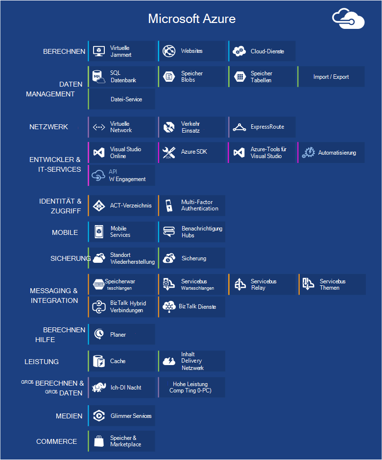   
 *Abbildung: Azure bietet Internet zugänglichen Anwendungsdienste in Azure Rechenzentren ausgeführt.*

## Verwaltungsportal
Azure hat eine Webschnittstelle aufgerufen [Verwaltungsportal](http://manage.windowsazure.com) , die Administratoren zugreifen und Sie verwalten die meisten, jedoch nicht alle Funktionen von Azure.  Microsoft veröffentlicht neue Benutzeroberfläche Portal Beta normalerweise vor eine ältere. Die neuere Datei heißt ["Azure Vorschauportal"](https://portal.azure.com/).

Wird in der Regel eine lange Überlappung Portale aktiv sind. Aber Basisdienste in Portale angezeigt werden, möglicherweise nicht alle Funktionen auf. Neue Dienste können in die neuere vor- und ältere Portaldienste und Funktionalität existiert nur in die.  Die Nachricht ist, dass die neuere Datei und umgekehrt, wenn Sie etwas in das ältere Portal finden überprüfen.

## Berechnen

Eine der grundlegendsten Dinge wie eine Cloud ist Programme ausgeführt. Azure Compute-Modelle jeweils eine eigene Rolle.

Diese Technologie separat verwenden oder kombinieren, um die richtige Grundlage für Ihre Anwendung erstellen können. Hängt Probleme Ansatz versuchen Sie zu lösen.

### Azure Virtual Machines

   
*Abbildung: Azure Virtual Machines bietet Ihnen vollständige Kontrolle über Instanzen virtueller Computer in die Cloud.*

Die Möglichkeit, bei Bedarf einen virtuellen Computer erstellen, ob ein Standardbild oder eine Eingabe, kann sehr hilfreich sein. Dieses bekannt als Infrastructure as a Service (IaaS) ist was Azure Virtual Machines. Abbildung 2 zeigt eine Kombination aus wie eine Virtual Machine (VM) ausgeführt wird und eine virtuelle Festplatte erstellen.  

Um einen virtuellen Computer zu erstellen, geben Sie die virtuelle Festplatte und die VM-Größe.  Sie bezahlen dann gleichzeitig die VM ausgeführt wird. Sie Zahlen Minute nur während der Ausführung, wenn einen minimalen Speicher berechnet für die virtuelle Festplatte verfügbar zu halten. Azure bietet eine Aktie virtuelle Festplatten ("Bilder" genannt), die kein startfähiges Betriebssystem ab. Dazu gehören Microsoft und Partner-Optionen wie Windows Server und Linux, SQL Server, Oracle. Sie können virtuelle Festplatten und Bilder erstellen und dann selbst hochladen. Sie können sogar VHDs hochladen, die nur Daten enthalten und anschließend von der ausgeführten VMs zugreifen.

Wo die virtuelle Festplatte aus, kann dauerhaft speichern Änderungen während eine VM ausgeführt wird. Das nächste Mal einen virtuellen Computer von dieser VHD erstellen wählen Sie Dinge Stelle. Die VHDs, die virtuellen Computer wieder befinden sich in Azure Storage Blobs wir später zu sprechen.  Das bedeutet, dass Sie Redundanz, um sicherzustellen, dass Ihre VMs durch Hardware-und Datenträger verschwinden werden. Es kann auch geänderte VHD aus Azure kopieren und lokal ausführen.

Die Anwendung führt in eine oder mehrere virtuelle Computer, je nachdem wie Sie es erstellt oder neu erstellt.

Diese sehr allgemeine Ansatz für cloud computing kann viele verschiedene Probleme verwendet werden.

**Virtual Machine-Szenarien**

1.  **Test-/** - können sie eine kostengünstige Plattform Entwicklungs- und erstellen, die Sie beenden können, wenn Sie fertig sind, verwenden. Sie können auch erstellen und ausführen, was und wie Sie verwenden. Diese Anträge können Daten-Management-Optionen, die Azure bereitstellt und Sie können auch mithilfe von SQL Server oder eine oder mehrere virtuelle Computer auf einem anderen DBMS.
2.  **Anwendung in Azure (anheben und Schicht) verschieben** - "Anheben und Shift" bezieht sich auf viel Bewegen der Anwendung wie einen Gabelstapler ein großes Objekt verschieben.  Die virtuelle Festplatte aus lokalen Rechenzentrum "heben" und "verschiebt" Azure und es ausgeführt.  Sie müssen in der Regel zum Entfernen der Abhängigkeit von anderen Systemen arbeiten. Gibt zu viele, können Sie stattdessen die Option 3.  
3.  **Erweitern Sie Ihr Rechenzentrum** - verwenden Azure VMs als Erweiterung des Datencenters lokalen SharePoint oder anderen Programmen ausgeführt. Um dies zu unterstützen, kann Windows-Domänen mit Active Directory in Azure VMs in der Cloud erstellen. Azure Virtual Network (siehe weiter unten) können Sie Ihr lokales Netzwerk und das Netzwerk in Azure verbinden.

### Webapps

   
 *Abbildung: Azure Web Apps führt eine Website-Anwendung in der Cloud ohne zugrunde liegende Webserver verwalten.*

Eine der häufigsten, die Personen in der Cloud ist Websites und Programme ausführen. Azure Virtual Machines können, aber es bleibt Sie verwalten eine oder mehrere VMs und den zugrunde liegenden Betriebssystemen verantwortlich. Cloud Services Web-Rollen können dafür jedoch bereitstellen und verwalten sie weiterhin Verwaltungsaufgaben verwendet.  Wenn Sie eine Website Wenn jemand möchte übernimmt die administrative Arbeit?

Dies ist genau wie Web Apps. Dieses Compute-Modell bietet eine verwalteten Web-Umgebung mit Azure-Verwaltungsportal als auch APIs. Verschieben einer vorhandenen Website Anwendung in Web Apps unverändert, oder eine neue direkt in der Cloud erstellen. Wenn eine Website ausgeführt wird, können Sie hinzufügen oder entfernen Instanzen dynamisch auf Azure Web Apps Saldo fordert Sie laden. Azure Apps bietet eine gemeinsame Option, in einer virtuellen Maschine mit anderen Seiten Ihrer Website ausgeführt wird, und eine standardmäßige Option, die eine Website einen eigenen virtuellen Computer ausgeführt. Die standard-Option können Sie die (rechenleistung) der Instanzen vergrößern bei Bedarf.

Bei der Entwicklung unterstützt Web Apps .NET, PHP, Node.js, Java und Python MySQL (von ClearDB, einem Microsoft-Partner) und SQL-Datenbank für relationale Speicher. Darüber hinaus Unterstützung für gängige Anwendungsmöglichkeiten, einschließlich WordPress, Joomla und Drupal. Das Ziel ist, eine kostengünstige, skalierbare und Allgemein nützliche Plattform zum Erstellen von Websites und Web-Applikationen in der öffentlichen Cloud.

**Web Apps-Szenarien**

Web Apps soll für Unternehmen, Entwickler und Web-Agenturen. Für Unternehmen ist es eine leicht zu verwaltende, skalierbare sehr sichere und hochverfügbare Lösung für Anwesenheit Websites ausführen. Wenn Sie eine Website einrichten möchten, empfiehlt es sich Azure Web Apps und fahren Sie mit Cloud-Dienste, wenn Sie ein Feature benötigen, das nicht verfügbar ist. Siehe Abschnitt "Compute" Links, mit denen Sie zwischen den Optionen auswählen können.

### Cloud-Dienste
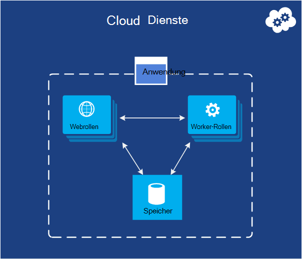   
*Abbildung: Azure Cloud Services dient zur hochskalierbaren benutzerdefinierten Code auf einer Plattform als (PaaS) serviceumgebung ausführen*

Angenommen Sie, Sie möchten eine Cloudanwendung erstellen, die viele gleichzeitige Benutzer unterstützt, erfordert viel Verwaltung und niemals ausfällt. Möglicherweise festgelegten Softwarehersteller, z. B. das hat zu Software als Service (SaaS) Version einer Anwendung in der Cloud erstellen. Oder neu erstellen einer Consumeranwendung erwarten schnell wachsen. Erstellen auf Azure sollte die Ausführungsmodell verwenden?

Azure Web Apps ermöglicht das Erstellen einer solchen Anwendung, aber es gibt einige Einschränkungen. Sie haben keinen administrativen Zugriff, sodass Sie beliebige Software installieren können. Azure Virtual Machines bietet Ihnen viel Flexibilität, administrativen Zugriff und sicherlich können sie eine sehr skalierbare Anwendung erstellen, jedoch müssen viele Aspekte der Zuverlässigkeit und Verwaltung selbst behandeln. Was ist eine Option, die das Steuerelement gibt, müssen jedoch auch behandelt die meisten Aufgaben für Zuverlässigkeit und Verwaltung erforderlich.

Dies ist genau von Azure Cloud Services bereitgestellt werden. Diese Technologie unterstützt ausdrücklich skalierbare, zuverlässige und Low-Admin-Applikationen, und es ist ein Beispiel der Plattform als Service (PaaS) so genannte hat. Um es zu verwenden, erstellen Sie eine Anwendung Technologie wie C#, Java, PHP, Python, Node.js oder etwas anderes wählen. Der Code führt dann in virtuellen Maschinen (bezeichnet als Instanzen) Version von Windows Server.

Aber die VMs unterscheiden sich von denen mit Azure virtuelle Computer erstellen. Zum einen Azure selbst verwaltet diese Dinge wie Betriebssystem-Patches installiert und Bilder automatisch neue Rollout gepatcht. Dies bedeutet, dass die Anwendung Status im Web oder Arbeitskraft Instanzen beibehalten sollte nicht; Stattdessen sollte in einem der im nächsten Abschnitt beschriebenen Azure Data Managementoptionen stehen. Azure überwacht auch die VMs neu, dass keine. Cloud-Dienste automatisch mehr oder weniger Instanzen auf Anforderung erstellen lassen. Dadurch erhöhte Auslastung und dann so wird weniger als großer Zahlen nicht skalieren.

Sie haben zwei Rollen wählen, wenn Sie eine Instanz erstellen, basierend auf Windows Server. Der Hauptunterschied zwischen beiden ist, dass eine Instanz einer Webrolle IIS ausgeführt wird, keine Instanz eine Worker-Rolle. Beide auf die gleiche Weise verwaltet werden, und häufig für eine Anwendung verwenden. Beispielsweise kann eine webrolleninstanz Anfragen von Benutzern akzeptieren, und eine workerrolleninstanz zur Verarbeitung übergeben. Um die Anwendung nach oben oder unten skalieren, können Sie anfordern Azure mehrere Instanzen einer Rolle erstellen oder vorhandene Instanzen beenden. Und ähnliche auf Azure Virtual Machines werden berechnet, nur, dass jede Rolleninstanz Web bzw. Arbeitsthread ausgeführt wird.

**Cloud Services-Szenarien**

Cloud-Dienste eignen, massiv unterstützen müssen mehr Kontrolle über die Plattform als Azure Web Apps jedoch keine Kontrolle über das zugrunde liegende Betriebssystem erforderlich.

#### Auswählen eines Modells berechnen
Die Seite [Azure Web Apps, Cloud-Diensten und virtuellen Maschinen Vergleich](./app-service-web/choose-web-site-cloud-service-vm.md) bietet weitere Informationen zur Auswahl ein Modells berechnen.

## Datenmanagement

Anwendung benötigen, und verschiedene Anwendungsarten verschiedene Arten von Daten benötigen. Aus diesem Grund bietet Azure auf verschiedene Weise Daten. Alle sind sehr dauerhaften Speicher zur Azure ermöglicht viele Speicheroptionen.  Mit diesen Optionen werden immer 3 Kopien der Daten synchronisiert über ein Azure-Rechenzentrum – 6 gestatten Azure Geo-Redundanz zurück zu einem anderen Rechenzentrum mindestens 300 Meilen entfernt.     

### In virtuellen Maschinen
Möglichkeit zum Ausführen von SQL Server oder einem anderen DBMS in einer VM erstellt mit Azure Virtual Machines bereits erwähnt. Erkennen Sie, dass diese Option relationalen Systemen auf; Sie können auch Technologien wie MongoDB und Cassandra NoSQL ausgeführt. Eigene Datenbank Betriebssystem sind einfach It repliziert wir für unsere eigenen Rechenzentren- aber auch Verwaltung, DBMS behandeln.  Andere Optionen behandelt Azure mehrere oder alle der Verwaltung.

Wiederum werden der Zustand der virtuellen Maschine und alle zusätzlichen Datenträger erstellen oder Hochladen von BLOB-Speicher (die weiter unten besprochen) unterstützt.  

### SQL Azure-Datenbank
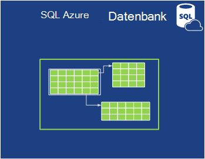   

*Abbildung: Azure SQL-Datenbank bietet einen verwalteten relationalen Datenbank in der Cloud.*

Für relationale Speicher bietet Azure SQL-Datenbank-Feature. Lassen Sie sich nicht täuschen benennen. Dies unterscheidet sich ein Standard SQL Datenbank von SQL Server auf Windows Server ausgeführt.  

Früher SQL Azure, enthält Azure SQL-Datenbank alle Hauptmerkmale von einem Datenbank-Managementsystem, einschließlich atomare Transaktionen gleichzeitigen Zugriff durch mehrere Benutzer Datenintegrität und ANSI-SQL-Abfragen vertraut Programmiermodell. Wie SQL Server, SQL-Datenbank über Entity Framework erfolgt, Zugriff ADO.NET, JDBC und andere bekannten Daten Technologies. Es unterstützt auch die meisten der T-SQL-Sprache mit SQL Server-Tools wie SQL Server Management Studio. Jeder kennt SQL Server oder einer anderen relationalen Datenbank, SQL Datenbank einfach.

Aber SQL-Datenbank ist nicht nur ein DBMS in die Cloud It des PaaS-Diensts. Weiterhin Daten steuern und wer darf darauf zugreifen, aber SQL Datenbank übernimmt administrative Routinearbeit wie Verwaltung der Hardware automatisch die Datenbank und Betriebssystem-Software aktuell zu halten. SQL-Datenbank bietet auch eine hohe Verfügbarkeit und automatische Sicherungen, Point-in-Time-Wiederherstellungsfunktionen Kopien geografischen Regionen replizieren können.  

**Szenarien für SQL-Datenbank**

Wenn eine Azure-Anwendung (mit Compute-Modelle) erstellen, die relationale Speicher kann SQL Datenbank empfohlen. Außerhalb der Cloud ausgeführt können dieser Dienst jedoch auch so andere Szenarien gibt. SQL-Datenbank kann beispielsweise von verschiedenen Client-Systeme, einschließlich Desktops, Laptops, Tablet-PCs und Telefone zugegriffen werden. Und da sie integrierten hohen Verfügbarkeit durch Replikation bietet SQL Datenbank kann Ausfallzeiten zu minimieren.

### Tabellen
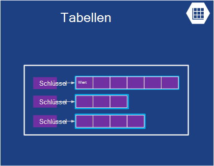  

*Abbildung: Azure Tabellen ermöglicht das flache NoSQL Datenspeicher.*

Dieses Feature wird anders als der Teil des größeren sogenannten "Azure Storage" bezeichnet. "Tabellen", "Azure Tabellen" oder "Speichertabellen" sehen, ist die gleiche.  

Und nicht mit dem Namen: Diese Technologie nicht relationale Speicher bereitzustellen. Tatsächlich ist ein Beispiel für eine NoSQL Ansatz einen Schlüssel-Wert-Speicher. Azure-Tabellen lassen eine Anwendung Eigenschaften verschiedener Typen wie Zeichenfolgen, Zahlen und Datumsangaben speichern. Eine Anwendung kann dann eine Gruppe von Eigenschaften mit einem eindeutigen Schlüssel für diese Gruppe abrufen. Während komplexe Vorgänge wie Joins unterstützt werden, bieten schnellen Zugriff auf typisierte Daten Tabellen. Sie sind außerdem sehr skalierbar und mit einer einzelnen Tabelle können bis zu einem Terabyte an Daten. Und ihrer Einfachheit, Tabellen sind in der Regel kostengünstiger als relationale SQL-Datenbank-Speicher.

**Szenarien für Tabellen**

Angenommen, Sie möchten eine Azure-Anwendung, die schnellen Zugriff auf eingegebenen Daten möglicherweise viel jedoch komplexe SQL-Abfragen für diese Daten ausführen muss. Angenommen Sie, erstellen eine Consumeranwendung, die kundenprofilinformationen für jeden Benutzer gespeichert. Ihre Anwendung wird sehr beliebt, Sie müssen große Datenmengen, aber Sie nicht viel über speichern, diese Daten dann auf einfache Weise abrufen. Dies ist genau die Art von Szenario, Azure Tabellen sinnvoll.

### BLOBs
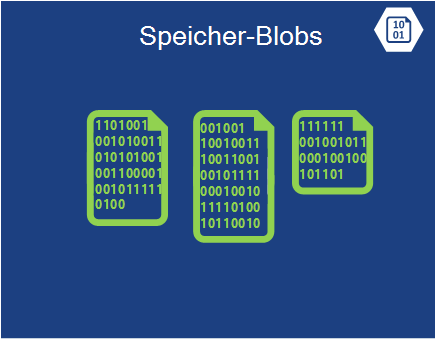    
*Abbildung: Azure-Blobs enthält unstrukturierte Binärdaten.*  

Azure-Blobs (erneut sind "BLOB-Speicher" und nur "Speicher-Blobs" dasselbe) Dient zum Speichern von unstrukturierter Binärdaten. Wie Tabellen kann Blobs bietet kostengünstigen Speicher, und ein einzelnes Blob so groß wie 1TB (ein Terabyte). Azure Applications können auch Azure Laufwerke, die BLOBs permanenten Speicher für ein Dateisystem Windows Azure Instanz bereitstellen können. Die Anwendung sieht normale Windows-Dateien, aber der Inhalt tatsächlich in einem Blob gespeichert.

BLOB-Speicher wird durch viele andere Azure-Funktionen (einschließlich virtuelle Computer), damit Ihre Arbeitslasten sicher zu behandeln können.

**Szenarien für Blobs**

Eine Anwendung, die Video- und riesige Dateien oder andere binäre Informationen speichert können Blobs für einfache, günstige Speicher. BLOBs werden auch zusammen mit anderen Content Delivery Network verwendet, die weiter unten besprochen wird.  

### Import / Export
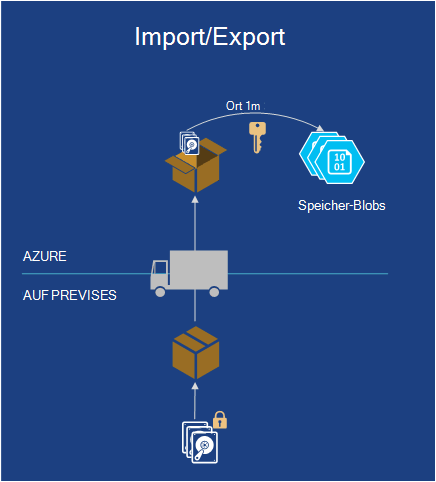  

*Abbildung: Azure Importieren / Exportieren ermöglicht das Versenden einer physischen Festplatte von Azure für schneller und kostengünstiger Daten importieren oder exportieren.*  

Manchmal möchten Sie große Datenmengen in Azure verschieben. Das würde sehr lange dauern, vielleicht Tage und viel Bandbreite. In diesen Fällen können Sie Azure Import/Export, wodurch Sie Bitlocker verschlüsselt 3,5-Zoll SATA-Festplatten an Azure Rechenzentren liefern, in denen Microsoft Daten in BLOB-Speicher für Sie übertragen werden.  Nach dem Upload wird Microsoft Laufwerke an Sie ausgeliefert.  Sie können auch anfordern, dass große Datenmengen von BLOB-Speicher auf Festplatte exportiert und an Sie per e-Mail.

**Szenarien für den Import / Export**

- **Große Datenmigration** – jederzeit Sie große Datenmengen (Terabyte), die in Azure hochladen möchten, der Import/Export-Dienst ist oft viel schneller und preiswerter vielleicht als über das Internet übertragen. Daten in Blobs können in andere Tabellenspeicher oder einer SQL-Datenbank verarbeitet werden.

- **Archivierte Datenrecovery** - Sie können Import/Export Microsoft Übertragung großer Datenmengen in Azure BLOB-Speicher in einem Speichergerät, die Sie senden und dann liefern das Gerät an einen gewünschten Speicherort. Da dies einige Zeit dauert, ist es keine gute Option für Disaster Recovery. Es empfiehlt sich für archivierte Daten schnell auf nicht.

### Datei-Service
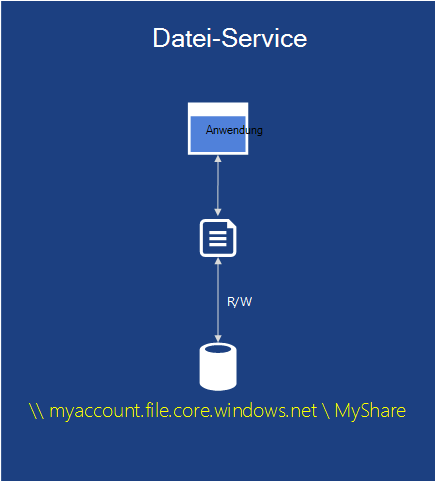    
*Abbildung: Azure File Services bietet SMB \\ \\: Server\Freigabe Pfade in der Cloud ausgeführt.*

Lokal ist häufig umfangreiche Dateispeicher über Server Message Block (SMB) Protokoll verwenden ein \\ \\: Server\Freigabe Format. Azure hat jetzt einen Dienst, der dieses Protokoll in der Cloud verwenden kann. Programme in Azure können VMs mit vertrauten Dateisystem-APIs wie ReadFile und WriteFile Dateien gemeinsam nutzen. Darüber hinaus können Dateien auch gleichzeitig über eine REST-Schnittstelle zugegriffen werden wodurch Sie lokal Freigaben zugreifen, wenn Sie ein virtuelles Netzwerk auch einrichten. Azure Dateien wird auf BLOB-Dienst erstellt, so erbt die gleiche Verfügbarkeit, Haltbarkeit skalierbar und Geo-Redundanz in Azure-Speicher integriert.

**Szenarien für Azure-Dateien**

- **Migrieren von vorhandenen apps in die Cloud** - Migration einfacher lokalen Applikationen in die Cloud, die Dateifreigaben verwenden, um Daten zwischen der Anwendung. Jede VM mit der Dateifreigabe verbunden und dann lesen und schreiben kann Dateien wie einer lokalen Datei freigeben möchten.

- **Shared Application Settings** - ein allgemeines Muster für verteilte Anwendung ist Konfigurationsdateien an einem zentralen Speicherort, wo sie viele verschiedene virtuelle Computer zugegriffen werden können. Diese Konfigurationsdateien können in einer Azure-Dateifreigabe gespeichert und von allen Anwendungsinstanzen gelesen werden. Die Einstellung können auch über die REST-Schnittstelle verwaltet werden weltweiten Zugriff auf die Konfigurationsdateien ermöglicht.

- **Diagnostische Teilen** - speichern und freigeben Diagnosedateien Protokolle Metriken und Speicherabbilder. Diese Dateien kann über das SMB und REST-Schnittstelle Anwendung verschiedener Analysetools für Verarbeitung und Analyse von Diagnosedaten.

- **Test/Dev/Debug** - Wenn Entwickler oder Administratoren auf virtuellen Computern in der Cloud arbeiten, benötigen sie oft Tools oder Dienstprogramme. Installation und Verteilung dieser Dienstprogramme auf jedem virtuellen Computer ist zeitaufwändig. Mit Azure Entwickler oder Administratoren ihre Lieblingstools in einem freigegebenen Ordner speichern und von jedem virtuellen Computer verbinden.

## Netzwerk

Azure läuft heute viele Rechenzentren weltweit. Wenn Sie eine Anwendung ausführen oder speichern, können Sie eine oder mehrere dieser Rechenzentren verwenden auswählen. Sie können diese Rechenzentren auf verschiedene Arten mit folgenden Services herstellen.

### Virtuelles Netzwerk
   

*Abbildung: Virtuelle Netzwerke bietet ein privates Netzwerk in der Cloud so verschiedene Dienste können miteinander kommunizieren und lokalen Ressourcen eingerichtet, ein VPN standortübergreifende Verbindung.*  

Hilfreich wie mit public Cloud ist als eine Erweiterung von Ihrem eigenen Datencenter zu behandeln.

Da von VMs bei Bedarf erstellen entfernen (und Zahlen) Wenn sie nicht mehr benötigt werden, können Sie nur beim gewünschten Computer. Und da Azure Virtual Machines VMs mit SharePoint, Active Directory und andere bekannte lokale erstellen können, kann dieser Ansatz für Applikationen haben.

Dazu nützlich, sollten jedoch Benutzer können diesen behandelt, als ob sie in Ihrem eigenen Rechenzentrum ausgeführt werden. Dies ist genau Azure Virtual Network. VPN-Gateway-Gerät verwenden, kann ein Administrator einrichten ein virtuelles privates Netzwerk (VPN) zwischen dem lokalen Netzwerk und Ihre virtuellen Computer in einem virtuellen Netzwerk in Azure bereitgestellt werden. Da die Cloud VMs eigene v4-Adressen zuweisen, werden sie auf Ihr eigenes Netzwerk angezeigt. Benutzer in Ihrer Organisation die Anwendung zugreifen können die VMs enthalten sie lokal ausgeführt werden.

Weitere Informationen zum Planen und Erstellen eines virtuellen Netzwerks funktioniert finden Sie unter [Virtuelles Netzwerk](./virtual-network/virtual-networks-overview.md).

### Schnellstraße

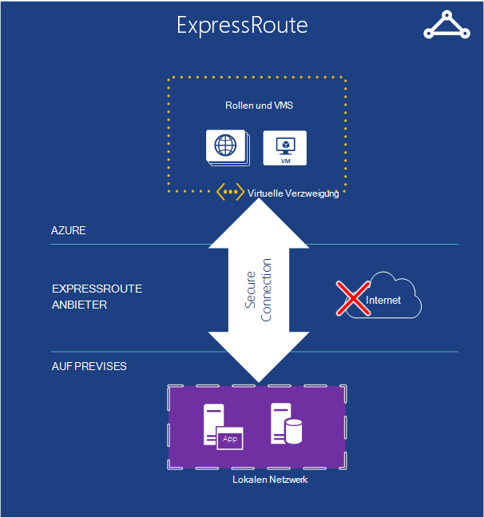   

*Abbildung: ExpressRoute verwendet ein virtuelles Netzwerk Azure jedoch Verbindungen über schneller Standleitungen statt im öffentlichen Internet weiterleitet.*  

Benötigen Sie mehr Bandbreite oder Sicherheit als virtuelles Azure-Netzwerk Verbindung bereitstellen kann, sehen Sie in ExpressRoute. In einigen Fällen kann ExpressRoute auch Sie Geld sparen. Benötigen Sie noch ein virtuelles Netzwerk in Azure, aber die Verbindung zwischen Azure und Ihre Website wird eine dedizierte Verbindung nicht über das Internet geht. Um diesen Dienst zu verwenden, müssen Sie eine Vereinbarung mit einem Netzwerkdienstanbieter oder Exchange-Anbieter.

Einrichten einer ExpressRoute Verbindung mehr Zeit erfordert Planung, damit beginnen soll mit einem Standort-zu-Standort-VPN und Migrieren zu einer ExpressRoute-Verbindung.

Weitere Informationen zu ExpressRoute finden Sie unter [ExpressRoute Technical Overview](./expressroute/expressroute-introduction.md).

### Traffic Manager

   

*Abbildung: Azure Traffic Manager können Sie globale Datenverkehr zu Ihrem Dienst basierend auf intelligenten Regeln.*

Läuft Ihre Azure-Anwendung in mehrere Rechenzentren, können Azure Traffic Manager Sie Anfragen von Benutzern Intelligent Instanzen der Anwendung weitergeleitet. Sie können auch Datenverkehr Dienste nicht in Azure ausgeführt, als sie aus dem Internet zugänglich sind.  

Azure-Anwendung mit Benutzern in einem einzelnen Teil der Welt kann in nur eine Azure-Rechenzentrum ausgeführt. Eine Anwendung für Benutzer auf der ganzen Welt verstreut ist jedoch eher in mehrere Rechenzentren vielleicht gar. In dieser zweiten Problem konfrontiert: wie Sie Intelligent weisen Benutzer Instanzen? Den größten Teil der Zeit möchten Sie möglicherweise jeder Benutzer nächsten Ihr Datencenter zugreifen, da es wahrscheinlich ihre beste Antwortzeit geben. Aber was ist, wenn diese Instanz der Anwendung ist überlastet oder nicht verfügbar? In diesem Fall wäre es schön, ihre Anfrage automatisch in einem anderen Rechenzentrum. Dies ist genau das, was von Azure Traffic Manager erfolgt.

Der Besitzer einer Anwendung definiert Regeln, die angeben, wie Anfragen von Benutzern zum Datencenter richten und stützt sich auf Traffic Manager diese Regeln zu. Angenommen, Benutzer können normalerweise angewiesen, den nächsten Azure-Rechenzentrum jedoch überschreitet die Antwortzeit bei Rechenzentrum standardmäßig die Antwortzeit bei anderen Rechenzentren zu einem anderen gesendet. Für Global verteilten Anwendung mit vielen Benutzern ist einen integrierten Dienst Probleme behandeln nützlich.

Traffic Manager Directory Name Service (DNS) Route Benutzern Endpunkte verwendet, aber weitere Datenverkehr geht nicht über Traffic Manager sobald diese Verbindung hergestellt ist. Dadurch wird verhindert, dass Traffic Manager wird ein Engpass Service Kommunikation verlangsamen kann.

## Entwickler-Services
Azure bietet eine Reihe von Tools für Entwickler und IT-Experten erstellen und Verwalten von Applikationen in der Cloud.  

### Azure SDK
2008 unterstützt die erste Vorabversion von Azure nur .NET Development. Heute können Sie jedoch Azure Applications in fast jeder Sprache erstellen. Microsoft bietet zurzeit sprachspezifischen SDKs für .NET Java, PHP, Node.js, Ruby und Python. Es gibt auch einen allgemeinen Azure SDK, das grundlegende Unterstützung für alle Sprachen wie C++ bietet.  

Diese SDKs können Sie erstellen, bereitstellen und Verwalten von Azure Applications. Sie sind entweder [www.microsoftazure.com](https://azure.microsoft.com/downloads/) oder GitHub und mit Visual Studio und Eclipse verwendet werden. Azure bietet ebenfalls Befehlszeilentools, mit denen Entwickler mit Editor oder Entwicklung Umgebung einschließlich Tools für die Bereitstellung von Applikationen in Azure Linux und Macintosh-Systemen.

Mit Hilfe Azure Applications erstellen, diese SDKs bietet Clientbibliotheken, mit denen Sie erstellen Software, Azure-Dienste verwendet. Beispielsweise können Sie erstellen eine Anwendung, die Lese- und Schreibvorgänge Azure-Blobs oder erstellen eine Tool, die Azure Applications über Azure Management-Schnittstelle bereitgestellt.

### Visual Studio Team Services

Visual Studio Team Services ist ein marketing für eine Zahl Dienstleistungen in der Azure-Anwendung entwickeln.

-Der Übersichtlichkeit bietet keine gehostete oder Web-basierte Version von Visual Studio. Sie brauchen Ihre lokale ausgeführte Kopie von Visual Studio. Aber viele weitere Tools, die sehr hilfreich sein können.

Er umfasst eine gehostete Quellcodeverwaltungssystem Team Foundation Service, Versionskontrolle und Verfolgung von Arbeitsaufgaben bezeichnet.  Auch können Git für die Versionskontrolle die bevorzugen. Und vom Projekt verwendeten Quellcodeverwaltungssystem variieren. Unbegrenzte private Teamprojekte können von überall auf der Welt.  

Visual Studio Team Services bietet einen Load Tests. Sie können Auslastungstests erstellt in Visual Studio auf VMs in der Cloud ausführen. Geben Sie die Gesamtanzahl der Benutzer mit laden und Visual Studio Team Services ermittelt automatisch, wie viele Agenten benötigt werden, die erforderlichen virtuellen Computer hochfahren und Auslastungstests ausführen. Wenn Sie MSDN-Abonnent sind, erhalten Sie Tausende frei Benutzer Minuten Auslastungstests monatlich.

Visual Studio Team Services bietet auch Unterstützung für agile Entwicklung mit Features wie fortlaufende Integrationsbuilds, Kanban-Übersichten und virtuellen Teams Räume.

**Visual Studio Team Services-Szenarien**

Visual Studio Team Services ist eine gute Wahl für Unternehmen, weltweit zusammenarbeiten und nicht haben bereits die Infrastruktur dafür. Einrichtung innerhalb von Minuten erhalten, wählen Sie ein Quellcodeverwaltungssystem, und Schreiben Code und dieser Tag.  Teamtools bieten einen Ort für die Koordinierung und Zusammenarbeit und weitere Tools der Analysis testen und Optimieren der Anwendung schnell musste.

Sondern Organisationen, die bereits einen lokalen System können neue Projekte in Visual Studio Team Services effizienter ist.   

### Anwendung Einblicke

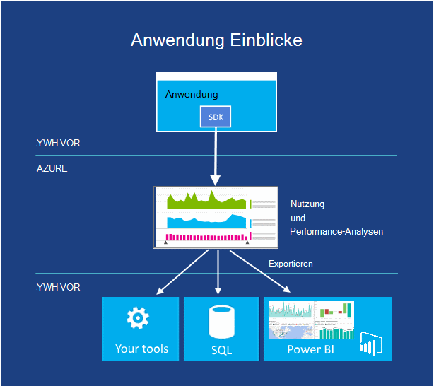  

*Abbildung: Application Insights Überwachung der Performance und Nutzung Ihrer live Web oder Gerät App.*

Wenn Sie Ihre app - veröffentlicht haben, ob die Ausführung auf mobilen Geräten, Desktops oder Webbrowser - informiert Application Insights Leistung und was Benutzer damit sind. Anzahl der Abstürze und langsam bleiben, Warnung, wenn die Zahlen nicht akzeptabel Schwellenwerte überschreiten und Ihnen Probleme diagnostizieren.

Bei der Entwicklung einer neuen Funktion mit Benutzern Erfolg messen möchten. Durch Analyse der Verwendungsmuster verstehen, was am besten für Ihre Kunden und Optimieren Sie Ihre app in jedem Entwicklungszyklus.

Obwohl in Azure gehostet wird, ist die Anwendung Einblicke an eine große und ständig zunehmende Apps auf und Azure. J2EE und ASP.NET Web apps fallen, iOS sowie Android, OSX und Windows Applications. Telemetrie erhält ein SDK integriert die Anwendung analysiert und im Dienst Anwendung Einblicke in Azure angezeigt werden.

Ggf. spezielle Analysen exportieren Sie Telemetrie Streams in eine Datenbank oder Power BI oder andere Tools.

**Anwendungsszenarien Einblicke**

Sie entwickeln eine Anwendung. Eine Webanwendung oder ein Gerät app oder einer app Gerät mit einem Back-End möglicherweise.

* Optimieren Sie die Leistung Ihrer App nach der Veröffentlichung oder Auslastungstests wird.  Application Insights Telemetrie von allen installierten Instanzen aggregiert und Diagramme Antwortzeiten, Anforderung Ausnahme zählt, Abhängigkeit Reaktionszeiten und andere Leistungsindikatoren bietet. Diese können Sie die Leistung Ihrer Anwendung zu optimieren. Fügen Sie Code zum Bericht mehr Daten bei Bedarf.
* Erkennen und diagnose von Problemen in der aktiven Anwendung. Sie können Alarme per e-Mail erhalten, wenn Leistungsindikatoren zulässigen Grenzwerte überschreiten. Untersuchen Sie bestimmte Sitzungen, beispielsweise die Anforderung angezeigt, die eine Ausnahme verursacht.
* Nachverfolgen Sie Nutzung der Erfolg jedes neue Features. Beim Entwerfen einer neuen User Story wie viel verwendet und gibt an, ob Benutzer die erwarteten Ziele messen möchten. Application Insights bietet grundlegende Daten wie Webseite Ansichten, und fügen Sie Code zum Nachverfolgen der Benutzerfunktionalität ausführlicher.

### Automatisierung
Niemand Zeit immer die gleichen manuelle Prozesse ausführen. Azure Automation bietet eine Möglichkeit für Sie erstellen, überwachen, verwalten und Bereitstellen von Ressourcen in der Azure-Umgebung.  

Automatisierung verwendet "Runbooks", die Windows PowerShell-Workflows (statt nur reguläre PowerShell) im Hintergrund verwendet. Runbooks soll ohne Benutzereingriff ausgeführt werden. PowerShell Workflows können den Zustand eines Skripts an den Weg gespeichert werden. Wenn ein Fehler auftritt, müssen Sie dann ein Skript von Anfang an beginnen. Sie können den letzten Prüfpunkt neu starten. Dies erspart Ihnen viel Arbeit versuchen, das Skript alle möglichen Fehler zu behandeln.

**Szenarios für die Automatisierung**

Azure-Automatisierung ist eine gute Wahl manuellen langer, fehleranfällig und häufig durchgeführte Aufgaben in Azure automatisieren.

### API-Management

Erstellen und Veröffentlichen von Anwendungsprogrammierungsschnittstellen (APIs) im Internet ist eine gängige Methode zum Bereitstellen, Applikationen. Sind diese Dienste (z. B. Daten) wiederverkaufbaren, können eine Organisation dritte Zugriff auf die gleichen Dienste gegen eine Gebühr. Skalierung für weitere Partner müssen Sie normalerweise optimieren und den Zugriff steuern.  Einige Partner möglicherweise auch die Daten in einem anderen Format.

Azure API Management erleichtert Unternehmen an APIs an Partner, Mitarbeiter und Entwickler sicher zu skalieren. Es bietet verschiedenen API-Endpunkt und fungiert als Proxy für den aktuellen Endpunkt aufrufen und Dienste wie zwischenspeichern, Transformation Drosselung, Zugriffskontrolle und Analytics Aggregation.

**API-Szenarien**

Angenommen, Ihr Unternehmen verfügt über eine Reihe von Geräten, die alle einen zentralen Dienst Daten – z. B. eine Rückrufnummer, die Geräte in jeder LKW unterwegs.  Sicherlich möchten Unternehmen ein System einrichten, eigene LKW verfolgen zuverlässig prognostizieren und Lieferzeiten aktualisieren. Sie wissen, wie viele LKW hat und entsprechend planen.  Jeder LKW benötigen ein Gerät, die zentral mit Positionierung und Geschwindigkeit Daten vielleicht aufgerufen.

Ein Kunde der Schifffahrtsgesellschaft wahrscheinlich auch diese Positionierung Daten profitieren.  Der Kunden können erfahren, wie weit Produkte zu, in dem sie, wie viel sie bezahlen bestimmte Routen (falls mit was sie liefern bezahlt) stecken. Wenn die Schifffahrtsgesellschaft bereits Daten sammelt, können viele bezahlen.  Jedoch muss die Schifffahrtsgesellschaft, Kunden Daten zu ermöglichen. Nachdem sie Debitoren zugreifen, können sie keinen steuern, wie oft die Daten abgefragt werden. Sie müssen Regeln darüber, wer welche Daten zugreifen können. Alle diese Regeln müssten die externe API integriert werden. Dies wird Management API helfen können.  

## Identitäts- und

Arbeiten mit Identität ist Bestandteil der meisten. Zu wissen, wer ein Benutzer kann eine Anwendung entscheiden, wie diese Interaktion mit Benutzer sollten. Azure bietet Identität verfolgen sowie mit Identitätsspeichern integriert, die Sie bereits verwenden.

### Active Directory

Wie die meisten Verzeichnisdienste speichert Azure Active Directory Informationen über Benutzer und Organisationen zu. Es kann Benutzer anmelden und versorgt sie mit Token können Clientanwendungen ausweisen können. Darüber hinaus können Synchronisieren von Benutzerinformationen mit Windows Server Active Directory lokal im lokalen Netzwerk ausgeführt. Während die Mechanismen und Azure Active Directory verwendete Datenformate identisch mit denen in Windows Server Active Directory nicht ähneln die Funktionen.

Es ist wichtig zu verstehen, dass Cloudanwendungen hauptsächlich für Azure Active Directory entwickelt. Sie können von Azure ausgeführt werden, z. B. und andere Cloudplattformen verwendet werden. Es wird auch von Microsoft Cloud Anwendung wie Office 365 verwendet. Wenn Sie Ihr Rechenzentrum in Azure Virtual Machines mit Azure Virtual Network Cloud erweitern möchten, ist Azure Active Directory die richtige Wahl. Stattdessen möchten Windows Server Active Directory in virtuellen Maschinen ausgeführt werden.

Applikationen enthaltenen Informationen lassen, stellt Active Directory Azure RESTful API Azure Active Directory Diagramm aufgerufen. Diese API kann Programme auf jeder Plattform Zugriff auf Verzeichnisobjekte und die Beziehung.  Z. B. können eine autorisierte Anwendung dieser API Informationen zum Benutzer, Gruppen, zu denen er gehört und andere Informationen. Programme sehen auch Beziehungen zwischen Benutzern ihre Grafik lassen sie verbundene Benutzer Intelligenter arbeiten.

Eine weitere Möglichkeit des Azure Active Directory Access Control Service erleichtert eine Anwendung Identitätsinformationen von Facebook, Google, Windows Live ID und andere gängige Identitätsanbieter. Anstatt die Anwendung unterschiedliche Formate und Protokolle, die von diesen Anbietern verwendet, verschiebt Access Control alle in einem einzelnen allgemeinen Format. Sie können auch eine Anwendung Logins aus einer oder mehreren Active Directory-Domänen akzeptiert. Beispielsweise können ein Hersteller eine SaaS-Anwendung bietet Azure Active Directory Access Control Sie Benutzern aller seiner Kunden einmaliges Anmelden für die Anwendung.

Verzeichnisdienste sind eine zentrale Grundlage lokalen computing. Es sollte nicht überraschen, dass sie in der Cloud auch wichtig sind.

### Mehrstufige Authentifizierung
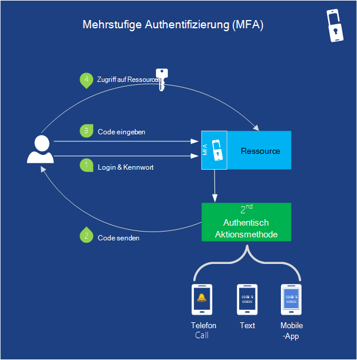   

*Abbildung: Mehrteilige Authentifizierung bietet Funktionen für die Anwendung mehr als eine Form der Identifikation überprüfen*

Sicherheit ist wichtig. Mehrstufige Authentifizierung (MFA) hilft sicherzustellen, dass nur Benutzer sich ihre Konten zugreifen. MFA (auch bekannt als zweistufige Authentifizierung oder "2FA") erfordert, dass Benutzer zwei dieser drei Methoden der Überprüfung für Benutzer anmelden und Transaktionen bereitstellen.

- Etwas wissen (in der Regel ein Kennwort)
- Etwas, das Sie (ein vertrauenswürdiges Gerät, das nicht leicht besitzen, wie ein Telefon dupliziert wird)
- (Biometrischen) sind

Wenn sich ein Benutzer anmeldet, können Sie sie auch ihre Identität eine app, einen Anruf oder eine Textnachricht mit Kennwort überprüfen verlangen. Azure Active Directory unterstützt die Verwendung von Kennwörtern als einzige Authentifizierungsmethode Benutzer anmelden. MFA mit Azure AD oder andere Programme und Verzeichnisse können mit MFA-SDK. Sie können Sie über mehrstufige Authentifizierungsserver auch mit lokalen Applikationen verwenden.

**MFA-Szenarien**

Schutz für wichtige Konten wie Bank Benutzernamen und Zugriff auf den Quellcode, unbefugtem hohe Finanz- oder geistiges Eigentum Kosten hätte, anmelden.   

## Mobile

Erstellen eine Anwendung für ein mobiles Gerät können Azure Daten in der Cloud speichern und Benutzer authentifizieren Pushbenachrichtigungen zu senden, ohne viel benutzerdefinierten Code schreiben.

Während Sie sicherlich die Back-End für eine mobile Anwendung mit virtuellen Maschinen, Cloud-Services oder Web Apps erstellen, verbringen Sie weniger Zeit mit dem Erstellen von Komponenten des zugrunde liegenden mithilfe von Azure Services.

### Mobiler Apps

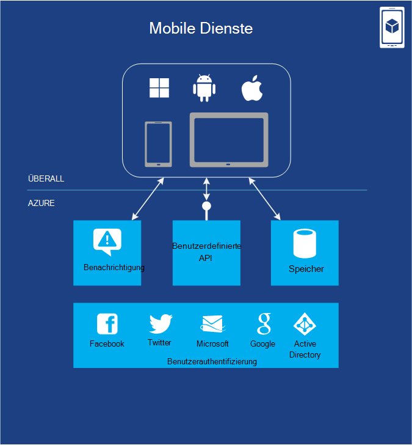

*Abbildung: Mobiler Apps Funktionsumfang häufig Anträge mit mobilen Geräten erforderlich.*

Azure Mobile Apps bietet viele nützliche Funktionen, die Sie sparen Zeit beim Erstellen einer Back-End für eine Mobile Anwendung. Es ermöglicht die einfache Bereitstellung und Verwaltung von Daten in einer SQL-Datenbank gespeichert werden. Mit einem serverseitigen Code können Sie problemlos weitere Datenoptionen BLOB-Speicher oder MongoDB. Mobile Apps unterstützt Benachrichtigungen, obwohl in bestimmten Fällen Sie stattdessen Benachrichtigungshubs können wie im folgenden beschrieben.  Der Dienst hat auch eine REST-API, die Arbeit die mobile Anwendung aufrufen können. Mobile Apps ermöglicht auch authentifiziert Benutzer durch Microsoft und Active Directory sowie andere bekannte Identitätsanbieter wie Google, Facebook und Twitter.   

Sie können andere Dienste Azure Service Bus und Worker-Rollen und lokalen Systemen an. Sie können sogar 3rd Party Add-Ons aus dem Azure-Speicher (z. B. SendGrid für e-Mail) verwenden, um zusätzliche Funktionen bereitzustellen.

Systemeigene Clientbibliotheken für Android, iOS HTML/JavaScript, Windows Phone und Windows Store erleichtert für apps auf alle wichtigen mobilen Plattformen entwickeln. REST-API können Sie Mobile Dienste und Authentifizierungsinformationen Funktionalität mit apps auf verschiedenen Plattformen verwenden. Ein einzelnen mobiler Dienst kann mehrere Clientanwendungen sichern, damit ein einheitliches Benutzererlebnis auf Geräten bereitstellen können.

Azure bereits massiv unterstützt, können Sie den Datenverkehr behandeln, wie Ihre Anwendung immer beliebter.  Überwachung und Protokollierung werden zur Problembehandlung und Verwalten der Leistung.

### Benachrichtigungshubs

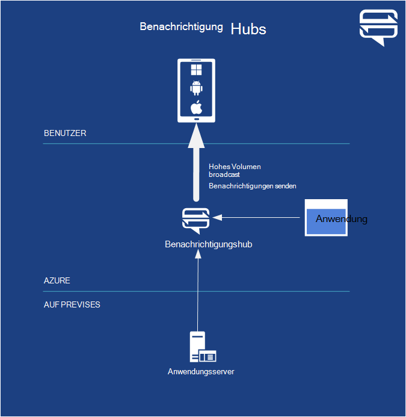  

*Abbildung: Benachrichtigungshubs Funktionsumfang häufig Anträge mit mobilen Geräten erforderlich.*

Beim Schreiben von Code hierzu Notifications in Azure Mobile Apps wird Notification Hubs übertragen Millionen hochgradig personalisierter Pushbenachrichtigungen innerhalb von Minuten optimiert.  Sie müssen Details wie mobilen Netzbetreiber bzw. den Gerätehersteller kümmern. Sie können einzelne oder Millionen von Benutzern mit einem einzigen API-Aufruf abzielen.

Benachrichtigungshubs soll jede Backend arbeiten. Sie können Azure Mobile Apps, benutzerdefinierte Backend in der Cloud auf jedem Anbieter oder einem lokalen Back-End.

**Benachrichtigung Hub Szenarien** Wenn Sie ein Spiel schreiben würden, wo Spieler aktiviert haben, müssen Sie Spieler 2 benachrichtigen, dass Spieler 1 Reihe abgeschlossen. Das ist alles tun müssen, können Sie nur Mobile Apps. Aber wenn Sie 100.000 Benutzer spielen und eine vertrauliche Angebot kostenlos zu jeder Benachrichtigungshubs die bessere Wahl ist gesendet werden soll.

Sie können Nachrichten, senden, Sportereignisse und Produkt Ankündigung Benachrichtigung Millionen von Benutzern mit geringer Latenz. Unternehmen können ihre Mitarbeiter über neue Zeit vertrauliche Kommunikation wie Geschäftschancen, benachrichtigen, damit Mitarbeiter ständig überprüfen e-Mail oder andere Programme informiert haben. Sie können auch eine einmalige Passwörter für mehrstufige Authentifizierung erforderlich senden.

## Sichern
Jedes Unternehmen muss zum Sichern und Wiederherstellen von Daten. Azure können zum Sichern und Wiederherstellen der Anwendung in der Cloud oder lokal. Azure bietet verschiedene Optionen, je nach Art der Sicherung.

### Site Recovery

Azure Site Recovery (ehemals Hyper-V Recovery Manager) helfen Ihnen die wichtigen Programme schützen durch Replikation und Recovery über Standorte hinweg koordinieren. Site Recovery ermöglicht zu basierend auf Hyper-V, VMWare oder SAN eigene sekundären Standort, Standort ein Hoster oder Azure schützen Kosten und Komplexität und verwalten Ihre eigenen sekundären Standort. Azure verschlüsselt und Kommunikation und Sie die Option Verschlüsselung für Daten zur anderen zu ermöglichen.

Überwacht kontinuierlich die Integrität Ihrer Dienste und hilft die ordnungsgemäße Wiederherstellung der Dienste Ausfall eines Standorts im primären Rechenzentrum automatisieren. Virtuelle Computer können in einer instrumentierten gebracht werden, Service, auch für komplexe Multi-Tier-Arbeitslasten wiederherzustellen.

Site Recovery arbeitet mit Technologien wie Hyper-V Replica, System Center und SQL Server immer auf. [Azure Site Recovery](site-recovery/site-recovery-overview.md) Übersicht Weitere Informationen überprüfen.

### Azure Backup
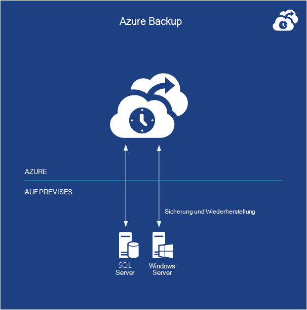  

*Abbildung: Azure Backup sichert Daten aus lokalen Windows-Servern in der Cloud.*  

Azure Backup sichert Daten aus lokalen Server unter Windows Server in der Cloud. Sie können Ihre Backups direkt von der backup-Tools in Windows Server 2012, Windows Server 2012 Essentials und System Center 2012 - Data Protection Manager verwalten. Alternativ können Sie eine spezielle backup-Agenten.

Ist sicherer, da Backups vor der Übertragung verschlüsselt werden verschlüsselt in Azure gespeichert und geschützt durch ein Zertifikat, das Sie hochladen. Der Dienst verwendet die gleichen redundant und hochverfügbaren Datenschutz in Azure-Speicher gefunden.  Sie können Dateien und Ordner regelmäßig oder sofort sichern vollständigen oder inkrementellen Backups ausführen. Nachdem Daten in die Cloud gesichert, können autorisierte Benutzer problemlos Backups auf jedem Server wiederherstellen. Zudem konfigurierbar Aufbewahrungsrichtlinien, Datenkompression und Drosselung Datenübertragung Kosten zum Speichern und Übertragen von Daten verwalten.

**Azure Backup-Szenarien**

Wenn Sie bereits mit Windows Server oder System Center Azure Backup eine natürliche Lösung für Dateisystem Server, virtuelle Computer und SQL Server-Datenbanken sichern ist.  Es arbeitet mit verschlüsselten, verschlüsselten und komprimierten Dateien. Es gibt einige Nachteile so [Azure Sicherung erforderlichen Komponenten überprüfen](http://technet.microsoft.com/library/dn296608.aspx) , Sie zuerst sollten.

## Messaging und Integration

Egal was es tut muss Code häufig mit anderen Code interagieren.  In einigen Situationen benötigt wird grundlegende verzögerte messaging. In anderen Fällen sind komplexere Aktivitäten erforderlich. Azure bietet unterschiedliche Weise lösen. Abbildung 5 zeigt die Auswahlmöglichkeiten.

### Warteschlangen
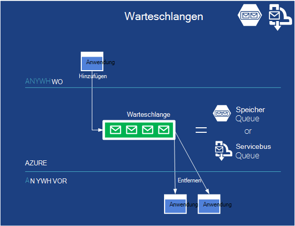

*Abbildung: Warteschlangen können lose Kopplung zwischen einer Anwendung und Skalierung vereinfachen.*  

Queuing ist ein einfaches Konzept: eine Anwendung eine Nachricht in einer Warteschlange platziert und die Nachricht schließlich von einer anderen Anwendung lesen. Wenn die Anwendung nur diese einfach Service, möglicherweise Azure-Warteschlangen die beste Wahl.

Aufgrund der Art die Azure mit der Zeit wuchs, Dienstleistungen Azure Storage und Service Bus Warteschlangen ähnlich wie Warteschlangen. Gründe, warum Sie übereinander verwenden wollen, werden relativ Whitepaper [Warteschlangen Azure Service Bus Warteschlangen - verglichen und Contrasted](http://msdn.microsoft.com/library/azure/hh767287.aspx)behandelt.  In vielen Szenarios wird funktionieren.

**Warteschlange-Szenarien**

Eine häufige Verwendung von Warteschlangen ist heute lassen eine Kommunikation mit einer Arbeitskraft Rolleninstanz innerhalb derselben Anwendung Clouddienste webrolleninstanz.

Angenommen Sie, eine Azure-Anwendung für video-sharing erstellen. Die Anwendung besteht aus PHP-Code in einer Webrolle, mit dem Benutzer hochladen und Videos ansehen sowie eine Worker-Rolle in C#, das hochgeladenes Video in verschiedenen Formaten übersetzt implementiert ausgeführt.

Wenn eine webrolleninstanz ein neues Video von einem Benutzer erhält, können Sie das Video in ein Blob speichern und dann eine Nachricht an eine Worker-Rolle über eine Warteschlange veranlassen, dieses neue Video finden. Eine Arbeitskraft Rolle Instanz nicht Rolle 1-wird dann die Nachricht aus der Warteschlange gelesen und erforderliche video Übersetzung im Hintergrund durchführen.

Asynchronen Verarbeitung ermöglicht eine Anwendung so zu strukturieren und macht zudem die Anwendung einfacher zu skalieren, da die Anzahl der Webrolleninstanzen und Arbeitskraft Instanzen kann, unabhängig variiert werden. Auch können die Größe der als Trigger Sie die Anzahl der Worker-Rollen nach oben und unten skaliert. Hoch, und weitere Rollen hinzufügen. Wenn es niedriger wird, reduzieren Sie die Anzahl der ausgeführten Rollen zu sparen.  

Dieses Muster können zwischen viele verschiedene Teile der Anwendung Sie auch wenn sie Web-und Workerrollen.  Können die Teile auf beiden Seiten der Warteschlange nach oben und unten Bedarf skalieren und Verarbeitungszeit erfordert.

### Servicebus
Ausführung in der Cloud in Ihrem Rechenzentrum auf einem mobilen Gerät oder anderswo müssen interagieren. Die Azure Service Bus soll Programme ziemlich überall Daten austauschen können.

Service Bus bietet neben den Warteschlangen (1) beschriebenen auch andere Kommunikationsmethoden.

#### Service Bus Relay
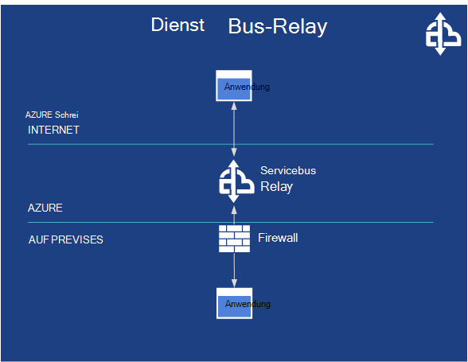

*Abbildung: Service Bus Relay ermöglicht die Kommunikation zwischen Programmen auf unterschiedlichen Seiten der Firewall.*

Service Bus ermöglicht direkten Kommunikation über den Relay-Dienst auf sichere Weise zu interagieren über Firewalls. Service Bus Relais aktivieren Applikationen kommunizieren durch den Austausch von Nachrichten über einen Endpunkt in der Cloud, anstatt lokal gehostet.

**Service Bus Relay-Szenarien**

Über Service Bus Kommunikation Applikationen möglicherweise Azure Applications oder Software auf eine andere Cloudplattform. Sie können auch jedoch außerhalb der Cloud ausgeführt werden. Die Luftverkehrsgesellschaft, die Reservierung Dienste im Computer im eigenen Rechenzentrum implementiert z. B. vorstellen. Die Fluglinie muss diese Dienste viele Kunden Schalter in Flughäfen Reservierung Agent Terminals und vielleicht sogar Kunden Telefone. Dieser können Service Bus dazu lose gekoppelte Interaktionen zwischen verschiedenen Anwendung erstellen.

#### Service Bus Topics und Abonnements
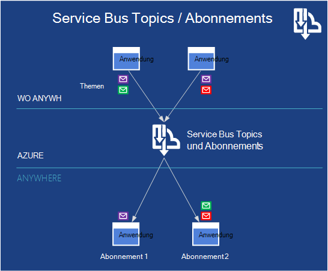   
 *Abbildung: Service Bus Topics können mehrere apps, Nachrichten und anderen Applikationen abonnieren zum Empfangen von Nachrichten, die bestimmten Kriterien entsprechen.*

Service Bus bietet veröffentlichen und abonnieren sogenannte Themen und Abonnements. Mit Publish-subscribe kann eine Anwendung Nachrichten zu einem Thema, weitere Abonnements zu diesem Thema erstellen. Dadurch wird ein 1: n-Kommunikation innerhalb der Anwendung, dass dieselbe Nachricht mehrere Empfänger gelesen werden.

**Service Bus Topics und Abonnements Szenarien**

Jederzeit Sie einrichten, gibt es viele Nachrichten wichtig, aber verschiedene nachgeschaltete Systeme müssen nur unterschiedliche Teilmengen der die Communications Service-Bus-Topic anhören und Abonnements sind eine gute Wahl.

### BizTalk-Dienste
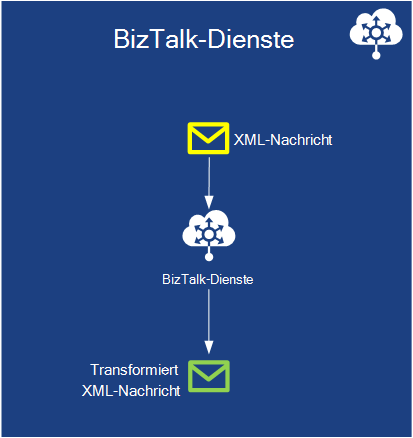   
 *Abbildung: BizTalk-Dienste bietet die Möglichkeit zum Transformieren von XML-Nachrichten Formate in der Cloud.*

Manchmal müssen Sie Systeme kommunizieren mithilfe verschiedener Formate, messaging zu verbinden. Es ist für Unternehmen zu verschiedenen Datenbankschemas und XML-Formate, messaging, selbst wenn ein allgemeiner Standard verfügbar ist. Als benutzerdefinierten Code schreiben, können lokal BizTalk Server Sie verschiedene Systeme.  Azure BizTalk-Dienste bietet die gleiche Service, sondern in der Cloud. Sie bezahlen nur Sie verwenden und keine Skalierung wie Sie lokal sorgen.

**BizTalk Services-Szenarien**

Business to Business (B2B) Aktivitäten benötigen normalerweise diese Art von Übersetzung.  Beispielsweise muss ein Unternehmen Flugzeuge Teile aus der verschiedenen Lieferanten bestellen. Sie haben viele Lieferanten.  Diese Aufträge sollten automatisiert werden, gehen Sie direkt aus dem Flugzeug Generatoren Lieferanten-Systemen.  Weder Unternehmen ihrer zentralen Systeme und Nachrichtenformate ändern möchte, und es ist unwahrscheinlich, dass diese Formate identisch sind. BizTalk-Dienste können Nachrichten und die neuen Formate beides übersetzen. Entweder Flugzeug Lieferanten kann zu übersetzen oder Lieferanten können, je nach Wer will mehr Kontrolle und die Übersetzung benötigt.     

## Hilfe zu berechnen
Azure bietet Unterstützung für Dienste, die nicht ständig ausgeführt werden müssen.  

### Planer

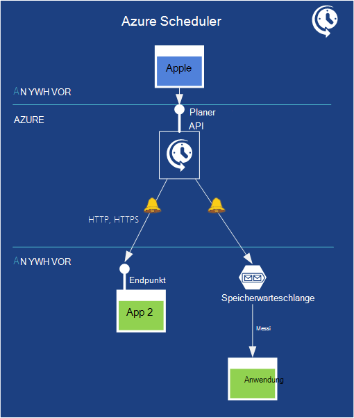   
*Abbildung: Azure Scheduler bietet eine Möglichkeit, Aufträge zu einem bestimmten Zeitpunkt für eine bestimmte Dauer planen.*

Clientanwendungen müssen manchmal nur zu einem bestimmten Zeitpunkt ausführen. Azure sparen Sie Geld mit dieser Anwendung anstatt einer Anwendung nur 24 x 7-Daten zu behalten. Azure Scheduler können Sie planen, wann eine Anwendung basierend auf Intervall oder einen Kalender ausgeführt werden soll. Es ist zuverlässig und überprüfen, ob ein Prozess ausgeführt wird, selbst wenn Netzwerk und den Computer Center Fehler. Mithilfe der Planer REST-API diese Aktionen verwalten.

Bei einer geplanten Alarms Planer sendet HTTP oder HTTPS-Nachrichten an einen bestimmten Endpunkt oder stellen eine Nachricht in einer Warteschlange Speicher.  So müssen Sie Ihre Anwendung anliegenden zugänglich oder haben Sie eine Speicherwarteschlange überwachen. Nachdem er die Nachricht erhält, können sie Maßnahmen führen programmiert.

**Planer-Szenarien**

- Wiederkehrende Anwendungsaktionen: beispielsweise ein Dienst möglicherweise regelmäßig Daten von Twitter und Datensammlung in einen regulären Feed.
- Tägliche Wartung: Protokoll verarbeiten oder beschneiden, dass Backups und andere zeitweise Tasks planen.
- Aufgaben, die in der Nacht.
- Web Applications Aufgaben wie Protokolle Durchführen einer Sicherung und anderen Wartungsaufgaben täglich löschen. Ein Administrator beispielsweise Sichern ihrer Datenbank um 1 Uhr täglich für den nächsten 9 Monaten.

Der Planer-API ermöglicht das Erstellen, aktualisieren, löschen, anzeigen und auftragssammlungen und geplante Aufträge programmgesteuert verwalten.

## Leistung

Leistung ist immer für eine Anwendung wichtig. Applikationen Regel immer wieder dieselben Daten zugreifen. Eine Möglichkeit zur Verbesserung der Leistung ist, eine Kopie der Daten näher Anwendung minimieren die Zeit abrufen. Azure bietet verschiedene Dienste dazu.

### Azure Caching

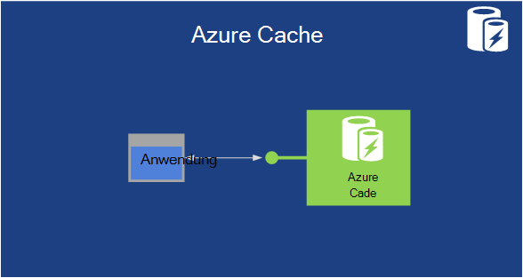   
 **Abbildung: Azure-Anwendung kann Daten im Speicher zwischengespeichert und sogar viele Worker-Rollen von Teilen**

Zugreifen auf Daten in einer Azure Data Management Services SQL-Datenbank, Tabellen oder Blobs-ist sehr schnell. Noch Zugriff auf Daten im Arbeitsspeicher ist schneller. Dadurch verbessern halten eine Speicherkopie genutzten Daten Leistung der Anwendung. Azure im Arbeitsspeicher zwischenspeichern können dazu.

Cloud-Services-Anwendung kann Daten im Cache speichern und Abrufen ohne permanenten Speicher zugreifen. Cache werden kann innerhalb der Anwendung VMs verwaltet oder von VMs ausschließlich zum Zwischenspeichern. In beiden Fällen Cache verteilt werden, mit den Daten Verbreitung über mehrere VMs in Azure Datencenter enthält.

Azure hat andere Cache-Technologien, die mit der Zeit verschoben. Die eingeführt wurden, ist eine freigegebene in Rolle verwaltet und Redis Cache. Freigegebene Zwischenspeichern ist eine ältere Technologie und neue sollte nicht mit erstellen. Cache verwaltet weist dieselbe Rolle im Cache als verwalteter Dienst außerhalb der Azure-Verwaltungsportal. Redis Cache wird in der Vorschau. Redis-Implementierung hat die größte Anzahl von Features und sollte beim Schreiben von neuem Code Zwischenspeichern.

**Azure Szenarios**

Eine Anwendung, die einen Produktkatalog wiederholt liest diese Art des Zwischenspeicherns profitieren kann, z. B. seit Daten es benötigt werden schneller. Die Technologie unterstützt auch sperren lassen mit Lese-/Schreibzugriff sowie für schreibgeschützte Daten verwendet werden. Und ASP.NET Applications können den Dienst um Sitzungsdaten mit nur einer Konfiguration zu speichern.

### Content Delivery Network
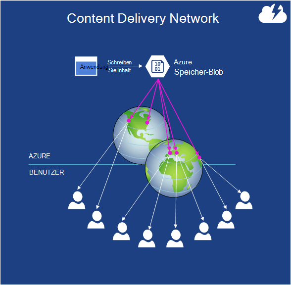   
 **Abbildung: Kopien eines Blob können an Standorten auf der ganzen Welt zwischengespeichert werden.**

Angenommen Sie, Sie müssen zum Speichern von BLOB-Daten, die Benutzer auf der ganzen Welt zugreifen. Vielleicht ist es ein Video die neuesten WM Übereinstimmung, z. B. Treiberupdates oder ein verbreitetes e-Book. Speichern eine Kopie der Daten in mehreren Azure Rechenzentren hilft, aber wenn es Benutzer gibt, genügt nicht. Verwenden Sie für noch bessere Leistung Azure CDN.

CDN hat zahlreiche Websites weltweit jedes Kopien der Azure-Blobs gespeichert werden kann. Zum ersten Mal ein Benutzer in einem Teil der Welt greift auf ein Blob wird die Informationen von Azure-Rechenzentrum in lokalen CDN-Speicher in dieser Region kopiert. Danach verwenden Zugriffe auf diesen Teil der Welt BLOB-Kopie zwischengespeichert CDN-sie müssen zum nächsten Azure-Rechenzentrum zu wechseln. Das Ergebnis ist schneller Zugriff auf häufig benötigte Daten von Benutzern überall auf der Welt.

**CDN-Szenarien**

Es ist üblich, CDN mit Media Services verwenden, um Video weltweit. Video ist normalerweise Groß und erfordert viel Bandbreite.  Media Services an anderer Stelle auf dieser Seite spricht.

## Big Data und Big Compute

### HDInsight (Hadoop)
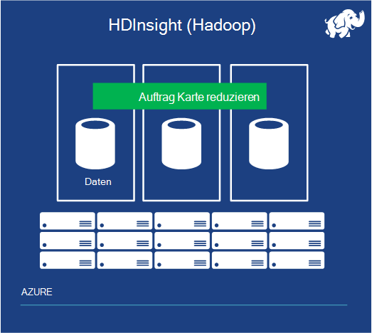   
 **Abbildung: HDInsight unterstützt Bulk-Verarbeitung großer Datenmengen**

Seit vielen Jahren der Großteil der Datenanalyse auf relationale Daten in einem Datawarehouse erstellt einen relationalen DBMS erfolgte. Diese Art von Business Analytics ist wichtig und werden für eine lange Zeit. Aber was ist, wenn die Daten analysieren ist so groß, dass relationale Datenbanken nur verarbeiten können? Und nehmen die Daten relational nicht? Es könnte sein, Server in einem Rechenzentrum oder Ereignisdaten von Sensoren oder etwas anderes protokolliert. In solchen Fällen müssen Sie so große Datenproblem. Sie benötigen einen anderen Ansatz.

Die dominierende Technologie für große Datenanalyse ist Hadoop. Ein Apache open Source-Projekt, diese Technologie verwendet die Hadoop verteilt Datei System bietet kann Entwickler MapReduce Arbeitsplätze, um die Daten zu analysieren. BIETET verteilt Daten auf mehreren Servern läuft Datenblöcke MapReduce Auftrag jeweils die großen Daten parallel verarbeitet werden.

HDInsight ist der Name der Azure Apache Hadoop-basierten Dienst. HDInsight kann Daten im Cluster gespeichert und verteilt auf mehrere VMs bietet. Außerdem wird die Logik eines MapReduce-Auftrags über die VMs verteilt. Nur lokalen Hadoop Daten verarbeitete lokal die Logik und Daten funktioniert auf gleiche VM- und Leistung. HDInsight kann auch Daten in Azure Storage Depot Luftsauerstoff-, speichern die Blobs verwendet.  Mit Luftsauerstoff können Sie Geld sparen, da HDInsight Cluster nicht löschen, aber weiterhin Ihre in der Cloud Daten.

HDinsight unterstützt andere Komponenten des Ökosystems Hadoop, einschließlich der Struktur und Schweine. Microsoft hat auch Komponenten, die Arbeit mit Daten HDInsight erleichtern mit herkömmlichen BI-Tools wie HiveODBC Adapter und Daten-Explorer, die mit Excel erstellt.

### High Performance Computing (Big Compute)

Eines der attraktivsten Verwendungsmöglichkeiten für eine Cloud werden high Performance computing (HPC) und weitere "Big berechnen" ausgeführt. Beispiele hierfür sind spezielle engineering entwickelte Industriestandard Message Passing Interface (MPI) als auch so genannte sehr parallel Applikationen solche finanzielle Modelle verwenden.

Das Wesen der großen berechnen wird Code auf vielen Computern gleichzeitig ausgeführt. Azure Maschinen daher mit vielen virtuellen gleichzeitig arbeiten parallel, ein Problem zu lösen. Dies erfordert einige Ressourcen und Applikationen DH planen, diese Instanzen ihrer Arbeit verteilt. Microsoft kostenlose HPC Pack und andere Compute Cluster möglich in Azure, Nutzen von Azure Compute und Infrastruktur auf Anfrage Big Compute Remoteanwendungen in der Cloud zu einer lokalen Compute-Cluster hinzufügen.

Azure bietet einen virtuellen Computer instanzgrößen mit unterschiedlichen Konfigurationen des CPU-Kerne, Speicher, Speicherkapazität und andere Merkmale anwendungsübergreifend Anforderungen. Die eingeführte A8 und A9 Instanzen Arbeit auch viele berechnen intensive Arbeitslasten und parallele MPI-Applikationen insbesondere weil sie hohe Geschwindigkeit, multicore-CPUs und viel Speicher. In bestimmten Konfigurationen nutzen die Instanzen eines niedriger Latenz und hohem Durchsatz Anwendung in der Cloud, die remote direct Memory Access (RDMA) Technologie für maximale Effizienz parallel MPI-Anwendung enthält.

Azure bietet auch Big Compute Entwickler und Partner umfassende Berechnungsfunktionen, Services, Architektur Auswahlmöglichkeiten und Entwicklungstools. Azure unterstützt benutzerdefinierte Big Compute-Workflows mit spezialisierte Workflows und Projekt und Muster, die eine auf Tausende Skalierung Planung berechnen Kerne.

## Medien

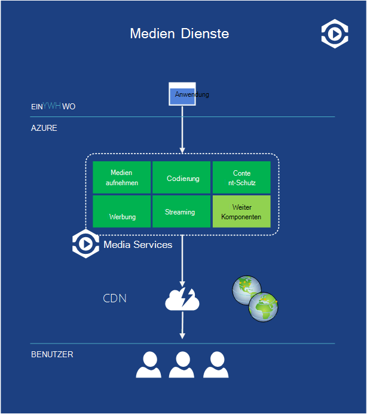   
 **Abbildung: Media Services ist eine Plattform für Programme, die Videos und andere Medien für Kunden auf der ganzen Welt bereitstellen.**

Video macht einen großen Teil des Internetverkehrs heute, und dieser Prozentsatz noch größere morgen. Aber einfach nicht Video im Web bereitstellen. Es gibt viele Variablen wie die Codierungsalgorithmus und die Auflösung des Bildschirms des Benutzers. Video tendenziell auch Bursts gefragt, wie eine Spitze Samstagabend, wenn viele Leute möchten sie online Film entscheiden.

Aufgrund der Beliebtheit ist es sicher, viele neue Applikationen mit Video erstellt. Aber alle die gleichen Probleme und jeweils auf eigene auftretenden überflüssig lösen müssen. Ein besserer Ansatz ist eine Plattform erstellen, gemeinsame Lösungen für viele verwenden. Mit dieser Plattform in der Cloud einige Vorteile. Allgemein verfügbar Bedarfsbasis werden und übernehmen auch die Variabilität bei Bedarf Videoprogrammen häufig konfrontiert.

Azure Media Services löst dieses Problem. Es bietet eine Reihe von Cloud-Komponenten, die für Personen erstellen und Ausführen von Programmen mit video und anderen Medien erleichtern.

Wie die Abbildung zeigt, bietet Media Services eine Reihe von Komponenten, die mit Videos und anderen Medien. Beispielsweise enthält ein Medium Component Video in Media Services hochladen (gespeichert ist in Azure-Blobs), ein Kodierung Komponente, verschiedene Video- und Audioformate unterstützt, eine Inhaltsschutz Komponente, Verwaltung digitaler Rechte, eine Komponente für einen Videostream anzeigen einfügen, Komponenten für streaming und mehr aufnehmen. Microsoft-Partner können Komponenten für die Plattform bereitstellen und Microsoft diese Komponenten und in ihrem Namen Rechnung.

Programme, die diese Plattform können auf Azure oder ausführen. Z. B. eine desktop-Anwendung Videoproduktion House Video Media Services hochladen Benutzer lassen möglicherweise dann verarbeiten verschieden. Alternativ kann ein Cloud-basierten Content Management-Dienst auf Windows Azure ausgeführte hängen Media Services verarbeiten und Verteilen von Videos. Wo es ausgeführt wird und was es tut wählt jede Anwendung Komponenten verwenden, muss über Rest Schnittstellen zugreifen.

Verteilt, was produziert, eine Anwendung mit Azure CDN anderen CDN oder Bits einfach direkt an Benutzer senden. Es wird jedoch mit Media Services erstellt Video kann von verschiedenen Client-Systemen, einschließlich Windows, Macintosh, HTML 5, iOS, Android, Windows Phone, Flash und Silverlight verwendet werden. Das Ziel ist zu modernen Applikationen zu vereinfachen.

**Referenzen**

Downloaden Sie eine visuelle Ansicht der Funktionsweise von Media Services, [Azure Media Services Poster][Azure Media Services Poster].

## Commerce

Der Anstieg der Software als Service schaffen wir Applikationen verändert. Er verändert auch wie Applikationen verkauft. Da eine SaaS-Anwendung in der Cloud befindet, ist es sinnvoll, die potenziellen Kunden online Solutions gesucht werden sollen. Und diese Änderung betrifft Daten Anwendung. Warum suchen sollte nicht Personen in die Cloud kommerziell verfügbaren Datasets? Microsoft behandelt sowohl diese Probleme in [Azure Marketplace](https://azure.microsoft.com/marketplace/).

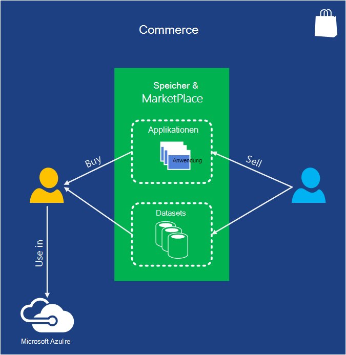   
 **Abbildung: Azure Marketplace und Azure-Speicher können Sie finden und kaufen Azure Applications und professionellen Datasets und als Teil der Azure-Anwendung verwenden.**

Der Unterschied ist, dass Marketplace außerhalb der Azure-Verwaltungsportal, aber Speicher innerhalb des Portals aus zugegriffen werden kann. Potenzielle Kunden können Azure Applications finden, die ihren Bedürfnissen entsprechen. Kunden finden kommerzielle Datasets, einschließlich demographischen Daten, Finanzdaten und geografische Daten. Wenn sie etwas finden, können sie es aus dem Kreditor direkt über die Webadressen Marketplace oder Shop oder Management-Portal zugreifen. Anträge können auch die Bing-Such-API über Marketplace Zugang zu den Ergebnissen von Suchvorgängen im Web.

**Commerce-Szenarien**

SendGrid ist eine Anwendung in Azure-Speicher, die Sie e-Mails senden können. Es bietet zusätzliche Funktionen wie Lieferung und Statistiken.  Sie können diese Anwendung und Dienstleistungen kaufen anstatt einer solchen Infrastruktur selbst erstellen.  

## Erste Schritte

Jetzt haben Sie das Gesamtbild, besteht der nächste Schritt Ihre erste Azure-Anwendung schreiben. Wählen Sie Ihre Sprache [entsprechende SDK zu erhalten](/downloads/), und gehen. Cloud computing ist der neue Standard - jetzt beginnen.

[Azure Media Services Poster]: http://azure.microsoft.com/documentation/infographics/media-services/
