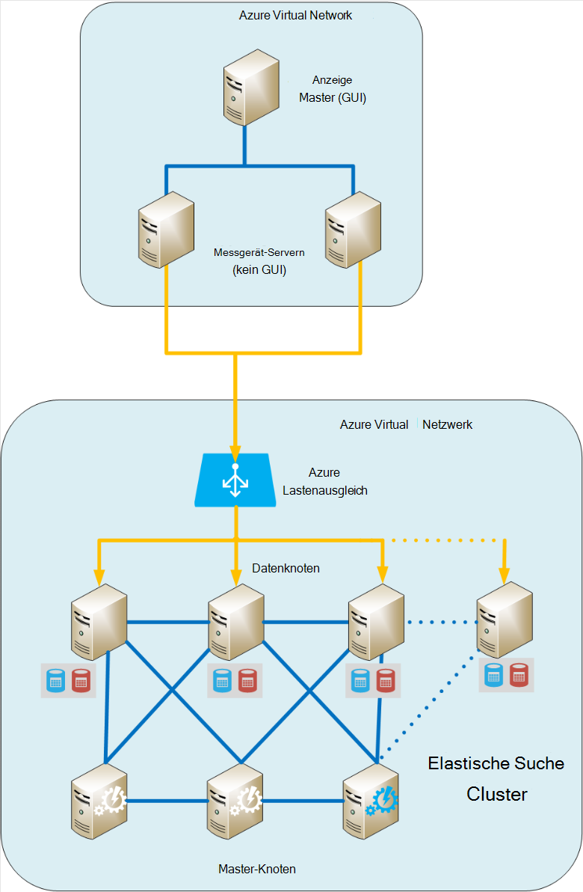
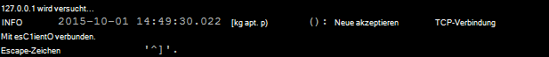
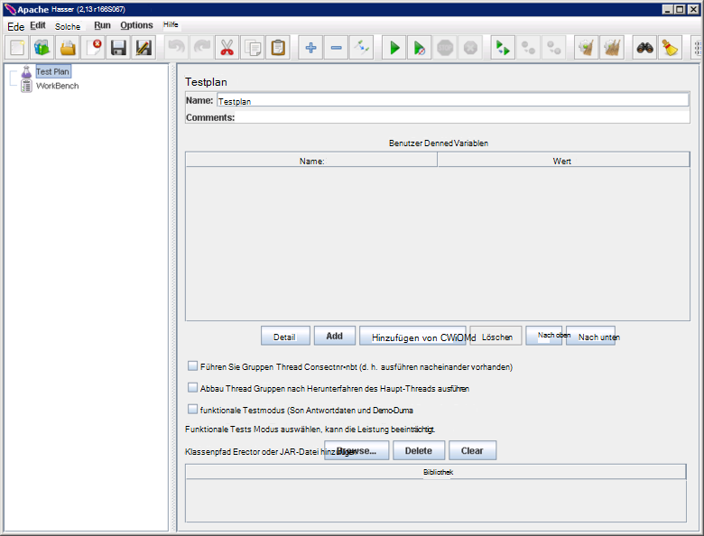
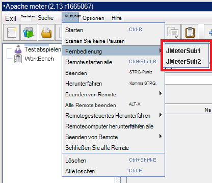
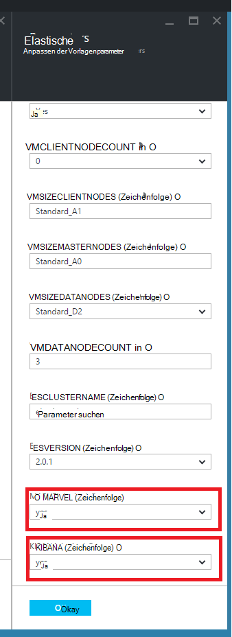
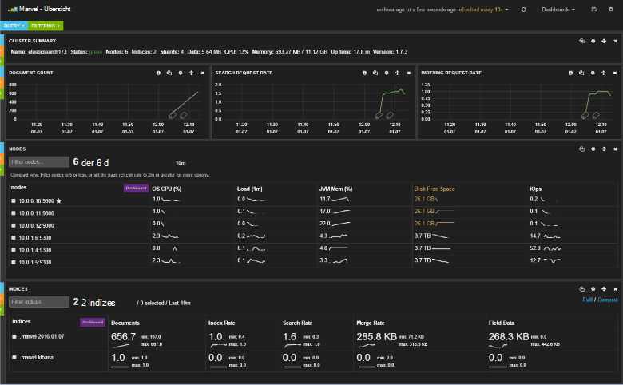
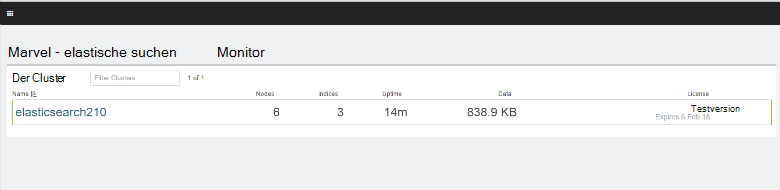
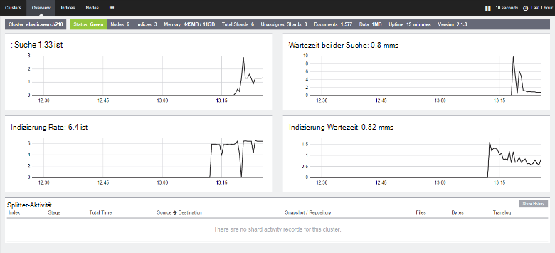

<properties
   pageTitle="Erstellen einer Umgebung-Leistungstests für Elasticsearch | Microsoft Azure"
   description="Zum Einrichten einer Umgebung für das Testen der Leistung eines Clusters Elasticsearch."
   services=""
   documentationCenter="na"
   authors="dragon119"
   manager="bennage"
   editor=""
   tags=""/>

<tags
   ms.service="guidance"
   ms.devlang="na"
   ms.topic="article"
   ms.tgt_pltfrm="na"
   ms.workload="na"
   ms.date="09/22/2016"
   ms.author="masashin"/>
   
# <a name="creating-a-performance-testing-environment-for-elasticsearch-on-azure"></a>Erstellen einer Umgebung-Leistungstests für Elasticsearch auf Azure

[AZURE.INCLUDE [pnp-header](../../includes/guidance-pnp-header-include.md)]

Dieser Artikel ist [Teil einer Serie](guidance-elasticsearch.md). 

Dieses Dokument beschreibt das Einrichten einer Umgebung für das Testen der Leistung eines Clusters Elasticsearch. Diese Konfiguration wurde zur Aufnahme und Abfrage Arbeitslasten, Leistungstest unter [Tuning Einnahme Datenverarbeitung für Elasticsearch in Azure][].

Performance-Testverfahren verwendet [Apache JMeter](http://jmeter.apache.org/)mit dem [Standardsatz](http://jmeter-plugins.org/wiki/StandardSet/) Plugins installiert in einer Master/Slave-Konfiguration mit dedizierten VMs (nicht Teil des Clusters Elasticsearch) speziell dafür konfiguriert. 

[PerfMon-Server-Agent](http://jmeter-plugins.org/wiki/PerfMonAgent/) wurde auf jedem Knoten Elasticsearch installiert. Die folgenden Abschnitte enthalten eine Anleitung zur Wiederherstellung der Umgebung können eigene Leistungstests mit JMeter durchzuführen. Diese Anleitung setzt voraus, einen Elasticsearch Cluster mit einer Azure virtuelles Netzwerk verbunden bereits erstellt haben. 

Beachten Sie, dass wie Azure VMs mit einer Azure-Ressourcengruppe verwaltet auch die Umgebung ausgeführt wird.

[Marvel](https://www.elastic.co/products/marvel) wurde installiert und konfiguriert die interne Aspekte der Elasticsearch Cluster überwacht und analysiert leichter. Wenn die Statistiken JMeter eine Spitze oder durch Leistung zeigte, unschätzbarem Informationen über Marvel zum ermitteln die Ursache von Fluktuationen Wert.

Die folgende Abbildung zeigt die Struktur des gesamten Systems. 



Beachten Sie folgende Punkte:

- JMeter Master VM wird Windows Server um die GUI-Umgebung für die Konsole JMeter bereitzustellen. JMeter Master-VM bietet GUI ( *Jmeter* Anwendung) ermöglicht einen Tester Tests erstellen, Tests ausführen und die Ergebnisse visualisieren. Diese VM koordiniert mit dem Server JMeter VMs, die tatsächlich die Anfragen, die die Tests bilden.

- JMeter untergeordnete VMs Ubuntu Server (Linux) ausführen, besteht keine Notwendigkeit GUI für die VMs. JMeter Server virtueller Computer ausgeführt JMeter-Serversoftware ( *Jmeter Server* Application) für Anfragen an den Elasticsearch-Cluster.

- Dedizierte Clientknoten wurden zwar dedizierte master-Knoten nicht verwendet.

- Die Anzahl der Datenknoten im Cluster variieren je nach Szenario getestet.

- Alle Knoten im Cluster Elasticsearch führen Marvel Leistung zur Laufzeit zu und JMeter Server-Agent zum Erfassen von Daten für eine spätere Analyse.

- Elasticsearch 2.0.0 testen und später einen Datenknoten Kibana. Dies ist von der Version auf Elasticsearch 2.0.0 Marvel erforderlich.

## <a name="creating-an-azure-resource-group-for-the-virtual-machines"></a>Eine Azure-Ressourcengruppe für den virtuellen Computer erstellen

JMeter Master muss direkt an jeder Knoten im Cluster Elasticsearch Daten zu verbinden. Ist die JMeter VNet von Elasticsearch Cluster VNet bedeutet dann jeden Elasticsearch Knoten mit einer öffentlichen IP-Adresse konfigurieren. Wenn dies ein Problem mit der Konfiguration der Elasticsearch, implementieren JMeter VMs in demselben VNet Elasticsearch Cluster mit derselben Ressourcengruppe, können Sie in diesem Fall dieses ersten Verfahren weglassen.

Zuerst [Erstellen Sie eine Ressourcengruppe](../resource-group-template-deploy-portal.md). Dieses Dokument wird vorausgesetzt, dass der Ressourcengruppe *JMeterPerformanceTest*heißt. Verwenden Sie JMeter VMs in demselben VNet Elasticsearch Cluster ausgeführt werden soll, derselben Ressourcengruppe, anstatt einen neuen Cluster.

## <a name="creating-the-jmeter-master-virtual-machine"></a>JMeter master virtuellen Computer erstellen

Nächsten [Erstellen einer Windows-VM](../virtual-machines/virtual-machines-windows-hero-tutorial.md) mit *Windows Server 2008 R2 SP1* -Abbild.  Wir empfehlen eine VM mit ausreichend Kerne Speicher Leistungstests ausführen auswählen. Im Idealfall wird ein Computer mit mindestens 2 Kernen 3,5 GB RAM (A2 Standard oder größer).

<!-- TODO add info on why disabling diagnostics is positive --> 

Wir empfehlen die Diagnose deaktivieren. Wenn die VM im Portal erstellen, geschieht dies auf den *Einstellungen* im Abschnitt *Überwachung* unter *Diagnose*. Lassen Sie die Einstellungen auf ihre Standardwerte.

Stellen Sie sicher, dass die VM und die zugeordneten Ressourcen durch [Untersuchen der Ressourcengruppe](../azure-portal/resource-group-portal.md#manage-resource-groups) im Portal erfolgreich erstellt wurde. Die aufgelisteten Ressourcen sollte eine VM eine Netzwerksicherheitsgruppe und eine öffentliche IP-Adresse mit dem gleichen Namen und Netzwerkkonto Schnittstelle und Speicher mit Namen, die VM bestehen.

## <a name="creating-the-jmeter-subordinate-virtual-machines"></a>JMeter untergeordnete virtuelle Computer erstellen

Jetzt [Erstellen Sie eine Linux VM](../virtual-machines/virtual-machines-linux-quick-create-portal.md) *Ubuntu Server 14.04 LTS* Bild.  Wählen Sie mit der JMeter master-VM VM mit ausreichend Kerne Speicher Leistungstests ausführen aus. Im Idealfall wird ein Computer mit mindestens 2 Kernen und mindestens 3,5 GB RAM (Standard A2 oder größer).

Wieder wird empfohlen, die Diagnose deaktivieren.

Sie können beliebig viele untergeordnete VMs wie gewünscht erstellen. 

## <a name="installing-jmeter-server-on-the-jmeter-subordinate-vms"></a>JMeter Installation JMeter untergeordnete VMs

JMeter untergeordnete VMs Linux laufen und standardmäßig keine Verbindung zu ihnen hierfür eine Remotedesktop-Verbindung (RDP). Stattdessen können Sie für jede VM [kitten ein Befehlszeilenfenster Öffnen verwenden](../virtual-machines/virtual-machines-linux-mac-create-ssh-keys.md) .

Nachdem Sie einen untergeordneten VMs verbunden sind, verwenden wir Bash, JMeter einrichten.

Zuerst installieren Sie Java Runtime Environment benötigt JMeter.

```bash
sudo add-apt-repository ppa:webupd8team/java
sudo apt-get update
sudo apt-get install oracle-java8-installer
```

Jetzt herunterladen Sie JMeter als Zip-Datei verpackt.

```bash
wget http://apache.mirror.anlx.net/jmeter/binaries/apache-jmeter-2.13.zip
```

Installationsbefehl extrahieren und dann die JMeter Software erweitern. Die Software wird auf einem **Apache-Jmeter-2,13**-Ordner kopiert.

```bash
sudo apt-get install unzip
unzip apache-jmeter-2.13.zip
```

Ändern in das Verzeichnis *Bin* mit ausführbaren Dateien JMeter und *Jmeter Server* und *Jmeter* Programme ausführbar machen.

```bash
cd apache-jmeter-2.13/bin
chmod u+x jmeter-server
chmod u+x jmeter
```

Jetzt müssen wir die Datei `jmeter.properties` im aktuellen Ordner (Verwenden der Text-Editor die mit, wie *vi* oder *Vim vertraut*) befindet. Suchen Sie die folgenden Zeilen:

```yaml
...
client.rmi.localport=0
...
server.rmi.localport=4000
...
```

Kommentar (Entfernen Sie den führenden \#Zeichen) diese Zeilen ändern, wie unten dargestellt, und speichern Sie die Datei und schließen Sie den Editor:

```yaml
...
client.rmi.localport=4441
...
server.rmi.localport=4440
```

Führen Sie nun folgende Befehle Port 4441 eingehender TCP-Datenverkehr öffnen (Dies ist der Port nur *Jmeter Server* zum Abhören konfiguriert haben):

```bash
sudo iptables -A INPUT -m state --state NEW -m tcp -p tcp --dport 4441 -j ACCEPT
```

Downloaden Sie die Zip-Datei mit den Standardsteuerelementen Plugins für JMeter (diese Plugins bieten Leistungsindikatoren) und extrahieren Sie die Datei in den **Apache-Jmeter-2,13** -Ordner. Entpacken die Datei an diesem Speicherort platziert Plug-Ins im richtigen Ordner.

Wenn Sie aufgefordert werden, die Lizenzdatei ersetzen Typ A (für alle):

```bash
wget http://jmeter-plugins.org/downloads/file/JMeterPlugins-Standard-1.3.0.zip
unzip JMeterPlugins-Standard-1.3.0.zip
```

Mit `nohup` , JMeter Server im Hintergrund zu starten. Es sollte eine Prozess-ID und eine Meldung hat ein Remoteobjekt und Befehle beginnen.  Führen Sie den folgenden Befehl im Verzeichnis ~/apache-jmeter-2.13/bin. 

```bash
nohup jmeter-server &
```

> [AZURE.NOTE]Ist die VM Herunterfahren wird das Serverprogramm JMeter beendet. Sie müssen die VM und erneut starten. Sie können auch das System den Befehl *Jmeter Server* beim Start automatisch ausgeführt durch Hinzufügen der folgenden Befehle, um die `/etc/rc.local` Datei (Befehl *exit 0* ):

```bash
sudo -u <username> bash << eoc
cd /home/<username>/apache-jmeter-2.13/bin
nohup ./jmeter-server &
eoc
```

Ersetzen Sie `<username>` mit Ihrem Benutzernamen.

Es ist sinnvoll, um das Terminalfenster zu halten, damit den Fortschritt des JMeter Servers beim Testen wird überwachen.

Sie müssen diese Schritte für jede untergeordnete VM JMeter wiederholen.

## <a name="installing-the-jmeter-server-agent-on-the-elasticsearch-nodes"></a>Installieren der JMeter Server-Agent auf den Elasticsearch-Knoten

Dieses Verfahren nimmt haben Sie Zugriff auf die Elasticsearch Knoten. Wenn Sie den Cluster mithilfe der Ressourcen-Manager-Vorlage erstellt haben, können Sie für jeden Knoten durch VM im Feld Gehe zu verbinden, wie in Abschnitt Topologie Elasticsearch [Elasticsearch in Azure ausgeführt](guidance-elasticsearch-running-on-azure.md). Sie können mit kitten sowie im Feld Gehe zu verbinden. 

Dort können Sie den Befehl *ssh* auf jedem Knoten im Cluster Elasticsearch anmelden.

Melden Sie sich einer der Elasticsearch-Knoten als Administrator an.  Befehlszeile Bash Geben Sie die folgenden Befehle zum Erstellen eines Ordners zum Speichern der JMeter Server-Agent und in diesen Ordner verschieben:

```bash
mkdir server-agent
cd server-agent
```

Führen Sie folgende Befehle den Befehl *Entpacken* installieren (falls nicht bereits installiert), herunterladen Sie JMeter Server-Agent-Software und Entpacken:

```bash
sudo apt-get install unzip
wget http://jmeter-plugins.org/downloads/file/ServerAgent-2.2.1.zip
unzip ServerAgent-2.2.1.zip
```
 
Führen Sie den folgenden Befehl zum Konfigurieren der Firewalls und TCP-Datenverkehr über Port 4444 aktivieren (Dies ist der Port, der JMeter Server-Agent verwendet):

```bash
sudo iptables -A INPUT -m state --state NEW -m tcp -p tcp --dport 4444 -j ACCEPT
```

Führen Sie den folgenden Befehl JMeter Server im Hintergrund starten:

```bash
nohup ./startAgent.sh &
```

JMeter Server-Agent sollte mit geklickt wurde, und Port 4444 überwacht.  Drücken Sie die EINGABETASTE, erhalten eine Befehlszeile und führen Sie den folgenden Befehl.

```bash
telnet <nodename> 4444
```

Ersetzen Sie `<nodename>` mit dem Namen der Knoten. (Suchen Sie den Namen der Knoten mit der `hostname` Befehl.) Dieser Befehl öffnet eine Telnet-Verbindung zum Port 4444 auf dem lokalen Computer. Dabei können Sie überprüfen, dass der JMeter Server-Agent ausgeführt wird.

Wenn der JMeter Server-Agent nicht ausgeführt wird, erhalten Sie die Antwort 

`*telnet: Unable to connect to remote host: Connection refused*.`

Wenn der JMeter Server-Agent ausgeführt wird und Port 4444 ordnungsgemäß konfiguriert wurde, erhalten Sie folgende Antwort:



> [AZURE.NOTE] Die Telnet-Sitzung bietet keine irgendwelche Fragen, nachdem die Verbindung hergestellt wurde.

Geben Sie den folgenden Befehl in der Telnet-Sitzung:

``` 
test
```

JMeter Server-Agent konfiguriert und korrekt überwacht, es sollte angeben, dass der Befehl empfangen Nachricht *Ja*beantworten.

> [AZURE.NOTE]Sie können in anderen Befehlen zu Leistungsüberwachungsdaten eingeben. Der Befehl `metric-single:cpu:idle` Geben Sie den aktuellen Anteil der CPU im Leerlauf (Dies ist ein Snapshot) ist. Eine vollständige Liste von Befehlen finden Sie auf der [Server-Agent PerfMon](http://jmeter-plugins.org/wiki/PerfMonAgent/) . : Nach Aufruf Perfmon Server Agent. >>

Geben Sie den folgenden Befehl beendet die Sitzung und die Bash-Befehlszeile in der Telnet-Sitzung:

``` 
exit
```

> [AZURE.NOTE]Wie mit dem JMeter untergeordnete VMs, wenn Sie sich abmelden oder wenn diese Computer heruntergefahren und neu gestartet JMeter Server-Agent müssen mit manuell neu gestartet werden die `startAgent.sh` Befehl. Wenn JMeter Server-Agent automatisch gestartet werden soll, fügen Sie den folgenden Befehl am Ende der `/etc/rc.local` Datei, bevor Sie den Befehl *exit 0* . 
> Ersetzen Sie `<username>` mit Ihrem Benutzernamen:

```bash
sudo -u <username> bash << eoc
cd /home/<username>/server-agent
nohup ./startAgent.sh &
eoc
```

Sie können jetzt entweder der gesamte Vorgang für alle Knoten im Cluster Elasticsearch wiederholen, oder Sie können die `scp` Befehl zum Kopieren der Server-Agent-Ordner und Inhalt für alle anderen Knoten und Verwendung der `ssh` Befehl JMeter Server-Agent starten, wie unten dargestellt. e ersetzen `<username>` mit Ihrem Benutzernamen und `<nodename>` mit dem Namen des Knotens, zu kopieren und die Software (Sie möglicherweise aufgefordert, Ihr Kennwort einzugeben wie jeder Befehl) werden soll:

```bash
scp -r \~/server-agent <username>@<nodename>:\~
ssh <nodename> sudo iptables -A INPUT -m state --state NEW -m tcp -p tcp --dport 4444 -j ACCEPT
ssh <nodename> -n -f 'nohup \~/server-agent/startAgent.sh'
```

## <a name="installing-and-configuring-jmeter-on-the-jmeter-master-vm"></a>Installieren und Konfigurieren von JMeter auf JMeter master VM

Klicken Sie im Azure-Portal auf **Ressourcengruppen**. Klicken Sie auf die Ressourcengruppe, JMeter Master- und untergeordnete VMs Blatt **Ressourcengruppen** .  Klicken Sie auf **master VM JMeter**Blatt **Ressourcengruppe** . **Klicken Sie auf Blatt virtuelle Computer auf der Symbolleiste.** Öffnen Sie die RDP-Datei nach Aufforderung durch den Web-Browser. Windows erstellt eine Remotedesktopverbindung die VM.  Geben Sie den Benutzernamen und das Kennwort für den virtuellen Computer, wenn Sie aufgefordert werden.

Wechseln Sie auf dem virtuellen Computer mit Internet Explorer zur Seite [Java für Windows herunterladen](http://www.java.com/en/download/ie_manual.jsp) . Anleitung zum Herunterladen und Ausführen von Java-Installationsprogramm.

In einem Webbrowser [Herunterladen Apache JMeter](http://jmeter.apache.org/download_jmeter.cgi) Seite, und Laden Sie die ZIP-Datei mit dem neuesten Binary. Speichern Sie Zip an einem geeigneten Speicherort auf Ihrem virtuellen Computer.

Der [Benutzerdefinierte JMeter Plugins](http://jmeter-plugins.org/) Website und herunterladen Sie Standard Set Plug-Ins. Speichern Sie Zip in den Ordner JMeter Download aus dem vorherigen Schritt

Gehen Sie in Windows Explorer zu dem Ordner mit den Apache-Jmeter -*Xxx* Zip-Datei, wobei *Xxx* die aktuelle Version von JMeter ist. Extrahieren Sie die Dateien in den aktuellen Ordner.

Extrahieren Sie die Dateien in den JMeterPlugins-Standard -*Yyy*ZIP-Datei, wobei *Yyy* die aktuelle Version des Plug-Ins in der Apache steht-Jmeter -*Xxx* -Ordner. Dadurch wird die Plugins in den richtigen Ordner für JMeter hinzugefügt. Sie können problemlos Lib Ordner zusammenführen und Lizenz und Readme-Dateien überschreiben, wenn Sie aufgefordert werden.

Rufen Sie das Apache-Jmeter -*Xxx*sich Ordner und Bearbeiten der jmeter.properties-Editor.  In der `jmeter.properties` Datei, Kapitel *Remotehosts und RMI-Konfiguration*gefunden.  Suchen Sie in diesem Abschnitt der Datei die folgende Zeile ein:

```yaml
remote_hosts=127.0.0.1
```

Ändern Sie diese Zeile, und Ersetzen Sie IP-Adresse 127.0.0.1 durch Kommas getrennte Liste von IP-Adressen oder Hostnamen für jedes JMeter untergeordneten Servern. Zum Beispiel:

```yaml
remote_hosts=JMeterSub1,JMeterSub2
```

Suchen Sie die folgende Zeile, und entfernen Sie die `#` Zeichen am Anfang der Zeile und den Wert client.rmi.localport Einstellungen ändern:

```yaml
#client.rmi.localport=0
```

An:

```yaml
client.rmi.localport=4440
```

Speichern Sie die Datei, und schließen Sie Editor. 

Klicken Sie in der Windows-Symbolleiste auf **Start**, klicken Sie auf **Verwaltung**und klicken Sie dann auf **Windows-Firewall mit erweiterter Sicherheit**.  In der Windows-Firewall mit erweiterter Sicherheit-Fenster in der linken Maustaste auf **Eingehende Regeln**und klicken Sie dann auf **Neue Regel**.

Wählen Sie im **Assistenten für neue eingehende Regel**auf der Seite **Typ** **Anschluss**, und klicken Sie dann auf **Weiter**.  Wählen Sie auf der Seite Protokolle und Ports **TCP**, wählen Sie im Feld Text **bestimmte lokale Ports**, `4440-4444`, und klicken Sie dann auf **Weiter**.  Wählen Sie auf der Seite Aktion **Verbindung zulassen**, und klicken Sie auf **Weiter**. Optionen Sie auf der Seite Profil alle aktiviert, und klicken Sie auf **Weiter**.  Auf der Seite Name den **Namen** Textfeld Geben Sie *JMeter*und klicken Sie dann auf **Fertig stellen**.  Schließen Sie die Windows-Firewall mit erweiterter Sicherheit.

In Windows Explorer in das Apache-Jmeter -*Xx*sich Ordner doppelklicken Sie auf *Jmeter* Windows-Batchdatei starten die GUI. Die Benutzeroberfläche sollte angezeigt werden:



Klicken Sie in der Menüleiste auf **Ausführen**, klicken Sie auf **Remote starten**und überprüfen Sie, ob die zwei untergeordnete JMeter Computer aufgeführt sind:



Sie sind jetzt mit Leistungstests beginnen.

## <a name="installing-and-configuring-marvel"></a>Installieren und Konfigurieren von Marvel

Elasticsearch Schnellstart Vorlage für Azure installieren und konfigurieren die entsprechende Version von Marvel automatisch MARVEL und KIBANA Parameter beim Erstellen des Clusters ("yes") auf true festlegen:



Wenn Sie hinzufügen Marvel zu einem vorhandenen Cluster Sie die Installation manuell ausführen müssen und der Prozess unterscheidet sich je nachdem, ob Sie Elasticsearch Version 1.7.x oder 2.x, wie im folgenden beschrieben.

### <a name="installing-marvel-with-elasticsearch-173-or-earlier"></a>Installieren von Marvel Elasticsearch 1,73 oder früher

Wenn Sie Elasticsearch 1.7.3 oder, führen Sie folgende Schritte *auf jedem Knoten* im Cluster:

- Melden Sie sich bei dem Knoten und dem Stammverzeichnis Elasticsearch verschieben.  Unter Linux normalerweise Basisverzeichnis ist `/usr/share/elasticsearch`.

-  Führen Sie den folgenden Befehl zum Herunterladen und Installieren des Marvel Plugins für Elasticsearch:

```bash
sudo bin/plugin -i elasticsearch/marvel/latest
```

- Beenden und Elasticsearch auf dem Knoten neu starten:

```bash
sudo service elasticsearch restart
```

- Überprüfen Marvel ordnungsgemäß installiert wurde, öffnen Sie einen Webbrowser und gehen Sie zu der URL `http://<server>:9200/_plugin/marvel`. Ersetzen Sie `<server>` mit dem Namen oder der IP-Adresse der Elasticsearch Server im Cluster.  Stellen Sie sicher, dass eine Seite ähnlich wie unten angezeigt:




### <a name="installing-marvel-with-elasticsearch-200-or-later"></a>Installieren von Marvel mit Elasticsearch 2.0.0 oder höher

Wenn Sie Elasticsearch 2.0.0 verwenden oder später folgende Tasks *auf jedem Knoten* im Cluster ausführen:

Melden Sie sich bei dem Knoten und Elasticsearch-Basisverzeichnis nach (in der Regel `/usr/share/elasticsearch`) führen Sie die folgenden Befehle herunterladen und Installieren des Marvel Plugins für Elasticsearch:

```bash
sudo bin/plugin install license
sudo bin/plugin install marvel-agent
```

Beenden und Elasticsearch auf dem Knoten neu starten:

```bash
sudo service elasticsearch restart
```

In der folgenden Prozedur ersetzen `<kibana-version>` 4.2.2 bei Verwendung Elasticsearch 2.0.0 oder Elasticsearch 2.0.1 oder 4.3.1 verwenden Elasticsearch 2.1.0 oder höher.  Ersetzen Sie `<marvel-version>` 2.0.0 bei Verwendung Elasticsearch 2.0.0 oder Elasticsearch 2.0.1 oder 2.1.0 verwenden Elasticsearch 2.1.0 oder höher.  Führen Sie folgende Aufgaben *auf einem Knoten* des Clusters:

Anmelden, um den Knoten, und extrahieren Sie das Paket herunterladen der entsprechenden Version von Kibana für Ihre Version von Elasticsearch von [Elasticsearch-Website herunterladen](https://www.elastic.co/downloads/past-releases):

```bash
wget https://download.elastic.co/kibana/kibana/kibana-<kibana-version>-linux-x64.tar.gz
tar xvzf kibana-<kibana-version>-linux-x64.tar.gz
```

Öffnen Sie Port 5601 Anfragen annehmen:

```bash
sudo iptables -A INPUT -m state --state NEW -m tcp -p tcp --dport 5601 -j ACCEPT
```

Wechseln Sie zum Ordner Kibana Config (`kibana-<kibana-version>-linux-x64/config`), Bearbeiten der `kibana.yml` Datei, und fügen Sie die folgende Zeile hinzu. Ersetzen Sie `<server>` mit dem Namen oder der IP-Adresse eines Servers im Cluster Elasticsearch:

```yaml
elasticsearch.url: "http://<server>:9200"
```

Wechseln Sie zum Ordner Bin Kibana (`kibana-<kibana-version>-linux-x64/bin`), und führen Sie folgenden Befehl Marvel Plugin in Kibana integrieren:

```bash
sudo ./kibana plugin --install elasticsearch/marvel/<marvel-version>
```

Kibana zu starten:

```bash
sudo nohup ./kibana &
```

Zum Überprüfen der Installations Marvel einen Webbrowser öffnen und den URL zur `http://<server>:5601/app/marvel`. Ersetzen Sie `<server>` mit dem Namen oder der IP-Adresse des Servers mit Kibana.

Stellen Sie sicher, dass eine Seite ähnlich wie unten angezeigt (der Name Ihres Clusters wird wahrscheinlich unterscheiden, die im Bild angezeigt).



Klicken Sie auf den Link zum Cluster entspricht (elasticsearch210 im Bild oben). Eine Seite ähnlich dem unten aufgeführten sollte angezeigt werden:




[Optimieren der Leistung von Daten Einnahme für Elasticsearch auf Azure]: guidance-elasticsearch-tuning-data-ingestion-performance.md  