<properties
   pageTitle="Bereitstellen von JMeter JUnit Sampler für Leistungstests Elasticsearch | Microsoft Azure"
   description="Wie JUnit Sampler und upload von Daten zu einem Elasticsearch Cluster."
   services=""
   documentationCenter="na"
   authors="dragon119"
   manager="bennage"
   editor=""
   tags=""/>

<tags
   ms.service="guidance"
   ms.devlang="na"
   ms.topic="article"
   ms.tgt_pltfrm="na"
   ms.workload="na"
   ms.date="09/22/2016"
   ms.author="masashin"/>
   
# Bereitstellen von JMeter JUnit Sampler für Leistungstests Elasticsearch

[AZURE.INCLUDE [pnp-header](../../includes/guidance-pnp-header-include.md)]

Dieser Artikel ist [Teil einer Serie](guidance-elasticsearch.md). 

Dieses Dokument beschreibt das Erstellen und verwenden, der erzeugen und Hochladen von Daten zu einem Cluster Elasticsearch als Teil eines Testplans JMeter JUnit Sampler. Dieser Ansatz bietet äußerst flexibel zum Laden von Tests, die große Mengen an Daten ohne je nach externen Dateien generieren können.

> [AZURE.NOTE] Mit diesem Ansatz zur Beurteilung [Tuning Daten Einnahme](guidance-elasticsearch-tuning-data-ingestion-performance.md) Leistung Elasticsearch beschriebenen Daten Einnahme Auslastungstests entstanden. Die Details des JUnit-Codes werden in diesem Dokument beschrieben.

Testen Ingestion-Leistung JUnit Code wurde entwickelt Eclipse (Mars) und Abhängigkeit mit Maven aufgelöst wurden. Die folgenden Prozeduren beschreiben die Schritt für Schritt Eclipse installieren, Konfigurieren von Maven, Erstellen eines JUnit und Bereitstellen dieser Test als Sampler JUnit-Anforderung in einem JMeter.

> [AZURE.NOTE] Ausführliche Informationen zu Struktur und Konfiguration der Umgebung finden Sie unter [Performance testing Rahmenbedingungen für Elasticsearch in Azure][].

## Installieren der erforderlichen Komponenten

Sie benötigen [Java Runtime Environment](http://www.java.com/en/download/ie_manual.jsp) auf Ihrem Entwicklungscomputer.
Sie müssen auch die [Eclipse-IDE für Java-Entwickler](https://www.eclipse.org/downloads/index.php?show_instructions=TRUE)installieren.

> [AZURE.NOTE] Bei Verwendung die master JMeter VM als Umgebung [Performance testing Rahmenbedingungen für Elasticsearch auf Azure][] beschrieben herunterladen Sie Windows 32-Bit-Version des Installers Eclipse

## Erstellen eines Testprojekts JUnit für Auslastungstests Elasticsearch

Starten Sie Eclipse-IDE zu, wenn er nicht bereits ausgeführt wird, und schließen Sie die Seite **Willkommen** .  Im Menü **Datei** auf und dann auf **Java-Projekt**.

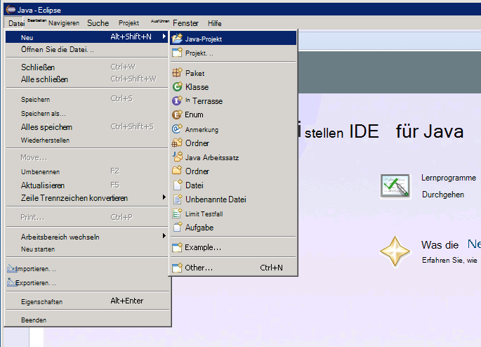

Geben Sie im Fenster **Neue Java-Projekt** einen Projektnamen ein, wählen Sie **Standard JRE**und klicken Sie dann auf **Fertig stellen**.

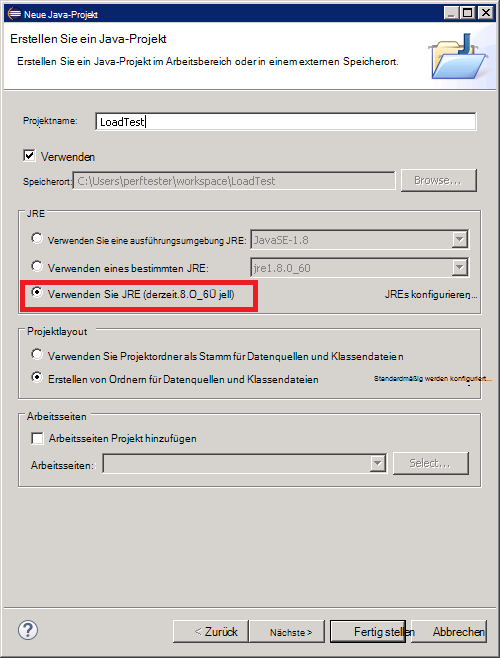

Klicken Sie im **Paket-Explorer** erweitern Sie nach dem Projekt benannt. Überprüfen Sie enthält einen Ordner mit dem Namen **Src** und einen Verweis auf die angegebene JRE.

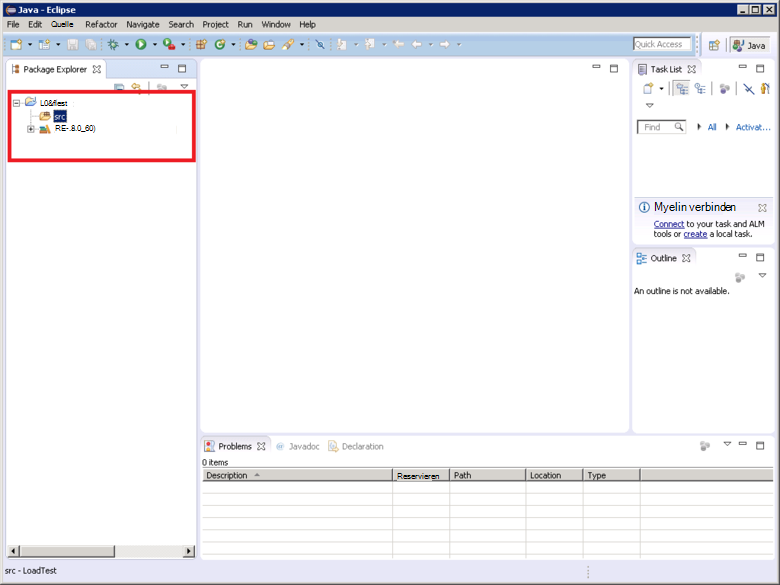

Maustaste Ordner **Src** , klicken Sie auf **neu**und dann auf **JUnit Test Case**.

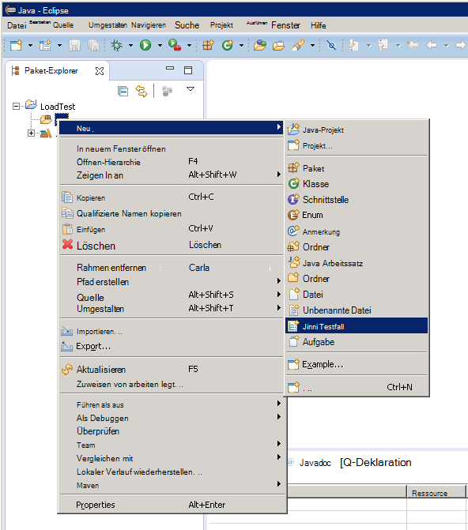

Im Fenster **Neuer Testfall JUnit** wählen Sie **neue Junit 4 Test**, geben Sie einen Namen für das Paket (Dies kann den Projektnamen identisch zwar gemäß der Konvention mit einem Kleinbuchstaben beginnen soll), einen Namen für die Klasse, und wählen Sie die Optionen, die für den Test erforderlichen Methodenstubs generiert. Das **getestete Klasse** leer, und klicken Sie dann auf **Fertig stellen**.

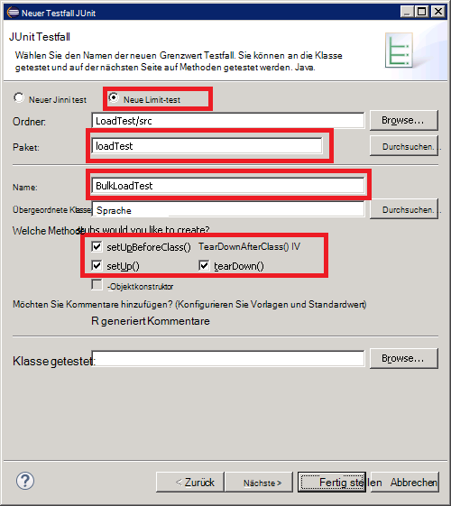

Wird das Dialogfeld **neue JUnit Testfall** die Option Buildpfad JUnit 4-Bibliothek hinzu, und klicken Sie auf **OK**. 

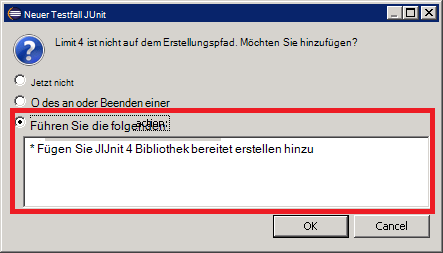

Überprüfen Sie das Codegerüst für JUnit-Test generiert und im Java-Editor-Fenster angezeigt.

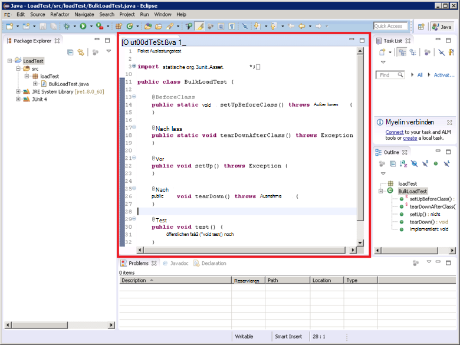

Im **Paket-Explorer**mit der rechten Maustaste des Knotens für das Projekt, klicken Sie auf **Konfigurieren**und klicken Sie auf **Maven-Projekt konvertieren**.

> [AZURE.NOTE]Maven können Sie externe Abhängigkeiten (z. B. Elasticsearch Java-Clientbibliotheken) verwalten, hängt ein Projekt.

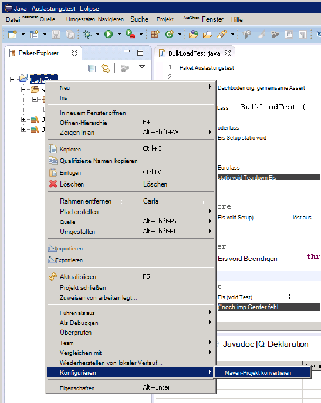

Aktivieren Sie im Dialogfeld **erstellen neue POM** in der Dropdownliste **Verpackung** **Glas**und klicken Sie dann auf **Fertig stellen**.

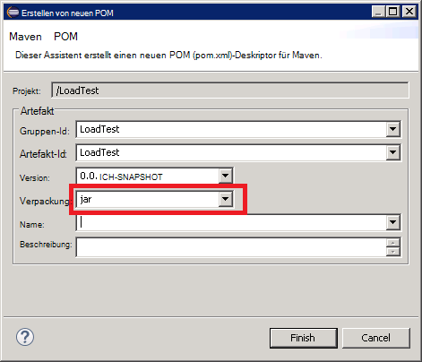

Im unten des Projekt (POM)-Modell-Editors kann die Warnung anzeigen "Erstellungspfad gibt Execution Environment J2SE 1.5. Gibt keine JRE im Workspace installiert, die vollständig kompatibel mit dieser Umgebung", je nachdem welche Version von Java auf dem Entwicklungscomputer installiert ist. Haben Sie eine Version von Java, die später als Version 1.5 Sie diese Warnung ignorieren können.

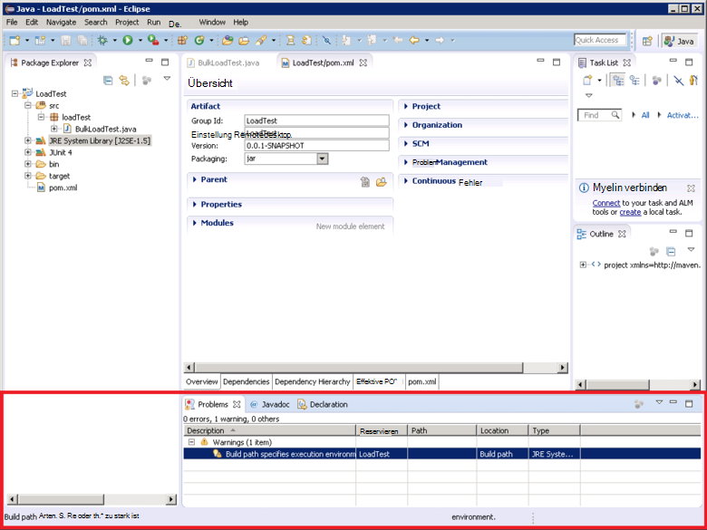

Im Editor POM erweitern Sie **Eigenschaften** zu, und klicken Sie auf **Erstellen**.

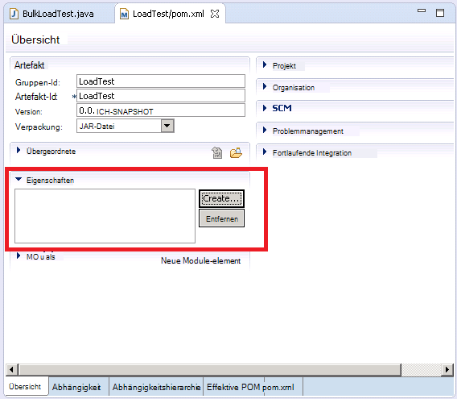

Klicken Sie im Dialogfeld **Hinzufügen** im Feld **Name** Geben Sie *es.version*Geben Sie in das Feld **Wert** *1.7.2*und klicken Sie auf **OK**. Dies ist die Version Elasticsearch Java-Clientbibliothek verwenden (diese Version möglicherweise in der Zukunft ersetzt und die Version als POM Eigenschaft definieren und verweisen auf diese Eigenschaft innerhalb des Projekts Version schnell geändert werden kann.)

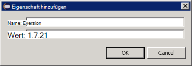

Klicken Sie auf der Basis des POM-Editors **Abhängigkeiten** und klicken Sie auf **Hinzufügen** neben der Liste der **Abhängigkeiten** .

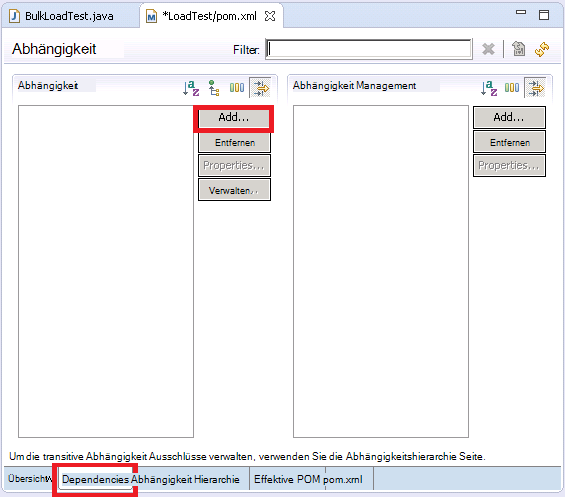

Geben Sie im Dialogfeld **Wählen Sie Abhängigkeit** im **Gruppen-Id** *org.elasticsearch*, geben Sie im Feld **Artefakt-Id** *Elasticsearch*im Feld **Version** * \${es.version}*, und klicken Sie dann auf **OK**. Informationen zu Java Elasticsearch-Clientbibliothek im online Maven zentralen Repository gespeichert und diese Konfiguration wird automatisch herunterladen der Bibliothek und die zugehörigen Dateien beim des Projekts.

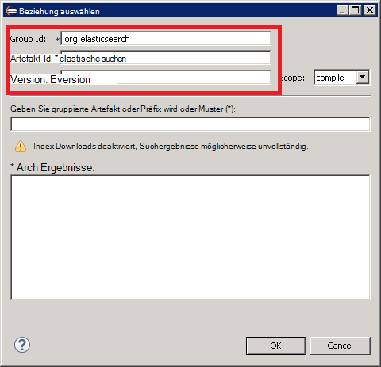

Klicken Sie im Menü **Datei** auf **Alles speichern**. Diese Aktion Speichern und erstellen Sie das Projekt Maven festgelegten Abhängigkeiten herunterladen. Überprüfen Sie die Maven Ordners im Paket-Explorer angezeigt wird. Erweitern Sie diesen Ordner, um die JAR-Dateien heruntergeladen haben, um die Clientbibliothek Elasticsearch Java unterstützt.

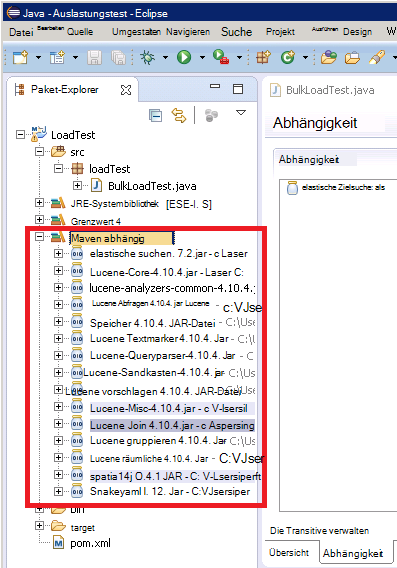

## Importieren von einem vorhandenen Testprojekt JUnit in Eclipse

Es wird vorausgesetzt, dass ein Maven Projekt heruntergeladen haben, die zuvor mit Eclipse erstellt wurde.

Starten Sie Eclipse-IDE. Klicken Sie im Menü **Datei** auf **Importieren**.

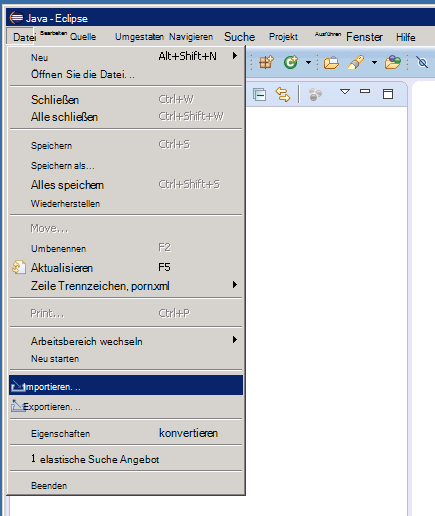

Im Fenster **auswählen** den **Maven** Ordner klicken Sie **vorhandene Maven**und klicken Sie auf **Weiter**.

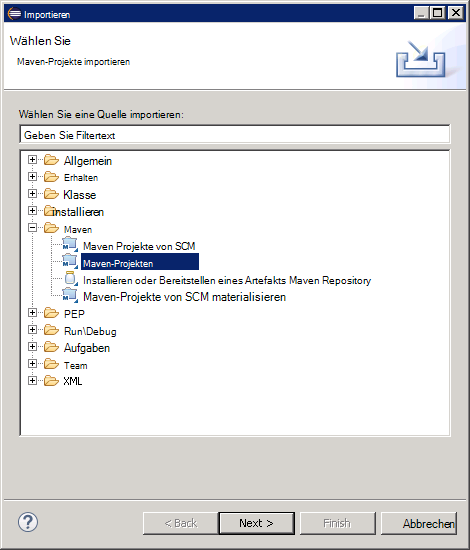

Geben Sie im Fenster **Maven Projekte** der Ordner mit Projekt (der Ordner mit der pom.xml-Datei), klicken Sie auf **Alle auswählen**und klicken Sie dann auf **Fertig stellen**.

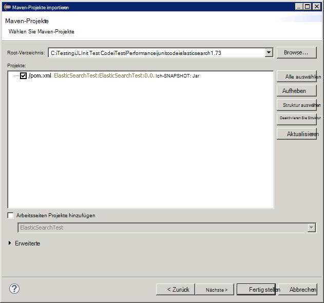

**Paket-Explorer** -Fenster erweitern Sie den Knoten für das Projekt. Stellen Sie sicher, dass das Projekt einen Ordner mit dem Namen **Src**enthält. Dieser Ordner enthält den Quellcode für den JUnit-Test. Das Projekt kompiliert und nach der Anleitung bereitgestellt.

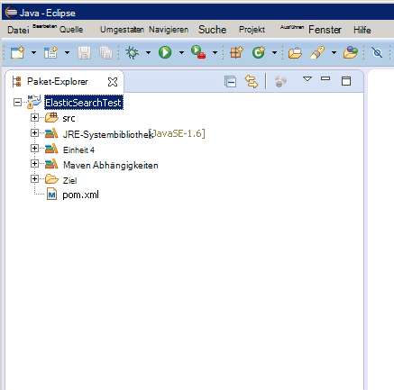

## Bereitstellen eines JUnit Tests auf JMeter

Dieses Verfahren wird vorausgesetzt, Sie haben ein Projekt mit dem Namen LoadTest Klasse JUnit-Test mit `BulkLoadTest.java` , die als einzelne Zeichenfolge an (Dies ist der Mechanismus, der JMeter erwartet)-Konstruktor übergebenen Parameter akzeptiert.

In Eclipse-IDE im **Paket-Explorer**mit der rechten Maustaste des Projektknoten und dann auf **Exportieren**.

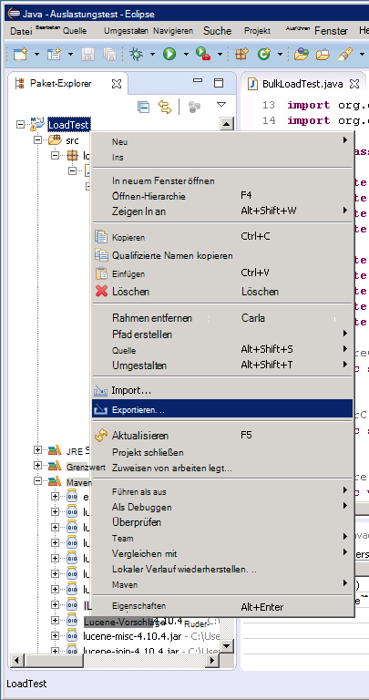

Knoten Sie im **Export-Assistenten**auf der Seite **Wählen** **Java** klicken Sie **JAR-Datei**und klicken Sie auf **Weiter**.

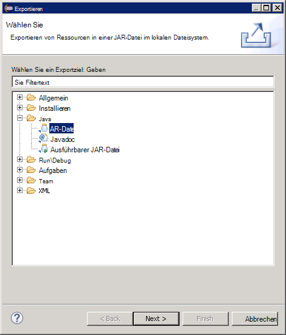

Erweitern Sie auf der Seite **JAR-Spezifikation** das **zu exportierende Ressourcen auswählen** das Projekt deaktivieren **Surround**und **pom.xml**deaktivieren. Im **JAR-Datei** einen Namen und Speicherort für die JAR-Datei (es sollte die Erweiterung .jar angegeben werden), und klicken Sie dann auf **Fertig stellen**.

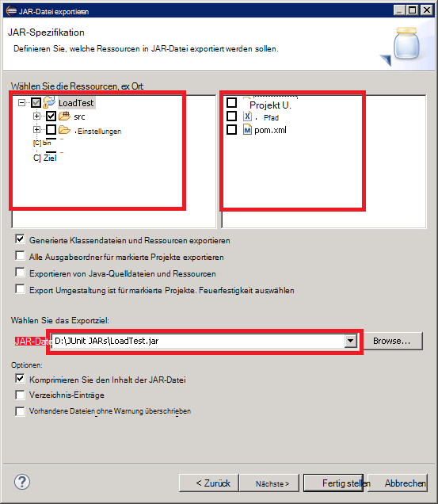

Windows Explorer kopieren Sie die JAR-Datei nur auf JMeter master JVM erstellt haben und speichern im Apache-Jmeter-2,13\\Lib\\Junit Ordner unterhalb des Ordners JMeter installiert (siehe Verfahren "JMeter master virtuellen Computer erstellen" beim Erstellen [einer Performance testing Umgebung für Elasticsearch auf Azure](guidance-elasticsearch-creating-performance-testing-environment.md) Weitere Informationen.)

Zurück zu Eclipse, erweitern Sie **Paket-Explorer** -Fenster und notieren Sie alle JAR-Dateien und ihren Positionen im Ordner Maven Abhängigkeiten des Projekts aufgeführt. Beachten Sie, dass die Dateien in der folgenden Abbildung variieren je nachdem, welche Version von Elasticsearch Sie verwenden:

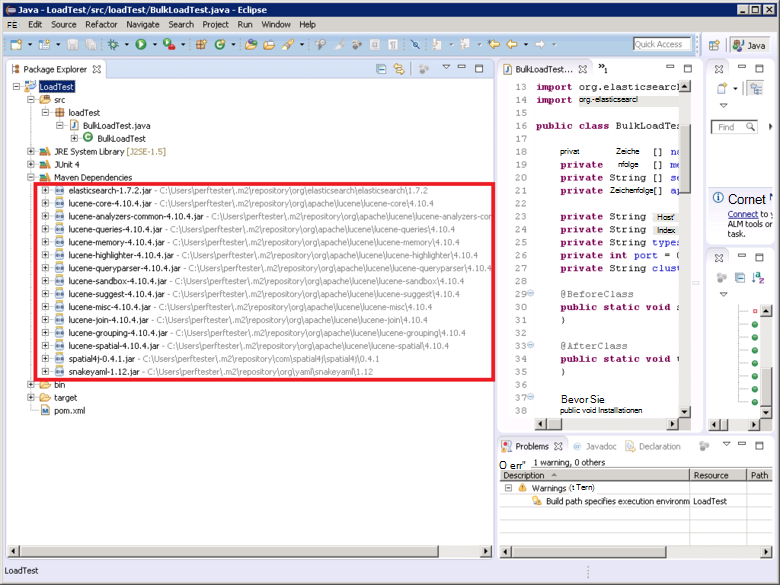

Windows Explorer kopieren jeder JAR-Datei im Ordner Maven von Apache-Jmeter-2,13 verwiesen\\Lib\\Junit JMeter master VM auf.

Wenn die Lib\\Junit Ordner bereits frühere Versionen dieser JAR-Dateien enthält und dann entfernen. Lassen Sie an möglicherweise JUnit-Test funktioniert nicht als Verweise auf die falschen Gläser aufgelöst werden konnte.

Beenden Sie auf dem Master JMeter VM JMeter läuft derzeit.  Starten Sie JMeter.  In JMeter Maustaste **Testplan**, klicken Sie auf **Hinzufügen**, klicken Sie auf **Threads (Benutzer)**und klicken Sie dann auf **Gruppe**.

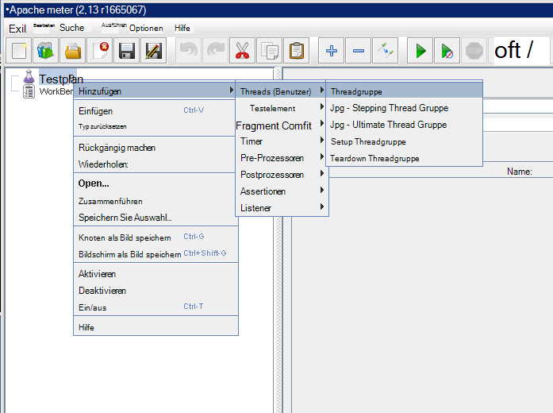

Unter dem Knoten **Testplan** **Threadgruppe**Maustaste, klicken Sie auf **Hinzufügen**, klicken Sie auf **Demo**und klicken Sie auf **JUnit anfordern**.

Wählen Sie auf der Seite **JUnit Anforderung** **Suchen JUnit4 Kommentare (statt 3 JUnit)**. Wählen Sie in der Dropdownliste **Klassenname** der Testklasse JUnit laden (wird im Format *aufgelistet &lt;Paket&gt;.&lt; Klasse&gt;*), in der **Test-Methode** Dropdown-Liste auf die JUnit Prüfverfahren (Dies ist die Methode, die dem Test zugeordnet wird und sollte mit markiert wurde der *@test* Anmerkung im Eclipse-Projekt), und geben Sie Werte an den Konstruktor im Feld **Beschriftung Konstruktor** übergeben werden. Die Angaben in der folgenden Abbildung sind nur Beispiele; der **Klassenname** * *Testmethode*und * *Konstruktor Beschriftung** wird wahrscheinlich von der angezeigten unterscheiden.

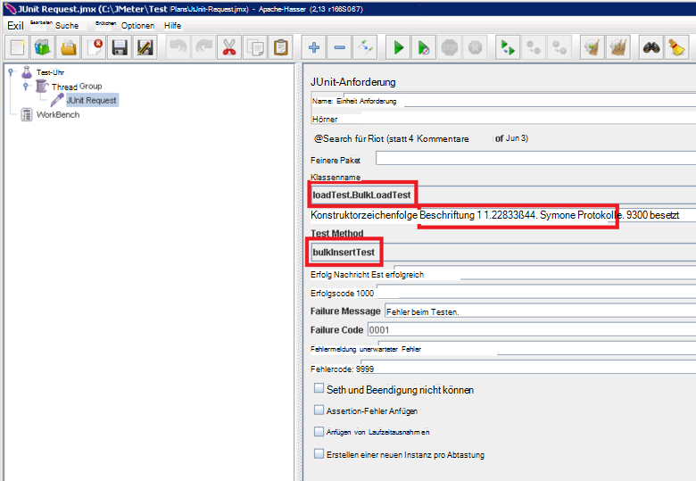

Die Klasse nicht in der Liste **Klassenname** angezeigt wird, wahrscheinlich bedeutet, dass die JAR-Datei nicht ordnungsgemäß ausgeführt oder wurde nicht in der Bibliothek platziert\\Junit Ordner oder einige der abhängigen Gläser fehlen der Lib\\Junit Ordner. In diesem Fall exportieren Sie das Projekt erneut in Eclipse und sicherstellen, dass **Src** -Ressource ausgewählt haben, kopieren Sie die JAR-Datei der lib\\Junit Ordner und stellen Sie sicher, dass alle abhängigen Gläser sortiert nach Maven Lib-Ordner kopiert haben.

Schließen Sie JMeter Es muss keine Testplan speichern.  Kopieren Sie die JAR-Datei mit JUnit-Testklasse, die Home&lt;Benutzername&gt;/apache-jmeter-2.13/lib/junit Ordner auf jedem untergeordneten VMs JMeter (*&lt;Benutzername&gt; * ist der Name der Administrator angegebenen Erstellung die VM, finden Sie im Verfahren "JMeter untergeordnete virtuelle Computer erstellen" beim Erstellen [einer Performance testing Umgebung für Elasticsearch auf Azure](guidance-elasticsearch-creating-performance-testing-environment.md) Weitere Informationen.)

Kopieren von JAR-Dateien erforderliche JUnit-Testklasse, die Home&lt;Benutzername&gt;/apache-jmeter-2.13/lib/junit Ordner auf jedem untergeordneten JMeter VMs. Müssen Sie zuerst alle älteren Versionen von JAR-Dateien aus diesem Ordner.

Sie können die `pscp` Dienstprogramm kopiert Dateien von einem windowscomputer auf Linux.

[Erstellen einer Umgebung-Leistungstests für Elasticsearch auf Azure]: guidance-elasticsearch-creating-performance-testing-environment.md
