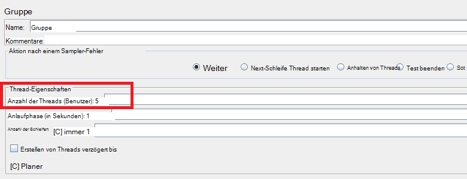
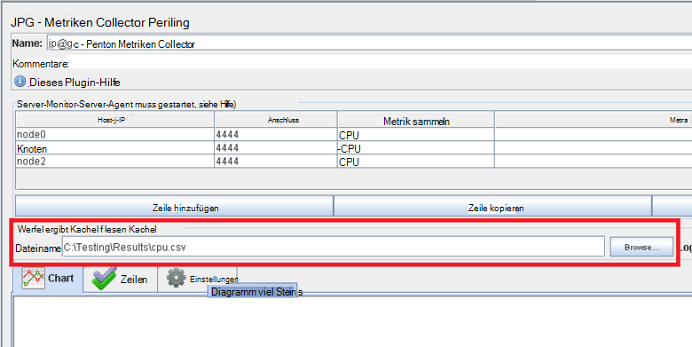
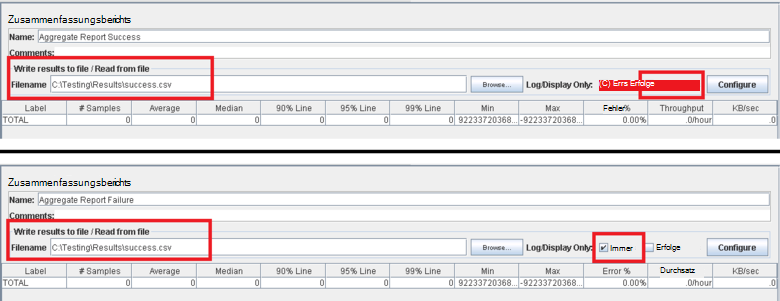
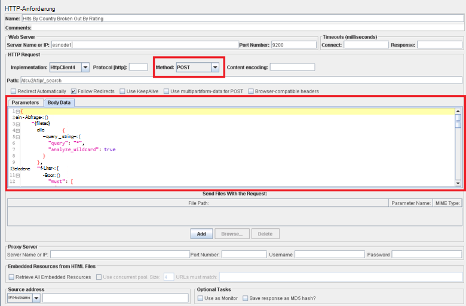

<properties
   pageTitle="Implementieren eines Testplans JMeter für Elasticsearch | Microsoft Azure"
   description="Wie führen Sie tests für Elasticsearch mit JMeter."
   services=""
   documentationCenter="na"
   authors="dragon119"
   manager="bennage"
   editor=""
   tags=""/>

<tags
   ms.service="guidance"
   ms.devlang="na"
   ms.topic="article"
   ms.tgt_pltfrm="na"
   ms.workload="na"
   ms.date="09/22/2016"
   ms.author="masashin" />
   
# <a name="implementing-a-jmeter-test-plan-for-elasticsearch"></a>Implementieren eines Testplans JMeter für Elasticsearch

[AZURE.INCLUDE [pnp-header](../../includes/guidance-pnp-header-include.md)]

Dieser Artikel ist [Teil einer Serie](guidance-elasticsearch.md). 

Gegen Elasticsearch Performance-Tests mit Testplänen JMeter mit Java-Code als JUnit Test für Aufgaben wie das Hochladen von Daten in den Cluster aufgenommen wurden. Testpläne und JUnit Code beschriebenen [Tuning Einnahme Datenverarbeitung für Elasticsearch auf Azure][]und [Tuning Datenaggregation und abfrageleistung für Elasticsearch in Azure][].

Der Zweck dieses Dokuments ist die Erfahrung Zusammenfassen von erstellen und diese mit Testplänen. [Bewährte JMeter](http://jmeter.apache.org/usermanual/best-practices.html) auf die Seite der Apache JMeter Website enthält weitere allgemeine Hinweise JMeter nutzen.

## <a name="implementing-a-jmeter-test-plan"></a>Implementieren eines Testplans JMeter

Die folgende Liste enthält die Elemente sollten Sie beim Erstellen eines Testplans JMeter:

- Erstellen einer Gruppe separater Thread für jeden Test ausführen möchten. Ein Test kann mehrere Schritte Steuerungen, Zeitgeber vor und nach der Prozessoren Sampler und Listener enthalten.

- Vermeiden Sie zu viele Threads in einer Gruppe von Threads. Eine große Anzahl von Threads wird JMeter nicht mit"aus" Ausnahmen. Es ist besser auf weiteren JMeter untergeordneten Servern jedes mit weniger Threads versuchen, eine große Anzahl von Threads auf einem JMeter Server ausgeführt.



- Zur Bewertung der Leistung des Clusters in den Testplan integrieren Sie [Perfmon Metriken Collector](http://jmeter-plugins.org/wiki/PerfMon/) Plugin. Dies ist ein JMeter-Listener, der als standard JMeter-Plug-Ins verfügbar ist. Speichern Sie die unformatierten Leistungsdaten auf einen Satz von Dateien in kommagetrennten Werten (CSV) und verarbeiten Sie, wenn der Test abgeschlossen ist. Dies ist effizienter und stellt entlasten JMeter nicht zum Verarbeiten der Daten wie bei seiner Aufnahme. 



Ein Tool können solche Excel importieren und generiert einen Bereich von Diagrammen für analytische Zwecke.

Berücksichtigen Sie die folgenden Informationen:

- CPU-Auslastung für jeden Knoten im Cluster Elasticsearch.

- Die Anzahl der gelesenen Bytes pro Sekunde von der Festplatte jedes Knotens.

- Wenn möglich Wartezeit, der Prozentsatz der CPU-Zeit für e/a auf jedem Knoten ausgeführt werden. Dies ist nicht immer möglich, dass Windows-VMs, aber für Linux können eine benutzerdefinierte Metrik (EXEC-Metrisch), die den folgenden Shellbefehl rufen Sie *Vmstat* auf einem Knoten ausgeführt wird:

```Shell
sh:-c:vmstat 1 5 | awk 'BEGIN { line=0;total=0;}{line=line+1;if(line&gt;1){total=total+\$16;}}END{print total/4}'
```

Feld 16 in der Ausgabe von *Vmstat* enthält die CPU-Wartezeit für e/a. Weitere Informationen zur Funktionsweise dieser Anweisung finden Sie unter [Befehl Vmstat](http://linuxcommand.org/man_pages/vmstat8.html).

- Die Anzahl der Bytes gesendet und empfangen über das Netzwerk auf jeden Knoten.

- Verwenden Sie separate Zusammenfassungsberichts Listener Leistung und Häufigkeit der erfolgreiche und fehlgeschlagene Vorgänge aufzeichnen. Datenerfassung Erfolgs- und anderen Dateien.



- Behalten Sie jeweils Test JMeter möglichst direkt mit bestimmten Testaktionen korrelieren können. Sollten Sie für Testfälle, die komplexen Logik erfordern diese Logik in einem JUnit kapseln und verwenden Sie Sampler JUnit Anforderung in JMeter zum Ausführen der Tests.

- Mithilfe den HTTP-Anforderung Sampler HTTP-Operationen wie GET, POST, PUT oder DELETE ausführen. Beispielsweise können Sie mithilfe einer Abfrage POST und Angabe der Abfrage im Feld *Text* Elasticsearch Suchvorgänge ausführen:



- Zur Vereinfachung der Wiederholbarkeit und Wiederverwendung parametrisieren Testpläne JMeter testen. Sie können Skripts zur Automatisierung der Ausführung von Testplänen.

## <a name="implementing-a-junit-test"></a>Einen JUnit Test

Erstellen einen oder mehrere JUnit-Tests können Sie komplexen Code in einen Testplan JMeter einbauen. Sie können JUnit-Test mit einem Java IDE (IDE) wie Eclipse schreiben. [Bereitstellen einen JMeter JUnit Sampler Leistungstests Elasticsearch][] enthält Informationen zum Einrichten einer entsprechenden Entwicklungsumgebung.

Die folgende Liste enthält einige bewährte Methoden beim Schreiben von Code für einen Test JUnit folgen sollten:

- Verwenden Sie Test-Klassenkonstruktor Initialisierungsparameter Tests übergeben. JMeter können einen Konstruktor, der ein einzelnes Argument annimmt. Im Konstruktor analysiert dieses Argument in die einzelnen Elemente, wie im folgenden Codebeispiel dargestellt:

```Java
private String hostName = "";
private String indexName = "";
private String typeName = "";
private int port = 0;
private String clusterName = "";
private int itemsPerBatch = 0;

/\* JUnit test class constructor \*/
public ElasticsearchLoadTest2(String params) {
    /* params is a string containing a set of comma separated values for:
        hostName
        indexName
        typeName
        port
        clustername
        itemsPerBatch
    */

    /* Parse the parameter string into an array of string items */
    String delims = "\[ \]\*,\[ \]\*"; // comma surrounded by zero or more spaces
    String\[\] items = params.split(delims);

    /* Note: Parameter validation code omitted */

    /* Use the parameters to populate variables used by the test */
    hostName = items[0];
    indexName = items[1];
    typeName = items[2];
    port = Integer.parseInt(items[3]);
    clusterName = items[4];
    itemsPerBatch = Integer.parseInt(items[5]);

    if(itemsPerBatch == 0)
        itemsPerBatch = 1000;
}
```

- Vermeiden Sie e/a-Operationen oder andere zeitaufwendige Vorgänge im Konstruktor oder in der Testklasse Setup, da sie bei jedem Ausführen des JUnit Tests. (Der gleichen JUnit können mehrere tausend Mal für jeden Leistungstest ausgeführt JMeter Testlauf.)

- Verwenden Sie einmalige Einrichtung für teure Testfall Initialisierung.

- Der Test eine große Anzahl von Eingabeparametern benötigt, Informationen zur Testkonfiguration in einer separaten Datei speichern und den Speicherort der Datei an den Konstruktor übergeben.

- Vermeiden Sie Dateipfade Load Testcode codieren. Dies kann aufgrund von Unterschieden zwischen Betriebssystemen wie Windows und Linux.

- Verwenden Sie Assertionen an Fehlern bei JUnit Methoden testen, sodass mit JMeter verfolgen und als eine Geschäftsmetrik verwenden. Wenn möglich, Informationen über die Fehlerursache übergeben, siehe im folgenden Beispiel fett:

```Java
@Test
public void bulkInsertTest() throws IOException {
    ...
    BulkResponse bulkResponse = bulkRequest.execute().actionGet();
    assertFalse(
        bulkResponse.buildFailureMessage(), bulkResponse.hasFailures());
        ...
}
```


[Running Elasticsearch on Azure]: guidance-elasticsearch-running-on-azure.md
[Optimieren der Leistung von Daten Einnahme für Elasticsearch auf Azure]: guidance-elasticsearch-tuning-data-ingestion-performance.md
[Bereitstellen von JMeter JUnit Sampler für Leistungstests Elasticsearch]: guidance-elasticsearch-deploying-jmeter-junit-sampler.md
[Datenaggregation und Abfrageleistung für Elasticsearch auf Azure optimieren]: guidance-elasticsearch-tuning-data-aggregation-and-query-performance.md
