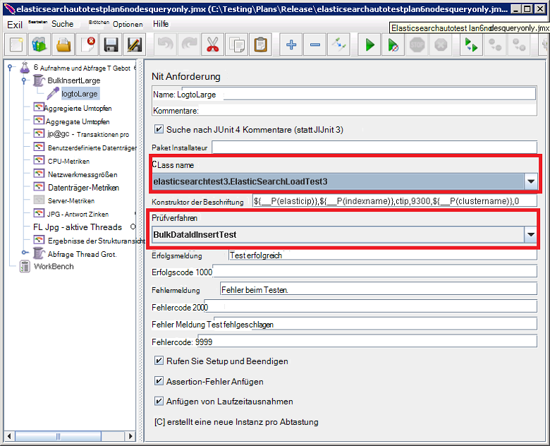

<properties
   pageTitle="Automatisierte Elasticsearch Leistungstests ausführen | Microsoft Azure"
   description="Beschreibung der wie Leistungstests in Ihrer eigenen Umgebung ausführen."
   services=""
   documentationCenter="na"
   authors="dragon119"
   manager="bennage"
   editor=""
   tags=""/>

<tags
   ms.service="guidance"
   ms.devlang="na"
   ms.topic="article"
   ms.tgt_pltfrm="na"
   ms.workload="na"
   ms.date="09/22/2016"
   ms.author="masashin"/>
   
# <a name="running-the-automated-elasticsearch-performance-tests"></a>Automatisierte Elasticsearch Leistungstests ausführen

[AZURE.INCLUDE [pnp-header](../../includes/guidance-pnp-header-include.md)]

Dieser Artikel ist [Teil einer Serie](guidance-elasticsearch.md). 

Dokumente [Optimieren Einnahme Datenverarbeitung für Elasticsearch auf Azure] und [Tuning Datenaggregation und abfrageleistung für Elasticsearch auf Azure] beschreiben eine Reihe von Leistungstests ein Beispiel Elasticsearch Cluster ausgeführt wurden.

Diese Tests wurden Skript um automatisiert ausgeführt werden können. Dieses Dokument beschreibt, wie Sie die Tests in Ihrer eigenen Umgebung wiederholen.

## <a name="prerequisites"></a>Erforderliche Komponenten

Automatisierte Tests müssen die folgenden Elemente:

-  Ein Elasticsearch-Cluster.

- Ein JMeter Setup der Umgebung wie [Performance testing Rahmenbedingungen für Elasticsearch auf Azure]Dokument.

- [Python 3.5.1](https://www.python.org/downloads/release/python-351/) JMeter Master VM installiert.


## <a name="how-the-tests-work"></a>Funktionsweise von tests
Die Tests werden JMeter verwendet. Ein Masterserver JMeter lädt einen Testplan und übergibt an eine Reihe von JMeter untergeordneten Server tatsächlich die Tests. Der Masterserver JMeter JMeter untergeordnete Server koordiniert und sammelt die Ergebnisse.

Die folgenden Testpläne stehen zur Verfügung:

* [elasticsearchautotestplan3nodes.jmx](https://github.com/mspnp/azure-guidance/blob/master/ingestion-and-query-tests/templates/elasticsearchautotestplan3nodes.jmx). Führt den Test Aufnahme über ein 3-Knoten-Cluster.

* [elasticsearchautotestplan6nodes.jmx](https://github.com/mspnp/azure-guidance/blob/master/ingestion-and-query-tests/templates/elasticsearchautotestplan6nodes.jmx). Führt den Test Aufnahme über einen Cluster mit 6 Knoten.

* [elasticsearchautotestplan6qnodes.jmx](https://github.com/mspnp/azure-guidance/blob/master/ingestion-and-query-tests/templates/elasticsearchautotestplan6qnodes.jmx). Führt den Test Aufnahme und Abfrage über einen Cluster mit 6 Knoten.

* [elasticsearchautotestplan6nodesqueryonly.jmx](https://github.com/mspnp/azure-guidance/blob/master/ingestion-and-query-tests/templates/elasticsearchautotestplan6nodesqueryonly.jmx). Führt den Test nur Abfrage über einen Cluster mit 6 Knoten.


Sie können diese Testpläne als Grundlage für eigene Szenarien benötigen Sie weniger oder mehr Knoten.

Die Testpläne verwenden Sampler Anforderung JUnit erzeugen und Hochladen der Daten. JMeter Testplan erstellt und Sampler ausgeführt und überwacht alle Elasticsearch Knoten Leistungsdaten.  

## <a name="building-and-deploying-the-junit-jar-and-dependencies"></a>Erstellen und Bereitstellen von JUnit Glas und Abhängigkeit
Vor dem Ausführen von Leistungstests, die heruntergeladen werden soll, kompilieren und Bereitstellen von JUnit Tests finden Sie unter Performance-Junitcode-Ordner. Diese Tests sind Testplan JMeter verwiesen. Weitere Informationen finden Sie im Verfahren "Einem vorhandenen Testprojekt JUnit in Eclipse importieren" im Dokument [ein JMeter JUnit-Generator für Leistungstests Elasticsearch bereitstellen].

Es gibt zwei Versionen der JUnit-Tests: 

- [Elasticsearch1.73](https://github.com/mspnp/azure-guidance/tree/master/ingestion-and-query-tests/junitcode/elasticsearch1.73). Verwenden Sie diesen Code für die Ingestion Tests durchgeführt. Diese Tests verwenden Elasticsearch 1,73.

- [Elasticsearch2](https://github.com/mspnp/azure-guidance/tree/master/ingestion-and-query-tests/junitcode/elasticsearch2). Verwenden Sie diesen Code zum Durchführen der Abfrage. Diese Tests verwenden Elasticsearch 2.1 und höher.

Kopieren Sie die entsprechende Java (JAR) Archivdatei mit der Abhängigkeit auf Ihren Computern JMeter. Der Prozess ist [ein JMeter JUnit-Generator für Leistungstests Elasticsearch][]bereitstellen beschrieben. 

> **Wichtig** Verwenden Sie nach der Bereitstellung eines JUnit-Tests JMeter laden und konfigurieren die Testpläne, die diesen Test JUnit verweisen und sicherstellen, dass die Threadgruppe BulkInsertLarge verweist auf das richtige JAR-Datei, JUnit-Klasse und Prüfverfahren:
> 
> 
> 
> Speichern der aktualisierten Testpläne vor dem Ausführen der Tests.

## <a name="creating-the-test-indexes"></a>Erstellen von Testindizes
Jeder Test führt Einnahme und/oder Abfragen für einen einzelnen Index der Testlauf. Sie erstellen mit der Schemas in den Anhängen Dokumente [Optimieren Einnahme Datenverarbeitung für Elasticsearch auf Azure] und [Tuning Datenaggregation und abfrageleistung für Elasticsearch auf Azure] beschrieben und nach Ihr Testszenario (Doc Werte aktiviert/deaktiviert, mehrere Replikate, usw.) konfigurieren Beachten Sie, dass die Testpläne Index enthält einen einzelnen Typ mit dem Namen *Ctip*.

## <a name="configuring-the-test-script-parameters"></a>Konfigurieren der Skriptparameter test
Kopieren Sie die folgenden Test Parameter Skriptdateien JMeter Server-Computer:

* [run.properties](https://github.com/mspnp/azure-guidance/blob/master/ingestion-and-query-tests/run.properties). Diese Datei gibt die Anzahl der JMeter Test Threads, die Dauer des Tests (in Sekunden), die IP-Adresse eines Knotens (oder ein Lastenausgleich im Cluster Elasticsearch) verwenden und den Namen des Clusters:

  ```ini
  nthreads=3
  duration=300
  elasticip=<IP Address or DNS Name Here>
  clustername=<Cluster Name Here>
  ```
  
  Bearbeiten Sie diese Datei, und geben Sie die entsprechenden Werte für Ihren Test und Cluster.

* [Abfrage-Config-win.ini](https://github.com/mspnp/azure-guidance/blob/master/ingestion-and-query-tests/query-config-win.ini) und [Abfrage-Config-nix.ini](https://github.com/mspnp/azure-guidance/blob/master/ingestion-and-query-tests/query-config-nix.ini). Diese beiden Dateien enthalten dieselbe Informationen. Datei *win* für Windows-Dateinamen und Pfade formatiert und der *Nix* für Linux Dateinamen und Pfade formatiert ist:

  ```ini
  [DEFAULT]
  debug=true #if true shows console logs.

  [RUN]
  pathreports=C:\Users\administrator1\jmeter\test-results\ #path where tests results are saved.
  jmx=C:\Users\administrator1\testplan.jmx #path to the JMeter test plan.
  machines=10.0.0.1,10.0.0.2,10.0.0.3 #IPs of the Elasticsearch data nodes separated by commas.
  reports=aggr,err,tps,waitio,cpu,network,disk,response,view #Name of the reports separated by commas.
  tests=idx1,idx2 #Elasticsearch index(es) name(s) to test, comma delimited if more than one.
  properties=run.properties #Name of the properties file.
  ```

  Bearbeiten Sie diese Datei, um die Speicherorte der Testergebnisse, der Name des Testplans ausgeführt, IP-Adressen Elasticsearch Datenknoten Leistungsmetriken von gesammelten Berichten mit unformatierten Leistungsdaten, die generiert werden, und den Namen (oder Namen durch Kommas getrennt) der Indizes getestet, mehrere JMeter , Tests werden nacheinander ausgeführt. Wenn die run.properties-Datei in einem anderen Ordner oder Verzeichnis befindet, geben Sie den vollständigen Pfad zu dieser Datei.

## <a name="running-the-tests"></a>Ausführen der tests

* Kopieren Sie Datei, [Abfrage-test.py](https://github.com/mspnp/azure-guidance/blob/master/ingestion-and-query-tests/query-test.py) auf dem Servercomputer JMeter in demselben Ordner wie die run.properties und Abfrage-Config-Win (Abfrage-Config-nix.ini) Dateien

* Sicherstellen Sie, dass jmeter.bat (Windows) oder jmeter.sh (Linux) auf den Pfad der ausführbaren Datei für Ihre Umgebung.

* Das Skript test.py Abfrage über die Befehlszeile zum Ausführen von Tests:

  ```cmd
  py query-test.py
  ```

* Wenn der Test abgeschlossen ist, werden die Ergebnisse mehrere durch Kommas getrennte Werte (CSV) Dateien in den Abfrage-Config-Datei "Win.ini" (Abfrage-Config-nix.ini) gespeichert. Sie können Excel analysieren und grafisch darstellen dieser Daten.


[Optimieren der Leistung von Daten Einnahme für Elasticsearch auf Azure]: guidance-elasticsearch-tuning-data-ingestion-performance.md
[Datenaggregation und Abfrageleistung für Elasticsearch auf Azure optimieren]: guidance-elasticsearch-tuning-data-aggregation-and-query-performance.md
[Erstellen einer Umgebung-Leistungstests für Elasticsearch auf Azure]: guidance-elasticsearch-creating-performance-testing-environment.md
[Bereitstellen von JMeter JUnit Sampler für Leistungstests Elasticsearch]: guidance-elasticsearch-deploying-jmeter-junit-sampler.md
